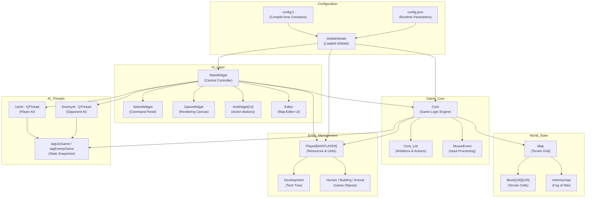
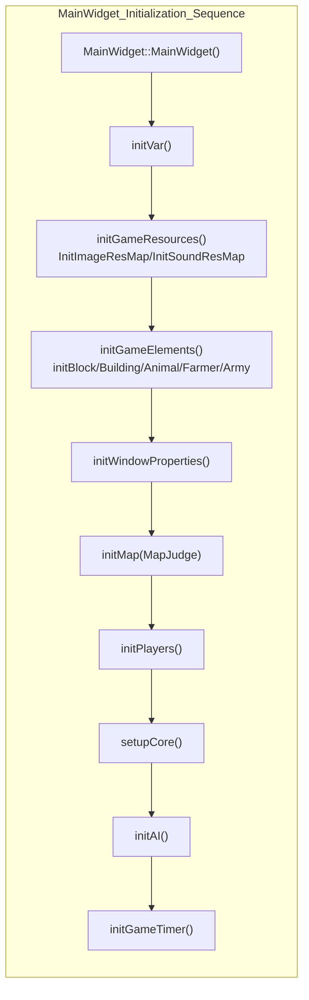
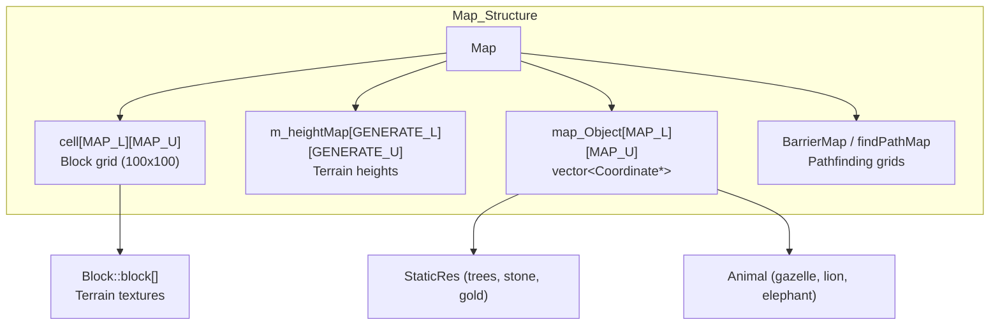
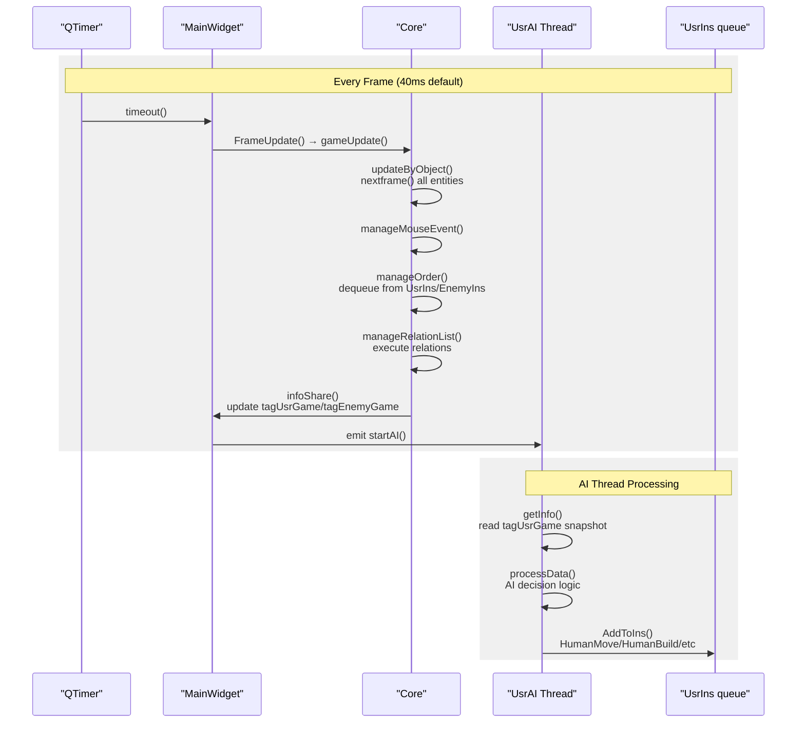
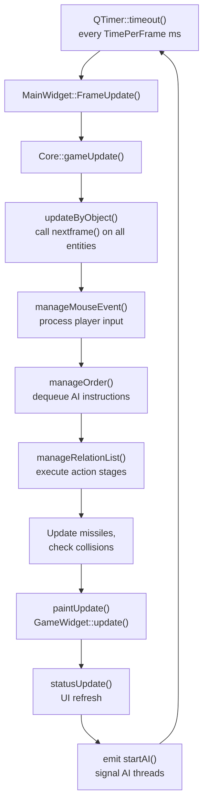
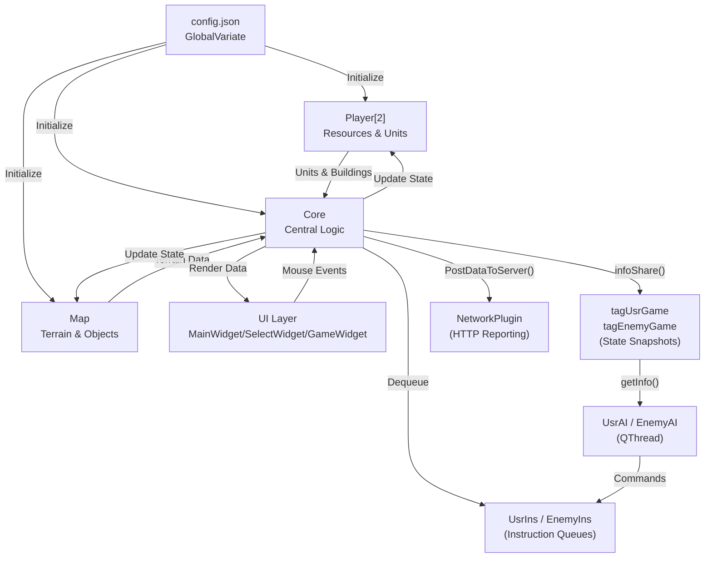

# 概述

相关源文件

以下文件被用作生成本维基页面的上下文：

- [MainWidget.cpp](MainWidget.cpp)
- [README.md](README.md)
- [config.json](config.json)

本文档对 **new-aoe** 代码库做高层介绍。该项目是一个使用 Qt 5.9.2 和 C++14 实现、风格类似《帝国时代》的实时战略（RTS）游戏。本文将概览项目目标、架构设计以及主要子系统。

如需深入了解架构设计，请参阅 [系统架构](#1.1)。如需构建方式、依赖和运行说明，请参阅 [快速开始](#1.2)。如需具体玩法系统，请查看 [游戏机制](#3) 下的页面；如需 AI 实现细节，请参阅 [AI 系统](#5)。

**来源：** [README.md:1-46](), [MainWidget.cpp:1-100]()

---

## 项目目标

**new-aoe** 是南京理工大学面向教学与研究场景设计的一款 2D 即时战略游戏。该代码库实现了：

- **资源驱动的经济系统**：玩家采集木材、食物、石头和黄金来建造建筑、训练单位
- **科技推进系统**：文明时代按石器时代 → 工具时代 → 青铜时代 → 铁器时代演进，逐步解锁新能力
- **战斗系统**：支持多种单位类型、远近程攻击、投射物物理与防御机制
- **AI 对手**：基于线程的 AI 实现，既支持玩家自动化，也支持敌方策略
- **地图编辑器**：集成地形编辑、单位摆放和场景创建工具
- **评测接口**：基于 HTTP 的数据上报能力，用于自动测试和评分

整个系统同时面向人工游玩和自动化 AI 开发，因此适合 AI 程序设计课程与对抗实验场景。

**来源：** [README.md:10-23](), [config.json:1-20]()

---

## 技术栈

| 组件 | 实现 |
|------|------|
| **框架** | Qt 5.9.2（Widgets、Multimedia 模块） |
| **语言** | C++14 |
| **图形** | 基于 QPainter 的 2D 渲染，使用等距坐标系 |
| **线程** | QThread，用于 AI、音效播放和网络操作 |
| **配置** | 双层配置：编译期 `config.h` + 运行期 `config.json` |
| **构建系统** | qmake + MinGW 5.3.0 32 位工具链 |
| **音频** | Qt Multimedia（QSoundEffect） |
| **网络** | QNetworkAccessManager，用于基于 HTTP 的评测数据上报 |

**来源：** [README.md:36-46](), [newAOE.pro](), [config.h](), [config.json:1-15]()

---

## 高层架构

系统采用**分层架构**，职责边界清晰：

**架构层说明：**

1. **UI 层**：基于 Qt Widgets 的界面组件，负责用户交互与显示
2. **游戏核心层**：管理游戏状态、关系系统和更新周期的中心逻辑引擎
3. **世界状态层**：地图数据结构、地形网格与空间信息
4. **实体管理层**：玩家资源、单位、建筑和科技发展
5. **AI 线程层**：异步 AI 处理与线程安全状态访问
6. **配置层**：编译期与运行期双层配置系统

**来源：** [MainWidget.h](), [Core.h](), [Map.h](), [Player.h](), [AI.h](), [GlobalVariate.h]()

---

## 核心子系统

### MainWidget：中央协调器

`MainWidget` 类是整个应用的集成中心，负责管理主要子系统及其生命周期：

初始化顺序 [MainWidget.cpp:94-152]() 保证依赖次序正确：资源 → 游戏元素 → 地图 → 玩家 → Core → AI → 定时器。

**关键职责：**
- 管理 `Core`、`Map`、`Player[]`、`UsrAI`、`EnemyAI` 的生命周期
- 协调 UI 组件：`SelectWidget`、`GameWidget`、`ActWidget[]`、`Editor`
- 通过 `QTimer` 的 `FrameUpdate()` 槽函数进行逐帧更新分发
- 集成地图编辑器，支持地形修改与单位摆放
- 处理单位引用清理和敌方状态维护

详细内容见 [MainWidget 与游戏循环](#2.1)。

**来源：** [MainWidget.cpp:94-276](), [MainWidget.cpp:1278-1474]()

---

### Core：游戏逻辑引擎

`Core` 类实现主游戏循环，并管理所有运行时游戏逻辑：

| 职责 | 实现 |
|------|------|
| **帧更新** | 每帧由定时器调用 `gameUpdate()` |
| **对象更新** | `updateByObject()` 遍历全部实体并调用 `nextframe()` |
| **输入处理** | `manageMouseEvent()` 处理玩家鼠标交互 |
| **AI 指令处理** | `manageOrder()` 从线程安全队列中取出 AI 指令 |
| **关系执行** | `manageRelationList()` 处理移动、建造、攻击等持续动作 |
| **状态共享** | `infoShare()` 向 AI 线程发布状态快照 |

`Core_List` 负责维护关系系统，用于跟踪“谁正在对谁做什么”：
- `relate_AllObject`：记录每个对象当前动作及目标
- `relation_Event_static`：定义动作阶段链，例如移动 → 路径规划 → 行走 → 到达
- `addRelation()`、`suspendRelation()`、`eraseRelation()`：关系生命周期管理

完整说明见 [游戏核心引擎](#2.2)。

**来源：** [Core.h](), [Core.cpp](), [Core_List.h](), [Core_List.cpp]()

---

### 地图与世界表示

游戏世界使用**基于方块的网格**以及等距坐标系：

**坐标系统：**
- **Block 坐标**：整数网格位置，范围为 `0` 到 `MAP_L-1`、`MAP_U-1`
- **Detail 坐标（DR/UR）**：世界中的像素级精确位置
- **换算关系**：每个 block 的像素长度为 `BLOCKSIDELENGTH = 35.777` [config.json:25]()

**地图关键组件：**
- `Block[MAP_L][MAP_U]`：保存地形类型、高度、纹理和可见性
- `map_Object[][]`：对象的空间索引
- `staticres`：不可移动资源列表，如石头、黄金、树木、鱼
- `animal`：野生动物实体列表
- `loadBarrierMap()` 与 `loadfindPathMap()` 生成寻路数据

地图与寻路细节见 [地图结构](#6.1) 和 [地形与对象](#6.2)。

**来源：** [Map.h](), [Map.cpp](), [Block.h](), [config.json:25-28]()

---

### 玩家与资源管理

每个 `Player` 实例维护一个阵营的完整状态：

| 组件 | 说明 |
|------|------|
| `build` | 拥有的建筑 `list<Building*>` |
| `human` | 拥有的单位 `list<Human*>`（农民与军队） |
| `missile` | 飞行中的投射物 `list<Missile*>` |
| `Wood/Meat/Stone/Gold` | 四种资源池 |
| `dev` | 指向 `Development`（科技树）的指针 |

**资源流转：**
1. 农民通过 `HumanAction()` 从 `StaticRes` 或 `Animal` 中采集资源
2. 资源存入 `Building_Resource`（如粮仓、仓库）
3. `Player::changeResource()` 负责校验并更新资源池
4. 建筑与单位在建造/训练前会调用 `Development::conditionDevelop()` 检查条件
5. 科技研究通过 `get_rate_*()` 系列方法改变采集速度、负载上限等参数

经济系统细节见 [资源与经济系统](#3.1)。

**来源：** [Player.h](), [Player.cpp](), [Development.h](), [Development.cpp]()

---

### AI 与命令系统

AI 在独立的 `QThread` 中运行，采用生产者 - 消费者架构：

**命令接口：**

AI 通过五个封装函数 [AI.h:90-120]() 与系统交互：
- `HumanMove(SN, DR0, UR0)`：让单位移动到指定坐标
- `HumanBuild(SN, BuildingNum, BlockDR, BlockUR)`：建造建筑
- `HumanAction(SN, obSN)`：执行采集、攻击、卸载等动作
- `BuildingAction(buildingSN, Action)`：研究科技或训练单位
- `PinPointStrike(SN, DR0, UR0)`：投石类单位的区域打击

这些操作会序列化为 `instruction` 结构，进入线程安全的 `ins` 队列，并由 `Core::manageOrder()` 在每帧处理。

AI 架构和指令细节见 [AI 架构](#5.1) 与 [指令与命令系统](#5.2)。

**来源：** [AI.h](), [AI.cpp](), [UsrAI.h](), [EnemyAI.h](), [Core.cpp]()

---

## 游戏循环与更新周期

游戏运行在由 `QTimer` 驱动的**固定步长循环**上：

**帧时序：**
- 默认 `TimePerFrame = 40` ms（25 FPS）[config.json:4]()
- 可通过 `FRAMES_PER_SECOND` 参数调整
- 定时器类型为 `Qt::PreciseTimer`，保证精度

**更新顺序：**
1. 全部实体更新自身状态（`nextframe()`）
2. 处理玩家鼠标事件
3. 取出并校验 AI 指令
4. 推进关系系统中的动作阶段
5. 处理物理逻辑（投射物、碰撞）
6. 触发渲染
7. 发送新的状态快照给 AI 线程

这种严格顺序可避免竞态并保持行为确定性。

详细说明见 [MainWidget 与游戏循环](#2.1)。

**来源：** [MainWidget.cpp:1372-1380](), [Core.cpp](), [config.json:4-5]()

---

## 配置系统

代码库采用**双层配置**方式：

### 编译期配置（config.h）

定义各种枚举和类型常量：
- 建筑类型：`BUILDING_CENTER`、`BUILDING_GRANARY`、`BUILDING_ARMYCAMP` 等
- 单位类型：`AT_CLUBMAN`、`AT_BOWMAN`、`AT_SCOUT` 等
- 资源类型：`RESOURCE_WOOD`、`RESOURCE_STONE`、`RESOURCE_GOLD` 等
- 动作类型：`BUILDING_CENTER_CREATEFARMER`、`BUILDING_ARMYCAMP_CREATE_CLUBMAN` 等
- 地图常量：`MAPTYPE_FLAT`、`MAPTYPE_OCEAN`、`MAPHEIGHT_FLAT` 等

**来源：** [config.h:1-300]()

### 运行期配置（config.json）

启动时加载 400+ 个平衡参数：

| 类别 | 示例参数 |
|------|----------|
| **游戏设置** | `GAME_WIDTH`、`GAME_HEIGHT`、`MAP_L`、`MAP_U`、`TimePerFrame` |
| **初始资源** | `INITIAL_WOOD: 200`、`INITIAL_MEAT: 200`、`INITIAL_GOLD: 150` |
| **单位属性** | `BLOOD_FARMER: 25`、`SPEED_CLUBMAN1: 2.439`、`ATK_BOWMAN: 3` |
| **建筑成本** | `BUILD_CENTER_WOOD: 200`、`TIME_BUILD_ARMYCAMP: 30` |
| **采集参数** | `FARMER_GATHERSPEED_WOOD: 0.02`、`FARMER_CARRYLIMIT_WOOD: 10` |
| **科技成本** | `BUILDING_STOCK_UPGRADE_DEFENSE_INFANTRY_FOOD: 75` |
| **评测配置** | `GameServerAddr`、`IsExamining`、`DataPostIntervalFrame` |

这些参数由 `GlobalVariate::ReadConfig()` [GlobalVariate.cpp]() 通过 `Q_COREAPP_STARTUP_FUNCTION` 机制加载，确保在事件循环开始前完成初始化。

配置详情见 [配置系统](#2.3)。

**来源：** [config.json:1-471](), [GlobalVariate.h](), [GlobalVariate.cpp]()

---

## 数据流概览

下图展示了游戏状态如何在系统中流转：

**来源：** [MainWidget.cpp](), [Core.cpp](), [GlobalVariate.cpp](), [AI.cpp]()

---

## 快速参考：关键类与文件

| 系统 | 主要类 | 关键文件 |
|------|--------|----------|
| **应用入口** | `main()`、`QApplication` | [main.cpp]() |
| **中央控制** | `MainWidget` | [MainWidget.h](), [MainWidget.cpp]() |
| **游戏逻辑** | `Core`、`Core_List` | [Core.h](), [Core.cpp](), [Core_List.h]() |
| **世界状态** | `Map`、`Block` | [Map.h](), [Map.cpp](), [Block.h]() |
| **玩家** | `Player`、`Development` | [Player.h](), [Player.cpp](), [Development.h]() |
| **单位** | `Human`、`Farmer`、`Army` | [Human.h](), [Farmer.h](), [Army.h]() |
| **建筑** | `Building`、`Building_Resource` | [Building.h](), [Building.cpp]() |
| **AI** | `AI`、`UsrAI`、`EnemyAI` | [AI.h](), [UsrAI.h](), [EnemyAI.h]() |
| **UI 组件** | `SelectWidget`、`GameWidget`、`ActWidget` | [SelectWidget.h](), [GameWidget.h](), [ActWidget.h]() |
| **配置** | `GlobalVariate` | [config.h](), [config.json](), [GlobalVariate.h]() |
| **工具组件** | `EventFilter`、`Logger`、`NetworkPlugin` | [EventFilter.h](), [Logger.h](), [networkplugin.h]() |

**来源：** 所有上文引用的头文件与实现文件

---

## 后续阅读

- 如需架构深挖，请继续阅读 [系统架构](#1.1)
- 如需构建与环境准备，请查看 [快速开始](#1.2)
- 如需了解资源、科技树和战斗等玩法系统，请阅读 [游戏机制](#3)
- 如需进行 AI 开发，请查看 [AI 系统](#5) 以及外部文档 `AI接口使用指南.md`
- 如需查看地图相关数据结构，请参阅 [地图与世界](#6)
