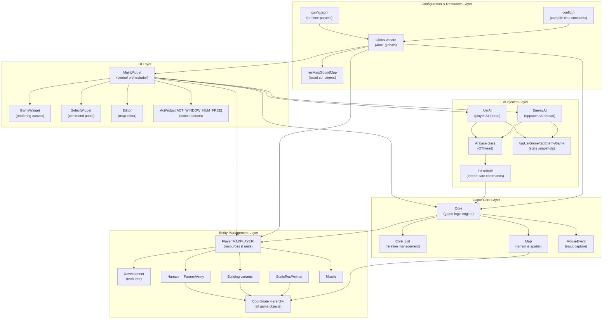
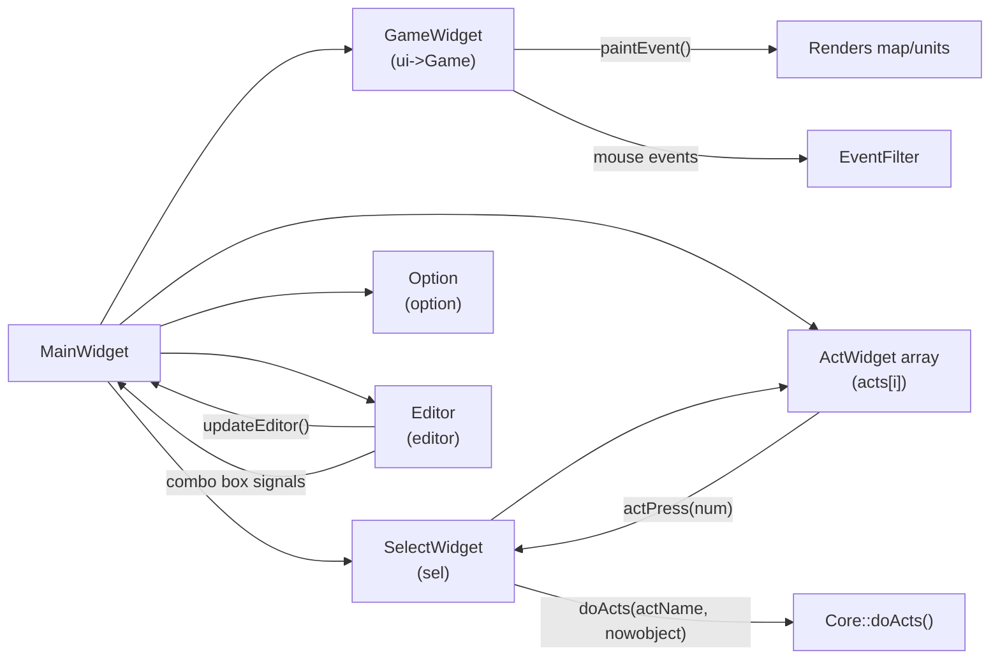
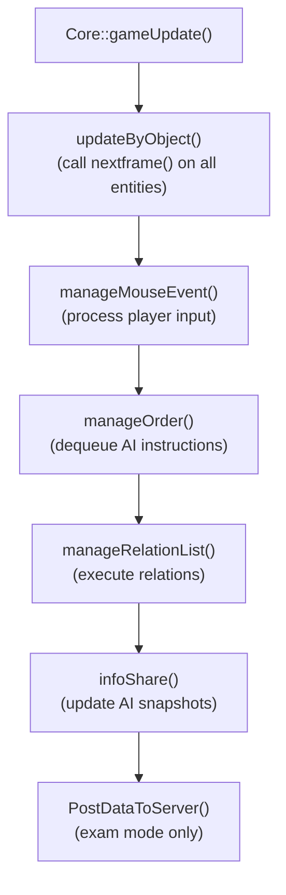
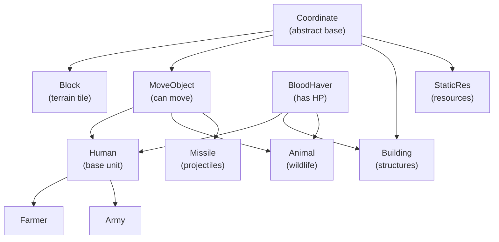
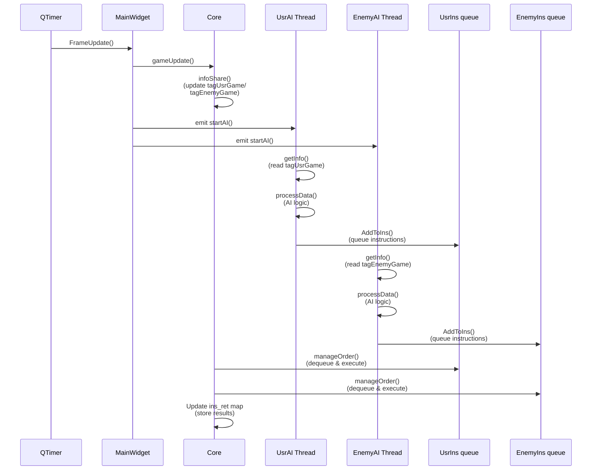
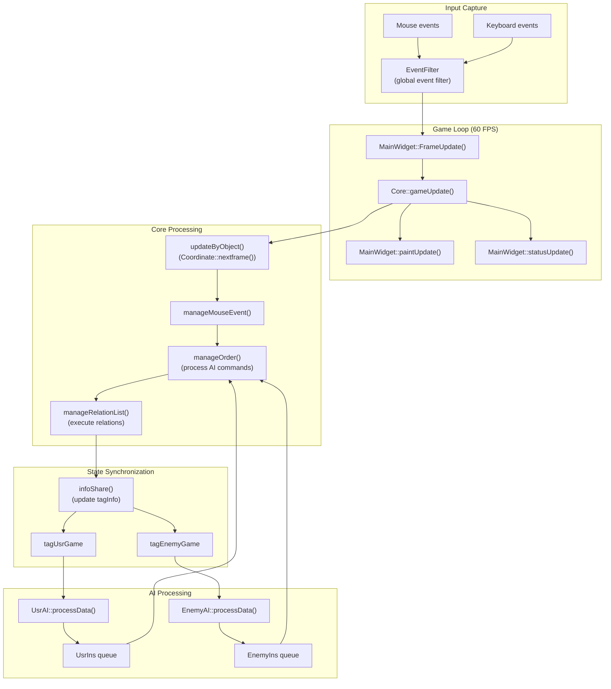

# 系统架构

<details>
<summary>相关源文件</summary>

以下文件被用作生成本维基页面的上下文：

- [GlobalVariate.h](GlobalVariate.h)
- [MainWidget.cpp](MainWidget.cpp)
- [MainWidget.h](MainWidget.h)
- [README.md](README.md)

</details>


## 目的与范围

本文描述 new-aoe 实时战略游戏的分层架构，解释主要子系统的组织方式以及它们之间的协作关系。文档覆盖五个核心架构层：UI 层、游戏核心层、实体管理层、AI 系统层，以及配置与资源层。若想进一步了解具体子系统：

- 关于主游戏循环与 MainWidget 的协调角色，见 [MainWidget 与游戏循环](#2.1)
- 关于 Core 引擎内部逻辑，见 [游戏核心引擎](#2.2)
- 关于配置加载机制，见 [配置系统](#2.3)
- 关于 AI 线程通信与指令处理，见 [AI 架构](#5.1)

**来源：** [MainWidget.cpp:1-276](), [MainWidget.h:1-282](), [README.md:229-268]()

## 架构总览

系统采用严格的分层架构，`MainWidget` 作为中央集成枢纽，通过明确接口协调各个子系统。



**来源：** [MainWidget.h:26-268](), [Core.h:1-100](), [Player.h:1-50](), [AI.h:1-80](), [GlobalVariate.h:1-100]()

## UI 层

UI 层负责所有用户交互与渲染，`MainWidget` 作为顶层控制器统筹此层。

### MainWidget 的中央编排作用

`MainWidget` 是系统的主要集成点（重要性评分 10.45），负责初始化并协调全部子系统。在 [MainWidget.cpp:94-276]() 的构造过程中，它执行一条严格的初始化链：

| 初始化阶段 | 方法 | 创建的组件 |
|------------|------|------------|
| 变量 | `initVar()` | 基础状态变量 |
| 编辑器 | `initEditor()` | `currentSelected` 与编辑器 UI 状态 |
| 游戏资源 | `initGameResources()` | 通过 `GlobalVariate` 加载图片与声音 |
| 游戏元素 | `initGameElements()` | 创建坐标体系中的对象 |
| 窗口属性 | `initWindowProperties()` | 从 `config.json` 读取窗口尺寸与标题 |
| 选项 | `initOptions()` | 设置对话框 |
| 信息面板 | `initInfoPane()` | 实例化 `SelectWidget` |
| 定时器 | `initGameTimer()` | 为 `FrameUpdate()` 槽函数创建 `QTimer` |
| 玩家 | `initPlayers()` | 分配 `Player[MAXPLAYER]` 数组 |
| 地图 | `initMap(MapJudge)` | 构造 `Map` 并加载地形 |
| Core | `setupCore()` | 创建 `Core` 引擎 |
| AI | `initAI()` | 创建 `UsrAI` 与 `EnemyAI` 线程 |

[MainWidget.cpp:117]() 的定时器连接驱动整个游戏循环：

```cpp
connect(timer, &QTimer::timeout, this, &MainWidget::FrameUpdate);
```

**来源：** [MainWidget.cpp:94-276](), [MainWidget.h:30-60]()

### UI 组件关系



`SelectWidget` 在 [MainWidget.h:40]() 处通过 `ActWidget[ACT_WINDOW_NUM_FREE]` 数组展示选中单位信息及动作按钮。用户点击后会触发对 `Core` 的 `doActs()` 调用。

**来源：** [MainWidget.h:164-173](), [SelectWidget.h:1-50](), [ActWidget.h:1-30]()

## 游戏核心层

游戏核心层实现核心游戏逻辑，并管理全部玩法状态。

### Core 引擎职责

位于 [Core.h:1-100]() 的 `Core` 类是游戏状态的唯一事实来源。每一帧中，`gameUpdate()` 会执行以下操作：



`Core_List` 通过 [Core_List.h:1-50]() 中的 `relate_AllObject` 映射管理对象关系，记录每个对象当前正在执行的动作：

- 键：`Coordinate*`，即执行动作的对象
- 值：`Relate` 结构，包含目标对象 SN、当前动作阶段和关系类型

**来源：** [Core.cpp:1-500](), [Core_List.cpp:1-400](), [Core.h:1-100]()

### 地图与空间系统

[Map.h:1-80]() 中的 `Map` 类维护如下数据：

- `Block cell[MAP_L][MAP_U]`：二维地形块网格
- `vector<StaticRes*> staticres`：资源点（树木、石头、黄金）
- `vector<Animal*> animal`：野生动物
- `vector<vector<Coordinate*>> map_Object[MAP_L][MAP_U]`：按 block 划分的对象列表，用于碰撞检测

坐标系统如下：

| 系统 | 单位 | 用途 | 换算 |
|------|------|------|------|
| Block 坐标 | 整数 block | 地形网格索引 | `blockDR`、`blockUR` |
| Detail 坐标 | 浮点像素 | 精确单位位置 | `DR`、`UR` |
| 换算关系 | - | - | `DR / BLOCKSIDELENGTH = blockDR` |

**来源：** [Map.h:1-80](), [Map.cpp:1-300](), [Block.h:1-50](), [Coordinate.h:1-100]()

## 实体管理层

### 玩家资源管理

[Player.h:1-50]() 中的每个 `Player` 实例负责：

- **资源池**：`Wood`、`Meat`、`Stone`、`Gold`
- **单位集合**：`list<Building*> build`、`list<Human*> human`、`list<Missile*> missile`
- **人口**：当前人口与人口上限
- **科技**：`Development* development`，保存科技树状态

资源变更通过 [Player.cpp:50-100]() 中的 `changeResource(int sort, int change)` 完成，它会先校验非负约束，再更新对应资源值。

**来源：** [Player.h:1-50](), [Player.cpp:1-200]()

### Coordinate 继承体系

所有游戏对象都继承自 [Coordinate.h:1-100]() 中的 `Coordinate`，形成如下继承树：



`Coordinate` 中定义的关键虚函数包括：

- `getSort()`：返回 `SORT_BUILDING`、`SORT_FARMER`、`SORT_ARMY` 等类别
- `nextframe()`：逐帧更新逻辑
- `getVision()`：战争迷雾视野范围
- `setAction(int action)`：切换当前动作状态
- `get_isActionEnd()`：查询当前动作是否结束

**来源：** [Coordinate.h:1-100](), [MoveObject.h:1-80](), [BloodHaver.h:1-60](), [Human.h:1-100]()

### Development 系统集成

[Development.h:1-150]() 中的 `Development` 类通过 `conditionDevelop` 链表实现科技修正。每个玩家的单位都会向其绑定的 `Development` 实例查询属性加成：

| 查询方法 | 作用 | 示例 |
|----------|------|------|
| `get_rate_speed()` | 速度倍率 | `baseSpeed * dev->get_rate_speed()` |
| `get_addition_blood()` | 生命值加成 | `baseHP + dev->get_addition_blood()` |
| `get_addition_atk()` | 攻击加成 | `baseATK + dev->get_addition_atk()` |
| `get_rate_gatherSpeed()` | 采集速度倍率 | 由 `Farmer` 使用 |

**来源：** [Development.h:1-150](), [Development.cpp:1-300](), [Human.cpp:50-150]()

## AI 系统层

### 多线程 AI 架构

AI 系统采用生产者 - 消费者模式，并严格隔离线程：



**来源：** [AI.h:1-80](), [UsrAI.h:1-50](), [EnemyAI.h:1-50](), [Core.cpp:300-400]()

### 指令流

AI 线程通过 [GlobalVariate.h:793-797]() 中定义的线程安全 `ins` 结构与 `Core` 通信：

```cpp
struct ins {
    int g_id = 0;
    std::queue<instruction> instructions;
    QMutex lock;
};
```

[GlobalVariate.h:765-791]() 中的 `instruction` 结构支持五类命令：

- **Type 0**：取消当前动作
- **Type 1**：移动到坐标（`HumanMove`）
- **Type 2**：对对象执行动作（`HumanAction`）
- **Type 3**：建造建筑（`HumanBuild`）
- **Type 4**：建筑动作（`BuildingAction`）
- **Type 5**：定点打击（`PinPointStrike`）

[GlobalVariate.h:857]() 中的 `ins_ret` 映射返回执行结果：

| 代码 | 含义 |
|------|------|
| 0 | 成功 |
| -1 | 未找到 SN |
| -2 | 未找到动作 |
| -3 | 越界 |
| -4 | 未找到目标 SN |
| -5 | 建筑类型非法 |
| -6 | 资源不足 |

**来源：** [GlobalVariate.h:765-797](), [AI.cpp:1-300](), [Core_List.cpp:200-400]()

## 配置与资源层

### 双层配置系统

系统采用两层配置策略：

**编译期（`config.h`）**：
- 枚举：`BUILDING_*`、`AT_ARMY`、`RESOURCE_*` 等
- 动作常量：`ACT_BUILD_HOUSE`、`ACT_CREATEFARMER` 等
- 地图尺寸：`MAP_L`、`MAP_U`（可被 JSON 覆盖）
- 类型定义与辅助宏

**运行期（`config.json`）**：
- 通过 [GlobalVariate.cpp:1-100]() 中的 `ReadConfig()` 加载游戏参数
- 初始资源：`INITIAL_WOOD`、`INITIAL_MEAT` 等
- 单位属性：`BLOOD_FARMER`、`SPEED_CLUBMAN1` 等
- 建筑成本：`BUILD_CENTER_WOOD`、`TIME_BUILD_GRANARY` 等
- 采集参数：`FARMER_GATHERSPEED_WOOD`、负重上限、建造速度

[GlobalVariate.cpp:1]() 通过 `Q_COREAPP_STARTUP_FUNCTION` 在 Qt 事件循环启动前执行 `ReadConfig()`，并填充 [GlobalVariate.h:14-527]() 中声明的 400+ 个全局变量。

**来源：** [config.h:1-200](), [config.json:1-100](), [GlobalVariate.h:14-527](), [GlobalVariate.cpp:1-200]()

### 资源加载

资源初始化分两个阶段完成：

1. **图像资源**（[GlobalVariate.cpp:200-300]() 中的 `InitImageResMap()`）
   - 将全部 `QPixmap` 加载到 `resMap`（`map<string, list<QPixmap>>`）
   - 根据透明通道生成 `pixMemoryMap` 碰撞网格
   - 生成翻转、灰化、黑化等派生版本

2. **音频资源**（[GlobalVariate.cpp:400-450]() 中的 `InitSoundResMap()`）
   - 填充 `SoundMap`（`map<string, QSoundEffect*>`）
   - 由 `soundQueue` 配合 `SoudPlayThread` 异步播放

**来源：** [GlobalVariate.cpp:200-450](), [soudplaythread.h:1-50](), [soudplaythread.cpp:1-100]()

## 数据流整合

下图展示了一个典型游戏帧中数据如何在系统里流动：



**来源：** [MainWidget.cpp:500-600](), [Core.cpp:100-300](), [EventFilter.cpp:1-200](), [AI.cpp:100-200]()

### 帧更新顺序

[MainWidget.cpp:500-550]() 中，每一帧依次执行：

1. **游戏数据更新**（`gameDataUpdate()`）：调用 `core->gameUpdate()`
2. **绘制更新**（`paintUpdate()`）：触发 `ui->Game->update()`
3. **状态栏更新**（`statusUpdate()`）：刷新资源显示与小地图
4. **AI 唤醒**：`emit startAI()`，启动 AI 线程处理

[Core.cpp:100-200]() 中的 `Core::gameUpdate()` 严格按以下顺序处理：

- 对象更新（移动、攻击、采集等）
- 玩家输入（来自 `MouseEvent` 缓冲）
- AI 指令（来自 `UsrIns` 和 `EnemyIns` 队列）
- 关系执行（如建造等跨多帧动作）
- 为 AI 生成新的状态快照

**来源：** [MainWidget.cpp:500-600](), [Core.cpp:100-300]()
