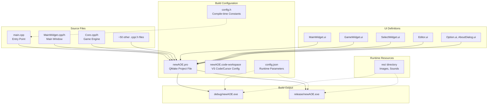
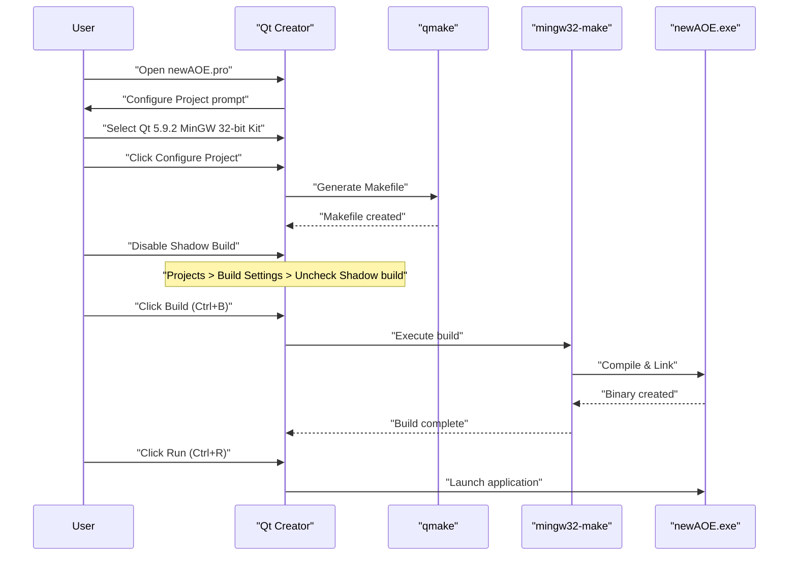
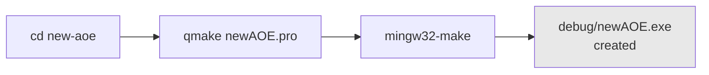
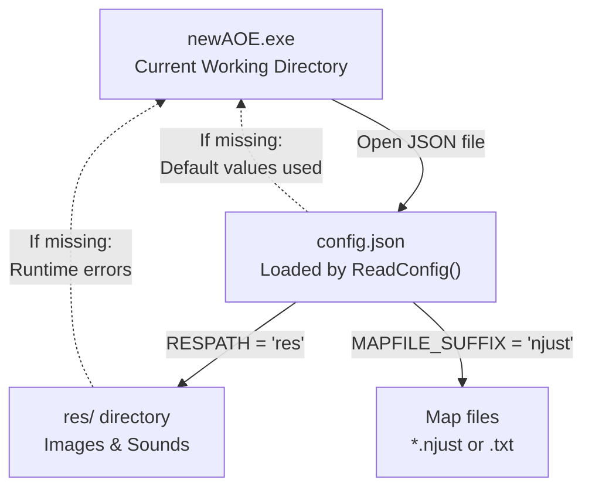
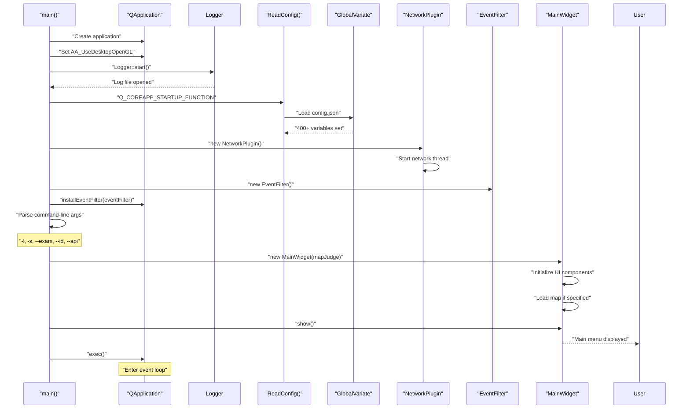
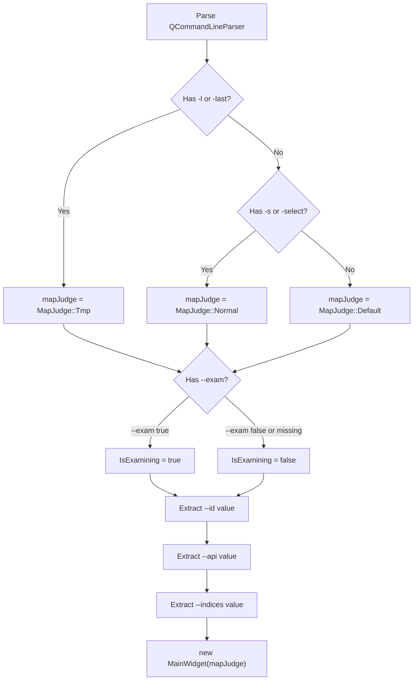

# 快速开始

<details>
<summary>相关源文件</summary>

以下文件被用作生成本维基页面的上下文：

- [README.md](README.md)
- [config.json](config.json)

</details>


本页提供构建并运行 new-aoe 游戏的分步说明，涵盖依赖安装、编译流程与初始配置。关于整体架构，请参阅 [系统架构](#1.1)；关于游戏核心或 AI 等具体子系统，请从 [核心系统](#2) 开始继续阅读。

---

## 前置条件

new-aoe 依赖以下开发环境：

| 依赖 | 版本 / 说明 | 用途 |
|------|-------------|------|
| **Qt 框架** | 5.9.2（推荐） | 核心 UI 框架与多媒体支持 |
| **编译器** | MinGW 5.3.0 32 位 | C++ 编译工具链 |
| **C++ 标准** | C++14 | 项目使用的语言特性 |
| **Qt 模块** | core、gui、widgets、multimedia | 必需组件 |
| **构建系统** | qmake | 处理项目文件并生成 Makefile |

**平台支持**：项目主要在 Windows + MinGW 环境下开发和测试。虽然使用了 Qt 的跨平台 API，但在 Linux / macOS 上尚未充分验证。

**典型 Qt 安装路径**：`C:/ProgramData/Qt5.9.2/5.9.2/mingw53_32`

**来源：** [README.md:36-46](), [newAOE.pro:1-15]()

---

## 构建相关项目结构

理解构建流程时涉及的关键文件：



**关键构建文件**

`newAOE.pro` 是项目的核心构建描述文件：

- **第 1 行**：`QT += core gui`，声明需要的 Qt 模块
- **第 5 行**：`greaterThan(QT_MAJOR_VERSION, 4): QT += widgets`，为 Qt 5+ 启用 Widgets
- **第 7 行**：`QT += multimedia`，启用声音支持
- **第 9 行**：`CONFIG += c++14`，设置 C++14 标准
- **第 13-38 行**：列出所有 `.cpp` 源文件
- **第 40-66 行**：列出所有 `.h` 头文件
- **第 68-73 行**：列出所有 `.ui` 表单文件

**来源：** [newAOE.pro:1-73](), [README.md:95-114]()

---

## 构建方式一：Qt Creator

Qt Creator 是 Qt 官方 IDE，也是最完整、最稳妥的开发体验。

### 配置步骤



### 详细流程

1. **克隆仓库**
   ```bash
   git clone https://github.com/hackermmzz/new-aoe
   cd new-aoe
   ```

2. **在 Qt Creator 中打开项目**
   - 启动 Qt Creator
   - 选择 File → Open File or Project
   - 打开 `newAOE.pro`

3. **配置 Kit**
   - 选择 Qt 5.9.2 + MinGW 5.3.0 32 位 Kit
   - 点击 “Configure Project”

4. **关闭 Shadow Build**（关键）
   - 左侧栏进入 “Projects”
   - 打开 “Build Settings”
   - 找到 “Build directory”
   - **取消勾选 “Shadow build”**

   **原因**：Shadow Build 会把可执行文件放进单独目录，导致 `config.json` 和 `res/` 的相对路径失效。游戏默认假设这些文件与可执行文件位于同一工作目录体系下。

5. **构建项目**
   - Build → Build Project "newAOE"（`Ctrl+B`）
   - 观察 “Compile Output” 输出是否有错误

6. **运行**
   - Build → Run（`Ctrl+R`）
   - 应出现游戏窗口

**预期输出位置**：`debug/newAOE.exe` 或 `release/newAOE.exe`，取决于构建配置。

**来源：** [README.md:59-69](), [README.md:95-106]()

---

## 构建方式二：Cursor / VS Code

该方式适合偏好现代编辑器的开发者，通过 Visual Studio Code 或 Cursor 配合 Qt 扩展进行构建。

### 工作区配置

项目自带 `newAOE.code-workspace`，通常已经预设：

- Qt kit 路径
- qmake 与 make 构建任务
- 调试配置
- 推荐扩展

### 配置步骤

1. **打开工作区**
   ```
   File → Open Workspace from File
   Select: newAOE.code-workspace
   ```

2. **安装推荐扩展**
   - C/C++（Microsoft）
   - CMake Tools
   - Qt 相关扩展（如可用）

3. **配置 Qt 环境**

   如果你的 Qt 安装路径不同，需要修改 `newAOE.code-workspace`：

   ```json
   "settings": {
     "cmake.configureSettings": {
       "CMAKE_PREFIX_PATH": "C:/ProgramData/Qt5.9.2/5.9.2/mingw53_32"
     }
   }
   ```

4. **执行构建任务**

   工作区中通常包含两类任务：

   - **qmake & make**：Debug 构建
   - **qmake & make release**：Release 构建

   执行方式：

   ```
   Ctrl+Shift+P → Tasks: Run Task → Select build task
   ```

5. **调试配置**

   按 `F5` 可启动预设调试器：

   - 配置名通常为 “Qt Debug”
   - 使用 GDB 附加到构建后的可执行文件
   - 支持在 `.cpp` 文件中下断点

### 构建任务实际执行内容

Debug 任务：

```bash
qmake newAOE.pro
mingw32-make
```

Release 任务：

```bash
qmake newAOE.pro CONFIG+=release
mingw32-make
```

**来源：** [README.md:71-79](), [README.md:113](), [CURSOR_QT_开发指南.md:1-33]()

---

## 构建方式三：命令行

适用于自动化构建、CI/CD 流程或习惯终端操作的开发者。

### 环境准备

项目可能附带 `qt-env.bat` 用于设置环境变量。否则需要手动把 Qt 的 `bin` 目录加入 `PATH`：

```bash
set PATH=C:\ProgramData\Qt5.9.2\5.9.2\mingw53_32\bin;%PATH%
```

检查环境：

```bash
qmake -version
# 应看到：QMake version 3.1
```

### 构建命令



**Debug 构建**：

```bash
cd path/to/new-aoe
qmake newAOE.pro
mingw32-make
```

**Release 构建**：

```bash
qmake newAOE.pro CONFIG+=release
mingw32-make
```

**清理后重建**：

```bash
mingw32-make clean
qmake newAOE.pro
mingw32-make
```

### 构建产物

- **Debug**：`debug/newAOE.exe`（带调试符号，体积较大）
- **Release**：`release/newAOE.exe`（体积更小，经过优化）

**来源：** [README.md:81-92]()

---

## 首次运行配置

### 必需文件与目录结构

运行前请确保存在如下结构：

```text
new-aoe/
├── debug/                    (或 release/)
│   └── newAOE.exe           ← 可执行文件
├── config.json              ← 需与运行目录匹配
├── res/                     ← 资源目录
│   ├── [image files]
│   └── [sound files]
└── [optional map files]
```

### 关键点：文件放置位置

游戏通过可执行文件所在目录的**相对路径**定位资源。`main.cpp` 与 `GlobalVariate.cpp` 的初始化逻辑如下：



`config.json` 中的关键配置包括：

| 键 | 默认值 | 用途 |
|----|--------|------|
| `RESPATH` | `"res"` | 图像与音频资源目录 |
| `MAPFILE_SUFFIX` | `"njust"` | 地图文件扩展名 |
| `GAME_WIDTH` | `1920` | 主窗口宽度 |
| `GAME_HEIGHT` | `1000` | 主窗口高度 |
| `TimePerFrame` | `40` | 每帧毫秒数（25 FPS） |
| `NOWPLAYER` | `2` | 玩家数量（你 + AI） |

### 推荐运行方式

**推荐**：从项目根目录运行，而不是从 `debug/` 或 `release/` 目录直接启动：

```bash
cd new-aoe
./debug/newAOE.exe
```

这样能确保相对路径正确。

**替代方式**：把 `config.json` 和 `res/` 复制到输出目录中：

```bash
cp config.json debug/
cp -r res debug/
cd debug
./newAOE.exe
```

**来源：** [config.json:1-471](), [README.md:105-106](), [GlobalVariate.cpp:1-50]()

---

## 验证安装结果

### 预期启动流程

程序成功启动时，会执行如下初始化序列：



### 正常启动后应看到

1. **主菜单窗口**
   - 标题："Age of Empires"（来自 `config.json` 的 `GAME_TITLE`）
   - 尺寸：1920×1000（来自 `GAME_WIDTH` 和 `GAME_HEIGHT`）
   - 按钮："开始游戏"、"选项"、"关于"、"编辑器"

2. **控制台 / 日志输出**
   - 日志系统初始化信息
   - 配置加载成功信息
   - 不应出现缺失文件错误

3. **资源加载**
   - 如果 `res/` 缺失，会报缺少图片等运行时错误
   - 可通过控制台或 `debug.log` 检查 `QPixmap::load()` 失败信息

### 常见问题

| 现象 | 常见原因 | 解决方案 |
|------|----------|----------|
| “config.json not found” | 启动目录错误 | 把 config.json 复制到 exe 目录，或从项目根目录启动 |
| 图片缺失 / 黑屏 | 找不到 `res/` 目录 | 确保 `res/` 相对 exe 路径存在 |
| 窗口不显示 | Qt DLL 未在 PATH 中 | 从 Qt Creator 启动，或补全 Qt bin 路径 |
| “Cannot create file” | 权限不足 | 在非系统目录中运行 |
| 启动崩溃 | Qt 版本错误 | 使用 Qt 5.9.2 重新构建 |

### 验证清单

- [ ] 主菜单能正常显示
- [ ] 窗口标题与尺寸正确
- [ ] 控制台没有缺失配置错误
- [ ] 控制台没有缺失资源错误
- [ ] 能点击“开始游戏”进入游戏视图
- [ ] 能打开“选项”和“关于”对话框

**来源：** [main.cpp:1-120](), [MainWidget.cpp:1-200](), [Logger.cpp:1-100]()

---

## 命令行参数

游戏支持若干高级参数：

| 参数 | 格式 | 用途 |
|------|------|------|
| `-l` 或 `-last` | Flag | 从 `tmpMap.txt` 加载上一次地图 |
| `-s` 或 `-select` | Flag | 从 `gameMap.txt` 加载指定地图 |
| `--exam` | `--exam true/false` | 开关考试模式 |
| `--indices` | `--indices N` | 评测系统数据库索引 |
| `--id` | `--id STUDENT_ID` | 评测学生 ID |
| `--api` | `--api KEY` | 评测服务器 API Key |

**示例**：

```bash
# 加载上一次地图
./newAOE.exe -l

# 加载指定地图
./newAOE.exe -s

# 带学生 ID 的考试模式
./newAOE.exe --exam true --id 12345 --api secretkey
```

### 参数处理流程

参数在 `main.cpp` 第 80-120 行附近解析：



**来源：** [main.cpp:80-120](), [README.md:290-298]()

---

## 后续阅读

成功构建并运行后，建议继续：

1. 阅读 [系统架构](#1.1)，理解主要组件之间如何协作
2. 查看 [核心系统](#2)，重点关注：
   - [MainWidget 与游戏循环](#2.1)
   - [游戏核心引擎](#2.2)
   - [配置系统](#2.3)
3. 深入 [游戏机制](#3)：
   - [资源与经济系统](#3.1)
   - [科技树](#3.2)
   - [单位与建筑](#3.3)
4. 尝试编辑器功能：
   - 在主菜单点击“编辑器”
   - 参考 [地图编辑器](#4.2)
5. 开始编写 AI：
   - 阅读外部文档 `AI接口使用指南.md`
   - 查看 [AI 架构](#5.1) 与 [指令与命令系统](#5.2)
6. 修改 `config.json` 调整平衡参数
7. 使用 [调试与日志系统](#7.4) 进行排错

**来源：** [README.md:278-326]()
