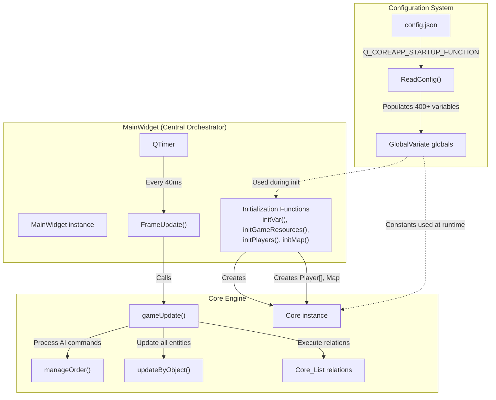
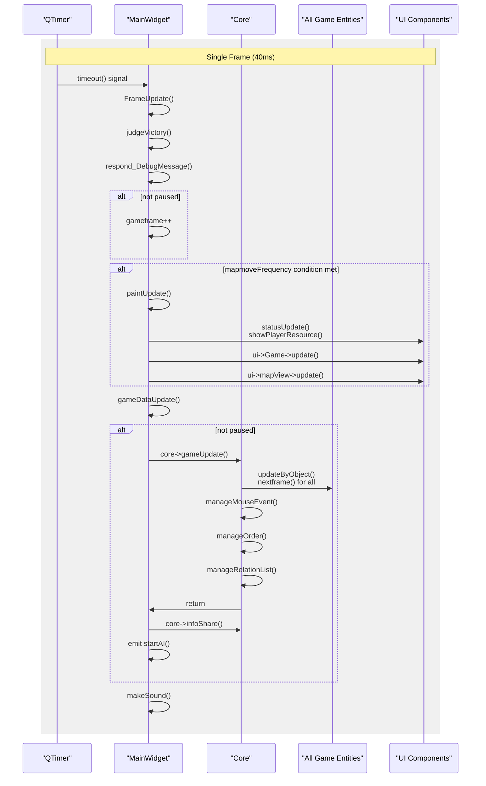
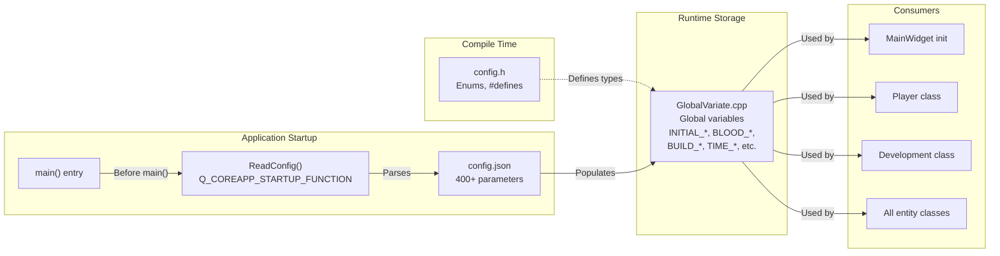
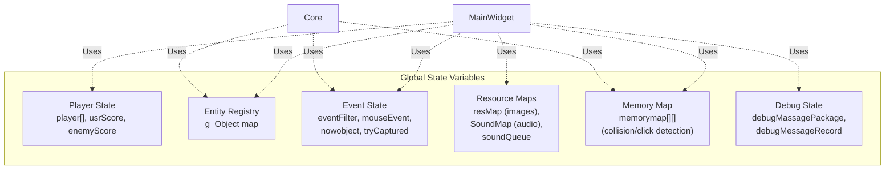
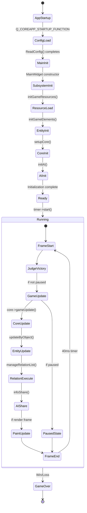

# 核心系统

<details>
<summary>相关源文件</summary>

以下文件被用作生成本维基页面的上下文：

- [GlobalVariate.cpp](GlobalVariate.cpp)
- [MainWidget.cpp](MainWidget.cpp)

</details>


本文介绍驱动整个游戏引擎的基础系统：**MainWidget 与游戏循环**、**Core 引擎**以及**配置系统**。这三部分共同构成了应用骨架，负责初始化、逐帧更新、游戏状态处理，以及参数驱动的运行期配置加载。

如需查看具体玩法机制（资源、单位、战斗），请参阅 [游戏机制](#3)。如需查看 UI 组件与渲染，请参阅 [用户界面](#4)。如需 AI 处理与命令执行，请参阅 [AI 系统](#5)。

---

## 总览

核心系统由三个紧密耦合的子系统组成：

| 系统 | 主要类 / 文件 | 重要性 | 职责 |
|------|---------------|--------|------|
| **MainWidget 与游戏循环** | `MainWidget` | 10.45 | 中央协调器、初始化顺序、逐帧更新循环 |
| **Core 引擎** | `Core` | 高 | 执行游戏逻辑、管理关系系统、实体生命周期和鼠标事件 |
| **配置系统** | `GlobalVariate`、`config.json` | 9.03（配置）/ 4.90（加载器） | 加载运行期参数，定义全局常量 |

这些系统共同建立游戏的运行环境，并通过固定步长循环驱动全部玩法逻辑。

---

## 系统交互流程

下图展示了三个核心系统在典型一帧中的协作关系：



**来源：** [MainWidget.cpp:94-152](), [MainWidget.cpp:2379-2408](), [GlobalVariate.cpp:1224-1746]()

---

## MainWidget：中央协调器

`MainWidget` 是所有子系统的集成中心。它继承自 `QWidget`，并承担主窗口控制器职责。

### 初始化顺序

构造函数采用严格的初始化顺序：

```mermaid
graph TD
    CTOR["MainWidget constructor"]
    
    CTOR --> INITVAR["initVar()<br/>Initialize name arrays"]
    INITVAR --> INITEDITOR["initEditor()<br/>Setup editor state"]
    INITEDITOR --> INITRES["initGameResources()<br/>InitImageResMap(), InitSoundResMap()"]
    INITRES --> INITELEMENTS["initGameElements()<br/>initBlock(), initBuilding(),<br/>initAnimal(), initFarmer()"]
    INITELEMENTS --> INITWINDOW["initWindowProperties()<br/>Set size, title, icon"]
    INITWINDOW --> INITOPTIONS["initOptions()<br/>Option dialog, speed buttons"]
    INITOPTIONS --> INITINFOPANE["initInfoPane()<br/>SelectWidget, ActWidget array"]
    INITINFOPANE --> INITTIMER["initGameTimer()<br/>QTimer setup"]
    INITTIMER --> INITPLAYERS["initPlayers()<br/>Create Player[MAXPLAYER]"]
    INITPLAYERS --> INITMAP["initMap(MapJudge)<br/>Create Map, load resources"]
    INITMAP --> SETUPCORE["setupCore()<br/>Create Core instance"]
    SETUPCORE --> INITAI["initAI()<br/>Create UsrAI, EnemyAI threads"]
    INITAI --> SETUPMOUSE["setupMouseTracking()"]
    SETUPMOUSE --> SETUPTIPL["setupTipLabel()"]
    SETUPTIPL --> INITVIEWMAP["initViewMap()"]
    INITVIEWMAP --> INITBGM["initBGM()"]
    INITBGM --> DONE["Initialization Complete"]
```



**来源：** [MainWidget.cpp:94-152](), [MainWidget.cpp:1279-1473]()

### 关键初始化函数

| 函数 | 行号 | 作用 |
|------|------|------|
| `initVar()` | [MainWidget.cpp:2181-2306]() | 填充静态名称数组，如 `Animal::Animalname`、`Army::ArmyName`、`Building::Buildingname` |
| `initGameResources()` | [MainWidget.cpp:1279-1283]() | 调用 `InitImageResMap()` 与 `InitSoundResMap()` 加载所有资源 |
| `initPlayers()` | [MainWidget.cpp:1382-1397]() | 创建 `Player*[MAXPLAYER]` 数组，设置初始资源和文明 |
| `initMap()` | [MainWidget.cpp:1399-1419]() | 创建 `Map` 实例，初始化地形并加载地图 |
| `setupCore()` | [MainWidget.cpp:1433-1438]() | 基于 `map`、`player`、`memorymap` 和 `mouseEvent` 创建 `Core` |
| `initAI()` | [MainWidget.cpp:1421-1431]() | 创建 `UsrAI` 和 `EnemyAI` 线程，并连接信号 |

**来源：** [MainWidget.cpp:1279-1473]()

---

## 游戏循环

游戏循环由 `QTimer` 驱动，每隔 `TimePerFrame` 毫秒触发一次（默认 40ms，即 25 FPS）。

### 帧更新周期



**来源：** [MainWidget.cpp:2379-2408](), [MainWidget.cpp:2074-2091](), [MainWidget.cpp:2093-2103]()

### FrameUpdate 实现

`FrameUpdate()` 槽函数与定时器绑定，按照固定顺序执行：

[MainWidget.cpp:2379-2408]()
```cpp
void MainWidget::FrameUpdate()
{
    judgeVictory();              // Check win/loss conditions
    respond_DebugMessage();      // Output debug text
    
    if (!pause) gameframe++;
    g_frame = gameframe;
    sel->resetSecond();
    
    ui->lcdNumber->display(gameframe);
    
    // Conditional rendering based on speed setting
    if (mapmoveFrequency == 1 || mapmoveFrequency == 2) {
        paintUpdate();
    }
    else if (mapmoveFrequency == 4) {
        if (gameframe % 2 == 0 || pause) paintUpdate();
    }
    else if (mapmoveFrequency == 8) {
        if (gameframe % 3 == 0 || pause) paintUpdate();
    }
    
    gameDataUpdate();            // Core game logic update
}
```

`gameDataUpdate()` 则驱动核心逻辑：

[MainWidget.cpp:2074-2091]()
```cpp
void MainWidget::gameDataUpdate()
{
    if (!pause)
    {
        core->gameUpdate();      // Process all game logic
        
        if(!EditorMode){
            core->infoShare();   // Share state with AI threads
            emit startAI();      // Signal AI to process
        }
    }
    else
    {
        core->resetNowObject_Click(pause);
    }
    makeSound();
}
```

**来源：** [MainWidget.cpp:2379-2408](), [MainWidget.cpp:2074-2091]()

---

## Core 引擎职责

虽然 `MainWidget` 负责帧调度，但真正执行游戏逻辑的是 `Core`。两者职责分离如下：

| 职责 | 处理方 | 关键方法 |
|------|--------|----------|
| **定时器管理** | `MainWidget` | `initGameTimer()`、`FrameUpdate()` |
| **渲染调度** | `MainWidget` | `paintUpdate()`、`statusUpdate()` |
| **游戏逻辑执行** | `Core` | `gameUpdate()`、`updateByObject()` |
| **实体更新** | `Core` | 各实体的 `nextframe()` |
| **关系处理** | `Core` | `manageRelationList()`、`addRelation()` |
| **输入处理** | `Core` | `manageMouseEvent()` |
| **AI 指令处理** | `Core` | `manageOrder()` |

关于 `Core` 类的详细方法与实现，请参阅 [游戏核心引擎](#2.2)。

**来源：** 根据架构关系与 [MainWidget.cpp:1433-1438]() 推导

---

## 配置系统架构

配置系统采用双层方案：`config.h` 中的编译期常量，以及 `config.json` 中的运行期参数。

### 配置加载流程



**来源：** [GlobalVariate.cpp:1224-1746](), [GlobalVariate.cpp:12-567]()

### 全局变量分类

配置系统定义了 400+ 个全局变量，可按类别理解：

| 类别 | 示例变量 | 行号 |
|------|----------|------|
| **窗口 / 显示** | `GAME_WIDTH`、`GAME_HEIGHT`、`GAMEWIDGET_WIDTH`、`BLOCKSIDELENGTH` | [GlobalVariate.cpp:22-37]() |
| **地图 / 世界** | `MAP_L`、`MAP_U`、`MEMORYROW`、`MEMORYCOLUMN` | [GlobalVariate.cpp:33-40]() |
| **实体速度** | `HUMAN_SPEED`、`ANIMAL_SPEED`、`WOOD_BOAT_SPEED` | [GlobalVariate.cpp:41-43]() |
| **单位属性** | `BLOOD_FARMER`、`VISION_FARMER`、`ATK_CLUBMAN1`、`SPEED_SCOUT` | [GlobalVariate.cpp:67-542]() |
| **建筑属性** | `BLOOD_BUILD_CENTER`、`VISION_CENTER`、`BUILD_CENTER_WOOD` | [GlobalVariate.cpp:109-347]() |
| **资源成本** | `BUILDING_CENTER_CREATEFARMER_FOOD`、`TIME_BUILD_HOUSE` | [GlobalVariate.cpp:114-333]() |
| **采集参数** | `FARMER_GATHERSPEED_WOOD`、`FARMER_CARRYLIMIT_FOOD` | [GlobalVariate.cpp:69-89]() |
| **战斗常量** | `DISTANCE_ATTACK_CLOSE`、`DISTANCE_HIT_TARGET` | [GlobalVariate.cpp:348-356]() |
| **计时相关** | `NOWRES_TIMER_FARMER`、`INTERVAL_CLUBMAN1` | [GlobalVariate.cpp:551-563]() |

**来源：** [GlobalVariate.cpp:12-567]()

### 配置加载实现

`ReadConfig()` 通过 `Q_COREAPP_STARTUP_FUNCTION` 标记，保证它会在 `main()` 前执行：

[GlobalVariate.cpp:1224-1246]()
```cpp
Q_COREAPP_STARTUP_FUNCTION(ReadConfig)
void ReadConfig()
{
    // 1. Open config file
    QFile file("config.json");
    if (!file.open(QIODevice::ReadOnly | QIODevice::Text)) {
       return;
    }
    
    // 2. Read and parse JSON
    QByteArray jsonData = file.readAll();
    file.close();
    
    QJsonParseError parseError;
    QJsonDocument json_config = QJsonDocument::fromJson(jsonData, &parseError);
    if (parseError.error != QJsonParseError::NoError) {
        return;
    }
    
    if (!json_config.isObject()) {
       return;
    }
    QJsonObject config=json_config.object();
    
    // ... parsing follows
}
```

该函数使用一组宏便捷解析 JSON：

[GlobalVariate.cpp:1247-1252]()
```cpp
#define json(x) config[#x]
#define jsonInt(x) x=json(x).toInt()
#define jsonDouble(x) x=json(x).toDouble()
#define jsonQString(x) x=json(x).toString()
#define jsonString(x) x=json(x).toString().toStdString()
#define jsonBool(x) x=json(x).toBool()
```

随后逐个读取变量：

[GlobalVariate.cpp:1254-1270]()
```cpp
jsonBool(IsExamining);
jsonInt(TimePerFrame);
jsonQString(GameServerAddr);
jsonInt(DataPostIntervalFrame);
jsonBool(EditorMode);
jsonBool(GlobalVision);
jsonBool(only_debug_Player0);
jsonBool(filterRepetitionMessage);
jsonInt(GAME_WIDTH);
jsonInt(GAME_HEIGHT);
jsonString(GAME_VERSION);
jsonQString(GAME_TITLE);
jsonString(MAPFILE_SUFFIX);
jsonInt(GAME_LOSE_SEC);
jsonInt(MAXPLAYER);
// ... continues for 400+ variables
```

**来源：** [GlobalVariate.cpp:1224-1746]()

### 关键配置参数

以下参数对游戏行为尤其关键：

| 参数 | 默认值 | 用途 |
|------|--------|------|
| `TimePerFrame` | 40 | 每帧毫秒数（25 FPS） |
| `IsExamining` | 视情况而定 | 为自动评测关闭某些功能 |
| `EditorMode` | 视情况而定 | 开启地图编辑器 |
| `GlobalVision` | 视情况而定 | 关闭战争迷雾 |
| `MAP_L`、`MAP_U` | 视情况而定 | 地图 block 尺寸 |
| `BLOCKSIDELENGTH` | 50.0 | 每个地块的像素尺寸 |
| `MAXPLAYER` | 2 | 最大玩家数 |

**来源：** [GlobalVariate.cpp:12-40]()

---

## 全局状态管理

除了配置项，`GlobalVariate.cpp` 还定义了大量关键全局状态：



关键全局变量示例：

[GlobalVariate.cpp:569-589]()
```cpp
// Entity tracking
map<std::string, std::list<QPixmap>> resMap;
map<string, QSoundEffect*> SoundMap;
std::queue<string> soundQueue;
std::map<int, Coordinate*> g_Object;

// Player state
Score usrScore=Score(0);
Score enemyScore=Score(1);

// Event handling
EventFilter *eventFilter;
Coordinate *nowobject=NULL;
bool tryCaptured=0;
Coordinate* LeftMouseObjCapture=0;
Coordinate* RightMouseObjCaptrue=0;

// Memory map for collision detection
int** memorymap;

// Debug system
std::queue<st_DebugMassage>debugMassagePackage;
std::map<QString , int>debugMessageRecord;
```

**来源：** [GlobalVariate.cpp:569-589]()

---

## 系统生命周期概览

从启动到逐帧执行，整体生命周期如下：



**来源：** [MainWidget.cpp:94-152](), [MainWidget.cpp:2379-2408](), [GlobalVariate.cpp:1224-1746]()

---

## 关键全局函数

`GlobalVariate.cpp` 中还定义了若干在全局范围使用的工具函数：

| 函数 | 签名 | 用途 | 行号 |
|------|------|------|------|
| `InitImageResMap` | `int InitImageResMap(QString path)` | 把 PNG/GIF 图片加载到 `resMap` | [GlobalVariate.cpp:590-697]() |
| `InitSoundResMap` | `int InitSoundResMap(QString path)` | 把 WAV 音频加载到 `SoundMap` | [GlobalVariate.cpp:698-774]() |
| `loadResource` | `void loadResource(string name, list<ImageResource>* targetlist)` | 把 `resMap` 中的图像拷贝给实体资源列表 | [GlobalVariate.cpp:947-968]() |
| `countdistance` | `double countdistance(double L, double U, double L0, double U0)` | 计算欧式距离 | [GlobalVariate.cpp:1015-1018]() |
| `isNear_Manhattan` | `bool isNear_Manhattan(...)` | 判断两点是否在曼哈顿距离阈值内 | [GlobalVariate.cpp:1019-1022]() |
| `calculateManhattanDistance` | `int calculateManhattanDistance(int x1, int y1, int x2, int y2)` | 计算曼哈顿距离 | [GlobalVariate.cpp:1068-1072]() |
| `call_debugText` | `void call_debugText(QString color, QString content, int playerID)` | 带过滤逻辑地写入调试消息队列 | [GlobalVariate.cpp:1094-1104]() |

**来源：** [GlobalVariate.cpp:590-1104]()

---

## 与其他子系统的集成

核心系统为其他模块提供基础支撑：

| 子系统 | 核心系统如何支撑 |
|--------|------------------|
| **游戏机制** | `Core` 通过关系系统执行资源采集、科技研究、单位与建筑创建 |
| **用户界面** | `MainWidget` 管理 `SelectWidget`、`ActWidget`、`GameWidget`，并通过 `statusUpdate()` 刷新 UI |
| **AI 系统** | `Core::infoShare()` 生成状态快照，`Core::manageOrder()` 处理指令队列中的 AI 命令 |
| **地图与世界** | `MainWidget::initMap()` 创建 `Map`，供 `Core` 进行地形查询与对象放置 |
| **编辑器** | `MainWidget::updateEditor()` 处理编辑器鼠标事件与地形 / 对象创建 |

详细内容请继续阅读对应页面：[游戏机制](#3)、[用户界面](#4)、[AI 系统](#5)、[地图与世界](#6)。

**来源：** 根据架构关系与 [MainWidget.cpp:94-152]() 推导

---

## 总结

核心系统通过以下机制建立整个游戏的运行环境：

1. **配置加载**：`ReadConfig()` 在 `main()` 执行前从 `config.json` 读取 400+ 个参数
2. **初始化编排**：`MainWidget` 构造函数按严格顺序执行十余个初始化步骤
3. **游戏循环**：`QTimer` 每 40ms 调用 `FrameUpdate()`，再由其触发 `Core::gameUpdate()`
4. **全局状态**：`GlobalVariate.cpp` 提供实体注册表、资源映射、事件状态和调试设施

这种架构带来的好处包括：

- **数据驱动**：平衡参数可通过 JSON 调整，无需重新编译
- **职责分离**：渲染、逻辑、输入边界清晰
- **固定步长模拟**：行为更可预测，也更易复现
- **模块化初始化**：各子系统可按依赖顺序独立初始化

如需查看游戏循环与 Core 引擎细节，请继续阅读 [MainWidget 与游戏循环](#2.1) 与 [游戏核心引擎](#2.2)。如需参数参考，请查看 [配置系统](#2.3)。

**来源：** [MainWidget.cpp:94-2582](), [GlobalVariate.cpp:1-1747]()
