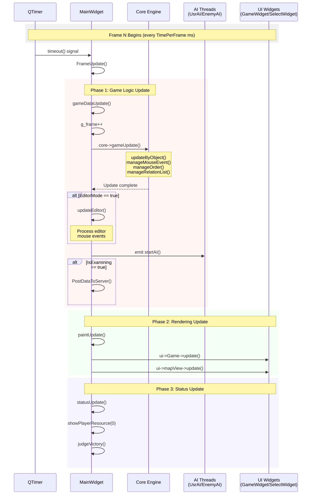
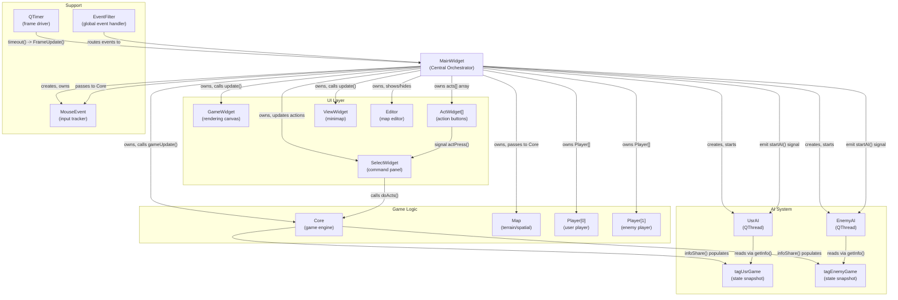
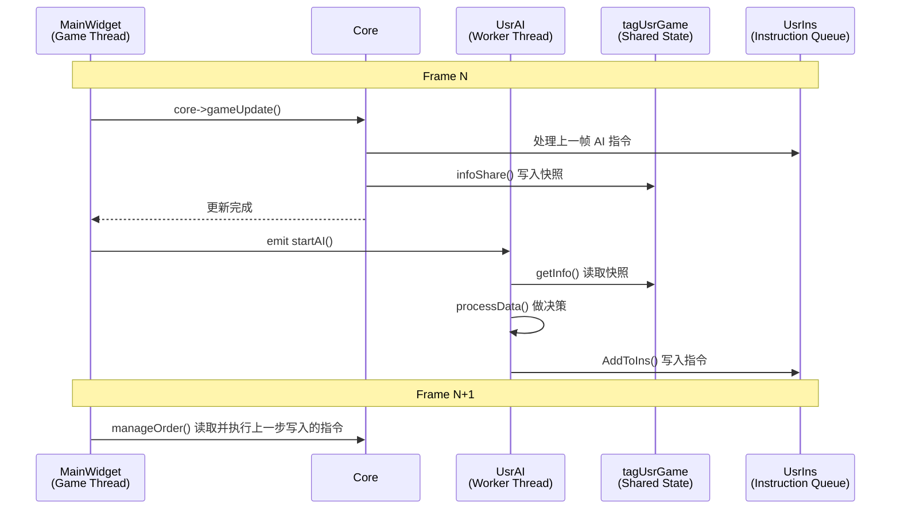

# MainWidget 与游戏循环

<details>
<summary>相关源文件</summary>

以下文件被用作生成本维基页面的上下文：

- [MainWidget.cpp](MainWidget.cpp)
- [MainWidget.h](MainWidget.h)
- [README.md](README.md)

</details>


## 目的与范围

本页介绍 `MainWidget` 类，以及驱动整个游戏系统的基于帧的主循环。`MainWidget` 是全局中央协调器，负责初始化、协调各子系统，并通过周期性更新推动游戏状态前进、触发 AI 决策、刷新渲染以及检查胜负条件。

关于 Core 引擎内部更新逻辑，请参阅 [2.2](#2.2)。关于 MainWidget 初始化前发生的配置加载，请参阅 [2.3](#2.3)。关于 UI 组件细节，请参阅 [4.1](#4.1) 与 [4.2](#4.2)。

---

## MainWidget 作为中央协调器

`MainWidget` 是系统的主控制类（重要性 10.45），拥有并协调几乎所有关键子系统。它继承自 `QWidget`，既是主窗口，也是游戏逻辑、渲染、玩家管理和 AI 处理的集成入口。

### 核心职责

| 职责 | 实现方式 |
|------|----------|
| **子系统生命周期** | 创建与销毁 Core、Map、Player[]、AI 线程和 UI 组件 |
| **游戏循环管理** | 持有 `QTimer`，通过 `FrameUpdate()` 驱动逐帧更新 |
| **初始化编排** | 在构造函数中执行 17 步初始化流程 |
| **资源协调** | 管理玩家资源、单位引用和部分全局状态指针 |
| **事件分发** | 将鼠标 / 键盘事件路由到相应子系统 |
| **编辑器集成** | 承载地图编辑器，处理地形与对象放置 |

### 关键成员变量

```cpp
class MainWidget : public QWidget {
    Core *core;                    // Game logic engine
    Map *map;                      // Terrain and spatial data
    Player** player;               // Array of Player objects (size MAXPLAYER)
    UsrAI* UsrAi;                  // Player AI thread
    EnemyAI *EnemyAi;              // Enemy AI thread
    SelectWidget *sel;             // Command panel UI
    ActWidget *acts[ACT_WINDOW_NUM_FREE];  // Action button array
    QTimer *timer;                 // Frame update timer
    MouseEvent *mouseEvent;        // Mouse state tracker
    int **memorymap;               // Vision/fog-of-war grid
    Editor* editor;                // Map editor window
    // ... additional UI and state members
};
```

**来源：** [MainWidget.h:26-268](), [MainWidget.cpp:94-276]()

---

## 初始化顺序

`MainWidget` 构造函数里有一条精心排列的 17 步初始化流程。每一步初始化一个子系统，顺序本身就承担了解决依赖关系的作用。

### 初始化流程图

```mermaid
flowchart TD
    Start["MainWidget Constructor Entry"] --> InitVar["1. initVar()<br/>Initialize basic variables"]
    InitVar --> InitEditor["2. initEditor()<br/>Setup editor state"]
    InitEditor --> InitGameRes["3. initGameResources()<br/>Load images/sounds via<br/>InitImageResMap/InitSoundResMap"]
    InitGameRes --> InitGameElem["4. initGameElements()<br/>Call initBlock/initBuilding/<br/>initAnimal/initStaticResource/<br/>initFarmer/initArmy/initMissile"]
    InitGameElem --> InitWinProp["5. initWindowProperties()<br/>Set window size/title/icon"]
    InitWinProp --> InitOpts["6. initOptions()<br/>Create Option dialog,<br/>button groups"]
    InitOpts --> InitInfo["7. initInfoPane()<br/>Create SelectWidget,<br/>ActWidget array"]
    InitInfo --> InitTimer["8. initGameTimer()<br/>Create QTimer,<br/>connect to FrameUpdate()"]
    InitTimer --> InitPlayers["9. initPlayers()<br/>Allocate Player[] array"]
    InitPlayers --> InitMap["10. initMap(MapJudge)<br/>Create Map, load terrain"]
    InitMap --> SetupCore["11. setupCore()<br/>Create Core instance"]
    SetupCore --> InitAI["12. initAI()<br/>Create UsrAI/EnemyAI,<br/>start threads"]
    InitAI --> SetupMouse["13. setupMouseTracking()<br/>Enable mouse tracking"]
    SetupMouse --> SetupTip["14. setupTipLabel()<br/>Configure status text"]
    SetupTip --> InitView["15. initViewMap()<br/>Setup minimap widget"]
    InitView --> InitBGM["16. initBGM()<br/>Load background music"]
    InitBGM --> InitSound["17. soundPlayThread<br/>Create and start<br/>sound thread"]
    InitSound --> Complete["Initialization Complete<br/>g_mainWidget = this<br/>Show editor if EditorMode"]
```



### 详细初始化步骤

| 步骤 | 函数 | 作用 | 关键行为 |
|------|------|------|----------|
| 1 | `initVar()` | 初始化基础变量 | 设置游戏状态标志的默认值 |
| 2 | `initEditor()` | 初始化编辑器状态 | 初始化 `currentSelected` 与区域对象 |
| 3 | `initGameResources()` | 加载资源 | 调用 `InitImageResMap(RESPATH)` 与 `InitSoundResMap(RESPATH)` |
| 4 | `initGameElements()` | 准备实体资源 | 初始化各类实体的静态图像数组 |
| 5 | `initWindowProperties()` | 配置窗口 | 设置窗口尺寸、标题和图标 |
| 6 | `initOptions()` | 创建附属 UI | 创建 `Option`、`AboutDialog` 和速度按钮组 |
| 7 | `initInfoPane()` | 初始化命令面板 | 创建 `SelectWidget`，初始化 12 个 `acts[]` 动作按钮 |
| 8 | `initGameTimer()` | 建立主循环 | 创建 `QTimer`，连接 `FrameUpdate()`，按 `TimePerFrame` 启动 |
| 9 | `initPlayers()` | 创建玩家 | 分配 `Player*[MAXPLAYER]`，设置初始资源和科技 |
| 10 | `initMap(MapJudge)` | 初始化世界 | 创建 `Map`，加载地形和地图资源 |
| 11 | `setupCore()` | 创建引擎 | 构造 `Core(map, player, memorymap, mouseEvent)` |
| 12 | `initAI()` | 启动 AI 线程 | 创建 `UsrAI` / `EnemyAI`，连接信号并 `start()` |
| 13 | `setupMouseTracking()` | 开启鼠标跟踪 | 给 `GameWidget` 开启鼠标跟踪，并安装事件过滤器 |
| 14 | `setupTipLabel()` | 设置提示文本 | 配置提示标签颜色等属性 |
| 15 | `initViewMap()` | 初始化小地图 | 绑定玩家和敌方单位 / 建筑列表 |
| 16 | `initBGM()` | 加载背景音乐 | 从 `SoundMap["BGM"]` 取出并设置循环 |
| 17 | 声音线程 | 启动音频播放线程 | 创建 `SoudPlayThread` 并启动 |

**关键依赖顺序：**

- **资源先于实体**：`initGameResources()` 必须早于 `initGameElements()`，因为后者要从 `resMap` 读取图像
- **地图先于 Core**：`Core` 构造时需要 `Map*`
- **玩家先于 Core**：`Core` 构造时需要 `Player**`
- **Core 先于 AI**：AI 线程启动后会通过 MainWidget 间接依赖 Core

**来源：** [MainWidget.cpp:94-152](), [MainWidget.cpp:1279-1474]()

---

## 基于帧的游戏循环

游戏通过 Qt 的 `QTimer` 运行在固定步长循环上。每一帧都严格依次执行游戏逻辑、渲染以及状态检查。

### 定时器配置

定时器通常以全局 `TimePerFrame` 为间隔（默认 40ms，对应 25 FPS）：

```cpp
void MainWidget::initGameTimer() {
    qDebug() << "初始化计时器...";
    timer = new QTimer(this);
    timer->setTimerType(Qt::PreciseTimer);  // High-precision timing
    timer->start(TimePerFrame);             // From config.json
    
    // Connect to update slots
    connect(timer, &QTimer::timeout, sel, &SelectWidget::frameUpdate);
    connect(timer, SIGNAL(timeout()), this, SLOT(FrameUpdate()));
}
```

**来源：** [MainWidget.cpp:1372-1380]()

### FrameUpdate() 方法

顶层 `FrameUpdate()` 协调三个阶段的更新：

```cpp
void MainWidget::FrameUpdate() {
    // Pause check
    if (pause) return;
    
    // Phase 1: Game Logic Update
    gameDataUpdate();
    
    // Phase 2: Rendering Update
    paintUpdate();
    
    // Phase 3: Status and UI Update
    statusUpdate();
}
```

**来源：** [MainWidget.cpp:2176-2214]()

### 三阶段更新流程



#### 阶段 1：游戏逻辑更新（`gameDataUpdate`）

该阶段负责推进模拟状态：

| 操作 | 说明 | 位置 |
|------|------|------|
| **帧计数** | 递增全局 `g_frame` | [MainWidget.cpp:2216-2217]() |
| **Core 更新** | 调用 `core->gameUpdate()` 执行全部逻辑 | [MainWidget.cpp:2218]() |
| **编辑器处理** | 若 `EditorMode` 为真，则调用 `updateEditor()` | [MainWidget.cpp:2220-2221]() |
| **AI 触发** | 发送 `startAI()` 信号唤醒 AI | [MainWidget.cpp:2223]() |
| **服务器上报** | 若 `IsExamining` 为真，按间隔调用 `PostDataToServer()` | [MainWidget.cpp:2225-2228]() |

`core->gameUpdate()` 是核心中的核心，内部会执行：

- `updateByObject()`：推进所有实体状态
- `manageMouseEvent()`：处理玩家输入
- `manageOrder()`：执行 AI 指令
- `manageRelationList()`：推进关系链中的动作

#### 阶段 2：渲染更新（`paintUpdate`）

该阶段触发界面重绘，而不阻塞逻辑执行：

```cpp
void MainWidget::paintUpdate() {
    ui->Game->update();      // GameWidget: main game view
    ui->mapView->update();   // ViewWidget: minimap
}
```

`update()` 是异步的，只是向 Qt 事件循环提交重绘请求。

#### 阶段 3：状态更新（`statusUpdate`）

该阶段刷新资源面板、状态文本并检查胜负：

```cpp
void MainWidget::statusUpdate() {
    showPlayerResource(NOWPLAYERREPRESENT);
    sel->setName(nowobject, statusLbl);
    sel->settime(time(NULL));
    sel->setPop(player[NOWPLAYERREPRESENT]->getMaxHumanNum(), 
                 player[NOWPLAYERREPRESENT]->human.size());
    judgeVictory();
}
```

若达到终局，`judgeVictory()` 会触发 `HandleGameOver()`，停止 AI、保存分数、必要时上报结果并显示结算信息。

**来源：** [MainWidget.cpp:2237-2255](), [MainWidget.cpp:2283-2342]()

---

## 子系统协调

`MainWidget` 是整个系统的整合枢纽，负责管理那些本可彼此解耦、但运行时必须协作的模块依赖。

### 系统交互图



### 与 Core 的集成

**所有权与生命周期：**

```cpp
void MainWidget::setupCore() {
    qDebug() << "加载内核...";
    core = new Core(map, player, memorymap, mouseEvent);
    sel->setCore(core);
    core->sel = sel;  // Bidirectional link for UI callbacks
}
```

**帧更新链路：**

```text
MainWidget::FrameUpdate()
  → gameDataUpdate()
    → core->gameUpdate()
      → 返回 MainWidget
  → paintUpdate()
  → statusUpdate()
```

关键点：

- `MainWidget` 持有 `Core`
- `Core` 构造需要 `Map*`、`Player**`、`memorymap`、`MouseEvent*`
- `SelectWidget` 通过 `Core*` 发起玩家命令
- `Core` 反向持有 `SelectWidget` 指针，用于 UI 回调

**来源：** [MainWidget.cpp:1433-1438](), [MainWidget.cpp:2218]()

### 玩家与地图管理

`MainWidget` 同时持有 `Player` 数组和 `Map` 实例，再把它们传给 `Core`：

```cpp
void MainWidget::initPlayers() {
    player = new Player*[MAXPLAYER];
    for (int i = 0; i < MAXPLAYER; i++) {
        player[i] = new Player(i);
    }
    player[1]->set_AllTechnology();
    player[0]->setCiv(DefaultCivilization);
}

void MainWidget::initMap(int MapJudge) {
    map = new Map;
    map->setPlayer(player);
    map->init(MapJudge);
    map->init_Map_Height();
    map->loadResource();
}
```

每帧在 `statusUpdate()` 中，`MainWidget` 都会从 `Player` 读取资源并更新 UI：

```cpp
void MainWidget::showPlayerResource(int playerRepresent) {
    ui->wood->setText(QString::number(player[playerRepresent]->wood));
    ui->meat->setText(QString::number(player[playerRepresent]->meat));
    ui->stone->setText(QString::number(player[playerRepresent]->stone));
    ui->gold->setText(QString::number(player[playerRepresent]->gold));
}
```

**来源：** [MainWidget.cpp:1382-1397](), [MainWidget.cpp:1399-1419](), [MainWidget.cpp:2257-2281]()

### UI 组件协调

`MainWidget` 管理多个职责明确的 UI 组件：

| 组件 | 类型 | 作用 | 更新方式 |
|------|------|------|----------|
| `ui->Game` | `GameWidget` | 主渲染画布 | `paintUpdate()` 中调用 `update()` |
| `sel` | `SelectWidget` | 选中对象信息与命令面板 | 定时器驱动，并持有 `Core*` |
| `acts[]` | `ActWidget[12]` | 动作按钮阵列 | 由 `SelectWidget` 按当前选中对象刷新 |
| `ui->mapView` | `ViewWidget` | 小地图 | `paintUpdate()` 中调用 `update()` |
| `editor` | `Editor` | 地图编辑器窗口 | 由 `EditorMode` 控制显示 |
| `option` | `Option` | 设置对话框 | 通过按钮打开 |

**动作按钮初始化：**

```cpp
void MainWidget::initInfoPane() {
    sel = new SelectWidget(this);
    sel->move(20, 810);
    sel->show();

    ActWidget* acts_[ACT_WINDOW_NUM_FREE] = { 
        ui->interact1, ui->interact2, /* ... */ ui->interact12 
    };
    for (int i = 0; i < ACT_WINDOW_NUM_FREE; i++) {
        acts[i] = acts_[i];
        acts[i]->setStatus(0);
        acts[i]->setNum(i);
        acts[i]->setFixedSize(70, 70);
        acts[i]->hide();
        connect(acts[i], SIGNAL(actPress(int)), sel, SLOT(widgetAct(int)));
    }
}
```

**命令流：**

```text
用户点击 ActWidget[i]
  → 发出 actPress(i)
  → SelectWidget::widgetAct(i)
  → sel->doActs(actName, nowobject)
  → core->addRelation(...)
```

**来源：** [MainWidget.cpp:1338-1370]()

### AI 线程同步

AI 线程异步运行，但通过信号与共享快照和主循环同步。

**线程创建与连接：**

```cpp
void MainWidget::initAI() {
    UsrAi = new UsrAI();
    EnemyAi = new EnemyAI();
    
    connect(this, &MainWidget::startAI, UsrAi, &AI::startProcessing);
    connect(this, &MainWidget::startAI, EnemyAi, &AI::startProcessing);
    
    connect(UsrAi, &AI::cheatAttack, EnemyAi, &EnemyAI::onWaveAttack);
    connect(UsrAi, &UsrAI::cheatRes, this, &MainWidget::cheat_Player0Resource);
    
    UsrAi->start();
    EnemyAi->start();
}
```

**同步模式：**



**线程安全机制：**

- AI 只读取 `tagUsrGame` / `tagEnemyGame` 快照
- AI 只通过 `UsrIns` / `EnemyIns` 队列提交命令
- AI 不能直接改写游戏状态
- `startAI()` 通过 Qt 信号唤醒线程，线程安全

**来源：** [MainWidget.cpp:1421-1431]()

---

## 全局状态与访问模式

`MainWidget` 还依赖若干全局变量，作为跨模块访问入口。

### 全局实例指针

```cpp
MainWidget* g_mainWidget = nullptr;

MainWidget::MainWidget(int MapJudge, QWidget* parent) {
    g_mainWidget = this;
}

MainWidget::~MainWidget() {
    g_mainWidget = nullptr;
}
```

这让其他系统无需层层传指针，也能访问当前主窗口：

```cpp
void g_globalCleanupUnit(Coordinate* unit) {
    if (g_mainWidget) {
        g_mainWidget->cleanupUnitReferences(unit);
    }
}
```

### 全局对象注册表

```cpp
std::map<int, Coordinate*> g_Object;
int g_frame = 0;
```

`g_Object` 负责 SN 到对象指针的映射，尤其用于 AI 指令处理时的快速查找。

### 编辑器区域对象全局指针

```cpp
RectArea* g_rectArea = nullptr;
CircleArea* g_circleArea = nullptr;
LineArea* g_lineArea = nullptr;
```

这些对象在 `initEditor()` 中赋值，供地图编辑器和 AI 区域逻辑访问。

### 访问模式总结

| 全局变量 | 类型 | 用途 | 设置方 | 访问方 |
|----------|------|------|--------|--------|
| `g_mainWidget` | `MainWidget*` | 主窗口单例入口 | 构造函数 | 清理逻辑、全局工具函数 |
| `g_Object` | `map<int, Coordinate*>` | SN 到对象的索引 | Core / 对象创建逻辑 | AI、Core 查找逻辑 |
| `g_frame` | `int` | 当前帧号 | `gameDataUpdate()` | 定时和周期逻辑 |
| `g_rectArea` | `RectArea*` | 矩形区域工具 | `initEditor()` | 编辑器、AI |
| `g_circleArea` | `CircleArea*` | 圆形区域工具 | `initEditor()` | 编辑器、AI |
| `g_lineArea` | `LineArea*` | 线段区域工具 | `initEditor()` | 编辑器、AI |

**来源：** [MainWidget.cpp:11-32](), [MainWidget.h:270-276]()

---

## 编辑器集成

当 `EditorMode` 启用时，`MainWidget` 会托管地图编辑器并在主循环里处理编辑器相关逻辑。

### 编辑器更新流程

```cpp
void MainWidget::gameDataUpdate() {
    g_frame++;
    core->gameUpdate();
    
    if (EditorMode) {
        updateEditor();
    }
    
    emit startAI();
}
```

`updateEditor()` 主要负责：

- 处理地形修改（抬高 / 降低 / 海洋 / 平地）
- 处理对象放置（建筑、单位、资源）
- 管理区域选择（巡逻区、限制区）
- 设置敌人状态（攻击 / 防守）

编辑器通过 `currentSelected` 状态机决定鼠标点击当前代表什么操作：

```cpp
enum EditorElement {
    DELETEOBJECT, FLAT, OCEAN, HIGHTERLAND, LOWERLAND,
    PLAYERDOWNTOWN, PLAYERTRANSPORTSHIP, /* ... */
    PATROL_RECT_AREA, PATROL_CIRCLE_AREA, PATROL_LINE_AREA,
    ENEMY_STATUS_ATTACK, ENEMY_STATUS_DEFEND,
    NORMAL_MOUSE,
};
```

编辑器完整说明见 [4.2](#4.2)。

**来源：** [MainWidget.cpp:2220-2221](), [MainWidget.cpp:528-740](), [MainWidget.h:80-129]()
