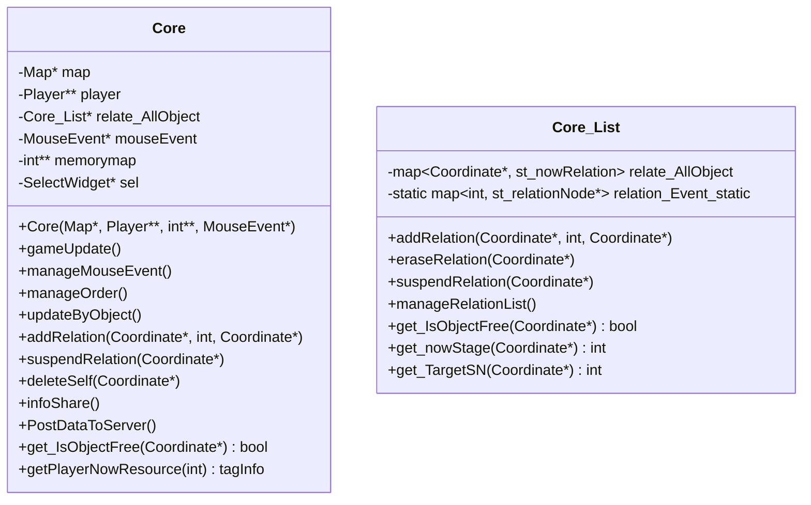
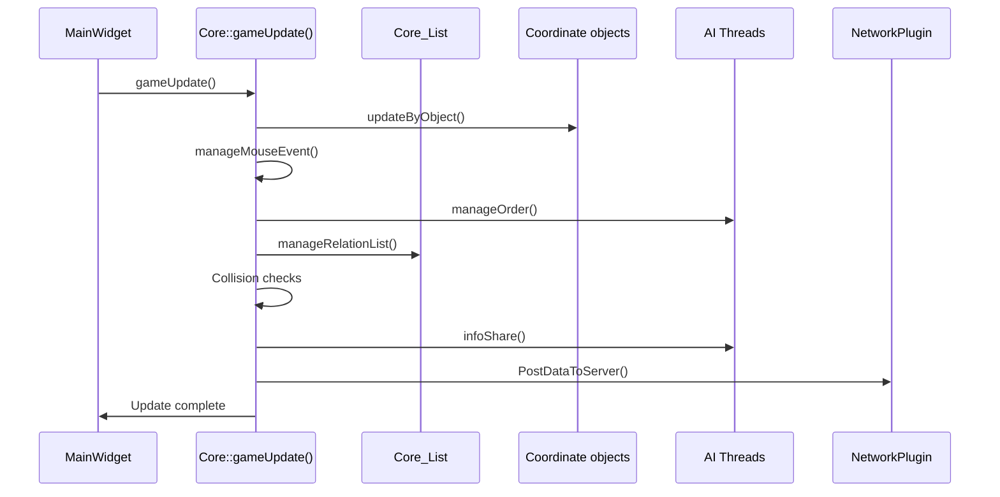
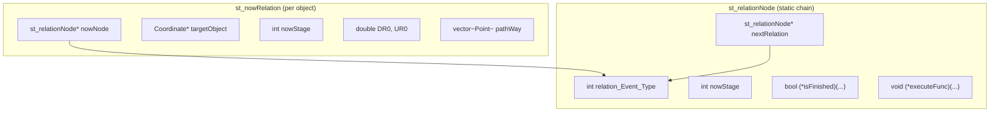
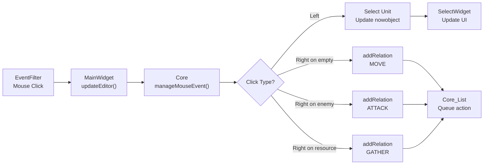
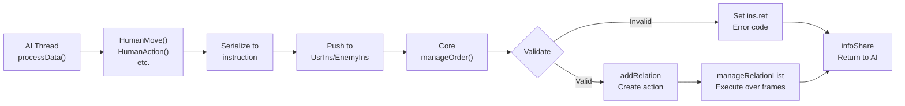

# 游戏核心引擎

相关源文件

以下文件被用作生成本维基页面的上下文：

- [GlobalVariate.h](GlobalVariate.h)
- [MainWidget.cpp](MainWidget.cpp)
- [README.md](README.md)

游戏核心引擎是 new-aoe 的中央逻辑系统，负责驱动实际玩法。它管理逐帧更新、处理玩家输入和 AI 指令、维护实体关系与动作、处理对象生命周期，并协调几乎所有游戏机制。本文重点介绍 `Core` 类、其关联的 `Core_List` 关系管理器，以及 `gameUpdate()` 的执行流水线。

关于 Core 如何由主循环初始化并调用，请参阅 [MainWidget 与游戏循环](#2.1)。关于控制 Core 行为的参数，请参阅 [配置系统](#2.3)。

---

## 总览与职责

`Core` 是游戏状态与逻辑的单一真实来源。它由 `MainWidget` 创建，持有 `Map`、`Player` 数组、内存地图以及 `MouseEvent` 处理器的引用。

**Core 的主要职责：**

| 职责 | 说明 |
|------|------|
| **帧更新** | 每帧执行 `gameUpdate()` 推进游戏状态 |
| **对象更新** | 通过 `updateByObject()` 调用所有实体的 `nextframe()` |
| **输入处理** | 通过 `manageMouseEvent()` 处理玩家点击 |
| **AI 指令处理** | 通过 `manageOrder()` 读取并校验 AI 指令 |
| **关系管理** | 通过 `Core_List` 执行动作链，如移动、攻击、建造 |
| **碰撞检测** | 处理单位与单位、单位与地形之间的碰撞 |
| **状态同步** | 通过 `infoShare()` 生成 AI 可读快照 |
| **网络上报** | 通过 `PostDataToServer()` 向评测服务器上报状态 |

Core 不直接负责图形渲染或声音播放，它只管理逻辑与状态变化。

**来源：** 图示与 [MainWidget.cpp:1433-1438]()

---

## Core 类结构

**关键指针说明：**

- `map`：地形网格、静态资源、动物以及空间索引
- `player[]`：`MAXPLAYER` 个玩家的数组
- `relate_AllObject`：负责所有活动动作链的 `Core_List`
- `mouseEvent`：事件过滤器写入的鼠标状态对象
- `memorymap`：视野 / 迷雾 / 碰撞辅助网格
- `sel`：供 UI 更新使用的 `SelectWidget`

**来源：** [MainWidget.cpp:1433-1438](), [GlobalVariate.h:514-527]()

---

## gameUpdate() 执行流水线

每一帧，`MainWidget::FrameUpdate()` 都会调用 `Core::gameUpdate()`，后者按固定顺序执行以下阶段：

### 阶段拆解

#### 1. `updateByObject()`

遍历以下对象集合并调用 `nextframe()`：

- `player[i]->build`
- `player[i]->human`
- `player[i]->missile`
- `map->staticres`
- `map->animal`

这让实体得以推进自己的内部状态机，例如：

- 单位前进动画
- 农民采集进度
- 建筑施工百分比
- 投射物轨迹推进

#### 2. `manageMouseEvent()`

若 `mouseEvent->HaveEvent()` 为真，则处理本帧点击：

- 左键：选中单位 / 建筑，更新 `nowobject`
- 右键空地：创建移动关系
- 右键敌人：创建攻击关系
- 右键资源：创建采集关系

在建立关系前，Core 会校验地形、对象归属与动作前提。

#### 3. `manageOrder()`

从 `UsrIns.instructions` 与 `EnemyIns.instructions` 队列中取出 AI 指令：

- Type 0：取消动作
- Type 1：移动
- Type 2：执行动作（采集 / 攻击等）
- Type 3：建造
- Type 4：建筑动作（研究 / 训练）
- Type 5：定点打击

每条指令都会校验：

- SN 是否存在
- 资源是否足够
- 坐标是否越界
- 目标对象是否存在
- 当前对象是否允许执行该动作

并将返回码写入 `ins.ret`：

| 返回码 | 含义 |
|--------|------|
| `0` | 成功 |
| `-1` | SN 不存在 |
| `-2` | 动作不存在 |
| `-3` | 越界 |
| `-4` | 目标对象不存在 |
| `-5` | 建筑非法 |
| `-6` | 资源不足 |

#### 4. `manageRelationList()`

`Core_List` 负责推进所有活动中的关系：

- 把当前关系推进到下一阶段
- 调用阶段对应的执行函数
- 清理已完成关系，保留未完成关系
- 为移动类关系执行路径逻辑
- 处理攻击伤害、建筑进度等多帧动作

`addRelation()` 只是把动作挂入系统，真正跨多帧执行的是 `manageRelationList()`。

#### 5. 碰撞、运输与视野

Core 还会额外处理：

- 单位与地形碰撞
- 重型单位碾压
- 船只装载 / 卸载逻辑
- 基于单位视野更新战争迷雾

#### 6. `infoShare()`

该阶段把当前游戏状态转换为 AI 可读取的快照：

- 遍历建筑、农民、军队、资源
- 转换为 `tagBuilding`、`tagFarmer`、`tagArmy`、`tagResource`
- 对敌方数据应用战争迷雾遮蔽（如隐藏 `DR0` / `UR0`）
- 携带地形、资源数量和 `ins_ret`

AI 线程下一轮通过 `getInfo()` 读取这些数据。

#### 7. `PostDataToServer()`

若 `IsExamining` 开启，并且 `g_frame % DataPostIntervalFrame == 0`，则会将状态序列化并发送给评测服务器。

**来源：** [GlobalVariate.h:765-791](), [GlobalVariate.h:847-910]()

---

## 关系管理系统

`Core_List` 实现了一套用于多帧动作的有限状态机。每个关系可以理解为：“对象 A 正在对对象 B 执行动作 X”，并在预定义阶段之间逐步推进。

### 关系结构

**关键数据结构：**

| 结构 | 作用 |
|------|------|
| `st_nowRelation` | 某对象当前动作实例，记录目标、路径、阶段等 |
| `st_relationNode` | 某关系阶段的静态定义，包含结束判断和执行函数 |
| `relation_Event_static` | 关系类型到阶段链的映射 |
| `relate_AllObject` | `Coordinate*` 到当前 `st_nowRelation` 的映射 |

### 常见关系链

**移动关系：**

1. 计算路径
2. 沿路径移动
3. 到达目标并清理关系

**资源采集关系：**

1. 前往资源点
2. 到达资源点
3. 执行采集
4. 返回存储建筑
5. 卸载资源

**攻击关系：**

1. 寻路到目标
2. 接近目标
3. 进入射程并执行攻击 / 生成 `Missile`
4. 等待攻击间隔
5. 若目标仍有效则继续循环

**建造关系：**

1. 扣除资源
2. 创建未完成建筑
3. 农民走向工地
4. 按 `FARMER_CONSTRUCTSPEED` 增加完成度
5. 完成后清理关系

---

## 对象生命周期

### 创建

对象主要由 `Player` 和 `Map` 创建：

| 方法 | 创建对象 |
|------|----------|
| `addBuilding(...)` | 建筑 |
| `addFarmer(...)` | 农民 |
| `addArmy(...)` | 军事单位 |
| `addMissile(...)` | 投射物 |
| `Map::addAnimal(...)` | 动物 / 树 |
| `Map::addStaticRes(...)` | 矿点、石头、黄金等 |

对象创建后通常会：

1. 通过 `new` 分配
2. 加入所属列表
3. 写入 `map->map_Object` 空间索引
4. 分配唯一 `SN`
5. 视情况注册到 `g_Object`

### 更新

每帧 `Core::updateByObject()` 调用 `obj->nextframe()`，不同对象类型在其中推进各自行为：

- `Building`：施工、生产队列
- `Farmer`：工作状态切换
- `Army`：攻击冷却与发射逻辑
- `Missile`：轨迹与命中检测

### 删除

对象在以下情形被移除：

- 生命值归零
- 玩家 / AI 主动删除
- 资源耗尽
- 投射物命中
- 建筑施工取消

典型删除流程：

1. 调用 `Core::deleteSelf(Coordinate* obj)`
2. 从所属列表删除
3. 从 `map->map_Object` 中移除
4. 调用 `suspendRelation(obj)` 清掉动作关系
5. 释放内存
6. 更新其他对象对它的引用

为避免悬空指针，还需要从区域关系和选择状态中移除该对象，`MainWidget::cleanupUnitReferences()` 就承担这一职责。

**来源：** [MainWidget.cpp:742-847](), [GlobalVariate.h:512-527]()

---

## 交互处理

### 玩家输入流

### AI 指令流

`manageOrder()` 的校验步骤通常包括：

1. `g_Object[SN]` 是否存在
2. 动作是否和对象类型匹配
3. 资源是否足够
4. 坐标是否位于地图范围内
5. 目标对象是否存在且合法

---

## 与其他系统的集成

### 与 Map 的集成

Core 通过 `Map` 获取：

- 地形是否可通行
- 路径规划辅助
- 资源位置
- 某个 block 中的对象列表

同时，建筑放置 / 销毁、资源耗尽等行为也会反向更新地图状态。

### 与 Player 的集成

Core 会：

- 遍历 `player[i]->build`、`human`、`missile`
- 调用 `changeResource(...)` 进行资源扣除 / 增加
- 调用 `addBuilding()`、`addArmy()` 进行实体创建
- 查询 `develop->conditionDevelop()` 判断科技前提

### 与 SelectWidget 的集成

Core 持有 `SelectWidget* sel`。当玩家选择对象时：

1. `manageMouseEvent()` 更新 `nowobject`
2. `SelectWidget` 读取对象属性并刷新面板
3. 用户点击动作按钮
4. `SelectWidget::doActs(...)` 调用 Core
5. Core 创建对应关系

### 与 AI 线程的集成

AI 通过以下模式与 Core 协作：

1. **读**：`getInfo()` 获取快照
2. **写**：`HumanMove()` 等函数把指令推入队列
3. **反馈**：下一帧 `manageOrder()` 处理后写入 `ins.ret`
4. **再次读取**：AI 在下一轮快照中看到返回结果

这种设计避免了 AI 直接修改 Core 状态，从而降低竞态风险。

**来源：** [GlobalVariate.h:914-972]()

---

## 性能考量

| 操作 | 复杂度 | 说明 |
|------|--------|------|
| `updateByObject()` | O(n) | 遍历所有实体并调用 `nextframe()` |
| `manageRelationList()` | O(r) | 只处理活跃关系，通常 `r << n` |
| `manageMouseEvent()` | O(1) | 每帧至多一个鼠标事件 |
| `manageOrder()` | O(q) | AI 指令队列通常较小 |
| 碰撞检测 | 局部 O(k²) | 借助空间网格避免全局 O(n²) |

主要优化手段：

- **空间分区**：借助 `map->map_Object[][]` 缩小碰撞检测范围
- **延迟寻路**：路径只在需要时重新计算
- **静态关系图**：`relation_Event_static` 是静态结构，避免频繁分配
- **迷雾缓存**：视野只在需要时更新

---

## 错误处理与校验

### 常见错误场景

| 错误码 | 场景 | Core 响应 |
|--------|------|-----------|
| `-1` | AI 引用了已删除单位 | 忽略指令并返回错误 |
| `-2` | 动作无效 | 拒绝执行 |
| `-3` | 目标越界 | 创建关系前拒绝 |
| `-4` | 目标中途消失 | 中止关系并让单位空闲 |
| `-6` | 资源不足 | 拒绝并且不扣资源 |

Core 会在多个阶段进行防御性校验：

- 收到指令时校验 SN、资源和坐标
- 创建关系时校验目标与路径
- 执行关系时持续检查目标是否仍有效
- 删除对象时先清理关系再释放

为避免野指针：

1. 先通过 `g_Object[SN]` 查找对象
2. 关系在逻辑上围绕 SN 和阶段推进
3. 删除前先 `suspendRelation()`

---

## 总结

游戏核心引擎是 new-aoe 的确定性逻辑内核。它以固定流水线处理每一帧，接收玩家与 AI 输入，基于关系系统推进动作，并协调对象的创建、更新与销毁。移动、战斗、采集、建造等所有玩法，本质上都通过 `Core::gameUpdate()` 及其下属子系统执行。

**关键要点：**

- `Core::gameUpdate()` 是每帧逻辑的唯一入口
- `Core_List` 用多阶段关系图实现跨帧动作
- 玩家输入和 AI 指令最终都会转换为关系
- AI 只能通过快照与指令队列间接影响系统
- `infoShare()` 保证 AI 读取到一致状态
- `ins_ret` 为 AI 提供执行反馈

关于它如何接入主循环，请参阅 [MainWidget 与游戏循环](#2.1)。关于单位行为细节，请参阅 [单位与建筑](#3.3)。
