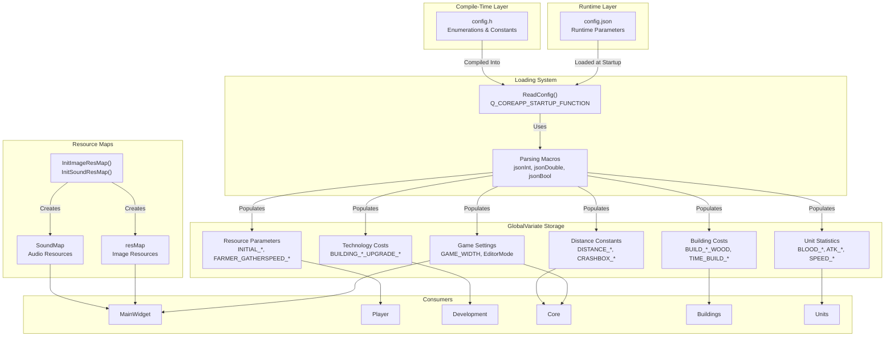
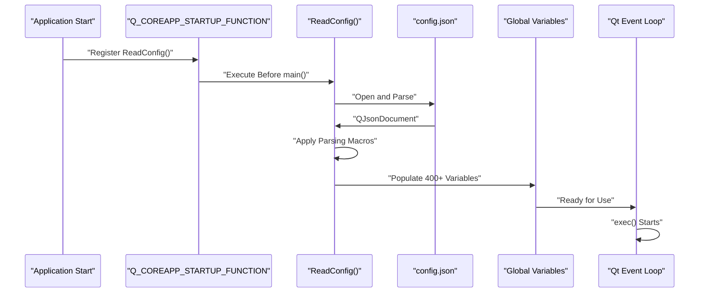
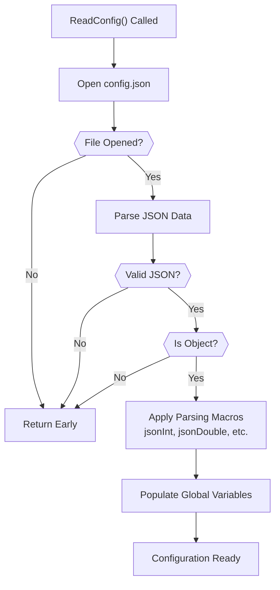
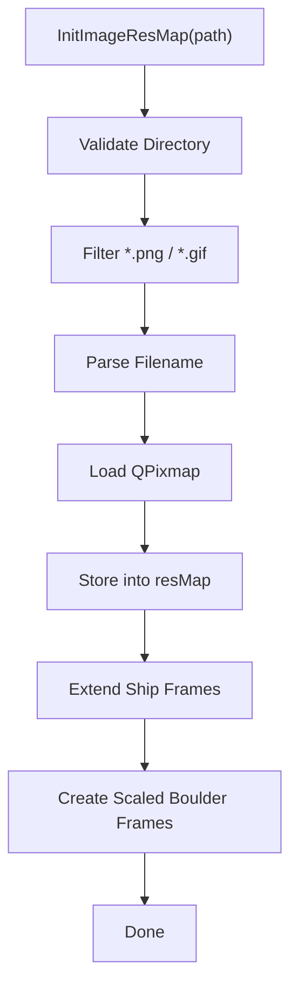
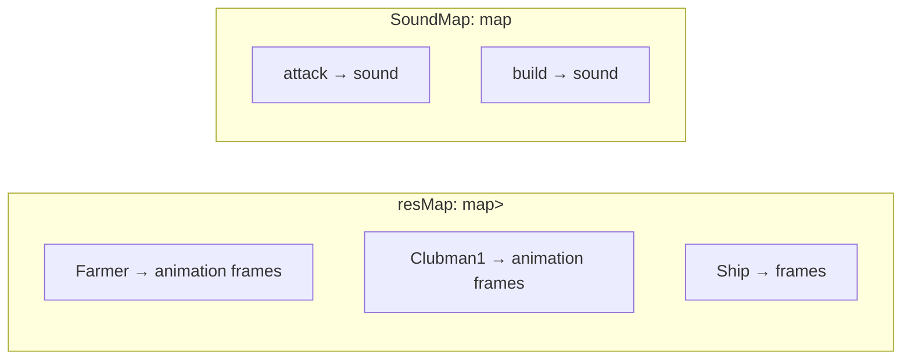
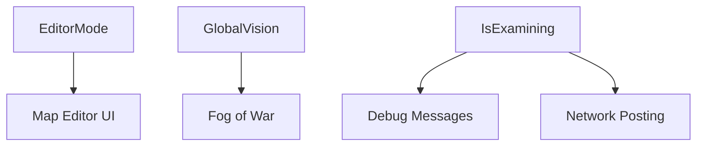

# 配置系统

<details>
<summary>相关源文件</summary>

以下文件被用作生成本维基页面的上下文：

- [GlobalVariate.cpp](GlobalVariate.cpp)
- [GlobalVariate.h](GlobalVariate.h)
- [config.json](config.json)

</details>


配置系统通过“编译期常量 + 运行期 JSON”的双层结构管理游戏参数。它集中控制 400+ 个配置项，包括单位属性、建筑成本、资源数值、视觉设置与玩法机制，并且会在 Qt 事件循环开始前完成初始化，确保应用启动时所有参数都可用。

如需查看配置值在具体系统中的使用方式，请参阅 [3.1](#3.1)、[3.2](#3.2) 与 [3.3](#3.3)。

---

## 配置架构

系统通过双层配置，把类型定义与运行期数值分开：



**来源：** [config.json:1-471](), [GlobalVariate.cpp:1-1747](), [GlobalVariate.h:1-1326]()

---

## 运行期配置文件（config.json）

`config.json` 包含 470+ 个参数，按逻辑类别组织为一个扁平 JSON 结构，便于直接读取。

### 配置类别

| 类别 | 参数量级 | 示例参数 | 用途 |
|------|----------|----------|------|
| **游戏设置** | ~20 | `GAME_WIDTH`、`EditorMode`、`GlobalVision`、`IsExamining` | 窗口、模式和调试开关 |
| **地图与渲染** | ~15 | `MAP_L`、`MAP_U`、`BLOCKSIDELENGTH`、`MEMORYROW` | 地图尺寸与坐标体系 |
| **初始资源** | 4 | `INITIAL_WOOD`、`INITIAL_MEAT`、`INITIAL_GOLD`、`INITIAL_STONE` | 开局资源量 |
| **单位基础属性** | ~180 | `BLOOD_FARMER`、`SPEED_CLUBMAN1`、`ATK_BOWMAN` | 血量、速度、攻击、防御等 |
| **建筑属性** | ~60 | `BLOOD_BUILD_CENTER`、`BUILD_HOUSE_WOOD`、`TIME_BUILD_FARM` | 建筑生命、成本与时间 |
| **科技成本** | ~120 | `BUILDING_STOCK_UPGRADE_*`、`TIME_BUILDING_CENTER_UPGRADE` | 科技研究成本与时长 |
| **采集 / 生产** | ~30 | `FARMER_GATHERSPEED_WOOD`、`FARMER_CARRYLIMIT_FOOD`、`CNT_TREE` | 采集速度、负载上限、资源量 |
| **距离常量** | ~20 | `DISTANCE_Manhattan_MoveEndNEAR`、`CRASHBOX_MIDDLE` | 碰撞盒、攻击距离等 |
| **动画计时** | ~15 | `NOWRES_TIMER_FARMER`、`NOWRES_TIMER_BOWMAN` | 精灵帧切换频率 |
| **投射物物理** | ~5 | `Missile_Speed_Arrow`、`Missile_Boulders_Range` | 速度与范围参数 |

**来源：** [config.json:1-471]()

### 关键参数示例

```json
{
    "EditorMode": false,
    "GlobalVision": false,
    "IsExamining": false,
    "GAME_WIDTH": 1920,
    "GAME_HEIGHT": 1000,
    "MAP_L": 100,
    "MAP_U": 100,
    "BLOCKSIDELENGTH": 35.77708763999664,
    "INITIAL_WOOD": 200,
    "INITIAL_MEAT": 200,
    "INITIAL_GOLD": 150,
    "INITIAL_STONE": 0,
    "FARMER_GATHERSPEED_WOOD": 0.02,
    "BLOOD_FARMER": 25,
    "BUILD_CENTER_WOOD": 200,
    "TIME_BUILD_CENTER": 60,
    "BUILDING_CENTER_CREATEFARMER_FOOD": 50
}
```

**来源：** [config.json:1-100]()

---

## 配置加载系统

### 启动时注册

`ReadConfig()` 通过 `Q_COREAPP_STARTUP_FUNCTION` 注册，因此会在 Qt 主事件循环启动前执行：



**来源：** [GlobalVariate.cpp:1224-1746]()

### 基于宏的解析方式

加载逻辑使用宏简化 JSON 读取：

```cpp
#define json(x) config[#x]
#define jsonInt(x) x=json(x).toInt()
#define jsonDouble(x) x=json(x).toDouble()
#define jsonQString(x) x=json(x).toString()
#define jsonString(x) x=json(x).toString().toStdString()
#define jsonBool(x) x=json(x).toBool()

jsonBool(IsExamining);
jsonInt(GAME_WIDTH);
jsonDouble(BLOCKSIDELENGTH);
jsonQString(GameServerAddr);
```

这种做法能以较少样板代码加载大量参数。

**来源：** [GlobalVariate.cpp:1247-1252]()

### ReadConfig() 执行流程



该函数的错误处理非常轻量。如果文件无法打开或 JSON 无法解析，它会直接返回，让程序继续使用默认初始化值。

---

## 全局变量系统

### 变量声明方式

所有配置变量都在 `GlobalVariate.h` 中以 `extern` 声明，并在 `GlobalVariate.cpp` 中定义：

```cpp
// GlobalVariate.h
extern int GAME_WIDTH;
extern int GAME_HEIGHT;
extern bool EditorMode;
extern double BLOCKSIDELENGTH;
extern int INITIAL_WOOD;

// GlobalVariate.cpp
int GAME_WIDTH;
int GAME_HEIGHT;
bool EditorMode;
double BLOCKSIDELENGTH;
int INITIAL_WOOD;
```

**来源：** [GlobalVariate.h:243-256](), [GlobalVariate.cpp:22-97]()

### 按类型分类

| 类型 | 量级 | 用途 | 示例 |
|------|------|------|------|
| `int` | ~350 | 离散数值、成本、计时器 | `BLOOD_FARMER`、`BUILD_HOUSE_WOOD` |
| `double` | ~40 | 连续量、速度、距离 | `SPEED_CAVALRY`、`BLOCKSIDELENGTH` |
| `bool` | ~15 | 模式开关 | `EditorMode`、`GlobalVision` |
| `QString` | ~5 | 路径、URL、显示文本 | `RESPATH`、`GameServerAddr`、`GAME_TITLE` |
| `string` | ~3 | 版本与后缀信息 | `GAME_VERSION`、`MAPFILE_SUFFIX` |

**来源：** [GlobalVariate.h:14-509]()

---

## 资源映射初始化

### 图像资源加载

`InitImageResMap()` 会把游戏精灵加载进 `resMap`：



### 碰撞图生成

每张图还会生成对应的 `pixMemoryMap`，用于碰撞检测：

```cpp
void initMemory(ImageResource *res)
{
    QImage piximage = res->pix.toImage();
    res->memorymap = pixMemoryMap(res->pix.width(), res->pix.height());
    // 遍历像素，按透明度写入碰撞位
}
```

### 声音资源加载

`InitSoundResMap()` 会为每个音频文件创建 `QSoundEffect`，再写入 `SoundMap`。

### 资源映射结构



**来源：** [GlobalVariate.cpp:590-774](), [GlobalVariate.h:1086-1103]()

---

## 配置参数命名模式

### 单位属性模式

单位通常遵循如下命名规则：

```cpp
int BLOOD_CLUBMAN1;
double SPEED_CLUBMAN1;
int VISION_CLUBMAN1;
int DIS_CLUBMAN1;
double INTERVAL_CLUBMAN1;
int ATK_CLUBMAN1;
int DEFCLOSE_CLUBMAN1;
int DEFSHOOT_CLUBMAN1;
```

### 建筑成本模式

```cpp
int BLOOD_BUILD_CENTER;
int BUILD_CENTER_WOOD;
int TIME_BUILD_CENTER;
```

### 科技成本模式

```cpp
int BUILDING_STOCK_UPGRADE_CLOSER_ATTACK_FOOD;
int BUILDING_STOCK_UPGRADE_CLOSER_ATTACK_ADDITION_ATTACK;
int TIME_BUILDING_STOCK_UPGRADE_CLOSER_ATTACK;
```

这些规则让 `config.json` 在规模很大时仍具备可读性与一致性。

**来源：** [GlobalVariate.cpp:109-375](), [config.json:93-282]()

---

## 距离与碰撞常量

### 距离常量

| 常量 | 典型值 | 用途 |
|------|--------|------|
| `DISTANCE_Manhattan_MoveEndNEAR` | 0.0001 | 判断移动结束 |
| `DISTANCE_Manhattan_PathMove` | 0.01 | 寻路点接近阈值 |
| `DISTANCE_Manhattan_Unload` | 42.93 | 卸载交互范围 |
| `DISTANCE_Manhattan_Transport` | 51.52 | 上船交互范围 |
| `DISTANCE_ATTACK_CLOSE` | 17.89 | 近战攻击距离 |
| `DISTANCE_HIT_TARGET` | 4.0 | 投射物命中容差 |
| `SHIP_ACT_MAX_DISTANCE` | 1843.2 | 船只最大交互距离 |

### 碰撞盒常量

```cpp
double CRASHBOX_MICRO;
double CRASHBOX_SINGLEBLOCK;
double CRASHBOX_SMALLBLOCK;
double CRASHBOX_SMALL;
double CRASHBOX_MIDDLE;
double CRASHBOX_BIG;
double CRASHBOX_SINGLEOB;
double CRASHBOX_SMALLOB;
double CRASHBOX_BIGOB;
```

这些值定义了不同对象大小对应的物理边界。

**来源：** [GlobalVariate.cpp:99-107](), [config.json:84-92](), [config.json:258-265]()

---

## 预定义资源布局

系统内置了一些用于程序化生成地图的二维数组：

```cpp
int Forest[3][15][15];
int Food[5][5][5];
int Stone[5][5][5];
```

- `Forest`：三种 15x15 森林模板
- `Food`：五种 5x5 食物点布局
- `Stone`：五种 5x5 石矿布局

它们让资源分布具备一定随机性，但无需完整的程序化生成系统。

**来源：** [GlobalVariate.cpp:829-944]()

---

## 使用模式

### 直接访问全局配置

各子系统通常直接读取这些全局变量：

```cpp
void Player::init() {
    this->Wood = INITIAL_WOOD;
    this->Meat = INITIAL_MEAT;
    this->Gold = INITIAL_GOLD;
    this->Stone = INITIAL_STONE;
}

Farmer::Farmer() {
    this->speed = HUMAN_SPEED;
    this->vision = VISION_FARMER;
    this->blood = BLOOD_FARMER;
}
```

这种方式耦合较强，但换来的是：只改 `config.json` 就能快速调平衡，而不必重新编译。

### 配置驱动行为



**来源：** [GlobalVariate.cpp:14-21](), [config.json:1-10]()

---

## 工具函数

### 距离计算

```cpp
int calculateManhattanDistance(int x1, int y1, int x2, int y2) {
    return abs(x1 - x2) + abs(y1 - y2);
}

double countdistance(double L, double U, double L0, double U0) {
    return sqrt((L-L0)*(L-L0) + (U-U0)*(U-U0));
}

bool isNear_Manhattan(double dr, double ur, double dr1, double ur1, double distance) {
    return fabs(dr - dr1) <= distance && fabs(ur - ur1) <= distance;
}
```

### 坐标转换

```cpp
double trans_BlockPointToDetailCenter(int p) {
    return (p + 0.5) * BLOCKSIDELENGTH;
}
```

**来源：** [GlobalVariate.cpp:1015-1092]()

---

## 调试与网络配置

### 调试消息系统

`call_debugText(...)` 受以下开关控制：

- `IsExamining`：考试模式下关闭部分调试输出
- `only_debug_Player0`：只显示当前玩家消息
- `filterRepetitionMessage`：抑制重复消息

### 网络配置

```cpp
extern bool IsExamining;
extern QString GameServerAddr;
extern int DataPostIntervalFrame;
```

它们控制评测模式下的数据上报行为。

**来源：** [GlobalVariate.h:501-507](), [GlobalVariate.h:551-553](), [config.json:3-6]()

---

## 配置校验

系统在加载时只做了非常基础的校验：

1. **文件打开失败**：直接返回，变量保留默认初始化值
2. **JSON 解析失败**：直接返回，不继续加载
3. **类型不匹配**：Qt 的 JSON 转换函数会给出默认值（如 `0`、`false`、空字符串）

这说明该系统更偏向开发期手工维护，而不是面向强鲁棒性的生产级配置框架。

**来源：** [GlobalVariate.cpp:1228-1244]()
