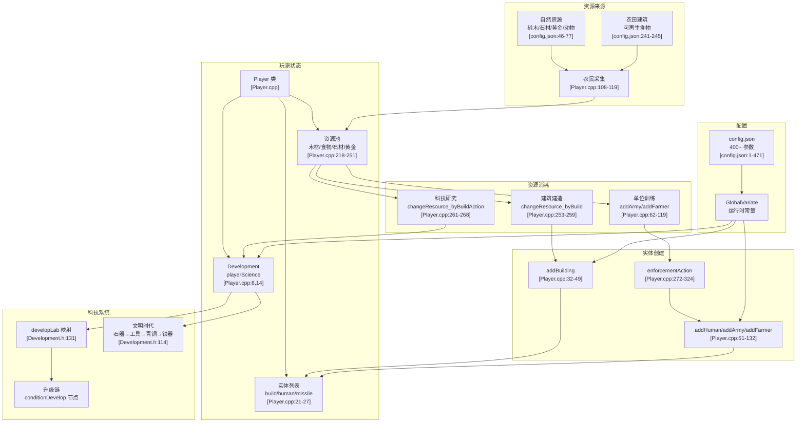
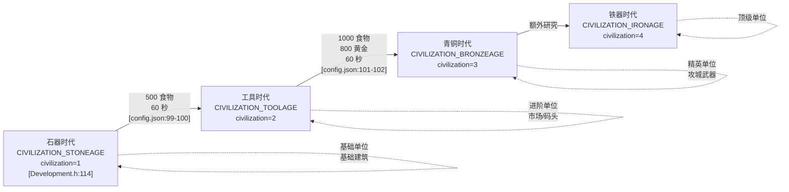
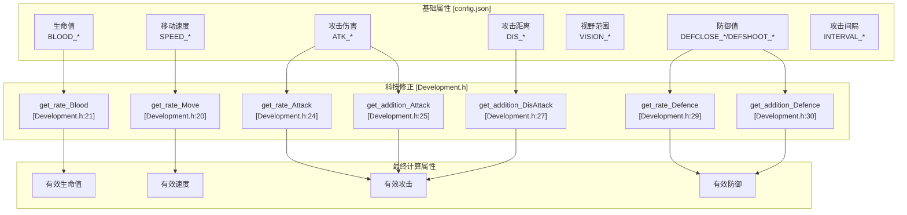
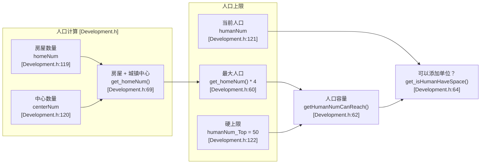
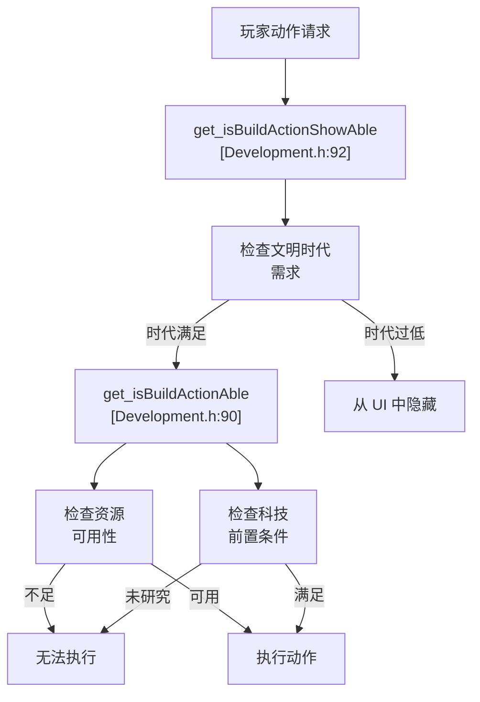
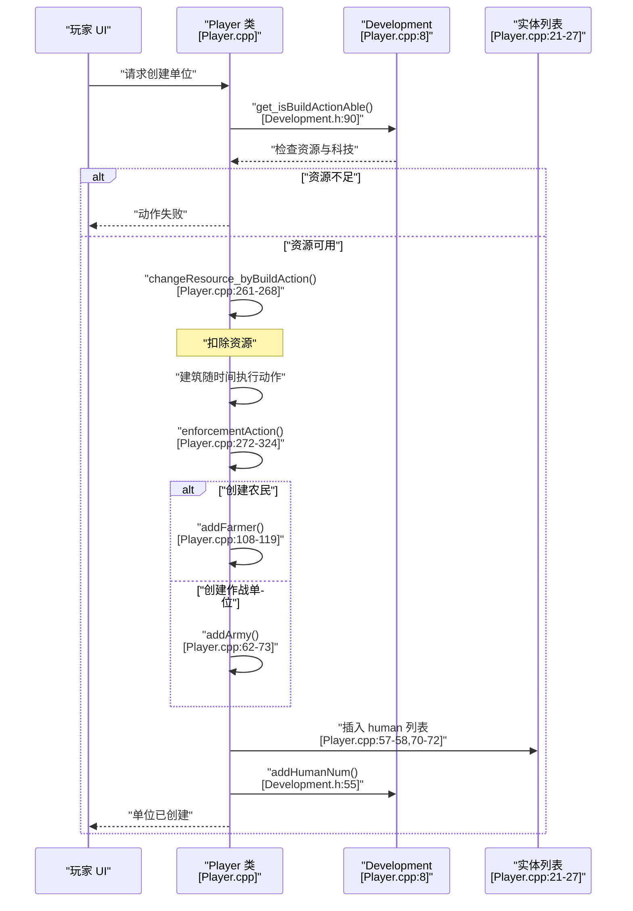

# 游戏机制

<details>
<summary>相关源文件</summary>

以下文件被用作生成此 wiki 页面的上下文：

- [Development.h](Development.h)
- [Player.cpp](Player.cpp)
- [config.json](config.json)

</details>


本文档概述了定义 new-aoe 中 RTS 体验的玩法系统。它涵盖资源管理、科技推进、单位/建筑属性以及战斗结算等相互关联的机制。有关特定子系统的实现细节，请参见：
- 资源采集与经济流程：[资源与经济系统](#3.1)
- 科技树结构与升级：[科技树](#3.2)
- 实体生命周期与属性：[单位与建筑](#3.3)
- 攻击/防御计算：[战斗系统](#3.4)

有关游戏实体的渲染与显示，请参见 [渲染与显示](#4.3)。有关基于这些机制的 AI 决策，请参见 [AI 架构](#5.1)。

## 玩法概览

该游戏实现了经典 RTS 机制：玩家采集资源、推进科技时代、建造建筑、训练单位并进行战斗。所有机制都通过 [config.json:1-471]() 以数据驱动方式定义，因此无需重新编译即可调整平衡。

核心玩法循环通过 `Player` 类 [Player.cpp:1-358]() 运作，其负责：
- 资源池（wood、food、stone、gold）
- 实体集合（建筑、单位、投射物）
- 通过 `Development` 类 [Development.h:1-139]() 管理科技状态
- 人口上限与住房需求

## 核心机制架构



**来源：** [Player.cpp:1-358](), [Development.h:1-139](), [config.json:1-471]()

## 资源类型

游戏使用四种主要资源来驱动玩家的全部行动：

| 资源 | 主要来源 | 采集方式 | 存储 | 关键用途 |
|----------|----------------|------------------|---------|----------|
| **木材** | 树木 [config.json:56-57]() | 农民砍伐/搬运 [config.json:60,68]() | 仓储建筑 | 建筑建造、部分单位 |
| **食物** | 瞪羚、灌木、农田、鱼类 [config.json:46,74,77,242]() | 农民狩猎/采集/耕作 [config.json:62,69]() | 粮仓建筑 | 单位训练、时代推进 |
| **石材** | 石料矿藏 [config.json:75]() | 农民开采/搬运 [config.json:63,71]() | 仓储建筑 | 防御建筑、高级建筑 |
| **黄金** | 金矿 [config.json:76]() | 农民开采/搬运 [config.json:62,70]() | 仓储建筑 | 高级单位、科技 |

资源管理通过 `Player::changeResource()` [Player.cpp:218-251]() 处理，它会根据采集/消耗操作校验并更新玩家的资源池。

### 初始资源

玩家初始拥有：
```
木材:  200  [config.json:80]
食物:  200  [config.json:81]
黄金:  150  [config.json:82]
石材:  0    [config.json:83]
```

### 农民携带容量

农民的携带容量有限，并且可以通过升级提高：

| 资源 | 基础容量 | 升级后容量 | 升级地点 |
|----------|---------------|-------------------|------------------|
| 木材 | 10 [config.json:60]() | 12 [config.json:64]() | 市场 |
| 食物 | 10 [config.json:61]() | 13 [config.json:65]() | 市场 |
| 黄金 | 10 [config.json:62]() | 15 [config.json:66]() | 市场 |
| 石材 | 10 [config.json:63]() | 13 [config.json:67]() | 市场 |

### 采集速度

基础采集速率（每帧资源数）：
```
木材:  0.02  [config.json:68]
食物:  0.02  [config.json:69]
黄金:  0.02  [config.json:70]
石材:  0.02  [config.json:71]
```

这些速率会通过 `Development::get_rate_ResorceGather()` [Development.h:36]() 的科技升级进行修正。

**来源：** [Player.cpp:218-251](), [config.json:60-83](), [Development.h:34-37]()

## 文明时代

科技推进系统将玩法划分为不同时代，每个时代都会解锁新的建筑、单位和升级。时代推进由 `Development` 类管理：



时代推进通过城镇中心的建筑动作触发，并由 `Development::civilization` [Development.h:114]() 进行跟踪。`civiChange()` 方法 [Development.h:135]() 负责处理时代切换。

**来源：** [Development.h:50-52,114,135](), [config.json:99-102]()

## 实体属性系统

所有游戏实体（单位、建筑）的属性都在 [config.json]() 中定义，并通过 `Development` 类访问。属性计算系统会在基础值之上叠加科技加成：

### 属性类别



**来源：** [Development.h:19-31](), [config.json:56-470]()

## 单位类型示例

[config.json]() 中的示例单位属性：

### 步兵单位

| 单位 | HP | 速度 | 攻击 | 射程 | 近战防御 | 远程防御 | 成本 |
|------|----|----|--------|-------|-----------|-----------|------|
| 棍棒兵（1 阶） | 40 [config.json:273]() | 2.44 [config.json:266]() | 3 [config.json:270]() | 近战 | 0 [config.json:271]() | 0 [config.json:272]() | 50 食物 [config.json:159]() |
| 棍棒兵（2 阶） | 50 [config.json:274]() | 2.44 [config.json:275]() | 5 [config.json:279]() | 近战 | 0 [config.json:280]() | 0 [config.json:281]() | 100 食物（升级） [config.json:161]() |
| 短剑士（1 阶） | 150 [config.json:282]() | 2.44 [config.json:283]() | 9 [config.json:287]() | 近战 | 1 [config.json:288]() | 0 [config.json:289]() | 35 食物 + 15 黄金 [config.json:464-465]() |

### 远程单位

| 单位 | HP | 速度 | 攻击 | 射程 | 防御 | 成本 | 训练时间 |
|------|----|----|--------|-------|---------|------|------------|
| 投石兵 | 25 [config.json:314]() | 2.44 [config.json:315]() | 2 [config.json:319]() | 4 [config.json:317]() | 0/2 [config.json:320-321]() | 40 食物 + 10 石材 [config.json:163-164]() | 24 秒 [config.json:165]() |
| 弓箭手 | 35 [config.json:322]() | 2.44 [config.json:323]() | 3 [config.json:327]() | 5 [config.json:325]() | 0/0 [config.json:328-329]() | 40 食物 + 20 木材 [config.json:170-171]() | 30 秒 [config.json:172]() |
| 强化弓箭手（1 阶） | 120 [config.json:330]() | 2.44 [config.json:331]() | 8 [config.json:335]() | 6 [config.json:333]() | 0/0 [config.json:336-337]() | - | - |

### 骑兵单位

| 单位 | HP | 速度 | 攻击 | 防御 | 成本 | 特性 |
|------|----|----|--------|---------|------|---------|
| 斥候 | 80 [config.json:346]() | 4.07 [config.json:347]() | 5 [config.json:351]() | 0/0 [config.json:352-353]() | 60 食物 [config.json:177]() | 高视野：8 [config.json:348]() |
| 骑兵 | 150 [config.json:366]() | 4.07 [config.json:367]() | 8 [config.json:371]() | 0/0 [config.json:372-373]() | 70 食物 + 80 黄金 [config.json:179-180]() | 快速突击单位 |
| 战车 | 120 [config.json:354]() | 3.5 [config.json:355]() | 10 [config.json:357]() | 1/0 [config.json:360-361]() | 40 食物 + 60 木材 [config.json:363-364]() | 中等速度 |

**来源：** [config.json:266-470]()

## 建筑机制

建筑承担多种职责：资源存储、单位生产、科技研究以及防御。关键建筑参数如下：

### 建造成本与时间

| 建筑 | HP | 建造成本 | 建造时间 | 特殊属性 |
|----------|----|----|------------|-------------------|
| 城镇中心 | 600 [config.json:93]() | 200 [config.json:95]() | 60 秒 [config.json:96]() | 生产农民，推进时代 [config.json:97-102]() |
| 房屋 | 75 [config.json:103]() | 30 [config.json:105]() | 20 秒 [config.json:106]() | +4 人口 [config.json:43]() |
| 仓储建筑 | 350 [config.json:107]() | 120 [config.json:109]() | 30 秒 [config.json:110]() | 资源存储，步兵升级 [config.json:111-142]() |
| 粮仓 | 350 [config.json:147]() | 120 [config.json:149]() | 30 秒 [config.json:150]() | 弓兵研究，城墙研究 [config.json:151-154]() |
| 军营 | 350 [config.json:155]() | 125 [config.json:157]() | 30 秒 [config.json:158]() | 生产棍棒兵 [config.json:159-162]() |
| 靶场 | 350 [config.json:166]() | 150 [config.json:168]() | 40 秒 [config.json:169]() | 生产弓箭手 [config.json:170-172]() |
| 马厩 | 350 [config.json:173]() | 150 [config.json:175]() | 40 秒 [config.json:176]() | 生产骑兵 [config.json:177-181]() |
| 市场 | 350 [config.json:182]() | 150 [config.json:184]() | 40 秒 [config.json:185]() | 经济升级 [config.json:196-240]() |
| 码头 | 350 [config.json:186]() | 100 [config.json:188]() | 40 秒 [config.json:189]() | 生产船只 [config.json:190-195]() |
| 农田 | 50 [config.json:241]() | 75 [config.json:244]() | 30 秒 [config.json:245]() | 产出 250 食物 [config.json:242]() |
| 箭塔 | 125 [config.json:246]() | 150 石材 [config.json:252]() | 80 秒 [config.json:253]() | 攻击：3，射程：7 [config.json:247,250]() |
| 城墙 | 200 [config.json:254]() | 5 石材 [config.json:256]() | 10 秒 [config.json:257]() | 防御建筑 |

### 建筑动作系统

建筑可以通过 `Player::enforcementAction()` 系统 [Player.cpp:272-324]() 执行动作（训练单位、研究科技）。当一个动作完成时：

1. 资源通过 `changeResource_byBuildAction()` [Player.cpp:261-268]() 被消耗
2. 科技状态通过 `Development::finishAction()` [Development.h:79-80]() 更新
3. 如果该动作会创建单位，`enforcementAction()` 会在相邻的有效格子中生成这些单位 [Player.cpp:295-323]()

**来源：** [Player.cpp:272-324](), [config.json:93-257](), [Development.h:79-103]()

## 人口管理

人口通过住房需求进行管理：



每座房屋提供 4 个人口位 [config.json:43]()。城镇中心计作一座房屋 [Development.h:69]()。人口通过以下接口跟踪：
- `addHumanNum()` / `subHumanNum()` [Development.h:55-56]()
- 当房屋被建造/摧毁时，使用 `addHome()` / `subHome()` [Development.h:70-71]()

**来源：** [Development.h:54-72,119-122](), [config.json:43]()

## 科技升级链

科技以链式升级路径的形式组织在 `developLab` 映射 [Development.h:131]() 中。每座建筑都可以执行多个研究动作：

### 示例：步兵攻击升级（仓储建筑）


### 示例：资源采集升级（市场）

| 科技 | 效果 | 成本 | 时间 | 加成 |
|-----------|--------|------|------|-------|
| 伐木 | 木材携带 +2，采集速率 +0.2，箭矢射程 +1 [config.json:199-201]() | 120 食物 + 75 木材 [config.json:196-197]() | 40 秒 [config.json:198]() | 影响所有农民 |
| 采石 | 石材携带 +3，采集速率 +0.2，投石兵攻击/射程 +1 [config.json:216-219]() | 100 食物 + 50 石材 [config.json:213-214]() | 60 秒 [config.json:215]() | 多效果升级 |
| 采金 | 黄金携带 +3，采集速率 +0.2 [config.json:223-224]() | 120 食物 + 100 木材 [config.json:220-221]() | 60 秒 [config.json:222]() | 经济提升 |
| 农田升级 | 农田食物 +75 [config.json:228]() | 200 食物 + 50 木材 [config.json:225-226]() | 60 秒 [config.json:227]() | 提高农田产量 |

升级加成通过 `Development::get_addition_*()` 和 `get_rate_*()` 方法 [Development.h:19-37]() 应用，这些方法会查询 `developLab` 映射的当前状态。

**来源：** [Development.h:19-37,131](), [config.json:111-240]()

## 战斗参数

战斗涉及攻击、防御和投射物机制。关键参数如下：

### 攻击类型与防御

单位分别拥有针对近战和远程攻击的独立防御值：
- **DEFCLOSE**：针对近战攻击的防御 [config.json:271,280,288,etc.]()
- **DEFSHOOT**：针对远程攻击的防御 [config.json:272,281,289,etc.]()

### 投射物系统

远程单位会创建 `Missile` 对象 [Player.cpp:134-153]()，其具有速度参数：

| 投射物类型 | 速度 | 射程 | 特殊效果 |
|-------------|-------|-------|---------|
| 长矛 | 8.94 [config.json:398]() | - | 狮子/大象攻击 |
| 箭矢 | 20.12 [config.json:399]() | - | 弓手/弓箭手弹体 |
| 石块 | 20.12 [config.json:400]() | - | 投石兵弹体 |
| 巨石 | 8.94 [config.json:401]() | 2 AoE [config.json:402]() | 攻城武器，范围伤害 |

投射物通过 `Player::addMissile()` [Player.cpp:134-153]() 创建，并在 `missile` 列表 [Player.cpp:27]() 中跟踪。

### 攻击距离

```
近战:        17.89  [config.json:262]
命中目标:     4.0    [config.json:263]
大象攻击:    42.57  [config.json:264]
```

攻击结算会使用这些距离来确定单位何时能够与目标交战。

**来源：** [Player.cpp:134-153](), [config.json:262-402]()

## 基于帧的计时

许多游戏机制使用 25 FPS [config.json:33]() 的帧计时：

### 单位创建时间（秒）

| 动作 | 25 FPS 下的帧数 |
|--------|------------------|
| 创建农民 | 20 秒 → 500 帧 [config.json:98]() |
| 创建棍棒兵 | 26 秒 → 650 帧 [config.json:160]() |
| 创建弓箭手 | 30 秒 → 750 帧 [config.json:172]() |
| 创建斥候 | 30 秒 → 750 帧 [config.json:178]() |
| 建造城镇中心 | 60 秒 → 1500 帧 [config.json:96]() |
| 建造箭塔 | 80 秒 → 2000 帧 [config.json:253]() |

### 动作间隔

单位具有决定其攻击频率的攻击间隔：

```
棍棒兵:      1.5 秒  [config.json:269]
弓箭手:      1.4 秒  [config.json:326]
骑兵:        1.5 秒  [config.json:370]
投石器:      4.2 秒  [config.json:387]
```

这些间隔在战斗执行期间以帧数形式进行跟踪。

**来源：** [config.json:33,96-470]()

## 校验与约束

`Development` 类会在允许动作执行之前提供校验方法：



这种两阶段检查（showable → executable）允许 UI 为不可用科技显示灰显选项，同时隐藏当前时代完全无法访问的选项。

**来源：** [Development.h:85-92]()

## 实体创建流程

创建游戏实体的完整流程：



**来源：** [Player.cpp:62-119,261-324](), [Development.h:55,90]()
