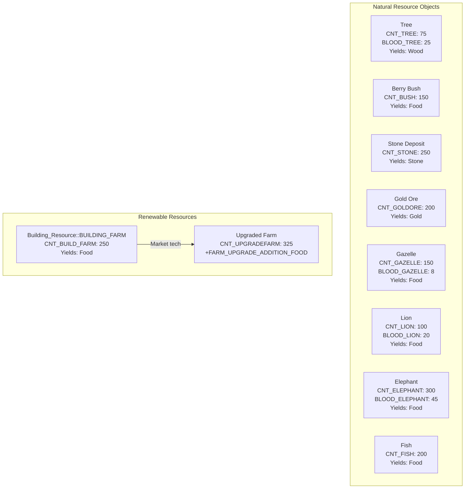
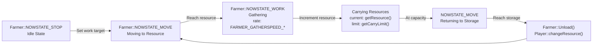
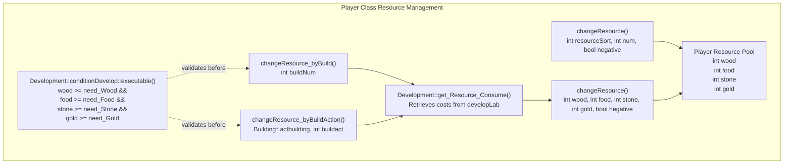
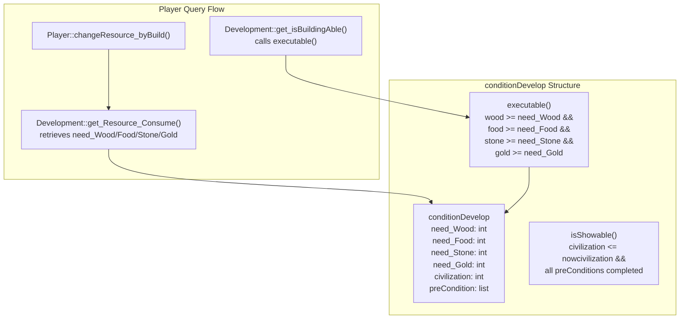
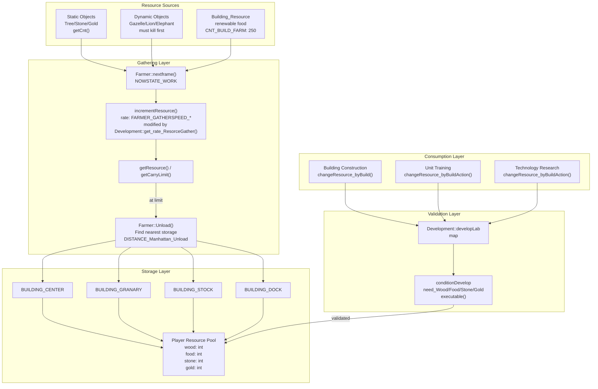

# 资源与经济系统

<details>
<summary>相关源文件</summary>

以下文件被用作生成本 wiki 页面时的上下文：

- [Development.h](Development.h)
- [GlobalVariate.h](GlobalVariate.h)
- [Player.cpp](Player.cpp)
- [config.json](config.json)

</details>


本文档描述资源与经济系统，该系统负责管理四种主要资源类型（木材、肉/食物、石头、黄金），以及它们在整个游戏中的采集、存储和消耗。该系统实现了一个经典 RTS 的经济循环：玩家从地图上收集资源，并消耗这些资源来建造建筑、训练单位和研究科技。

关于科技树和升级前置条件的信息，参见 [科技树](#3.2)。关于建筑与单位机制，参见 [单位与建筑](#3.3)。

---

## 概览

资源经济系统集中在 `Player` 类中，该类维护资源池，并通过 `Development` 系统校验所有支出。资源从自然来源，经由采集单位（主要是 `Farmer` 实例）流入存储建筑，随后被建筑建造、单位训练和科技研究等活动消耗。

**核心组件：**
- **Player 类**：维护资源池（木材、食物、石头、黄金）
- **Farmer 单位**：从资源源点采集资源并运送到存储点
- **Building_Resource**：可再生食物来源（农田）
- **Development 类**：在资源支出前验证资源是否足够
- **config.json**：定义所有成本、采集速率和初始数量

Sources: [Player.cpp:1-358](), [Development.h:1-139](), [config.json:1-472](), [GlobalVariate.h:1-1326]()

---

## 资源类型

游戏使用四种主要资源类型，每种都有不同的来源和用途：

| 资源 | 代码常量 | 初始数量 | 主要来源 | 主要用途 |
|----------|---------------|----------------|-----------------|--------------|
| **木材** | `HUMAN_WOOD` | `INITIAL_WOOD` (200) | 树木、砍伐 | 建筑建造、单位训练 |
| **食物/肉** | `HUMAN_GRANARYFOOD`, `HUMAN_STOCKFOOD`, `HUMAN_DOCKFOOD` | `INITIAL_MEAT` (200) | 动物、浆果、农田、鱼类 | 单位训练、科技研究 |
| **石头** | `HUMAN_STONE` | `INITIAL_STONE` (0) | 石矿 | 防御建筑、特定升级 |
| **黄金** | `HUMAN_GOLD` | `INITIAL_GOLD` (150) | 金矿 | 高级单位、时代升级 |

**特殊资源子类型：**
- 食物根据存储建筑分为三种采集类别：谷仓食物（浆果）、仓库存食物（动物）和码头食物（鱼）
- 所有食物类型最终都会汇总到 `Player` 类中的单一 `food` 计数器

Sources: [config.json:80-83](), [GlobalVariate.h:17-20](), [Player.cpp:218-241]()

---

## 资源来源

### 自然资源

自然资源以静态或动态对象的形式放置在地图上，并且数量有限：



**资源数量：**
- `CNT_*` 常量定义每个资源源点的总产出
- 每棵树提供 75 单位木材
- 动物必须先被击杀后才能采集（拥有 `BLOOD_*` 生命值）
- 农田可被建造，并提供可再生食物（基础 250，升级后为 325+）

Sources: [config.json:46-77](), [config.json:211-245]()

---

## 资源采集系统

### Farmer 采集机制

`Farmer` 类通过状态机实现资源采集：



**采集参数：**

| 参数 | 基础值 | 升级后数值 | 配置常量 |
|-----------|------------|----------------|-----------------|
| 木材采集速度 | 0.02/帧 | +0.2（砍伐科技） | `FARMER_GATHERSPEED_WOOD` |
| 食物采集速度 | 0.02/帧 | - | `FARMER_GATHERSPEED_FOOD` |
| 黄金采集速度 | 0.02/帧 | +0.2 | `FARMER_GATHERSPEED_GOLD` |
| 石头采集速度 | 0.02/帧 | +0.2 | `FARMER_GATHERSPEED_STONE` |
| 木材携带上限 | 10 | 12 | `FARMER_CARRYLIMIT_WOOD`, `FARMER_CARRYLIMIT_UPGRADEWOOD` |
| 食物携带上限 | 10 | 13 | `FARMER_CARRYLIMIT_FOOD`, `FARMER_CARRYLIMIT_UPGRADEFOOD` |
| 黄金携带上限 | 10 | 15 | `FARMER_CARRYLIMIT_GOLD`, `FARMER_CARRYLIMIT_UPGRADEGOLD` |
| 石头携带上限 | 10 | 13 | `FARMER_CARRYLIMIT_STONE`, `FARMER_CARRYLIMIT_UPGRADESTONE` |
| 建造速度 | 0.02/帧 | - | `FARMER_CONSTRUCTSPEED` |

**采集速率计算：**
`Development` 类通过 `get_rate_ResorceGather()` 提供加成倍率，农民会查询该值以确定实际采集速度。

Sources: [config.json:58-72](), [Development.h:35-36](), [GlobalVariate.h:281-293]()

---

## 资源存储与管理

### Player 资源池

`Player` 类维护中央资源池，并负责校验：



**关键方法：**

- **`changeResource(int resourceSort, int num, bool negative)`** [Player.cpp:218-241]()
  - 修改单一资源类型
  - `negative=true` 表示扣除资源，`false` 表示增加资源
  - 基于 `resourceSort`（HUMAN_WOOD、HUMAN_GOLD 等）使用 switch 语句处理

- **`changeResource(int wood, int food, int stone, int gold, bool negative)`** [Player.cpp:243-251]()
  - 同时修改四种资源
  - 用于资源存入和多资源成本扣除

- **`changeResource_byBuild(int buildNum)`** [Player.cpp:253-259]()
  - 为建筑建造扣除资源
  - 查询 `Development::get_Resource_Consume()` 获取成本
  - 始终执行扣除（negative=true）

- **`changeResource_byBuildAction(Building* actbuilding, int buildact)`** [Player.cpp:261-268]()
  - 为建筑动作（单位训练、科技研究）扣除资源
  - 将成本存储到建筑的 `Resource_TS` 中，以便取消时退款
  - 调用 `Building::set_Resource_TS()` 跟踪支出

Sources: [Player.cpp:218-268](), [Development.h:94-97]()

### 存储建筑

农民需要依赖存储建筑来卸下资源：

| 建筑 | 类型常量 | 用途 |
|----------|---------------|---------|
| 城镇中心 | `BUILDING_CENTER` | 所有资源的主要存储点 |
| 谷仓 | `BUILDING_GRANARY` | 食物存储 |
| 储藏坑 | `BUILDING_STOCK` | 通用资源存储 |
| 码头 | `BUILDING_DOCK` | 鱼类资源存储 |

当农民背包已满时，会自动在 `DISTANCE_Manhattan_Unload`（42.93 单位）范围内寻找最近的存储建筑。

Sources: [config.json:258-261](), [Player.cpp:108-132]()

---

## 资源消耗

### 建筑建造成本

建筑通过 `Player::addBuilding()` [Player.cpp:32-49]() 创建，其成本由 `Development` 进行校验：

```mermaid
graph LR
    REQUEST["UI: Build Request<br/>buildingNum"]
    VALIDATE["Development::get_isBuildingAble()<br/>checks resources"]
    DEDUCT["Player::changeResource_byBuild()<br/>deducts cost"]
    CREATE["Player::addBuilding()<br/>creates Building instance"]
    CONSTRUCT["Building construction<br/>percent increases over time"]
    FINISH["Player::finishBuild()<br/>Development::finishAction()"]
    
    REQUEST --> VALIDATE
    VALIDATE -->|"sufficient"| DEDUCT
    DEDUCT --> CREATE
    CREATE --> CONSTRUCT
    CONSTRUCT -->|"percent >= 100"| FINISH
```



**建筑成本示例（来自 config.json）：**

| 建筑 | 木材 | 食物 | 石头 | 黄金 | 建造时间 |
|----------|------|------|-------|------|------------|
| 城镇中心 | 200 | - | - | - | 60s |
| 房屋 | 30 | - | - | - | 20s |
| 储藏坑 | 120 | - | - | - | 30s |
| 兵营 | 125 | - | - | - | 30s |
| 农田 | 75 | - | - | - | 30s |
| 箭塔 | - | - | 150 | - | 80s |
| 市场 | 150 | - | - | - | 40s |

Sources: [config.json:95-257](), [Player.cpp:253-259]()

### 单位训练成本

单位通过建筑动作进行训练，其成本定义在 `conditionDevelop` 结构中：

**单位成本示例：**

| 单位 | 建筑 | 食物 | 木材 | 石头 | 黄金 | 训练时间 |
|------|----------|------|------|-------|------|------------|
| 农民 | 城镇中心 | 50 | - | - | - | 20s |
| 棍棒兵 | 兵营 | 50 | - | - | - | 26s |
| 弓箭手 | 靶场 | 40 | 20 | - | - | 30s |
| 投石兵 | 兵营 | 40 | - | 10 | - | 24s |
| 侦察骑兵 | 马厩 | 60 | - | - | - | 30s |
| 骑兵 | 马厩 | 70 | - | - | 80 | 30s |
| 投石车 | 攻城工坊 | - | 180 | - | 80 | 30s |
| 战船 | 码头 | - | 135 | - | - | 30s |

Sources: [config.json:97-212](), [Player.cpp:261-268]()

### 科技研究成本

科技通过建筑动作进行研究，其成本会逐步提升：

**科技成本示例：**

| 科技 | 建筑 | 食物 | 木材 | 石头 | 黄金 | 研究时间 |
|------------|----------|------|------|-------|------|---------------|
| 工具时代 | 城镇中心 | 500 | - | - | - | 60s |
| 青铜时代 | 城镇中心 | 1000 | - | - | 800 | 60s |
| 步兵攻击 +2 | 储藏坑 | 100 | - | - | - | 40s |
| 步兵防御 +2 | 储藏坑 | 75 | - | - | - | 40s |
| 弓兵防御 +2 | 储藏坑 | 100 | - | - | - | 40s |
| 伐木 | 市场 | 120 | 75 | - | - | 40s |
| 采石 | 市场 | 100 | - | 50 | - | 60s |
| 采金 | 市场 | 120 | 100 | - | - | 60s |
| 驯化 | 市场 | 200 | 50 | - | - | 60s |
| 轮子 | 市场 | 150 | 100 | - | - | 40s |
| 工艺 | 市场 | 170 | 150 | - | - | 40s |
| 犁 | 市场 | 250 | 75 | - | - | 40s |

**资源退款：**
当建筑动作（单位训练或科技研究）被手动取消时，会通过 `Player::back_Resource_TS()` [Player.cpp:326-333]() 返还资源，该函数会从 `Building::get_Resouce_TS()` 中取回已存储的成本。

Sources: [config.json:99-240](), [Player.cpp:326-333]()

---

## 资源校验与科技树集成

`Development` 类通过 `conditionDevelop` 系统强制执行资源约束：



**校验流程：**

1. **显示校验**：`Development::get_isBuildActionShowAble()` [Development.h:92]() 检查该动作是否应出现在 UI 中
   - 验证文明时代要求
   - 检查所有前置科技是否已完成
   
2. **执行校验**：`Development::get_isBuildActionAble()` [Development.h:90]() 检查该动作是否可以执行
   - 先调用 `isShowAble()`
   - 然后调用 `conditionDevelop::executable()` [GlobalVariate.h:1160]() 验证资源
   
3. **资源扣除**：`Player::changeResource_byBuildAction()` [Player.cpp:261-268]()
   - 通过 `Development::get_Resource_Consume()` 获取成本
   - 将成本存储到建筑中，以便可能的退款
   - 从玩家资源池中扣除

Sources: [GlobalVariate.h:1106-1189](), [Development.h:87-103](), [Player.cpp:253-268]()

---

## 资源流架构

### 完整经济循环



**关键流转节点：**

1. **采集**：农民以每帧 `FARMER_GATHERSPEED_*` 的速度采集，并受到科技加成影响
2. **携带**：资源累积在农民库存中，直到达到 `FARMER_CARRYLIMIT_*`
3. **存入**：达到上限后，农民移动到最近的存储点并调用 `Unload()`
4. **汇总**：`Player::changeResource()` 将资源加入中央资源池
5. **校验**：所有支出都通过 `Development::conditionDevelop::executable()` 校验
6. **消耗**：资源通过 `changeResource_byBuild()` 或 `changeResource_byBuildAction()` 扣除

Sources: [Player.cpp:218-268](), [config.json:58-240](), [Development.h:87-103]()

---

## 配置参数

所有资源相关参数都通过 `config.json` 数据驱动，并由 `ReadConfig()` 加载到全局变量中：

### 初始资源

定义于 [config.json:80-83]():
```json
"INITIAL_WOOD": 200,
"INITIAL_MEAT": 200,
"INITIAL_GOLD": 150,
"INITIAL_STONE": 0
```

声明于 [GlobalVariate.h:17-20]():
```cpp
extern int INITIAL_WOOD;
extern int INITIAL_MEAT;
extern int INITIAL_GOLD;
extern int INITIAL_STONE;
```

### 采集速率与上限

基础采集配置于 [config.json:60-72]():
```json
"FARMER_CARRYLIMIT_WOOD": 10,
"FARMER_CARRYLIMIT_FOOD": 10,
"FARMER_CARRYLIMIT_GOLD": 10,
"FARMER_CARRYLIMIT_STONE": 10,
"FARMER_GATHERSPEED_WOOD": 0.02,
"FARMER_GATHERSPEED_FOOD": 0.02,
"FARMER_GATHERSPEED_GOLD": 0.02,
"FARMER_GATHERSPEED_STONE": 0.02,
"FARMER_CONSTRUCTSPEED": 0.02
```

升级后数值定义于 [config.json:64-67]():
```json
"FARMER_CARRYLIMIT_UPGRADEWOOD": 12,
"FARMER_CARRYLIMIT_UPGRADEFOOD": 13,
"FARMER_CARRYLIMIT_UPGRADEGOLD": 15,
"FARMER_CARRYLIMIT_UPGRADESTONE": 13
```

### 资源源点数量

自然资源数量定义于 [config.json:46-77]():
```json
"CNT_TREE": 75,
"CNT_BUSH": 150,
"CNT_STONE": 250,
"CNT_GOLDORE": 200,
"CNT_GAZELLE": 150,
"CNT_LION": 100,
"CNT_ELEPHANT": 300,
"CNT_FISH": 200,
"CNT_BUILD_FARM": 250,
"CNT_UPGRADEFARM": 325
```

### 成本常量命名模式

建筑成本遵循命名模式 `BUILD_<BUILDINGNAME>_<RESOURCE>`：
- `BUILD_CENTER_WOOD`: 200
- `BUILD_HOUSE_WOOD`: 30
- `BUILD_ARROWTOWER_STONE`: 150

单位训练遵循 `BUILDING_<BUILDING>_CREATE_<UNIT>_<RESOURCE>`：
- `BUILDING_CENTER_CREATEFARMER_FOOD`: 50
- `BUILDING_ARMYCAMP_CREATE_CLUBMAN_FOOD`: 50
- `BUILDING_STABLE_CREATE_CAVALRY_GOLD`: 80

科技研究遵循 `BUILDING_<BUILDING>_UPGRADE_<TECH>_<RESOURCE>`：
- `BUILDING_CENTER_UPGRADE_TOOLAGE_FOOD`: 500
- `BUILDING_STOCK_UPGRADE_CLOSER_ATTACK_FOOD`: 100

时间常量遵循 `TIME_BUILD_<NAME>` 或 `TIME_BUILDING_<BUILDING>_<ACTION>`：
- `TIME_BUILD_CENTER`: 60（秒）
- `TIME_BUILDING_CENTER_CREATEFARMER`: 20（秒）

Sources: [config.json:1-472](), [GlobalVariate.h:17-228]()

---

## 总结

资源经济系统实现了一个紧密耦合的架构，其中：

1. **Player** 维护权威资源池
2. **Farmer** 单位从资源源点采集并运送到存储点
3. **Development** 根据科技树前置条件校验所有支出
4. **conditionDevelop** 结构定义成本与前置条件
5. **config.json** 提供完整的数据驱动配置

所有资源修改都会通过 `Player::changeResource()` 方法流转，从而确保集中跟踪。`Development` 类充当守门人，基于文明时代、前置条件完成情况和资源可用性阻止非法支出。这种设计使 AI 系统能够通过 `tagInfo` 结构查询当前资源，同时维持游戏状态完整性。

Sources: [Player.cpp:1-358](), [Development.h:1-139](), [GlobalVariate.h:1-1326](), [config.json:1-472]()
