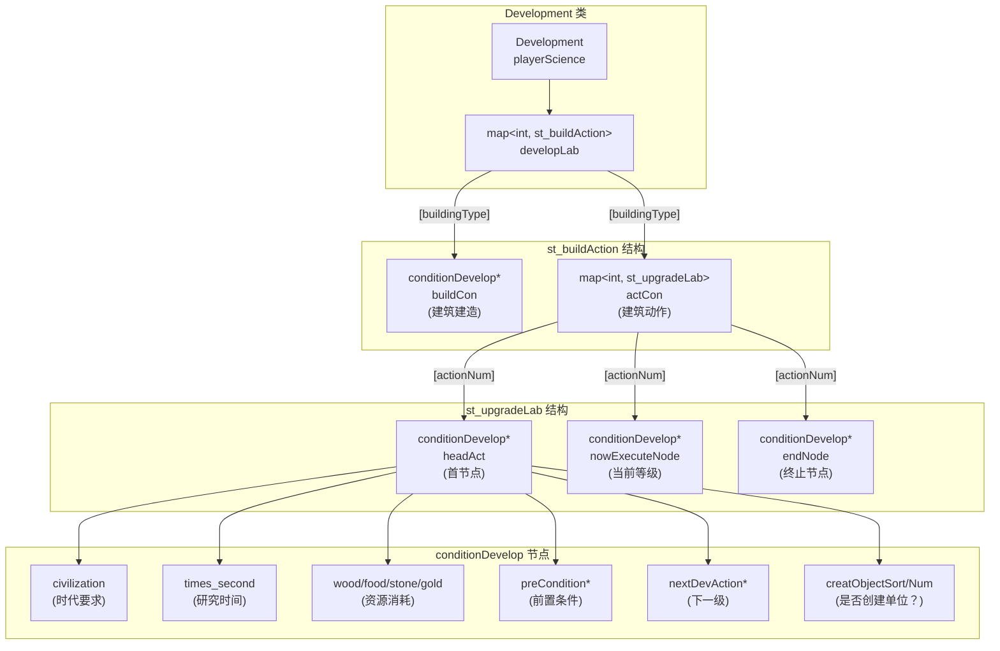
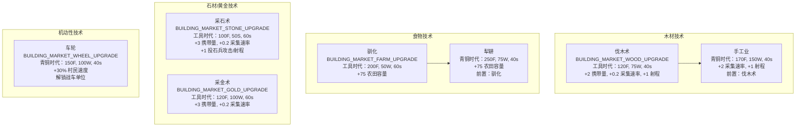
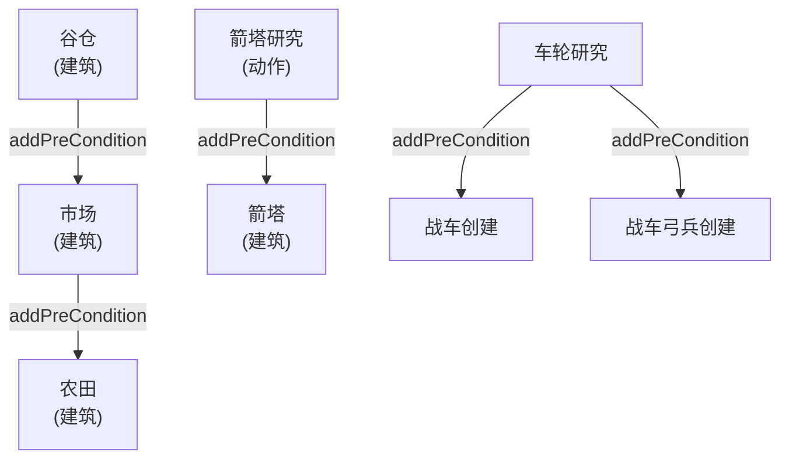
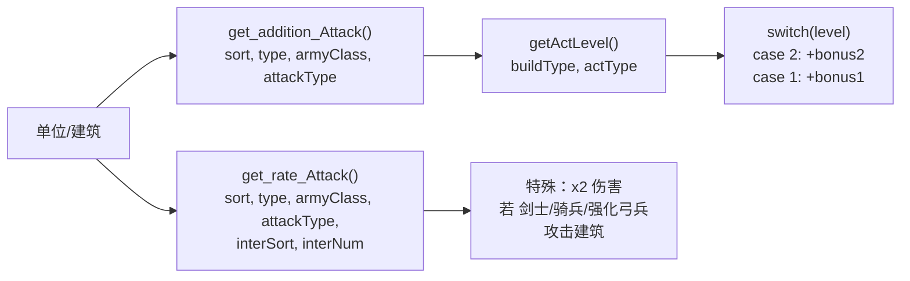
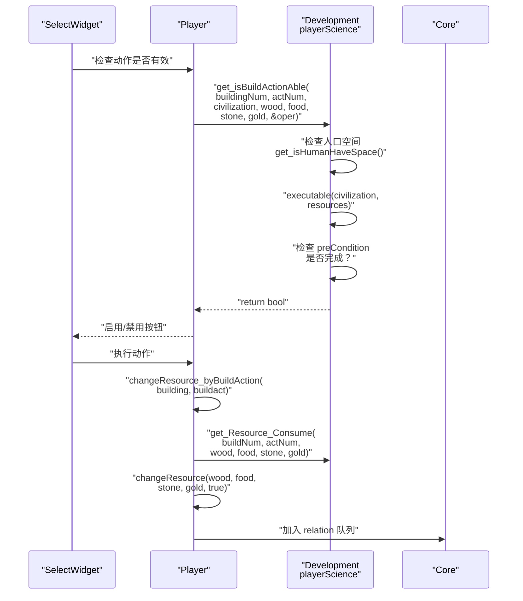
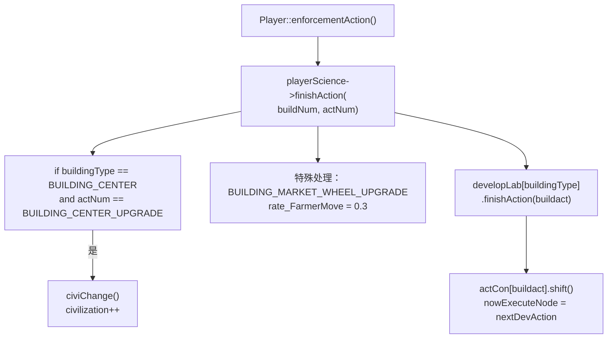
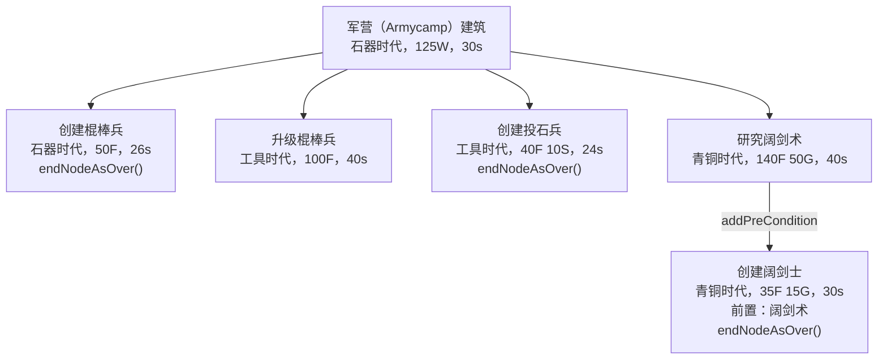

# 科技树

<details>
<summary>相关源文件</summary>

以下文件被用作生成本维基页面的上下文：

- [Development.cpp](Development.cpp)
- [Development.h](Development.h)
- [Player.cpp](Player.cpp)
- [config.json](config.json)

</details>


科技树系统负责管理研究推进、文明时代升级以及属性加成。`Development` 类维护了一个技术节点的链表结构（`conditionDevelop`），用于强制执行前置条件、资源消耗以及文明时代要求。该系统与资源经济系统集成（见 [3.1](#3.1)），并影响单位/建筑的统计属性（见 [3.3](#3.3)）。

---

## 核心数据结构

科技树通过三个嵌套的数据结构实现，它们构成了层级关系：



**来源：** [Development.h:1-139](), [Development.cpp:1-694]()

### conditionDevelop 节点

每项技术都由一个 `conditionDevelop` 节点表示，其中包含：

| 字段 | 类型 | 用途 |
|-------|------|---------|
| `civilization` | int | 所需最低时代（CIVILIZATION_STONEAGE/TOOLAGE/BRONZEAGE/IRONAGE） |
| `times_second` | double | 研究持续时间（秒） |
| `wood`, `food`, `stone`, `gold` | int | 资源消耗 |
| `preCondition` | conditionDevelop* | 所需前置技术 |
| `nextDevAction` | conditionDevelop* | 链中的下一级升级 |
| `creatObjectSort`, `creatObjectNum` | int | 要创建的单位类型（如适用） |

**来源：** [Development.cpp:393-693]()

### st_upgradeLab 链

用于管理多级升级（例如 1 级和 2 级护甲）：


当研究完成时，`nowExecuteNode` 指针会通过 `shift()` 向前推进，从而启用下一级。`getPhaseTimes()` 方法返回当前升级等级。

**来源：** [Development.cpp:326-336](), [Development.h:106-107]()

---

## 文明时代推进

### 时代升级机制

玩家通过城镇中心升级动作推进四个时代：


时代升级在 [Development.cpp:327-328]() 中处理，通过 [Development.cpp:360-365]() 中的 `civiChange()` 递增 `civilization` 变量。系统会为玩家播放 "Age_Level_Up" 音效。

**来源：** [Development.cpp:407-413](), [config.json:99-102]()

### 受时代限制的技术

每个 `conditionDevelop` 节点都指定了其最低时代要求。`isShowable(civilization)` 方法负责检查可见性：

| 时代 | 解锁建筑 | 解锁单位 | 解锁升级 |
|-----|-------------------|----------------|-------------------|
| **石器时代** | 中心、房屋、仓库、谷仓、军营、码头 | 农民、棍棒兵、帆船 | 无 |
| **工具时代** | 市场、靶场、马厩、农田、箭塔 | 弓箭手、斥候、投石兵、木船、战船 | 步兵/弓兵/骑兵护甲 Lv1、近战攻击 Lv1、资源采集升级 |
| **青铜时代** | 攻城工坊、学院 | 骑兵、战车、战车弓兵、复合弓兵、重装步兵（Hoplite）、投石车、阔剑士 | 护甲 Lv2、近战攻击 Lv2、青铜盾、复合弓、车轮、手工业、犁耕 |

**来源：** [Development.cpp:393-693]()

---

## 技术类别

### 经济技术

经济类升级在市场建筑中研究：



采集速率加成通过 [Development.cpp:247-287]() 中的 `get_rate_ResorceGather()` 应用。携带量加成通过 [Development.cpp:208-245]() 中的 `get_addition_ResourceSort()` 应用。

**来源：** [Development.cpp:514-573](), [config.json:196-240]()

### 军事技术

军事类升级分布在多个建筑中：

#### 仓库（Stock）建筑（护甲与攻击）


防御加成通过 [Development.cpp:142-204]() 中的 `get_addition_Defence()` 计算，并使用 `getActLevel()` 累加所有已完成升级等级的加成。

**来源：** [Development.cpp:422-461](), [config.json:111-128]()

#### 靶场（Range）建筑（弓兵技术）

靶场（Range）建筑提供复合弓技术，该技术会解锁复合弓兵单位：

```text
复合弓（青铜时代，180F 100W，40s）
  └─> 启用复合弓兵的创建（每单位 40F 20G）
```

**来源：** [Development.cpp:627-640](), [config.json:449-454]()

---

## 前置条件与依赖关系

### 前置链

技术可以通过 `addPreCondition()` 依赖其他技术：



验证时，`executable()` 方法会检查：
1. 当前文明时代 >= 所需时代
2. 资源充足（wood/food/stone/gold）
3. 所有 `preCondition` 节点均已完成

**来源：** [Development.cpp:515-517](), [Development.cpp:546-551](), [Development.cpp:587-593]()

### 建筑前置条件

建筑建造同样会强制执行前置条件：

| 建筑 | 前置建筑 | 前置技术 |
|----------|----------------------|-------------------------|
| 市场 | 谷仓 | 无 |
| 农田 | 市场 | 无 |
| 靶场 | 军营 | 无 |
| 马厩 | 军营 | 无 |
| 箭塔 | 无 | 箭塔研究（在谷仓） |

**来源：** [Development.cpp:515-517](), [Development.cpp:646-650]()

---

## 属性修正系统

`Development` 类提供查询方法，用于计算已完成技术带来的累积加成：

### 攻击修正



攻击加成在 [Development.cpp:55-92]() 中实现：
- 近战单位从工具锻造/金属锻造获得 +2/+4 攻击
- 投石兵从采石术获得 +1 攻击
- 箭塔从箭塔升级获得 +4 攻击
- 建筑受到来自剑士、骑兵和强化弓兵的 2 倍伤害

**来源：** [Development.cpp:40-92]()

### 防御修正

[Development.cpp:142-204]() 中的防御计算会应用累积加成：

```cpp
// 示例：2 级步兵护甲
level = getActLevel(BUILDING_STOCK, BUILDING_STOCK_UPGRADE_DEFENSE_INFANTRY);
switch (level) {
    case 2:
        addition += BUILDING_STOCK_UPGRADE_DEFENSE_INFANTRY_2_ADDITION_DEFENSE_INFANTRY; // +2
    case 1:
        addition += BUILDING_STOCK_UPGRADE_DEFENSE_INFANTRY_ADDITION_DEFENSE_INFANTRY; // +2
    // 总计：+4 防御
}
```

注意，这里的 `switch` 语句刻意使用了 fall-through，以累加所有升级等级的加成。

**来源：** [Development.cpp:142-204]()

### 采集速率修正

资源采集倍率在 [Development.cpp:247-287]() 中应用：

| 技术 | 木材 | 食物 | 石材 | 黄金 |
|-----------|------|------|-------|------|
| 基础 | 1.0x | 1.0x | 1.0x | 1.0x |
| 伐木术 | 1.2x | - | - | - |
| 手工业 | 3.0x | - | - | - |
| 驯化 | - | - | - | - |
| 犁耕 | - | - | - | - |
| 采石术 | - | - | 1.2x | - |
| 采金术 | - | - | - | 1.2x |

农田容量提升（每级 +75）在 [Development.cpp:290-311]() 中通过 `get_addition_MaxCnt()` 单独处理。

**来源：** [Development.cpp:247-287](), [config.json:196-240]()

---

## 与 Player 系统的集成

### 资源校验流程



[Development.cpp:338-347]() 中的校验会检查：
1. 如果该动作会创建单位，则通过 `get_isHumanHaveSpace()` 验证人口空间
2. 调用 `developLab[buildingNum].actCon[actNum].executable()` 以验证时代和资源
3. 如果人口已满，则在 `oper` 指针中返回错误码（设为 1）

**来源：** [Development.cpp:338-347](), [Player.cpp:253-268]()

### 技术完成

当建筑动作完成时，系统会更新科技树：



车轮升级在 [Development.cpp:329-333]() 中被特殊处理，会设置 `rate_FarmerMove = 0.3`，该值由 [Development.cpp:13-19]() 中的 `get_rate_Move()` 查询。

**来源：** [Development.cpp:325-336](), [Player.cpp:272-324]()

### 人口管理

Development 类负责跟踪人口上限：

```cpp
// 人口容量公式
int getMaxHumanNum() { return get_homeNum() * HOUSE_HUMAN_NUM; }
int get_homeNum() { return (int)(centerNum > 0) + homeNum; }

// 实际上限（封顶为 50）
int getHumanNumCanReach() { 
    return getMaxHumanNum() < humanNum_Top ? 
           getMaxHumanNum() : humanNum_Top; 
}
```

房屋提供 4 点人口（`HOUSE_HUMAN_NUM`）。城镇中心（Town Center）视作 1 个房屋。房屋数量通过 [Player.cpp:336-345]() 中的 `addHome()`/`subHome()` 调用进行跟踪。

**来源：** [Development.h:54-72](), [Player.cpp:189-197](), [config.json:43]()

---

## 科技树初始化

完整的科技树在 [Development.cpp:391-693]() 的 `init_DevelopLab()` 中构建。每个建筑和动作都会被配置：

### 初始化模式

```cpp
// 建筑建造节点
developLab[BUILDING_TYPE].buildCon = 
    new conditionDevelop(age, buildingNum, time, wood, food, stone, gold);

// 动作/升级节点
newNode = new conditionDevelop(age, buildingNum, time, wood, food, stone, gold);
newNode->addPreCondition(prerequisiteNode);
newNode->setCreatObjectAfterAction(SORT_ARMY, AT_UNIT_TYPE);
developLab[BUILDING_TYPE].actCon[ACTION_NUM].setHead(newNode);

// 多级升级
newNode2 = new conditionDevelop(higherAge, buildingNum, time, ...);
developLab[BUILDING_TYPE].actCon[ACTION_NUM].push_back(newNode2);
```

### 示例：军营（Armycamp）技术链



[Development.cpp:503-509]() 中的阔剑士创建展示了前置条件链接：该动作节点调用 `addPreCondition()` 指向阔剑术研究节点，从而在技术完成前阻止单位创建。

**来源：** [Development.cpp:479-511]()

---

## 完整技术参考

### 石器时代技术

| 建筑 | 动作 | 创建 | 消耗 | 时间 | 备注 |
|----------|--------|---------|------|------|-------|
| 中心 | 创建农民 | 农民 | 50F | 20s | 可重复 |
| 军营 | 创建棍棒兵 | 棍棒兵 | 50F | 26s | 可重复 |
| 码头 | 创建帆船 | 帆船 | 60W | 30s | 可重复 |

### 工具时代技术

| 建筑 | 动作 | 创建 | 消耗 | 时间 | 前置条件 |
|----------|--------|---------|------|------|--------------|
| 中心 | 升级到工具时代 | - | 500F | 60s | 2 个石器时代建筑 |
| 谷仓 | 研究箭塔 | - | 50F | 10s | 无 |
| 仓库 | 步兵护甲 Lv1 | - | 75F | 40s | 无 |
| 仓库 | 弓兵护甲 Lv1 | - | 100F | 40s | 无 |
| 仓库 | 骑兵护甲 Lv1 | - | 125F | 30s | 无 |
| 仓库 | 近战攻击 Lv1 | - | 100F | 40s | 无 |
| 市场 | 伐木术 | - | 75W, 120F | 40s | 已建造谷仓 |
| 市场 | 采石术 | - | 50S, 100F | 60s | 已建造谷仓 |
| 市场 | 采金术 | - | 100W, 120F | 60s | 已建造谷仓 |
| 市场 | 驯化 | - | 50W, 200F | 60s | 已建造谷仓 |
| 靶场 | 创建弓箭手 | 弓箭手 | 20W, 40F | 30s | 已建造军营 |
| 马厩 | 创建斥候 | 斥候 | 60F | 30s | 已建造军营 |
| 军营 | 升级棍棒兵 | - | 100F | 40s | 无 |
| 军营 | 创建投石兵 | 投石兵 | 10S, 40F | 24s | 无 |
| 码头 | 创建木船 | 捕鱼船 | 150W | 30s | 无 |
| 码头 | 创建战船 | 战船 | 135W | 30s | 无 |

### 青铜时代技术

| 建筑 | 动作 | 创建 | 消耗 | 时间 | 前置条件 |
|----------|--------|---------|------|------|--------------|
| 中心 | 升级到青铜时代 | - | 1000F, 800G | 60s | 工具时代 |
| 仓库 | 步兵护甲 Lv2 | - | 100F, 50G | 40s | Lv1 |
| 仓库 | 弓兵护甲 Lv2 | - | 125F, 50G | 40s | Lv1 |
| 仓库 | 骑兵护甲 Lv2 | - | 150F, 50G | 30s | Lv1 |
| 仓库 | 近战攻击 Lv2 | - | 200F, 120G | 40s | Lv1 |
| 仓库 | 青铜盾 | - | 150F, 80G | 40s | 无 |
| 谷仓 | 升级箭塔 | - | 120F, 50S | 40s | 无 |
| 市场 | 车轮 | - | 150F, 100W | 40s | 无 |
| 市场 | 手工业 | - | 170F, 150W | 40s | 伐木术 |
| 市场 | 犁耕 | - | 250F, 75W | 40s | 驯化 |
| 靶场 | 研究复合弓 | - | 180F, 100W | 40s | 无 |
| 靶场 | 创建复合弓兵 | 复合弓兵 | 40F, 20G | 30s | 复合弓 |
| 靶场 | 创建战车弓兵 | 战车弓兵 | 40F, 70W | 30s | 车轮 |
| 马厩 | 创建战车 | 战车 | 40F, 60W | 30s | 车轮 |
| 马厩 | 创建骑兵 | 骑兵 | 70F, 80G | 30s | 无 |
| 军营 | 研究阔剑术 | - | 140F, 50G | 40s | 无 |
| 军营 | 创建阔剑士 | 阔剑士 | 35F, 15G | 30s | 阔剑术研究 |
| 攻城工坊 | 创建投石车 | 投石车 | 180W, 80G | 30s | 无 |
| 学院 | 创建重装步兵（Hoplite） | 重装步兵（Hoplite） | 60F, 40G | 30s | 无 |

**来源：** [Development.cpp:391-693](), [config.json:1-471]()
