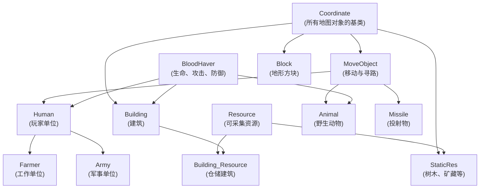
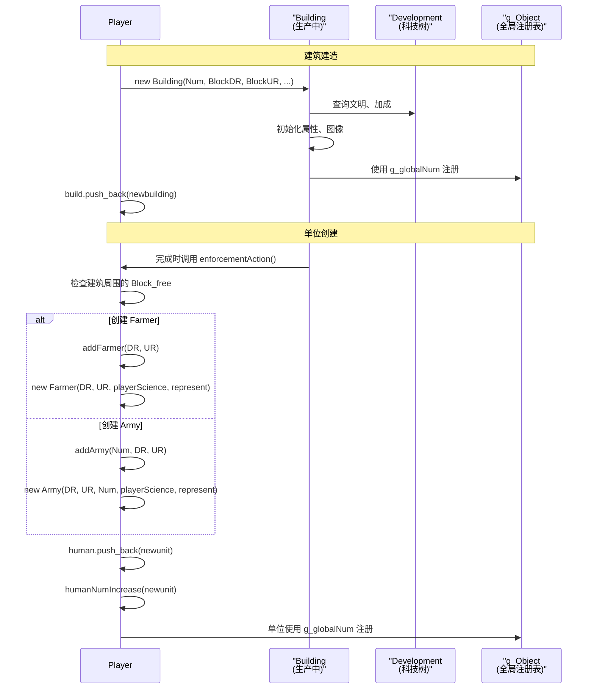
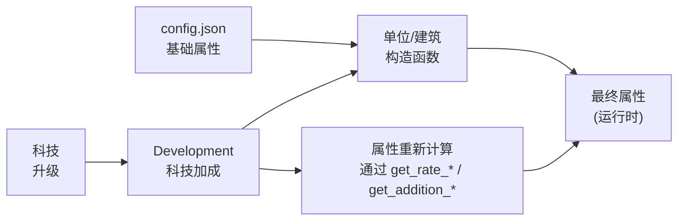

# 单位与建筑

<details>
<summary>相关源文件</summary>

以下文件被用作生成本 wiki 页面时的上下文：

- [Development.h](Development.h)
- [GlobalVariate.h](GlobalVariate.h)
- [Player.cpp](Player.cpp)
- [README.md](README.md)
- [config.json](config.json)

</details>


本页记录了游戏中实现单位与建筑的实体系统。内容涵盖类层次结构、单位类型（农民、军队、船只）、建筑类型、创建/删除生命周期，以及将基础数值与科技加成结合起来的属性计算系统。

有关科技树如何影响单位属性的信息，请参见 [科技树](#3.2)。关于战斗机制与伤害计算的细节，请参见 [战斗系统](#3.4)。关于负责管理单位和建筑集合的 `Player` 类，请参见 [资源与经济系统](#3.1)。

---

## 实体类层次结构

所有能够放置在地图上的游戏对象都继承自一套通用的类层次结构。该系统使用多重继承来组合不同能力。

**类继承图**



**来源：** [Coordinate.h](), [MoveObject.h](), [Bloodhaver.h](), [Human.h](), [Farmer.h](), [Army.h](), [Building.h](), [Building_Resource.h](), [StaticRes.h](), [Animal.h](), [Missile.h](), [Block.h](), [Resource.h]()

---

## 基础类

### Coordinate

地图上所有对象的根基类。定义了渲染、视野、动作和生命周期的通用接口。

**关键方法：**
- `virtual int getSort()` - 返回对象类别（SORT_FARMER、SORT_ARMY、SORT_BUILDING 等）
- `virtual void nextframe()` - 每一帧调用，用于更新对象状态
- `virtual int getVision()` - 返回以方块为单位的视野范围
- `virtual bool get_isActionEnd()` - 当前动作是否完成
- `virtual string getSound_Click()` - 被点击时播放的声音

**来源：** [Coordinate.h](), [Coordinate.cpp]()

### MoveObject

增加移动能力，包括速度、寻路和碰撞检测。

**关键字段：**
- `double speed` - 移动速度（像素/帧）
- `double angle` - 当前朝向
- `stack<Point> path` - 用于导航的路径栈
- `int nextBlock_DR, nextBlock_UR` - 下一个目标方块
- `double DR0, UR0` - 最终目的地坐标

**关键方法：**
- `void setNextBlock(int dr, int ur)` - 设置下一个路径点
- `void MoveToNextBlock()` - 朝下一个方块移动
- `bool isCollision(Coordinate* other)` - 碰撞检测

**来源：** [MoveObject.h](), [MoveObject.cpp]()

### BloodHaver

管理可战斗或可被摧毁实体的生命、攻击和防御属性。

**关键字段：**
- `int maxBlood` - 最大生命值
- `int blood` - 当前生命值
- `int atk` - 基础攻击值
- `int defClose` - 近战防御
- `int defShoot` - 远程防御
- `int attackType` - ATTACK_CLOSE 或 ATTACK_SHOOT

**关键方法：**
- `int getATK()` - 获取包含加成后的攻击值
- `int getDEF(int attackType)` - 获取对指定攻击类型的防御值
- `void init_Blood(int maxBlood)` - 初始化生命值
- `bool isAlive()` - 实体是否仍有 HP > 0

**来源：** [Bloodhaver.h](), [Bloodhaver.cpp]()

---

## 单位类型

### Farmer

工作单位，用于采集资源、建造建筑和运输物资。

**类定义：** [Farmer.h:1-50](), [Farmer.cpp:1-200]()

**状态：**
| 状态 | 枚举值 | 描述 |
|-------|------------|-------------|
| 空闲 | HUMAN_STATE_IDLE | 原地站立 |
| 行走中 | HUMAN_STATE_WALKING | 移动到目标位置 |
| 工作中 | HUMAN_STATE_WORKING | 采集或建造 |
| 攻击中 | HUMAN_STATE_ATTACKING | 战斗（农民也能战斗） |

**资源携带：**
- `int resourceSort` - 携带资源的类型（HUMAN_WOOD、HUMAN_GRANARYFOOD 等）
- `int resource` - 当前携带数量
- `config.json` 中定义的基础携带上限：
  - `FARMER_CARRYLIMIT_WOOD`: 10
  - `FARMER_CARRYLIMIT_FOOD`: 10
  - `FARMER_CARRYLIMIT_STONE`: 10
  - `FARMER_CARRYLIMIT_GOLD`: 10

**采集速度：** 基础值来自 `config.json`（例如 `FARMER_GATHERSPEED_WOOD`: 0.02）

**来源：** [Farmer.h](), [Farmer.cpp](), [config.json:58-73]()

### 军事单位

具备战斗能力的军事单位。`Army` 类 [Army.h](), [Army.cpp]() 实现了所有军事单位类型。

**军队单位类型表**

| 单位类型 | 枚举常量 | 攻击类型 | 速度 | 基础 ATK | 基础 HP | 视野 | 射程 |
|-----------|---------------|-------------|-------|----------|---------|--------|-------|
| 棍棒兵 Lv1 | AT_CLUBMAN | 近战 | 2.44 | 3 | 40 | 4 | 0 |
| 棍棒兵 Lv2 | AT_CLUBMAN2 | 近战 | 2.44 | 5 | 50 | 4 | 0 |
| 投石兵 | AT_SLINGER | 远程 | 2.44 | 2 | 25 | 5 | 4 |
| 弓箭手 | AT_BOWMAN | 远程 | 2.44 | 3 | 35 | 7 | 5 |
| 斥候 | AT_SCOUT | 近战 | 4.07 | 5 | 80 | 8 | 0 |
| 骑兵 | AT_CAVALRY | 近战 | 4.07 | 8 | 150 | 4 | 0 |
| 短剑士 | AT_SWORDSMAN | 近战 | 2.44 | 9-13 | 150-160 | 4 | 0 |
| 战车 | AT_CHARIOT | 近战 | 3.5 | 10 | 120 | 5 | 0 |
| 战船 | AT_SHIP | 远程 | 4.07 | 20 | 300 | 4 | 10 |
| 投石车 | AT_STONE_THROWER | 远程 | 1.12 | 20 | 300 | 10 | 10 |
| 重装步兵 | AT_HOPLITE | 近战 | 2.44 | 8 | 100 | 4 | 0 |
| 战车弓手 | AT_CHARIOT_ARCHER | 远程 | 3.0 | 6 | 100 | 7 | 6 |
| 阔剑士 | AT_BROADSWORDSMAN | 近战 | 2.44 | 9 | 70 | 4 | 0 |
| 复合弓手 | AT_COMPOSITE_BOWMAN | 远程 | 2.44 | 5 | 45 | 9 | 7 |

**攻击类型：**
- `ATTACK_CLOSE` (0): 近战
- `ATTACK_SHOOT` (1): 远程投射攻击

**来源：** [config.json:266-470](), [Army.h](), [Army.cpp](), [config.h]() (`AT_ARMY` enum)

### 船只单位（水上农民）

船只被实现为特殊的 Farmer 类型，但有不同的移动限制。

**船只类型：**
| 船只类型 | 枚举 | 用途 | 速度 |
|-----------|------|---------|-------|
| 渔船 | FARMERTYPE_SAILING | 捕鱼 | 农民基础速度 |
| 商船 | FARMERTYPE_SHIP | 运输/战斗 | 农民基础速度 |
| 运木船 | FARMERTYPE_WOOD_BOAT | 资源运输 | 4.07 (`WOOD_BOAT_SPEED`) |

船只通过 `Player::addShip(int Num, double DR, double UR)` [Player.cpp:121-132]() 创建，并且只能在海洋地块上运行。

**来源：** [Player.cpp:121-132](), [Farmer.h](), [config.json:30]()

---

## 建筑类型

建筑是静态结构，用于训练单位、研究科技和储存资源。

**建筑类型枚举：** [config.h]() 定义了建筑常量（BUILDING_HOME、BUILDING_CENTER 等）。

**建筑类型表**

| 建筑 | 枚举常量 | HP | 视野 | 木材消耗 | 食物消耗 | 石头消耗 | 黄金消耗 | 建造时间 |
|----------|---------------|-----|--------|-----------|-----------|------------|-----------|------------|
| 城镇中心 | BUILDING_CENTER | 600 | 4 | 200 | 0 | 0 | 0 | 60s |
| 房屋 | BUILDING_HOME | 75 | 4 | 30 | 0 | 0 | 0 | 20s |
| 储藏坑 | BUILDING_STOCK | 350 | 4 | 120 | 0 | 0 | 0 | 30s |
| 谷仓 | BUILDING_GRANARY | 350 | 4 | 120 | 0 | 0 | 0 | 30s |
| 兵营 | BUILDING_ARMYCAMP | 350 | 4 | 125 | 0 | 0 | 0 | 30s |
| 靶场 | BUILDING_RANGE | 350 | 4 | 150 | 0 | 0 | 0 | 40s |
| 马厩 | BUILDING_STABLE | 350 | 4 | 150 | 0 | 0 | 0 | 40s |
| 市场 | BUILDING_MARKET | 350 | 4 | 150 | 0 | 0 | 0 | 40s |
| 码头 | BUILDING_DOCK | 350 | 4 | 100 | 0 | 0 | 0 | 40s |
| 攻城工坊 | BUILDING_SIEGE | 350 | 4 | 180 | 0 | 0 | 0 | 40s |
| 神庙 | BUILDING_COLLAGE | 350 | 4 | 180 | 0 | 0 | 0 | 40s |
| 农田 | BUILDING_FARM | 50 | 4 | 75 | 0 | 0 | 0 | 30s |
| 箭塔 | BUILDING_ARROWTOWER | 125 | 10 | 0 | 0 | 150 | 0 | 80s |
| 城墙 | BUILDING_WALL | 200 | 0 | 0 | 0 | 5 | 0 | 10s |

**特殊建筑：Building_Resource**

仓储建筑同时继承自 `Building` 和 `Resource` [Building_Resource.h]()。它们可以储存资源，并拥有表示剩余容量的 `Cnt` 字段。

示例：谷仓、储藏坑、农田（农田是可再生的食物来源）

**来源：** [config.json:93-257](), [Building.h](), [Building.cpp](), [Building_Resource.h](), [Building_Resource.cpp]()

---

## 创建与删除生命周期

**单位与建筑创建流程**



**Player 类中的创建方法**

**建筑：**
- `Building* addBuilding(int Num, int BlockDR, int BlockUR, double percent)` [Player.cpp:32-49]()
  - 创建新的 `Building` 或 `Building_Resource` 实例
  - 如果 `percent >= 100`，则标记为完成并更新房屋数量

**单位：**
- `int addFarmer(double DR, double UR)` [Player.cpp:108-119]()
- `Army* addArmy(int Num, double DR, double UR)` [Player.cpp:62-73]()
- `Army* addArmyAROUND(...)` [Player.cpp:75-85]() - 用于巡逻区域
- `Army* addArmyATTACK(...)` [Player.cpp:97-107]() - 用于攻击命令
- `Army* addArmyDEFENSE(...)` [Player.cpp:86-96]() - 用于防御姿态
- `int addShip(int Num, double DR, double UR)` [Player.cpp:121-132]()

**导弹：**
- `Missile* addMissile(Coordinate* attacker, Coordinate* attackee, int beginHeight)` [Player.cpp:134-153]()

**删除方法**

**基于迭代器的删除：**
- `list<Human*>::iterator deleteHuman(list<Human*>::iterator iterDele)` [Player.cpp:172-184]()
  - 在删除前调用 `g_mainWidget->cleanupUnitReferences()`
  - 返回擦除后下一个元素的迭代器
  
- `list<Building*>::iterator deleteBuilding(list<Building*>::iterator iterDele)` [Player.cpp:186-201]()
  - 删除 `BUILDING_HOME` 时更新房屋数量
  - 删除 `BUILDING_CENTER` 时更新城镇中心数量
  - 对其他类型更新文明建筑计数

- `list<Missile*>::iterator deleteMissile(list<Missile*>::iterator iterDele)` [Player.cpp:203-207]()

**引用清理：**
- `void removeHuman(Human* target)` [Player.cpp:156-164]() - 从列表移除但不删除
- `void insertHuman(Human* target)` [Player.cpp:166-169]() - 重新插入单位
- `void deleteMissile_Attacker(Coordinate* attacker)` [Player.cpp:210-214]() - 清理导弹引用

**来源：** [Player.cpp:32-214](), [Player.h]()

---

## 属性计算系统

单位与建筑的属性通过将 `config.json` 中的基础值与科技树提供的加成结合起来进行计算。

**属性计算流程**



**基础属性来源（config.json）**

属性在启动时通过 `GlobalVariate.cpp` 中的 `ReadConfig()` 从 `config.json` 加载：

```
BLOOD_FARMER = 25
ATK_CLUBMAN1 = 3
DEFCLOSE_CLUBMAN1 = 0
DEFSHOOT_CLUBMAN1 = 0
SPEED_BOWMAN = 2.439346884545225
VISION_SCOUT = 8
DIS_SHIP = 10  (attack range)
```

**来源：** [config.json:58-470](), [GlobalVariate.h:30-500](), [GlobalVariate.cpp]()

**科技加成系统**

`Development` 类 [Development.h:1-139]() 提供了用于计算加成的方法：

**移动速度：**
- `double get_rate_Move(int sort, int type)` - 返回速度倍率
- 应用于 `config.json` 中的基础速度

**生命值：**
- `double get_rate_Blood(int sort, int type)` - HP 倍率
- `int get_addition_Blood(int sort, int type)` - 固定 HP 加成
- 公式：`finalHP = baseHP * rate_Blood + addition_Blood`

**攻击：**
- `double get_rate_Attack(int sort, int type, int armyClass, int attackType, ...)` - 攻击倍率
- `int get_addition_Attack(int sort, int type, int armyClass, int attackType)` - 固定攻击加成
- `int get_addition_DisAttack(...)` - 远程单位的射程加成

**防御：**
- `double get_rate_Defence(int sort, int type, int armyClass, int attackType_got)` - 防御倍率
- `int get_addition_Defence(int sort, int type, int armyClass, int attackType_got)` - 固定防御加成
- 近战（ATTACK_CLOSE）和远程（ATTACK_SHOOT）分别计算

**资源采集：**
- `int get_addition_ResourceSort(int resourceSort)` - 携带容量加成
- `double get_rate_ResorceGather(int resourceSort)` - 采集速度倍率
- `int get_addition_MaxCnt(int sort, int type)` - 最大资源量加成（例如农田食物）

**属性计算示例（弓箭手）：**

```cpp
// 来自 config.json 的基础属性
int baseHP = BLOOD_BOWMAN;        // 35
int baseATK = ATK_BOWMAN;         // 3
double baseSpeed = SPEED_BOWMAN;  // 2.44

// 应用 Development 中的科技升级后
finalHP = baseHP * dev->get_rate_Blood(SORT_ARMY, AT_BOWMAN) 
          + dev->get_addition_Blood(SORT_ARMY, AT_BOWMAN);

finalATK = baseATK * dev->get_rate_Attack(SORT_ARMY, AT_BOWMAN, CLASS_ARCHER, ATTACK_SHOOT)
           + dev->get_addition_Attack(SORT_ARMY, AT_BOWMAN, CLASS_ARCHER, ATTACK_SHOOT);

finalSpeed = baseSpeed * dev->get_rate_Move(SORT_ARMY, AT_BOWMAN);
```

**升级效果：**

科技升级会修改这些加成。例如：
- `BUILDING_STOCK_UPGRADE_CLOSER_ATTACK` 为近战单位增加 +2 攻击 [config.json:113]()
- `BUILDING_STOCK_UPGRADE_DEFENSE_INFANTRY` 为步兵增加 +2 防御 [config.json:120]()
- `BUILDING_MARKET_WOOD_UPGRADE` 为木材增加 +2 携带容量和 +0.2 采集倍率 [config.json:199-200]()

**来源：** [Development.h:19-38](), [Development.cpp](), [config.json:48-470]()

---

## 关键数据结构

**tagBuilding** - 用于 AI 的建筑状态快照

```cpp
struct tagBuilding : tagObj {
    int Type;           // 建筑类型枚举
    int Blood;          // 当前 HP
    int MaxBlood;       // 最大 HP
    int Percent;        // 建造完成百分比
    int Project;        // 当前生产/研究项目
    int ProjectPercent; // 生产进度百分比
    int Cnt;            // 资源数量（仅农田）
};
```

**tagHuman** - 人类单位基础状态

```cpp
struct tagHuman : tagObj {
    double DR, UR;      // 细节坐标
    double DR0, UR0;    // 目标坐标
    int NowState;       // HUMAN_STATE_IDLE/WALKING/WORKING/ATTACKING
    int WorkObjectSN;   // 目标对象序列号
    int Blood;          // 当前 HP
    int attack;         // 攻击值
    int rangedDefense;  // 远程防御
    int meleeDefense;   // 近战防御
};
```

**tagFarmer** - Farmer 特有状态

```cpp
struct tagFarmer : public tagHuman {
    int ResourceSort;   // 携带资源的类型
    int Resource;       // 携带数量
    int FarmerSort;     // Farmer 类型（农民/船只类型）
};
```

**tagArmy** - Army 特有状态

```cpp
struct tagArmy : public tagHuman {
    int Sort;           // Army 类型（AT_CLUBMAN、AT_BOWMAN 等）
    int status;         // AI 状态标记
    int starttime;      // 巡逻/攻击开始时间
    int finishtime;     // 巡逻/攻击结束时间
    double startpointDR, startpointUR;  // 巡逻起点
    double destinaDR, destinaUR;        // 巡逻目标点
    bool ifAttack;      // 是否处于攻击模式
    int timelock;       // 动作的时间锁
};
```

**来源：** [GlobalVariate.h:672-759]()

---

## 配置参数参考

**单位的关键 Config.json 参数：**

| 参数模式 | 示例 | 描述 |
|-------------------|---------|-------------|
| `BLOOD_<UNIT>` | `BLOOD_FARMER`, `BLOOD_CLUBMAN1` | 基础生命值 |
| `SPEED_<UNIT>` | `SPEED_SCOUT`, `SPEED_BOWMAN` | 移动速度 |
| `VISION_<UNIT>` | `VISION_CAVALRY`, `VISION_ARROWTOWER` | 以方块为单位的视野范围 |
| `ATK_<UNIT>` | `ATK_BOWMAN`, `ATK_SHIP` | 基础攻击值 |
| `DIS_<UNIT>` | `DIS_BOWMAN`, `DIS_SHIP` | 攻击范围（0 = 近战） |
| `INTERVAL_<UNIT>` | `INTERVAL_CLUBMAN1` | 攻击间隔（秒） |
| `DEFCLOSE_<UNIT>` | `DEFCLOSE_SCOUT` | 近战防御 |
| `DEFSHOOT_<UNIT>` | `DEFSHOOT_SLINGER` | 远程防御 |
| `NOWRES_TIMER_<UNIT>` | `NOWRES_TIMER_BOWMAN` | 动画帧计数 |

**建筑的关键 Config.json 参数：**

| 参数模式 | 示例 | 描述 |
|-------------------|---------|-------------|
| `BLOOD_BUILD_<BUILDING>` | `BLOOD_BUILD_CENTER` | 建筑生命值 |
| `BUILD_<BUILDING>_WOOD` | `BUILD_HOUSE_WOOD` | 建造所需木材 |
| `TIME_BUILD_<BUILDING>` | `TIME_BUILD_HOME` | 建造时间（秒） |
| `VISION_<BUILDING>` | `VISION_GRANARY` | 视野范围 |
| `BUILDING_<X>_CREATE_<Y>_FOOD` | `BUILDING_CENTER_CREATEFARMER_FOOD` | 训练单位所需食物 |
| `TIME_BUILDING_<X>_CREATE_<Y>` | `TIME_BUILDING_ARMYCAMP_CREATE_CLUBMAN` | 训练时间 |

**来源：** [config.json:40-470](), [GlobalVariate.h:30-500]()
