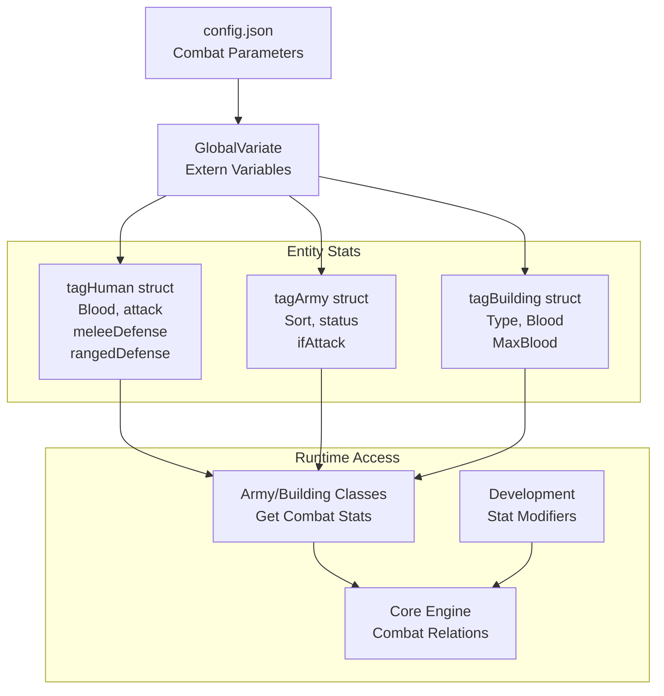
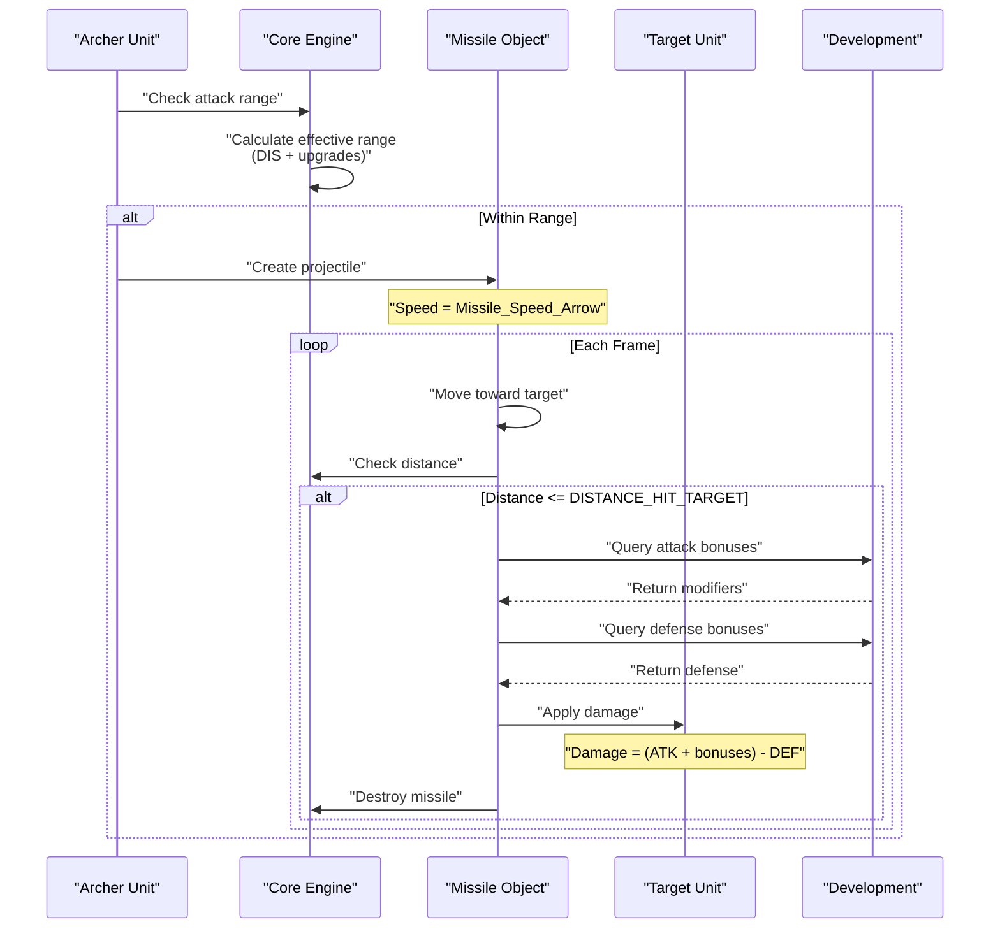
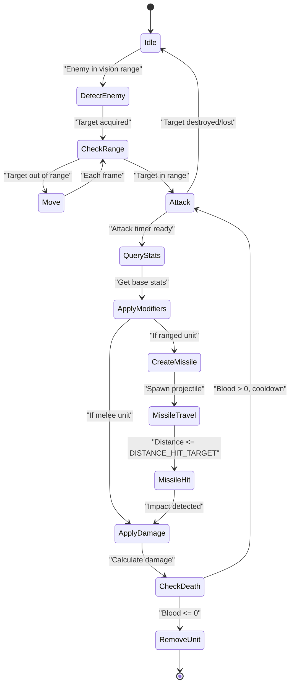

# 战斗系统

<details>
<summary>相关源文件</summary>

以下文件被用作生成本 Wiki 页面的上下文：

- [Development.cpp](Development.cpp)
- [GlobalVariate.h](GlobalVariate.h)
- [config.json](config.json)

</details>


## 目的与范围

战斗系统定义了军事单位和防御建筑如何参与战斗，包括伤害计算、防御修正应用，以及通过近战和远程机制解析攻击。该系统涵盖单位战斗属性、攻击/防御类型、投射物、射程计算，以及基于科技的属性修改。

有关单位创建和属性的信息，参见 [Units and Buildings](#3.3)。有关会修改战斗属性的科技升级，参见 [Technology Tree](#3.2)。有关处理战斗动作的底层关系执行机制，参见 [Game Core Engine](#2.2)。

---

## 战斗属性

### 基础单位属性

所有具备战斗能力的实体都继承自 `BloodHaver` 类，并拥有在 [config.json:1-471]() 中定义的基础战斗属性：

| 属性类别 | 参数 | 说明 |
|--------------|------------|-------------|
| 生命值 | `BLOOD_*` | 单位和建筑的最大生命值 |
| 攻击力 | `ATK_*` | 每次攻击造成的基础伤害 |
| 攻击范围 | `DIS_*` | 最大交战距离（近战为 0） |
| 攻击速度 | `INTERVAL_*` | 连续攻击之间的秒数 |
| 防御（近战） | `DEFCLOSE_*` | 对近距离攻击的伤害减免 |
| 防御（远程） | `DEFSHOOT_*` | 对投射物攻击的伤害减免 |
| 视野范围 | `VISION_*` | 敌方单位的探测半径 |
| 移动速度 | `SPEED_*` | 每帧的单位移动速率 |

**单位配置示例：**

```
BLOOD_BOWMAN: 35           # Hit points
ATK_BOWMAN: 3              # Base attack damage  
DIS_BOWMAN: 5              # Attack range (blocks)
INTERVAL_BOWMAN: 1.4       # Attack cooldown (seconds)
DEFCLOSE_BOWMAN: 0         # Melee defense
DEFSHOOT_BOWMAN: 0         # Ranged defense
VISION_BOWMAN: 7           # Vision radius
SPEED_BOWMAN: 2.439        # Movement speed
```

这些属性会在启动时通过 `ReadConfig()` 加载到全局变量中 [GlobalVariate.h:1-1326]()，并在整个游戏引擎中被访问。

**图示：战斗属性流**



来源：[config.json:1-471](), [GlobalVariate.h:705-759]()

---

## 攻击类型与机制

### 攻击类型分类

战斗系统区分多种攻击类型，每种类型具有不同的机制：

| 攻击类型 | 常量 | 特征 | 受影响于 |
|------------|----------|-----------------|-------------|
| 近战/贴身 | `ATTACKTYPE_CLOSE` | 直接物理接触 | 近战防御（`DEFCLOSE`） |
| 远程/射击 | `ATTACKTYPE_SHOOT` | 投射物攻击 | 远程防御（`DEFSHOOT`） |
| 动物 | `ATTACKTYPE_ANIMAL` | 野生动物攻击 | 步兵护甲升级 |

**攻击距离机制：**

`DIS_* = 0` 的单位属于近战战斗者，必须接近到 `DISTANCE_ATTACK_CLOSE`（17.89 单位）以内才能交战 [config.json:262]()。远程单位则在目标进入其 `DIS_*` 射程，并加上来自 [Development.cpp:97-129]() 的任意升级加成后发射投射物。

**射程计算示例：**

```
Bowman Base Range: DIS_BOWMAN = 5 blocks
+ Wood Upgrade: +1 block (BUILDING_MARKET_WOOD_UPGRADE_ADDITION_DISSHOOT)
+ Craft Tech: +1 block (BUILDING_MARKET_CRAFT_UPGRADE_ADDITION_DISSHOOT)
= Effective Range: 7 blocks
```

### 攻击倍率

某些单位与目标的组合会获得伤害倍率，这些倍率在 [Development.cpp:41-52]() 中实现：

```cpp
double Development::get_rate_Attack(int sort, int type, int armyClass, 
                                     int attackType, int interSort, int interNum)
{
    double rate = 1;
    
    if (interSort != -1 && interNum != -1)
    {
        // Swordsmen, cavalry, and improved units deal 2x damage to buildings
        if (interSort == SORT_BUILDING && sort == SORT_ARMY && 
            (type == AT_SWORDSMAN || type == AT_CAVALRY || type == AT_IMPROVED))
            rate = 2;
    }
    
    return rate;
}
```

**来自升级的攻击加成：**

固定攻击加成在 [Development.cpp:55-92]() 中计算：

- **近战升级（Stock）：** 每级 +2 攻击（共 2 级）
- **投石手石材升级（Market）：** 投石手 +1 攻击
- **箭塔升级（Granary）：** 防御塔 +4 攻击

来源：[config.json:262-470](), [Development.cpp:41-92](), [GlobalVariate.h:304-499]()

---

## 防御机制

### 防御计算

伤害减免依据受到的攻击类型以及防守方的护甲值生效。系统计算公式为：

```
Actual Damage = (Base Attack + Flat Bonuses) × Attack Multipliers - Defense Value
```

防御值由基础属性加上科技加成共同构成。

### 护甲类型与升级

`Development` 类提供三类防御加成 [Development.cpp:141-204]()：

**步兵护甲（Stock 建筑）：**
- 第 1 级：+2 近战/动物防御
- 第 2 级：额外 +2（总计 +4）
- 青铜盾：+1 远程防御

**弓兵护甲（Stock 建筑）：**
- 第 1 级：+2 近战/动物防御  
- 第 2 级：额外 +2（总计 +4）

**骑兵护甲（Stock 建筑）：**
- 第 1 级：+2 近战/动物防御
- 第 2 级：额外 +2（总计 +4）

**防御查询函数：**

```cpp
int Development::get_addition_Defence(int sort, int type, int armyClass, 
                                       int attackType_got)
{
    double addition = 0;
    int level = 0;
    
    if (sort == SORT_ARMY)
    {
        if (attackType_got == ATTACKTYPE_ANIMAL || attackType_got == ATTACKTYPE_CLOSE)
        {
            // Infantry armor upgrade
            if (armyClass == ARMY_INFANTRY)
            {
                level = getActLevel(BUILDING_STOCK, BUILDING_STOCK_UPGRADE_DEFENSE_INFANTRY);
                switch (level) {
                case 2:
                    addition += BUILDING_STOCK_UPGRADE_DEFENSE_INFANTRY_2_ADDITION_DEFENSE_INFANTRY;
                case 1:
                    addition += BUILDING_STOCK_UPGRADE_DEFENSE_INFANTRY_ADDITION_DEFENSE_INFANTRY;
                default:
                    break;
                }
            }
            // ... similar for ARMY_ARCHER and ARMY_RIDER
        }
        else if (attackType_got == ATTACKTYPE_SHOOT)
        {
            // Bronze Shield for infantry
            if (armyClass == ARMY_INFANTRY)
            {
                if (getActLevel(BUILDING_STOCK, BUILDING_STOCK_UPGRADE_MISSILE_DEFENSE_INFANTRY) >= 1)
                {
                    addition += BUILDING_STOCK_UPGRADE_MISSILE_DEFENSE_INFANTRY_ADDITION_DEFENSE_INFANTRY;
                }
            }
        }
    }
    return addition;
}
```

来源：[Development.cpp:132-204](), [config.json:48-143](), [GlobalVariate.h:55-79]()

---

## 投射物系统

### 投射物类型与速度

远程单位会发射可见投射物，其不同速度定义于 [config.json:398-402]()：

| 投射物类型 | 速度（单位/帧） | 使用者 |
|--------------|-------------------|---------|
| 长矛 | 8.944 | 防御单位 |
| 箭矢 | 20.125 | 弓箭手、弓兵 |
| 鹅卵石 | 20.125 | 投石手 |
| 巨石 | 8.944 | 投石车 |

**巨石范围效果：**

投石车的巨石具有特殊参数 `Missile_Boulders_Range: 2` [config.json:402]()，表示其范围效果半径。`Boulder_Trail_Effect_Duration: 30` [config.json:470]() 控制视觉拖尾效果的持续时间。

### 投射物机制

当远程单位攻击时：

1. **发射条件：** 目标必须位于攻击范围内（`DIS_*` + 射程升级）
2. **投射物创建：** 在攻击者位置生成一个投射物对象
3. **飞行：** 投射物按配置速度每帧朝目标移动
4. **命中检测：** 当达到 `DISTANCE_HIT_TARGET`（4 单位）时应用伤害 [config.json:263]()
5. **视觉效果：** 拖尾效果会根据投射物类型持续存在

**图示：远程战斗流程**



来源：[config.json:398-470](), [GlobalVariate.h:482-486]()

---

## 科技修正

### 影响战斗的科技

`Development` 类 [Development.cpp:1-694]() 管理会改变战斗效率的科技升级。这些科技在特定建筑中研究，并提供可叠加的加成。

**攻击强化科技：**

| 科技 | 建筑 | 加成 | 影响单位 |
|-----------|----------|-------|----------------|
| 近战（第 1 级） | Stock | +2 ATK | 所有近战单位 |
| 近战（第 2 级） | Stock | 总计 +4 ATK | 所有近战单位 |
| 石材加工 | Market | +1 ATK | 投石手 |
| 箭塔升级 | Granary | +4 ATK | 箭塔 |
| 木材加工 | Market | +1 射程 | 远程单位 |
| 工艺技术 | Market | +1 射程（可叠加） | 远程单位 |

**防御强化科技：**

| 科技 | 建筑 | 加成 | 影响单位 |
|-----------|----------|-------|----------------|
| 步兵护甲（第 1 级） | Stock | +2 DEF | 步兵对抗近战 |
| 步兵护甲（第 2 级） | Stock | 总计 +4 DEF | 步兵对抗近战 |
| 青铜盾 | Stock | +1 DEF | 步兵对抗远程 |
| 弓兵护甲（第 1/2 级） | Stock | +2/+4 DEF | 弓兵对抗近战 |
| 骑兵护甲（第 1/2 级） | Stock | +2/+4 DEF | 骑兵对抗近战 |

### 科技查询系统

战斗系统会在属性计算期间查询 `Development` 对象，以获取当前生效的加成：

**攻击加成查询：**
```cpp
int Development::get_addition_Attack(int sort, int type, int armyClass, int attackType)
{
    int level = 0;
    int addition = 0;
    
    if (attackType == ATTACKTYPE_CLOSE && sort != SORT_FARMER)
    {
        level = getActLevel(BUILDING_STOCK, BUILDING_STOCK_UPGRADE_USETOOL);
        switch (level) {
        case 2:
            addition += BUILDING_STOCK_UPGRADE_CLOSER_ATTACK_2_ADDITION_ATTACK;
        case 1:
            addition += BUILDING_STOCK_UPGRADE_CLOSER_ATTACK_ADDITION_ATTACK;
        default:
            break;
        }
    }
    // ... additional checks for other upgrades
    return addition;
}
```

**射程加成查询：**
```cpp
int Development::get_addition_DisAttack(int sort, int type, int armyClass, int attackType)
{
    int addition = 0;
    int level = 0;
    
    if (attackType == ATTACKTYPE_SHOOT)
    {
        // Wood processing tech (Tool Age)
        if (getActLevel(BUILDING_MARKET, BUILDING_MARKET_WOOD_UPGRADE) >= 1)
        {
            addition += BUILDING_MARKET_WOOD_UPGRADE_ADDITION_DISSHOOT;
        }
        // Craftsmanship tech (Bronze Age, stacks with wood processing)
        if (getActLevel(BUILDING_MARKET, BUILDING_MARKET_WOOD_UPGRADE) >= 2)
        {
            addition += BUILDING_MARKET_CRAFT_UPGRADE_ADDITION_DISSHOOT;
        }
    }
    
    return addition;
}
```

来源：[Development.cpp:13-312](), [config.json:48-235]()

---

## 战斗结算

### 交战距离阈值

系统使用若干曼哈顿距离常量来进行战斗状态切换 [config.json:258-265]()：

- `DISTANCE_ATTACK_CLOSE`：17.89 - 近战最大交战距离
- `DISTANCE_HIT_TARGET`：4 - 投射物命中检测阈值
- `DISTANCE_ELEPHANT_ATTACK`：42.57 - 特殊动物攻击距离
- `ANIMAL_ATTACKRANGE_LION`：10 - 狮子攻击范围
- `ANIMAL_ATTACKRANGE_ELEPHANT`：10 - 大象攻击范围

### 攻击时序系统

每个单位都有一个资源计时器（`NOWRES_TIMER_*`），用于控制动画帧率 [config.json:403-415]()：

```
NOWRES_TIMER_FARMER: 1        # Fast animation
NOWRES_TIMER_CLUBMAN: 1       # Fast melee
NOWRES_TIMER_BOWMAN: 2        # Moderate ranged
NOWRES_TIMER_STONE_THROWER: 7 # Slow siege
```

攻击间隔（`INTERVAL_*`）决定攻击之间的冷却时间：

```
INTERVAL_CLUBMAN1: 1.5 seconds
INTERVAL_BOWMAN: 1.4 seconds
INTERVAL_STONE_THROWER: 4.2 seconds
```

### 战斗状态机

**图示：战斗执行流程**



### 伤害计算公式

最终施加到目标上的伤害结合了所有属性修正：

```
Base Attack = Unit's ATK_* value
Attack Bonuses = Development.get_addition_Attack(...)
Attack Multiplier = Development.get_rate_Attack(...)
Defense Value = Development.get_addition_Defence(...)

Final Damage = ((Base Attack + Attack Bonuses) × Attack Multiplier) - Defense Value
Final Damage = max(Final Damage, 1)  // Minimum 1 damage per hit

Target.Blood -= Final Damage
```

**战斗计算示例：**

```
Improved Bowman attacks Enemy Infantry:

Base Attack: ATK_IMPROVEDBOWMAN1 = 8
+ Wood Processing: +1 range (doesn't affect damage)
+ Close Combat upgrade: 0 (ranged attack)
= Modified Attack: 8

Target Defense:
Base: DEFSHOOT = 0
+ Infantry Armor Tier 2: 0 (doesn't affect ranged)
= Modified Defense: 0

Final Damage: (8 × 1) - 0 = 8 damage
Enemy Infantry Blood: 40 - 8 = 32 remaining
```

来源：[Development.cpp:13-204](), [config.json:258-470](), [GlobalVariate.h:705-759]()

---

## 特殊战斗机制

### 建筑攻击

箭塔（`BUILDING_ARROWTOWER`）具备攻击能力 [config.json:246-253]()：

```
BLOOD_BUILD_ARROWTOWER: 125
DIS_ARROWTOWER: 7             # Attack range
ATK_BUILD_ARROWTOWER: 3       # Base damage
DEFSHOOT_BUILD_ARROWTOWER: 2  # Ranged defense
DIS_BUILD_ARROWTOWER: 5       # Detection range
```

建筑使用与单位相同的战斗结算方式，但它们保持静止，并拥有特殊的升级路径 [Development.cpp:82-90]()。

### 动物战斗

野生动物单位（狮子、大象）具有独特的战斗参数：

```
Lion:
  BLOOD_LION: 20
  VISION_LION: 3
  ANIMAL_ATTACKRANGE_LION: 10

Elephant:  
  BLOOD_ELEPHANT: 45
  SPEED_ELEPHANT: 2.033
  ANIMAL_ATTACKRANGE_ELEPHANT: 10
  DISTANCE_ELEPHANT_ATTACK: 42.574
```

动物使用 `ATTACKTYPE_ANIMAL`，可通过步兵护甲升级进行防御 [Development.cpp:148-164]()。

来源：[config.json:44-56](), [config.json:246-257](), [Development.cpp:82-90](), [Development.cpp:148-164]()
