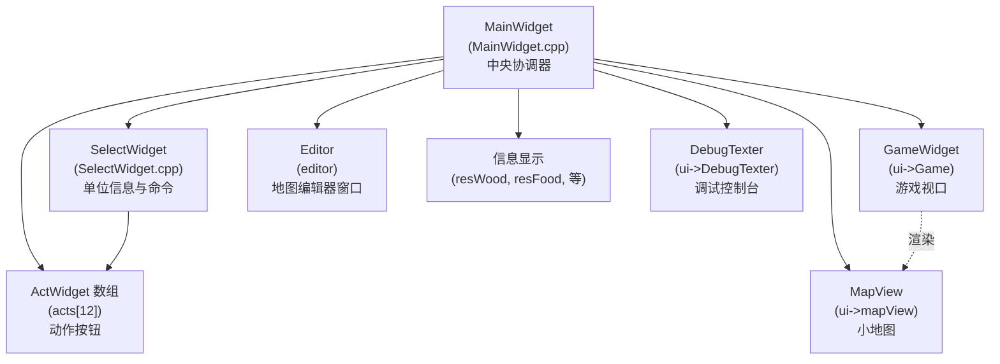
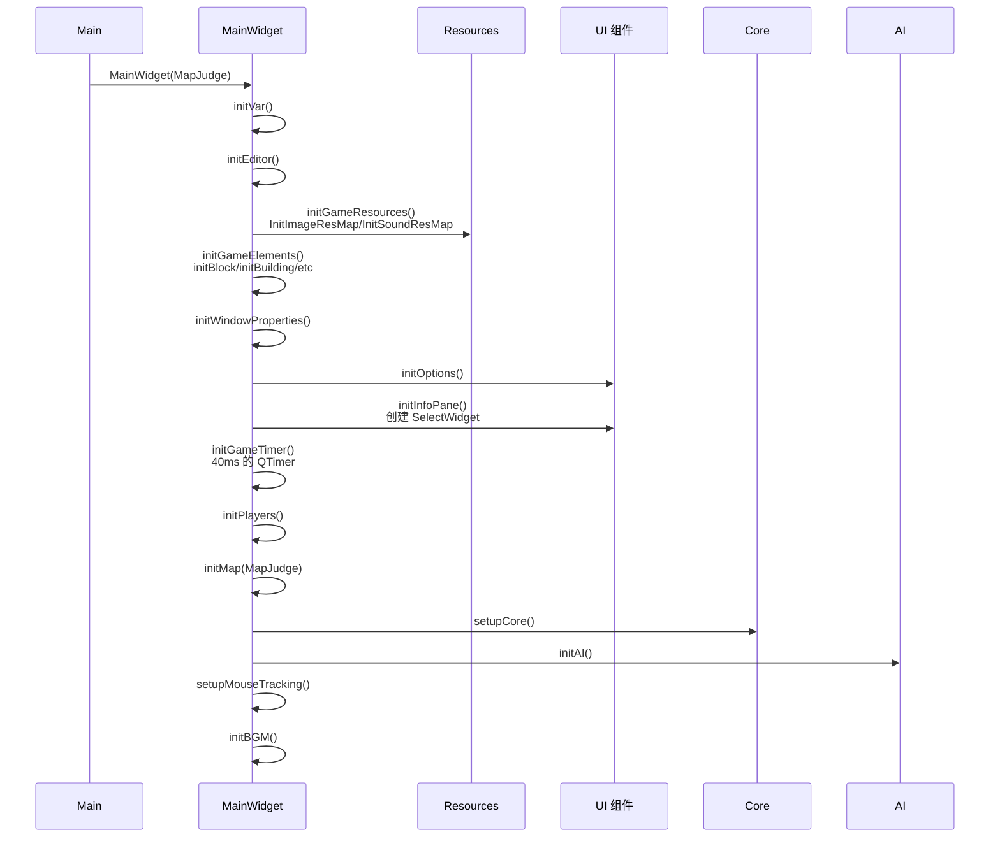
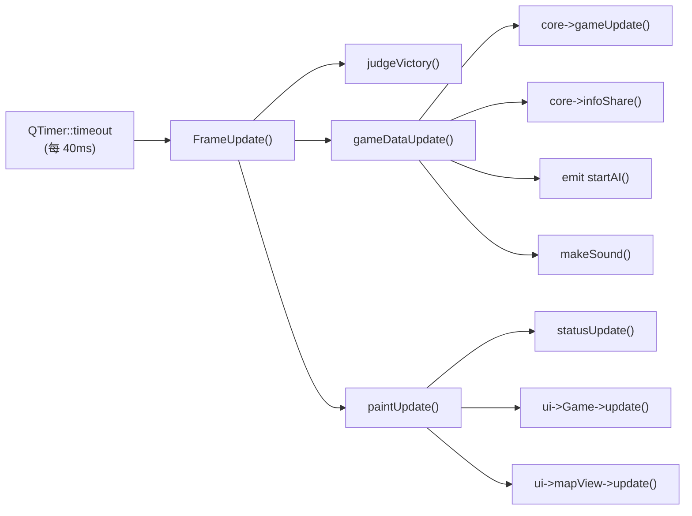
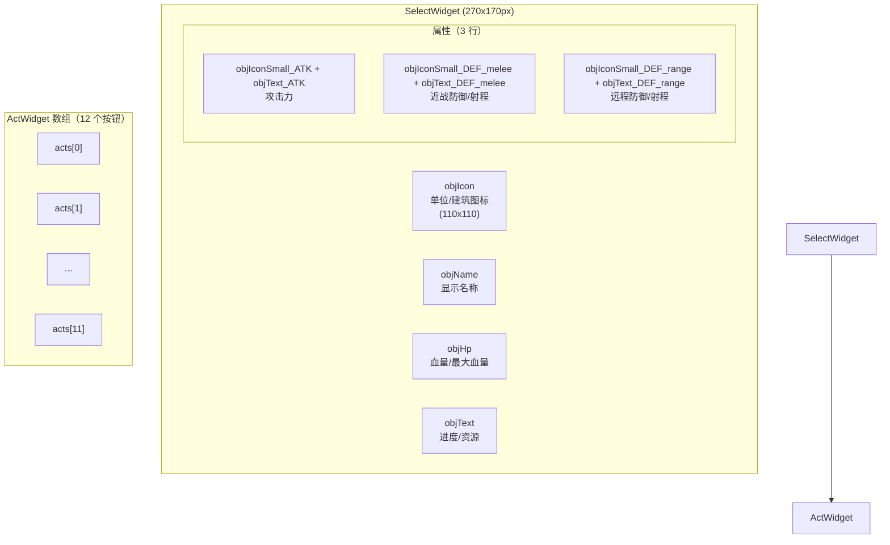
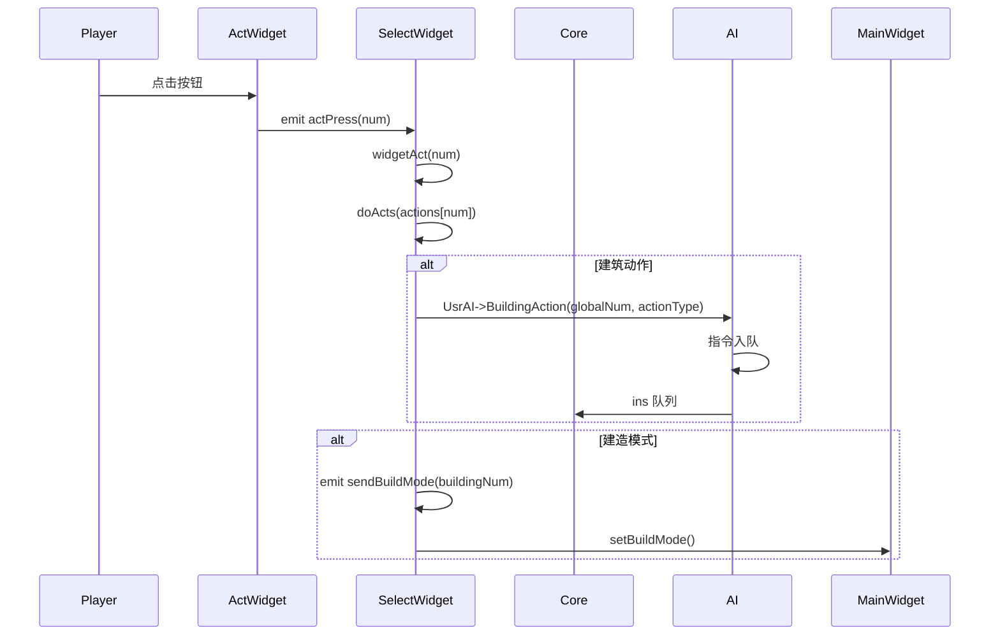
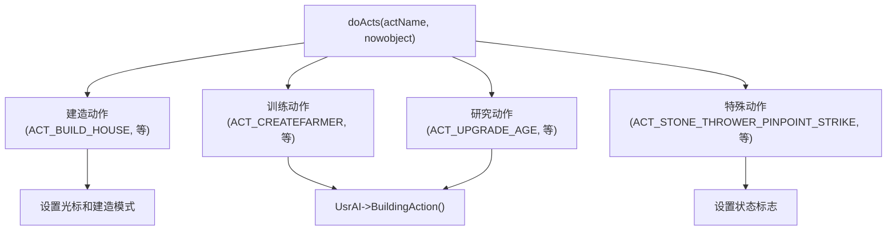
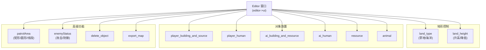
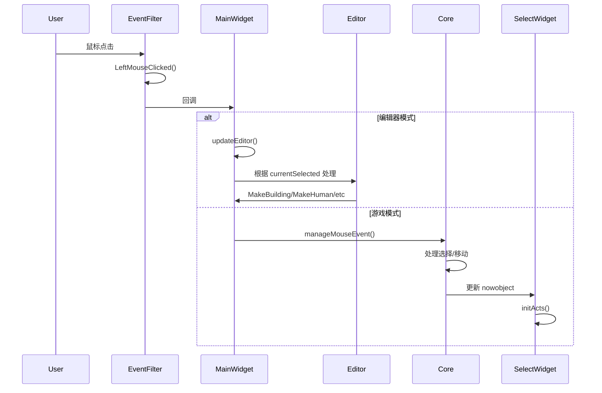

# 用户界面

<details>
<summary>相关源文件</summary>

以下文件被用作生成本 Wiki 页面时的上下文：

- [MainWidget.cpp](MainWidget.cpp)
- [SelectWidget.cpp](SelectWidget.cpp)

</details>


用户界面系统为玩家与游戏交互提供了基于 Qt 的图形层。它负责渲染、输入处理、信息显示、命令执行以及地图编辑功能。该系统采用基于部件（widget）的架构，由 `MainWidget` 作为所有 UI 子系统的中心协调者。

有关 AI 命令处理和指令流，请参见 [AI 系统](#5)。有关渲染细节和资源加载，请参见 [渲染与显示](#4.3)。

---

## UI 组件架构

UI 层由多个相互连接的 Qt 部件组成，它们处理玩家交互的不同方面：

**UI 组件层次结构**



**来源：** MainWidget.cpp:94-276, SelectWidget.cpp:1-19

---

## MainWidget：中央控制器

`MainWidget` 是主要的 Qt 部件（重要度 10.45），负责初始化并协调所有 UI 子系统。它继承自 `QWidget`，并管理游戏循环、事件路由以及部件生命周期。

**初始化顺序**



**来源：** MainWidget.cpp:94-152, MainWidget.cpp:1279-1474

### UI 初始化方法

| 方法 | 目的 | 关键操作 |
|--------|---------|----------------|
| `initGameResources()` | 加载资源 | 调用 `InitImageResMap()`、`InitSoundResMap()` |
| `initGameElements()` | 初始化精灵 | 调用 `initBlock()`、`initBuilding()`、`initAnimal()` 等 |
| `initWindowProperties()` | 设置窗口 | 将大小设为 `GAME_WIDTH x GAME_HEIGHT`，设置标题和图标 |
| `initOptions()` | 创建对话框 | 实例化 `Option`、`AboutDialog`、速度按钮组 |
| `initInfoPane()` | 设置命令面板 | 创建 `SelectWidget`，初始化 `ActWidget` 数组 |
| `initGameTimer()` | 启动游戏循环 | 创建间隔为 `TimePerFrame` 的 `QTimer` |
| `initPlayers()` | 初始化玩家 | 创建 `Player[MAXPLAYER]` 数组 |
| `initMap()` | 加载地图 | 创建 `Map`，调用 `map->init()`，加载资源 |
| `setupCore()` | 初始化引擎 | 创建 `Core` 实例，并连接到 `SelectWidget` |
| `initAI()` | 启动 AI 线程 | 创建 `UsrAI`、`EnemyAI`，连接信号 |

**来源：** MainWidget.cpp:1279-1474

### 游戏循环与更新周期

游戏循环以 `QTimer` 控制的固定时间步运行：



**来源：** MainWidget.cpp:1372-1380, MainWidget.cpp:2380-2409

**帧更新流程：**

[MainWidget.cpp:2380-2409]()

```cpp
void MainWidget::FrameUpdate()
{
    judgeVictory();
    respond_DebugMessage();
    
    if (!pause) gameframe++;
    g_frame = gameframe;
    sel->resetSecond();
    
    // Paint at different frequencies based on speed setting
    if (mapmoveFrequency == 1 || mapmoveFrequency == 2) {
        paintUpdate();
    }
    else if (mapmoveFrequency == 4) {
        if (gameframe % 2 == 0 || pause) paintUpdate();
    }
    else if (mapmoveFrequency == 8) {
        if (gameframe % 3 == 0 || pause) paintUpdate();
    }
    
    gameDataUpdate();
}
```

`mapmoveFrequency` 变量（1、2、4 或 8）控制游戏速度，同时影响计时器间隔和绘制频率。

**来源：** MainWidget.cpp:2380-2433

---

## SelectWidget：命令面板

`SelectWidget`（重要度 5.39）是左下角面板，用于显示所选单位信息并提供命令按钮。它继承自 `QWidget`，主要负责：

- 显示单位/建筑属性（HP、攻击、防御、资源）
- 管理动作按钮数组（`ActWidget[12]`）
- 通过 `doActs()` 处理玩家命令
- 通过 `aiAct()` 将 AI 命令转换为动作

**SelectWidget 布局**



**来源：** SelectWidget.cpp:1-19, MainWidget.cpp:1338-1370

### 对象显示系统

`SelectWidget::refreshActs()` 每帧运行，以根据 `nowobject` 更新显示信息：

**对象类型处理：**

| 对象类型 | 显示元素 | 特殊行为 |
|-------------|------------------|------------------|
| `SORT_BUILDING` | 名称、图标、HP、进度 | 建造完成后显示动作按钮 |
| `SORT_FARMER` | 名称、图标、HP、携带资源 | 显示建造按钮 |
| `SORT_ARMY` | 名称、图标、HP、ATK、DEF（近战/远程） | 对投石兵显示精准打击 |
| `SORT_STATICRES` | 名称、图标、资源数量 | 无动作按钮 |
| `SORT_ANIMAL` | 名称、图标、HP、资源数量 | 无动作按钮 |

**来源：** SelectWidget.cpp:263-905

**示例：建筑显示**

[SelectWidget.cpp:571-701]()

对于建筑，部件会显示：
- 通过 `Building::getDisplayName(buildType)` 获取建筑名称
- 图标来自 `resMap["Button_" + Building::getBuiltname(civ, isEnemy, buildType)]`
- HP 以 `current/max` 显示
- 若处于建造中，则显示进度百分比
- 若已完成，则显示来自 `Building::getActNames(i)` 的动作按钮
- 对房屋（人口）和农田（食物数量）进行特殊显示

**示例：军队显示**

[SelectWidget.cpp:803-852]()

对于军队单位，部件会显示：
- 通过 `Army::getChineseName()` 获取单位名称
- 图标来自 `resMap["Button_" + Army::getArmyName(num, level)]`
- 含加成的攻击力：`base + addition`
- 近战防御：`base + addition`
- 对远程单位：显示射程而不是远程防御
- 对近战单位：显示远程防御值

**来源：** SelectWidget.cpp:571-852

---

## 动作按钮系统

动作系统使用由 `SelectWidget` 管理的 12 个 `ActWidget` 实例数组（`acts[0..11]`）。每个按钮代表一个可能的动作（建造、训练、研究等）。

**动作流程图**



**来源：** SelectWidget.cpp:907-913, MainWidget.cpp:1338-1370

### 动作数组管理

三个并行数组管理按钮状态：

```cpp
int actions[ACT_WINDOW_NUM_FREE];      // Action IDs (ACT_CREATEFARMER, etc)
int actionStatus[ACT_WINDOW_NUM_FREE];  // Status (ENABLED/DISABLED)
ActWidget* acts[ACT_WINDOW_NUM_FREE];   // Widget pointers
```

**来源：** MainWidget.cpp:33, SelectWidget.cpp:154-175

**动作初始化：**

`SelectWidget::initActs()` 根据当前选中对象填充动作数组：

[SelectWidget.cpp:154-261]()

对于建筑：
- 若正在执行动作：`actions[0] = ACT_STOP`
- 否则：若 `get_isBuildActionShowAble()` 返回 true，则从 `Building::getActNames(i)` 复制

对于农民：
- `actions[0] = ACT_BUILD`（运输船则为 `ACT_SHIP_LAY`）

对于军队单位：
- 投石兵：`ACT_STONE_THROWER_PINPOINT_STRIKE` 或 `ACT_STONE_THROWER_CANCEL_PINPOINT_STRIKE`

**动作刷新：**

`SelectWidget::refreshActs()` 每帧运行，用于更新按钮可用/禁用状态：

[SelectWidget.cpp:263-545]()

对于每个动作，检查：
- 建筑动作：`player->get_isBuildActionAble(buildType, actionType)`
- 建造命令：`player->get_isBuildingShowAble()` 和 `get_isBuildingAble()`
- 更新 `ActWidget::setStatus(actionStatus[i])`

**动作绘制：**

`SelectWidget::drawActs()` 根据 `actions` 数组设置按钮图标：

[SelectWidget.cpp:1232-1326]()

通过 `actionResourceMap` 将动作 ID 映射到资源键：
- `ACT_CREATEFARMER` → `"`Button_Villager`"`
- `ACT_UPGRADE_AGE` → `"`ButtonTech_Center1`"`
- 建筑动作使用时代相关图标：`"Button_" + Building::getBuiltname(civ, 0, buildingNum)`

**来源：** SelectWidget.cpp:154-261, SelectWidget.cpp:263-545, SelectWidget.cpp:1232-1326

### 动作执行：doActs()

`SelectWidget::doActs(int actName, Coordinate* nowobject)` 处理动作命令：

**动作类别：**



**来源：** SelectWidget.cpp:933-1192

**建造模式动作：**

[SelectWidget.cpp:963-1007]()

对于建筑放置（如 `ACT_BUILD_HOUSE`）：
1. 根据玩家文明时代获取相应的建筑图标
2. 通过 `QApplication::setOverrideCursor()` 将光标设置为建筑图标
3. 向 `GameWidget` 发出 `sendBuildMode(buildingNum)` 信号
4. 玩家点击地图放置建筑（由 `Core::manageMouseEvent()` 处理）

**建筑动作：**

[SelectWidget.cpp:1012-1120]()

对于训练/研究（如 `ACT_CREATEFARMER`、`ACT_UPGRADE_AGE`）：
1. 调用 `UsrAI->BuildingAction(nowobject->getglobalNum(), actionType)`
2. AI 将该动作封装为 `instruction` 结构并加入队列
3. Core 在 `manageOrder()` 中处理该指令（参见 [指令与命令系统](#5.2)）

**特殊动作：**

- `ACT_STOP`：调用 `core->suspendRelation(nowobject)` 取消当前动作
- `ACT_STONE_THROWER_PINPOINT_STRIKE`：设置等待标志，由用户在地图上点击目标
- `ACT_BUILD_CANCEL`：恢复光标，退出建造模式

**来源：** SelectWidget.cpp:933-1192

### 动作资源映射

`actionResourceMap` 将动作 ID 映射到按钮图标资源键：

[SelectWidget.cpp:21-77]()

```cpp
actionResourceMap[ACT_CREATEFARMER] = "Button_Villager";
actionResourceMap[ACT_UPGRADE_AGE] = "ButtonTech_Center1";
actionResourceMap[ACT_ARMYCAMP_CREATE_CLUBMAN] = "Button_Clubman";
// ... etc
```

该映射在 `SelectWidget::initActionResourceMap()` 中初始化，并由 `drawActs()` 用于加载正确图标。

**来源：** SelectWidget.cpp:21-77, SelectWidget.cpp:1277-1280

---

## 编辑器系统

编辑器集成在 `MainWidget` 中，提供地图创建工具。它由以下部分组成：

- `Editor` 部件（独立窗口），带有用于选择编辑模式的组合框
- `updateEditor()` 方法，根据 `currentSelected` 状态处理鼠标输入
- 区域管理工具（`RectArea`、`CircleArea`、`LineArea`），用于定义巡逻区域
- `.njust` 地图文件的导出/导入功能

**编辑器 UI 组件**



**来源：** MainWidget.cpp:141-152, MainWidget.cpp:155-275

### 编辑器状态机

编辑器使用 `currentSelected` 枚举来跟踪编辑模式：

[MainWidget.cpp:163-274]()

**编辑模式：**

| 模式 | 触发条件 | 鼠标行为 |
|------|---------|----------------|
| `NORMAL_MOUSE` | 默认 | 不进行编辑 |
| `FLAT` | land_type="草地" | 绘制草地 |
| `OCEAN` | land_type="海洋" | 绘制海洋 |
| `HIGHTERLAND` | land_height="提升高度" | 抬高地形 |
| `LOWERLAND` | land_height="降低高度" | 降低地形 |
| `PLAYERDOWNTOWN` | player_building_and_source="玩家市中心" | 放置玩家市中心 |
| `TREE` | resource="树木" | 放置树木 |
| `GAZELLE` | animal="瞪羚" | 放置瞪羚 |
| `DELETEOBJECT` | delete_object clicked | 删除区域内对象 |
| `PATROL_RECT_AREA` | patrolArea="矩形区域" | 定义矩形巡逻区域 |
| `ENEMY_STATUS_ATTACK` | enemyStatus="攻击" | 将敌方 AI 设为攻击模式 |

**来源：** MainWidget.cpp:163-274

### 编辑处理

`MainWidget::updateEditor()` 根据 `currentSelected` 处理鼠标事件：

[MainWidget.cpp:528-740]()

**拖拽操作**（按住鼠标左键）：
- `HIGHTERLAND`/`LOWERLAND`：持续调用 `HigherLand()`/`LowerLand()`
- `OCEAN`/`FLAT`：持续调用 `MakeOcean()`/`MakeGrassland()`
- `DELETEOBJECT`：持续调用 `clearArea()`

**点击操作**（鼠标左键点击）：
- 对象放置模式：调用 `MakeTree()`、`MakeBuilding()`、`MakeHuman()` 等
- `PATROL_RECT_AREA`/`PATROL_CIRCLE_AREA`/`PATROL_LINE_AREA`：由区域绘制系统处理
- `ENEMY_STATUS_ATTACK`/`ENEMY_STATUS_DEFEND`：调用 `handleEnemyStatusSelection()`

**单位选择：**
- Ctrl+点击：多选敌方单位
- 不按 Ctrl 点击：清空选择并选中单个单位
- 所选单位保存在 `selectedUnits` 向量中

**来源：** MainWidget.cpp:528-740

### 地形修改

**地形操作：**

[MainWidget.cpp:881-1107]()

- `HigherLand(blockL, blockU, height)`：抬高 3x3 区域，并校验高度差 ≤1
- `LowerLand(blockL, blockU, height)`：降低 3x3 区域，并校验高度差 ≤1
- `MakeOcean(blockL, blockU)`：将 3x3 区域设为海洋（`MAPHEIGHT_OCEAN`），更新海岸区域
- `MakeGrassland(blockL, blockU)`：将海洋转换为草地（`MAPTYPE_FLAT`）

所有地形操作都会：
1. 修改 `map->m_heightMap` 和 `map->cell[i][j]`
2. 调用 `map->GenerateType()` 重新计算地形类型
3. 调用 `map->CalOffset()` 更新瓦片偏移
4. 调用 `map->InitFaultHandle()` 修复边界情况
5. 对海洋改动，调用 `map->updateShoreArea()` 重绘海滩

**来源：** MainWidget.cpp:881-1107

### 对象创建

**对象创建方法：**

| 方法 | 参数 | 创建内容 |
|--------|-----------|---------|
| `MakeTree(DR, UR)` | 细节坐标 | 调用 `map->addAnimal(0, DR, UR)` |
| `MakeStaticRes(blockL, blockU, type)` | 块坐标、类型 | 调用 `map->addStaticRes(type, blockL, blockU)` |
| `MakeAnimal(DR, UR, type)` | 细节坐标、类型 | 调用 `map->addAnimal(finalType, DR, UR)` |
| `MakeBuilding(blockL, blockU, type)` | 块坐标、类型 | 调用 `player[owner]->addBuilding(num, blockL, blockU, 100)` |
| `MakeHuman(DR, UR, type)` | 细节坐标、类型 | 调用 `player[owner]->addFarmer()` 或 `addArmy()` |

**来源：** MainWidget.cpp:1109-1274

**对象删除：**

`clearArea(blockL, blockU, radius)` 会删除指定曼哈顿距离内的所有对象：

[MainWidget.cpp:742-847]()

1. 遍历 `map->staticres`、`map->animal`、`player[i]->build`、`player[i]->human`
2. 检查 `abs(x - blockL) <= radius && abs(y - blockU) <= radius`
3. 先从 `map->map_Object` 中移除，以避免悬空指针
4. 对单位调用 `cleanupUnitReferences()`，清理选择状态和区域关系
5. 删除对象并从列表中擦除
6. 调用 `map->loadBarrierMap(true)` 和 `map->reset_resMap_AI()` 更新寻路

**来源：** MainWidget.cpp:742-847

### 地图导出/导入

**导出格式：**

`ExportCurrentState(fileName)` 将地图保存为 JSON：

[MainWidget.cpp:279-525]()

导出内容：
- **地形单元**：块坐标、类型、图案、高度、偏移、资源
- **建筑**：坐标、类型、所有者（"WLH"=玩家，"LZ"=敌人）
- **人物**：坐标、类型、类别（Farmer/Army）、所有者、农民类型
- **区域**：每个单位的巡逻区域（Beatarea）和限制区域（AreaLimit）
- **敌方状态**：敌方单位的攻击/防御姿态
- **静态资源**：树木、黄金、石头坐标
- **动物**：瞪羚、狮子、大象坐标

**区域导出：**

[MainWidget.cpp:289-363]()

导出系统支持每个单位关联多个区域：
- `GetAllAreas(obj)` 返回该对象关联的所有区域向量（矩形/圆形/线段）
- 每个区域都包含类型（`RectArea`、`CircleArea`、`LineArea`）和数据
- 区域被分类为 `Beatarea`（巡逻，type=1）或 `AreaLimit`（限制，type=0）
- 导出既支持单区域（向后兼容），也支持多区域（新格式）

**示例 JSON 结构：**
```json
{
  "Human_0": {
    "DR": 1500,
    "UR": 2000,
    "Num": 50,
    "Sort": "Army",
    "Own": "LZ",
    "Beatarea": {
      "Type": "RectArea",
      "DR": 1000,
      "UR": 1500,
      "W": 500,
      "H": 500,
      "AreaName": "Beatarea"
    },
    "statu": "attack"
  }
}
```

**来源：** MainWidget.cpp:279-525

---

## 事件处理流程

UI 使用 Qt 的事件系统，并通过全局 `EventFilter` 捕获和路由输入：

**事件处理管线**



**来源：** MainWidget.cpp:2308-2345, SelectWidget.cpp:907-918

### 鼠标事件路由

全局事件过滤器注册：

[MainWidget.cpp:2308-2345]()

```cpp
void MainWidget::initEditor()
{
    auto& e = ::eventFilter;
    e->RegistReciver([&](){
        if(e->LeftMouseClicked()){
            int x = e->MouseX(), y = e->MouseY();
            mouseEvent->SetMemoeyMapX(x/4);
            mouseEvent->SetMemoryMapY(y/4);
            mouseEvent->SetMouseEventType(LEFT_PRESS);
            mouseEvent->SetDR(ui->Game->TranGlobalPosToDR(x,y));
            mouseEvent->SetUR(ui->Game->TranGlobalPosToUR(x,y));
        }
        else if(e->RightMouseClicked()){
            // Similar handling for right click
        }
        
        if(EditorMode){
            updateEditor();
        }
    });
}
```

该回调会：
1. 通过 `eventFilter->MouseX()/MouseY()` 捕获鼠标坐标
2. 通过 `ui->Game->TranGlobalPosToDR()/TranGlobalPosToUR()` 转换为细节坐标
3. 设置 `mouseEvent` 字段（由 `Core` 访问）
4. 如果处于编辑器模式，则调用 `updateEditor()`

**来源：** MainWidget.cpp:2308-2345

### ActWidget 事件处理

`MainWidget::eventFilter()` 负责处理动作按钮的悬停/点击：

[MainWidget.cpp:2017-2043]()

对于每个 `ActWidget`：
- `HoverEnter`：将提示文本设为动作名称，并高亮按钮
- `MouseButtonPress`：将按钮设为按下状态
- `MouseButtonRelease`：向 `SelectWidget` 发出 `actPress(num)` 信号
- `HoverLeave`：清除提示文本

**来源：** MainWidget.cpp:2017-2043

---

## 资源显示系统

**状态显示更新：**

`MainWidget::statusUpdate()` 每帧刷新 UI 元素：

[MainWidget.cpp:2055-2072]()

更新内容：
- `ui->resWood/resFood/resStone/resGold`：来自 `core->getPlayerNowResource()` 的玩家资源数量
- `ui->score0/score1`：带彩色 HTML 格式的玩家分数
- `ui->mapView->screenL/screenU`：小地图的相机位置
- `ui->statusLbl`：来自 `sel->getShowTime()` 的游戏时间
- `ui->version`：游戏版本字符串

**来源：** MainWidget.cpp:2055-2072

**绘制更新：**

`MainWidget::paintUpdate()` 触发渲染：

[MainWidget.cpp:2093-2103]()

调用：
- `statusUpdate()`：更新文本显示
- `ui->Game->update()`：触发 `GameWidget` 重绘
- `ui->mapView->update()`：触发小地图重绘
- `emit mapmove()`：发出相机移动信号

**来源：** MainWidget.cpp:2093-2103

### 调试控制台

调试控制台（`ui->DebugTexter`）提供彩色消息输出：

[MainWidget.cpp:2458-2494]()

**消息颜色：**
- 蓝色：游戏事件（开始、胜利、失败）
- 红色：错误
- 绿色：信息消息
- 黑色：一般消息

消息以带颜色标签的 HTML 形式插入，并自动滚动到底部。

**导出功能：**
- `exportDebugTextTxt()`：保存到 `output/debug_info_YYYY-MM-DD_HH-MM-SS.txt`
- `exportDebugTextTreeBlock()`：保存 `TreeBlock.txt`，其中包含树木遮挡图
- `clearDebugTextFile()`：删除 `output/` 目录中的所有文件

**来源：** MainWidget.cpp:2458-2582

---

## 总结

UI 系统提供了一个完整的基于 Qt 的界面，包含以下关键组件：

| 组件 | 文件 | 职责 |
|-----------|------|------------------|
| `MainWidget` | MainWidget.cpp | 协调、初始化、游戏循环、编辑器 |
| `SelectWidget` | SelectWidget.cpp | 单位显示、命令面板、动作处理 |
| `ActWidget[12]` | MainWidget.cpp:33 | 带悬停/点击处理的动作按钮 |
| `GameWidget` | (ui->Game) | 视口渲染（参见 [渲染与显示](#4.3)） |
| `Editor` | MainWidget.cpp:141-152 | 地图编辑窗口与控件 |
| `EventFilter` | MainWidget.cpp:2308-2345 | 全局输入捕获与路由 |

系统遵循清晰的职责分离：
- **输入**：EventFilter → MainWidget/Core → SelectWidget
- **显示**：Core 更新 → SelectWidget 刷新 → ActWidget 绘制
- **命令**：用户动作 → doActs() → AI 指令 → Core 执行

有关游戏引擎如何执行命令的详细信息，请参见 [游戏核心引擎](#2.2)。有关 AI 命令生成，请参见 [AI 架构](#5.1)。

**来源：** MainWidget.cpp:1-2582, SelectWidget.cpp:1-1333