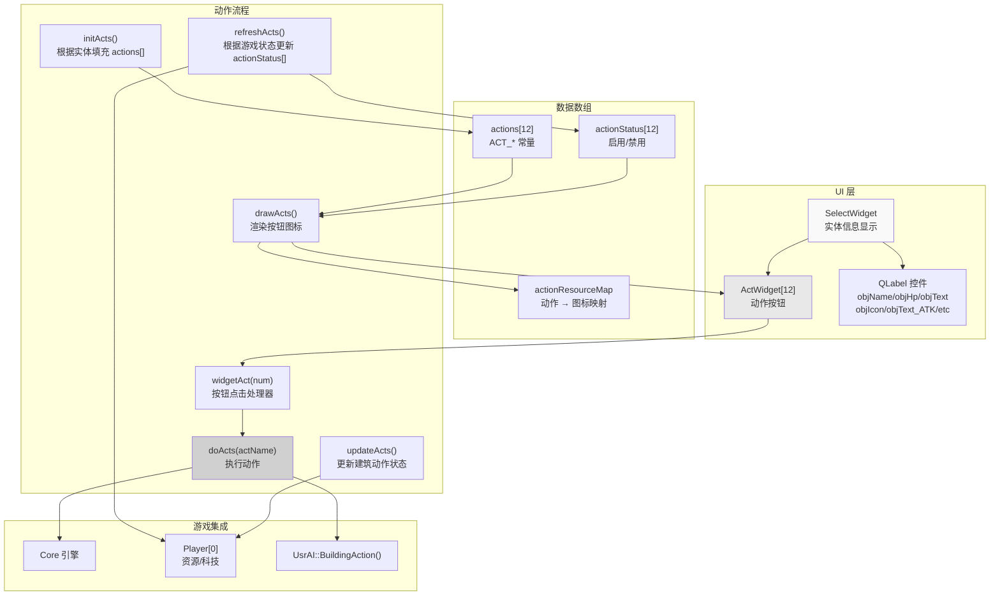
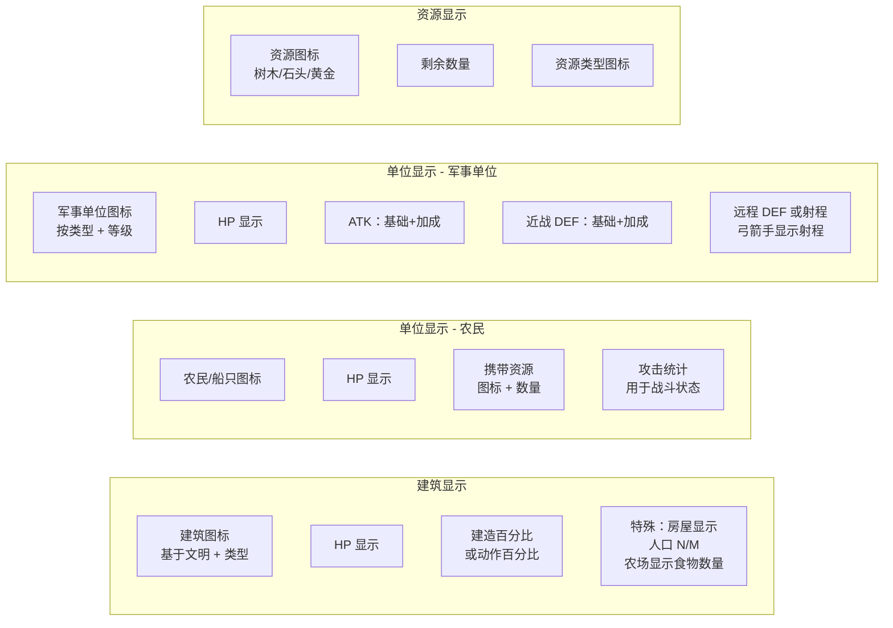
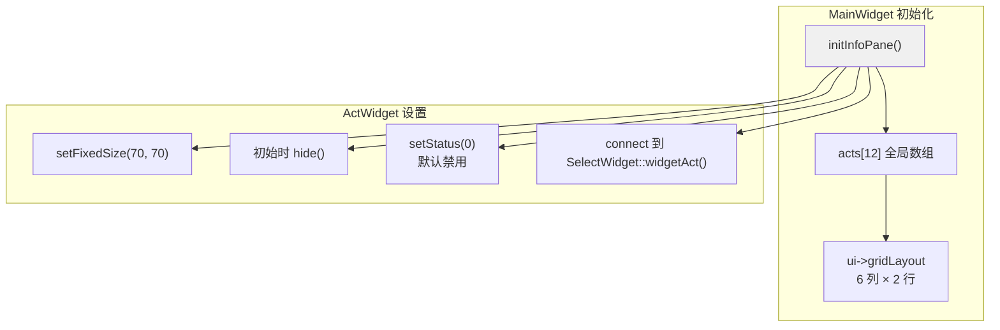
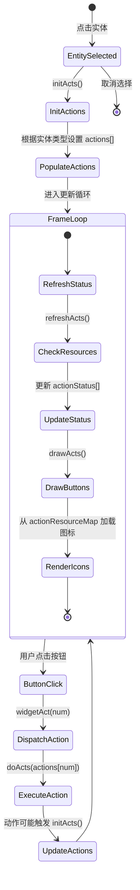
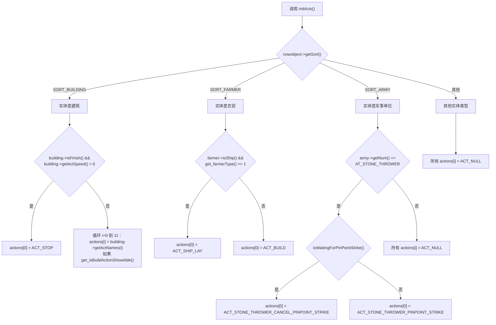
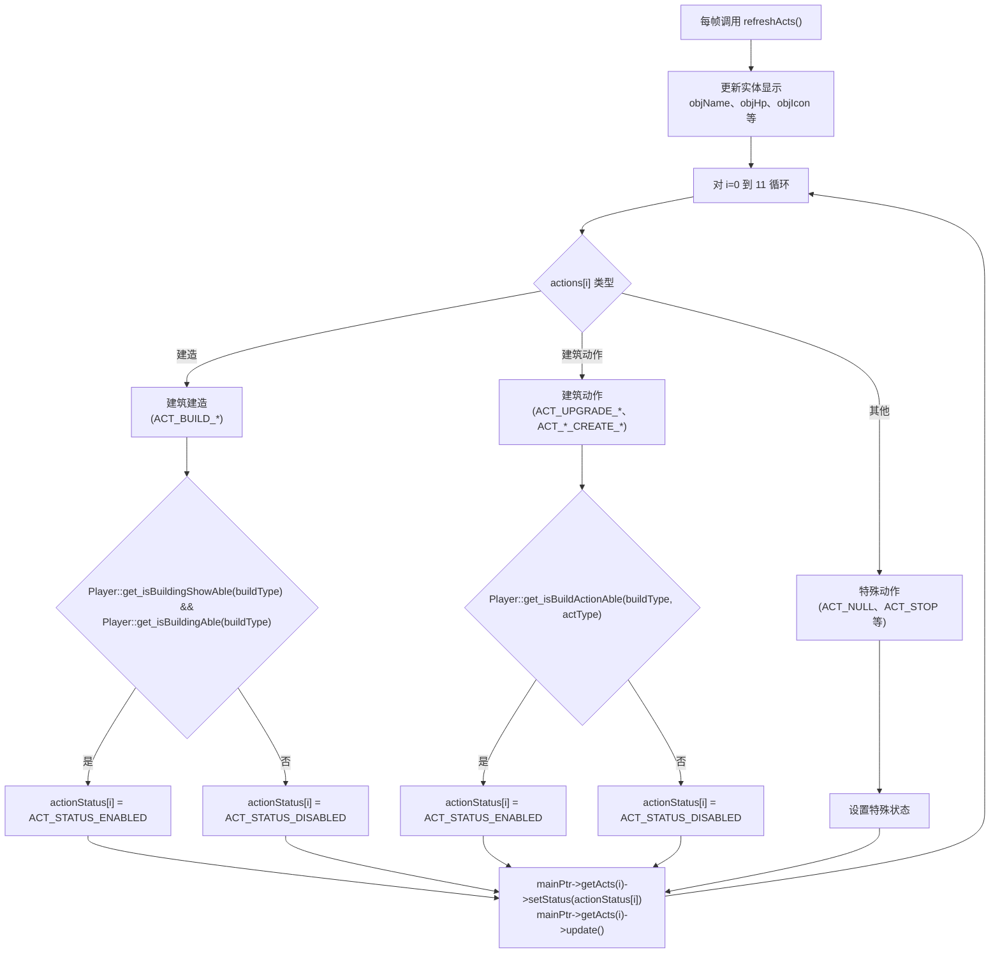
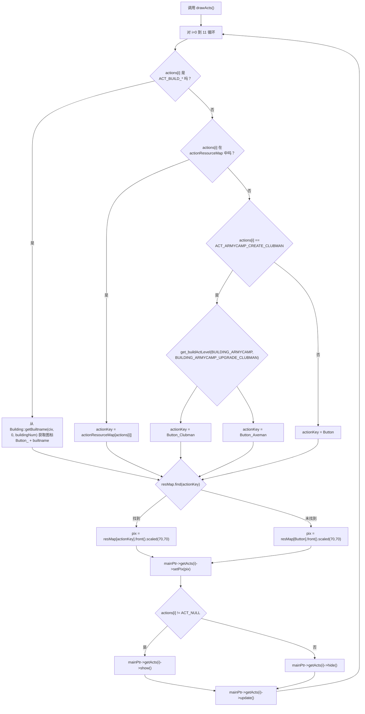
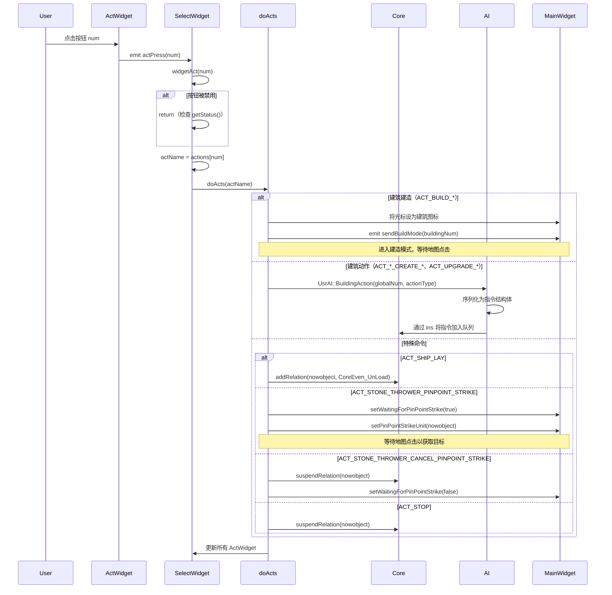
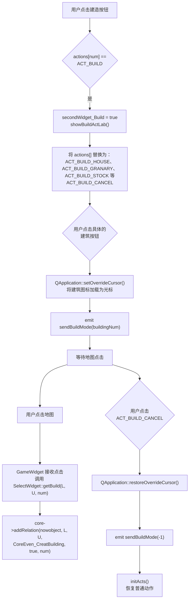
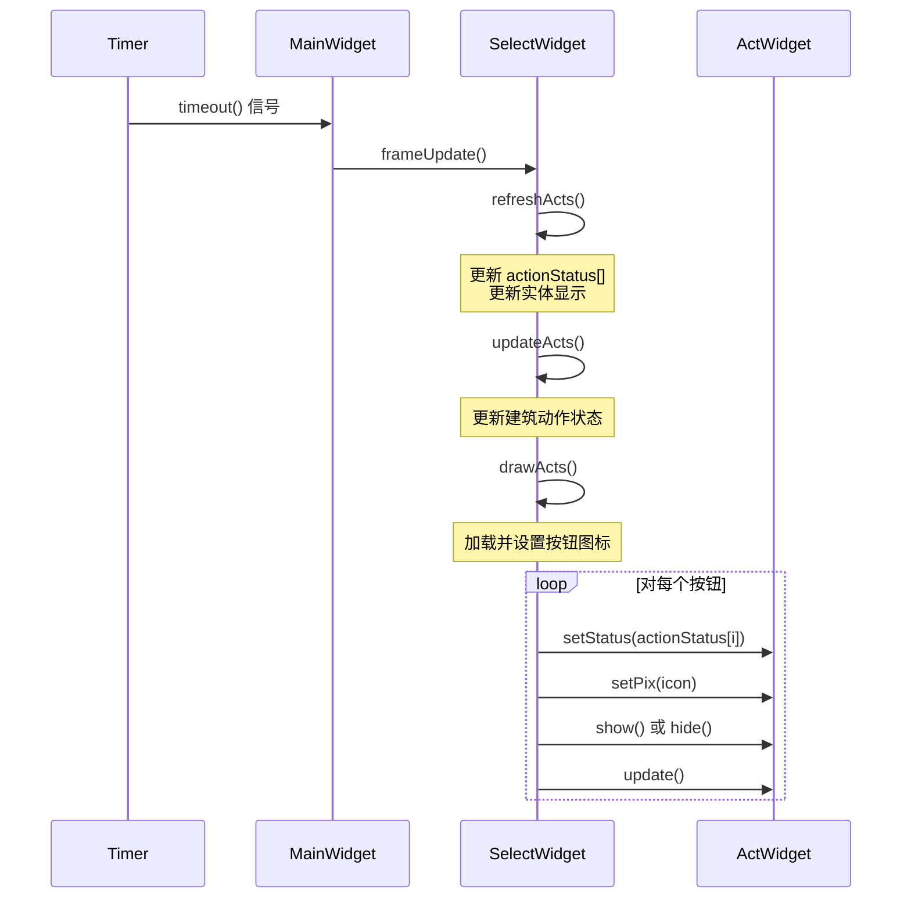

# SelectWidget 与命令面板

<details>
<summary>相关源文件</summary>

以下文件被用作生成本 wiki 页面的上下文：

- [MainWidget.cpp](MainWidget.cpp)
- [MainWidget.h](MainWidget.h)
- [SelectWidget.cpp](SelectWidget.cpp)

</details>


SelectWidget 与命令面板系统为玩家提供了用于查看所选实体信息和发出命令的界面。该系统显示单位/建筑统计信息，管理实体被选中时出现的 12 个动作按钮，并将玩家命令分发到游戏 Core。

关于 AI 命令处理，参见 [指令与命令系统](#5.2)。关于渲染画布，参见 [渲染与显示](#4.3)。

---

## 系统概览

SelectWidget 是一个位于游戏界面左下角的 Qt 控件，用于显示当前选中的游戏实体（建筑、单位或资源）的信息。其下方有 12 个动作按钮（`ActWidget` 实例），会根据当前选中对象而变化，使玩家能够训练单位、研究科技、建造建筑或发出特殊命令。



**来源：** [SelectWidget.cpp:1-1333](), [SelectWidget.h:1-82](), [MainWidget.cpp:1338-1370]()

---

## SelectWidget 显示组件

`SelectWidget` 类通过多个按网格布局排列的 QLabel 控件，显示当前所选实体的详细信息。

### 显示元素

| UI 元素 | 变量 | 用途 | 位置 |
|------------|----------|---------|----------|
| 对象图标 | `ui->objIcon` | 110x110 实体图标 | 主显示区 |
| 对象名称 | `ui->objName` | 实体名称（中文） | 图标上方 |
| HP 显示 | `ui->objHp` | “当前/最大” HP | 名称下方 |
| 进度文本 | `ui->objText` | 进度百分比或资源数量 | 中间 |
| 小图标 | `ui->objIconSmall` | 资源类型或状态图标 | 进度旁边 |
| 攻击显示 | `ui->objText_ATK` + `ui->objIconSmall_ATK` | 攻击值 | 统计行 1 |
| 近战防御 | `ui->objText_DEF_melee` + `ui->objIconSmall_DEF_melee` | 近战防御值 | 统计行 2 |
| 远程防御/射程 | `ui->objText_DEF_range` + `ui->objIconSmall_DEF_range` | 远程防御值或射程 | 统计行 3 |

### 按实体类型划分的显示逻辑



**显示更新：** `refreshActs()` 函数会根据 `nowobject` 的类型在每一帧更新所有显示元素。

**来源：** [SelectWidget.cpp:106-145](), [SelectWidget.cpp:546-905]()

---

## 命令面板架构

命令面板由 12 个 `ActWidget` 实例组成，这些实例在 `MainWidget::initInfoPane()` 中初始化，并由 `SelectWidget` 管理。这些按钮以 6×2 网格排列在屏幕右下角。

### ActWidget 数组初始化



每个 `ActWidget` 具有：
- **num**：按钮索引（0-11）
- **status**：`ACT_STATUS_ENABLED` 或 `ACT_STATUS_DISABLED`（影响视觉渲染）
- **pix**：从 `resMap` 加载的 QPixmap 图标
- **actPress(int)** 信号：点击时发出

**来源：** [MainWidget.cpp:1338-1370](), [SelectWidget.cpp:1-19]()

---

## 动作系统数据结构

动作系统使用三个并行数组来管理 12 个命令按钮：

### 核心数据数组

```cpp
// In SelectWidget class
int actions[ACT_WINDOW_NUM_FREE];        // Which action each button represents
int actionStatus[ACT_WINDOW_NUM_FREE];   // Whether button is enabled
QMap<int, QString> actionResourceMap;    // Maps action ID to icon resource name
```

### 动作流状态机



**来源：** [SelectWidget.cpp:154-261](), [SelectWidget.cpp:263-544](), [SelectWidget.cpp:1213-1230](), [SelectWidget.cpp:1232-1326]()

---

## 动作初始化（initActs）

`initActs()` 函数会根据所选实体的类型填充 `actions[]` 数组。这决定了命令面板上会出现哪些命令。

### 按实体类型划分的动作集合

| 实体类型 | 动作来源 | 特殊逻辑 |
|-------------|----------------|---------------|
| `SORT_BUILDING` | `Building::getActNames(i)` | 如果建筑正在执行动作则显示 STOP，否则显示建筑特有动作 |
| `SORT_FARMER` | 硬编码：`ACT_BUILD`（位置 0），运输船为 `ACT_SHIP_LAY` | 农民可以建造建筑 |
| `SORT_ARMY` | 对 `AT_STONE_THROWER`：`ACT_STONE_THROWER_PINPOINT_STRIKE` 或 `ACT_STONE_THROWER_CANCEL_PINPOINT_STRIKE` | 其他军事单位无动作 |
| 其他 | 全部为 `ACT_NULL` | 资源和动物没有动作 |

### 建筑动作可见性

建筑使用两级可见性系统：
1. **科技可见性**：`Player::get_isBuildActionShowAble()` 检查科技是否已研究
2. **资源可用性**：在 `refreshActs()` 中检查，用于将按钮变灰



**来源：** [SelectWidget.cpp:154-261]()

---

## 动作状态刷新（refreshActs）

`refreshActs()` 函数每帧运行一次，用于更新按键的启用/禁用状态以及信息显示。它与 `initActs()` 分离，以避免不必要地重复计算动作数组。

### 状态更新逻辑



### 资源检查

`Player::get_isBuildActionAble()` 和 `Player::get_isBuildingAble()` 方法会检查：
- 木材、食物、石头、黄金是否充足
- 科技前置条件（来自 Development 系统）
- 人口容量
- 建筑前置条件（例如，研究市场升级前必须先拥有 Market）

**来源：** [SelectWidget.cpp:263-544](), [MainWidget.cpp:1213-1230]()

---

## 动作图标渲染（drawActs）

`drawActs()` 函数会从资源映射中为每个动作按钮加载并显示相应图标。

### 图标选择逻辑



**动作资源映射示例：**
```cpp
actionResourceMap[ACT_CREATEFARMER] = "Button_Villager";
actionResourceMap[ACT_UPGRADE_AGE] = "ButtonTech_Center1";
actionResourceMap[ACT_BUILD] = "Button_Build";
actionResourceMap[ACT_STONE_THROWER_PINPOINT_STRIKE] = "Button_PinPointStrike";
```

**来源：** [SelectWidget.cpp:21-77](), [SelectWidget.cpp:1232-1326]()

---

## 动作执行（doActs）

`doActs()` 函数是执行玩家命令的中央分发器。当按钮被点击（`widgetAct()`）或 AI 发出命令（`aiAct()`）时，就会调用它。

### 执行流程



**来源：** [SelectWidget.cpp:907-913](), [SelectWidget.cpp:915-918](), [SelectWidget.cpp:933-1192]()

---

## 建造模式系统

当玩家点击 `ACT_BUILD` 或任意建筑建造动作时，系统会进入“建造模式”，此时光标会变为建筑图标，并等待一次地图点击。

### 建造模式流程



### 建筑可用性（showBuildActLab）

`showBuildActLab()` 函数会用建筑选项填充动作面板：

| 按钮位置 | 建筑类型 | 可见性检查 |
|----------------|---------------|------------------|
| 0 | `BUILDING_HOME` | 研究后始终可见 |
| 1 | `BUILDING_GRANARY` | 需要石器时代 |
| 2 | `BUILDING_STOCK` | 需要工具时代 |
| 3 | `BUILDING_MARKET` | 需要市场科技 |
| 4 | `BUILDING_ARROWTOWER` | 需要箭塔科技 |
| 5 | `BUILDING_ARMYCAMP` | 需要工具时代 |
| 6 | `BUILDING_RANGE` | 需要工具时代 |
| 7 | `BUILDING_STABLE` | 需要工具时代 |
| 8 | `BUILDING_FARM` | 需要农场科技 |
| 10 | `BUILDING_COLLAGE` | 需要青铜时代 |
| 9 | `BUILDING_SIEGE` | 需要青铜时代 |
| 11 | `ACT_BUILD_CANCEL` | 始终启用 |

**来源：** [SelectWidget.cpp:963-1007](), [SelectWidget.cpp:1194-1211](), [SelectWidget.cpp:1329-1332]()

---

## 与游戏系统的集成

### 与 Core 引擎的连接

SelectWidget 通过以下方式与 `Core` 引擎交互：
- **直接创建关系**：`core->addRelation()` 用于立即动作
- **挂起关系**：`core->suspendRelation()` 用于停止动作

### 与 AI 系统的连接

玩家动作会经过 AI 系统处理，以进行校验和排队：
- **建筑动作**：`UsrAI::BuildingAction(globalNum, actionType)` 
- **单位动作**：未来实现
- 这确保玩家动作遵循与 AI 命令相同的校验逻辑

### 与玩家资源的连接

`Player` 类提供了多个供 SelectWidget 使用的查询函数：
- `get_isBuildingShowAble(buildType)`：科技前置条件检查
- `get_isBuildingAble(buildType)`：资源 + 科技检查
- `get_isBuildActionAble(buildType, actionType)`：动作可用性
- `get_isBuildActionShowAble(buildNum, actNum)`：动作可见性
- `get_buildActLevel(buildNum, actNum)`：升级等级（用于图标）
- `getWood()`, `getFood()`, `getStone()`, `getGold()`：资源数量

### 帧更新周期



**来源：** [MainWidget.cpp:1378-1380](), [SelectWidget.cpp:147-152]()

---

## 关键常量与枚举

### 动作类型常量

动作类型定义在 `config.h` 中，并在整个系统中被引用：

| 常量前缀 | 用途 | 示例 |
|----------------|---------|---------|
| `ACT_BUILD_*` | 建筑建造 | `ACT_BUILD_HOUSE`, `ACT_BUILD_GRANARY` |
| `ACT_CREATEFARMER` | 从 Center 创建单位 | 创建农民单位 |
| `ACT_UPGRADE_*` | 科技研究 | `ACT_UPGRADE_AGE`, `ACT_UPGRADE_WOOD` |
| `ACT_*_CREATE_*` | 单位训练 | `ACT_ARMYCAMP_CREATE_CLUBMAN` |
| `ACT_*_UPGRADE_*` | 单位升级 | `ACT_ARMYCAMP_UPGRADE_CLUBMAN` |
| `ACT_STOP` | 停止当前动作 | 取消建造/研究 |
| `ACT_BUILD` | 进入建造模式 | 显示建筑菜单 |
| `ACT_BUILD_CANCEL` | 退出建造模式 | 恢复普通动作 |
| `ACT_NULL` | 未分配动作 | 按钮被隐藏 |

### 动作状态值

```cpp
#define ACT_STATUS_ENABLED 1   // Button is clickable
#define ACT_STATUS_DISABLED 0  // Button is grayed out
```

**来源：** [config.h]()（引用）, [SelectWidget.cpp:34-91]()

---

## 特殊功能

### 投石车定点打击

投石车单位拥有一个独特的两步动作系统：

1. **激活**：点击 `ACT_STONE_THROWER_PINPOINT_STRIKE`
   - 设置 `MainWidget::waitingForPinPointStrike = true`
   - 按钮变为 `ACT_STONE_THROWER_CANCEL_PINPOINT_STRIKE`
   - 等待地图点击

2. **目标选择**：点击地图
   - 在 `Core::manageMouseEvent()` 中处理
   - 使用目标坐标创建 `CoreEven_PinPointStrike` 关系

3. **取消**：点击 `ACT_STONE_THROWER_CANCEL_PINPOINT_STRIKE`
   - 调用 `core->suspendRelation(unit)`
   - 重置等待状态

**来源：** [SelectWidget.cpp:1122-1167](), [MainWidget.h:52-60]()

### 按文明动态选择图标

建筑建造按钮会根据玩家当前文明时代显示不同图标：

```cpp
// Example from drawActs()
int civ = mainPtr->player[0]->getCiv();  // 1=Stone, 2=Tool, 3=Bronze
string base = Building::getBuiltname(civ, 0, buildingNum);
string key = "Button_" + base;
```

这确保了工具时代的房屋会显示木制建筑图标，而青铜时代的房屋会显示砖制建筑图标。

**来源：** [SelectWidget.cpp:1243-1276]()

### 棍棒兵升级等级图标

棍棒兵训练按钮会根据升级等级显示不同图标：
- 等级 0：`Button_Clubman`（基础棍棒兵）
- 等级 1：`Button_Axeman`（升级为斧兵）

这是通过 `Player::get_buildActLevel(BUILDING_ARMYCAMP, BUILDING_ARMYCAMP_UPGRADE_CLUBMAN)` 查询得到的。

**来源：** [SelectWidget.cpp:1281-1296]()