# 地图编辑器

<details>
<summary>相关源文件</summary>

以下文件被用作生成本 wiki 页面时的上下文：

- [Editor.ui](Editor.ui)
- [MainWidget.cpp](MainWidget.cpp)
- [MainWidget.h](MainWidget.h)
- [map.njust](map.njust)

</details>


地图编辑器是一个集成式关卡设计工具，支持对游戏地图进行实时修改。它提供地形编辑、对象放置、AI 行为配置以及地图序列化功能。编辑器与游戏运行在同一个事件循环中，因此可以即时预览修改效果。

有关地图加载和地图数据结构的信息，请参见 [地图结构](#6.1)。有关 AI 行为中使用的区域定义详情，请参见 [区域管理系统](#7.1)。

## 概览与架构

地图编辑器嵌入在 `MainWidget` 中，而不是作为独立应用程序存在。它共享游戏的渲染管线和坐标系统，因此在编辑过程中能够提供即时的视觉反馈。

### 核心组件

```mermaid
graph TB
    subgraph "编辑器 UI (Editor.ui)"
        EditorWindow["编辑器窗口<br/>(QWidget)"]
        ExportBtn["export_map<br/>(QPushButton)"]
        DeleteBtn["delete_object<br/>(QPushButton)"]
        MouseBtn["mouse_button<br/>(QPushButton)"]
        LandType["land_type<br/>(QComboBox)"]
        LandHeight["land_height<br/>(QComboBox)"]
        PlayerBuild["player_building_and_source<br/>(QComboBox)"]
        PlayerHuman["player_human<br/>(QComboBox)"]
        AIBuild["ai_building_and_resource<br/>(QComboBox)"]
        AIHuman["ai_human<br/>(QComboBox)"]
        Resource["resource<br/>(QComboBox)"]
        Animal["animal<br/>(QComboBox)"]
        PatrolArea["patrolArea<br/>(QComboBox)"]
        EnemyStatus["enemyStatus<br/>(QComboBox)"]
    end
    
    subgraph "MainWidget 控制器"
        CurrentSelected["currentSelected<br/>(EditorElement 枚举)"]
        UpdateEditor["updateEditor()<br/>鼠标事件处理器"]
        ExportState["ExportCurrentState()<br/>JSON 序列化"]
    end
    
    subgraph "编辑操作"
        TerrainOps["地形功能<br/>HigherLand/LowerLand<br/>MakeOcean/MakeGrassland"]
        ObjectOps["对象创建<br/>MakeBuilding/MakeHuman<br/>MakeTree/MakeAnimal<br/>MakeStaticRes"]
        ClearOps["clearArea()<br/>对象删除"]
    end
    
    subgraph "区域管理"
        RectArea["RectArea<br/>rectArea"]
        CircleArea["CircleArea<br/>circleArea"]
        LineArea["LineArea<br/>lineArea"]
        SelectedUnits["selectedUnits<br/>vector<Coordinate*>"]
    end
    
    subgraph "AI 行为"
        EnemyStatusMap["enemyStatusMap<br/>map<Coordinate*, string>"]
    end
    
    EditorWindow --> ExportBtn
    EditorWindow --> DeleteBtn
    EditorWindow --> MouseBtn
    EditorWindow --> LandType
    EditorWindow --> LandHeight
    EditorWindow --> PlayerBuild
    EditorWindow --> PlayerHuman
    EditorWindow --> AIBuild
    EditorWindow --> AIHuman
    EditorWindow --> Resource
    EditorWindow --> Animal
    EditorWindow --> PatrolArea
    EditorWindow --> EnemyStatus
    
    LandType --> CurrentSelected
    LandHeight --> CurrentSelected
    PlayerBuild --> CurrentSelected
    PlayerHuman --> CurrentSelected
    AIBuild --> CurrentSelected
    AIHuman --> CurrentSelected
    Resource --> CurrentSelected
    Animal --> CurrentSelected
    PatrolArea --> CurrentSelected
    EnemyStatus --> CurrentSelected
    
    CurrentSelected --> UpdateEditor
    UpdateEditor --> TerrainOps
    UpdateEditor --> ObjectOps
    UpdateEditor --> ClearOps
    
    ExportBtn --> ExportState
    DeleteBtn --> CurrentSelected
    MouseBtn --> CurrentSelected
    
    PatrolArea --> RectArea
    PatrolArea --> CircleArea
    PatrolArea --> LineArea
    PatrolArea --> SelectedUnits
    
    EnemyStatus --> EnemyStatusMap
```

**来源：** [MainWidget.h:62-129](), [MainWidget.cpp:142-275](), [Editor.ui:1-449]()

### 初始化顺序

编辑器会在 `MainWidget` 的构造函数中，在游戏核心系统设置完成之后进行初始化：

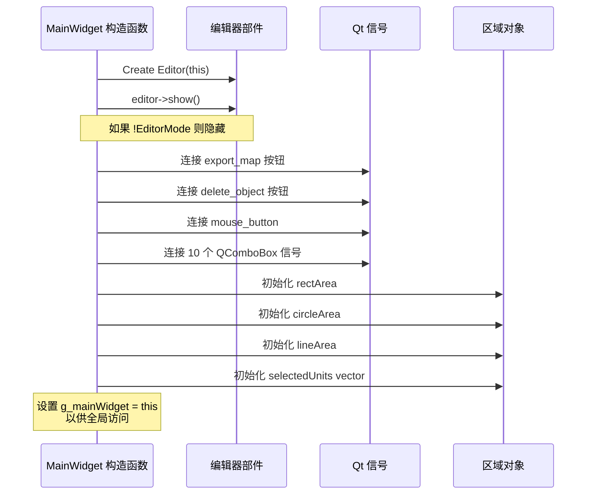

**来源：** [MainWidget.cpp:142-275](), [MainWidget.h:62-67]()

## 编辑模式系统

编辑器采用状态机方式，其中 `currentSelected`（类型为 `EditorElement`）决定当前的编辑模式。每次选择组合框或按钮时，都会更新这个状态。

### EditorElement 枚举

| 类别 | 枚举值 | 说明 |
|----------|-------------|-------------|
| **工具模式** | `NORMAL_MOUSE`, `DELETEOBJECT` | 基础鼠标与删除 |
| **地形类型** | `FLAT`, `OCEAN` | 地形材质 |
| **地形高度** | `HIGHTERLAND`, `LOWERLAND` | 高度修改 |
| **玩家建筑** | `PLAYERDOWNTOWN`, `PLAYERHOME`, `PLAYERREPOSITORY`, `PLAYERARROWTOWER`, `PLAYERDOCK`, `PLAYERBARRACKS`, `PLAYERFISHERY` | 玩家建筑 |
| **玩家单位** | `PLAYERFARMER`, `PLAYERCLUBMAN`, `PLAYERAXEMAN`, `PLAYERSCOUT`, `PLAYERBOWMAN`, `PLAYERFISHINGBOAT`, `PLAYERTRANSPORTSHIP`, `PLAYERWARSHIP` | 玩家单位 |
| **敌方建筑** | `AIARROWTOWER`, `AIWARSHIP` | 敌方建筑 |
| **敌方单位** | `AICLUBMAN`, `AIAXEMAN`, `AISCOUT`, `AIBOWMAN`, `AIPRIEST`, `AIHOPLITE`, `AICOMPARCHER`, `AIBROADSWORDSMAN`, `AICHARIOT`, `AICHARIOTARCHER`, `AISTONETHROWER` | 敌方单位 |
| **资源** | `TREE`, `STONM`, `GOLDORE` | 静态资源 |
| **动物** | `GAZELLE`, `LION`, `ELEPHANT` | 野生动物 |
| **区域工具** | `RECT_AREA`, `CIRCLE_AREA`, `LINE_AREA`, `PATROL_RECT_AREA`, `PATROL_CIRCLE_AREA`, `PATROL_LINE_AREA` | 区域定义 |
| **AI 行为** | `ENEMY_STATUS_ATTACK`, `ENEMY_STATUS_DEFEND` | 敌方姿态 |

**来源：** [MainWidget.h:80-129]()

### 模式选择流程

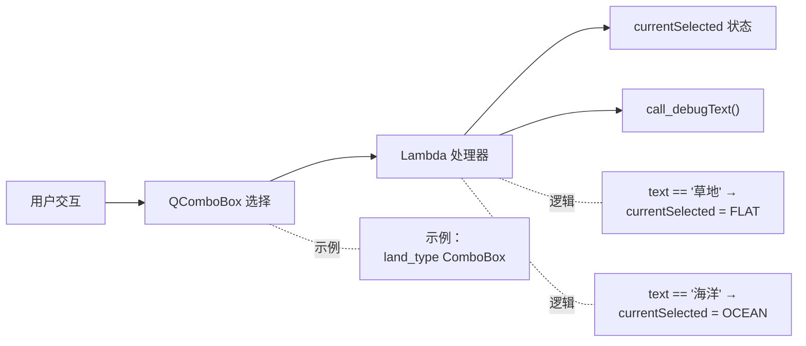

每个组合框都使用 Qt 的 `currentIndexChanged` 信号，并配合 lambda 处理器将所选文本映射为一个 `EditorElement` 枚举值。例如：

**来源：** 地形类型见 [MainWidget.cpp:164-175]()，玩家建筑见 [MainWidget.cpp:177-189]()

## 鼠标事件处理

`updateEditor()` 函数会在主事件循环中被调用，用于在编辑模式下处理鼠标交互。它会区分拖拽操作（按住）和点击操作（单击）。

### updateEditor() 控制流

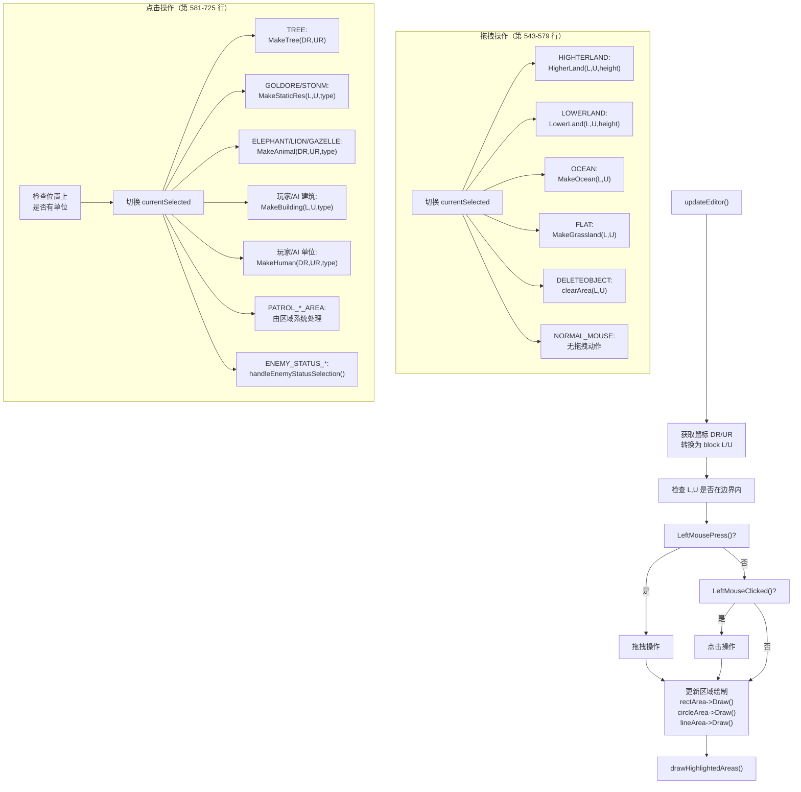

**来源：** [MainWidget.cpp:528-740]()

### 使用 Ctrl 选择单位

编辑器支持按住 Ctrl 键选择敌方单位，以便分配区域：

**来源：** [MainWidget.cpp:584-603]()

## 地形修改

地形编辑以鼠标位置为中心，对 3×3 的方块区域进行操作。系统会施加约束，防止出现无效的地形配置。

### 高度修改

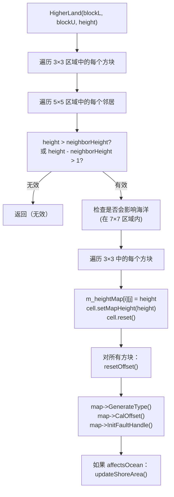

高度修改函数会强制相邻方块之间的高度差不能超过 1 级。这可以防止视觉伪影，并保证地形过渡平滑。

**来源：** `HigherLand/LowerLand` 见 [MainWidget.cpp:881-1003]()

### 地形类型修改

| 函数 | 行号 | 操作 | 副作用 |
|----------|-------|-----------|--------------|
| `MakeOcean()` | 1005-1034 | 将高度设为 `MAPHEIGHT_OCEAN`，类型设为 `MAPTYPE_OCEAN`，清除偏移量 | 调用 `updateShoreArea()` 重绘海滩 |
| `MakeGrassland()` | 1068-1107 | 将海洋转换为平地，设置 `MAPTYPE_FLAT` 和 `MAPPATTERN_GRASS` | 调用 `updateShoreArea()`，仅更新局部偏移 |
| `DeleteOcean()` | 1037-1066 | 将海洋转换为平地，通过 `ResetMapType()` 重置类型 | 与 MakeGrassland 类似 |

所有地形修改函数都会更新底层的 `m_heightMap` 数组，并调用地图重生成功能以更新视觉表现。

**来源：** [MainWidget.cpp:1005-1107]()

## 对象放置

对象创建函数会验证放置位置，并将实体加入相应的容器中。

### 对象创建函数

```mermaid
graph TB
    subgraph "MakeTree(DR, UR)"
        T1["转换为方块坐标"]
        T2["检查该位置<br/>是否已有树"]
        T3["map->addAnimal(0, DR, UR)"]
        T1 --> T2
        T2 -->|未找到| T3
    end
    
    subgraph "MakeStaticRes(L, U, type)"
        S1["检查在 blockL, blockU<br/>是否有重复对象"]
        S2["按 type 分支"]
        S3["GOLDORE: addStaticRes(2)<br/>STONM: addStaticRes(1)<br/>PLAYERFISHERY: addStaticRes(3)"]
        S1 -->|未找到| S2
        S2 --> S3
    end
    
    subgraph "MakeBuilding(L, U, type)"
        B1["检查双方玩家的<br/>建筑列表"]
        B2["按 type 分支"]
        B3["player[0/1]->addBuilding<br/>(buildingType, L, U, 100)"]
        B1 -->|未找到| B2
        B2 --> B3
    end
    
    subgraph "MakeHuman(DR, UR, type)"
        H1["转换为方块坐标"]
        H2["检查地图地形类型"]
        H3["验证船只在水上<br/>或陆地单位在陆地上"]
        H4["按 type 分支"]
        H5["player[0/1]->addFarmer<br/>或 addArmy(armyType)"]
        H1 --> H2
        H2 --> H3
        H3 -->|有效| H4
        H3 -->|无效| H6["call_debugText 错误"]
        H4 --> H5
    end
```

**来源：** 树/静态资源见 [MainWidget.cpp:1109-1152]()，建筑见 [MainWidget.cpp:1154-1181]()，单位见 [MainWidget.cpp:1183-1260]()

### 单位的地形验证

`MakeHuman()` 会强制地形兼容性：

- 船只（`AIWARSHIP`, `PLAYERFISHINGBOAT`, `PLAYERTRANSPORTSHIP`）必须位于 `MAPTYPE_OCEAN`
- 陆地单位必须位于非海洋地形
- 如果地形不兼容，将拒绝放置并显示错误消息

**来源：** [MainWidget.cpp:1196-1214]()

## 对象删除

`clearArea()` 函数会移除目标方块坐标一定半径内的所有对象。

### 删除流程

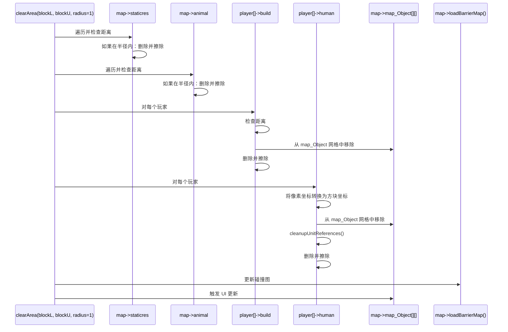

该函数会谨慎地从对象容器列表和 `map_Object` 空间网格中同时移除对象，以防止悬空指针。对于单位，它还会调用 `cleanupUnitReferences()`，将其从选择列表和区域关系中移除。

**来源：** [MainWidget.cpp:742-847]()

## 区域定义系统

编辑器允许为单位定义巡逻区域和移动约束。这通过三种区域类型实现：`RectArea`、`CircleArea` 和 `LineArea`。

### 区域分配工作流

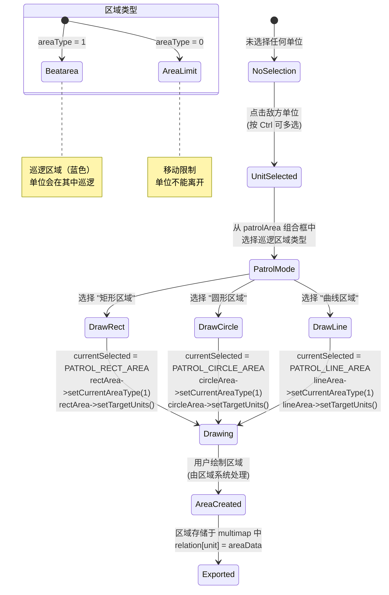

**来源：** 巡逻区域设置见 [MainWidget.cpp:236-267]()

### 区域数据结构

每种区域类型都使用特定结构存储其几何数据：

| 区域类型 | 数据结构 | 关键字段 |
|-----------|----------------|------------|
| `RectArea` | `RectAreaData` | `dr`, `ur`（中心），`w`, `h`（尺寸），`areaType` |
| `CircleArea` | `CircleAreaData` | `dr`, `ur`（中心），`rad`（半径），`areaType` |
| `LineArea` | `LineAreaData` | `data`（点向量），`areaType` |

`areaType` 字段用于区分巡逻区域（1）和移动限制区域（0）。该信息既会在游戏过程中使用，也会在导出地图时使用。

**来源：** `ExportCurrentState` 中的 [MainWidget.cpp:289-363]()

## 敌方状态配置

可以通过 `enemyStatus` 组合框为敌方单位分配行为状态。这会影响它们在游戏过程中的 AI 决策。

### 敌方状态映射

`enemyStatusMap`（类型为 `map<Coordinate*, string>`）存储敌方单位与其状态字符串之间的关联：

- `"attack"`：攻击型行为，主动寻找目标
- `"defend"`：防御型行为，坚守位置

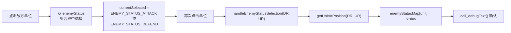

**来源：** 组合框处理器见 [MainWidget.cpp:258-267]()，`enemyStatusMap` 声明见 [MainWidget.h:73]()

## 地图导出与导入

编辑器使用 `ExportCurrentState()` 函数将整个游戏状态序列化为 JSON 格式。这会生成一个 `.njust` 文件，可在游戏启动时加载。

### 导出数据结构

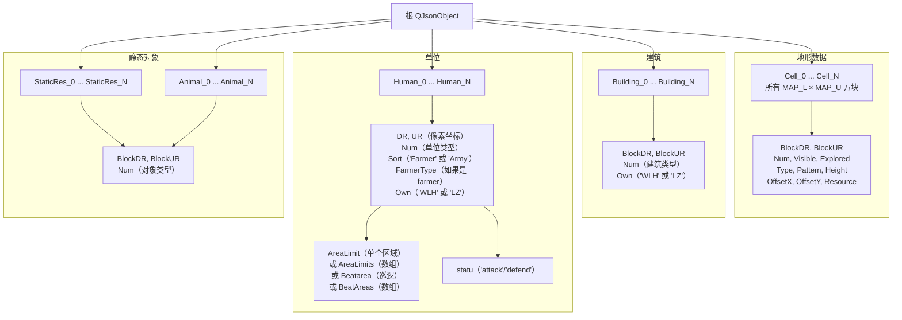

**来源：** [MainWidget.cpp:279-525]()

### 区域导出格式

区域会连同其类型信息一起序列化：

```json
{
  "Type": "RectArea" | "CircleArea" | "LineArea",
  "AreaName": "Beatarea" | "AreaLimit",
  // Type-specific fields:
  // RectArea: "DR", "UR", "W", "H"
  // CircleArea: "DR", "UR", "R"
  // LineArea: "Point" (array of [x,y] pairs)
}
```

对于具有多个区域的单位，导出时会使用数组字段（`BeatAreas`, `AreaLimits`），同时通过对单个区域使用单数字段来保持向后兼容性。

**来源：** `JsonAreaLimit` 函数见 [MainWidget.cpp:317-363]()，多区域导出见 [MainWidget.cpp:444-490]()

### 导出按钮处理器

导出功能通过 Qt 信号连接：

**来源：** [MainWidget.cpp:155-158]()

## UI 控件参考

### 控件布局

| 控件 | 类型 | 用途 | 在 Editor.ui 中的行号 |
|---------|------|---------|-------------------|
| `export_map` | QPushButton | 触发将地图导出到 `map.njust` | 16-28 |
| `delete_object` | QPushButton | 激活删除模式 | 322-334 |
| `mouse_button` | QPushButton | 返回普通鼠标模式 | 399-411 |
| `land_type` | QComboBox | 选择草地/海洋地形 | 335-359 |
| `land_height` | QComboBox | 升高/降低地形高度 | 29-53 |
| `player_building_and_source` | QComboBox | 放置玩家建筑 | 54-118 |
| `player_human` | QComboBox | 放置玩家单位 | 149-188 |
| `ai_building_and_resource` | QComboBox | 放置敌方建筑 | 119-148 |
| `ai_human` | QComboBox | 放置敌方单位 | 189-258 |
| `resource` | QComboBox | 放置树木、石头、黄金 | 259-291 |
| `animal` | QComboBox | 放置瞪羚、狮子、大象 | 292-321 |
| `patrolArea` | QComboBox | 定义巡逻区域（在选择单位前禁用） | 360-398 |
| `enemyStatus` | QComboBox | 设置 AI 行为（在选择单位前禁用） | 412-445 |

**来源：** [Editor.ui:1-449]()

### 启用/禁用逻辑

`patrolArea` 和 `enemyStatus` 组合框在初始状态下是禁用的，只有在选中敌方单位后才会启用。这样可以防止在没有目标单位的情况下设置区域或状态。

**来源：** `patrolArea` 的 enabled 属性见 [Editor.ui:361-363]()，`enemyStatus` 的 enabled 属性见 [Editor.ui:413-415]()

## 与游戏系统的集成

### 坐标系统的使用

编辑器使用两套坐标系统：

- **方块坐标**（`blockL`, `blockU`）：用于地形修改和建筑放置
- **细节坐标**（`DR`, `UR`）：用于单位和资源放置

转换发生在 `updateEditor()` 中：

**来源：** [MainWidget.cpp:538-540]()

### 与核心系统的交互

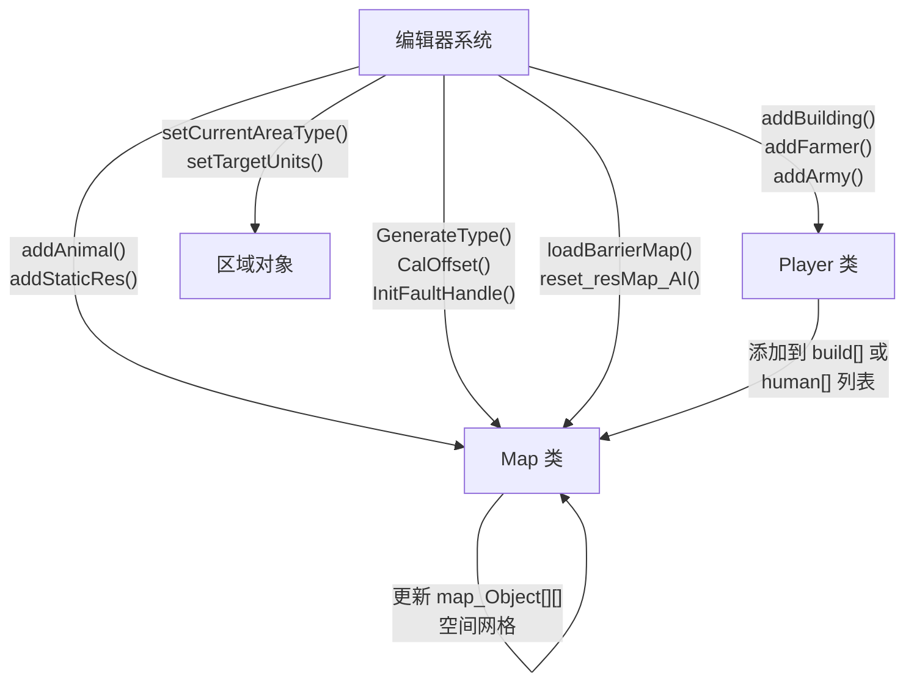

当对象通过编辑器创建时，它们会被加入与正常游戏过程相同的数据结构中。这保证了编辑后的地图与通过程序生成的内容具有完全一致的行为。

**来源：** 对象创建流程见 [MainWidget.cpp:1109-1260]()

### 地图重生成

地形修改后，地图必须重新生成其视觉表示：

1. `GenerateType()`：根据高度重新计算地形类型
2. `CalOffset()`：重新计算等距渲染偏移
3. `InitFaultHandle()`：更新地形过渡
4. `updateShoreArea()`：重绘海滩（涉及海洋时）

**来源：** 重生成调用见 [MainWidget.cpp:934-1002]()

## 调试与反馈

编辑器通过调试文本系统提供视觉反馈：

- 绿色文本：工具选择确认
- 红色文本：错误信息（例如放置无效）
- 蓝色/黄色文本：状态确认
- 青色/品红色文本：区域处理细节

所有编辑器操作都会使用 `call_debugText()` 并配合适当的颜色编码来记录其行为。

**来源：** UI 处理器中的调试输出调用见 [MainWidget.cpp:160-267]()