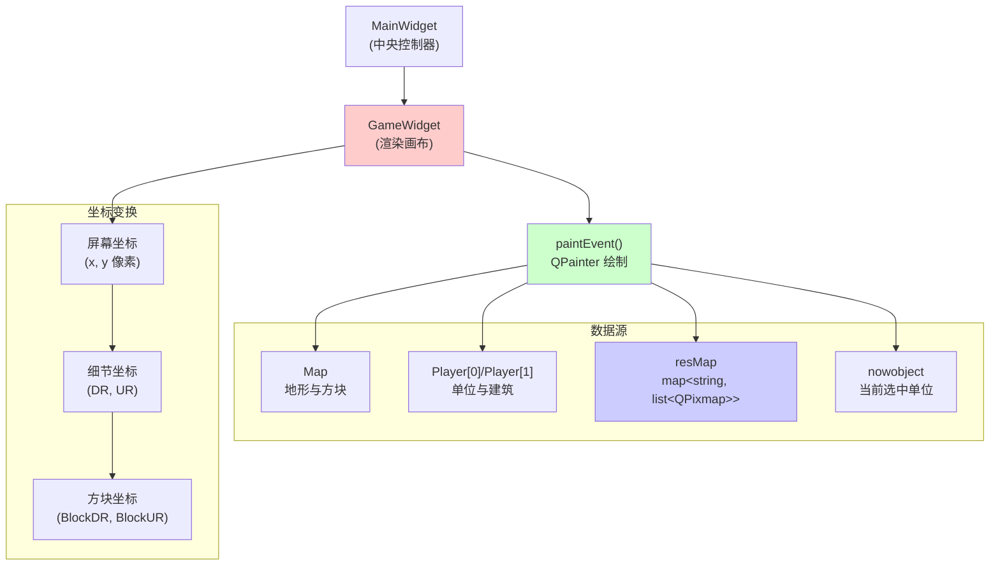
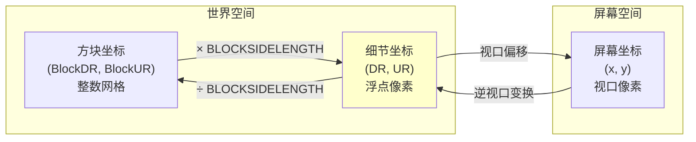
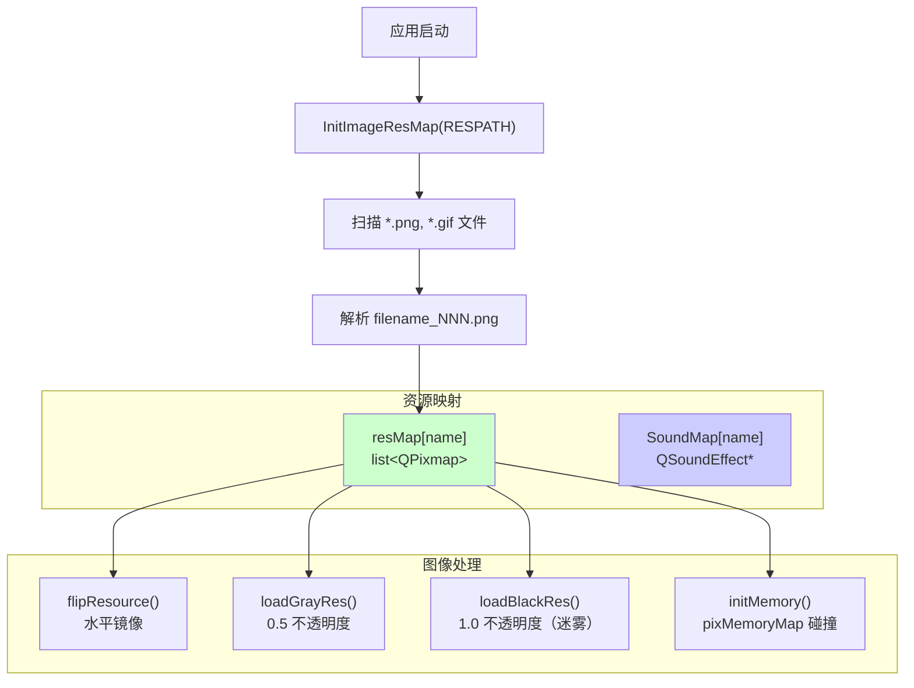
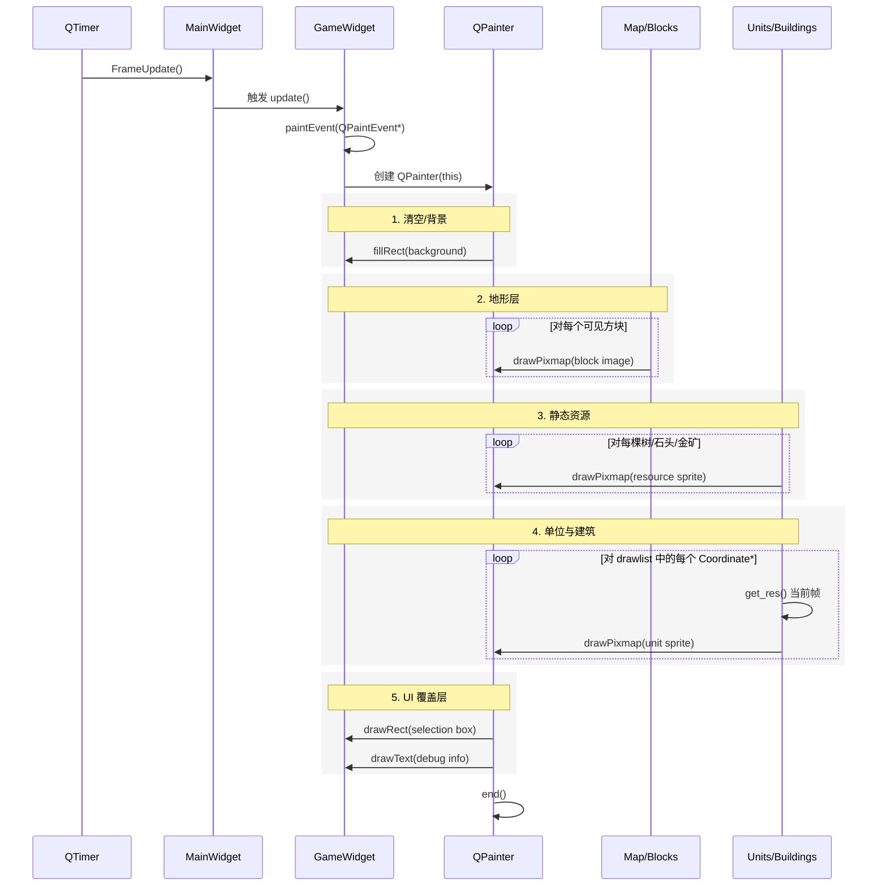
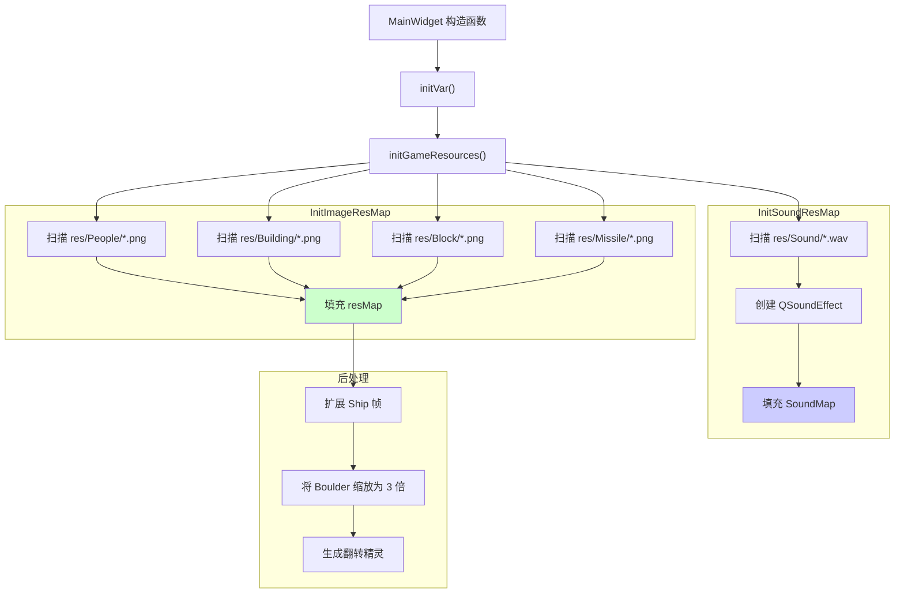

# 渲染与显示

<details>
<summary>相关源文件</summary>

以下文件被用作生成本 wiki 页面时的上下文：

- [GlobalVariate.cpp](GlobalVariate.cpp)
- [GlobalVariate.h](GlobalVariate.h)
- [MainWidget.cpp](MainWidget.cpp)
- [README.md](README.md)

</details>


本页记录了将游戏世界、单位、建筑和地形绘制到屏幕上的可视化渲染系统。内容涵盖 `GameWidget` 渲染画布、坐标变换系统、资源加载机制，以及逐帧渲染流水线。

**范围**：本页聚焦于视觉内容如何显示。关于用户输入处理，参见 [事件处理](#4.4)。关于被渲染的地图数据结构，参见 [地图结构](#6.1)。关于 UI 面板和控件，参见 [SelectWidget 和命令面板](#4.1)。

---

## GameWidget 架构

`GameWidget` 类是主要的渲染画布，所有游戏视觉内容都绘制在这里。它继承自 `QWidget`，并重写 `paintEvent()` 以在每一帧执行自定义渲染。



**图示：GameWidget 渲染架构**

`GameWidget` 在 `MainWidget` 中实例化，占据游戏窗口的中央区域。它访问 `g_Object`（按 SN 索引的所有游戏对象）、`resMap`（图像资源）以及玩家的单位/建筑列表等全局数据结构，以确定要绘制的内容。

**来源**： [MainWidget.cpp:94-276](), [GlobalVariate.h:514-525](), [README.md:168-169]()

---

## 坐标系统

游戏使用三套彼此转换的坐标系统：

| 系统 | 单位 | 范围 | 用途 |
|--------|------|-------|---------|
| **方块坐标** | 方块 | `[0, MAP_L) × [0, MAP_U)` | 地形网格索引、建筑放置 |
| **细节坐标** | 像素（DR/UR） | `[0, MAP_L × BLOCKSIDELENGTH) × [0, MAP_U × BLOCKSIDELENGTH)` | 精确单位定位、移动目标 |
| **屏幕坐标** | 像素（x/y） | `[0, GAMEWIDGET_WIDTH) × [0, GAMEWIDGET_HEIGHT)` | 鼠标输入、视口渲染 |



**图示：坐标系统变换**

### 方块坐标

方块坐标表示离散的地块网格。每个方块的边长为 `BLOCKSIDELENGTH`（通常为 64 像素）。地图包含 `MAP_L × MAP_U` 个方块（例如 120 × 120）。

**关键函数**：
- 转换到细节中心：`trans_BlockPointToDetailCenter(blockPos)` 返回 `(blockPos + 0.5) × BLOCKSIDELENGTH` [GlobalVariate.cpp:1089-1092]()

### 细节坐标

细节坐标（DR, UR）提供世界中的精确定位。单位沿着带小数的像素位置移动，坐标以 `double` 存储。

**坐标命名**：
- `DR`：`"Down-Right"` 对角坐标
- `UR`：`"Up-Right"` 对角坐标

这套对角坐标系统与等距渲染视角保持一致。

### 屏幕坐标

屏幕坐标表示 `GameWidget` 视口中的像素位置。视口可以平移和缩放，因此需要变换函数在屏幕空间与世界空间之间进行转换。

**变换方法**（位于 `GameWidget` 中）：
- `TranGlobalPosToDR(int x, int y) -> double`：屏幕到细节 DR
- `TranGlobalPosToUR(int x, int y) -> double`：屏幕到细节 UR

**来源**： [GlobalVariate.cpp:1089-1092](), [MainWidget.cpp:538-540](), [config.h]()

---

## 资源管理

视觉资源在启动时加载，并存储在全局映射中。系统支持多帧动画，并会生成派生资源（翻转图像、战争迷雾覆盖层）。

### 资源加载流水线



**图示：资源加载与处理流水线**

### 图像资源映射结构

全局变量 `resMap` 存储所有精灵表和动画：

```cpp
map<std::string, std::list<QPixmap>> resMap;
```

**命名约定**：像 `Farmer_Down_001.png`、`Farmer_Down_002.png` 这样的文件会被归组到 `resMap["Farmer_Down"]` 中，作为连续帧。

**关键加载函数**：
- `InitImageResMap(QString path)`：扫描目录、解析文件名，并填充 `resMap` [GlobalVariate.cpp:590-697]()
- `InitSoundResMap(QString path)`：将 WAV 文件加载到 `SoundMap` 中 [GlobalVariate.cpp:698-774]()

### 碰撞内存映射

`resMap` 中的每个 `QPixmap` 都有关联的 `pixMemoryMap`，用于标记不透明像素，以进行碰撞检测：

```cpp
struct ImageResource {
    QPixmap pix;
    pixMemoryMap memorymap;
};
```

`pixMemoryMap` 是一个表示二维位图的一维向量，其中 `1` 表示实体像素，`0` 表示透明像素。

**生成方式**：`initMemory(ImageResource* res)` 会分析 `QImage` 的 alpha 通道，并设置内存映射位，同时向四周扩展 1 个像素作为边距 [GlobalVariate.cpp:970-1013]()

**来源**： [GlobalVariate.cpp:590-697](), [GlobalVariate.cpp:698-774](), [GlobalVariate.cpp:970-1013](), [GlobalVariate.h:1002-1084]()

---

## 渲染流水线

每一帧中，`GameWidget::paintEvent()` 方法会执行以下渲染流水线：

### 帧渲染顺序



**图示：帧渲染顺序**

### 图层顺序

渲染按严格顺序进行，以确保正确的深度关系：

1. **背景/清空**：用背景色填充
2. **地形方块**：绘制 `map->cell[L][U]` 中的所有 `Block` 图块
3. **静态资源**：绘制 `StaticRes`（树木、石堆、金矿）
4. **动态对象**：从 `drawlist` 中绘制单位和建筑
   - 建筑在方块位置渲染
   - 单位在细节（DR, UR）位置渲染
   - 精灵根据 `nowres` 计数器选择动画帧
5. **UI 覆盖层**：选择框、血条、战争迷雾、调试文本

### 动画帧选择

每个 `Coordinate` 子类都维护一个 `nowres` 计数器，用于在其精灵列表中循环：

**以 Farmer 为例**：
- `res_Stand_Down`、`res_Stand_Up` 等包含站立动画
- `res_Walk_Down`、`res_Walk_Up` 等包含行走动画
- `nowres` 每帧递增并回绕：`nowres = (nowres + 1) % frameCount`
- 当前精灵：`res_current->at(nowres % res_current->size())`

**帧率控制**：`config.json` 中的 `NOWRES_TIMER_*` 常量控制每经过多少个游戏帧才推进一帧动画（例如，`NOWRES_TIMER_FARMER = 3` 表示每 3 帧播放一次动画）。

**来源**： [GlobalVariate.cpp:551-563](), [README.md:168-169]()

---

## 摄像机与视口管理

游戏视口可以平移和滚动，以跟随玩家在大地图上的视野。

### 视口状态

| 变量 | 类型 | 用途 |
|----------|------|---------|
| `MidX`, `MidY` | `int` | 视口当前中心在屏幕像素中的位置 |
| `MAP_LSide[2]`, `MAP_USide[2]` | `int[2]` | 方块坐标中的可见边界 |
| `mapmoveFrequency` | `int` | 视口平移速度 |

**全局变量**：声明于 [GlobalVariate.h:516-519]()

### 视口移动

用户可以通过以下方式移动视口：
- **鼠标移动到屏幕边缘**：在事件过滤器中检测，触发连续滚动
- **键盘方向键**：离散地移动视口
- **小地图点击**：跳转到被点击区域

**移动实现**：
```
MidX += deltaX * mapmoveFrequency
MidY += deltaY * mapmoveFrequency
```

`mapmoveFrequency` 初始化为 `config.json` 中的 `INITIAL_FREQUENCY`，并且可在运行时调整。

### 可见区域计算

在渲染之前，系统会计算哪些方块是可见的：

```
MAP_LSide[0] = max(0, (MidX - GAMEWIDGET_WIDTH/2) / BLOCKSIDELENGTH)
MAP_LSide[1] = min(MAP_L, (MidX + GAMEWIDGET_WIDTH/2) / BLOCKSIDELENGTH + 1)
MAP_USide[0] = max(0, (MidY - GAMEWIDGET_HEIGHT/2) / BLOCKSIDELENGTH)
MAP_USide[1] = min(MAP_U, (MidY + GAMEWIDGET_HEIGHT/2) / BLOCKSIDELENGTH + 1)
```

只有这些边界内的方块和对象会被渲染，从而优化性能。

**来源**： [GlobalVariate.h:516-519](), [config.json]()

---

## 视觉效果

渲染系统应用多种视觉效果，以提供游戏反馈和氛围表现。

### 战争迷雾

未探索和脱离视野的区域会通过预生成的黑色覆盖精灵变暗。

**实现方式**：
- 每种单位类型都有由 `loadBlackRes()` 生成的 `blackres` 变体 [GlobalVariate.cpp:1055-1066]()
- `applyTransparencyEffect(pixmap, 1.0)` 创建完全不透明的黑色版本 [GlobalVariate.cpp:776-810]()
- 在渲染玩家视野之外的单位/建筑时，使用黑色精灵而不是彩色精灵

**视野系统**：
- 每个 `Block` 都有 `Visible`（当前可见）和 `Explored`（曾经看见过）标记
- `map->cell[L][U].Visible` 每帧根据单位视野范围更新
- 迷雾渲染：未探索 = 黑色，已探索但不可见 = 灰色，可见 = 全彩

### 选择高亮

被选中的单位和建筑会被高亮显示：

**方式**：
- 覆盖层：在选中对象周围绘制彩色矩形或圆形
- 精灵切换：某些对象具有用于未激活/未选中状态的 `grayres` 变体 [GlobalVariate.cpp:1042-1053]()

**选择状态**：存储在全局 `nowobject` 指针和 `MainWidget` 中的 `selectedUnits` 列表里 [MainWidget.cpp:145]()

### 建筑施工动画

施工中的建筑会逐步显示：

**阶段**：
1. **地基**：显示建筑底座的部分精灵
2. **进度中**：中间施工状态
3. **完成**：完整建筑精灵

`Building::Percent` 字段（0-100）决定使用哪个施工精灵。建筑图像在 `resMap` 中组织为 `Building_ConstructionN` 和 `Building_Complete`。

### 特殊效果

**Boulder Trail**（投石车巨石轨迹）：
- 投石器导弹会留下临时轨迹效果
- `Boulder_Trail_Effect_Duration` 配置值控制持续时间 [GlobalVariate.h:427]()
- 轨迹精灵会通过逐渐降低不透明度来淡出

**火焰/受损效果**：
- 生命值低于特定阈值的建筑会显示火焰覆盖层
- `BUILDING_BLOOD_FIRE_SMALL`、`BUILDING_BLOOD_FIRE_MIDDLE`、`BUILDING_BLOOD_FIRE_BIG` 定义了阈值 [GlobalVariate.h:261]()

**来源**： [GlobalVariate.cpp:776-810](), [GlobalVariate.cpp:1042-1066](), [GlobalVariate.h:427](), [GlobalVariate.h:261](), [MainWidget.cpp:145]()

---

## 资源初始化

资源加载发生在应用启动期间，由 `MainWidget` 初始化过程进行协调。

### 初始化顺序



**图示：资源初始化流程**

### 特殊资源处理

**Ship 动画扩展**：Ship 的动画帧较少，因此首帧会重复 10 次，以保持一致的动画时序 [GlobalVariate.cpp:658-669]()

**Boulder 缩放**：投石器的巨石通过 `QPixmap::scaled()` 配合平滑变换，将普通鹅卵石精灵放大 3 倍生成 [GlobalVariate.cpp:672-683]()

**方向精灵**：许多单位既需要朝左也需要朝右的精灵。`flipResource()` 函数使用 `QImage::mirrored(true, false)` 水平镜像精灵列表 [GlobalVariate.cpp:1025-1040]()

### RESPATH 配置

所有资源的根目录在 `config.json` 中指定：

```json
"RESPATH": "res/"
```

**预期结构**：
```
res/
├── People/
│   ├── Farmer_Down_001.png
│   ├── Farmer_Down_002.png
│   └── ...
├── Building/
│   ├── Center1_001.png
│   └── ...
├── Block/
│   ├── Grass_001.png
│   └── ...
├── Missile/
│   ├── Arrow_001.png
│   └── ...
└── Sound/
    ├── click.wav
    └── ...
```

**来源**： [GlobalVariate.cpp:590-697](), [GlobalVariate.cpp:658-683](), [GlobalVariate.cpp:1025-1040](), [MainWidget.cpp:106-107](), [config.json]()

---

## 性能考量

### 裁剪与优化

**视口裁剪**：只有位于 `MAP_LSide` 和 `MAP_USide` 边界内的对象才会被渲染 [GlobalVariate.h:518-519]()

**用于碰撞的内存映射**：碰撞检测时不进行逐像素 alpha 测试，而是使用预先计算好的 `pixMemoryMap` 来提供 O(1) 查找 [GlobalVariate.h:1002-1084]()

**动画帧缓存**：动画帧存储为 `QPixmap`（GPU 支持），而不是 `QImage`，从而避免重复的 CPU-GPU 传输

### 资源内存管理

**共享指针**：`resMap` 中的所有精灵都会在实例之间共享。一个 `Farmer` 对象持有的是指向 `resMap["Farmer_Down"]` 的指针，而不是复制图像数据。

**资源生命周期**：
- 在 `initGameResources()` 中于启动时加载一次
- 在整个应用生命周期内保存在 `resMap` 中
- 在应用退出时销毁（全局映射自动清理）

**来源**： [GlobalVariate.h:518-519](), [GlobalVariate.h:1002-1084](), [GlobalVariate.cpp:590-697]()