# 事件处理

<details>
<summary>相关源文件</summary>

以下文件被用作生成此 wiki 页面时的上下文：

- [GlobalVariate.h](GlobalVariate.h)
- [MainWidget.cpp](MainWidget.cpp)
- [MainWidget.h](MainWidget.h)

</details>


## 目的与范围

本文档描述了 new-aoe 游戏引擎中的事件处理架构，重点说明用户输入（鼠标和键盘）是如何被捕获、处理并路由到合适的游戏系统的。事件处理主要通过一个全局 `EventFilter` 系统来管理，该系统会拦截 Qt 事件，并为鼠标状态查询提供统一接口。该系统同时支持游戏交互以及具有多种选择模式的集成地图编辑器。

关于事件如何触发游戏动作和命令的信息，请参见 [SelectWidget and Command Panel](#4.1)。关于选择的渲染和视觉反馈，请参见 [Rendering and Display](#4.3)。

---

## 系统架构

事件处理系统采用分层架构，其中 Qt 原生事件系统流入自定义的 `EventFilter` 单例，然后由各个子系统轮询：

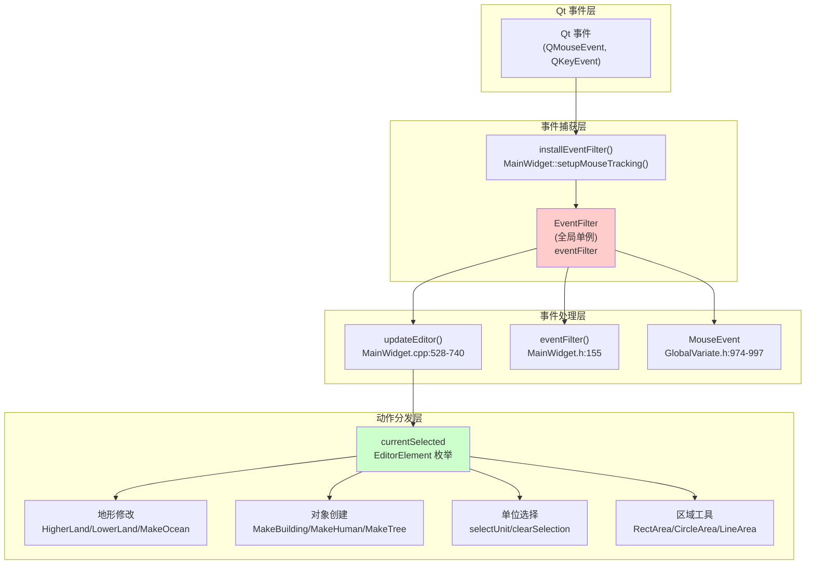

**来源：** [MainWidget.cpp:528-740](), [MainWidget.h:155](), [GlobalVariate.h:258](), [GlobalVariate.h:974-997]()

---

## 全局 EventFilter 系统

`EventFilter` 类是一个全局单例，用于捕获所有 Qt 事件，并为鼠标状态查询提供一个简单的轮询接口。

### EventFilter 接口

该过滤器暴露以下关键方法：

| 方法 | 返回类型 | 描述 |
|--------|-------------|-------------|
| `MouseX()` | int | 当前鼠标在全局坐标中的 X 位置 |
| `MouseY()` | int | 当前鼠标在全局坐标中的 Y 位置 |
| `LeftMousePress()` | bool | 如果当前左键处于按住状态，则为 True |
| `LeftMouseClicked()` | bool | 如果本帧左键被点击，则为 True |
| `RightMousePress()` | bool | 如果当前右键处于按住状态，则为 True |

全局实例声明为 `extern EventFilter *eventFilter`，并在主游戏循环开始前完成初始化。

### EventFilter 安装

该过滤器会在 `MainWidget` 初始化期间安装到 `GameWidget` 上：

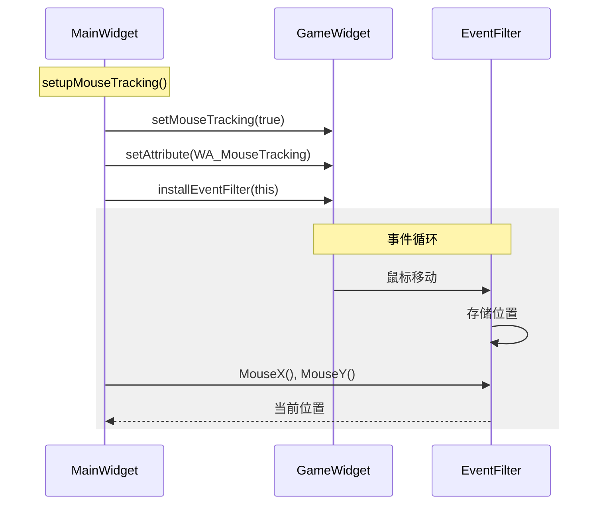

**来源：** [MainWidget.cpp:1440-1445](), [MainWidget.h:258](), [GlobalVariate.h:258]()

---

## 鼠标事件处理

鼠标事件通过两条主要路径处理：编辑器模式和游戏模式。

### 坐标变换

鼠标位置以 Qt 全局坐标捕获，并转换为游戏世界坐标：

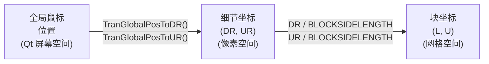

这些变换发生在 `updateEditor()` 函数中：

- 第 538 行：`double DR = ui->Game->TranGlobalPosToDR(eventFilter->MouseX(), eventFilter->MouseY())`
- 第 539 行：`double UR = ui->Game->TranGlobalPosToUR(eventFilter->MouseX(), eventFilter->MouseY())`
- 第 540 行：`int L = DR / BLOCKSIDELENGTH, U = UR / BLOCKSIDELENGTH`

### 鼠标状态查询

`updateEditor()` 函数会轮询 `EventFilter` 以确定鼠标状态：

| 检查项 | 行号 | 用途 |
|-------|------|---------|
| `eventFilter->LeftMousePress()` | 543 | 检测用于地形编辑的拖拽操作 |
| `eventFilter->LeftMouseClicked()` | 581 | 检测用于对象放置的单击 |
| 边界检查 `L < 0 \|\| L >= MAP_L \|\| U < 0 \|\| U >= MAP_U` | 541 | 确保鼠标位于地图边界内 |

**来源：** [MainWidget.cpp:538-541](), [MainWidget.cpp:543](), [MainWidget.cpp:581]()

---

## 编辑器模式事件处理

编辑器模式通过一个由 `currentSelected` 变量控制的状态机来处理鼠标事件，该变量保存 `EditorElement` 枚举值之一。

### EditorElement 状态机

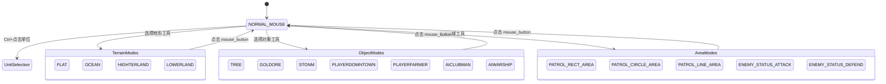

`EditorElement` 枚举定义了 50 多种可能的选择状态，包括地形类型、建筑类型、单位类型、资源类型和区域选择模式。

### 按状态分发事件

`updateEditor()` 函数包含两个主要的 switch 语句，根据 `currentSelected` 分发事件：

#### 拖拽操作（第 548-575 行）

当左键被按住时：

| 状态 | 动作函数 | 描述 |
|-------|----------------|-------------|
| `HIGHTERLAND` | `HigherLand()` | 在 3x3 区域中提升地形高度 |
| `LOWERLAND` | `LowerLand()` | 在 3x3 区域中降低地形高度 |
| `OCEAN` | `MakeOcean()` | 将地形转换为海洋 |
| `FLAT` | `MakeGrassland()` | 将地形转换为草地 |
| `DELETEOBJECT` | `clearArea()` | 删除区域内所有对象 |
| `NORMAL_MOUSE` | 无动作 | 防止误编辑 |

#### 点击操作（第 606-724 行）

当左键单击一次时：

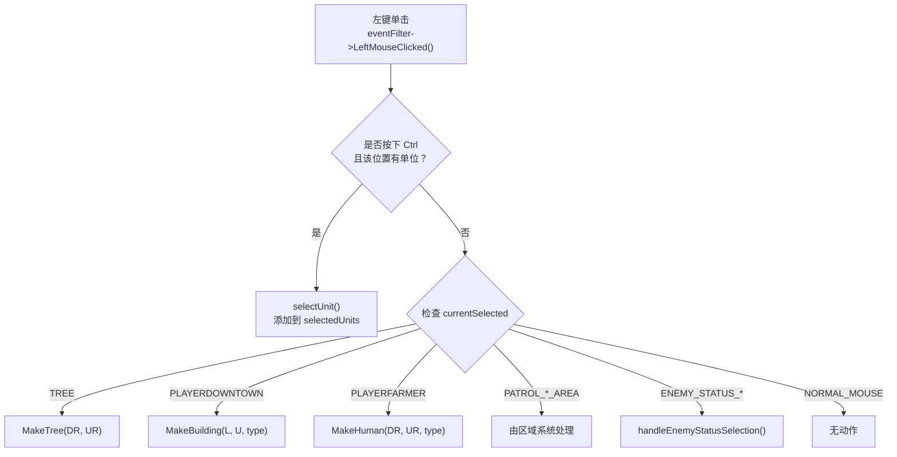

**来源：** [MainWidget.cpp:548-575](), [MainWidget.cpp:606-724](), [MainWidget.h:80-129]()

---

## 区域选择工具

游戏支持三种区域选择类型，用于定义巡逻区域和单位行为限制：

### 区域类型与类

| 区域类型 | 类 | 全局实例 | 用途 |
|-----------|-------|----------------|---------|
| 矩形 | `RectArea` | `g_rectArea` | 定义矩形巡逻/限制区域 |
| 圆形 | `CircleArea` | `g_circleArea` | 定义圆形巡逻/限制区域 |
| 自由曲线 | `LineArea` | `g_lineArea` | 定义曲线路径巡逻区域 |

全局实例声明于 [MainWidget.cpp:14-16]()：

```cpp
RectArea* g_rectArea = nullptr;
CircleArea* g_circleArea = nullptr;
LineArea* g_lineArea = nullptr;
```

### 区域绘制系统

当用户从编辑器 UI 中选择巡逻区域模式时，区域绘制系统会被激活。其工作方式如下：

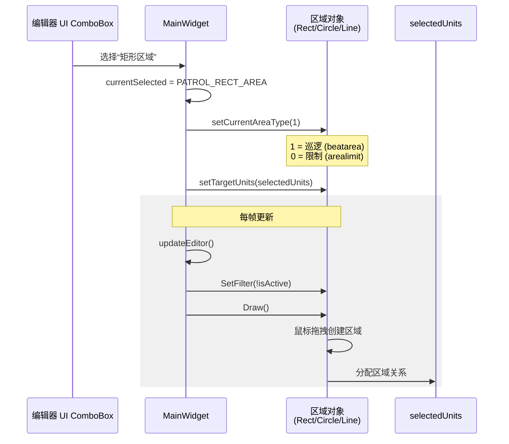

位于 [MainWidget.cpp:727-736]() 的激活逻辑会有条件地过滤并绘制每种区域类型：

```cpp
bool isRectAreaActive = (currentSelected == RECT_AREA || currentSelected == PATROL_RECT_AREA);
bool isCircleAreaActive = (currentSelected == CIRCLE_AREA || currentSelected == PATROL_CIRCLE_AREA);
bool isLineAreaActive = (currentSelected == LINE_AREA || currentSelected == PATROL_LINE_AREA);

rectArea->SetFilter(!isRectAreaActive);
rectArea->Draw();
circleArea->SetFilter(!isCircleAreaActive);
circleArea->Draw();
lineArea->SetFilter(!isLineAreaActive);
lineArea->Draw();
```

**来源：** [MainWidget.cpp:14-16](), [MainWidget.cpp:236-255](), [MainWidget.cpp:727-736]()

---

## 输入处理流水线

从硬件事件到游戏动作的完整输入处理流水线：

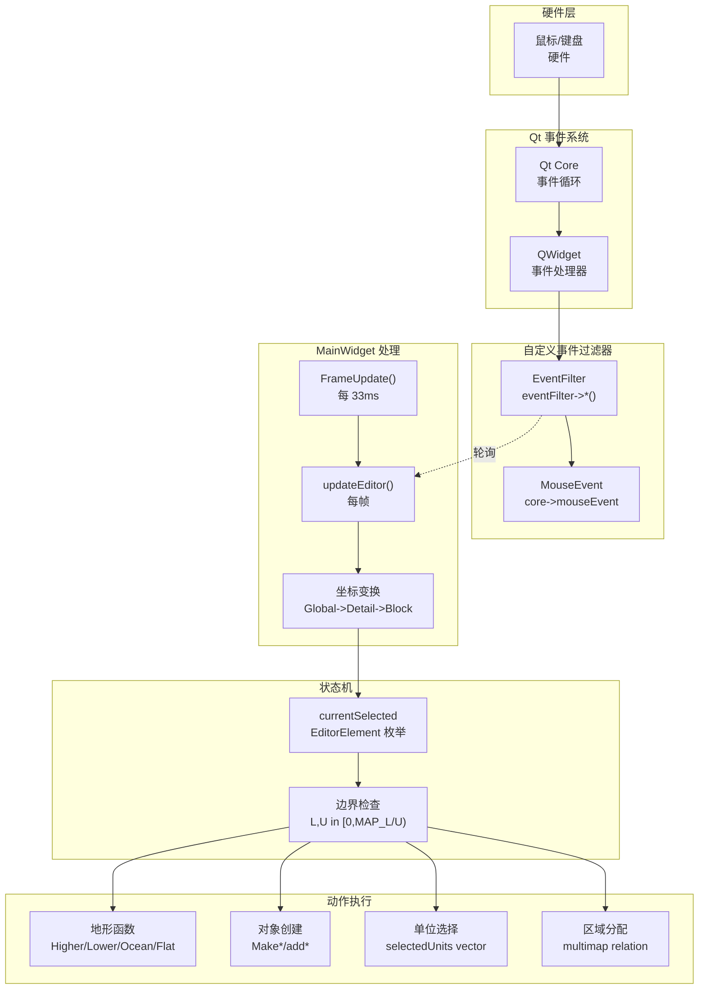

### 基于帧的处理

输入在 `FrameUpdate()` 槽函数中每个游戏帧处理一次，该槽由 `QTimer` 以 30 FPS（每 33ms 一次）触发：

1. 定时器触发 `FrameUpdate()` [MainWidget.cpp:1379]()
2. 如果处于编辑器模式：调用 `updateEditor()`
3. 从 `EventFilter` 轮询鼠标状态
4. 将坐标转换为游戏空间
5. 根据 `currentSelected` 状态分发动作
6. 更新并渲染游戏状态

**来源：** [MainWidget.cpp:1372-1380](), [MainWidget.cpp:528-740]()

---

## 单位选择系统

单位选择系统允许玩家在编辑器模式下选择敌方单位，以分配巡逻区域和行为状态。

### 选择状态管理

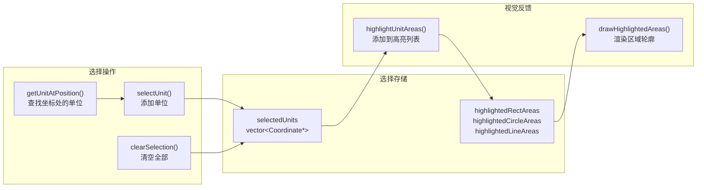

### 使用 Ctrl 键进行多选

该系统支持使用 Ctrl 修饰键进行多选 [MainWidget.cpp:586-597]()：

```cpp
bool isCtrlPressed = QApplication::keyboardModifiers() & Qt::ControlModifier;
Coordinate* clickedUnit = getUnitAtPosition(DR, UR);

if (clickedUnit && clickedUnit->getPlayerRepresent() == 1 && 
    (currentSelected == NORMAL_MOUSE || /* other valid states */)) {
    selectUnit(clickedUnit, isCtrlPressed);
    return;
}

if (!clickedUnit && !isCtrlPressed) {
    clearSelection();
}
```

**行为：**
- **不按 Ctrl 点击**：选择单个单位，并清除之前的选择
- **按住 Ctrl 点击**：将单位添加到现有选择中
- **不按 Ctrl 点击空白区域**：清除所有选择
- **按住 Ctrl 点击空白区域**：保持当前选择

### 选择限制

在编辑器模式下，只能选择敌方单位（玩家索引 1）。第 590 行的检查确保：

```cpp
if (clickedUnit && clickedUnit->getPlayerRepresent() == 1 && /* ... */) {
    selectUnit(clickedUnit, isCtrlPressed);
}
```

这使地图创建者能够为敌方单位分配 AI 行为，而不会影响玩家单位。

**来源：** [MainWidget.cpp:586-603](), [MainWidget.h:69-70](), [MainWidget.h:191-200]()

---

## 键盘修饰键

系统使用 Qt 的键盘修饰键检测来改变鼠标点击行为：

### 修饰键检测

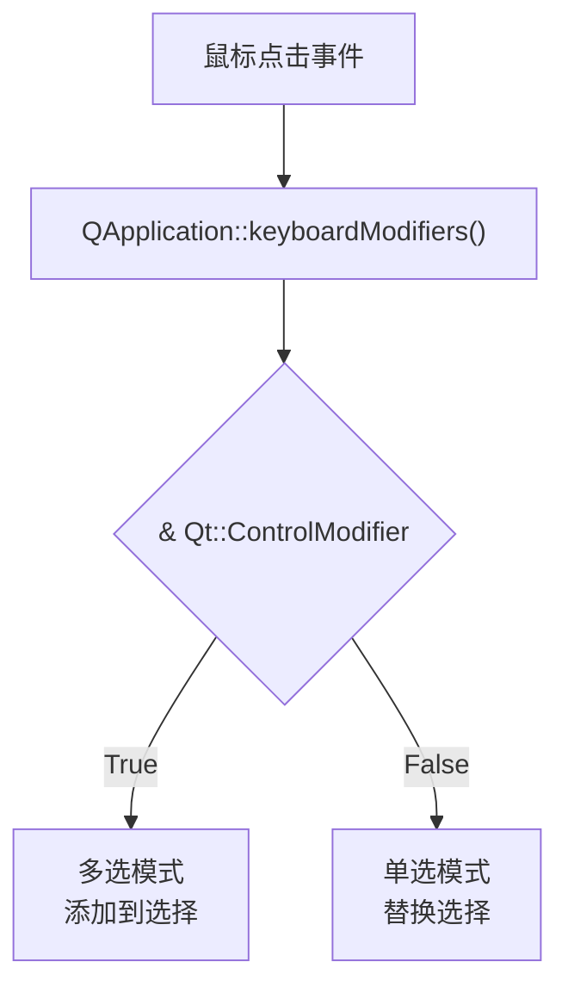

修饰键查询执行于 [MainWidget.cpp:586]()：

```cpp
bool isCtrlPressed = QApplication::keyboardModifiers() & Qt::ControlModifier;
```

Qt 的 `QApplication::keyboardModifiers()` 返回当前按下的修饰键位字段，然后与 `Qt::ControlModifier` 做掩码运算，以检测 Ctrl 键状态。

### 支持的修饰键

| 修饰键 | Qt 常量 | 当前用途 |
|----------|-------------|-------------|
| Ctrl | `Qt::ControlModifier` | 编辑器中的多单位选择 |
| Shift | `Qt::ShiftModifier` | *(当前未使用)* |
| Alt | `Qt::AltModifier` | *(当前未使用)* |

**来源：** [MainWidget.cpp:586]()

---

## 编辑器 UI 集成

编辑器 UI 通过在 `MainWidget` 构造期间建立的 Qt 信号/槽连接接入事件系统。

### ComboBox 信号连接

每个编辑器 UI 下拉框都会发出 `currentIndexChanged` 信号，用于设置 `currentSelected` 状态：

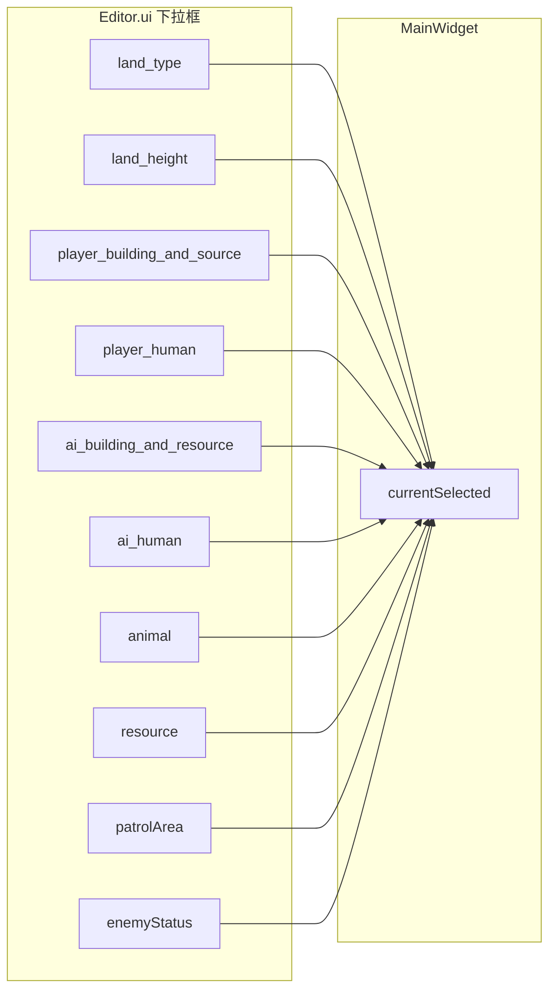

位于 [MainWidget.cpp:164-170]() 的连接示例：

```cpp
connect(editor->ui->land_type, QOverload<const QString&>::of(&QComboBox::currentIndexChanged), 
    this, [=](const QString& text) {
        if (text == "草地") this->currentSelected = FLAT;
        else if (text == "海洋") this->currentSelected = OCEAN;
        if (text != "地皮类型") call_debugText("green", " " + text, 0);
    });
```

### 模式重置按钮

`mouse_button` QPushButton 会将系统重置为普通鼠标模式 [MainWidget.cpp:271-274]()：

```cpp
connect(editor->ui->mouse_button, QPushButton::clicked, this, [=]() {
    this->currentSelected = NORMAL_MOUSE;
    call_debugText("green", " 普通鼠标模式", 0);
});
```

**来源：** [MainWidget.cpp:164-275]()

---

## 事件过滤与捕获

`MainWidget::eventFilter()` 重写会在事件到达子组件之前进行拦截：

### 事件过滤器重写

```cpp
bool MainWidget::eventFilter(QObject *watched, QEvent *event) {
    // 处理特定事件类型
    // 返回 true 以阻止传播，返回 false 以允许传播
}
```

该函数声明于 [MainWidget.h:155]()，并在初始化期间安装到多个组件上：

- `ui->Game->installEventFilter(this)` [MainWidget.cpp:1444]()
- `acts[i]->installEventFilter(this)` [MainWidget.cpp:1354]()，用于每个动作按钮

### 事件流控制

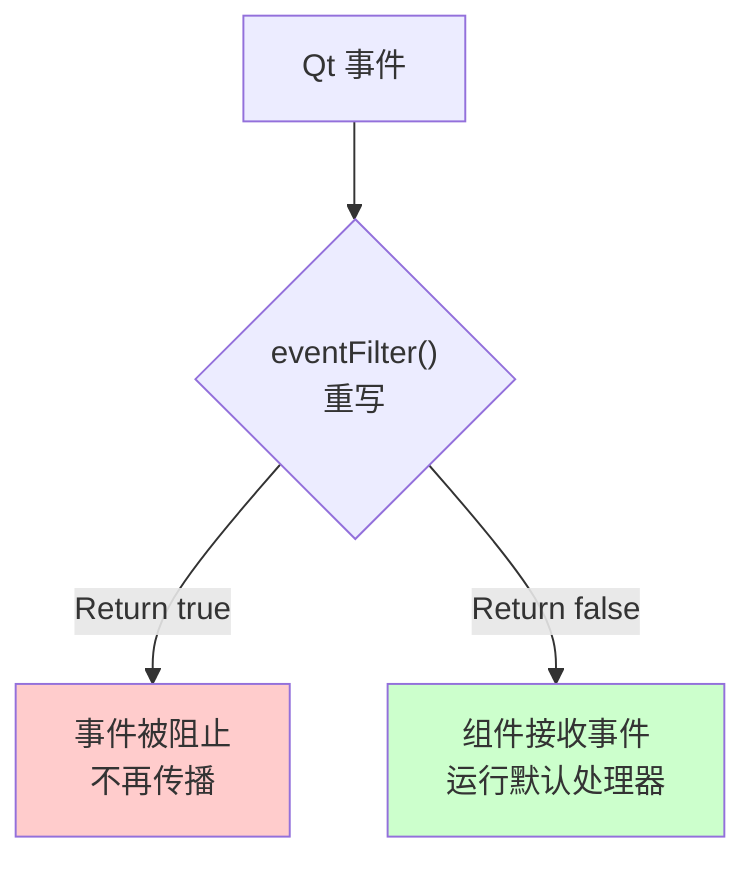

这使 `MainWidget` 能够在事件到达特定组件之前对其进行拦截并可能阻止，从而实现全局事件处理逻辑。

**来源：** [MainWidget.h:155](), [MainWidget.cpp:1354](), [MainWidget.cpp:1444]()

---

## 性能考量

### 事件轮询 vs 事件驱动

该系统使用的是**轮询模型**，而不是纯事件驱动模型：

**优点：**
- 可预测的帧时序（固定 30 FPS）
- 事件处理器之间无竞争条件
- 状态同步简单
- 与游戏循环范式一致

**权衡：**
- 33ms 输入延迟（一个帧的延迟）
- 即使空闲时也会持续轮询 CPU
- 鼠标位置是采样得到，而不是连续追踪

### 帧预算

在 33ms 帧时间下：
- 事件处理：约 2-5ms
- 坐标变换：<1ms
- 状态机分发：<1ms
- 动作执行：可变（地形修改约 5-20ms）

`updateEditor()` 函数必须在帧预算内完成，以维持 30 FPS。

**来源：** [MainWidget.cpp:1376]()

---

## 汇总表

| 组件 | 文件位置 | 关键函数 | 用途 |
|-----------|---------------|---------------|---------|
| EventFilter | GlobalVariate.h:258 | `MouseX()`, `MouseY()`, `LeftMousePress()`, `LeftMouseClicked()` | 全局鼠标状态捕获 |
| MainWidget::updateEditor | MainWidget.cpp:528-740 | 事件处理循环 | 将鼠标事件分发到各类动作 |
| MouseEvent | GlobalVariate.h:974-997 | `GetDR()`, `GetUR()`, `SetMouseEventType()` | 存储已处理的鼠标事件数据 |
| currentSelected | MainWidget.h:67 | EditorElement enum | 编辑器模式的状态机 |
| Area Selection | MainWidget.cpp:14-16 | `SetFilter()`, `Draw()`, `setTargetUnits()` | 绘制并分配巡逻/限制区域 |
| Unit Selection | MainWidget.h:70 | `selectUnit()`, `clearSelection()`, `getUnitAtPosition()` | 为编辑操作多选敌方单位 |