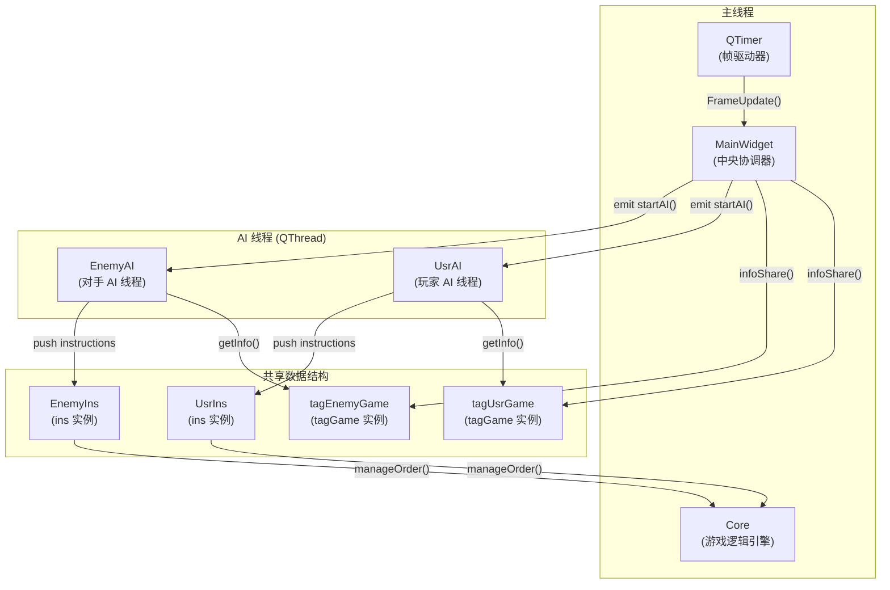
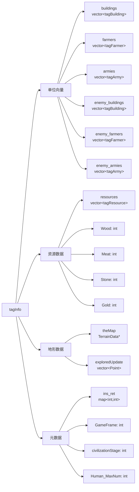
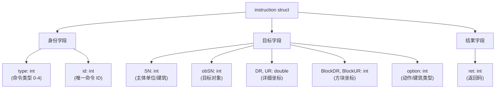
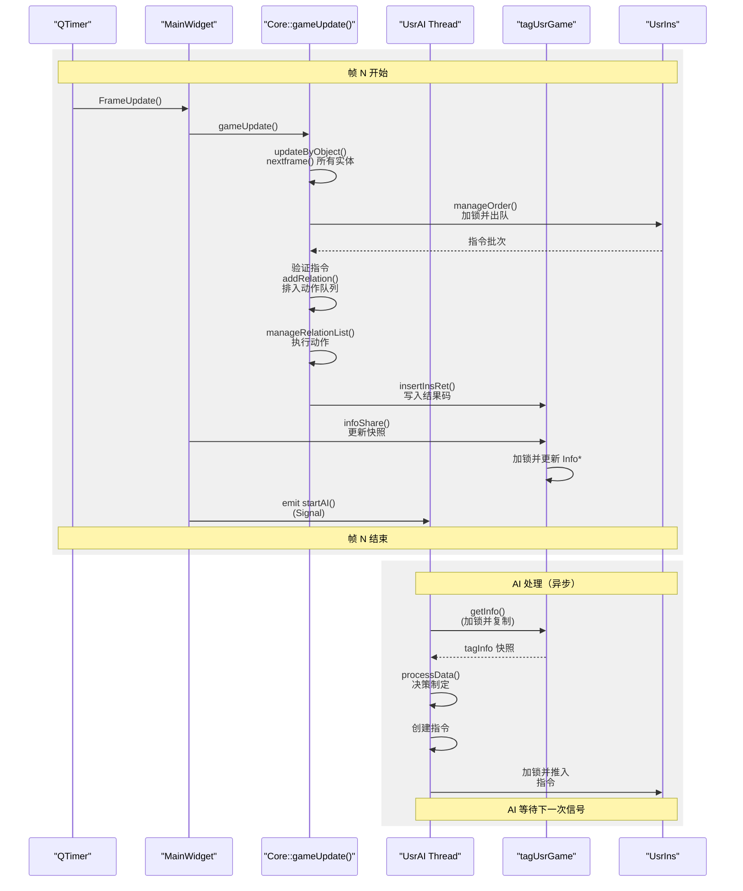

# AI 系统

<details>
<summary>相关源文件</summary>

以下文件被用作生成此 wiki 页面时的上下文：

- [GlobalVariate.h](GlobalVariate.h)
- [UsrAI.cpp](UsrAI.cpp)

</details>


## 目的与范围

本文档描述了 new-aoe 代码库中的人工智能架构，包括线程化的 AI 设计、命令处理和同步机制。AI 系统使计算机控制的玩家能够做出决策，并向其单位和建筑发出命令。

关于驱动 AI 执行的游戏循环和帧更新信息，请参见 [MainWidget and Game Loop](#2.1)。关于玩家使用的命令系统细节（其与 AI 命令共享结构），请参见 [SelectWidget and Command Panel](#4.1)。

**来源：** 高层图 5（AI 与指令系统）

---

## AI 架构概览

AI 系统采用线程化架构，其中 AI 玩家作为独立的 `QThread` 实例运行，与主游戏循环完全隔离。这种设计可防止 AI 计算阻塞渲染或输入处理，同时通过严格同步确保游戏状态完整性。

### 线程结构



**来源：** 高层图 5, [GlobalVariate.h:914-972](), [UsrAI.cpp:7-8]()

### AI 基类

| 类 | 类型 | 目的 | 关键方法 |
|-------|------|---------|-------------|
| `UsrAI` | `QThread` 子类 | 控制玩家（人类）一侧的 AI | `processData()` |
| `EnemyAI` | `QThread` 子类 | 控制对手 AI | `processData()` |
| AI Base | `QThread` | 通用基类（推测） | 线程生命周期管理 |

每个 AI 线程都有一个对应的全局实例：
- `tagUsrGame` - 玩家 AI 的游戏状态快照 [UsrAI.cpp:7]()
- `tagEnemyGame` - 敌方 AI 的游戏状态快照（推测为并行结构）
- `UsrIns` - 玩家 AI 的指令队列 [UsrAI.cpp:8]()
- `EnemyIns` - 敌方 AI 的指令队列（推测为并行结构）

**来源：** [UsrAI.cpp:7-8](), 高层图 5

---

## 游戏状态快照

AI 线程通过存储在 `tagGame` 实例中的不可变快照来读取游戏状态。这种架构通过确保 AI 只读数据、绝不直接写入游戏对象，来避免竞争条件。

### tagInfo 结构

`tagInfo` 结构体包含 AI 玩家可见的全部信息：



**来源：** [GlobalVariate.h:847-910]()

### Tag 结构详情

| 结构 | 继承自 | 关键字段 | 目的 |
|-----------|----------|------------|---------|
| `tagObj` | - | `SN`, `BlockDR`, `BlockUR` | 带有序列号和位置的基础对象 [GlobalVariate.h:672-678]() |
| `tagBuilding` | `tagObj` | `Type`, `Blood`, `MaxBlood`, `Percent`, `Project`, `ProjectPercent`, `Cnt` | 建筑状态 [GlobalVariate.h:679-694]() |
| `tagResource` | `tagObj` | `DR`, `UR`, `Type`, `ProductSort`, `Cnt`, `Blood` | 资源节点状态 [GlobalVariate.h:696-703]() |
| `tagHuman` | `tagObj` | `DR`, `UR`, `DR0`, `UR0`, `NowState`, `WorkObjectSN`, `Blood`, `attack`, `rangedDefense`, `meleeDefense` | 基础人类单位 [GlobalVariate.h:705-727]() |
| `tagFarmer` | `tagHuman` | `ResourceSort`, `Resource`, `FarmerSort` | 农民专属数据 [GlobalVariate.h:729-740]() |
| `tagArmy` | `tagHuman` | `Sort`, `status`, 时间相关字段, 攻击标志 | 军事单位数据 [GlobalVariate.h:742-759]() |

**来源：** [GlobalVariate.h:672-759]()

### tagGame 包装器

`tagGame` 类使用线程安全访问封装了 `tagInfo`：

```cpp
// 线程安全的游戏状态包装器
struct tagGame {
private:
    tagInfo* Info;
    QMutex Locker;
public:
    void update(tagInfo* newinfo);  // MainWidget 每帧更新快照
    tagInfo getInfo();              // AI 在互斥锁保护下读取快照
    void insertInsRet(int id, instruction ins);  // Core 写入结果码
    void clearInsRet();
};
```

关键方法：
- `update()` - MainWidget 调用此方法提供新快照 [GlobalVariate.h:931-959]()
- `getInfo()` - AI 调用此方法，在互斥锁保护下读取当前状态 [GlobalVariate.h:964-967]()
- `insertInsRet()` - Core 写入指令结果 [GlobalVariate.h:960-963]()
- `WLHHunYao()` - 打乱向量顺序以防止被利用 [GlobalVariate.h:921-930]()

**来源：** [GlobalVariate.h:914-972]()

### 战争迷雾与信息隐藏

敌方数据通过 `toEnemy()` 方法进行过滤，以隐藏私有信息：

| 方法 | 结构 | 隐藏字段 |
|--------|-----------|---------------|
| `tagBuilding::toEnemy()` | `tagBuilding` | `Cnt`, `Project`, `ProjectPercent` [GlobalVariate.h:688-693]() |
| `tagFarmer::toEnemy()` | `tagFarmer` | `Resource`, `DR0`, `UR0` [GlobalVariate.h:734-739]() |
| `tagArmy::toEnemy()` | `tagArmy` | `DR0`, `UR0` [GlobalVariate.h:754-758]() |

这确保 AI 只能看到通过战争迷雾可见的信息。

**来源：** [GlobalVariate.h:688-693](), [GlobalVariate.h:734-739](), [GlobalVariate.h:754-758]()

---

## 指令与命令系统

AI 通过创建 `instruction` 结构体并将其推入线程安全队列来发出命令。Core 在其更新周期中处理这些指令。

### 指令结构

`instruction` 结构体定义了一条单独命令：



**来源：** [GlobalVariate.h:765-791]()

### 命令类型

| 类型 | 目的 | 必需参数 | 构造函数 |
|------|---------|---------------------|--------------|
| 0 | 停止单位动作 | `SN` | `instruction(int type, int SN, int option)` |
| 1 | 将单位移动到坐标 | `SN`, `DR`, `UR` | `instruction(int type, int SN, double DR, double UR)` |
| 2 | 为农民设置工作对象 | `SN`, `obSN` | `instruction(int type, int SN, int obSN, bool twoCoordinate)` |
| 3 | 建造建筑 | `SN`, `BlockDR`, `BlockUR`, `option` | `instruction(int type, int SN, int BlockDR, int BlockUR, int option)` |
| 4 | 建筑动作 | `SN`, `option` | `instruction(int type, int SN, int option)` |

注释中的详细说明 [GlobalVariate.h:768-773]()：
- **Type 0**：终止单位 `self` 的动作
- **Type 1**：命令农民 `self` 移动到坐标 `L0`, `U0`
- **Type 2**：将对象 `obj` 设置为农民 `self` 的工作目标；农民会自动移动并工作
- **Type 3**：命令农民 `self` 在方块坐标 `BlockL`, `BlockU` 处建造类型为 `option` 的建筑
- **Type 4**：向建筑 `self` 发出命令 `option`

**来源：** [GlobalVariate.h:765-791](), 高层图 5

### 封装的 AI 函数

代码库提供了封装指令创建的高层函数（见高层图 5）：

| 函数 | 指令类型 | 目的 |
|----------|------------------|---------|
| `HumanMove` | Type 1 | 移动单位到位置 |
| `HumanBuild` | Type 3 | 建造建筑 |
| `HumanAction` | Type 0/2 | 单位动作（停止、工作） |
| `BuildingAction` | Type 4 | 建筑命令（训练、研究） |
| `PinPointStrike` | Special | 定点攻击命令 |

来自 [UsrAI.cpp:32]() 的示例用法：
```cpp
PinPointStrike(f.SN, f.DR - 32.0 * 8, f.UR);
```

**来源：** 高层图 5, [UsrAI.cpp:32]()

### 线程安全的指令队列

`ins` 结构体提供线程安全的排队机制：

```cpp
struct ins {
    int g_id = 0;                        // 全局指令 ID 计数器
    std::queue<instruction> instructions; // 命令的 FIFO 队列
    QMutex lock;                         // 用于线程安全的互斥锁
};
```

**工作流程：**
1. AI 线程创建 `instruction` 对象
2. AI 锁定 `ins.lock` 互斥锁
3. AI 将指令推入 `ins.instructions` 队列
4. AI 递增 `ins.g_id` 以跟踪唯一命令
5. AI 解锁互斥锁
6. MainWidget 的 `manageOrder()` 出队并处理指令

**来源：** [GlobalVariate.h:793-797](), 高层图 5

---

## AI-Core 同步

该系统使用生产者-消费者模式：AI 线程生成指令，Core 在游戏循环中同步消费这些指令。

### 同步流程



**来源：** 高层图 2, 高层图 5

### 关键同步点

1. **读取阶段**：AI 调用 `tagGame::getInfo()`，在互斥锁保护下读取快照 [GlobalVariate.h:964-967]()
2. **写入阶段**：AI 使用互斥锁将指令推入 `ins` 队列 [GlobalVariate.h:796]()
3. **处理阶段**：Core 的 `manageOrder()` 在游戏更新期间出队指令
4. **反馈阶段**：Core 通过 `insertInsRet()` 将结果写入 `ins_ret` 映射 [GlobalVariate.h:960-963]()

这种设计保证：
- AI 永远不会直接修改游戏状态
- 所有命令都以确定性顺序执行
- 线程之间不存在竞争条件
- AI 可以执行复杂计算而不会阻塞渲染

**来源：** [GlobalVariate.h:793-797](), [GlobalVariate.h:914-972](), 高层图 2

---

## 结果反馈与错误处理

Core 通过存储在 `tagInfo` 中 `ins_ret` 映射内的返回码，为每条指令提供反馈。

### 返回码

| 代码 | 含义 | 描述 |
|------|---------|-------------|
| 0 | 成功 | 指令执行成功 |
| -1 | 未找到 SN | 具有给定 `SN` 的主体单位/建筑不存在 |
| -2 | 未找到动作 | 该对象不可执行请求的动作 |
| -3 | 越界 | 坐标超出有效地图范围 |
| -4 | 未找到目标 | 具有 `obSN` 的目标对象不存在 |
| -5 | 建筑无效 | 建筑类型无效或尚未解锁 |
| -6 | 资源不足 | 玩家缺少所需资源 |

**来源：** [GlobalVariate.h:1291-1299]()

### 反馈机制

`tagInfo` 中的 `ins_ret` 映射存储指令结果：

```cpp
map<int, int> ins_ret;  // map<instruction_id, return_code>
```

**工作流程：**
1. Core 从队列中处理指令
2. Core 验证指令并在有效时执行
3. Core 调用 `tagGame::insertInsRet(id, instruction)` 存储结果 [GlobalVariate.h:960-963]()
4. 在下一帧中，`infoShare()` 会在快照中包含更新后的 `ins_ret`
5. AI 在下一次 `getInfo()` 调用中读取 `ins_ret`
6. AI 可以检查 `info.ins_ret[command_id]` 以验证是否成功

`tagGame::update()` 方法会通过删除最旧结果，将 `ins_ret` 的大小控制在 100 条以下 [GlobalVariate.h:933-937]()，从而防止内存无限增长。

**来源：** [GlobalVariate.h:857](), [GlobalVariate.h:933-937](), [GlobalVariate.h:960-963](), 高层图 5

---

## AI 实现示例

`UsrAI` 类展示了基础 AI 实现模式：

### 基本结构

```cpp
void UsrAI::processData() {
    cheatAction();          // 用于 AI 开发的辅助函数
    
    auto info = getInfo();  // 获取当前游戏状态快照
    
    // 决策逻辑
    for (auto x : info.armies) {
        if (x.Sort == AT_STONE_THROWER) {
            // 找到投石兵单位
            if (/* condition */) {
                // 发出攻击命令
                PinPointStrike(x.SN, x.DR - 32.0 * 8, x.UR);
            }
        }
    }
}
```

### AI 处理模式

1. **状态读取**：调用 `getInfo()` 获取 `tagInfo` 快照 [UsrAI.cpp:21]()
2. **分析**：遍历可用的单位/建筑 [UsrAI.cpp:24-35]()
3. **决策制定**：应用逻辑来确定动作
4. **发出命令**：调用封装函数或手动创建指令
5. **状态跟踪**：使用静态变量在多次调用之间维护 AI 状态 [UsrAI.cpp:22-23]()

**来源：** [UsrAI.cpp:12-36]()

### 开发辅助工具

AI 系统包含开发工具：
- `cheatAction()` - 测试函数 [UsrAI.cpp:15]()
- `cheatRes()` - 用于测试的资源操作 [UsrAI.cpp:16-19]()
- `is_cheatAction` - 启用作弊功能的全局标志 [GlobalVariate.h:299]()

**来源：** [UsrAI.cpp:15-19](), [GlobalVariate.h:299]()

---

## 全局变量与标志

AI 系统使用若干全局变量进行状态管理：

| 变量 | 类型 | 目的 | 文件 |
|----------|------|---------|------|
| `AIfinished` | `bool` | 表示 AI 处理已完成 | [GlobalVariate.h:510]() |
| `INSfinshed` | `bool` | 表示指令处理已完成 | [GlobalVariate.h:511]() |
| `tagUsrGame` | `tagGame` | 玩家 AI 游戏状态 | [UsrAI.cpp:7]() |
| `tagEnemyGame` | `tagGame` | 敌方 AI 游戏状态（推测） | - |
| `UsrIns` | `ins` | 玩家 AI 指令队列 | [UsrAI.cpp:8]() |
| `EnemyIns` | `ins` | 敌方 AI 指令队列（推测） | - |
| `IsExamining` | `bool` | 考试/评估模式标志 | [GlobalVariate.h:501]() |

**来源：** [GlobalVariate.h:501](), [GlobalVariate.h:510-511](), [UsrAI.cpp:7-8]()

---

## 与其他系统的集成

AI 系统与多个子系统交互：

### MainWidget 集成
- MainWidget 协调 AI 线程生命周期
- 每帧发出 `startAI()` 信号以触发 AI 处理
- 调用 `infoShare()` 更新 `tagGame` 快照
- 通过 Core 管理 `ins` 队列处理

**参见：** [MainWidget and Game Loop](#2.1)

### Core 引擎集成
- Core 的 `manageOrder()` 对指令出队并验证
- Core 的 `addRelation()` 将指令转换为 relation
- relation 通过 `manageRelationList()` 在多个帧中执行

**参见：** [Game Core Engine](#2.2)

### 开发系统集成
- AI 通过 `tagInfo::civilizationStage` 查询科技树
- AI 在发出建造/训练命令前检查资源可用性
- 科技解锁会影响 `ins_ret` 返回码（例如，锁定建筑时返回 -5）

**参见：** [Technology Tree](#3.2)

**来源：** 高层图 1, 高层图 2, 高层图 5