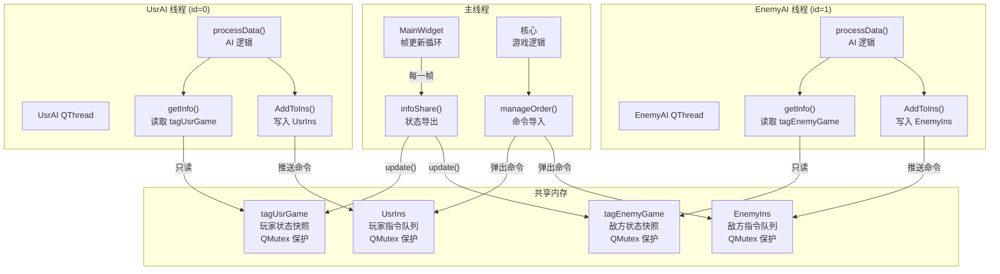
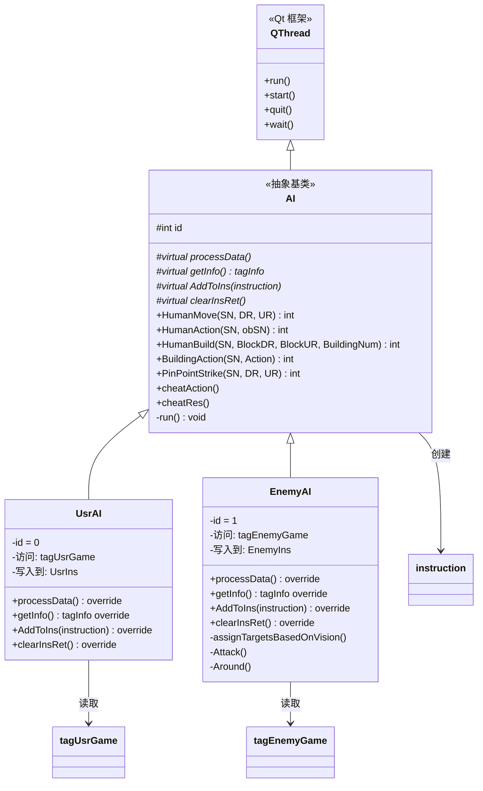
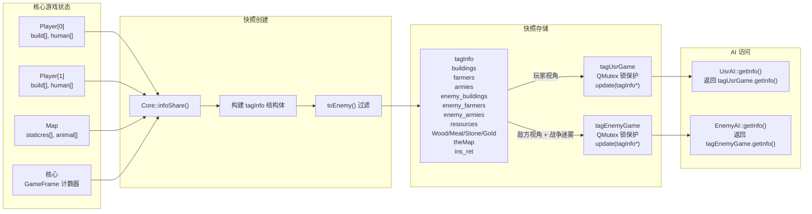
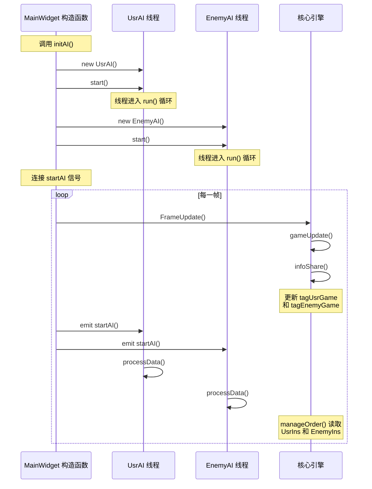
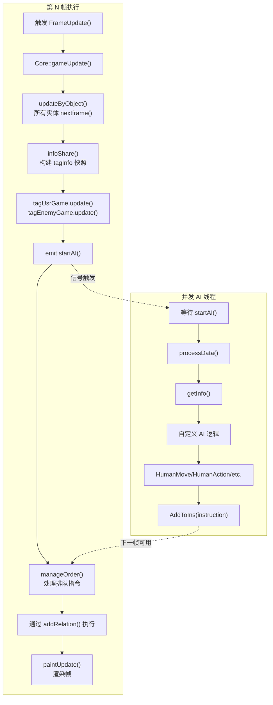

# AI 架构

<details>
<summary>相关源文件</summary>

以下文件被用作生成此 wiki 页面时的上下文：

- [GlobalVariate.h](GlobalVariate.h)
- [MainWidget.cpp](MainWidget.cpp)
- [README.md](README.md)
- [UsrAI.cpp](UsrAI.cpp)

</details>


## 目的与范围

本文档描述了游戏中支持玩家与对手自主行为的线程化 AI 架构。该架构采用生产者-消费者模式，AI 线程异步运行，读取游戏状态快照，并将命令加入队列，由游戏核心同步处理。

关于命令结构和指令处理的详细信息，请参见[指令与命令系统](#5.2)。关于游戏循环集成，请参见[MainWidget 与游戏循环](#2.1)。关于 AI 编程指导，请参考外部文档 `AI接口使用指南.md`。

---

## 线程架构概览

AI 系统使用**独立的 QThread 实例**，以防止 AI 计算阻塞主游戏循环。每个 AI 都独立运行，并通过线程安全的共享内存结构与游戏核心通信。



**关键设计原则：**

| 原则 | 实现方式 | 收益 |
|-----------|----------------|---------|
| **线程分离** | AI 在独立的 QThread 中运行 | 不会阻塞主游戏循环 |
| **只读快照** | AI 从 `tagGame::getInfo()` 读取 | 避免游戏状态竞争条件 |
| **只写队列** | AI 写入 `ins` 队列 | 线程安全的命令提交 |
| **互斥锁保护** | 所有共享结构都使用 `QMutex` | 安全的并发访问 |
| **单向数据流** | 状态从 Main→AI，命令从 AI→Main | 清晰的所有权模型 |

来源：[MainWidget.cpp:124-125]()、[GlobalVariate.h:793-797]()、[GlobalVariate.h:914-972]()、README.md 的 AI 系统章节

---

## AI 类层次结构

AI 系统遵循继承结构，其中 `AI` 提供线程基础设施和命令接口，而 `UsrAI` 与 `EnemyAI` 实现玩家特定逻辑。



**类职责：**

| 类 | 文件 | 职责 |
|-------|------|----------------|
| `AI` | `AI.h`, `AI.cpp` | 提供 QThread 基础设施，实现命令接口方法（`HumanMove`、`HumanAction` 等），运行 `processData()` 循环 |
| `UsrAI` | `UsrAI.h`, `UsrAI.cpp` | 玩家 AI（id=0），从 `tagUsrGame` 读取，写入 `UsrIns`，适合学生实现逻辑 |
| `EnemyAI` | `EnemyAI.h`, `EnemyAI.cpp` | 对手 AI（id=1），从 `tagEnemyGame` 读取，写入 `EnemyIns`，内置策略 |

**纯虚方法（必须实现）：**

```cpp
// From AI base class - must be overridden by UsrAI/EnemyAI
virtual void processData() = 0;           // Main AI logic loop
virtual tagInfo getInfo() = 0;            // Access player-specific snapshot
virtual void AddToIns(instruction ins) = 0; // Push to player-specific queue
virtual void clearInsRet() = 0;           // Clear instruction return values
```

来源：README.md 的玩家与 AI 系统章节、[GlobalVariate.h:765-791]()（instruction 结构体）、[UsrAI.cpp:1-36]()

---

## 状态快照系统

游戏状态会在每一帧复制到 AI 可访问的结构中，从而在 AI 计算期间提供一致视图，而无需加锁。



**tagInfo 结构字段：**

| 字段类别 | 字段 | 描述 |
|----------------|--------|-------------|
| **己方单位** | `farmers[]`, `armies[]` | 玩家自己的农民和军事单位 |
| **己方建筑** | `buildings[]` | 包含完整信息的玩家建筑 |
| **敌方单位** | `enemy_farmers[]`, `enemy_armies[]` | 敌方单位（经过战争迷雾过滤） |
| **敌方建筑** | `enemy_buildings[]` | 敌方建筑（经过战争迷雾过滤） |
| **资源** | `resources[]` | 地图上的全部资源（树木、金矿等） |
| **地形** | `theMap` | 指向地形网格的指针（const） |
| **经济** | `Wood`, `Meat`, `Stone`, `Gold` | 当前资源数量 |
| **元信息** | `GameFrame`, `civilizationStage`, `Human_MaxNum` | 游戏状态元数据 |
| **反馈** | `ins_ret` | 指令 ID → 返回码 的映射 |
| **探索** | `exploredUpdate[]` | 本帧新探索到的区域 |

**战争迷雾过滤：**

敌方数据使用 `toEnemy()` 方法隐藏敏感信息：

```cpp
// From tagBuilding, tagFarmer, tagArmy in GlobalVariate.h
tagBuilding toEnemy() {
    this->Cnt = -1;              // Hide resource count
    this->Project = -1;          // Hide production queue
    this->ProjectPercent = -1;   // Hide progress
    return *this;
}

tagFarmer toEnemy() {
    Resource = -1;    // Hide carried resources
    DR0 = -1.0;       // Hide destination
    UR0 = -1.0;
    return *this;
}
```

来源：[GlobalVariate.h:672-759]()（tagObj、tagBuilding、tagResource、tagHuman、tagFarmer、tagArmy）、[GlobalVariate.h:847-910]()（tagInfo）、[GlobalVariate.h:914-972]()（tagGame）

---

## 线程生命周期与同步

### 初始化流程



**初始化代码路径：**

```cpp
// MainWidget::initAI() - called in constructor
void MainWidget::initAI() {
    usrAI = new UsrAI();
    usrAI->start();              // Starts QThread
    
    enemyAI = new EnemyAI();
    enemyAI->start();            // Starts QThread
    
    // Signal connects AI to frame updates
    connect(this, &MainWidget::startAI, usrAI, &AI::processDataSlot);
    connect(this, &MainWidget::startAI, enemyAI, &AI::processDataSlot);
}
```

来源：[MainWidget.cpp:124-125]()（initAI 调用）

### 线程同步机制

系统使用三种同步原语来确保线程安全：

| 机制 | 结构 | 目的 |
|-----------|-----------|---------|
| **tagGame 中的 QMutex** | `tagGame::Locker` | 保护 `getInfo()` 期间对 `tagInfo*` 的读取，以及 `update()` 期间的写入 |
| **ins 中的 QMutex** | `ins::lock` | 保护指令队列在 push（AI）和 pop（Core）期间的访问 |
| **ins_ret 中的 QMutex** | 通过 `tagGame::Locker` | 在插入结果和读取反馈时保护返回值映射 |

**互斥锁使用模式：**

```cpp
// tagGame::getInfo() - Thread-safe read
tagInfo tagGame::getInfo() {
    QMutexLocker locker(&Locker);  // Auto-locks on entry
    return *Info;                   // Returns copy
}                                   // Auto-unlocks on exit

// tagGame::update() - Thread-safe write  
void tagGame::update(tagInfo* newinfo) {
    QMutexLocker locker(&Locker);
    // Preserve ins_ret across updates
    if (this->Info != NULL)
        newinfo->ins_ret = this->Info->ins_ret;
    Info = newinfo;
}

// ins queue - Thread-safe command push/pop
struct ins {
    std::queue<instruction> instructions;
    QMutex lock;
    // AI: lock.lock(); instructions.push(cmd); lock.unlock();
    // Core: lock.lock(); cmd = instructions.front(); instructions.pop(); lock.unlock();
};
```

来源：[GlobalVariate.h:793-797]()（ins 结构体）、[GlobalVariate.h:914-972]()（tagGame）

---

## AI 与核心的集成

AI 线程通过信号发射和指令处理与主游戏循环集成。



**帧时序注意事项：**

| 时序方面 | 行为 |
|---------------|----------|
| **AI 执行** | 异步，可能耗时超过一帧 |
| **状态快照** | AI 在第 N 帧读取时，总是来自上一帧（N-1） |
| **命令可用性** | 在第 N 帧入队的命令会在第 N+1 帧或更晚处理 |
| **ins_ret 更新** | 执行后将返回码写入 `tagInfo.ins_ret`，在下一次 `getInfo()` 中可见 |
| **无阻塞** | 游戏循环永远不会等待 AI 完成 |

**命令流示例：**

```
第 100 帧：AI 读取状态 → 决定移动单位 SN=5
           AI 调用 HumanMove(5, 100.0, 200.0)
           指令以 id=123 加入队列

第 101 帧：Core 的 manageOrder() 弹出指令
           验证单位存在且位置有效
           调用 addRelation() 开始移动
           设置 ins_ret[123] = 0（成功）

第 102 帧：AI 调用 getInfo() 读取状态，看到 ins_ret[123] = 0
           知道移动命令已被接受
```

来源：README.md 图 2（数据流与更新周期）、[GlobalVariate.h:765-791]()（instruction 结构体注释）

---

## 实现自定义 AI 逻辑

自定义 AI 的主要扩展点是 `UsrAI` 或 `EnemyAI` 中的 `processData()` 方法。

### 基本实现模式

```cpp
// UsrAI::processData() - main AI loop
void UsrAI::processData() {
    // 1. Get current game state snapshot
    auto info = getInfo();
    
    // 2. Implement decision logic using state
    for (auto& farmer : info.farmers) {
        if (farmer.NowState == HUMAN_STATE_IDLE) {
            // Find nearest tree
            for (auto& res : info.resources) {
                if (res.Type == RESOURCE_TREE) {
                    // Command farmer to gather
                    HumanAction(farmer.SN, res.SN);
                    break;
                }
            }
        }
    }
    
    // 3. Check instruction return codes
    for (auto& [id, ret] : info.ins_ret) {
        if (ret != 0) {
            // Handle failed commands
            // ret codes: -1=SN not found, -2=action invalid, 
            //           -3=out of bounds, -4=target not found,
            //           -5=building invalid, -6=insufficient resources
        }
    }
}
```

### 可用命令方法

所有命令方法都在 `AI` 基类中实现，并返回一个指令 ID：

| 方法 | 签名 | 用途 |
|--------|-----------|---------|
| `HumanMove` | `int HumanMove(int SN, double DR, double UR)` | 将单位移动到坐标 |
| `HumanAction` | `int HumanAction(int SN, int obSN)` | 攻击/采集目标对象 |
| `HumanBuild` | `int HumanBuild(int SN, int BlockDR, int BlockUR, int BuildingNum)` | 在地块上建造建筑 |
| `BuildingAction` | `int BuildingAction(int SN, int Action)` | 训练单位或研究科技 |
| `PinPointStrike` | `int PinPointStrike(int SN, double DR, double UR)` | 投石车地面打击 |

**返回值用法：**

```cpp
int id = HumanMove(farmerSN, targetDR, targetUR);
// Store id to check result in future frames

// Later, in subsequent processData() call:
auto info = getInfo();
if (info.ins_ret.count(id)) {
    int result = info.ins_ret[id];
    if (result == 0) {
        // Command succeeded
    } else {
        // Command failed, see error code
    }
}
```

### Cheat 函数

为调试和测试，AI 提供了作弊函数（仅在启用时生效）：

| 函数 | 效果 |
|----------|--------|
| `cheatAction()` | 显示所有敌方动作 |
| `cheatRes()` | 给予额外资源 |

来源：[UsrAI.cpp:1-36]()、[GlobalVariate.h:765-791]()（instruction 结构体与返回码）

---

## 最佳实践与注意事项

### 性能指南

| 指南 | 理由 |
|-----------|-----------|
| **保持 processData() 足够快** | 计算过长会延迟命令发出；目标应小于 16ms |
| **缓存高开销查询** | 不要每一帧都重复计算距离/路径 |
| **批量发送相似命令** | 对相关动作分组，减少队列操作 |
| **定期检查 ins_ret** | 不必每一帧都检查；每 5 到 10 帧检查一次即可 |
| **限制命令速率** | 避免每帧发出 100 条以上命令 |

### 线程安全规则

| 规则 | 原因 |
|------|--------|
| **不要修改 getInfo() 的结果** | 它是一个副本，修改不会产生效果 |
| **只使用提供的命令方法** | 直接访问队列会绕过同步机制 |
| **不要保存来自 tagInfo 的指针** | 帧更新后这些指针会失效 |
| **不要直接访问 Core/Player** | 这不是线程安全的；只能使用快照 |

### 常见模式

**状态机示例：**

```cpp
enum AIState { GATHER_RESOURCES, BUILD_BASE, TRAIN_ARMY, ATTACK };
AIState currentState = GATHER_RESOURCES;

void UsrAI::processData() {
    auto info = getInfo();
    
    switch(currentState) {
        case GATHER_RESOURCES:
            if (info.Wood >= 500 && info.Meat >= 300) {
                currentState = BUILD_BASE;
            }
            manageFarmers(info);
            break;
            
        case BUILD_BASE:
            if (info.buildings.size() >= 5) {
                currentState = TRAIN_ARMY;
            }
            buildStructures(info);
            break;
            
        // ... etc
    }
}
```

来源：[UsrAI.cpp:12-36]()（processData 实现示例）

---

## 总结

AI 架构提供了：

- **线程隔离**：通过 QThread 实现无阻塞的自主行为
- **安全的状态访问**：通过带有战争迷雾过滤的只读快照实现  
- **命令接口**：提供五个核心方法以覆盖所有游戏动作
- **反馈机制**：通过 `ins_ret` 进行命令校验
- **扩展点**：在 `processData()` 中编写自定义逻辑

关于命令结构细节和指令处理，请参见[指令与命令系统](#5.2)。关于状态结构字段参考，请参见[游戏状态结构](#8.1)。