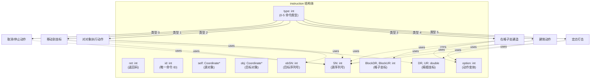
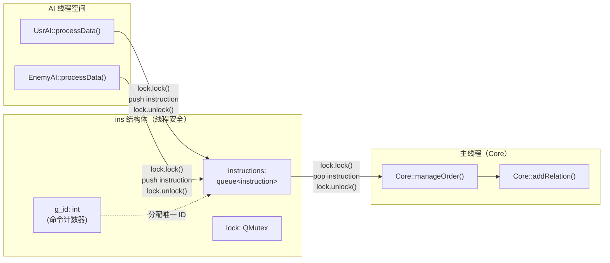
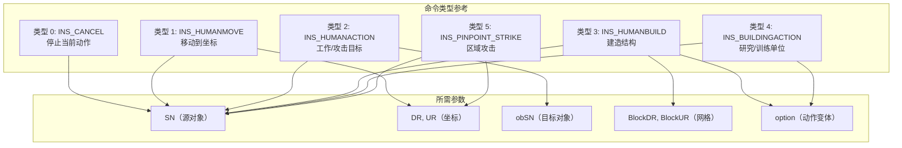
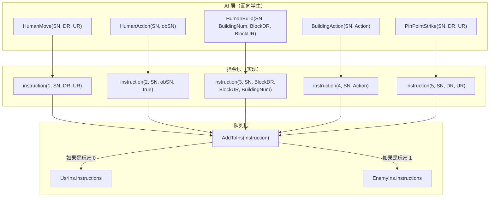
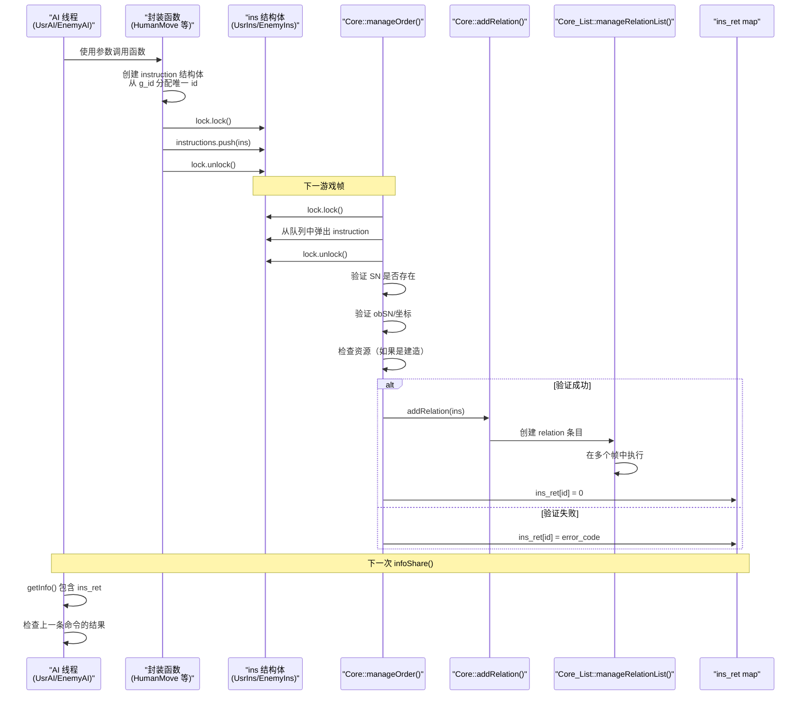
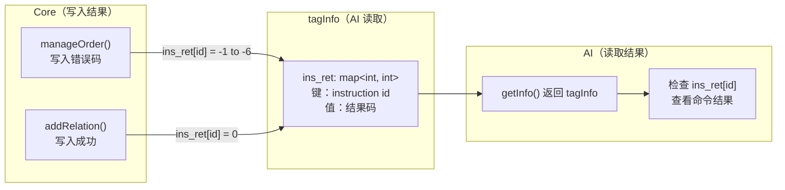
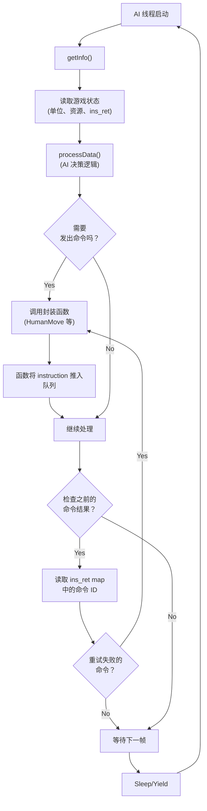
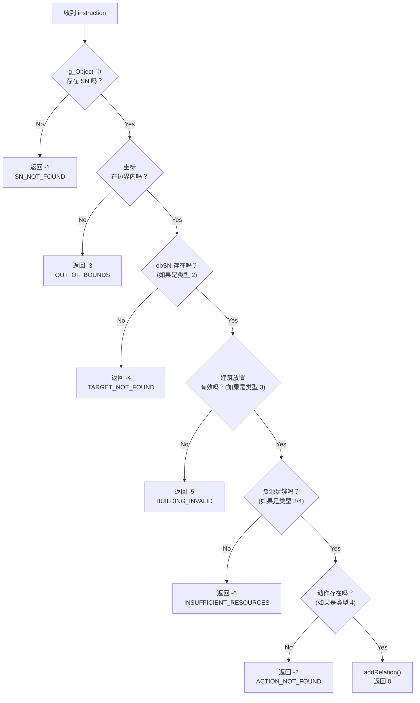

# 指令与命令系统

<details>
<summary>相关源文件</summary>

以下文件被用作生成此 wiki 页面时的上下文：

- [GlobalVariate.h](GlobalVariate.h)
- [MainWidget.cpp](MainWidget.cpp)
- [README.md](README.md)
- [UsrAI.cpp](UsrAI.cpp)

</details>


指令与命令系统提供了 AI 线程与游戏 Core 之间的通信接口。它定义了 AI 玩家（包括用户和敌方）如何发出命令来控制单位和建筑，这些命令如何在线程之间被安全地排队，以及执行结果如何被回报。该系统使 AI 决策代码能够异步运行而不阻塞游戏循环，同时保持命令执行的确定性。

**相关页面：** 关于整体 AI 架构和线程设计，参见 [AI Architecture](#5.1)。关于 AI 读取的游戏状态结构，参见 [Game State Structures](#8.1)。

---

## 指令结构

`instruction` 结构体是表示单条从 AI 发往游戏引擎命令的基础数据结构。它封装了在游戏对象上执行一个动作所需的全部参数。



**来源：** [GlobalVariate.h:765-791]()

### 指令构造函数

`instruction` 结构体为不同命令类型提供了多个构造函数：

| 构造函数签名 | 命令类型 | 用途 |
|----------------------|--------------|---------|
| `instruction(int type, int SN, int option)` | 类型 0、4 | 取消动作或建筑动作 |
| `instruction(int type, int SN, double DR, double UR)` | 类型 1、5 | 移动或对坐标执行定点打击 |
| `instruction(int type, int SN, int obSN, bool)` | 类型 2 | 对目标对象执行动作 |
| `instruction(int type, int SN, int BlockDR, int BlockUR, int option)` | 类型 3 | 在格子位置建造结构 |

**来源：** [GlobalVariate.h:787-790]()

---

## 线程安全的指令队列

`ins` 结构体负责管理 AI 线程与主游戏循环之间指令的线程安全入队。



**来源：** [GlobalVariate.h:793-797]()

### 全局指令队列

系统维护了两个全局指令队列实例：

| 变量 | 类型 | 玩家 | 用途 |
|----------|------|--------|-------|
| `UsrIns` | `ins` | 玩家 0 | 来自用户/玩家 AI 的命令 |
| `EnemyIns` | `ins` | 玩家 1 | 来自敌方 AI 的命令 |

两个队列都通过 `QMutex lock` 从独立的 AI 线程访问，以防止竞争条件。主游戏循环中的 `Core::manageOrder()` 会在每一帧取出并处理命令。

**来源：** [UsrAI.cpp:8](), [GlobalVariate.h:793-797]()

---

## 命令类型与参数

指令系统支持六种命令类型，每种类型都有特定的参数要求：



### 命令类型细节

**类型 0 (INS_CANCEL)：** 终止单位 `SN` 当前的动作。用于打断采集、建造或移动。

**类型 1 (INS_HUMANMOVE)：** 命令单位 `SN` 移动到精细坐标 `(DR, UR)`。路径查找会自动计算。

**类型 2 (INS_HUMANACTION)：** 命令单位 `SN` 与对象 `obSN` 交互。行为取决于单位类型：
- 农民 → 资源：采集
- 农民 → 建筑：存放资源
- 军队 → 敌人：攻击

**类型 3 (INS_HUMANBUILD)：** 命令农民 `SN` 在格子坐标 `(BlockDR, BlockUR)` 建造类型为 `option` 的建筑。

**类型 4 (INS_BUILDINGACTION)：** 命令建筑 `SN` 执行动作 `option`（研究科技或训练单位）。

**类型 5 (INS_PINPOINT_STRIKE)：** 命令攻城单位 `SN` 在坐标 `(DR, UR)` 执行区域攻击。目前由投石车使用。

**来源：** [GlobalVariate.h:765-791](), [config.h]() (`INS_*` 枚举)

---

## 封装的 AI 函数

AI 开发者通过五个高层封装函数与指令系统交互，而不是直接创建 `instruction` 结构体。



**来源：** [AI.h](), [AI.cpp]()

### 函数签名与用法

| 函数 | 签名 | 返回值 | 用途 |
|----------|-----------|--------|---------|
| `HumanMove` | `void HumanMove(int SN, double DR, double UR)` | void | 将单位移动到坐标 |
| `HumanAction` | `void HumanAction(int SN, int obSN)` | void | 单位与目标交互 |
| `HumanBuild` | `void HumanBuild(int SN, int BuildingNum, int BlockDR, int BlockUR)` | void | 农民建造结构 |
| `BuildingAction` | `void BuildingAction(int SN, int Action)` | void | 建筑研究/训练 |
| `PinPointStrike` | `void PinPointStrike(int SN, double DR, double UR)` | void | 攻城单位区域攻击 |

这些函数会在内部创建适当的 `instruction` 结构体，从 `ins.g_id` 分配唯一的 `id`，并在互斥锁保护下将其压入队列。

**来源：** [AI.h](), [AI.cpp](), 参考 [游戏编程玩法.md]()

---

## 命令处理流程

指令系统遵循生产者-消费者模式：AI 线程产生命令，主游戏循环消费命令。



**来源：** [Core.cpp]() (`manageOrder` 方法), [Core_List.cpp]() (`addRelation`, `manageRelationList`)

### 处理阶段

**阶段 1：命令入队**
- AI 线程调用封装函数
- 函数创建带有唯一 `id` 的 `instruction`
- 在互斥锁保护下推入 `ins.instructions` 队列
- 来源： [AI.cpp]()

**阶段 2：命令出队**
- `Core::manageOrder()` 在 `Core::gameUpdate()` 中每帧调用
- 加锁并为每个玩家每帧弹出一条指令
- 来源： [Core.cpp]()

**阶段 3：验证**
- 检查 `SN` 是否存在于 `g_Object` map 中
- 验证目标 `obSN` 或坐标是否在边界内
- 对建造命令验证资源是否可用
- 如果验证失败，将错误码写入 `ins_ret[id]`
- 来源： [Core.cpp]()

**阶段 4：创建关系**
- 如果验证通过，调用 `Core::addRelation()`
- 在 `Core_List::relate_AllObject` 中创建条目
- 根据动作类型排队进行多帧执行
- 来源： [Core_List.cpp]()

**阶段 5：执行**
- `Core_List::manageRelationList()` 每帧执行关系
- 更新对象位置、状态和资源
- 关系在指定帧数/条件达成后完成
- 来源： [Core_List.cpp]()

**来源：** [Core.cpp](), [Core_List.cpp]()

---

## 结果反馈系统

`ins_ret` map 提供了关于命令执行结果的异步反馈，使 AI 能够验证命令是成功还是失败。

### 结果映射结构



**来源：** [GlobalVariate.h:847-910]() (`tagInfo`), [Core.cpp]()

### 返回码参考

系统使用标准化的整数返回码来传达命令结果：

| Code | Constant | Meaning | Cause |
|------|----------|---------|-------|
| `0` | Success | 命令已执行 | 验证通过，relation 已创建 |
| `-1` | SN_NOT_FOUND | 源对象缺失 | 单位 `SN` 不存在或已被销毁 |
| `-2` | ACTION_NOT_FOUND | 无效动作 | 对该建筑类型来说 `option` 不存在 |
| `-3` | OUT_OF_BOUNDS | 位置无效 | 坐标超出地图边界 |
| `-4` | TARGET_NOT_FOUND | 目标对象缺失 | 对象 `obSN` 不存在 |
| `-5` | BUILDING_INVALID | 无法在此建造 | 格子被占用或地形不适合 |
| `-6` | INSUFFICIENT_RESOURCES | 资源不足 | 木材/食物/石头/黄金低于需求 |

**来源：** [GlobalVariate.h:1291-1299]()

### 结果映射生命周期

**填充：**
- `Core::manageOrder()` 在处理完 instruction 后立即写入结果
- map 最多保留 100 条记录；超出时移除旧记录
- 来源： [Core.cpp](), [GlobalVariate.h:931-938]()

**访问：**
- AI 在下一次 `getInfo()` 调用时收到 `ins_ret` 的副本
- `tagGame::update()` 将 map 从上一份信息转移到新的快照中
- 来源： [GlobalVariate.h:931-971]()

**清理：**
- `tagGame::clearInsRet()` 可手动清空该 map
- 自动裁剪将最大条目数维持在 100
- 来源： [GlobalVariate.h:968-971]()

---

## 与 AI 决策循环的集成

指令系统通过以下模式与 AI 决策循环集成：



**来源：** [AI.cpp](), [UsrAI.cpp](), [EnemyAI.cpp]()

### 示例：命令发出与验证

```
// AI 决策代码（学生编写）
void UsrAI::processData() {
    tagInfo info = getInfo();
    
    // 查找空闲农民
    for (auto& farmer : info.farmers) {
        if (farmer.NowState == HUMAN_STATE_IDLE) {
            // 查找最近的树
            for (auto& res : info.resources) {
                if (res.Type == RESOURCE_TREE && res.Cnt > 0) {
                    // 发出采集命令
                    HumanAction(farmer.SN, res.SN);
                    break;
                }
            }
        }
    }
    
    // 检查上一帧的结果
    for (auto& [id, ret] : info.ins_ret) {
        if (ret == -1) {
            // 单位已被销毁，重新规划
        } else if (ret == -4) {
            // 目标已不存在，寻找新目标
        }
    }
}
```

**来源：** [UsrAI.cpp:12-36](), [游戏编程玩法.md]()

---

## 线程安全注意事项

指令系统通过多种机制确保线程安全：

### 互斥锁保护

**命令队列访问：**
- 所有 `ins.instructions.push()` 调用都包裹在 `lock.lock()` / `lock.unlock()` 中
- 所有 `ins.instructions.pop()` 调用也采用相同保护
- 防止 AI 线程与主线程同时访问队列时发生损坏
- 来源： [GlobalVariate.h:793-797]()

**结果映射访问：**
- `tagGame::update()` 使用 `QMutexLocker` 进行原子更新
- `tagGame::insertInsRet()` 在修改 `ins_ret` 之前加锁
- `tagGame::getInfo()` 在复制状态前加锁
- 来源： [GlobalVariate.h:931-971]()

### 指针安全

**对象引用：**
- 指令存储整数 `SN`（序列号），而不是原始指针
- `Core::manageOrder()` 在使用前验证 `SN` → 指针映射
- 防止对象在帧间被销毁时出现悬空指针问题
- 来源： [Core.cpp](), [GlobalVariate.h:765-791]()

### 数据所有权

**状态快照：**
- AI 从 `tagInfo` 快照读取，而不是直接读取实时游戏对象
- `Core::infoShare()` 每帧创建深拷贝
- AI 不会意外修改游戏状态
- 来源： [Core.cpp]() (`infoShare` 方法), [GlobalVariate.h:847-910]()

**来源：** [Core.cpp](), [GlobalVariate.h:793-797](), [GlobalVariate.h:914-973]()

---

## 错误处理与调试

指令系统提供了多层级的错误检测与调试支持：

### 验证层级



**来源：** [Core.cpp]() (`manageOrder` 验证逻辑)

### 调试策略

**命令跟踪：**
- 每条 instruction 都从递增的 `g_id` 分配唯一 `id`
- 通过 `id` 从发出到执行跟踪命令
- 来源： [GlobalVariate.h:793-797]()

**日志记录：**
- `Logger` 系统可以记录指令处理过程
- 可按文件过滤以隔离 AI 相关消息
- 来源： [Logger.cpp](), [main.cpp]()

**返回码分析：**
- 随时间累积 `ins_ret` 结果以识别模式
- 常见失败表明 AI 逻辑存在问题（例如，重复出现 `-6` 表示资源管理失效）
- 来源： [GlobalVariate.h:847-910]()

**来源：** [Core.cpp](), [Logger.cpp](), [GlobalVariate.h:793-797]()