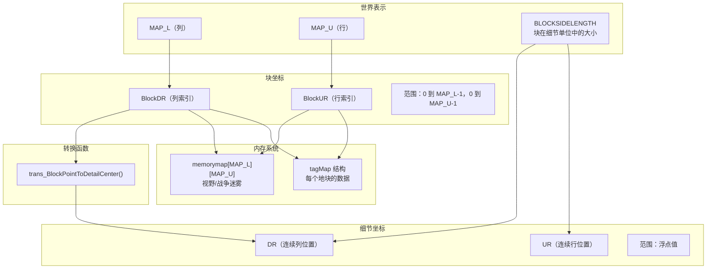
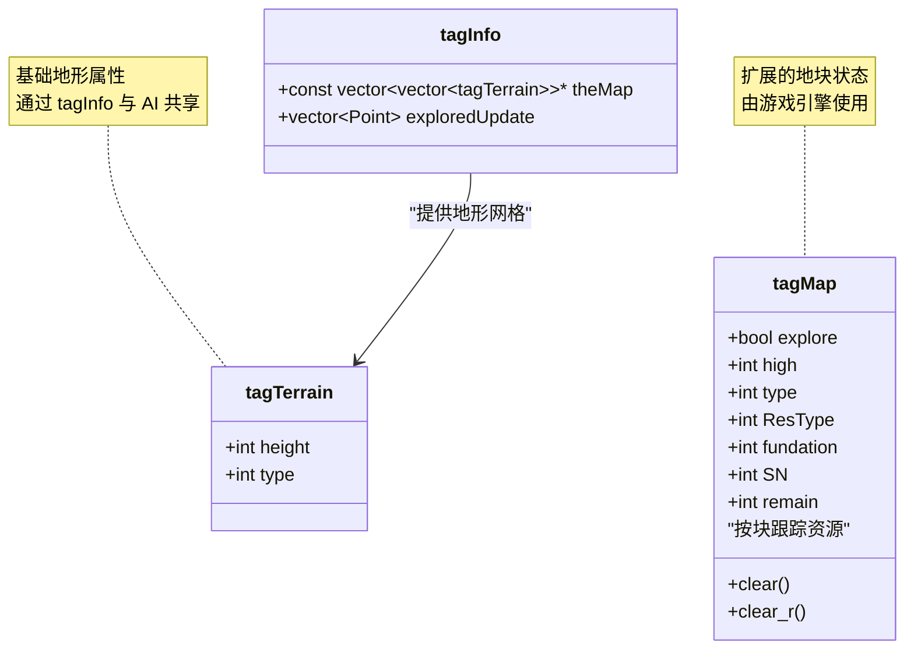
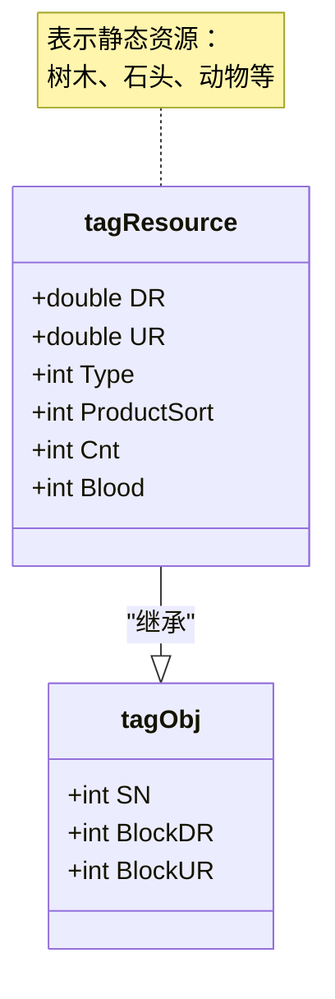
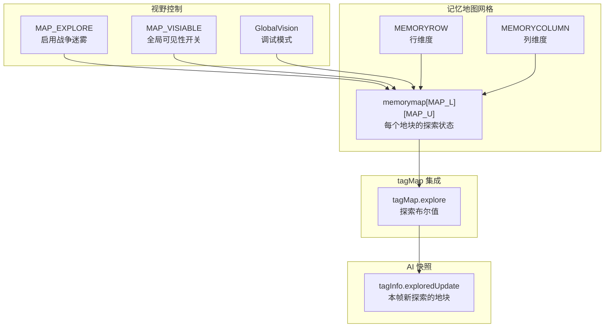
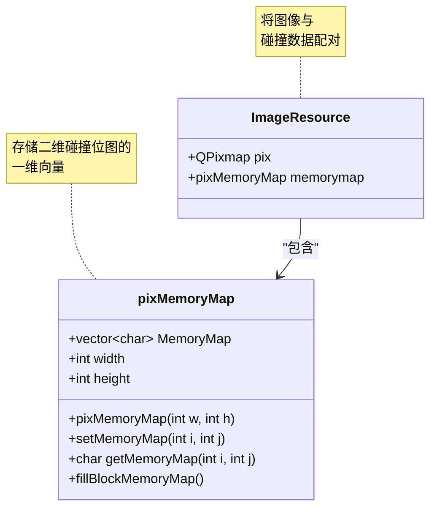
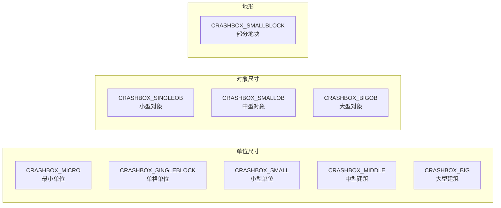
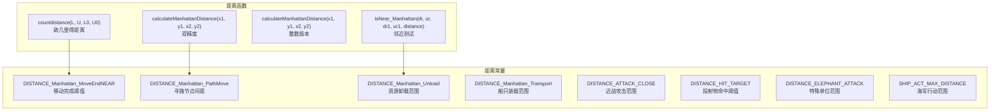

# 地图与世界

<details>
<summary>相关源文件</summary>

以下文件被用作生成本 Wiki 页面的上下文：

- [GlobalVariate.h](GlobalVariate.h)
- [map.njust](map.njust)

</details>


地图与世界系统定义了游戏环境的空间表示，包括地形、静态对象以及整个代码库中使用的坐标系。该系统为单位移动、资源放置、碰撞检测和战争迷雾实现提供了基础。

关于玩家特定的资源管理和采集机制，请参见[资源与经济系统](#3.1)。关于单位寻路和移动行为，请参见[单位与建筑](#3.3)。关于地图编辑器界面，请参见[地图编辑器](#4.2)。

---

## 地图尺寸与坐标系

游戏世界使用双重坐标系，以不同粒度表示位置。

### 坐标系概览



**来源：** [GlobalVariate.h:230-231](), [GlobalVariate.h:228](), [GlobalVariate.h:513-519](), [GlobalVariate.h:1318]()

### 全局地图变量

| 变量 | 类型 | 用途 | 位置 |
|----------|------|---------|----------|
| `MAP_L` | `int` | 以块为单位的地图宽度（列） | [GlobalVariate.h:230]() |
| `MAP_U` | `int` | 以块为单位的地图高度（行） | [GlobalVariate.h:231]() |
| `BLOCKSIDELENGTH` | `double` | 一个块在细节坐标中的大小 | [GlobalVariate.h:228]() |
| `memorymap` | `int**` | 用于视野/已探索地块的二维数组 | [GlobalVariate.h:515]() |
| `MidX`, `MidY` | `int` | 当前视口中心 | [GlobalVariate.h:516-517]() |
| `MAP_LSide[2]`, `MAP_USide[2]` | `int[]` | 视口边界 | [GlobalVariate.h:518-519]() |

**来源：** [GlobalVariate.h:228-231](), [GlobalVariate.h:513-519]()

### 坐标转换

块坐标（`BlockDR`、`BlockUR`）是地图网格中的整数索引，而细节坐标（`DR`、`UR`）是用于精确对象放置和移动的浮点位置。

**转换函数：**
- `trans_BlockPointToDetailCenter(int p)` 将块索引转换为该块中心的细节坐标 [GlobalVariate.h:1318]()

**使用模式：**
```cpp
// 块坐标用于标识一个地块
int blockColumn = 10;  // BlockDR
int blockRow = 5;      // BlockUR

// 细节坐标用于在地块内或地块之间定位
double detailColumn = trans_BlockPointToDetailCenter(10);  // DR
double detailRow = trans_BlockPointToDetailCenter(5);      // UR
```

**来源：** [GlobalVariate.h:1318]()

---

## 地形数据结构

地形信息存储在两个主要结构中，分别表示不同层次的细节。

### tagTerrain 结构



**来源：** [GlobalVariate.h:828-831](), [GlobalVariate.h:798-827](), [GlobalVariate.h:848-910]()

### tagTerrain 字段

`tagTerrain` 结构表示基础地形属性 [GlobalVariate.h:828-831]()：

| 字段 | 类型 | 描述 |
|-------|------|-------------|
| `height` | `int` | 地形的海拔高度 |
| `type` | `int` | 地形类型标识符（草地、海洋等） |

该结构用于传递给 AI 线程的 `tagInfo` 快照，为地形网格提供只读视图 [GlobalVariate.h:858]()。

**来源：** [GlobalVariate.h:828-831](), [GlobalVariate.h:858]()

### tagMap 结构

`tagMap` 结构提供扩展的逐地块状态信息 [GlobalVariate.h:798-827]()：

| 字段 | 类型 | 描述 |
|-------|------|-------------|
| `explore` | `bool` | 该地块是否已被探索（战争迷雾） |
| `high` | `int` | 该位置的地形高度 |
| `type` | `int` | 占据该地块的资源类型 |
| `ResType` | `int` | 被采集资源的类型（木材、食物、石头、黄金） |
| `fundation` | `int` | 资源/对象占地尺寸 |
| `SN` | `int` | 该地块上对象的序列号 |
| `remain` | `int` | 剩余资源数量 |

**成员函数：**
- `clear()`：重置探索和高度数据 [GlobalVariate.h:812-817]()
- `clear_r()`：清除资源相关字段 [GlobalVariate.h:819-826]()

**来源：** [GlobalVariate.h:798-827]()

---

## 静态资源与对象

静态世界对象包括占据地图地块的可采集资源和动物。

### 资源类型常量

资源按采集类型在全局常量中分类 [GlobalVariate.h:267-298]()：

| 类别 | 示例 | 数量变量 |
|----------|----------|-----------------|
| 动物 | 瞪羚、狮子、大象 | `CNT_GAZELLE`, `CNT_LION`, `CNT_ELEPHANT` |
| 树木 | 木材来源 | `CNT_TREE` |
| 矿物 | 石头、金矿 | `CNT_STONE`, `CNT_GOLDORE` |
| 食物 | 灌木（浆果）、鱼 | `CNT_BUSH`, `CNT_FISH` |

每种资源类型都有关联属性，定义在全局变量中：
- **视野范围**：`VISION_GAZELLE`、`VISION_LION` 等
- **生命值**：`BLOOD_GAZELLE`、`BLOOD_TREE` 等
- **生成数量**：`CNT_*` 变量控制初始地图生成

**来源：** [GlobalVariate.h:265-298]()

### tagResource 结构

`tagResource` 结构表示一个静态世界对象 [GlobalVariate.h:696-703]()：



| 字段 | 类型 | 描述 |
|-------|------|-------------|
| `SN` | `int` | 唯一序列号（来自 `tagObj`） |
| `BlockDR`, `BlockUR` | `int` | 块坐标（来自 `tagObj`） |
| `DR`, `UR` | `double` | 用于精确定位的细节坐标 |
| `Type` | `int` | 资源视觉类型标识符 |
| `ProductSort` | `int` | 被采集资源的类型（木材/食物/石头/黄金） |
| `Cnt` | `int` | 剩余资源数量 |
| `Blood` | `int` | 当前生命值（用于可破坏资源） |

**来源：** [GlobalVariate.h:672-703]()

### 资源分布数组

游戏使用预定义数组来存储资源簇模式 [GlobalVariate.h:520-522]()：

```cpp
int Forest[3][15][15];    // 树木簇模板
int Food[5][5][5];        // 食物源模式
int Stone[5][5][5];       // 石矿分布模式
```

这些数组定义了地图生成期间使用的空间分布，用于创建更自然的资源簇。

**来源：** [GlobalVariate.h:520-522]()

---

## 视野与记忆系统

地图通过记忆地图系统跟踪探索状态和可见性。

### 记忆地图结构



**来源：** [GlobalVariate.h:15-16](), [GlobalVariate.h:253-254](), [GlobalVariate.h:260](), [GlobalVariate.h:515](), [GlobalVariate.h:800](), [GlobalVariate.h:860]()

### 视野系统变量

| 变量 | 类型 | 默认值 | 用途 |
|----------|------|---------|---------|
| `MAP_EXPLORE` | `bool` | 运行时 | 启用/禁用战争迷雾系统 |
| `MAP_VISIABLE` | `bool` | 运行时 | 覆盖为整张地图可见 |
| `GlobalVision` | `bool` | 运行时 | 不受限制视野的调试标志 |
| `memorymap` | `int**` | 已分配 | 存储探索状态的二维数组 |
| `MEMORYROW` | `int` | 配置 | 记忆地图中的行数 |
| `MEMORYCOLUMN` | `int` | 配置 | 记忆地图中的列数 |

**来源：** [GlobalVariate.h:15-16](), [GlobalVariate.h:253-254](), [GlobalVariate.h:260](), [GlobalVariate.h:515]()

### 探索跟踪

每个地块的探索状态会在两个地方跟踪：

1. **全局记忆地图**（`memorymap`）：非零值表示该地块已被探索的整型数组 [GlobalVariate.h:515]()
2. **tagMap.explore**：逐地块结构中的布尔字段 [GlobalVariate.h:800]()

`tagInfo.exploredUpdate` 向量会跟踪每一帧中新探索的地块，使 AI 能够获知地图新发现 [GlobalVariate.h:860]()。

**来源：** [GlobalVariate.h:515](), [GlobalVariate.h:800](), [GlobalVariate.h:860]()

---

## 碰撞检测系统

碰撞检测使用由图像 alpha 通道生成的像素级精确记忆地图。

### pixMemoryMap 结构



**来源：** [GlobalVariate.h:1002-1084](), [GlobalVariate.h:1086-1103]()

### pixMemoryMap 实现

`pixMemoryMap` 类为二维精灵存储一个一维碰撞位图 [GlobalVariate.h:1002-1084]()：

**关键方法：**

| 方法 | 用途 | 实现 |
|--------|---------|----------------|
| `pixMemoryMap(int w, int h)` | 分配碰撞网格的构造函数 | [GlobalVariate.h:1009-1012]() |
| `setMemoryMap(int i, int j)` | 将像素标记为实体 | [GlobalVariate.h:1031-1034]() |
| `getMemoryMap(int i, int j)` | 查询像素碰撞状态 | [GlobalVariate.h:1036-1039]() |
| `fillBlockMemoryMap()` | 为等距块生成菱形碰撞区域 | [GlobalVariate.h:1041-1083]() |

**内存布局：**
```cpp
// 二维坐标 (i, j) 映射到一维索引
int index = i * height + j;  // [GlobalVariate.h:1032]()
MemoryMap[index] = 1;        // 标记为实体
```

`fillBlockMemoryMap()` 方法通过遍历各象限并应用几何约束，为等距地块生成菱形/斜方形碰撞形状 [GlobalVariate.h:1041-1083]()。

**来源：** [GlobalVariate.h:1002-1084]()

### ImageResource 集成

每个视觉资源都与碰撞数据配对 [GlobalVariate.h:1086-1103]()：

```cpp
struct ImageResource {
    QPixmap pix;              // 视觉表示
    pixMemoryMap memorymap;   // 碰撞位图
};
```

全局 `resMap` 将资源名称与 `ImageResource` 对象列表关联 [GlobalVariate.h:525]()：

```cpp
extern map<string, list<ImageResource>> resMap;
```

**初始化函数：**
- `InitImageResMap(QString path)`：加载图像并生成碰撞数据 [GlobalVariate.h:1301]()
- `initMemory(ImageResource* res)`：从图像 alpha 通道构建碰撞位图 [GlobalVariate.h:1309]()

**来源：** [GlobalVariate.h:1086-1103](), [GlobalVariate.h:525](), [GlobalVariate.h:1301](), [GlobalVariate.h:1309]()

---

## Crashbox 与距离系统

空间查询系统定义了交互范围和碰撞体积。

### Crashbox 常量

“Crashbox” 值定义了不同对象尺寸的碰撞半径 [GlobalVariate.h:21-29]()：



| 常量 | 类型 | 用途 |
|----------|------|-------|
| `CRASHBOX_MICRO` | `double` | 导弹和微小对象 |
| `CRASHBOX_SINGLEBLOCK` | `double` | 单格单位（农民） |
| `CRASHBOX_SMALLBLOCK` | `double` | 部分地块覆盖 |
| `CRASHBOX_SMALL` | `double` | 小型单位（军事单位） |
| `CRASHBOX_MIDDLE` | `double` | 中型结构 |
| `CRASHBOX_BIG` | `double` | 大型建筑（城镇中心） |
| `CRASHBOX_SINGLEOB` | `double` | 单格对象（树木） |
| `CRASHBOX_SMALLOB` | `double` | 中型对象 |
| `CRASHBOX_BIGOB` | `double` | 大型对象 |

**来源：** [GlobalVariate.h:21-29]()

### 距离计算函数

代码库提供了多种距离计算工具：



**来源：** [GlobalVariate.h:1310-1314](), [GlobalVariate.h:300-307]()

### 距离函数声明

| 函数 | 参数 | 返回值 | 用途 |
|----------|------------|--------|---------|
| `countdistance` | `double L, U, L0, U0` | `double` | 两点之间的欧几里得距离 |
| `calculateManhattanDistance` | `int x1, y1, x2, y2` | `int` | 整数曼哈顿距离 |
| `calculateManhattanDistance` | `double x1, y1, x2, y2` | `double` | 浮点曼哈顿距离 |
| `isNear_Manhattan` | `double dr, ur, dr1, ur1, distance` | `bool` | 测试两点是否在曼哈顿距离范围内 |

**来源：** [GlobalVariate.h:1310-1314]()

### 距离阈值常量

控制空间交互的行为阈值 [GlobalVariate.h:300-307]()：

| 常量 | 类型 | 用途 |
|----------|------|-------|
| `DISTANCE_Manhattan_MoveEndNEAR` | `double` | 单位距离目标足够近时停止移动 |
| `DISTANCE_Manhattan_PathMove` | `double` | 寻路路径点之间的间距 |
| `DISTANCE_Manhattan_Unload` | `double` | 资源存放范围 |
| `DISTANCE_Manhattan_Transport` | `double` | 登上运输船的范围 |
| `DISTANCE_ATTACK_CLOSE` | `double` | 发起近战攻击的范围 |
| `DISTANCE_HIT_TARGET` | `double` | 投射物命中检测阈值 |
| `DISTANCE_ELEPHANT_ATTACK` | `double` | 大象特殊攻击范围 |
| `SHIP_ACT_MAX_DISTANCE` | `double` | 船只行动的最大范围 |

**来源：** [GlobalVariate.h:300-307]()

### 坐标变换工具

附加的空间工具 [GlobalVariate.h:1316-1318]()：

**镜像点计算：**
```cpp
void calMirrorPoint(double& dr, double& ur, 
                    double dr_mirror, double ur_mirror, 
                    double dis);
```
计算一个点以另一个点为镜像中心、指定距离处的反射点。

**块到细节中心：**
```cpp
double trans_BlockPointToDetailCenter(int p);
```
将块索引转换为该块中心的细节坐标。

**来源：** [GlobalVariate.h:1316-1318]()

---

## 空间查询与寻路支持

地图系统为寻路和空间查询提供基础支持。

### 全局对象注册表

游戏维护了一个所有空间对象的全局注册表 [GlobalVariate.h:514]()：

```cpp
extern std::map<int, Coordinate*> g_Object;
```

该映射将序列号（`int` 键）与 `Coordinate*` 指针关联起来，从而能够通过唯一标识符快速查找任意游戏对象。

**相关变量：**
- `g_globalNum`：用于分配唯一序列号的全局计数器 [GlobalVariate.h:512]()
- `nowobject`：当前选中的对象 [GlobalVariate.h:531]()
- `LeftMouseObjCapture`：被鼠标左键捕获的对象 [GlobalVariate.h:532]()
- `RightMouseObjCaptrue`：被鼠标右键捕获的对象 [GlobalVariate.h:533]()

**来源：** [GlobalVariate.h:512](), [GlobalVariate.h:514](), [GlobalVariate.h:531-533]()

### 角度常量

代码库定义了用于方向计算的角度常量 [GlobalVariate.h:229](), [GlobalVariate.h:1000]()：

```cpp
extern double UNLOAD_RADIAN;        // 资源卸载角度
extern std::string direction[5];   // 方向名称字符串
```

这些常量支持定向移动和对象朝向。

**来源：** [GlobalVariate.h:229](), [GlobalVariate.h:1000]()

---

## 地图状态数据结构

### Point 结构

`Point` 结构表示离散的二维坐标 [GlobalVariate.h:833-845]()：

```cpp
struct Point {
    int x;
    int y;
    
    Point(int x, int y);
    Point operator +(const Point& ps);
    Point operator -(const Point& ps);
    bool operator ==(const Point& ps) const;
    bool operator < (const Point& ps) const;
};
```

用于 `tagInfo.exploredUpdate` 中，以跟踪新探索的地块 [GlobalVariate.h:860]()。

**来源：** [GlobalVariate.h:833-845](), [GlobalVariate.h:860]()

### MouseEvent 结构

`MouseEvent` 结构捕获空间交互事件 [GlobalVariate.h:974-997]()：

| 方法 | 用途 |
|--------|---------|
| `GetMemoryMapX()`, `GetMemoryMapY()` | 获取点击位置的记忆地图坐标 |
| `GetDR()`, `GetUR()` | 获取点击位置的细节坐标 |
| `GetMouseEventType()` | 判断点击类型（左键/右键/拖拽） |
| `HaveEvent()` | 检查事件是否有效 |
| `Reset()` | 清除事件数据 |

该结构将用户输入桥接到地图上的空间查询。

**来源：** [GlobalVariate.h:974-997]()

---

## 配置与初始化

地图参数会在启动时从 `config.json` 加载 [GlobalVariate.h:1323]()：

```cpp
void ReadConfig();  // Q_COREAPP_STARTUP_FUNCTION
```

**可配置的地图参数：**
- 地图尺寸（`MAP_L`、`MAP_U`）
- 块大小（`BLOCKSIDELENGTH`）
- 初始资源数量（`CNT_TREE`、`CNT_STONE` 等）
- 可见性设置（`MAP_EXPLORE`、`MAP_VISIABLE`）
- 碰撞半径（`CRASHBOX_*` 系列）
- 距离阈值（`DISTANCE_*` 系列）

`ReadConfig()` 函数被标记为 `Q_COREAPP_STARTUP_FUNCTION`，确保它在 Qt 事件循环开始前运行，并从 JSON 填充所有全局变量。

**来源：** [GlobalVariate.h:1323](), [GlobalVariate.h:15-307]()

---

## 汇总表：关键地图组件

| 组件 | 结构/变量 | 用途 | 文件引用 |
|-----------|-------------------|---------|----------------|
| **尺寸** | `MAP_L`, `MAP_U` | 以块为单位的网格大小 | [GlobalVariate.h:230-231]() |
| **坐标** | `BlockDR/UR`, `DR/UR` | 双重坐标系统 | 整个代码库 |
| **地形** | `tagTerrain` | 每个地块的高度和类型 | [GlobalVariate.h:828-831]() |
| **地块状态** | `tagMap` | 扩展的逐地块信息 | [GlobalVariate.h:798-827]() |
| **资源** | `tagResource` | 静态世界对象 | [GlobalVariate.h:696-703]() |
| **视野** | `memorymap`, `MAP_EXPLORE` | 战争迷雾系统 | [GlobalVariate.h:15-16](), [GlobalVariate.h:515]() |
| **碰撞** | `pixMemoryMap` | 像素级精确检测 | [GlobalVariate.h:1002-1084]() |
| **空间查询** | `countdistance`, `isNear_Manhattan` | 距离计算 | [GlobalVariate.h:1310-1314]() |
| **对象注册表** | `g_Object` | 全局对象查找 | [GlobalVariate.h:514]() |

**来源：** [GlobalVariate.h:15-1323]()