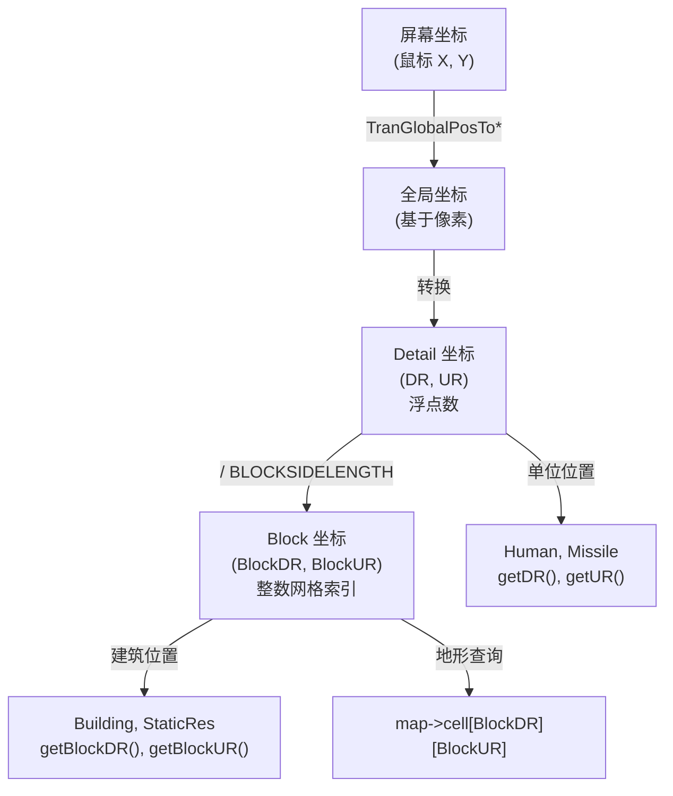
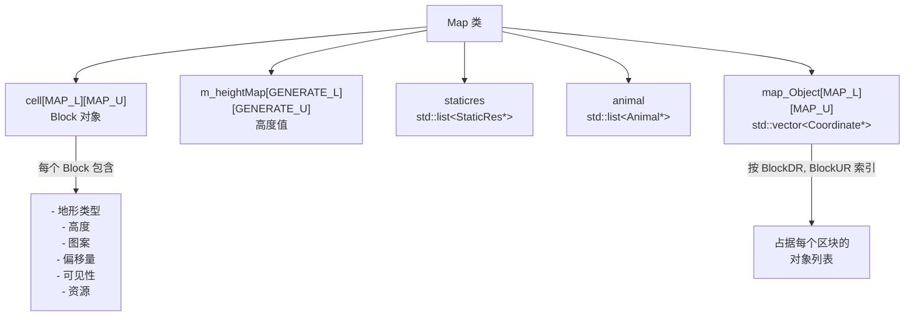
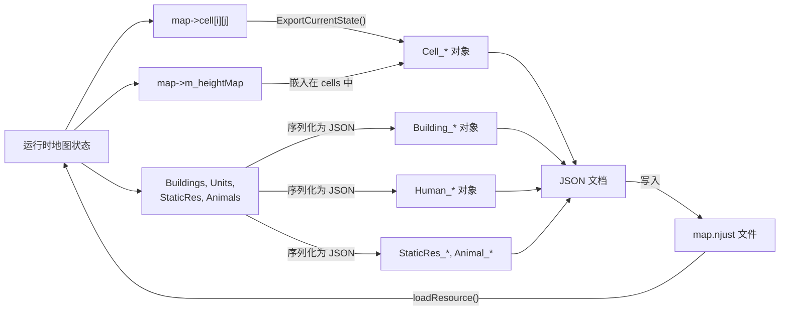

# 地图结构

<details>
<summary>相关源文件</summary>

以下文件被用作生成本 Wiki 页面时的上下文：

- [GlobalVariate.h](GlobalVariate.h)
- [MainWidget.cpp](MainWidget.cpp)
- [README.md](README.md)
- [map.njust](map.njust)

</details>


本页记录了 new-aoe 游戏引擎中的核心地图表示。内容涵盖 `Map` 类、坐标系统、地形网格组织，以及用于视野和寻路的内存映射。

有关地形类型、静态资源和 `Block` 类的信息，请参见 [Terrain and Objects](#6.2)。有关碰撞检测和寻路算法，请参见 [Collision and Pathfinding](#6.3)。

---

## 坐标系统

游戏使用两种在不同尺度上运作的坐标系统：

### Block 坐标与 Detail 坐标

**Block 坐标**（`BlockDR`、`BlockUR`）表示地图上的离散网格单元。它们是地图网格数组中的整数索引。

**Detail 坐标**（`DR`、`UR`）表示游戏世界中的精确像素级位置。它们是浮点值，可实现平滑移动和定位。

这两个系统之间的关系由 `BLOCKSIDELENGTH` 定义：

```
DR = BlockDR * BLOCKSIDELENGTH + offset_within_block
UR = BlockUR * BLOCKSIDELENGTH + offset_within_block
```

**转换示例**（来自 MainWidget.cpp）：

[MainWidget.cpp:538-540]()

```cpp
double DR = ui->Game->TranGlobalPosToDR(eventFilter->MouseX(),eventFilter->MouseY());
double UR = ui->Game->TranGlobalPosToUR(eventFilter->MouseX(),eventFilter->MouseY());
int L = DR / BLOCKSIDELENGTH, U = UR / BLOCKSIDELENGTH;
```

### 图示：坐标系统层级



来源：[MainWidget.cpp:538-540](), [GlobalVariate.h:228]()

---

## 地图尺寸

地图大小在运行时通过 `config.json` 配置：

| 参数 | 类型 | 描述 |
|-----------|------|-------------|
| `MAP_L` | `int` | 地图网格中的列数 |
| `MAP_U` | `int` | 地图网格中的行数 |
| `BLOCKSIDELENGTH` | `double` | 每个区块在 Detail 坐标单位中的大小 |

**地图覆盖范围**：总可玩区域在 Detail 坐标中从 `(0, 0)` 延伸到 `(MAP_L * BLOCKSIDELENGTH, MAP_U * BLOCKSIDELENGTH)`。

来源：[GlobalVariate.h:230-231](), [GlobalVariate.h:228]()

---

## 地图网格结构

地图被组织为一个二维 `Block` 对象网格，存储在 `Map` 类中。

### 核心数据结构

**Cell 数组**：`Block cell[MAP_L][MAP_U]`

网格中的每个 `Block` 存储：
- 地形类型（`getMapType()`、`setMapType()`）
- 高度（`getMapHeight()`、`setMapHeight()`）
- 图案/纹理变体（`getMapPattern()`）
- 视觉偏移量（`getOffsetX()`、`getOffsetY()`）
- 可见性状态（`Visible`、`Explored`）
- 资源信息（`getMapResource()`）

**高度图**：`int m_heightMap[GENERATE_L][GENERATE_U]`

一个并行数组，用于存储原始高度值，供地形生成和坡度计算使用。`GENERATE_L` 和 `GENERATE_U` 的尺寸通常为 `MAP_L + 8` 和 `MAP_U + 8`，以提供边界填充。

### 图示：Map 类内部结构



来源：[MainWidget.cpp:373-389](), [MainWidget.cpp:923-925]()

---

## 地形数据结构

### tagTerrain

`tagTerrain` 结构体表示供 AI 和寻路使用的最小地形信息：

[GlobalVariate.h:828-831]()

```cpp
struct tagTerrain {
    int height;
    int type;
};
```

| 字段 | 类型 | 描述 |
|-------|------|-------------|
| `height` | `int` | 地形海拔等级 |
| `type` | `int` | 地形类型常量（例如 `MAPTYPE_FLAT`、`MAPTYPE_OCEAN`） |

该结构体用于：
- AI 状态快照（`tagInfo::theMap`）
- 寻路算法
- 地形类型查询

### Block 类

`Block` 类（继承自 `Coordinate`）提供完整的地形表示：

**关键方法**：
- `getMapType()` / `setMapType(int)` - 地形类型（草地、海洋等）
- `getMapHeight()` / `setMapHeight(int)` - 海拔等级
- `getMapPattern()` / `setMapPattern(int)` - 纹理变体
- `getOffsetX()` / `getOffsetY()` - 等距渲染偏移量
- `reset()` - 重新计算视觉属性
- `resetOffset()` - 重新计算偏移值

来源：[GlobalVariate.h:828-831]()

---

## 内存映射

`Map` 类维护了若干辅助内存映射，以实现高效的空间查询：

### 视野与战争迷雾

**用途**：跟踪每个玩家已探索以及当前可见的区域。

**实现方式**（按区块标记）：
- `Block::Visible` - 当前处于视野范围内
- `Block::Explored` - 曾经被看见过

这些标记会在 `gameUpdate()` 期间根据单位的视野范围进行更新。

### 对象放置映射

**结构**：`map_Object[MAP_L][MAP_U]` - 一个二维数组，其中每个单元包含一个 `std::vector<Coordinate*>`，保存占据该区块的对象。

**用途**：
- 快速空间查询（“这个位置有什么？”）
- 放置时的碰撞检测
- 区域清理操作

[MainWidget.cpp:786-797]()

来自建筑删除逻辑的示例：
```cpp
for(int mapX = buildingToDelete->getBlockDR(); 
    mapX < buildingToDelete->getBlockDR() + buildingToDelete->get_BlockSizeLen(); 
    mapX++) {
    for(int mapY = buildingToDelete->getBlockUR(); 
        mapY < buildingToDelete->getBlockUR() + buildingToDelete->get_BlockSizeLen(); 
        mapY++) {
        if(mapX >= 0 && mapX < MAP_L && mapY >= 0 && mapY < MAP_U) {
            auto& objects = map->map_Object[mapX][mapY];
            objects.erase(remove(objects.begin(), objects.end(), buildingToDelete), objects.end());
        }
    }
}
```

### tagMap 资源映射

**结构**：`tagMap`（定义于 [GlobalVariate.h:798-827]()）

供 AI 查询资源信息：

```cpp
struct tagMap {
    bool explore;      // 该单元是否已探索？
    int high;          // 高度
    int type;          // 资源类型（RESOURCE_BUSH、RESOURCE_TREE 等）
    int ResType;       // 采集得到的资源类型（HUMAN_WOOD、HUMAN_FOOD 等）
    int fundation;     // 资源占地尺寸
    int SN;            // 对象序列号
    int remain;        // 剩余资源数量
};
```

来源：[GlobalVariate.h:798-827](), [MainWidget.cpp:786-797]()

---

## 地图初始化与加载

### 初始化流程

地图在 `MainWidget::initMap(int MapJudge)` 中初始化：

**MapJudge 的取值**：
- `0` - 生成新的默认地图
- `1` - 加载上次使用的地图（`tmpMap.txt`）
- `2+` - 加载指定地图文件

地图初始化过程包括：
1. 创建 `Block` 网格
2. 生成或加载高度图
3. 根据高度计算地形类型
4. 放置初始资源和单位
5. 为等距渲染计算视觉偏移量

### 地形修改函数

编辑器提供若干地形编辑操作：

| 函数 | 用途 | 区块范围 |
|----------|---------|-------------|
| `HigherLand(blockL, blockU, height)` | 抬高地形 | 以光标为中心的 3×3 |
| `LowerLand(blockL, blockU, height)` | 降低地形 | 以光标为中心的 3×3 |
| `MakeOcean(blockL, blockU)` | 转换为海洋 | 以光标为中心的 3×3 |
| `MakeGrassland(blockL, blockU)` | 转换为草地 | 以光标为中心的 3×3 |

**示例**：抬高地形（[MainWidget.cpp:881-938]()）

```cpp
void MainWidget::HigherLand(int blockL, int blockU, int height) {
    static const int width = 3;
    static const int half = width / 2;
    
    // Validate height constraints in surrounding area
    for (int i = -half; i <= half; ++i) {
        for (int j = -half; j <= half; ++j) {
            int ll = blockL + i, uu = blockU + j;
            // ... check adjacent blocks ...
        }
    }
    
    // Apply new height to 3x3 area
    for (int i = -half; i <= half; ++i) {
        for (int j = -half; j <= half; ++j) {
            int ll = blockL + i, uu = blockU + j;
            map->m_heightMap[ll + 4][uu + 4] = height;
            map->cell[ll][uu].setMapHeight(height);
            map->cell[ll][uu].reset();
        }
    }
    
    // Recalculate visual properties
    map->GenerateType();
    map->CalOffset();
    map->InitFaultHandle();
}
```

来源：[MainWidget.cpp:881-938](), [MainWidget.cpp:1005-1034](), [MainWidget.cpp:1068-1107]()

---

## 地图序列化

地图会保存为 JSON 格式，以便持久化和共享。

### 保存格式

`ExportCurrentState()` 函数（[MainWidget.cpp:279-525]()）会序列化：

**Cell 数据**（每个区块）：
```json
{
    "Cell_0": {
        "BlockDR": 0,
        "BlockUR": 0,
        "Num": 0,
        "Visible": false,
        "Explored": false,
        "Type": 0,
        "Pattern": 0,
        "Height": 0,
        "OffsetX": 0,
        "OffsetY": 0,
        "Resource": -1
    }
}
```

**建筑数据**：
```json
{
    "Building_0": {
        "BlockDR": 10,
        "BlockUR": 10,
        "Num": 0,
        "Own": "WLH"
    }
}
```

**Human 数据**（包含可选区域限制）：
```json
{
    "Human_0": {
        "DR": 123.45,
        "UR": 678.90,
        "Num": 2,
        "Sort": "Army",
        "Own": "LZ",
        "AreaLimit": {
            "Type": "RectArea",
            "DR": 100,
            "UR": 100,
            "W": 200,
            "H": 200
        }
    }
}
```

### 图示：地图序列化数据流



来源：[MainWidget.cpp:279-525](), [MainWidget.cpp:373-389](), [map.njust:1-100]()

---

## 关键地图操作

### 坐标转换

| 操作 | 输入 | 输出 | 公式 |
|-----------|-------|--------|---------|
| Detail 转 Block | `(DR, UR)` | `(BlockDR, BlockUR)` | `BlockDR = DR / BLOCKSIDELENGTH` |
| Block 转 Detail 中心点 | `(BlockDR, BlockUR)` | `(DR, UR)` | `DR = BlockDR * BLOCKSIDELENGTH + BLOCKSIDELENGTH/2` |

### 访问地形数据

```cpp
// Get terrain at block coordinates
Block& block = map->cell[blockDR][blockUR];
int terrainType = block.getMapType();
int height = block.getMapHeight();

// Get terrain at detail coordinates
int blockDR = (int)(DR / BLOCKSIDELENGTH);
int blockUR = (int)(UR / BLOCKSIDELENGTH);
Block& block = map->cell[blockDR][blockUR];
```

### 边界检查

所有地图访问都应验证坐标：

```cpp
if (blockL >= 0 && blockL < MAP_L && blockU >= 0 && blockU < MAP_U) {
    // Safe to access map->cell[blockL][blockU]
}
```

来源：[MainWidget.cpp:538-541](), [MainWidget.cpp:889-900]()

---

## 与游戏系统的集成

### 被 Core 使用

- **对象移动**：单位会查询地形类型和高度以进行寻路
- **可见性**：Core 会根据单位视野范围更新 `Visible` 标记
- **碰撞**：建筑放置会检查地形类型和占用情况

### 被 AI 使用

- **状态快照**：`tagInfo::theMap` 提供 `vector<vector<tagTerrain>>` 视图
- **资源查询**：AI 使用 `tagMap` 定位可采集资源
- **探索**：AI 跟踪 `explored` 区域以指导侦察

### 被渲染使用

- **GameWidget**：遍历 `cell[][]` 绘制地形图块
- **等距偏移**：使用 `getOffsetX()` 和 `getOffsetY()` 进行渲染
- **战争迷雾**：对未探索/不可见区域渲染黑暗覆盖层

来源：[MainWidget.cpp:373-389](), [GlobalVariate.h:848-910]()