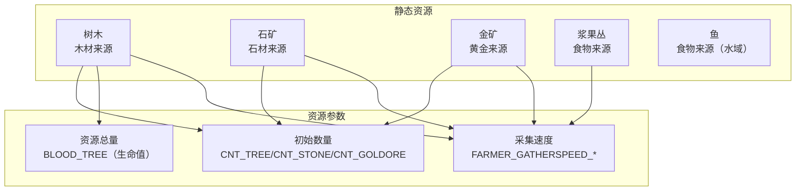
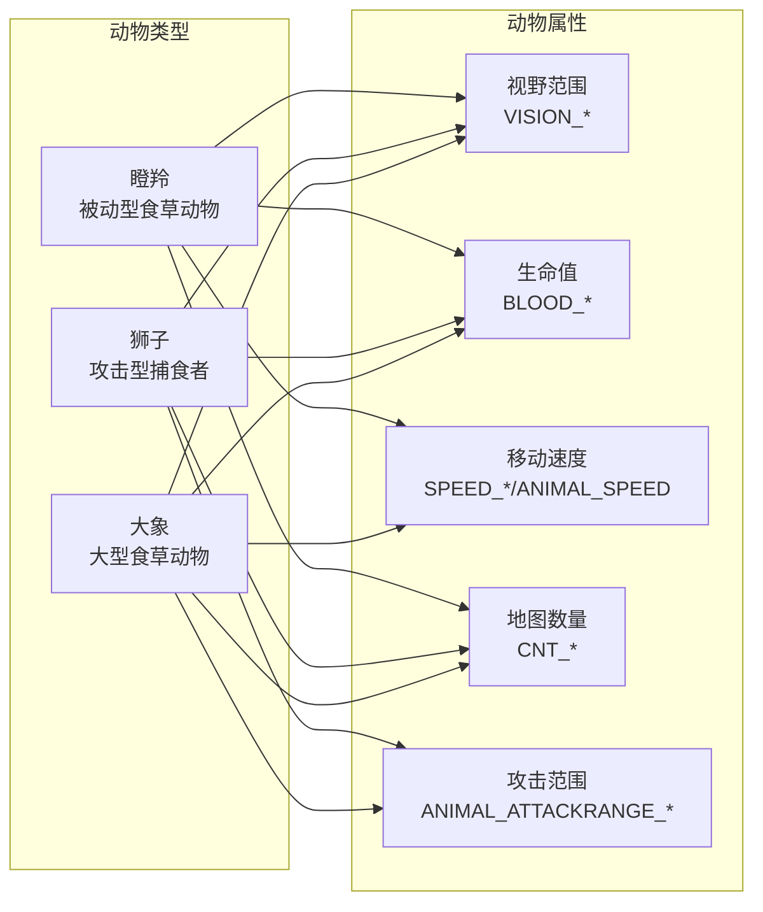
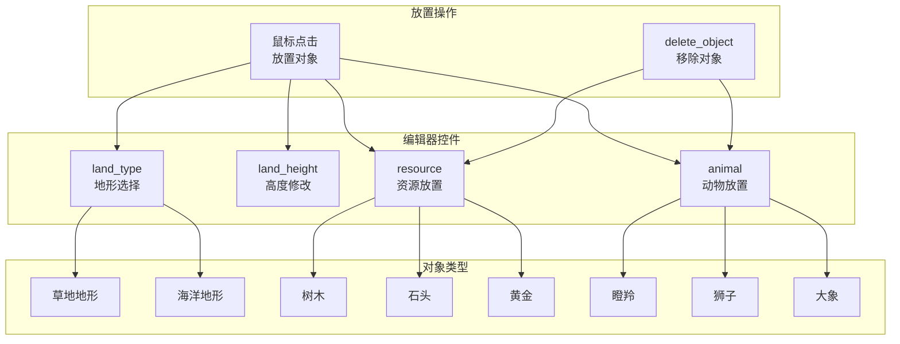
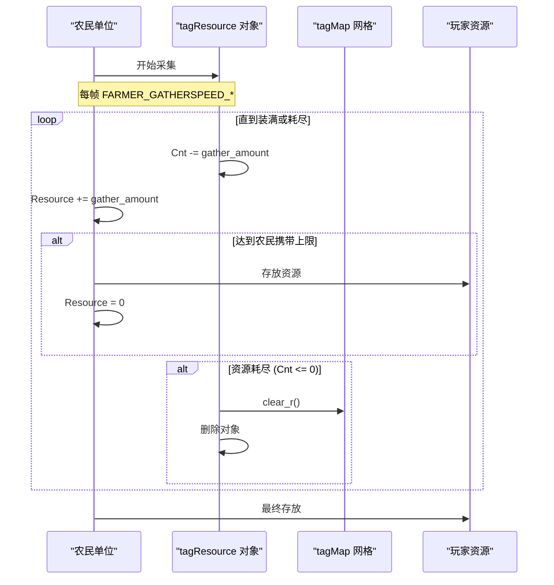

# 地形与对象

<details>
<summary>相关源文件</summary>

以下文件被用作生成此 wiki 页面时的上下文：

- [Editor.ui](Editor.ui)
- [GlobalVariate.h](GlobalVariate.h)
- [config.json](config.json)

</details>


本页面记录地形系统、静态资源对象（树木、石头、黄金）以及分布于游戏世界中的动物。关于整体地图结构和坐标系统的信息，请参见 [地图结构](#6.1)。关于碰撞检测和空间查询，请参见 [碰撞与寻路](#6.3)。

## 概述

游戏世界由一个地形网格以及叠加其上的可放置对象组成。地形定义了每个网格位置的地面类型和海拔高度，而对象包括可采集资源（树木、石矿、金矿、浆果丛、鱼）和中立动物（瞪羚、狮子、大象）。这些对象通过 `config.json` 进行配置，并且可以在地图生成期间或通过地图编辑器进行放置。

---

## 地形系统

### 地形类型与结构

地形网格使用 `tagTerrain` 结构来表示每个网格单元：

**结构：tagTerrain**

| 字段 | 类型 | 描述 |
|-------|------|-------------|
| `height` | `int` | 地形单元的海拔高度 |
| `type` | `int` | 地形类型标识符（草地、海洋） |

来源：[GlobalVariate.h:828-831]()

游戏支持两种主要地形类型：
- **草地**（默认陆地地形）
- **海洋**（水域地形，可由船只通行）

地形类型会影响单位的移动能力：陆地单位只能在草地上通行，而船只只能在海洋地块上移动。地图编辑器通过 `land_type` 下拉框提供修改地形类型的控件。

来源：[Editor.ui:335-359]()

### 高度图

每个地形单元都有一个 `height` 值，用于在地图上形成海拔差异。高度会影响：
- 视觉渲染（等距视角的高度显示）
- 视野计算
- 战略位置选择

编辑器通过 `land_height` 下拉框提供高度修改工具，选项包括：
- 提升高度 (`提升高度`)
- 降低高度 (`降低高度`)

来源：[Editor.ui:29-53]()

### 地形数据存储

地形数据存储在 `tagInfo` 结构中，采用二维向量以便高效访问：

```cpp
using TerrainData = const vector<vector<tagTerrain>>;
TerrainData* theMap;
```

地图尺寸通过以下参数配置：
- `MAP_L`：地图长度（默认 100）
- `MAP_U`：地图宽度（默认 100）

来源：[GlobalVariate.h:848-849](), [config.json:27-28]()

---

## 静态资源对象

### 资源类型

游戏包含五类作为地形对象放置的可采集资源：



来源：[config.json:56-77](), [Editor.ui:259-291]()

### 树木对象

树木是木材的主要来源，配置如下：

| 参数 | 配置键 | 默认值 |
|-----------|------------|---------------|
| 生命值/总量 | `BLOOD_TREE` | 25 |
| 初始数量 | `CNT_TREE` | 75 |
| 采集速度 | `FARMER_GATHERSPEED_WOOD` | 每帧 0.02 |

树木使用 `BLOOD_TREE` 参数来决定在耗尽前可采集多少木材。农民以 `FARMER_GATHERSPEED_WOOD` 的速率采集，并且在需要存放之前最多可携带 `FARMER_CARRYLIMIT_WOOD`（10）单位。

来源：[config.json:56-57, 68](), [GlobalVariate.h:277-278, 289]()

### 石矿

石矿为建筑提供石材资源：

| 参数 | 配置键 | 默认值 |
|-----------|------------|---------------|
| 初始数量 | `CNT_STONE` | 250 |
| 采集速度 | `FARMER_GATHERSPEED_STONE` | 每帧 0.02 |
| 携带上限 | `FARMER_CARRYLIMIT_STONE` | 10 |

来源：[config.json:71, 75]()

### 金矿

金矿是最有价值的资源，用于高级单位和科技：

| 参数 | 配置键 | 默认值 |
|-----------|------------|---------------|
| 初始数量 | `CNT_GOLDORE` | 200 |
| 采集速度 | `FARMER_GATHERSPEED_GOLD` | 每帧 0.02 |
| 携带上限 | `FARMER_CARRYLIMIT_GOLD` | 10 |

来源：[config.json:72, 76]()

### 浆果丛与鱼

其他食物来源包括：
- **浆果丛**：`CNT_BUSH` = 150 初始数量
- **鱼**：`CNT_FISH` = 200 初始数量（水域资源）

两者在采集时都提供食物，使用 `FARMER_GATHERSPEED_FOOD` = 0.02，携带上限为 10。

来源：[config.json:74, 77, 69-70]()

---

## 动物对象

### 动物类型

游戏包含三种分布在地图上的中立动物：



来源：[config.json:44-55](), [Editor.ui:292-321]()

### 瞪羚 (瞪羚)

被动型食草动物，猎杀后可提供食物：

| 参数 | 配置键 | 值 |
|-----------|------------|-------|
| 视野范围 | `VISION_GAZELLE` | 2 |
| 生命值 | `BLOOD_GAZELLE` | 8 |
| 食物产出 | `CNT_GAZELLE` | 150 |
| 移动速度 | `ANIMAL_SPEED` | 3.162 |

瞪羚不会主动攻击，并会躲避威胁。完全采集后可提供 `CNT_GAZELLE` = 150 单位食物。

来源：[config.json:44-46, 31]()

### 狮子 (狮子)

会攻击附近单位的攻击型捕食者：

| 参数 | 配置键 | 值 |
|-----------|------------|-------|
| 视野范围 | `VISION_LION` | 3 |
| 生命值 | `BLOOD_LION` | 20 |
| 食物产出 | `CNT_LION` | 100 |
| 攻击范围 | `ANIMAL_ATTACKRANGE_LION` | 10 |

狮子具有敌意，会攻击其攻击范围内的单位。它们提供的食物少于瞪羚，但危险性更高。

来源：[config.json:47-50]()

### 大象 (大象)

生命值高且具备攻击能力的大型食草动物：

| 参数 | 配置键 | 值 |
|-----------|------------|-------|
| 视野范围 | `VISION_ELEPHANT` | 4 |
| 生命值 | `BLOOD_ELEPHANT` | 45 |
| 食物产出 | `CNT_ELEPHANT` | 300 |
| 攻击范围 | `ANIMAL_ATTACKRANGE_ELEPHANT` | 10 |
| 移动速度 | `SPEED_ELEPHANT` | 2.033 |

大象提供的食物最多，但由于生命值高且在受到攻击时会表现出攻击性，因此狩猎难度较大。

来源：[config.json:51-55]()

---

## 资源表示

### tagResource 结构

所有可放置的资源对象（树木、石头、黄金、动物）都使用 `tagResource` 结构表示：

**结构：tagResource**

| 字段 | 类型 | 描述 |
|-------|------|-------------|
| `SN` | `int` | 对象的唯一序列号 |
| `BlockDR`, `BlockUR` | `int` | 块坐标位置 |
| `DR`, `UR` | `double` | 精确的细节坐标位置 |
| `Type` | `int` | 资源类型标识符 |
| `ProductSort` | `int` | 采集后产出的物品类型 |
| `Cnt` | `int` | 剩余资源数量 |
| `Blood` | `int` | 当前生命值/耐久度 |

`tagResource` 结构扩展自 `tagObj`，从而继承序列号和块坐标。`Cnt` 字段用于跟踪剩余资源量，农民从对象采集时该值会减少。当 `Cnt` 归零时，资源会耗尽并从地图中移除。

来源：[GlobalVariate.h:696-703]()

### tagMap 结构

`tagMap` 结构在特定地图网格位置存储资源信息：

**结构：tagMap**

| 字段 | 类型 | 描述 |
|-------|------|-------------|
| `explore` | `bool` | 该位置是否已被探索 |
| `high` | `int` | 该位置的地形高度 |
| `type` | `int` | 资源类型（浆果、树木等） |
| `ResType` | `int` | 产出物类型（木材、食物等） |
| `fundation` | `int` | 资源占地尺寸 |
| `SN` | `int` | 资源对象的序列号 |
| `remain` | `int` | 剩余资源数量 |

`tagMap` 结构充当空间索引，使得可以查询特定网格位置上的资源。`clear_r()` 方法会在资源耗尽或被移除时重置资源信息。

来源：[GlobalVariate.h:798-827]()

---

## 对象放置系统

### 编辑器放置控件

地图编辑器提供用于放置不同对象类型的下拉框：



来源：[Editor.ui:16-446]()

### 放置工作流程

1. **选择阶段**：用户从相应的下拉框中选择对象类型：
   - `land_type` 用于地形（草地/海洋）
   - `land_height` 用于海拔变化
   - `resource` 用于资源（树木、石头、黄金）
   - `animal` 用于动物（瞪羚、狮子、大象）

2. **放置阶段**：用户点击地图，在点击位置放置所选对象

3. **删除阶段**：用户点击 `delete_object` 按钮，然后点击对象将其移除

来源：[Editor.ui:29-359]()

### 资源密度配置

初始资源分布通过 `config.json` 中的 `CNT_*` 参数控制：

| 资源类型 | 配置参数 | 默认数量 |
|---------------|------------------|---------------|
| 树木 | `CNT_TREE` | 75 |
| 浆果丛 | `CNT_BUSH` | 150 |
| 石矿 | `CNT_STONE` | 250 |
| 金矿 | `CNT_GOLDORE` | 200 |
| 鱼 | `CNT_FISH` | 200 |
| 瞪羚 | `CNT_GAZELLE` | 150 |
| 狮子 | `CNT_LION` | 100 |
| 大象 | `CNT_ELEPHANT` | 300 |

这些数值表示对象被完全采集后可提供的初始资源总量，而不是地图上放置的对象数量。

来源：[config.json:46-77]()

---

## 资源生命周期

### 采集与耗尽



来源：[GlobalVariate.h:798-827](), [config.json:68-72]()

### 资源参数

每种资源类型都有对应的采集参数：

**采集速度参数**：
- `FARMER_GATHERSPEED_WOOD` = 0.02
- `FARMER_GATHERSPEED_FOOD` = 0.02
- `FARMER_GATHERSPEED_GOLD` = 0.02
- `FARMER_GATHERSPEED_STONE` = 0.02

**携带上限参数**：
- `FARMER_CARRYLIMIT_WOOD` = 10
- `FARMER_CARRYLIMIT_FOOD` = 10
- `FARMER_CARRYLIMIT_GOLD` = 10
- `FARMER_CARRYLIMIT_STONE` = 10

这些上限可以通过科技研究进行升级，升级后的版本拥有更高的携带容量：
- `FARMER_CARRYLIMIT_UPGRADEWOOD` = 12
- `FARMER_CARRYLIMIT_UPGRADEFOOD` = 13
- `FARMER_CARRYLIMIT_UPGRADEGOLD` = 15
- `FARMER_CARRYLIMIT_UPGRADESTONE` = 13

来源：[config.json:60-67](), [GlobalVariate.h:281-293]()

---

## 对象与网格的集成

### 坐标系统

地形上的对象使用两种坐标表示：

1. **块坐标**：整数网格位置（`BlockDR`, `BlockUR`）
2. **细节坐标**：精确的浮点位置（`DR`, `UR`）

块坐标与细节坐标之间的转换由以下内容处理：
- `BLOCKSIDELENGTH` = 35.777（每个块对应的细节单位数）
- `trans_BlockPointToDetailCenter()` 函数将块坐标转换为细节中心坐标

来源：[config.json:25](), [GlobalVariate.h:1318]()

### 碰撞与占地

资源在网格上占据的空间由 `tagMap` 结构中的 `fundation`（占地）值决定。这可以防止重叠放置，并定义单位寻路时的碰撞区域。

`pixMemoryMap` 结构会存储每个对象的碰撞信息，该信息由对象的视觉表示生成。这使资源采集和单位移动能够进行像素级精确碰撞检测。

来源：[GlobalVariate.h:806, 1002-1084]()

---

## 农场建筑

### 特殊情况：农场

与自然资源不同，农场是玩家建造的建筑，可产生可再生食物：

| 参数 | 配置键 | 值 |
|-----------|------------|-------|
| 建造成本 | `BUILD_FARM_WOOD` | 75 |
| 建造时间 | `TIME_BUILD_FARM` | 30 帧 |
| 食物容量 | `CNT_BUILD_FARM` | 250 |
| 生命值 | `BLOOD_BUILD_FARM` | 50 |
| 视野范围 | `VISION_FARM` | 4 |

农场可以通过市场研究升级，以提高食物产量：
- `BUILDING_MARKET_FARM_UPGRADE_ADDITION_FOOD` = +75 食物
- `BUILDING_MARKET_PLOW_UPGRADE_ADDITION_FOOD` = +75 食物（可累计）

`CNT_UPGRADEFARM` 参数（325）表示第一次升级后的农场容量（250 + 75）。

来源：[config.json:73, 211-245](), [GlobalVariate.h:211-215]()