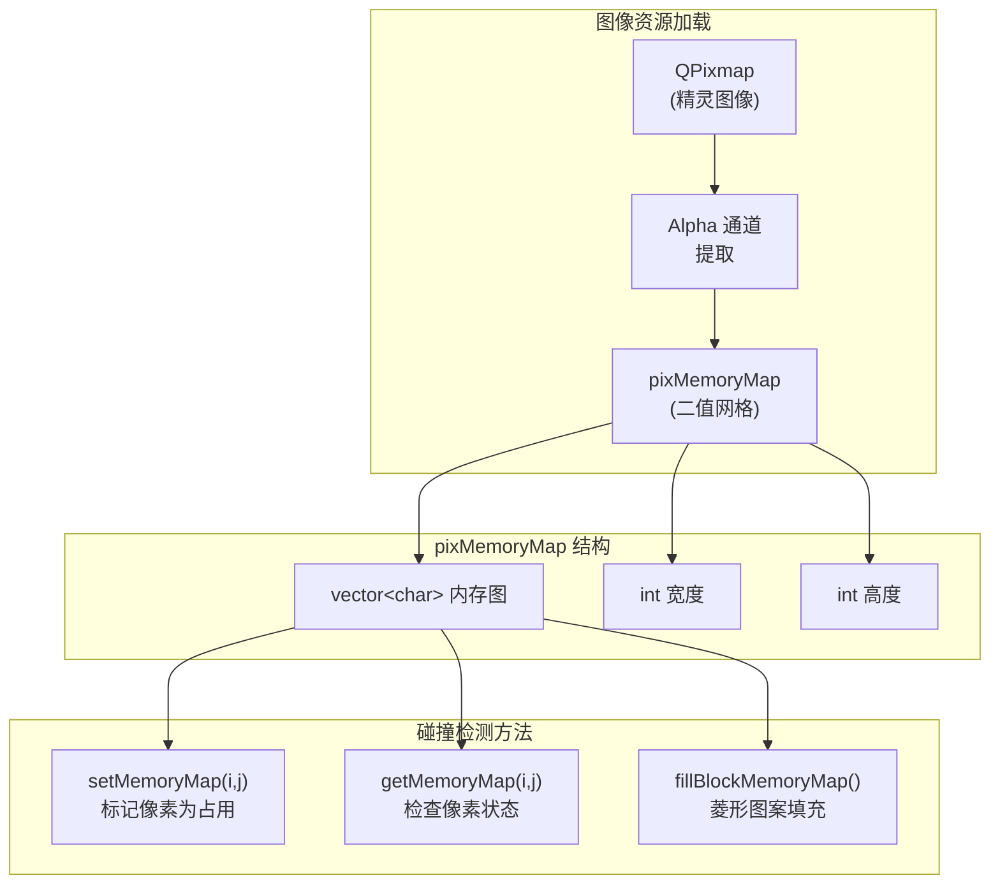
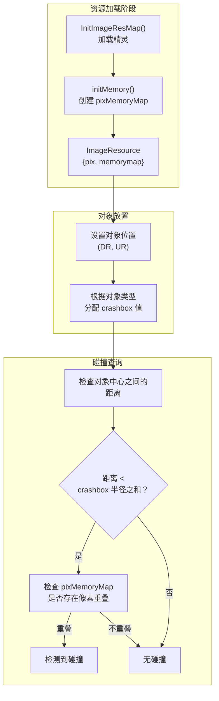
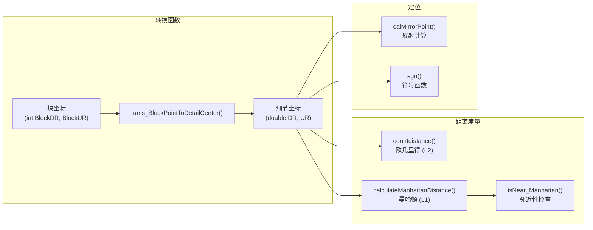

# 碰撞与寻路

<details>
<summary>相关源文件</summary>

以下文件被用作生成此 wiki 页面时的上下文：

- [GlobalVariate.cpp](GlobalVariate.cpp)
- [GlobalVariate.h](GlobalVariate.h)
- [config.json](config.json)

</details>


本文档说明了游戏引擎中使用的碰撞检测和空间计算系统。内容涵盖坐标系、基于像素内存图与 crashbox 值的碰撞检测、使用曼哈顿与欧几里得度量的距离计算，以及支持单位移动和交互的空间查询工具。

关于单位移动行为和寻路逻辑，请参见“单位 AI 与移动”部分（尚未编写）。关于地图结构和地形表示的信息，请参见 [地图结构](#6.1)。

---

## 坐标系

游戏使用两种协同工作的坐标系来进行空间计算：

**块坐标** (`BlockDR`, `BlockUR`)：整数网格坐标，每个块代表一个地图图块。地图尺寸由 `MAP_L` 和 `MAP_U` 定义（通常为 100x100 个块）。

**细节坐标** (`DR`, `UR`)：表示游戏世界中精确位置的浮点坐标。其单位为 detail units，每个块的边长为 `BLOCKSIDELENGTH`（约 35.78 个 detail units）。

`trans_BlockPointToDetailCenter()` 函数会将块坐标转换为该块中心点对应的细节坐标：

```
detail_coordinate = (block_coordinate + 0.5) * BLOCKSIDELENGTH
```

这种双坐标系设计使得系统既能在块级别高效执行空间查询，又能在细节级别保持单位移动的平滑性。

**来源：** [GlobalVariate.cpp:1089-1092](), [config.json:25,27-28](), [GlobalVariate.h:228-231]()

---

## 碰撞检测系统

### pixMemoryMap 结构

`pixMemoryMap` 结构通过从精灵图的 alpha 通道创建二值内存图，提供像素级精度的碰撞检测。精灵图中的每个像素都会根据其 alpha 值被标记为占用（1）或空闲（0）。



`initMemory()` 函数会处理每个精灵图，以创建其碰撞图：

1. 将 `QPixmap` 转换为 `QImage` 以便访问像素
2. 遍历每一个像素
3. 检查 alpha 通道是否非零：`(piximage.pixel(i,j)) & (0xff000000) != 0`
4. 将被占用的像素及其邻居一并标记（3x3 膨胀，以获得更平滑的碰撞效果）

`fillBlockMemoryMap()` 方法会为等距视角的块精灵创建菱形碰撞区域，并根据几何约束填充像素。

**来源：** [GlobalVariate.h:1002-1084](), [GlobalVariate.cpp:970-1013]()

---

### Crashbox 值

Crashbox 值定义了不同对象类型的碰撞半径。这些是以细节坐标单位测量的圆形碰撞区域：

| Crashbox 类型 | 数值 | 典型用途 |
|---------------|-------|-------------|
| `CRASHBOX_MICRO` | 1.0 | 点对象 |
| `CRASHBOX_SINGLEOB` | 5.96 | 小型资源（浆果） |
| `CRASHBOX_SMALLOB` | 8.925 | 中型资源 |
| `CRASHBOX_BIGOB` | 17.7 | 大型资源（树木） |
| `CRASHBOX_SINGLEBLOCK` | 16.36 | 1x1 建筑 |
| `CRASHBOX_SMALLBLOCK` | 34.21 | 小型建筑 |
| `CRASHBOX_SMALL` | 32.72 | 小型单位/建筑 |
| `CRASHBOX_MIDDLE` | 50.57 | 中型建筑 |
| `CRASHBOX_BIG` | 68.42 | 大型建筑 |

这些值从 `config.json` 中加载，并在整个代码库中用于距离检查和碰撞规避。当两个对象中心点之间的距离小于其 crashbox 半径之和时，就认为它们发生了碰撞。

**来源：** [config.json:84-92](), [GlobalVariate.h:21-29](), [GlobalVariate.cpp:99-107]()

---

## 距离计算

### 曼哈顿距离

游戏主要使用曼哈顿距离（L1 度量）来进行寻路和空间查询。曼哈顿距离的计算方式如下：

```
distance = |x1 - x2| + |y1 - y2|
```

**关键函数：**

**`calculateManhattanDistance()`** - 针对整数和双精度坐标提供两个重载版本：
- `int calculateManhattanDistance(int x1, int y1, int x2, int y2)`
- `double calculateManhattanDistance(double x1, double y1, double x2, double y2)`

**`isNear_Manhattan()`** - 检查两点是否在某个曼哈顿距离阈值之内：
```cpp
bool isNear_Manhattan(double dr, double ur, double dr1, double ur1, double distance)
{
    return fabs(dr - dr1) <= distance && fabs(ur - ur1) <= distance;
}
```

该函数使用了简化检查：两个坐标轴上的差值都必须 ≤ distance。

**曼哈顿距离常量：**

| 常量 | 数值 | 用途 |
|----------|-------|---------|
| `DISTANCE_Manhattan_MoveEndNEAR` | 0.0001 | 移动完成容差 |
| `DISTANCE_Manhattan_PathMove` | 0.01 | 寻路步进阈值 |
| `DISTANCE_Manhattan_Unload` | 42.93 | 船只卸载范围 |
| `DISTANCE_Manhattan_Transport` | 51.52 | 船只运输范围 |

**来源：** [GlobalVariate.cpp:1068-1077,1019-1022](), [config.json:258-261](), [GlobalVariate.h:300-303,1311-1314]()

---

### 欧几里得距离

对于精确距离测量（攻击范围、视野），游戏使用欧几里得距离（L2 度量）：

```cpp
double countdistance(double L, double U, double L0, double U0)
{
    return sqrt((L-L0)*(L-L0) + (U-U0)*(U-U0));
}
```

**欧几里得距离常量：**

| 常量 | 数值 | 用途 |
|----------|-------|---------|
| `DISTANCE_ATTACK_CLOSE` | 17.89 | 近战范围 |
| `DISTANCE_HIT_TARGET` | 4.0 | 命中检测阈值 |
| `DISTANCE_ELEPHANT_ATTACK` | 42.57 | 大象攻击范围 |
| `SHIP_ACT_MAX_DISTANCE` | 1843.2 | 船只交互范围（平方） |

注意，`SHIP_ACT_MAX_DISTANCE` 看起来是一个平方距离值，用于优化（避免进行平方根计算）。

**来源：** [GlobalVariate.cpp:1015-1018](), [config.json:262-265](), [GlobalVariate.h:304-307,1310]()

---

## 碰撞检测工作流程



碰撞系统采用两级方法：

1. **宽阶段**：使用 crashbox 半径进行快速距离检查（圆与圆碰撞）
2. **窄阶段**：使用 `pixMemoryMap` 进行像素级精确碰撞检测，以判断精灵图是否真正重叠

这种混合方法在性能和精度之间取得了平衡。

**来源：** [GlobalVariate.cpp:590-697,970-1013](), [GlobalVariate.h:1086-1103]()

---

## 空间查询与定位

### 邻近性检查

`isNear_Manhattan()` 函数是整个代码库中进行邻近查询的主要工具。它用于：

- 检查单位是否已到达目的地
- 判断单位之间是否足够接近以进行交互
- 资源采集范围检查
- 建筑放置合法性验证

示例用法模式：
```cpp
// Check if unit reached target position
if (isNear_Manhattan(current_dr, current_ur, target_dr, target_ur, DISTANCE_Manhattan_MoveEndNEAR)) {
    // Arrival logic
}
```

**来源：** [GlobalVariate.cpp:1019-1022](), [GlobalVariate.h:1311]()

---

### 镜像点计算

`calMirrorPoint()` 函数会围绕一个镜像点计算反射后的位置，用于单位定位和编队：

```cpp
void calMirrorPoint(double& dr, double &ur, double dr_mirror, double ur_mirror, double dis)
{
    double dr_deta = dr_mirror - dr;
    double ur_deta = ur_mirror - ur;
    double total = fabs(dr_deta) + fabs(ur_deta);
    
    dr = dr_mirror + dr_deta/total * dis;
    ur = ur_mirror + ur_deta/total * dis;
}
```

该函数会：
1. 计算从当前点指向镜像点的方向向量
2. 使用曼哈顿距离进行归一化
3. 沿相同方向，将该点投影到镜像点之外 `dis` 个单位的位置

这对于将单位放置在建筑或资源的另一侧非常有用，例如农民在采集时需要调整自己的站位。

**来源：** [GlobalVariate.cpp:1079-1087](), [GlobalVariate.h:1316]()

---

## 距离常量参考

下表汇总了所有用于空间查询的距离相关常量：

| 类别 | 常量 | 数值 | 单位 | 用法 |
|----------|----------|-------|-------|-------|
| **移动** | `DISTANCE_Manhattan_MoveEndNEAR` | 0.0001 | Detail | 移动完成 |
| | `DISTANCE_Manhattan_PathMove` | 0.01 | Detail | 寻路步进 |
| **船只** | `DISTANCE_Manhattan_Unload` | 42.93 | Detail | 卸载范围 |
| | `DISTANCE_Manhattan_Transport` | 51.52 | Detail | 运输登船 |
| | `SHIP_ACT_MAX_DISTANCE` | 1843.2 | Detail² | 最大交互距离 |
| **战斗** | `DISTANCE_ATTACK_CLOSE` | 17.89 | Detail | 近战范围 |
| | `DISTANCE_HIT_TARGET` | 4.0 | Detail | 命中检测 |
| | `DISTANCE_ELEPHANT_ATTACK` | 42.57 | Detail | 大象攻击 |
| | `DIS_ARROWTOWER` | 7.0 | Blocks | 箭塔攻击范围 |

额外的单位专属攻击范围以 `DIS_*` 值的形式存储在配置中（例如 `DIS_BOWMAN`、`DIS_SHIP`），其单位为 block units。

**来源：** [config.json:247-265](), [GlobalVariate.h:300-307](), [GlobalVariate.cpp:349-356]()

---

## 坐标系工具函数



**`sgn(double x)`** - 返回一个数的符号（-1、0 或 1），用于方向计算：

```cpp
int sgn(double __x)
{
    if(__x > 0) return 1;
    else if(__x < 0) return -1;
    else return 0;
}
```

这些工具函数构成了游戏中所有空间计算的基础，从简单的距离检查到复杂的定位算法都依赖于它们。

**来源：** [GlobalVariate.cpp:1089-1092,1136-1141](), [GlobalVariate.h:1318,1321]()

---

## 集成说明

碰撞与寻路系统会与其他游戏系统按如下方式集成：

- **地图系统**（[地图结构](#6.1)）：块坐标可直接映射到地形网格
- **移动系统**：使用曼哈顿距离做出寻路决策
- **战斗系统**（[战斗系统](#3.4)）：使用欧几里得距离进行攻击范围检查
- **资源系统**：使用 crashbox 值进行放置验证和采集范围判断

pixMemoryMap 碰撞数据存储在全局 `resMap` 中的 `ImageResource` 结构体内，因此渲染系统和游戏逻辑系统都可以访问到这些数据。

**来源：** [GlobalVariate.h:1086-1103,524-526]()