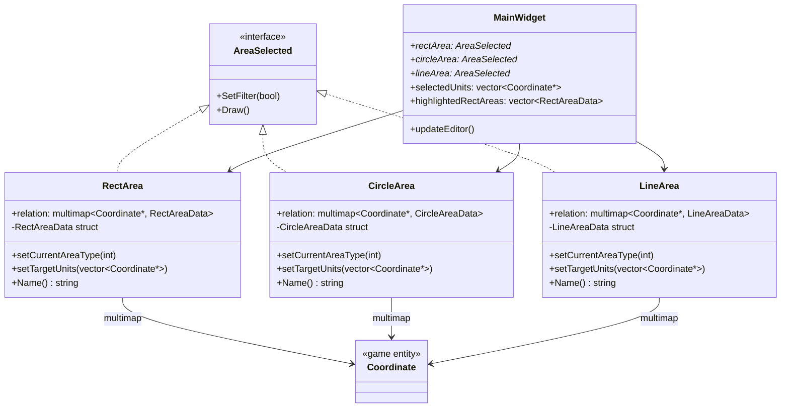
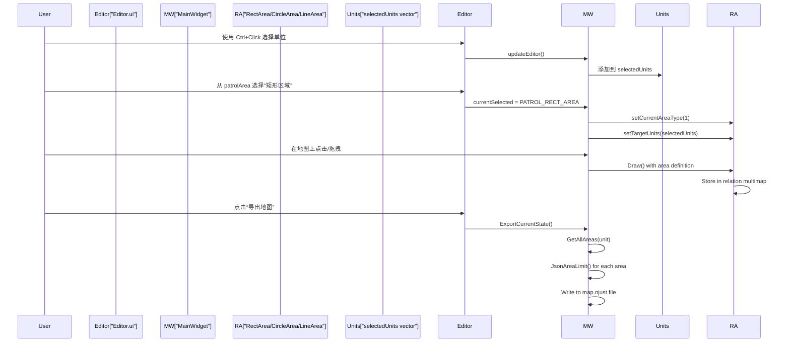
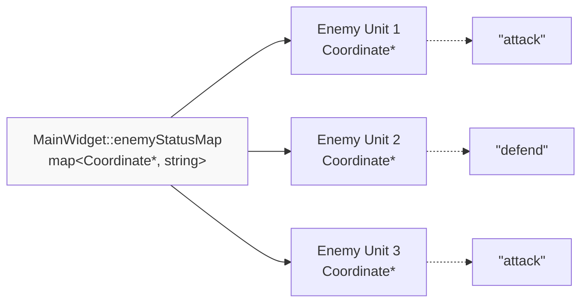
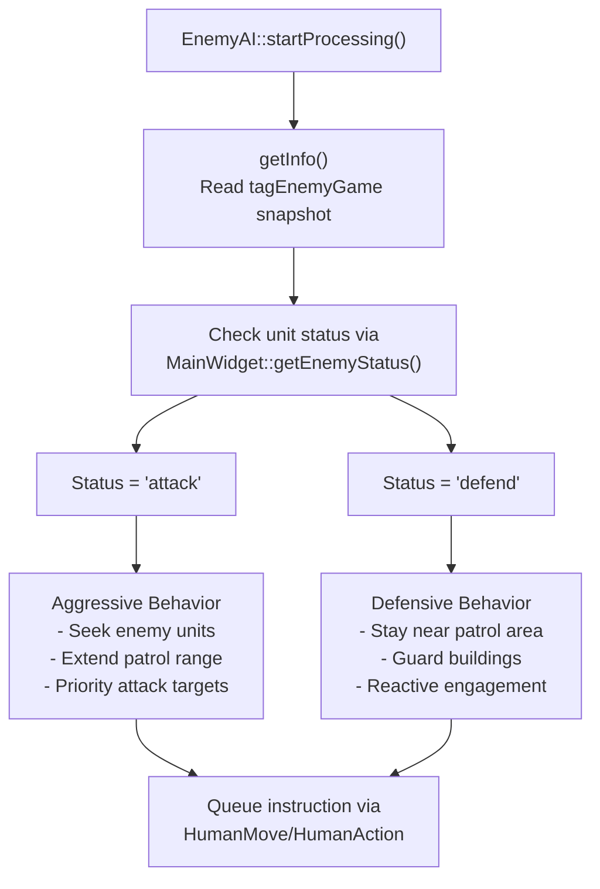
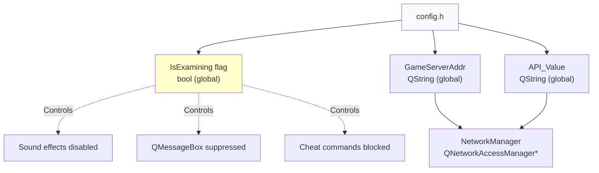
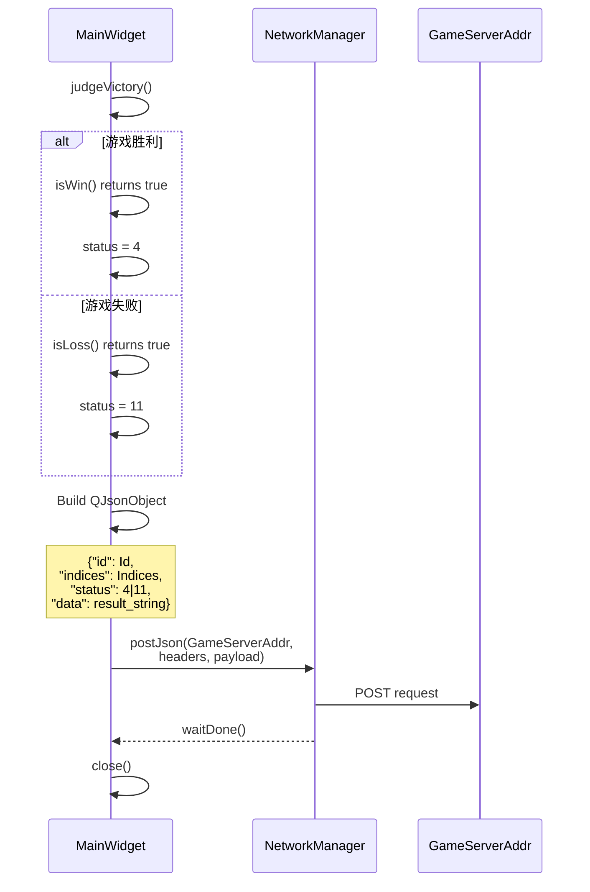
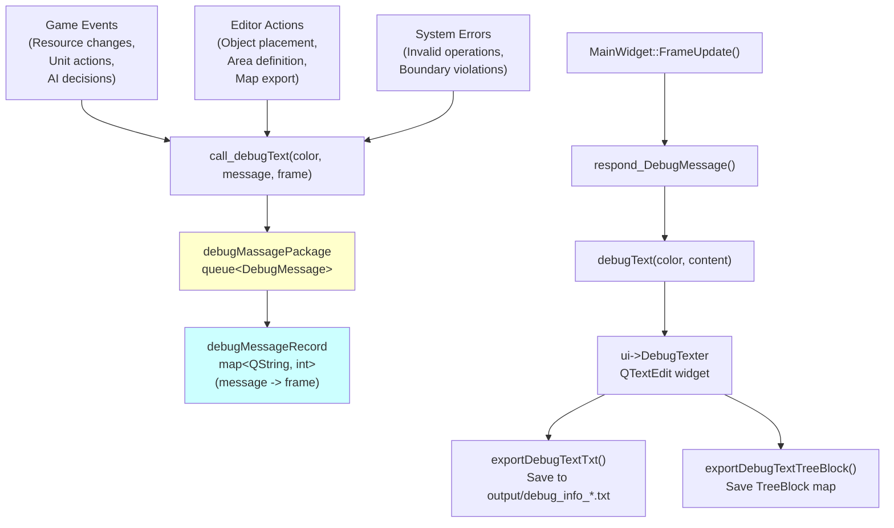
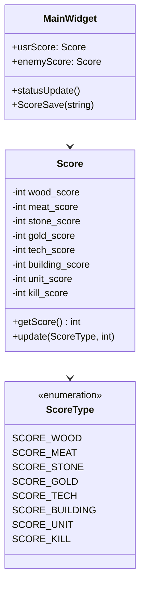
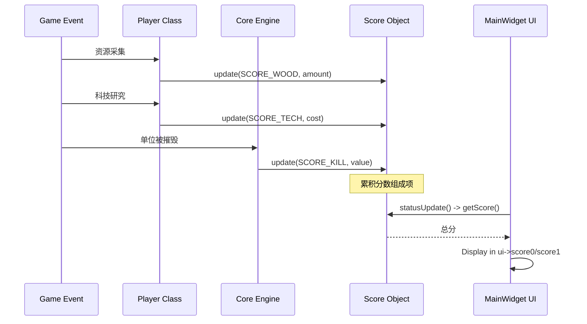

# 高级主题

<details>
<summary>相关源文件</summary>

以下文件被用作生成本 wiki 页面的上下文：

- [MainWidget.cpp](MainWidget.cpp)
- [MainWidget.h](MainWidget.h)

</details>


本节记录了 new-aoe 代码库中超出核心游戏机制之外的专用功能和开发工具。这些系统支持地图编辑、AI 行为配置、调试、网络集成和游戏评估。核心游戏系统已在 [Game Mechanics](#3) 和 [AI System](#5) 中介绍，而本节重点关注支持复杂场景设计和系统监控的工具链与高级配置能力。

有关基础编辑器功能（地形修改、对象放置），请参见 [Map Editor](#4.2)。有关 AI 命令处理，请参见 [AI Architecture](#5.1)。

---

## 7.1 区域管理系统

区域管理系统允许地图设计者为单位定义空间约束和巡逻区域。系统支持三种几何图元：矩形、圆形和折线。这些区域既可以作为单位主动移动的**巡逻区**（beatarea），也可以作为限制移动范围的**限制区**（arealimit）。

### 区域类层次结构



### 区域数据结构

每种区域类型都存储其几何信息和分类信息：

| 区域类型 | 几何字段 | 区域分类 |
|-----------|----------------|---------------------|
| **RectAreaData** | `dr`, `ur`, `w`, `h` | `areaType`: 1=Beatarea, 0=AreaLimit |
| **CircleAreaData** | `dr`, `ur`, `rad` | `areaType`: 1=Beatarea, 0=AreaLimit |
| **LineAreaData** | `data`: `[x,y]` 点的 vector | `areaType`: 1=Beatarea, 0=AreaLimit |

`areaType` 字段用于区分巡逻区（1）和移动限制区（0）。该分类在编辑器交互期间设置，并会持久化到导出的地图文件中。

### 编辑器集成工作流



### 全局区域对象管理

系统维护全局区域对象指针，供编辑器访问：

[MainWidget.cpp:14-16]()
```cpp
RectArea* g_rectArea = nullptr;
CircleArea* g_circleArea = nullptr;
LineArea* g_lineArea = nullptr;
```

这些对象会在编辑器模式下初始化，并由 AI 系统引用：

[MainWidget.cpp:2336-2343]()

### 区域导出格式

区域会以 JSON 形式序列化，包含几何信息和分类数据。`ExportCurrentState` 函数支持为单个单位导出多个区域：

[MainWidget.cpp:289-315]()

区域 JSON 结构示例：
```json
{
  "Type": "RectArea",
  "DR": 50,
  "UR": 100,
  "W": 20,
  "H": 15,
  "AreaName": "Beatarea"
}
```

对于具有多个巡逻区域的单位，会使用数组结构：

[MainWidget.cpp:475-481]()

### 区域与单位关系

`relation` multimap 将单位与其区域关联起来，从而支持一对多关系：

[MainWidget.cpp:291-307]()

multimap 结构支持：
- 一个单位拥有多条巡逻路线（例如圆形巡逻 + 备用线性巡逻）
- 高效查找给定单位指针对应的所有区域
- 独立的区域定义，不会干扰单位生命周期

**来源：** [MainWidget.cpp:1-2700](), [MainWidget.h:64-78]()

---

## 7.2 敌方状态与 AI 行为

敌方状态系统允许地图设计者配置 AI 单位的行为模式。每个敌方单位都可以被分配一个状态，用于决定其战术姿态：主动攻击模式或防御警戒模式。

### 敌方状态映射结构



`MainWidget` 中的 `enemyStatusMap` [MainWidget.h:73]() 存储了以单位指针为键的状态字符串。该映射会通过 JSON 导出在不同游戏会话之间持久保存。

### 在编辑器中分配状态

编辑器提供下拉控件用于分配状态：

[MainWidget.cpp:257-267]()

编辑器组合框会发出信号，将 `currentSelected` 设置为 `ENEMY_STATUS_ATTACK` 或 `ENEMY_STATUS_DEFEND`。当用户在地图上点击单位时，`handleEnemyStatusSelection` 会将该状态关联到单位：

[MainWidget.cpp:711-715]()

### 状态持久化

敌方状态会在保存地图时与单位数据一并导出：

[MainWidget.cpp:493-497]()

具有状态的单位 JSON 格式如下：
```json
{
  "DR": 1500,
  "UR": 2000,
  "Num": 42,
  "Sort": "Army",
  "Own": "LZ",
  "statu": "attack"
}
```

注意：出于历史兼容性考虑，JSON 格式中的字段名为 `"statu"`，而不是 `"status"`。

### 状态对 AI 的影响

状态值会通过以下流程影响 AI 决策：



AI 通过 `MainWidget::getEnemyStatus()` [MainWidget.h:50]() 查询单位状态，并相应调整其指令生成方式。攻击状态的单位优先执行进攻动作，而防御状态的单位会维持更紧凑的巡逻范围。

### 调试可视化

在地图导出期间，状态分配会记录到调试控制台中：

[MainWidget.cpp:496]()

这为地图设计者提供了即时反馈，用于确认状态配置。

**来源：** [MainWidget.cpp:257-267,493-497,711-715](), [MainWidget.h:49-50,72-73]()

---

## 7.3 网络与考试模式

网络与考试模式系统支持对游戏场景进行远程评估和自动化测试。当 `IsExamining` 为 true 时，游戏会以受限模式运行，禁用作弊、抑制 UI 对话框，并将游戏状态上报到外部评估服务器。

### 考试模式配置



全局标志 `IsExamining`（定义于 config.h/GlobalVariate）控制多个行为分支：

| 受影响系统 | 普通模式 | 考试模式 |
|----------------|-------------|-----------|
| **声音** | 启用 | 禁用 [MainWidget.cpp:2152,2157]() |
| **胜利对话框** | 显示 QMessageBox | 自动关闭 [MainWidget.cpp:2125,2141]() |
| **资源作弊** | 启用 | 禁止 [MainWidget.cpp:2437]() |
| **调试控制台** | 可见 | 隐藏 |
| **BGM** | 播放 | 静音 [MainWidget.cpp:2451]() |

### 网络上报协议

当满足游戏结束条件时，系统会将结果上报到评估服务器：

[MainWidget.cpp:2364-2377]()

`HandleGameOver` 函数会构建包含游戏结果的 JSON 负载：



### JSON 负载结构

发送的 JSON 包含：

```json
{
  "id": "student_id_string",
  "indices": "scenario_indices",
  "status": 4,  // 4=win, 11=loss
  "data": "游戏胜利" or "CurrentStatus details"
}
```

`api` 参数通过 HTTP headers 发送：`{{"api", API_Value}}`

当 `status=11`（失败条件）时，`Core::GetCurrentStatus()` 方法会提供详细的失败原因。

### 考试模式限制

考试模式通过条件检查实施限制：

**声音抑制：**
[MainWidget.cpp:2152]()

**防作弊：**
[MainWidget.cpp:2437]()

**对话框自动处理：**
[MainWidget.cpp:2125,2141]()

这些限制确保评估过程公平，且无需人工干预或利用漏洞。

**来源：** [MainWidget.cpp:2125,2141,2152,2157,2364-2377,2437,2451]()

---

## 7.4 调试与日志系统

调试与日志系统在开发和测试期间提供实时反馈。它具备颜色编码消息、消息过滤以及用于赛后分析的导出功能。

### 调试消息流水线



### 消息记录与去重

`debugMessageRecord` 映射 [MainWidget.cpp:2460]() 跟踪每条唯一消息上次显示的时间，从而防止消息刷屏：

[MainWidget.cpp:2468-2472]()

超过 200 帧的旧消息会被自动清理，以维护最近调试输出的滑动窗口。

### 颜色编码消息系统

`debugText` 函数使用 HTML 颜色代码格式化消息：

[MainWidget.cpp:2475-2489]()

| 颜色 | 宏 | 使用场景 | 示例 |
|-------|-------|----------|---------|
| **蓝色** | `COLOR_BLUE` | 系统事件 | "游戏开始", "游戏胜利" |
| **红色** | `COLOR_RED` | 错误 | "错误：位置超出地图范围" |
| **绿色** | `COLOR_GREEN` | 成功 | "导出地图", "已添加巡逻区域" |
| **黑色** | `COLOR_BLACK` | 通用信息 | 中性状态更新 |
| **黄色** | (extended) | 警告 | "找到 N 个区域" |
| **青色** | (extended) | 详细信息 | 单位处理细节 |
| **品红色** | (extended) | 调试跟踪 | 区域名称日志 |

扩展颜色（黄色、青色、品红色）用于地图导出期间的详细日志记录 [MainWidget.cpp:441,447,455,462]()。

### 消息队列处理

`call_debugText` 函数（定义于 GlobalVariate）将消息加入队列：

```cpp
struct DebugMessage {
    QString color;
    QString content;
    int frame;
};
queue<DebugMessage> debugMassagePackage;
```

消息会在 `respond_DebugMessage()` 中出队：

[MainWidget.cpp:2462-2466]()

### 导出功能

**文本导出：**
[MainWidget.cpp:2525-2558]()

创建带时间戳的文件：`output/debug_info_YYYY-MM-DD_hh-mm-ss.txt`

**TreeBlock 导出：**
[MainWidget.cpp:2496-2523]()

将 `Map::TreeBlock` 可见性网格导出为文本矩阵，可用于调试战争迷雾和树木遮挡。玩家位置标记为 `3`，树木标记为 `1`，开放区域标记为 `0`。

**清理操作：**
- `clearDebugText()` [MainWidget.cpp:2491-2494]() - 清空 UI 控件
- `clearDebugTextFile()` [MainWidget.cpp:2560-2581]() - 删除 `output/` 目录中的所有文件

### 代码库中的使用示例

**编辑器反馈：**
[MainWidget.cpp:157]()
```cpp
call_debugText("green", " 导出地图", 0);
```

**地形校验：**
[MainWidget.cpp:1191-1193]()
```cpp
call_debugText("red", " 错误：位置超出地图范围", 0);
```

**区域导出进度：**
[MainWidget.cpp:441,466,481]()

第三个参数（帧号）通常为 `0`，表示立即显示，也可以设置为按游戏帧过滤消息。

**来源：** [MainWidget.cpp:157,441,447,455,462,466,481,1191-1193,2460-2489,2491-2581]()

---

## 7.5 评分系统

评分系统从多个维度跟踪玩家表现：资源采集、科技研究、军事生产和战斗效果。分数会在游戏过程中持续计算，并导出用于赛后分析。

### 分数结构



全局分数实例声明如下：

[MainWidget.cpp:30-31]()
```cpp
extern Score usrScore;
extern Score enemyScore;
```

### 分数组成

| 组成部分 | 描述 | 权重因子 |
|-----------|-------------|---------------|
| **wood_score** | 木材总采集量 | 1x 资源值 |
| **meat_score** | 食物总采集量 | 1x 资源值 |
| **stone_score** | 石料总采集量 | 1x 资源值 |
| **gold_score** | 黄金总采集量 | 2x 资源值 |
| **tech_score** | 已研究科技 | 基于科技消耗 |
| **building_score** | 已建造建筑 | 基于建筑消耗 |
| **unit_score** | 已训练军事单位 | 基于单位消耗 |
| **kill_score** | 已消灭敌方单位 | 基于敌方单位价值 |

`getScore()` 方法会按适当权重汇总所有组成部分。

### 分数更新流程



### 分数显示

分数会在 UI 中以颜色编码方式显示：

[MainWidget.cpp:2059-2066]()

玩家分数显示为蓝色（`#00007f`），敌方分数显示为红色（`#aa0000`）。

### 分数持久化

游戏结束时，分数会被保存到 `GameScore.txt`：

[MainWidget.cpp:2347-2362]()

文件格式：
```
<gameResult> <score> <time_seconds>
```

输出示例：
```
Victory 8523 1847
```

其中：
- `gameResult`：表示胜负结果的字符串
- `score`：来自 `usrScore.getScore()` 的总分
- `time_seconds`：来自 `SelectWidget::getSecend()` 的游戏持续时间

### 分数与胜利条件的集成

分数会显示在胜利/失败消息中：

[MainWidget.cpp:2122,2138]()

无论玩家胜负如何，最终分数都会为玩家提供其表现的量化反馈。

### 网络上报

在考试模式下，最终分数会包含在网络负载中：

[MainWidget.cpp:2364-2377]()

虽然当前实现发送的是胜负状态，但分数值也可以包含在 `data` 字段中，用于详细的表现分析。

**来源：** [MainWidget.cpp:30-31,2059-2066,2122,2138,2347-2362,2364-2377]()