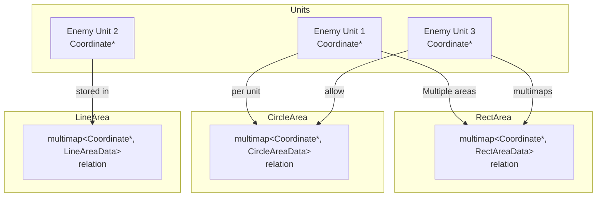
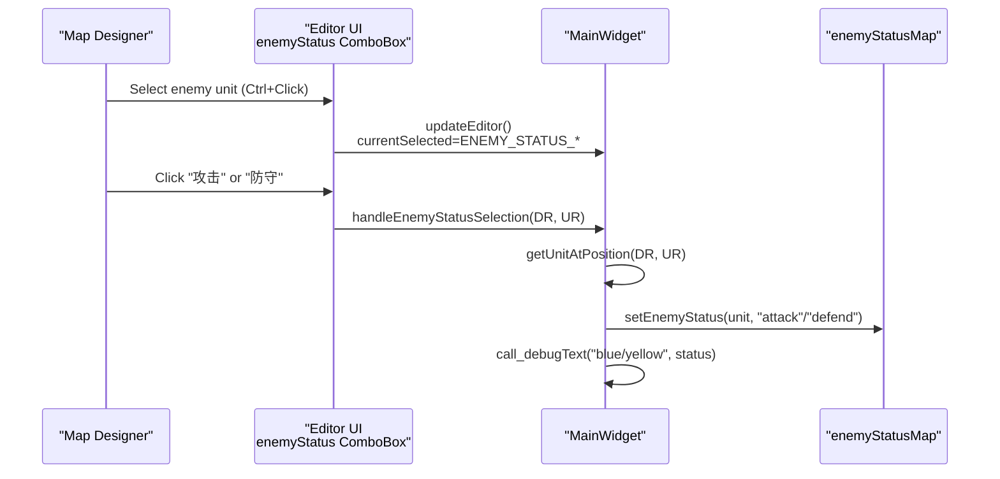
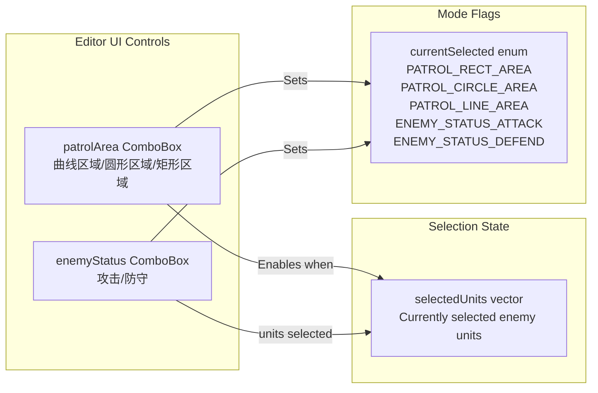
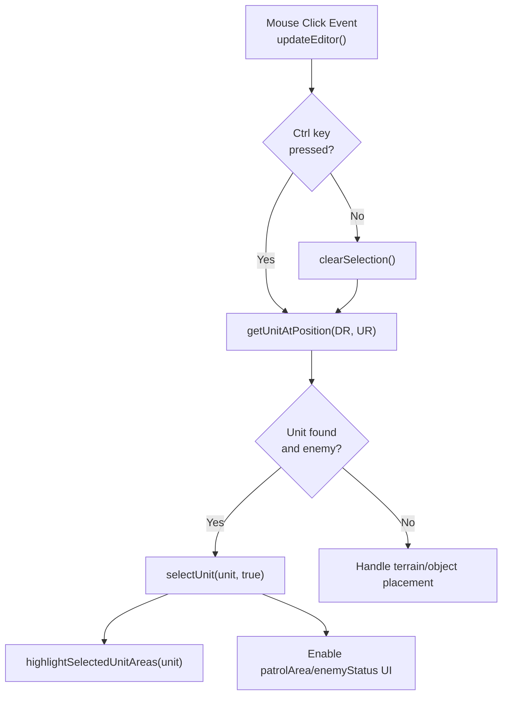
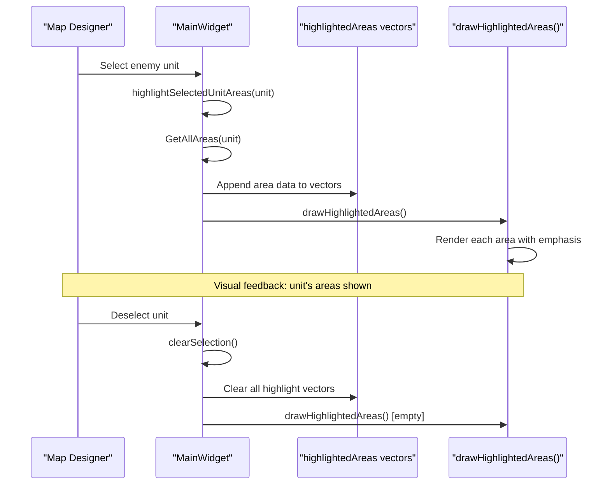
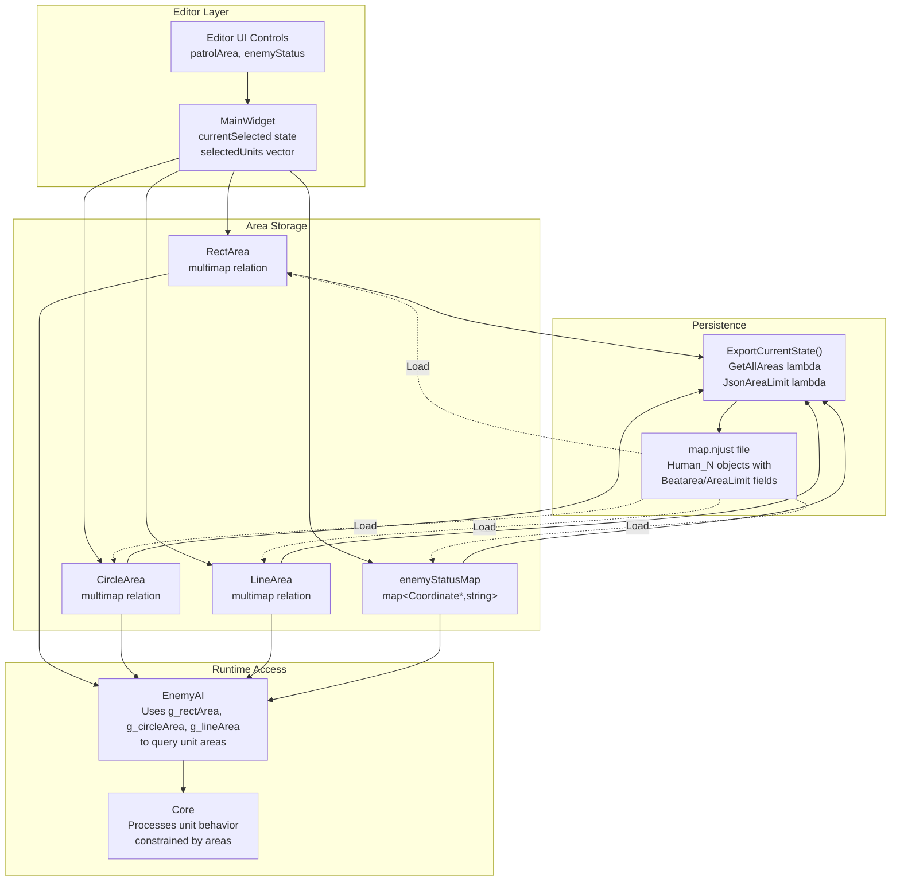

# 区域管理系统

<details>
<summary>相关源文件</summary>

以下文件被用作生成此 wiki 页面时的上下文：

- [Editor.ui](Editor.ui)
- [MainWidget.cpp](MainWidget.cpp)
- [MainWidget.h](MainWidget.h)

</details>


区域管理系统为地图编辑器中的单位行为区域定义提供了空间控制机制。该系统允许地图设计者通过几何形状（矩形、圆形和曲线路径）来约束敌方单位的移动模式并定义巡逻路线。有关地图编辑器的其他功能，如地形修改和对象放置，请参见 [地图编辑器](#4.2)。有关响应这些区域的 AI 行为实现，请参见 [AI 架构](#5.1)。

---

## 概述

区域管理系统由三种几何区域类型组成，这些区域可以与单位（通常是敌方单位）关联，以控制其空间行为。每个单位都可以被分配多个不同类型的区域，这些关系存储在 multimap 数据结构中，以便在游戏过程中高效查询，并在地图导出时进行序列化。

**来源：** [MainWidget.cpp:8-16](), [MainWidget.h:64-78]()

---

## 区域类型类

系统提供了三种几何原语来定义空间区域：

| 类 | 形状 | 主要使用场景 | 数据结构 |
|-------|-------|------------------|----------------|
| `RectArea` | 矩形 | 简单巡逻区域、建筑防御边界 | `RectAreaData`: DR, UR, width, height |
| `CircleArea` | 圆形 | 径向巡逻区域、点防御 | `CircleAreaData`: DR, UR, radius |
| `LineArea` | 曲线路径 | 复杂巡逻路线、航点路径 | `LineAreaData`: [x,y] 坐标对的 vector |

### 全局区域对象

系统全局实例化了三个单例区域对象，用于管理编辑器的区域创建工作流：

```cpp
RectArea* g_rectArea = nullptr;
CircleArea* g_circleArea = nullptr;
LineArea* g_lineArea = nullptr;
```

这些对象在 `MainWidget` 构造期间初始化，并在整个编辑器会话期间持续存在。

**来源：** [MainWidget.cpp:14-16](), [MainWidget.h:271-273]()

---

## 区域与单位关系架构

### 关系存储

每种区域类型都维护一个 multimap，将 `Coordinate*` 单位指针与区域数据关联起来：



**图示：允许每个单位拥有多个区域的区域-单位 multimap 关系**

multimap 结构允许单个单位关联多个相同类型或不同类型的区域。例如，一个敌方士兵可以同时拥有一个矩形限制区域（不能离开堡垒）和一个圆形巡逻区域（在庭院周围巡逻）。

**来源：** [MainWidget.cpp:289-308]()

### 查询单位的所有区域

`ExportCurrentState` 中的 `GetAllAreas` lambda 展示了如何检索与某个单位关联的所有区域：

```cpp
auto GetAllAreas=[&](Coordinate*obj)->vector<pair<string,void*>>{
    vector<pair<string,void*>> areas;
    auto&lineR=((LineArea*)(lineArea))->relation;
    auto&circleR=((CircleArea*)(circleArea))->relation;
    auto&rectR=((RectArea*)(rectArea))->relation;
    
    // Query each multimap using equal_range
    for(auto it = lineR.equal_range(obj); it.first != it.second; ++it.first) {
        areas.push_back({LineArea::Name(), &(it.first->second)});
    }
    for(auto it = circleR.equal_range(obj); it.first != it.second; ++it.first) {
        areas.push_back({CircleArea::Name(), &(it.first->second)});
    }
    for(auto it = rectR.equal_range(obj); it.first != it.second; ++it.first) {
        areas.push_back({RectArea::Name(), &(it.first->second)});
    }
    return areas;
};
```

**来源：** [MainWidget.cpp:289-308]()

---

## 区域类别：Beatarea 与 AreaLimit

每个区域实例都有一个 `areaType` 字段，用于区分其语义用途：

| 类型值 | 类别名称 | 用途 | 可视颜色 |
|------------|---------------|---------|--------------|
| `1` | **Beatarea**（巡逻区域） | 定义单位主动移动的巡逻路线 | 蓝色 |
| 其他 | **AreaLimit**（限制区域） | 定义单位无法离开的移动约束 | 默认 |

### 设置区域类型

当编辑器用户选择巡逻区域模式时，会配置区域类型：

```cpp
if (text == "矩形区域") {
    this->currentSelected = PATROL_RECT_AREA;
    ((RectArea*)rectArea)->setCurrentAreaType(1);  // 1 = patrol area (blue)
    ((RectArea*)rectArea)->setTargetUnits(selectedUnits);
}
```

### JSON 导出格式

在地图导出期间，`areaType` 决定 JSON 字段名：

```cpp
QString areaName = (d.areaType == 1) ? "Beatarea" : "AreaLimit";
json.insert("AreaName", areaName);
```

对于拥有多个区域的单位，导出系统会创建独立的 JSON 数组：

- **单个区域：** 存储为 `"Beatarea"` 或 `"AreaLimit"` 对象
- **多个区域：** 存储为 `"BeatAreas"` 或 `"AreaLimits"` 数组

**来源：** [MainWidget.cpp:236-255](), [MainWidget.cpp:334-361](), [MainWidget.cpp:474-490]()

---

## 敌方状态系统

敌方状态系统与区域协同工作，用于定义 AI 行为模式。每个敌方单位都可以被分配一个状态，以影响其战术决策。

### 状态映射结构

```cpp
std::map<Coordinate*, string> enemyStatusMap;  // In MainWidget
```

### 状态值

| 状态字符串 | 行为模式 | 描述 |
|---------------|---------------|-------------|
| `"attack"` | 进攻型 | 单位会主动寻找并攻击目标 |
| `"defend"` | 防守型 | 单位坚守当前位置，只攻击附近威胁 |

### 编辑器工作流



**图示：编辑器中的敌方状态分配工作流**

### 状态分配与获取

```cpp
// Setting status
void MainWidget::setEnemyStatus(Coordinate* unit, const string& status) {
    if (unit) {
        enemyStatusMap[unit] = status;
    }
}

// Retrieving status
string MainWidget::getEnemyStatus(Coordinate* unit) {
    auto it = enemyStatusMap.find(unit);
    if (it != enemyStatusMap.end()) {
        return it->second;
    }
    return "";  // No status assigned
}
```

### JSON 持久化

敌方状态会与单位数据一起导出：

```cpp
string enemyStatus = getEnemyStatus(human);
if (!enemyStatus.empty()) {
    obj.insert("statu", QString::fromStdString(enemyStatus));
}
```

**来源：** [MainWidget.cpp:258-267](), [MainWidget.cpp:711-715](), [MainWidget.cpp:493-497](), [MainWidget.h:48-50](), [MainWidget.h:73]()

---

## 编辑器 UI 集成

### UI 组件

编辑器提供了专门的控件来管理区域和状态：



**图示：用于区域管理的编辑器 UI 控件关系**

### 控件启用逻辑

`patrolArea` 和 `enemyStatus` 组合框初始为禁用状态，在选中单位后激活：

```cpp
connect(editor->ui->patrolArea, ..., this, [=](const QString& text) {
    if (selectedUnits.empty()) return;  // Disabled if no selection
    // ... handle area creation
});
```

**来源：** [Editor.ui:360-445](), [MainWidget.cpp:236-267]()

---

## 单位选择工作流

### 选择函数

| 函数 | 用途 | 支持多选 |
|----------|---------|---------------------|
| `selectUnit(Coordinate*, bool)` | 将单位加入选择 | `addToSelection=true` 用于 Ctrl+Click |
| `clearSelection()` | 清空 `selectedUnits` vector | N/A |
| `getUnitAtPosition(double, double)` | 在 DR/UR 坐标处查找单位 | 返回第一个匹配项 |

### 选择状态管理

```cpp
void MainWidget::selectUnit(Coordinate* unit, bool addToSelection) {
    if (!addToSelection) {
        clearSelection();  // Single selection: clear previous
    }
    selectedUnits.push_back(unit);
    highlightSelectedUnitAreas(unit);  // Visual feedback
}

void MainWidget::clearSelection() {
    selectedUnits.clear();
    clearHighlightedAreas();
}
```

### 编辑器鼠标事件处理



**图示：编辑器中的单位选择逻辑流程**

**来源：** [MainWidget.cpp:584-603](), [MainWidget.h:191-200]()

---

## 区域高亮系统

### 高亮数据存储

```cpp
// In MainWidget
vector<RectAreaData> highlightedRectAreas;
vector<CircleAreaData> highlightedCircleAreas;
vector<LineAreaData> highlightedLineAreas;
```

这些 vector 存储了区域数据的副本，当单位被选中时，这些区域会以视觉强调的方式渲染出来。

### 高亮工作流



**图示：已选中单位的区域高亮时序**

### 区域渲染

`updateEditor` 函数控制区域可见性：

```cpp
bool isRectAreaActive = (currentSelected == RECT_AREA || currentSelected == PATROL_RECT_AREA);
bool isCircleAreaActive = (currentSelected == CIRCLE_AREA || currentSelected == PATROL_CIRCLE_AREA);
bool isLineAreaActive = (currentSelected == LINE_AREA || currentSelected == PATROL_LINE_AREA);

rectArea->SetFilter(!isRectAreaActive);  // false = visible
rectArea->Draw();
circleArea->SetFilter(!isCircleAreaActive);
circleArea->Draw();
lineArea->SetFilter(!isLineAreaActive);
lineArea->Draw();

drawHighlightedAreas();  // Overlay highlighted areas
```

**来源：** [MainWidget.cpp:726-740](), [MainWidget.h:76-78]()

---

## 区域数据持久化

### JSON 导出结构

导出地图时，每个单位关联的区域都会被序列化为 JSON。导出格式同时支持单个区域（用于向后兼容）和每个单位多个区域。

### 区域序列化格式

#### 矩形区域

```json
{
  "Type": "RectArea",
  "DR": 100,
  "UR": 200,
  "W": 50,
  "H": 30,
  "AreaName": "Beatarea"
}
```

#### 圆形区域

```json
{
  "Type": "CircleArea",
  "DR": 150,
  "UR": 250,
  "R": 75,
  "AreaName": "AreaLimit"
}
```

#### 线/曲线区域

```json
{
  "Type": "LineArea",
  "Point": [
    [100, 200],
    [120, 220],
    [140, 210],
    [160, 230]
  ],
  "AreaName": "Beatarea"
}
```

### 具有多个区域的单位导出

```cpp
for (Human* human : player[1]->human) {
    QJsonObject obj;
    // ... basic unit data ...
    
    auto allAreas = GetAllAreas(human);
    QJsonArray beatAreas;
    QJsonArray limitAreas;
    
    for(auto& areaData : allAreas){
        QJsonObject areaJson = JsonAreaLimit(areaData.first, areaData.second);
        QString areaName = areaJson.value("AreaName").toString();
        
        if(areaName == "Beatarea"){
            beatAreas.append(areaJson);
        } else {
            limitAreas.append(areaJson);
        }
    }
    
    // Single area: use singular field name for compatibility
    // Multiple areas: use plural field name with array
    if(!beatAreas.isEmpty()){
        if(beatAreas.size() == 1){
            obj.insert("Beatarea", beatAreas[0].toObject());
        } else {
            obj.insert("BeatAreas", beatAreas);
        }
    }
    if(!limitAreas.isEmpty()){
        if(limitAreas.size() == 1){
            obj.insert("AreaLimit", limitAreas[0].toObject());
        } else {
            obj.insert("AreaLimits", limitAreas);
        }
    }
    
    root.insert("Human_" + QString::number(Human_idx++), obj);
}
```

**来源：** [MainWidget.cpp:317-363](), [MainWidget.cpp:443-490]()

---

## 区域管理数据流

### 完整系统集成



**图示：从编辑器到运行时的完整区域管理系统数据流**

**来源：** [MainWidget.cpp:8-16](), [MainWidget.cpp:236-267](), [MainWidget.cpp:289-525](), [MainWidget.h:64-78]()

---

## 单位引用清理

当单位被删除时（例如通过 `clearArea` 函数），必须清理它们在区域 multimap 中的引用，以防止悬空指针。

### 清理函数

```cpp
void MainWidget::cleanupUnitReferences(Coordinate* unit) {
    // Remove from selection
    auto it = std::find(selectedUnits.begin(), selectedUnits.end(), unit);
    if (it != selectedUnits.end()) {
        selectedUnits.erase(it);
    }
    
    // Remove from area relations
    ((RectArea*)rectArea)->relation.erase(unit);
    ((CircleArea*)circleArea)->relation.erase(unit);
    ((LineArea*)lineArea)->relation.erase(unit);
    
    // Remove from enemy status map
    enemyStatusMap.erase(unit);
}
```

此函数会在单位删除期间调用，以确保所有区域和状态关联都被正确移除。

**来源：** [MainWidget.cpp:831-833](), [MainWidget.h:43]()

---

## 汇总表

| 组件 | 类型 | 用途 | 关键方法/字段 |
|-----------|------|---------|-------------------|
| `RectArea` | 类 | 矩形区域管理 | `relation` multimap, `setCurrentAreaType()`, `Draw()` |
| `CircleArea` | 类 | 圆形区域管理 | `relation` multimap, `setTargetUnits()`, `Draw()` |
| `LineArea` | 类 | 曲线路径管理 | `relation` multimap, `Draw()` |
| `selectedUnits` | `vector<Coordinate*>` | 跟踪当前选中的单位 | 由 `selectUnit()`、`clearSelection()` 修改 |
| `enemyStatusMap` | `map<Coordinate*, string>` | 存储 attack/defend 状态 | `setEnemyStatus()`、`getEnemyStatus()` |
| `highlighted*Areas` | `vector<*AreaData>` | 为选择提供视觉反馈 | `highlightSelectedUnitAreas()`、`clearHighlightedAreas()` |
| `GetAllAreas` | Lambda 函数 | 查询单位的所有区域 | 返回 `vector<pair<string,void*>>` |
| `JsonAreaLimit` | Lambda 函数 | 将区域序列化为 JSON | 返回 `QJsonObject` |

**来源：** [MainWidget.h:64-78](), [MainWidget.cpp:289-363]()