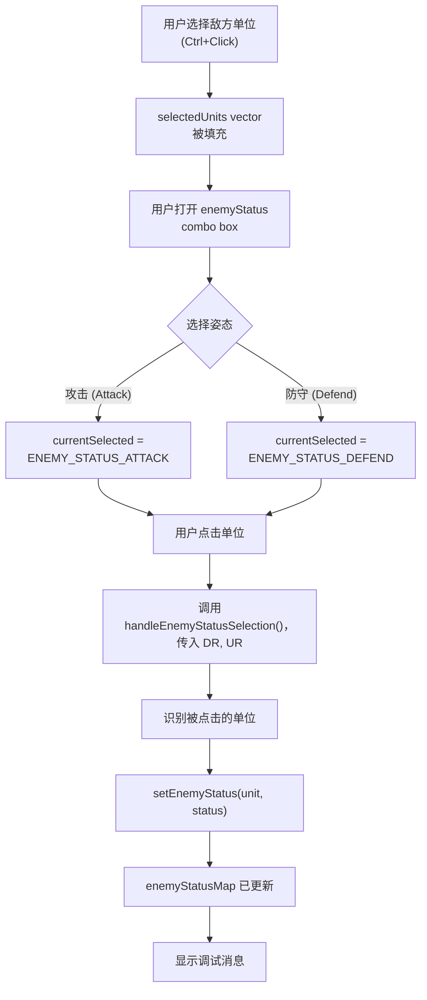
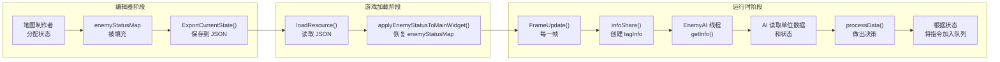
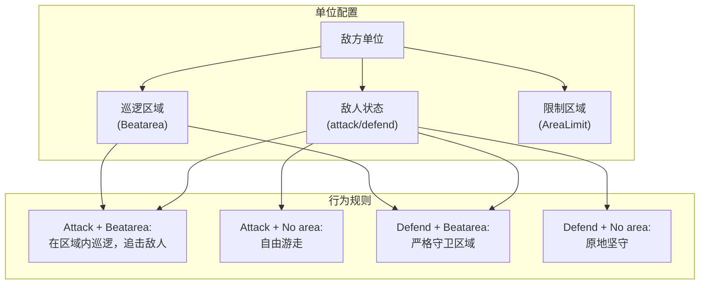
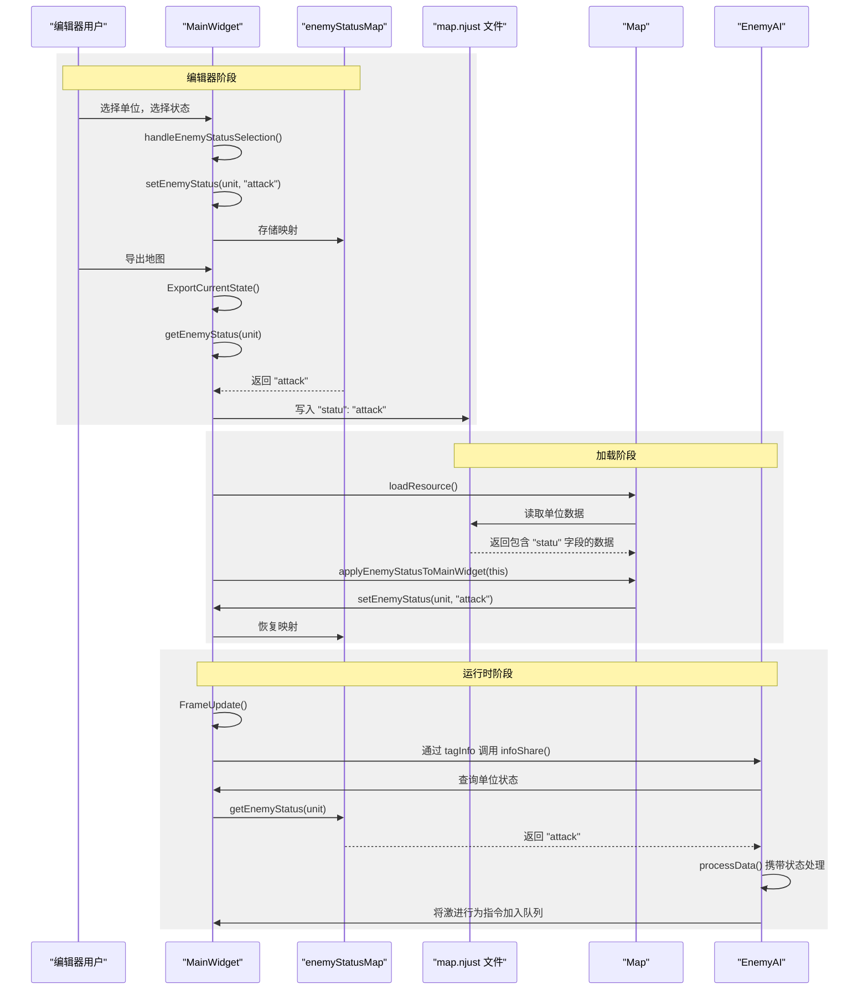

# 敌人状态与 AI 行为

<details>
<summary>相关源文件</summary>

以下文件被用作生成本 wiki 页面时的上下文：

- [Editor.ui](Editor.ui)
- [MainWidget.cpp](MainWidget.cpp)
- [MainWidget.h](MainWidget.h)

</details>


本文档描述了地图编辑器中用于控制 AI 单位行为的敌人状态系统。敌人状态系统允许地图制作者为单个敌方单位分配行为姿态（“attack” 或 “defend”），从而影响 AI 在游戏过程中如何控制这些单位。

有关巡逻区域定义和单位移动限制的信息，请参见 [区域管理系统](#7.1)。有关 AI 架构和命令处理的详细信息，请参见 [AI 架构](#5.1) 和 [指令与命令系统](#5.2)。

---

## 概述

敌人状态系统提供了一种简单但有效的方式，用于按单位自定义 AI 行为。每个敌方单位都可以被分配以下两种状态值之一：

- **攻击**：单位会主动寻找并与玩家单位交战
- **防守**：单位会留在其指定的巡逻区域内，仅与附近威胁交战

该系统已集成到地图编辑器（[地图编辑器](#4.2)）中，并与巡逻区域系统（[区域管理系统](#7.1)）协同工作，以创建多样化且具有策略性的 AI 行为模式。

**关键组件**：

| 组件 | 类型 | 用途 |
|-----------|------|---------|
| `enemyStatusMap` | `std::map<Coordinate*, string>` | 存储每个敌方单位的状态 |
| `enemyStatus` combo box | 编辑器 UI 控件 | 用于分配状态的用户界面 |
| `ENEMY_STATUS_ATTACK` / `ENEMY_STATUS_DEFEND` | 编辑器模式枚举 | 编辑器选择状态 |
| `setEnemyStatus()` / `getEnemyStatus()` | 成员函数 | 状态访问器 |
| `handleEnemyStatusSelection()` | 编辑器处理函数 | 处理状态分配点击 |

来源：[MainWidget.h:73](), [MainWidget.h:126-127](), [MainWidget.h:49-50](), [Editor.ui:412-445]()

---

## 敌人状态类型

系统支持两种行为姿态：

### 攻击姿态

具有 “attack” 状态的单位会表现出进攻性行为：
- 主动在其指定区域内巡逻并搜索目标
- 越过巡逻边界追击已发现的敌人
- 优先执行进攻行动
- 使用完整的战斗能力

### 防守姿态

具有 “defend” 状态的单位会表现出防御性行为：
- 留在巡逻区域边界内
- 仅与进入巡逻区域的敌人交战
- 在威胁消除后返回巡逻区域
- 优先控制区域而非消灭敌人

解释这些状态值的具体 AI 逻辑实现在 `EnemyAI` 类中（[AI 架构](#5.1)）。

来源：[Editor.ui:437-443](), [MainWidget.cpp:258-267]()

---

## 编辑器集成

### 状态分配工作流



来源：[MainWidget.cpp:258-267](), [MainWidget.cpp:711-715](), [MainWidget.cpp:584-603]()

### 编辑器 UI 控件

编辑器提供了一个用于状态分配的下拉框控件：

**位置**：编辑器窗口右侧  
**控件名称**：`enemyStatus`  
**UI 文件**：[Editor.ui:412-445]()  
**选项**：
- “敌人状态”（默认/占位）
- “攻击”（Attack）
- “防守”（Defend）

该下拉框初始状态为禁用，在选中敌方单位后会启用。

**信号连接** [MainWidget.cpp:258-267]():
```cpp
connect(editor->ui->enemyStatus, QOverload<const QString&>::of(&QComboBox::currentIndexChanged), 
    this, [=](const QString& text) {
        if (text == "攻击") {
            this->currentSelected = ENEMY_STATUS_ATTACK;
            call_debugText("blue", " 敌人状态: 攻击模式", 0);
        }
        else if (text == "防守") {
            this->currentSelected = ENEMY_STATUS_DEFEND;
            call_debugText("yellow", " 敌人状态: 防守模式", 0);
        }
    });
```

来源：[Editor.ui:412-445](), [MainWidget.cpp:258-267]()

---

## 数据存储与持久化

### 运行时存储

敌人状态存储在 `MainWidget` 实例中：

**数据结构**：`std::map<Coordinate*, string> enemyStatusMap` [MainWidget.h:73]()

**键**：敌方单位指针（`Coordinate*`）  
**值**：状态字符串（“attack” 或 “defend”）

### 状态访问器函数

**设置状态** [MainWidget.h:49]():
```cpp
void setEnemyStatus(Coordinate* unit, const string& status);
```

**获取状态** [MainWidget.h:50]():
```cpp
string getEnemyStatus(Coordinate* unit);
```

这些函数为 `enemyStatusMap` 提供了封装访问，从而确保整个代码库中的状态管理保持一致。

来源：[MainWidget.h:73](), [MainWidget.h:49-50]()

### JSON 导出格式

导出地图时，敌人状态会保存到每个敌方单位的 JSON 结构中：

**导出代码** [MainWidget.cpp:492-497]():
```cpp
// 添加敌人状态属性
string enemyStatus = getEnemyStatus(human);
if (!enemyStatus.empty()) {
    obj.insert("statu", QString::fromStdString(enemyStatus));
    call_debugText("blue", QString("已保存敌人状态: %1")
        .arg(QString::fromStdString(enemyStatus)).toStdString().c_str(), 0);
}
```

**JSON 结构**：
```json
{
  "Human_0": {
    "DR": 1200,
    "UR": 1500,
    "Num": 50,
    "Sort": "Army",
    "Own": "LZ",
    "statu": "attack",
    "Beatarea": { ... }
  }
}
```

**字段**：`"statu"`（注意：不是 `"status"`）  
**值**：`"attack"` 或 `"defend"`  
**适用对象**：仅敌方单位（Own = "LZ"）

来源：[MainWidget.cpp:492-497]()

### 地图加载

当在编辑器模式下加载地图时，会从 JSON 应用状态：

**初始化** [MainWidget.cpp:1414-1416]():
```cpp
// 应用从地图文件中读取的敌人状态
if (EditorMode) {
    map->applyEnemyStatusToMainWidget(this);
}
```

`Map::applyEnemyStatusToMainWidget()` 函数会从加载的 JSON 数据中读取 `"statu"` 字段，并通过为每个敌方单位调用 `setEnemyStatus()` 来填充 `enemyStatusMap`。

来源：[MainWidget.cpp:1414-1416]()

---

## AI 行为集成

### 从编辑器到 AI 的数据流



来源：[MainWidget.cpp:492-497](), [MainWidget.cpp:1414-1416]()

### 状态对 AI 决策的影响

敌人状态值通过游戏状态快照系统（[AI 架构](#5.1)）影响 AI 行为：

**状态共享过程**：
1. 每一帧中，`MainWidget::FrameUpdate()` 调用 `infoShare()`
2. `infoShare()` 创建 `tagEnemyGame` 和 `tagInfo` 快照
3. `EnemyAI::getInfo()` 读取这些快照
4. AI 通过 `getEnemyStatus()` 从 `enemyStatusMap` 访问单位状态
5. `EnemyAI::processData()` 根据状态做出决策

**攻击状态行为**：
- AI 生成更激进的巡逻模式
- 单位会追击已发现的敌人
- 优先进攻型指令（HumanMove、HumanAction）
- 战斗期间可能离开巡逻区域

**防守状态行为**：
- AI 生成更保守的巡逻模式
- 单位停留在巡逻区域边界内
- 仅对威胁作出反应，但不会主动追击
- 交战后返回巡逻区域

来源：[MainWidget.cpp:492-497](), [MainWidget.h:73]()

---

## 与巡逻区域的交互

敌人状态与巡逻区域（[区域管理系统](#7.1)）协同工作，以定义完整的单位行为：

### 组合系统概览



来源：[MainWidget.cpp:444-490](), [MainWidget.cpp:492-497]()

### 行为矩阵

| 状态 | 巡逻区域 | 限制区域 | 最终行为 |
|--------|-------------|------------|-------------------|
| Attack | Yes | No | 主动在区域内巡逻，并在区域外追击敌人 |
| Attack | Yes | Yes | 在限制范围内巡逻，并追击敌人至限制边界 |
| Attack | No | No | 自由游走的进攻性行为 |
| Defend | Yes | No | 守卫巡逻区域，不会越界追击 |
| Defend | Yes | Yes | 守卫巡逻区域，并遵守限制边界 |
| Defend | No | No | 坚守初始位置，移动极少 |

巡逻区域系统在 multimap 中存储区域定义（[区域管理系统](#7.1)）：
- `RectArea::relation` - 矩形巡逻区域
- `CircleArea::relation` - 圆形巡逻区域  
- `LineArea::relation` - 线性巡逻路径

每个区域都会被标记为 `areaType = 1`（巡逻/Beatarea）或 `areaType = 0`（限制/AreaLimit）。敌人状态会修改单位利用这些区域的积极程度。

来源：[MainWidget.cpp:335-360](), [MainWidget.cpp:444-490]()

---

## 实现细节

### 状态分配处理函数

`handleEnemyStatusSelection()` 函数会在状态分配模式下处理编辑器点击：

**函数签名** [MainWidget.h:203]():
```cpp
void handleEnemyStatusSelection(double DR, double UR);
```

**调用位置** [MainWidget.cpp:711-715]():
```cpp
case ENEMY_STATUS_ATTACK:
case ENEMY_STATUS_DEFEND:
    // 处理敌人状态选择
    handleEnemyStatusSelection(DR, UR);
    break;
```

**预期实现流程**：
1. 转换细节坐标（DR、UR）以识别被点击的单位
2. 调用 `getUnitAtPosition(DR, UR)` 查找光标下的单位
3. 验证该单位属于敌方玩家（playerRepresent == 1）
4. 根据 `currentSelected` 确定状态字符串：
   - `ENEMY_STATUS_ATTACK` → `"attack"`
   - `ENEMY_STATUS_DEFEND` → `"defend"`
5. 调用 `setEnemyStatus(unit, statusString)`
6. 通过 `call_debugText()` 显示确认信息

来源：[MainWidget.cpp:711-715](), [MainWidget.h:203]()

### 用于状态分配的单位选择

必须先选中敌方单位，才能分配状态：

**选择代码** [MainWidget.cpp:584-603]():
```cpp
// 使用Qt的键盘状态检测Ctrl键
bool isCtrlPressed = QApplication::keyboardModifiers() & Qt::ControlModifier;
Coordinate* clickedUnit = getUnitAtPosition(DR, UR);

// 如果点击了敌方单位，且当前没有选择特定的编辑工具，则进行单位选择
if (clickedUnit && clickedUnit->getPlayerRepresent() == 1 && 
    (currentSelected == DELETEOBJECT || currentSelected == FLAT || 
     currentSelected == OCEAN || currentSelected == HIGHTERLAND || 
     currentSelected == LOWERLAND || currentSelected == PATROL_RECT_AREA || 
     currentSelected == PATROL_CIRCLE_AREA || currentSelected == PATROL_LINE_AREA ||
     currentSelected == NORMAL_MOUSE)) {
    
    selectUnit(clickedUnit, isCtrlPressed);
    return;  // 不执行后面的创建对象逻辑
}
```

**选择存储** [MainWidget.h:70]():
```cpp
vector<Coordinate*> selectedUnits;  // 当前选中的单位
```

可以使用 Ctrl+Click 管理已选中的单位，实现类似标准 RTS 控制的多选功能。

来源：[MainWidget.cpp:584-603](), [MainWidget.h:70]()

### 状态持久化流程图



来源：[MainWidget.cpp:492-497](), [MainWidget.cpp:1414-1416](), [MainWidget.h:49-50](), [MainWidget.h:73]()

---

## 调试与可视化

### 状态分配反馈

分配状态时，调试消息会提供可视化确认：

**攻击状态** [MainWidget.cpp:260-262]():
```cpp
call_debugText("blue", " 敌人状态: 攻击模式", 0);
```

**防守状态** [MainWidget.cpp:264-266]():
```cpp
call_debugText("yellow", " 敌人状态: 防守模式", 0);
```

**导出确认** [MainWidget.cpp:496]():
```cpp
call_debugText("blue", QString("已保存敌人状态: %1")
    .arg(QString::fromStdString(enemyStatus)).toStdString().c_str(), 0);
```

这些消息会出现在游戏内调试控制台（[调试与日志系统](#7.4)）中，并使用颜色编码以便于识别。

来源：[MainWidget.cpp:260-266](), [MainWidget.cpp:496]()

---

## 总结

敌人状态系统提供了一种直接的机制来定制 AI 行为：

1. **两种状态类型**：“attack”（激进）和 “defend”（保守）
2. **编辑器集成**：通过下拉框 UI 按单位分配状态
3. **数据持久化**：存储于 `enemyStatusMap` 和 JSON 的 `"statu"` 字段中
4. **AI 集成**：状态会影响 `EnemyAI::processData()` 中的决策
5. **区域协同**：与巡逻区域配合以创建复杂行为模式

该系统使地图制作者无需修改 AI 代码即可设计多样化的敌人遭遇场景，支持从激进突袭到防守坚守等多种情境。

来源：[MainWidget.h:73](), [MainWidget.cpp:258-267](), [MainWidget.cpp:492-497](), [Editor.ui:412-445]()