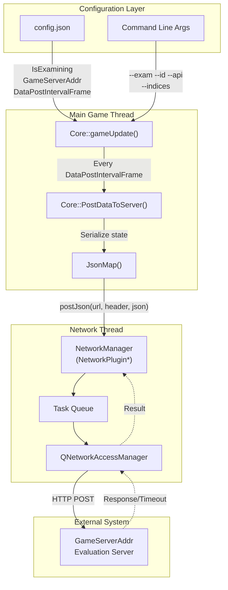
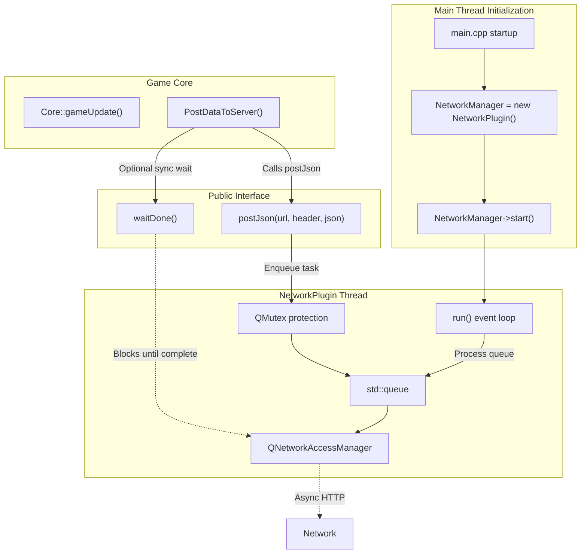
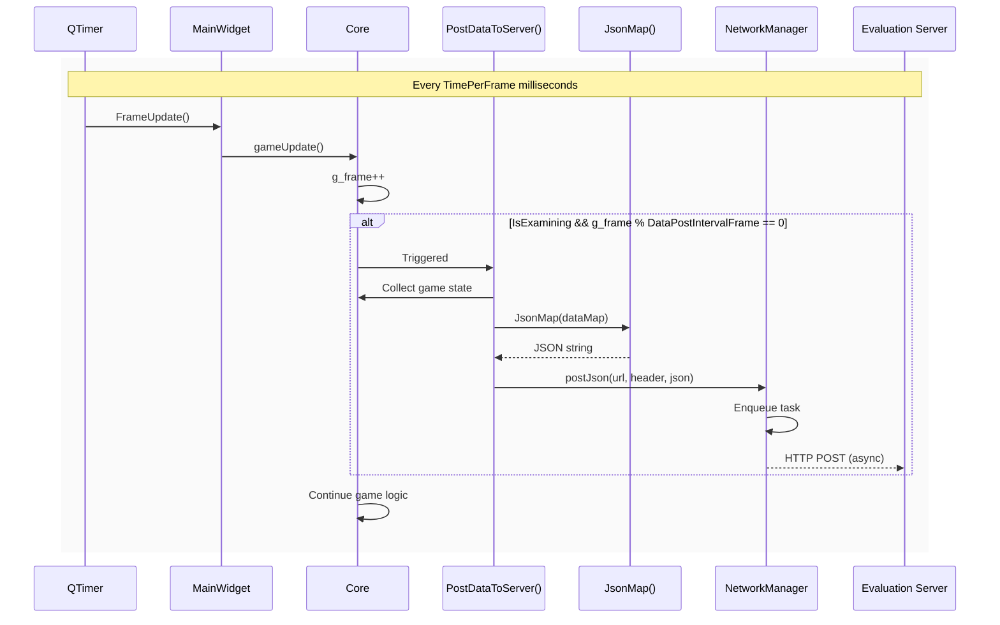
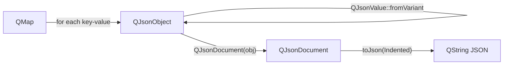
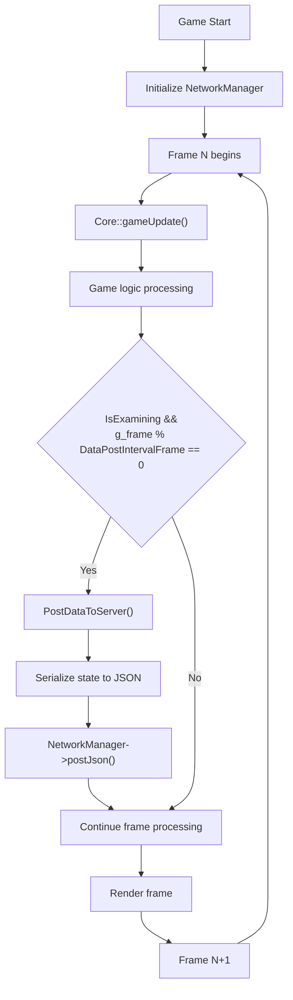
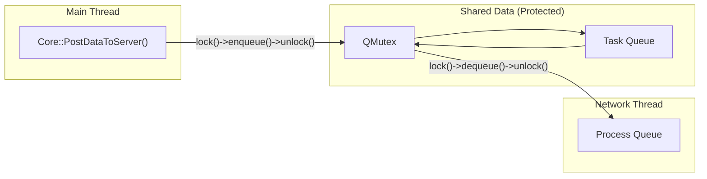

# 网络与考试模式

<details>
<summary>相关源文件</summary>

以下文件被用作生成此 wiki 页面时的上下文：

- [GlobalVariate.cpp](GlobalVariate.cpp)
- [GlobalVariate.h](GlobalVariate.h)
- [README.md](README.md)
- [config.json](config.json)

</details>


## 目的与范围

本文档描述了网络集成与考试模式子系统，该子系统支持对游戏会话进行自动评估和外部监控。此功能允许游戏定期向 HTTP 评估服务器发送状态快照，支持学生 AI 评分、赛事监控和远程评测等使用场景。

有关生成被评估游戏行为的 AI 系统信息，请参见 [5.1](#5.1) AI Architecture。有关如何捕获游戏状态并与外部系统共享的详细信息，请参见 [5.2](#5.2) Instruction and Command System。

---

## 系统概览

网络与考试模式系统由三个主要组件构成：

1. **配置标志**，用于控制何时以及如何发送数据
2. **NetworkPlugin** - 一个管理 HTTP 请求的独立线程
3. **核心集成**，用于定期序列化游戏状态并将其发送到服务器



**来源：** [config.json:1-6](), [GlobalVariate.h:501-508](), [GlobalVariate.cpp:14-17](), [README.md:134-137]()

---

## 配置参数

考试模式由从 `config.json` 和命令行参数中加载的若干配置参数控制。

### config.json 参数

| 参数 | 类型 | 默认值 | 说明 |
|-----------|------|---------|-------------|
| `IsExamining` | bool | `false` | 考试模式的总开关。当为 `true` 时，启用周期性数据发送。 |
| `GameServerAddr` | string | `"http://localhost:8080/api/admin/CodeRunStatusPost"` | 游戏状态将被发送到的 HTTP 端点 URL。 |
| `DataPostIntervalFrame` | int | `100` | 连续两次数据发送之间的游戏帧数。按 25 FPS 计算，100 帧 = 4 秒。 |
| `TimePerFrame` | int | `40` | 每帧的毫秒数（用于计时计算）。 |

这些值在应用启动期间通过使用 `Q_COREAPP_STARTUP_FUNCTION` 标记的 `ReadConfig()` 函数读取。

**来源：** [config.json:3-6](), [GlobalVariate.cpp:1224-1256]()

### 命令行参数

启动游戏时，附加参数会覆盖或补充配置：

| 参数 | 格式 | 用途 |
|-----------|--------|---------|
| `--exam` | `--exam true` 或 `--exam false` | 覆盖来自 config.json 的 `IsExamining` 标志 |
| `--id` | `--id <student_id>` | 设置学生/玩家标识字符串（存储在全局变量 `Id` 中） |
| `--api` | `--api <api_key>` | 设置 API 身份验证令牌（存储在全局变量 `API_Value` 中） |
| `--indices` | `--indices <number>` | 设置数据库记录索引（存储在全局变量 `Indices` 中） |

这些参数在 `main.cpp` 中解析，并存储在全局变量中，供后续构造 HTTP 请求时使用。

**来源：** [README.md:290-297](), [GlobalVariate.h:504-508]()

### 全局变量

配置值存储在 `GlobalVariate.h` 中声明、并在 `GlobalVariate.cpp` 中定义的全局变量里：

```cpp
extern bool IsExamining;
extern int TimePerFrame;
extern QString GameServerAddr;
extern int DataPostIntervalFrame;
extern NetworkPlugin* NetworkManager;
extern QString API_Value;
extern QString Id;
extern int Indices;
```

**来源：** [GlobalVariate.h:501-508](), [GlobalVariate.cpp:14-17]()

---

## NetworkPlugin 架构

`NetworkPlugin` 类在单独的 QThread 中管理 HTTP 通信，以避免阻塞游戏循环。



**来源：** [README.md:136-137](), [GlobalVariate.h:503]()

### 关键特性

1. **线程隔离**：`NetworkPlugin` 在其自己的 QThread 中运行，防止网络 I/O 阻塞游戏帧更新
2. **任务队列**：HTTP 请求会被排队，并在互斥锁保护下异步处理
3. **超时支持**：请求可配置超时值，以防止无限期阻塞
4. **同步等待**：`waitDone()` 方法允许游戏等待所有排队请求完成（对关闭阶段很有用）

**来源：** [README.md:136-137]()

---

## 数据发送机制

`Core` 类包含考试模式下周期性发送状态的逻辑。

### 发送触发逻辑



**来源：** [config.json:3-6](), [GlobalVariate.cpp:1254-1256]()

### 实现模式

发送逻辑遵循以下模式（基于典型实现的伪代码）：

1. **帧计数检查**：
   ```cpp
   if (IsExamining && g_frame % DataPostIntervalFrame == 0) {
       PostDataToServer();
   }
   ```

2. **状态序列化**：
   `JsonMap()` 工具函数将 `QMap<QString, QVariant>` 转换为 JSON 格式：
   ```cpp
   QMap<QString, QVariant> data;
   data["frame"] = g_frame;
   data["wood"] = player->Wood;
   data["id"] = Id;
   data["indices"] = Indices;
   // ... additional state fields
   QString jsonStr = JsonMap(data);
   ```

3. **HTTP 请求构造**：
   ```cpp
   QMap<QString, QString> headers;
   headers["Content-Type"] = "application/json";
   headers["Authorization"] = API_Value;  // If provided
   
   NetworkManager->postJson(GameServerAddr, headers, jsonStr);
   ```

**来源：** [GlobalVariate.cpp:1212-1221](), [README.md:321-323]()

---

## JsonMap 工具函数

`JsonMap()` 函数为发送数据提供 JSON 序列化能力。

### 函数签名

```cpp
QString JsonMap(const QMap<QString, QVariant>& data)
```

位于 [GlobalVariate.cpp:1212-1221]()

### 实现细节



该函数会：

1. 创建一个 `QJsonObject`
2. 遍历输入映射，在将 `QVariant` 转换为 `QJsonValue` 后插入每个键值对
3. 从该对象构造 `QJsonDocument`
4. 返回带缩进格式的 JSON 字符串

**来源：** [GlobalVariate.cpp:1212-1221](), [GlobalVariate.h:1319]()

---

## 考试模式行为变化

当 `IsExamining` 为 `true` 时，某些游戏行为会被修改：

### 调试输出抑制

`call_debugText()` 函数会检查考试模式标志：

```cpp
void call_debugText(QString color, QString content, int playerID) {
    if (!IsExamining && 
        (!only_debug_Player0 || playerID == NOWPLAYERREPRESENT || 
         playerID == REPRESENT_BOARDCAST_MESSAGE)) {
        // Output debug message
    }
}
```

这会阻止调试消息在评估期间出现，从而确保服务端日志保持整洁。

**来源：** [GlobalVariate.cpp:1094-1104]()

### 典型发送数据

虽然确切的负载格式取决于具体实现，但典型发送数据包括：

| 字段类别 | 示例字段 | 用途 |
|----------------|----------------|---------|
| **元数据** | `id`, `indices`, `frame`, `timestamp` | 标识游戏会话和时间点 |
| **资源** | `Wood`, `Meat`, `Stone`, `Gold` | 跟踪玩家经济情况 |
| **单位** | `farmer_count`, `army_count`, `building_count` | 跟踪生产进度 |
| **状态** | `civilizationStage`, `isGameOver`, `winner` | 跟踪游戏进程 |
| **分数** | `player_score`, `enemy_score` | 跟踪表现指标（见 [7.5](#7.5)） |

**来源：** [GlobalVariate.h:847-868](), [config.json:3-6]()

---

## 与主游戏循环的集成

考试模式可无缝集成到核心游戏循环中，而不会影响帧时序。



关键设计原则是，HTTP 发送在 `NetworkPlugin` 线程中异步进行，因此游戏循环永远不会因等待网络 I/O 而阻塞。

**来源：** [README.md:136-137](), [config.json:3-6]()

---

## 线程安全与同步

### NetworkPlugin 中的互斥锁保护

`NetworkPlugin` 使用 `QMutex` 保护其内部任务队列，确保当主线程调用 `postJson()` 而网络线程正在处理请求时，访问是线程安全的。



### 无游戏状态损坏

由于状态序列化（读取如 `player->Wood`、`g_frame` 之类的值）完全在主线程中完成，在 JSON 字符串传递给 `NetworkPlugin` 之前就已完成，因此游戏状态上不存在竞争条件。网络线程只处理预先序列化好的字符串。

**来源：** [README.md:136-137]()

---

## 典型使用场景

### 场景 1：学生 AI 评估

```
1. 课程教师在 GameServerAddr 上搭建评估服务器
2. 学生使用自己的 AI 代码编译游戏
3. 教师使用以下方式启动游戏：
   ./newAOE --exam true --id student123 --api course_key --indices 42
4. 游戏每 100 帧向服务器发送一次快照
5. 服务器记录进程，检测胜负，并给出评分
```

### 场景 2：赛事监控

```
1. 赛事组织者将 GameServerAddr 配置为实时仪表盘
2. 多个游戏实例使用不同的 --indices 值运行
3. 仪表盘实时汇总所有实例的数据
4. 观察者无需直接访问游戏即可查看资源/分数变化过程
```

### 场景 3：调试/回放

```
1. 开发者使用本地服务器启用考试模式
2. 进行测试对局
3. 服务器记录完整的游戏状态历史
4. 开发者分析 JSON 日志以诊断 AI 行为问题
```

**来源：** [README.md:8](), [config.json:5]()

---

## 错误处理与超时

`NetworkPlugin` 支持超时配置，以防止无限期阻塞：

- 如果 POST 请求超过配置的超时时间，插件会放弃该请求
- 无论网络失败与否，游戏都会继续运行
- 失败的请求不会自动重试（以防止队列堆积）

在游戏关闭时，主线程可以调用 `NetworkManager->waitDone()`，以确保所有待处理请求在应用退出前完成，从而防止数据丢失。

**来源：** [README.md:136-137]()

---

## 配置最佳实践

### 用于开发
```json
{
  "IsExamining": false,
  "GameServerAddr": "http://localhost:8080/api/admin/CodeRunStatusPost",
  "DataPostIntervalFrame": 100
}
```
禁用考试模式，以避免本地测试期间的网络开销。

### 用于评估
```json
{
  "IsExamining": true,
  "GameServerAddr": "https://evaluation.example.com/api/submit",
  "DataPostIntervalFrame": 25
}
```
启用考试模式并提高更新频率（在 25 FPS 下每 1 秒一次），以实现细粒度监控。

### 用于赛事
```json
{
  "IsExamining": true,
  "GameServerAddr": "https://tournament.example.com/live",
  "DataPostIntervalFrame": 250
}
```
较低频率的更新（每 10 秒一次）可在多场比赛的赛事环境中降低服务器负载。

**来源：** [config.json:1-6]()

---

## 相关系统

- **[5.1](#5.1) AI Architecture**：被评估其行为的 AI 系统
- **[5.2](#5.2) Instruction and Command System**：AI 命令如何在发送的状态中被捕获
- **[7.4](#7.4) Debug and Logging System**：用于本地调试的补充日志系统（在考试模式下会被抑制）
- **[7.5](#7.5) Score System**：可能包含在发送 JSON 中的分数数据

**来源：** [README.md:24-33]()