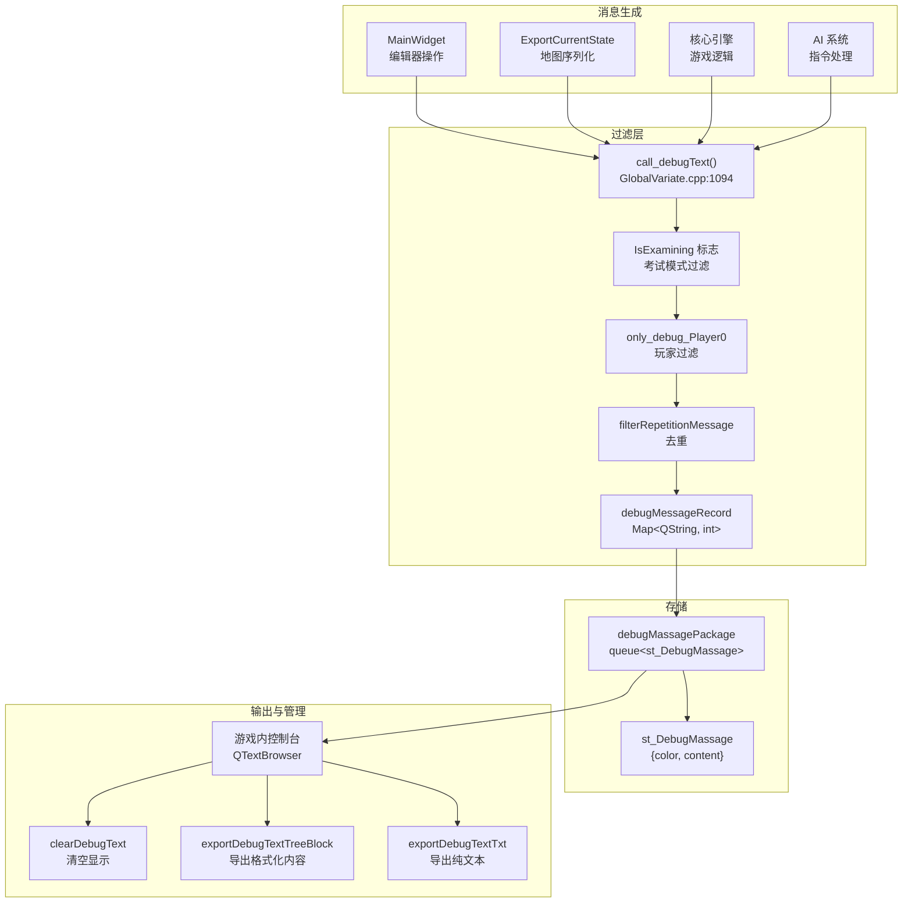
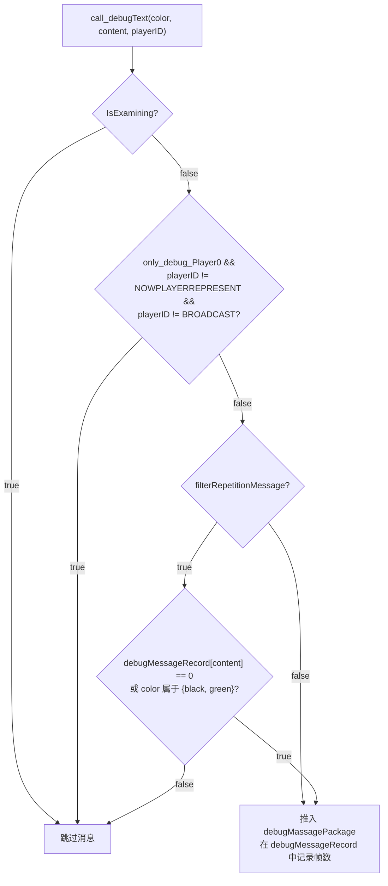
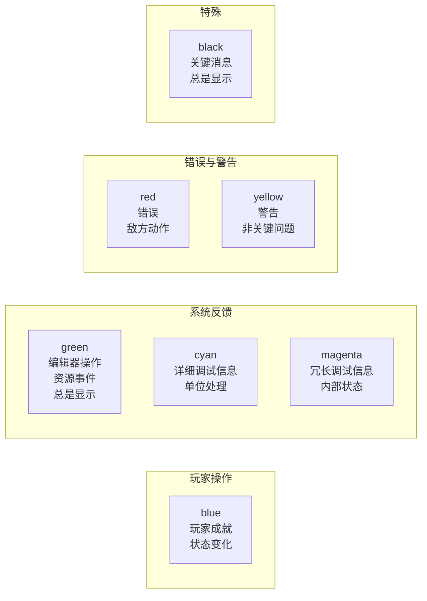
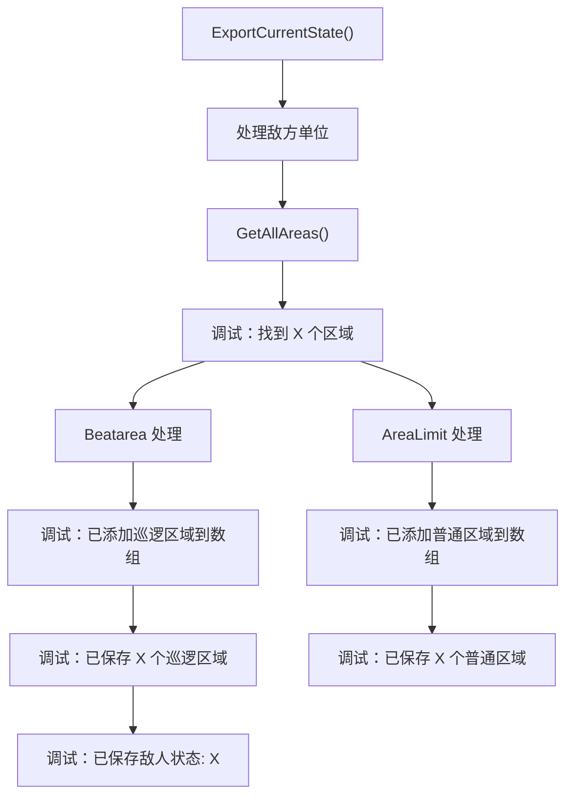
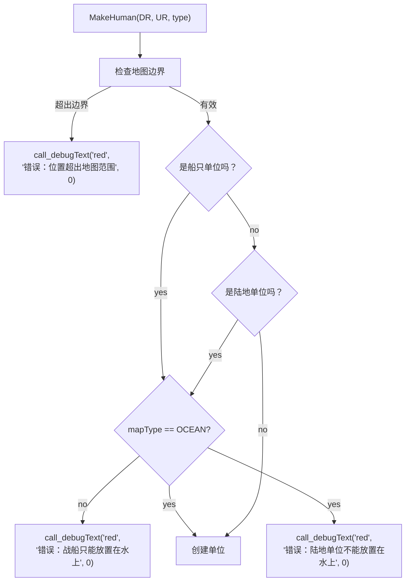
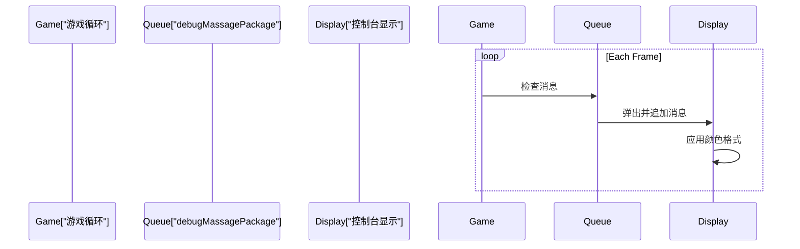

# 调试与日志系统

<details>
<summary>相关源文件</summary>

以下文件被用作生成此 wiki 页面时的上下文：

- [GlobalVariate.cpp](GlobalVariate.cpp)
- [GlobalVariate.h](GlobalVariate.h)
- [MainWidget.cpp](MainWidget.cpp)

</details>


调试与日志系统为开发、调试以及监控游戏状态变化提供运行时消息输出。它实现了一个带颜色编码的消息队列，并具备过滤能力，以减少噪声，并支持基于玩家上下文和消息重复情况的选择性显示。

有关 AI 指令系统错误代码的信息（这些错误代码会流入此调试系统），请参见 [指令与命令系统](#5.2)。

---

## 系统概览

该调试系统由一个集中式消息排队机制组成，它从整个代码库中收集带颜色编码的文本消息，并将其传递到游戏内控制台显示。消息会根据检查模式、玩家归属以及重复检测进行过滤。



**来源：** [GlobalVariate.cpp:1094-1104](), [GlobalVariate.h:538-553](), [MainWidget.cpp:138-275]()

---

## 核心组件

### call_debugText 函数

`call_debugText()` 函数是整个代码库中记录消息的主要接口。它会在将消息入队之前应用所有过滤逻辑。

**函数签名：**
```cpp
void call_debugText(QString color, QString content, int playerID)
```

**参数：**
- `color` - 消息颜色的字符串标识符（"blue"、"red"、"green"、"yellow"、"cyan"、"magenta"、"black"）
- `content` - 要显示的消息文本
- `playerID` - 玩家上下文（0 = 玩家，1 = 敌人，`REPRESENT_BOARDCAST_MESSAGE` = 全局）

**过滤逻辑流程：**



**来源：** [GlobalVariate.cpp:1094-1104](), [GlobalVariate.h:548]()

### st_DebugMassage 结构体

封装一条调试消息及其关联的颜色代码。

| 字段 | 类型 | 描述 |
|-------|------|-------------|
| `color` | `QString` | 用于消息样式的颜色标识符 |
| `content` | `QString` | 消息文本内容 |

**来源：** [GlobalVariate.h:538-547]()

### 消息存储

系统采用基于队列的方式，在消息被 UI 消费之前进行存储：

| 组件 | 类型 | 用途 |
|-----------|------|---------|
| `debugMassagePackage` | `std::queue<st_DebugMassage>` | 待处理消息的 FIFO 队列 |
| `debugMessageRecord` | `std::map<QString, int>` | 跟踪每条消息上次出现的帧，用于去重 |

**来源：** [GlobalVariate.cpp:585-586](), [GlobalVariate.h:550-553]()

---

## 消息过滤系统

### 配置标志

三个全局标志控制消息过滤行为：

```cpp
extern bool IsExamining;              // 在考试模式下禁用所有调试输出
extern bool only_debug_Player0;        // 仅显示玩家 0 的消息
extern bool filterRepetitionMessage;   // 阻止连续重复消息
```

**过滤组合：**

| IsExamining | only_debug_Player0 | filterRepetitionMessage | 行为 |
|-------------|-------------------|------------------------|----------|
| `true` | * | * | 所有消息都被阻止 |
| `false` | `true` | * | 仅显示玩家 0 和广播消息 |
| `false` | `false` | `true` | 显示所有消息，但抑制重复项 |
| `false` | `false` | `false` | 显示所有消息，允许重复 |

**来源：** [GlobalVariate.cpp:1094-1104](), [GlobalVariate.h:551-552]()

### 重复检测

`debugMessageRecord` 映射存储每条唯一消息上次出现时的帧号。只有在以下情况下消息才会被过滤：
1. 启用了 `filterRepetitionMessage`
2. 消息内容已存在于记录中
3. 消息颜色不是 "black" 或 "green"（这两种颜色总是显示）

**来源：** [GlobalVariate.cpp:1098-1102]()

---

## 颜色编码方案

消息使用颜色编码来表示其语义类别和重要性：



**按颜色分类的使用示例：**

| Color | 示例消息 | 代码参考 |
|-------|-----------------|----------------|
| **blue** | "游戏开始", "敌人状态: 攻击模式" | [MainWidget.cpp:138](), [MainWidget.cpp:261]() |
| **green** | "导出地图", "普通鼠标模式", "巡逻区域: 矩形区域" | [MainWidget.cpp:157](), [MainWidget.cpp:273](), [MainWidget.cpp:254]() |
| **red** | "错误：位置超出地图范围", "错误：战船只能放置在水上" | [MainWidget.cpp:1191](), [MainWidget.cpp:1202]() |
| **yellow** | "找到 X 个区域" | [MainWidget.cpp:447]() |
| **cyan** | "处理敌方单位: Num=X" | [MainWidget.cpp:441]() |
| **magenta** | "区域名称: Beatarea" | [MainWidget.cpp:462]() |

**来源：** [MainWidget.cpp:138-275](), [MainWidget.cpp:436-497](), [MainWidget.cpp:1191-1214]()

---

## 集成点

### 编辑器操作

编辑器广泛使用调试消息来反馈地形修改、对象放置和区域定义：

```mermaid
sequenceDiagram
    participant User
    participant Editor["编辑器 UI"]
    participant Update["MainWidget::updateEditor()"]
    participant Debug["call_debugText()"]
    participant Queue["debugMassagePackage"]
    
    User->>Editor: 从 land_type 中选择“草地”
    Editor->>Update: currentIndexChanged signal
    Update->>Debug: call_debugText("green", " 草地", 0)
    Debug->>Queue: Push st_DebugMassage
    
    User->>Editor: 点击地图放置单位
    Editor->>Update: MakeHuman() called
    Update->>Debug: call_debugText("red", " 错误: ...", 0)
    Debug->>Queue: Push st_DebugMassage
    
    User->>Editor: 导出地图
    Editor->>Update: ExportCurrentState()
    Update->>Debug: 多条 cyan/yellow/green 消息
    Debug->>Queue: 推入多条消息
```

**关键编辑器消息点：**

| Operation | Color | 示例消息 | 位置 |
|-----------|-------|----------------|----------|
| 地形类型选择 | green | "草地", "海洋" | [MainWidget.cpp:169]() |
| 高度修改 | green | "提升高度", "降低高度" | [MainWidget.cpp:175]() |
| 建筑放置 | green | "玩家市中心", "玩家箭塔" | [MainWidget.cpp:189]() |
| 单位放置 | green | "玩家农民", "敌方棍棒兵" | [MainWidget.cpp:198](), [MainWidget.cpp:219]() |
| 区域定义 | green | "巡逻区域: 矩形区域" | [MainWidget.cpp:254]() |
| 敌人状态 | blue/yellow | "敌人状态: 攻击模式" | [MainWidget.cpp:261](), [MainWidget.cpp:265]() |
| 地图导出 | green | "导出地图" | [MainWidget.cpp:157]() |

**来源：** [MainWidget.cpp:155-275]()

### 地图导出调试

`ExportCurrentState()` 函数会生成详细的调试输出，用于跟踪序列化过程：



**消息序列（第 436-497 行）：**
1. `cyan` - "处理敌方单位: Num=X, Sort=X, DR=X, UR=X"
2. `yellow` - "找到 X 个区域"
3. `green` - "发现区域类型: RectArea/CircleArea/LineArea"
4. `magenta` - "区域名称: Beatarea/AreaLimit"
5. `green` - "已添加巡逻区域到数组" / `blue` - "已添加普通区域到数组"
6. `green` - "已保存 X 个巡逻区域" / `blue` - "已保存 X 个普通区域"
7. `blue` - "已保存敌人状态: attack/defend"

**来源：** [MainWidget.cpp:436-497]()

### 单位放置校验

单位放置期间的地形校验会生成错误消息：



**来源：** [MainWidget.cpp:1183-1274]()

---

## 调试文本管理

### Option 对话框集成

Option 对话框提供了管理调试输出的控件：

| Function | Purpose | Signal Connection |
|----------|---------|-------------------|
| `clearDebugText()` | 清空控制台显示 | `Option::request_ClearDebugText` |
| `exportDebugTextTreeBlock()` | 按树形结构导出 | `Option::request_exportTreeBlock` |
| `exportDebugTextTxt()` | 导出为纯文本 | `Option::request_exportTxt` |
| `clearDebugTextFile()` | 清空导出文件 | `Option::request_exportClear` |

**信号连接：**

```cpp
// MainWidget.cpp lines 1324-1327
connect(option, &Option::request_ClearDebugText, this, &MainWidget::clearDebugText);
connect(option, &Option::request_exportTreeBlock, this, &MainWidget::exportDebugTextTreeBlock);
connect(option, &Option::request_exportTxt, this, &MainWidget::exportDebugTextTxt);
connect(option, &Option::request_exportClear, this, &MainWidget::clearDebugTextFile);
```

**来源：** [MainWidget.cpp:1324-1328]()

### 消息队列消费

调试消息队列由 UI 渲染线程在每一帧中消费。消息会从 `debugMassagePackage` 中移除，并显示在控制台组件中。



**来源：** [GlobalVariate.h:550]()

---

## 使用模式

### 基础日志记录

```cpp
// Simple informational message
call_debugText("blue", " 游戏开始", REPRESENT_BOARDCAST_MESSAGE);

// Editor operation feedback
call_debugText("green", " 导出地图", 0);

// Error reporting
call_debugText("red", " 错误：位置超出地图范围", 0);
```

**来源：** [MainWidget.cpp:138](), [MainWidget.cpp:157](), [MainWidget.cpp:1191]()

### 条件调试输出

```cpp
// Only log for specific player context
if (unit->getPlayerRepresent() == 1) {
    call_debugText("cyan", QString("处理敌方单位: Num=%1").arg(num), 0);
}

// Always-show messages (black/green bypass filters)
call_debugText("green", " 已保存区域", 0);  // Always displays even if repetition filter on
```

**来源：** [MainWidget.cpp:441](), [GlobalVariate.cpp:1098-1102]()

### 详细调试

```cpp
// Multi-level detail for complex operations
call_debugText("cyan", QString("处理单位: %1").arg(info), 0);
call_debugText("yellow", QString("找到 %1 个区域").arg(count), 0);
call_debugText("green", QString("发现区域类型: %1").arg(type), 0);
call_debugText("magenta", QString("区域名称: %1").arg(name), 0);
```

**来源：** [MainWidget.cpp:436-462]()

---

## 配置参考

### 全局变量

| Variable | Type | Default | Purpose |
|----------|------|---------|---------|
| `IsExamining` | `bool` | `false` | 在考试模式下禁用所有调试输出 |
| `only_debug_Player0` | `bool` | `false` | 过滤为仅显示玩家 0 的消息 |
| `filterRepetitionMessage` | `bool` | `false` | 抑制重复消息 |
| `debugMassagePackage` | `std::queue<st_DebugMassage>` | empty | 消息队列 |
| `debugMessageRecord` | `std::map<QString, int>` | empty | 每条消息上次出现的帧 |
| `g_frame` | `int` | 0 | 当前游戏帧计数器 |

**配置加载：**

所有布尔标志都会在启动时通过 `ReadConfig()` 从 `config.json` 加载：

```cpp
// GlobalVariate.cpp lines 1254-1261
jsonBool(IsExamining);
jsonBool(only_debug_Player0);
jsonBool(filterRepetitionMessage);
```

**来源：** [GlobalVariate.h:501-553](), [GlobalVariate.cpp:1254-1261](), [GlobalVariate.cpp:585-586]()

---

## 特殊消息常量

### Player ID 常量

```cpp
#define REPRESENT_BOARDCAST_MESSAGE  // Used for global messages visible to all players
```

带有此 playerID 的消息会绕过 `only_debug_Player0` 过滤器。

**来源：** [GlobalVariate.cpp:1096-1097]()

### 基于帧的去重

`debugMessageRecord` 映射存储的是帧号而不是布尔标志，从而支持基于时间的消息抑制。消息在经过足够多的帧后可以再次出现，这在减少刷屏和保持对重复问题的感知之间提供了平衡。

**来源：** [GlobalVariate.cpp:1101]()