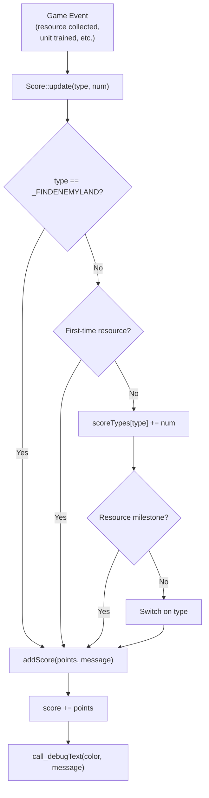
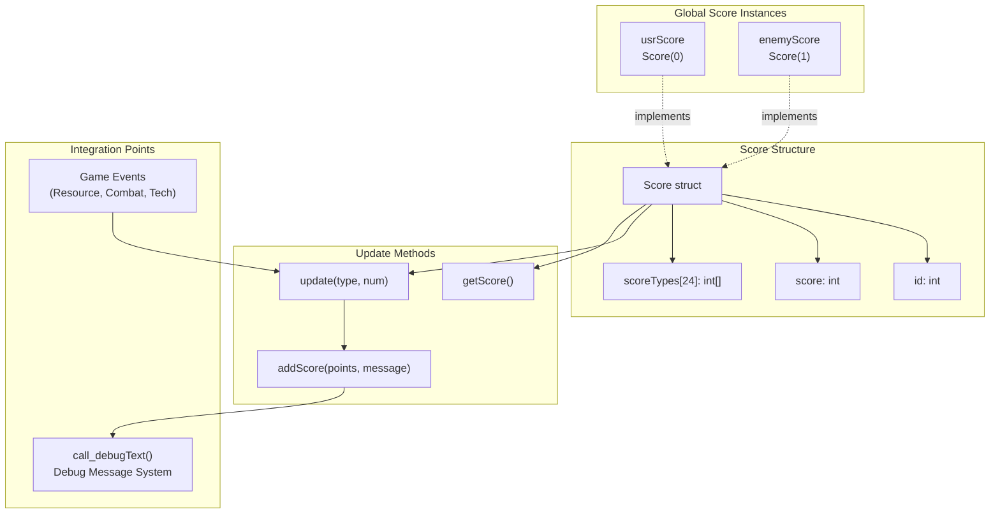

# 评分系统

<details>
<summary>相关源文件</summary>

以下文件被用作生成此 Wiki 页面时的上下文：

- [GlobalVariate.cpp](GlobalVariate.cpp)
- [GlobalVariate.h](GlobalVariate.h)

</details>


评分系统通过为各种成就授予分数来跟踪玩家和敌方在整个游戏中的表现，这些成就包括资源采集、科技研究、单位生产、建筑建造和战斗胜利。该系统维护累计分数，并通过调试消息接口提供实时反馈。

有关调试消息和日志记录的信息，请参见 [调试与日志系统](#7.4)。有关资源采集机制，请参见 [资源与经济系统](#3.1)。

---

## 概述

评分系统通过 `Score` 结构体和 `ScoreType` 枚举实现，它们对 24 种不同类型的成就进行分类和跟踪。两个全局评分实例分别跟踪玩家和敌方的表现，在响应游戏事件时更新，并将变化广播到调试控制台。

**来源：** [GlobalVariate.h:555-670](), [GlobalVariate.cpp:579-580]()

---

## 核心数据结构

### Score 结构体

`Score` 结构体封装了单个玩家的所有评分逻辑和状态：

| 字段 | 类型 | 用途 |
|-------|------|---------|
| `id` | `int` | 玩家标识符（0 表示用户，1 表示敌方） |
| `score` | `int` | 累计总分 |
| `scoreTypes[SCORE_TYPE_COUNT]` | `int[]` | 各成就类型的独立计数器 |

**关键方法：**

- `Score(int id)` - 初始化玩家 ID 和零分数的构造函数
- `int getScore()` - 返回当前累计分数
- `void update(int type, int num = 1)` - 处理成就的主评分方法
- `void addScore(int points, const QString& message)` - 增加分数并广播消息的私有辅助方法

**来源：** [GlobalVariate.h:587-670]()

### ScoreType 枚举

`ScoreType` 枚举定义了 24 个不同的成就类别：

```cpp
enum ScoreType {
    _WOOD = 0, _STONE, _GOLD, _MEAT,              // Resource counters (0-3)
    _BERRY, _GAZELLE, _ELEPHANT, _FARM, _FISH,    // Resource source types (4-8)
    _ISWOOD, _ISGOLD, _ISSTONE,                   // First-time resource flags (9-11)
    _TECH,                                         // Technology research (12)
    _BUILDING1, _BUILDING2,                        // Building construction (13-14)
    _HUMAN1, _HUMAN2,                              // Unit production (15-16)
    _KILL2, _KILL10,                               // Combat kills (17-18)
    _DESTORY2, _DESTORY4, _DESTORY5, _DESTORY10,  // Building destruction (19-22)
    _FINDENEMYLAND,                                // Exploration (23)
    SCORE_TYPE_COUNT                               // Array size marker (24)
};
```

**来源：** [GlobalVariate.h:555-585]()

---

## 评分类别与分值

### 资源采集

#### 里程碑奖励
对于基础资源（`_WOOD`、`_STONE`、`_GOLD`、`_MEAT`），系统每收集 **100 个资源奖励 1 分**：

```
scoreTypes[type] 跟踪累计采集量
奖励分数：floor(total / 100) - floor(previous / 100)
```

#### 首次采集奖励
当玩家首次采集某些资源类型时，会获得额外奖励分：

| 成就 | 分数 | 触发条件 |
|------------|--------|---------|
| 首次获得新资源类型 | +5 | 任意 `_BERRY`、`_GAZELLE`、`_ELEPHANT`、`_FARM`、`_FISH` |
| 首次采集黄金 | +10 | `_ISGOLD` 标志（可与 +5 叠加） |

**来源：** [GlobalVariate.h:607-621]()

### 生产与研究

| 类别 | 分数 | ScoreType |
|----------|--------|-----------|
| 研究科技 | +2 | `_TECH` |
| 建造房屋/农场 | +1 | `_BUILDING1` |
| 建造普通建筑 | +2 | `_BUILDING2` |
| 训练基础单位 | +1 | `_HUMAN1` |
| 训练特殊单位 | +2 | `_HUMAN2` |

**来源：** [GlobalVariate.h:636-650]()

### 战斗成就

| 类别 | 分数 | ScoreType |
|----------|--------|-----------|
| 击杀敌方单位 | +2 | `_KILL2` |
| 摧毁房屋/农场 | +2 | `_DESTORY2` |
| 摧毁普通建筑 | +4 | `_DESTORY4` |
| 摧毁箭塔 | +5 | `_DESTORY5` |
| 摧毁城镇中心 | +10 | `_DESTORY10` |

**来源：** [GlobalVariate.h:651-665]()

### 探索

| 成就 | 分数 | ScoreType |
|------------|--------|-----------|
| 到达敌方大陆 | +10 | `_FINDENEMYLAND` |

**来源：** [GlobalVariate.h:607-610]()

---

## 分数更新机制

### 更新流程



**图示：分数更新流程**

**来源：** [GlobalVariate.h:606-669]()

### 特殊更新逻辑

#### 首次资源采集

系统将 `scoreTypes` 数组同时用作资源的计数器和标志系统：

```cpp
if (type <= _ISSTONE && scoreTypes[type] == 0 && type > _MEAT) {
    addScore(5, " 采集到新资源，分数+5");
    if (type == _ISGOLD) {
        addScore(10, " 采集到黄金，分数+10");
    }
}
if (type > _MEAT && type <= _ISSTONE) {
    scoreTypes[type] = scoreTypes[type] | 1;  // Set flag
    return;
}
```

对于 `_ISWOOD`、`_ISGOLD`、`_ISSTONE` 这几种类型，计数器充当二进制标志（0 或 1）。

**来源：** [GlobalVariate.h:611-621]()

#### 资源里程碑检测

对于基础资源，系统会计算跨越了多少个里程碑阈值：

```cpp
int before = scoreTypes[type] / 100;
scoreTypes[type] += num;
if (type <= _MEAT) {
    int after = scoreTypes[type] / 100;
    int change = after - before;
    while (change > 0) {
        addScore(1, " 单种资源收集满100个，分数+1");
        change--;
    }
}
```

这会在单次更新中每跨越一个 100 资源阈值奖励 1 分。

**来源：** [GlobalVariate.h:623-633]()

---

## 集成架构



**图示：评分系统架构**

**来源：** [GlobalVariate.h:555-670](), [GlobalVariate.cpp:579-580]()

---

## 全局评分实例

两个全局 `Score` 对象用于跟踪玩家和敌方的表现：

| 变量 | 类型 | 玩家 ID | 用途 |
|----------|------|-----------|---------|
| `usrScore` | `Score` | 0 | 跟踪用户玩家的成就 |
| `enemyScore` | `Score` | 1 | 跟踪敌方 AI 的成就 |

这些实例会在程序启动时初始化：

```cpp
Score usrScore=Score(0);
Score enemyScore=Score(1);
```

玩家 ID 决定调试消息的颜色：玩家（ID 0）为蓝色，敌方（ID 1）为红色。

**来源：** [GlobalVariate.cpp:579-580]()

---

## 调试消息广播

### 消息生成

当分数发生变化时，`addScore` 方法会通过调试系统广播消息：

```cpp
void addScore(int points, const QString& message) {
    score += points;
    if (id == 0)
        call_debugText("blue", " 玩家" + message, REPRESENT_BOARDCAST_MESSAGE);
    else
        call_debugText("red", " 敌方" + message, REPRESENT_BOARDCAST_MESSAGE);
}
```

### 颜色编码

- **蓝色消息**：用户玩家成就（ID 0）
- **红色消息**：敌方 AI 成就（ID 1）

### 消息示例

中文消息文本包括：
- "采集到新资源，分数+5"（采集到新资源，+5 分）
- "采集到黄金，分数+10"（采集到黄金，+10 分）
- "单种资源收集满100个，分数+1"（某种资源收集满 100 个，+1 分）
- "解锁新科技，分数+2"（解锁新科技，+2 分）
- "生产普通单位，分数+1"（训练基础单位，+1 分）
- "击杀一般敌人，分数+2"（击杀敌方单位，+2 分）
- "摧毁主营，分数+10"（摧毁城镇中心，+10 分）

**来源：** [GlobalVariate.h:593-599](), [GlobalVariate.h:607-665]()

---

## 分数获取

### 公共接口

`Score` 结构体公开了一个查询方法：

```cpp
int getScore() {
    return score;
}
```

该方法返回累计总分。`scoreTypes[]` 中的各个成就计数器是私有的，无法从结构体外部直接访问。

**来源：** [GlobalVariate.h:603-605]()

---

## 汇总表：所有分值

| 成就类型 | 分数 | ScoreType 常量 | 说明 |
|-----------------|--------|-------------------|-------|
| 收集 100 木材 | 1 | `_WOOD` | 可重复的里程碑 |
| 收集 100 石料 | 1 | `_STONE` | 可重复的里程碑 |
| 收集 100 黄金 | 1 | `_GOLD` | 可重复的里程碑 |
| 收集 100 肉类 | 1 | `_MEAT` | 可重复的里程碑 |
| 首次采集浆果 | 5 | `_BERRY` | 一次性奖励 |
| 首次猎杀瞪羚 | 5 | `_GAZELLE` | 一次性奖励 |
| 首次猎杀大象 | 5 | `_ELEPHANT` | 一次性奖励 |
| 首次收获农场 | 5 | `_FARM` | 一次性奖励 |
| 首次捕鱼 | 5 | `_FISH` | 一次性奖励 |
| 首次收集木材 | 5 | `_ISWOOD` | 一次性奖励 |
| 首次收集黄金 | 15 | `_ISGOLD` | 一次性（5+10） |
| 首次收集石料 | 5 | `_ISSTONE` | 一次性奖励 |
| 研究科技 | 2 | `_TECH` | 每次研究 |
| 建造房屋/农场 | 1 | `_BUILDING1` | 每座建筑 |
| 建造普通建筑 | 2 | `_BUILDING2` | 每座建筑 |
| 训练基础单位 | 1 | `_HUMAN1` | 每个单位 |
| 训练特殊单位 | 2 | `_HUMAN2` | 每个单位 |
| 击杀敌方单位 | 2 | `_KILL2` | 每次击杀 |
| 摧毁房屋/农场 | 2 | `_DESTORY2` | 每次摧毁 |
| 摧毁普通建筑 | 4 | `_DESTORY4` | 每次摧毁 |
| 摧毁箭塔 | 5 | `_DESTORY5` | 每次摧毁 |
| 摧毁城镇中心 | 10 | `_DESTORY10` | 每次摧毁 |
| 发现敌方领地 | 10 | `_FINDENEMYLAND` | 一次性 |

**来源：** [GlobalVariate.h:555-669]()