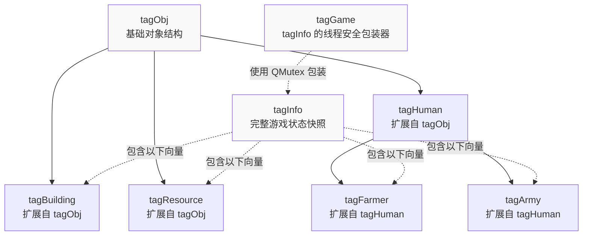
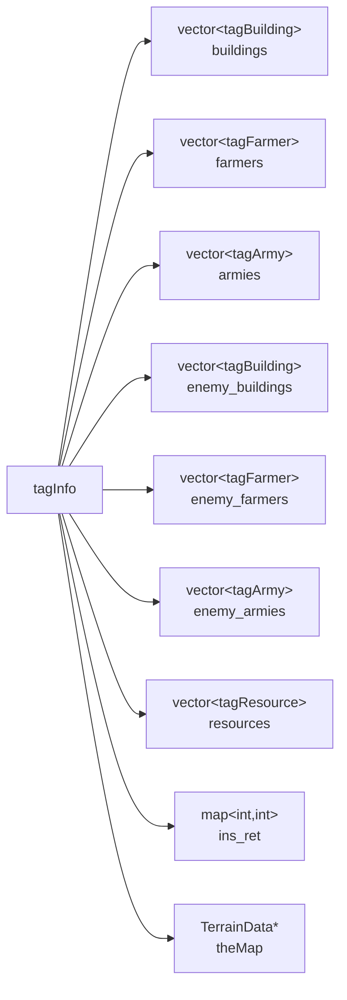
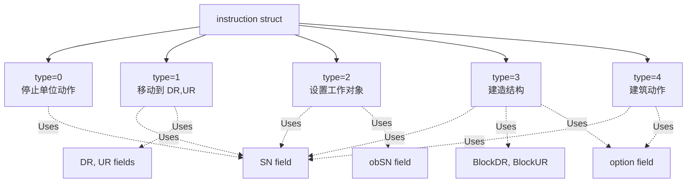
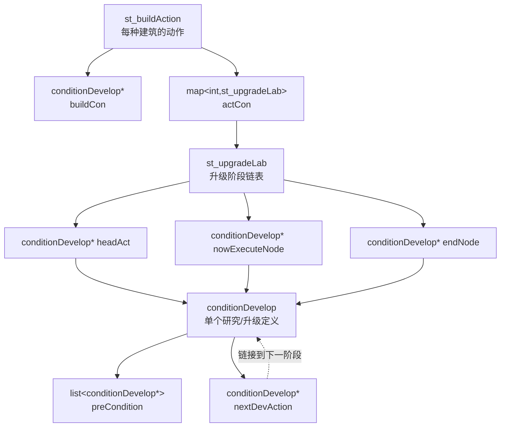
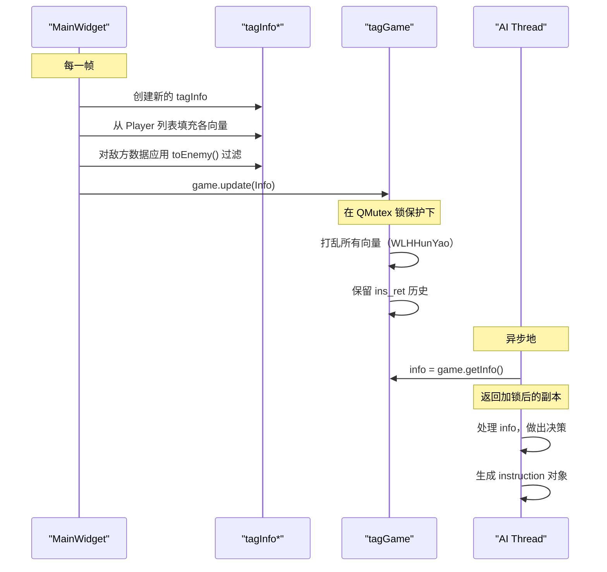
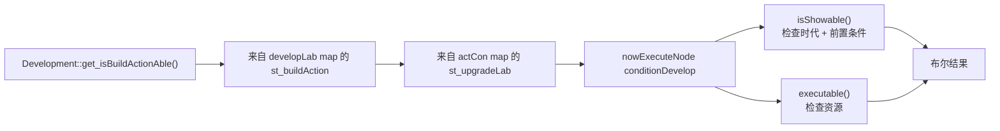

# 数据结构参考

相关源文件

以下文件被用作生成本 wiki 页面的上下文：

- [Development.h](Development.h)
- [GlobalVariate.h](GlobalVariate.h)
- [Player.cpp](Player.cpp)

本页面全面参考了 `new-aoe` 代码库中使用的所有关键数据结构。这些结构定义了游戏状态表示、命令接口、科技树配置以及空间数据组织。

有关这些结构在特定系统中如何使用的信息，请参见：
- 游戏状态管理与 AI 通信：[AI System](#5)
- 科技树逻辑与进程：[Technology Tree](#3.2)
- 地图与空间查询：[Map and World](#6)

---

## 结构类别

代码库将数据结构组织为若干功能类别：

| 类别 | 用途 | 关键结构 |
|----------|---------|----------------|
| **游戏状态** | 表示实体和游戏世界状态 | `tagObj`, `tagBuilding`, `tagHuman`, `tagFarmer`, `tagArmy`, `tagResource` |
| **状态快照** | 与 AI 进行线程安全的游戏状态共享 | `tagInfo`, `tagGame` |
| **指令** | AI 命令接口 | `instruction`, `ins` |
| **科技树** | 定义研究/升级的前置条件和效果 | `conditionDevelop`, `st_upgradeLab`, `st_buildAction` |
| **空间** | 地图坐标与地形数据 | `Point`, `tagMap`, `tagTerrain`, `pixMemoryMap` |
| **工具** | 支撑功能 | `Score`, `MouseEvent`, `ImageResource` |

---

## 游戏状态结构层级

下图展示了游戏状态结构之间的继承与组合关系：

**来源：** [GlobalVariate.h:672-759](), [GlobalVariate.h:847-972]()

---

## tagObj - 基础对象结构

`tagObj` 结构是所有游戏实体的基础，提供最小化的标识信息。

| 字段 | 类型 | 描述 |
|-------|------|-------------|
| `SN` | `int` | 对象唯一序列号 |
| `BlockDR` | `int` | 方块坐标（右下轴） |
| `BlockUR` | `int` | 方块坐标（右上轴） |

该结构实现了按序列号排序的 `<` 运算符，用于容器操作。

**来源：** [GlobalVariate.h:672-678]()

---

## tagBuilding - 建筑状态

在 `tagObj` 的基础上扩展了建筑特有数据，包括生命值、建造进度和当前生产内容。

| 字段 | 类型 | 描述 |
|-------|------|-------------|
| `Type` | `int` | 建筑类型常量（例如 `BUILDING_CENTER`、`BUILDING_HOME`） |
| `Blood` | `int` | 当前生命值 |
| `MaxBlood` | `int` | 最大生命值 |
| `Percent` | `int` | 建造完成百分比（0-100） |
| `Project` | `int` | 当前激活的项目/动作编号（无则为 -1） |
| `ProjectPercent` | `int` | 项目完成百分比 |
| `Cnt` | `int` | 剩余资源数量（仅用于 `BUILDING_FARM`） |

### toEnemy() 方法

`toEnemy()` 方法会通过将敏感字段设为 -1 来创建一个经过战争迷雾过滤的副本：
- 设置 `Cnt = -1`
- 设置 `Project = -1`
- 设置 `ProjectPercent = -1`

这可以防止敌方 AI 看到玩家的生产队列和资源状态。

**来源：** [GlobalVariate.h:679-694]()

---

## tagResource - 静态资源对象

表示可采集资源，如树木、金矿、石矿和动物。

| 字段 | 类型 | 描述 |
|-------|------|-------------|
| `DR` | `double` | 细节坐标（右下） |
| `UR` | `double` | 细节坐标（右上） |
| `Type` | `int` | 资源类型（树、石头、金子、浆果丛、动物） |
| `ProductSort` | `int` | 采集后产出的资源类别（木材、食物、石头、黄金） |
| `Cnt` | `int` | 剩余可采集数量 |
| `Blood` | `int` | 当前生命值（适用于可被摧毁的动物/树木） |

**来源：** [GlobalVariate.h:696-703]()

---

## tagHuman - 基础人类单位

所有可移动人类单位的基础结构，提供位置、状态和战斗属性。

| 字段 | 类型 | 描述 |
|-------|------|-------------|
| `DR`, `UR` | `double` | 当前细节坐标位置 |
| `DR0`, `UR0` | `double` | 目标坐标 |
| `NowState` | `int` | 当前单位状态（空闲、移动、采集、攻击等） |
| `WorkObjectSN` | `int` | 该单位正在交互的对象序列号 |
| `Blood` | `int` | 当前生命值 |
| `attack` | `int` | 攻击伤害值 |
| `rangedDefense` | `int` | 远程攻击防御值 |
| `meleeDefense` | `int` | 近战攻击防御值 |

### cast_from() 方法

`cast_from()` 方法会从另一个 `tagHuman` 实例复制所有字段，用于单位类型转换时。

**来源：** [GlobalVariate.h:705-727]()

---

## tagFarmer - 村民单位

在 `tagHuman` 基础上扩展了资源采集和携带能力。

| 字段 | 类型 | 描述 |
|-------|------|-------------|
| `ResourceSort` | `int` | 当前携带的资源类型 |
| `Resource` | `int` | 当前携带的资源数量 |
| `FarmerSort` | `int` | 农民子类型（农民、渔船、运输船、帆船） |

### toEnemy() 方法

战争迷雾过滤会设置：
- `Resource = -1`
- `DR0 = -1.0`，`UR0 = -1.0`（隐藏目标位置）

**来源：** [GlobalVariate.h:729-740]()

---

## tagArmy - 军事单位

在 `tagHuman` 基础上扩展了军队特有的行为参数。

| 字段 | 类型 | 描述 |
|-------|------|-------------|
| `Sort` | `int` | 军队单位类型（棒兵、弓兵、斥候、骑兵等） |
| `status` | `int` | AI 行为模式（巡逻、攻击、防御） |
| `starttime` | `int` | 巡逻周期起始帧 |
| `finishtime` | `int` | 巡逻周期结束帧 |
| `startpointDR`, `startpointUR` | `double` | 巡逻路线起点 |
| `destinaDR`, `destinaUR` | `double` | 巡逻路线终点 |
| `ifAttack` | `bool` | 单位是否应在视野中发现敌人时发起攻击 |
| `timelock` | `int` | 用于行为时序的帧计数器 |

### toEnemy() 方法

隐藏目标位置：`DR0 = -1.0`，`UR0 = -1.0`

**来源：** [GlobalVariate.h:742-759]()

---

## tagInfo - 完整游戏状态快照

`tagInfo` 结构包含某一玩家可观察到的完整游戏状态快照。这是 AI 决策所使用的主要数据结构。

### 字段

| 字段 | 类型 | 描述 |
|-------|------|-------------|
| `buildings` | `vector<tagBuilding>` | 所有友方建筑 |
| `farmers` | `vector<tagFarmer>` | 所有友方农民单位 |
| `armies` | `vector<tagArmy>` | 所有友方军事单位 |
| `enemy_buildings` | `vector<tagBuilding>` | 可见的敌方建筑（经过战争迷雾过滤） |
| `enemy_farmers` | `vector<tagFarmer>` | 可见的敌方农民（经过战争迷雾过滤） |
| `enemy_armies` | `vector<tagArmy>` | 可见的敌方军队（经过战争迷雾过滤） |
| `resources` | `vector<tagResource>` | 地图上的所有资源（树木、矿藏、动物） |
| `ins_ret` | `map<int, int>` | 已执行指令的返回码（id → result） |
| `theMap` | `TerrainData*` | 指向地形高度/类型网格的指针 |
| `exploredUpdate` | `vector<Point>` | 本帧新探索到的地图区域 |
| `GameFrame` | `int` | 当前游戏帧编号 |
| `civilizationStage` | `int` | 当前时代/纪元 |
| `Wood`, `Meat`, `Stone`, `Gold` | `int` | 当前资源数量 |
| `Human_MaxNum` | `int` | 最大人口容量 |

### 方法

- **赋值运算符**：深拷贝所有向量和映射，共享地形指针
- **clear()**：清空所有向量和映射，为复用做准备

**来源：** [GlobalVariate.h:847-910]()

---

## tagGame - 线程安全状态包装器

使用 `QMutex` 包装 `tagInfo`，为读取游戏状态的 AI 线程提供线程安全访问。

### 关键方法

| 方法 | 用途 |
|--------|---------|
| `update(tagInfo*)` | 原子性替换存储的信息，保留 `ins_ret` 历史，并打乱向量顺序 |
| `getInfo()` | 在互斥锁保护下返回当前 `tagInfo` 的副本 |
| `insertInsRet(int, instruction)` | 向 `ins_ret` 映射中加入指令结果 |
| `clearInsRet()` | 清空所有指令返回码 |

### WLHHunYao 向量洗牌

`update()` 方法使用 `WLHHunYao()` 辅助函数（Fisher-Yates 洗牌）打乱所有实体向量。此随机化可防止 AI 利用固定顺序，并让行为更难预测。

**来源：** [GlobalVariate.h:914-972]()

---

## 指令系统结构

### instruction - AI 命令表示

`instruction` 结构编码了一条 AI 命令及其所需的全部参数。

### 字段

| 字段 | 类型 | 描述 |
|-------|------|-------------|
| `ret` | `int` | 执行后的返回码（0=成功，负数=错误） |
| `type` | `int` | 命令类型（0-4） |
| `id` | `int` | 唯一指令标识符 |
| `self` | `Coordinate*` | 指向执行对象的指针（已弃用，改用 `SN`） |
| `obj` | `Coordinate*` | 指向目标对象的指针（已弃用，改用 `obSN`） |
| `option` | `int` | 附加参数（建筑类型或动作编号） |
| `BlockDR`, `BlockUR` | `int` | 建造用方块坐标 |
| `SN` | `int` | 执行动作对象的序列号 |
| `obSN` | `int` | 目标对象的序列号 |
| `DR`, `UR` | `double` | 移动用细节坐标 |

### 构造函数

该结构为不同命令类型提供了多个构造函数：
- `instruction(int type, int SN, int obSN, bool)` - 用于类型 2（设置工作对象）
- `instruction(int type, int SN, int BlockDR, int BlockUR, int option)` - 用于类型 3（建造）
- `instruction(int type, int SN, double DR, double UR)` - 用于类型 1（移动）
- `instruction(int type, int SN, int option)` - 用于类型 0 或 4（停止/动作）

### 返回码

| 代码 | 含义 |
|------|---------|
| `0` | 成功 |
| `-1` | 未找到 SN |
| `-2` | 未找到动作 |
| `-3` | 位置越界 |
| `-4` | 未找到目标对象（obSN） |
| `-5` | 建筑类型无效 |
| `-6` | 资源不足 |

**来源：** [GlobalVariate.h:765-791](), [GlobalVariate.h:1291-1299]()

---

## ins - 线程安全指令队列

`ins` 结构提供了一个线程安全队列，供 AI 向游戏引擎提交命令。

| 字段 | 类型 | 描述 |
|-------|------|-------------|
| `g_id` | `int` | 用于分配唯一指令 ID 的全局计数器 |
| `instructions` | `queue<instruction>` | 待处理指令的 FIFO 队列 |
| `lock` | `QMutex` | 用于线程安全队列操作的互斥锁 |

AI 线程将 `instruction` 对象推入此队列，而 `MainWidget::manageOrder()` 会在每一帧消费它们。

**来源：** [GlobalVariate.h:793-797]()

---

## 科技树结构

科技树使用带前置条件链的链表结构实现。

**来源：** [GlobalVariate.h:1106-1286]()

---

## conditionDevelop - 研究/升级节点

定义单个研究项、升级阶段或建筑动作，以及其前置条件和效果。

### 字段

| 字段 | 类型 | 描述 |
|-------|------|-------------|
| `civilization` | `int` | 所需最低时代（Stone/Tool/Bronze/Iron） |
| `sort_building` | `int` | 可执行该动作的建筑类型 |
| `times_second` | `double` | 持续时间（秒） |
| `acttimes` | `int` | 该动作已完成的次数 |
| `isCreatObjectAction` | `bool` | 该动作是否会创建单位/对象 |
| `creatObjectSort` | `int` | 要创建的对象类型（`SORT_FARMER`、`SORT_ARMY`） |
| `creatObjectNum` | `int` | 具体单位类型编号 |
| `preCondition` | `list<conditionDevelop*>` | 必须完成的前置动作列表 |
| `nextDevAction` | `conditionDevelop*` | 链中的下一个升级阶段 |
| `need_Wood`, `need_Food`, `need_Stone`, `need_Gold` | `int` | 资源消耗 |

### 关键方法

| 方法 | 用途 |
|--------|---------|
| `executable(int wood, int food, int stone, int gold)` | 检查资源是否充足 |
| `isShowable(int nowcivilization)` | 检查前置条件和时代是否允许显示该动作 |
| `finishAct()` | 增加 `acttimes` 计数器 |
| `isNeedCreatObject(int&, int&)` | 查询对象创建设置 |
| `addPreCondition(conditionDevelop*)` | 添加前置条件要求 |
| `setCreatObjectAfterAction(int, int)` | 配置动作后的单位创建 |

**来源：** [GlobalVariate.h:1106-1189]()

---

## st_upgradeLab - 升级链管理器

管理一个由 `conditionDevelop` 节点组成的链表，用于表示某个特定建筑动作的顺序升级阶段。

### 字段

| 字段 | 类型 | 描述 |
|-------|------|-------------|
| `headAct` | `conditionDevelop*` | 链中的第一个节点 |
| `nowExecuteNode` | `conditionDevelop*` | 当前升级等级 |
| `endNode` | `conditionDevelop*` | 链中的最后一个节点 |
| `haveFinishedPhaseNum` | `int` | 已完成升级数量 |
| `nowExecuting` | `bool` | 当前是否有动作正在执行 |

### 关键方法

| 方法 | 用途 |
|--------|---------|
| `setHead(conditionDevelop*)` | 用第一个节点初始化链表 |
| `push_back(conditionDevelop*)` | 将升级阶段追加到链表末尾 |
| `endNodeAsOver()` | 将最后一个节点标记为可重复（指向自身循环） |
| `shift()` | 推进到下一升级阶段 |
| `isShowAble(int)` | 检查当前节点是否可显示 |
| `executable(int, int, int, int, int)` | 检查当前节点是否可执行 |
| `beginExecute()`, `overExecute()` | 将动作标记为进行中/已完成 |
| `getPhaseTimes()` | 获取已完成升级次数 |

析构函数会遍历链表并删除所有 `conditionDevelop` 节点。

**来源：** [GlobalVariate.h:1191-1260]()

---

## st_buildAction - 建筑动作容器

将某种特定建筑类型的所有可用动作归组。

### 字段

| 字段 | 类型 | 描述 |
|-------|------|-------------|
| `buildCon` | `conditionDevelop*` | 建筑自身的建造要求 |
| `actCon` | `map<int, st_upgradeLab>` | 动作编号到升级链的映射 |

### 关键方法

| 方法 | 用途 |
|--------|---------|
| `finishBuild()` | 标记建筑建造完成 |
| `finishAction(int actNum)` | 完成一个动作并切换到下一阶段 |

析构函数会删除 `buildCon` 节点。

**来源：** [GlobalVariate.h:1262-1286]()

---

## 空间与地图结构

### Point - 二维方块坐标

简单的整数坐标结构，并带有运算符重载。

| 字段 | 类型 | 描述 |
|-------|------|-------------|
| `x` | `int` | 右下轴 |
| `y` | `int` | 右上轴 |

重载运算符：`+`、`-`、`==`、`<`

**来源：** [GlobalVariate.h:833-845]()

---

### tagTerrain - 地形网格单元

存储单个地图单元的高度和类型。

| 字段 | 类型 | 描述 |
|-------|------|-------------|
| `height` | `int` | 海拔高度 |
| `type` | `int` | 地形类型（草地、海洋等） |

**来源：** [GlobalVariate.h:828-831]()

---

### tagMap - 战争迷雾单元

扩展的地图单元数据，包括探索状态和资源信息。

| 字段 | 类型 | 描述 |
|-------|------|-------------|
| `explore` | `bool` | 该单元是否已被探索 |
| `high` | `int` | 高度值（未探索时为 -1） |
| `type` | `int` | 此位置上的资源对象类型 |
| `ResType` | `int` | 产出的资源类别（木材/食物/石头/黄金） |
| `fundation` | `int` | 资源对象大小 |
| `SN` | `int` | 资源对象序列号 |
| `remain` | `int` | 剩余数量 |

### 方法

- `clear()`：重置所有字段，包括探索状态
- `clear_r()`：仅重置资源字段，保留探索/高度信息

**来源：** [GlobalVariate.h:798-827]()

---

### pixMemoryMap - 碰撞检测网格

基于 Alpha 通道的精灵碰撞图。

| 字段 | 类型 | 描述 |
|-------|------|-------------|
| `MemoryMap` | `vector<char>` | 展平后的二维不透明度值网格 |
| `width` | `int` | 网格宽度（像素） |
| `height` | `int` | 网格高度（像素） |

### 关键方法

| 方法 | 用途 |
|--------|---------|
| `setMemoryMap(int i, int j)` | 将像素标记为实体 |
| `getMemoryMap(int i, int j)` | 查询像素是否为实体 |
| `fillBlockMemoryMap()` | 用菱形图案填充等距方块 |

`fillBlockMemoryMap()` 方法通过遍历四个象限并使用直线方程来判断哪些像素落在等距方块的占地区域内，从而创建一个菱形碰撞形状。

**来源：** [GlobalVariate.h:1002-1084]()

---

## 工具结构

### Score - 分数追踪系统

跟踪玩家成就并计算得分。

| 字段 | 类型 | 描述 |
|-------|------|-------------|
| `id` | `int` | 玩家标识符（0 或 1） |
| `score` | `int` | 累积总分 |
| `scoreTypes` | `int[SCORE_TYPE_COUNT]` | 各成就类型的计数数组 |

### ScoreType 枚举

| 值 | 描述 |
|-------|-------------|
| `_WOOD`, `_STONE`, `_GOLD`, `_MEAT` | 资源采集计数 |
| `_BERRY`, `_GAZELLE`, `_ELEPHANT`, `_FARM`, `_FISH` | 特定食物来源计数 |
| `_ISWOOD`, `_ISGOLD`, `_ISSTONE` | 首次采集标记 |
| `_TECH` | 科技研究次数 |
| `_BUILDING1`, `_BUILDING2` | 建筑建造次数 |
| `_HUMAN1`, `_HUMAN2` | 单位生产次数 |
| `_KILL2`, `_KILL10` | 击杀敌人次数 |
| `_DESTORY2`, `_DESTORY4`, `_DESTORY5`, `_DESTORY10` | 摧毁敌方建筑次数 |
| `_FINDENEMYLAND` | 首次探索敌方领土 |

### 关键方法

- `update(int type, int num)`：增加计数并奖励分数
- `getScore()`：返回总分

**来源：** [GlobalVariate.h:555-670]()

---

### ImageResource - 带碰撞数据的精灵资源

将 `QPixmap` 精灵及其对应的碰撞图打包在一起。

| 字段 | 类型 | 描述 |
|-------|------|-------------|
| `pix` | `QPixmap` | 精灵图像 |
| `memorymap` | `pixMemoryMap` | Alpha 通道碰撞网格 |

**来源：** [GlobalVariate.h:1086-1103]()

---

### MouseEvent - 输入事件数据

封装鼠标点击/拖拽信息。

| 字段 | 类型 | 描述 |
|-------|------|-------------|
| `memoryMapX`, `memoryMapY` | `int` | 内存映射网格坐标 |
| `DR`, `UR` | `double` | 细节世界坐标 |
| `mouseEventType` | `int` | 事件类型代码 |

### 关键方法

| 方法 | 用途 |
|--------|---------|
| `GetMouseEventType()`, `SetMouseEventType(int)` | 查询/设置事件类型 |
| `HaveEvent()` | 检查事件是否存在 |
| `GetMemoryMapX()`, `GetMemoryMapY()` | 获取网格坐标 |
| `GetDR()`, `GetUR()` | 获取世界坐标 |
| `Reset()` | 清空事件数据 |

**来源：** [GlobalVariate.h:974-997]()

---

## 数据结构使用模式

### 状态快照创建流程

**来源：** [GlobalVariate.h:914-972](), [Player.cpp:1-358]()

---

### 科技树查询模式

**来源：** [Development.h:1-138](), [GlobalVariate.h:1106-1286]()

---

## 全局数据结构实例

在 `GlobalVariate.h` 中定义的关键全局实例：

| 变量 | 类型 | 用途 |
|----------|------|---------|
| `g_Object` | `map<int, Coordinate*>` | 全局对象注册表（SN → 指针） |
| `memorymap` | `int**` | 视野/战争迷雾网格 |
| `resMap` | `map<string, list<QPixmap>>` | 精灵动画序列 |
| `SoundMap` | `map<string, QSoundEffect*>` | 音效注册表 |
| `soundQueue` | `queue<string>` | 待播放音效队列 |
| `debugMassagePackage` | `queue<st_DebugMassage>` | 调试消息队列 |
| `debugMessageRecord` | `map<QString, int>` | 消息去重追踪 |

**来源：** [GlobalVariate.h:514-553]()

---

## 汇总表：结构大小与关键字段

| 结构 | 主键 | 向量/列表 | 映射 | 典型大小 |
|-----------|--------------|---------------|------|--------------|
| `tagInfo` | `GameFrame`, `civilizationStage` | 7 个向量（buildings、farmers、armies 等） | `ins_ret` | 约数百个实体 |
| `tagBuilding` | `SN`, `Type` | 无 | 无 | 72 字节 |
| `tagHuman` | `SN`, `NowState` | 无 | 无 | 96 字节 |
| `tagFarmer` | `SN`, `ResourceSort` | 无 | 无 | 112 字节 |
| `tagArmy` | `SN`, `Sort`, `status` | 无 | 无 | 160 字节 |
| `conditionDevelop` | `civilization`, `sort_building` | `preCondition` 列表 | 无 | 可变 |
| `st_buildAction` | 无 | 无 | `actCon` 映射 | 可变 |
| `instruction` | `id`, `type`, `SN` | 无 | 无 | 80 字节 |
| `tagMap` | `explore`, `SN` | 无 | 无 | 44 字节 |

**来源：** [GlobalVariate.h:672-1286]()