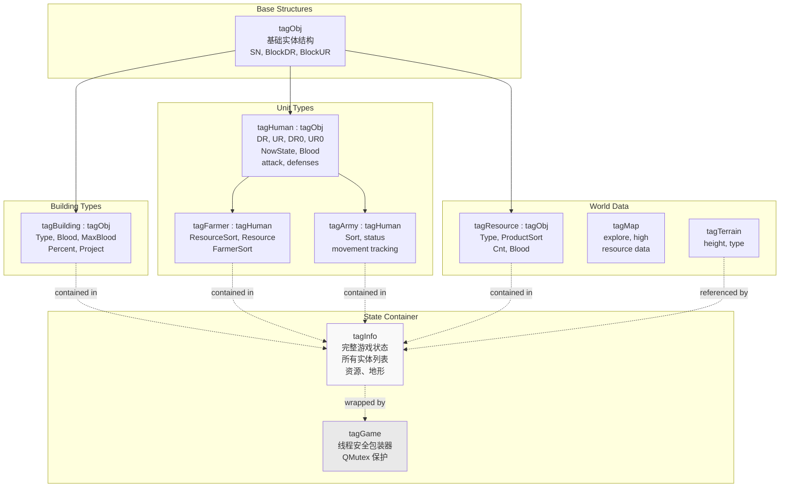
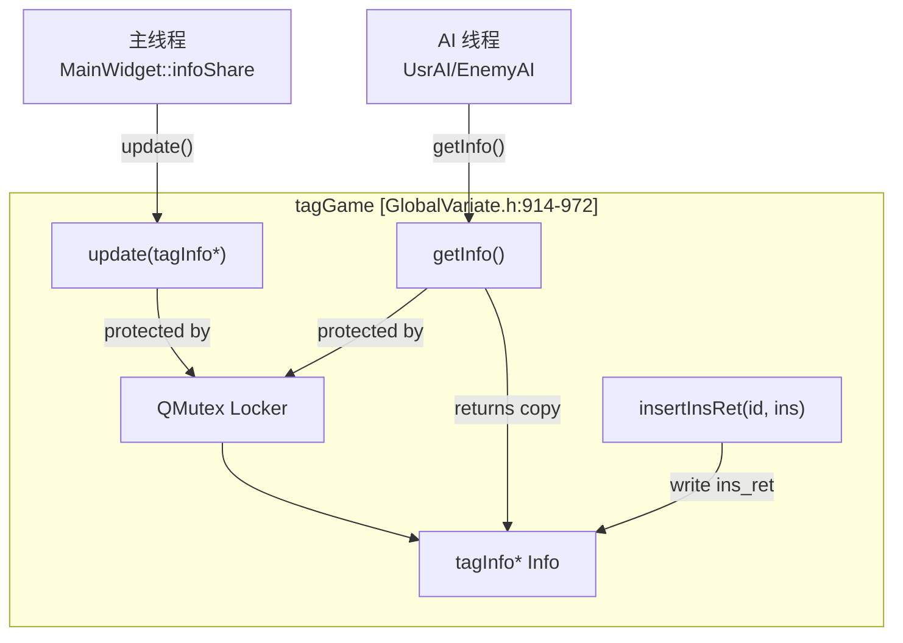
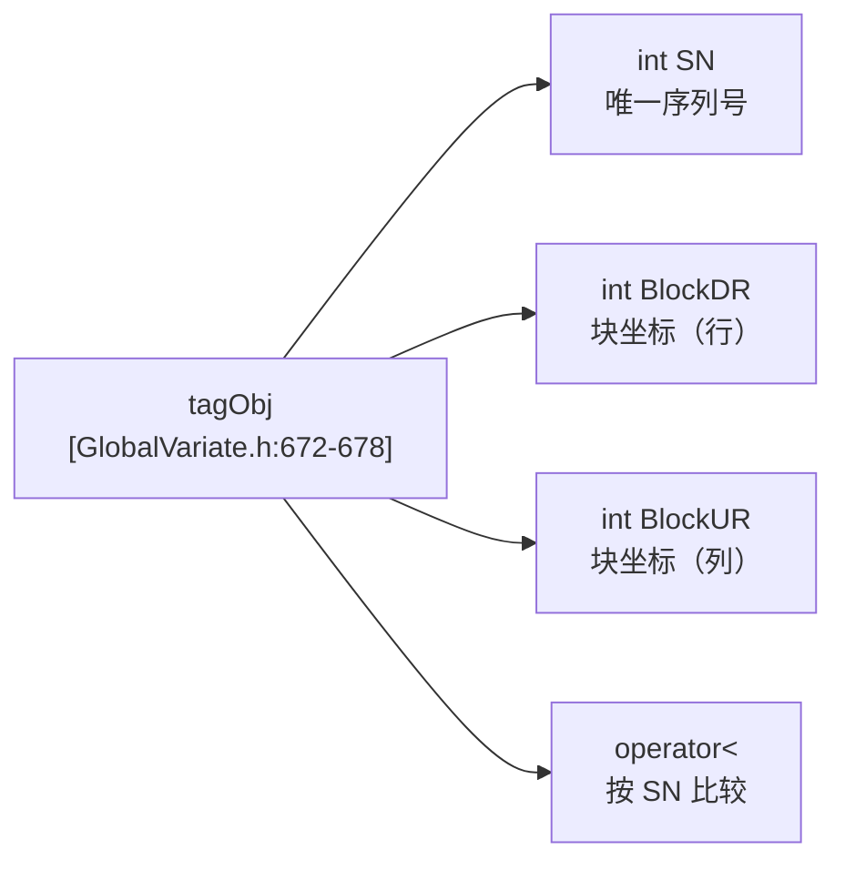
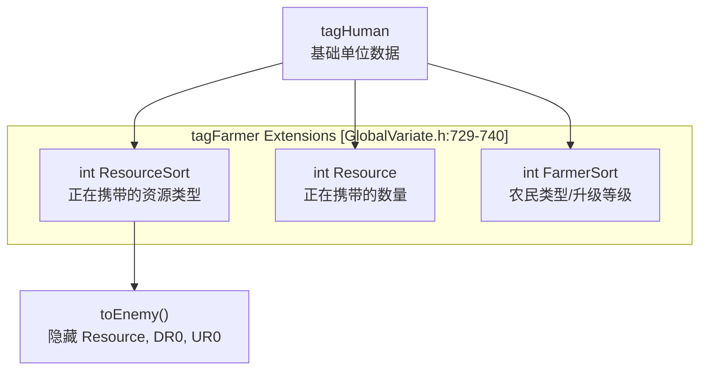
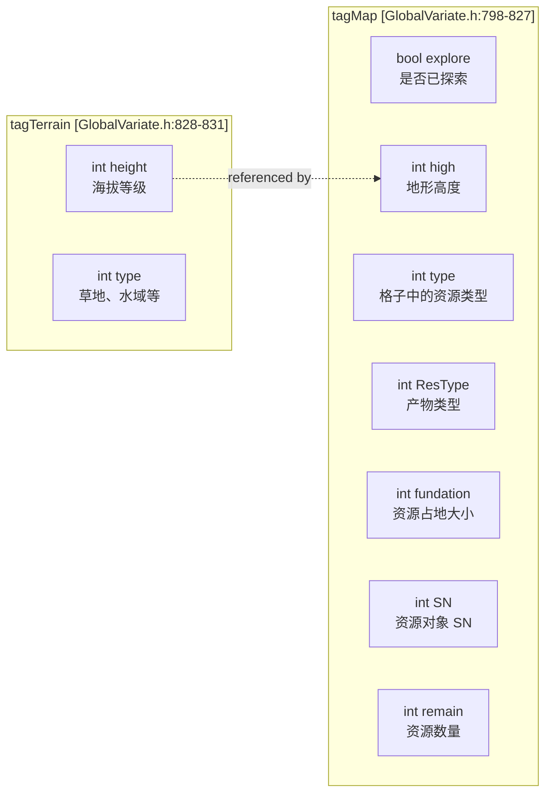
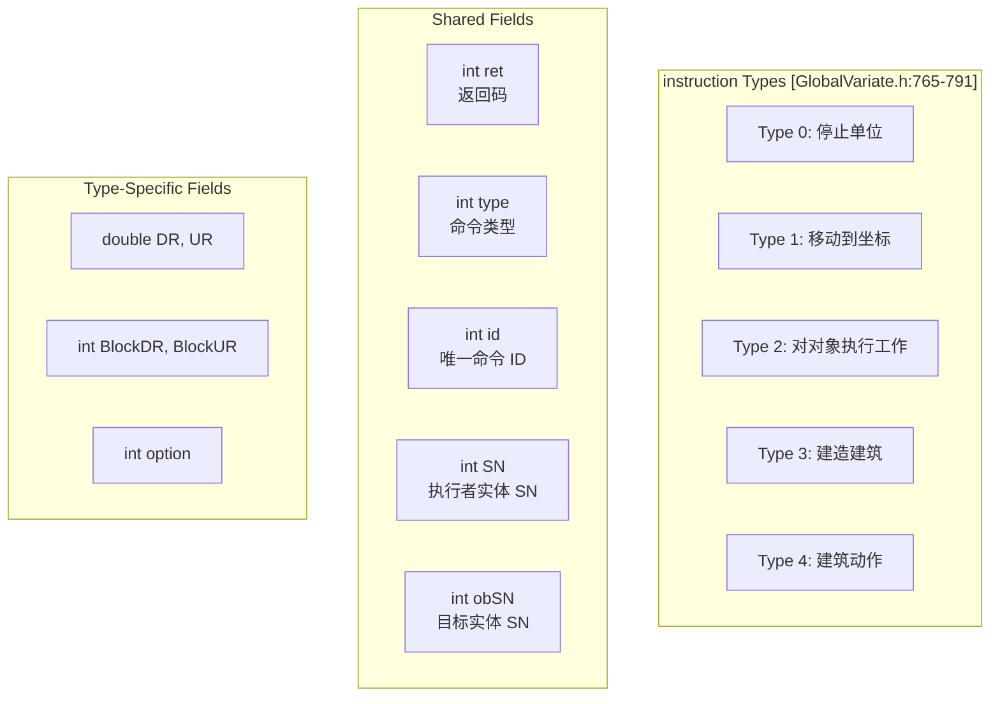
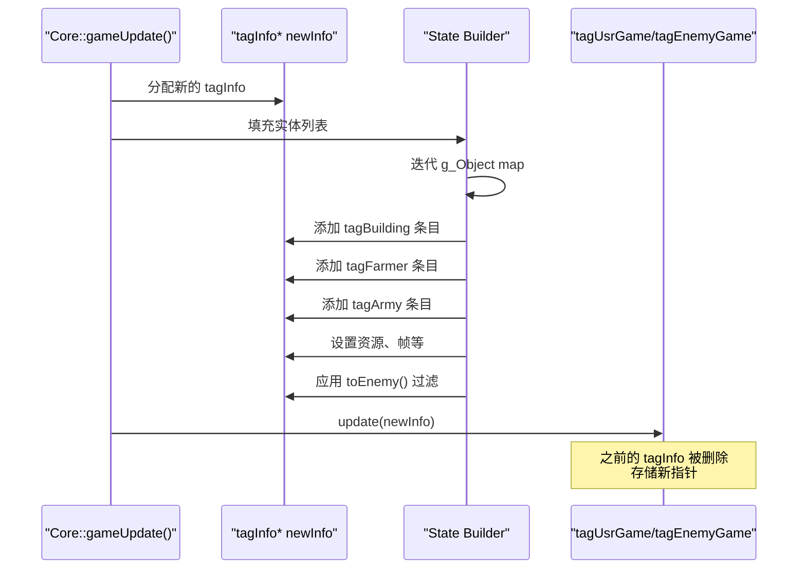
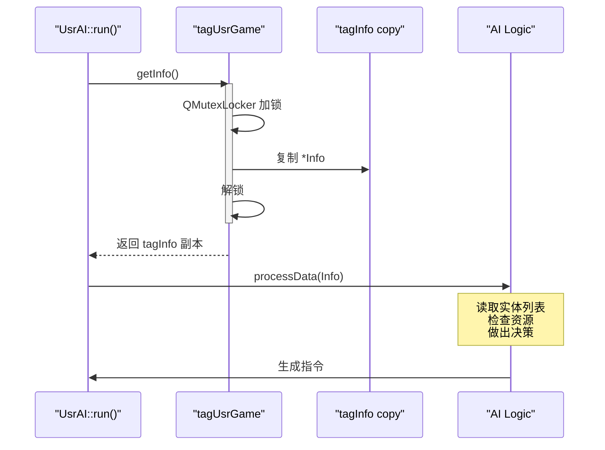
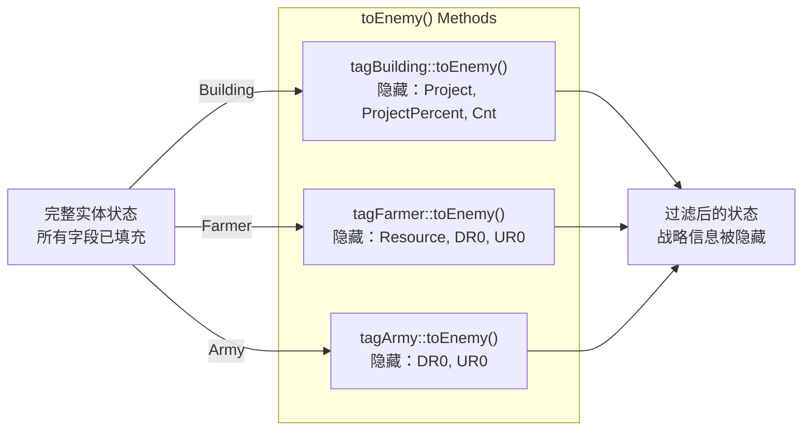

# 游戏状态结构

<details>
<summary>相关源文件</summary>

以下文件被用作生成本 wiki 页面时的上下文：

- [GlobalVariate.h](GlobalVariate.h)
- [config.json](config.json)

</details>


本页记录了整个代码库中用于表示游戏状态的基础数据结构。这些结构是游戏引擎、AI 线程和 UI 组件之间的主要通信机制。

有关科技树和升级结构，请参见[开发结构](#8.2)。有关枚举常量和类型定义，请参见[常量与枚举](#8.3)。有关 AI 线程如何与这些结构交互的详细信息，请参见[AI 架构](#5.1)。

## 概览

游戏状态结构定义在 [GlobalVariate.h:672-973]() 中，并承担多个用途：

- **游戏状态快照**：`tagInfo` 和 `tagGame` 为 AI 线程提供可读取的完整游戏状态
- **实体表示**：`tagObj`、`tagBuilding`、`tagHuman`、`tagFarmer`、`tagArmy` 表示游戏实体
- **世界数据**：`tagResource`、`tagMap`、`tagTerrain` 描述游戏世界
- **命令接口**：`instruction` 和 `ins` 实现 AI 到 Core 的通信

这些结构被设计用于高效序列化，以及主游戏循环与 AI 线程之间的线程安全通信。

来源：[GlobalVariate.h:672-973]()

## 结构层级



**继承关系**

该结构层级使用 C++ struct 继承，主要分为两个分支：

- **实体分支**：`tagObj` → `tagBuilding`（建筑）、`tagHuman` → `tagFarmer`/`tagArmy`（单位）
- **资源分支**：`tagObj` → `tagResource`（可采集对象）

来源：[GlobalVariate.h:672-760]()

## 核心状态容器：tagInfo 和 tagGame

### tagInfo 结构

`tagInfo` 是主要的游戏状态快照结构，包含玩家或 AI 在某一帧可见的全部信息。

```mermaid
graph LR
    subgraph "tagInfo Contents"
        VEC1["vector&lt;tagBuilding&gt; buildings"]
        VEC2["vector&lt;tagFarmer&gt; farmers"]
        VEC3["vector&lt;tagArmy&gt; armies"]
        VEC4["vector&lt;tagBuilding&gt; enemy_buildings"]
        VEC5["vector&lt;tagFarmer&gt; enemy_farmers"]
        VEC6["vector&lt;tagArmy&gt; enemy_armies"]
        VEC7["vector&lt;tagResource&gt; resources"]
        MAP1["map&lt;int, int&gt; ins_ret"]
        TERRAIN["TerrainData* theMap"]
        EXPLORED["vector&lt;Point&gt; exploredUpdate"]
        RES["Wood, Meat, Stone, Gold"]
        META["GameFrame, civilizationStage<br/>Human_MaxNum"]
    end
```



**字段说明**

| 字段 | 类型 | 描述 |
|-------|------|-------------|
| `buildings` | `vector<tagBuilding>` | 玩家的建筑 |
| `farmers` | `vector<tagFarmer>` | 玩家的农民单位 |
| `armies` | `vector<tagArmy>` | 玩家的军事单位 |
| `enemy_buildings` | `vector<tagBuilding>` | 敌方建筑（经过战争迷雾过滤） |
| `enemy_farmers` | `vector<tagFarmer>` | 敌方农民（经过战争迷雾过滤） |
| `enemy_armies` | `vector<tagArmy>` | 敌方军队（经过战争迷雾过滤） |
| `resources` | `vector<tagResource>` | 可见资源（树木、黄金等） |
| `ins_ret` | `map<int, int>` | 指令返回码，`map<id, ret>` |
| `theMap` | `TerrainData*` | 指向地形高度/类型网格的指针 |
| `exploredUpdate` | `vector<Point>` | 本帧新探索出的地图区域 |
| `GameFrame` | `int` | 当前游戏帧编号 |
| `civilizationStage` | `int` | 当前文明时代（0-3） |
| `Wood`, `Meat`, `Stone`, `Gold` | `int` | 玩家的资源数量 |
| `Human_MaxNum` | `int` | 最大人口容量 |

来源：[GlobalVariate.h:847-910]()

### tagGame 结构

`tagGame` 为 `tagInfo` 提供线程安全包装，以供 AI 线程访问。



**关键方法**

| 方法 | 用途 |
|--------|---------|
| `update(tagInfo*)` | 替换内部状态指针（由主线程调用） |
| `getInfo()` | 返回状态的线程安全副本（由 AI 线程调用） |
| `insertInsRet(int id, instruction ins)` | 存储指令结果码 |
| `clearInsRet()` | 清空指令返回映射 |
| `WLHHunYao(vector<T>&)` | 随机化实体顺序以防止被利用 |

`update()` 方法会保留上一帧中的 `ins_ret` 映射，并将其限制为 100 个条目以防止内存增长。`WLHHunYao()` 方法会打乱实体向量的顺序，防止 AI 利用固定排序。

来源：[GlobalVariate.h:914-972]()

## 基础实体结构：tagObj

`tagObj` 是任何可识别游戏实体的最小结构。



**字段**

- `SN`：实体创建时分配的唯一序列号，在整个代码库中用作主要标识符
- `BlockDR`、`BlockUR`：块级坐标（网格位置），坐标系统见[地图结构](#6.1)
- `operator<`：支持在 `std::set` 等有序容器中使用

来源：[GlobalVariate.h:672-678]()

## 建筑结构：tagBuilding

`tagBuilding` 扩展了 `tagObj`，用于表示游戏中的所有建筑类型。

**字段说明**

| 字段 | 类型 | 描述 | 备注 |
|-------|------|-------------|-------|
| `Type` | `int` | 建筑类型枚举 | 参见[常量与枚举](#8.3) |
| `Blood` | `int` | 当前生命值 | |
| `MaxBlood` | `int` | 最大生命值 | |
| `Percent` | `int` | 建造进度 % | 建造期间为 0-100，完成后为 100 |
| `Project` | `int` | 当前项目 ID | 单位训练、科技研究，空闲时为 -1 |
| `ProjectPercent` | `int` | 项目完成百分比 | 活动项目为 0-100 |
| `Cnt` | `int` | 剩余资源量 | 仅农田使用，否则为 -1 |

**战争迷雾过滤**

```cpp
// GlobalVariate.h:688-693
tagBuilding toEnemy() {
    this->Cnt = -1;        // 隐藏农田资源数量
    this->Project = -1;    // 隐藏当前项目
    this->ProjectPercent = -1;  // 隐藏项目进度
    return *this;
}
```

`toEnemy()` 方法会在将建筑数据发送给对手 AI 前进行净化，隐藏战略信息，同时保留位置和类型。

来源：[GlobalVariate.h:679-694]()

## 单位结构

### tagHuman 基础结构

`tagHuman` 是所有移动单位（农民、军队）的基础结构。

| 字段 | 类型 | 描述 |
|-------|------|-------------|
| `DR`, `UR` | `double` | 细节级坐标（精确位置） |
| `DR0`, `UR0` | `double` | 移动目标坐标 |
| `NowState` | `int` | 当前单位状态（空闲、移动、工作、攻击） |
| `WorkObjectSN` | `int` | 目标对象的序列号 |
| `Blood` | `int` | 当前生命值 |
| `attack` | `int` | 攻击值 |
| `rangedDefense` | `int` | 对远程攻击的防御 |
| `meleeDefense` | `int` | 对近战攻击的防御 |

`cast_from(tagHuman)` 方法 [GlobalVariate.h:715-726]() 会从另一个 `tagHuman` 复制状态，用于类型转换。

来源：[GlobalVariate.h:705-728]()

### tagFarmer 结构



**农民专有字段**

- `ResourceSort`：正在携带的资源类型（木材/食物/石头/黄金）
- `Resource`：当前携带的数量（0 到携带上限）
- `FarmerSort`：农民升级层级，影响携带容量和采集速度

`toEnemy()` 方法会隐藏资源载荷和移动目标，以防对手推断基地位置。

来源：[GlobalVariate.h:729-740]()

### tagArmy 结构

带有额外战斗追踪字段的军事单位结构。

| 字段 | 类型 | 描述 |
|-------|------|-------------|
| `Sort` | `int` | 单位类型（棒兵、弓兵、骑兵等） |
| `status` | `int` | 战斗状态标志 |
| `starttime` | `int` | 移动/动作开始帧 |
| `finishtime` | `int` | 移动/动作结束帧 |
| `startpointDR`, `startpointUR` | `double` | 移动起点 |
| `destinaDR`, `destinaUR` | `double` | 移动终点 |
| `ifAttack` | `bool` | 当前是否处于攻击动画中 |
| `timelock` | `int` | 攻击冷却计时器 |

与 `tagFarmer` 类似，`toEnemy()` 方法 [GlobalVariate.h:754-758]() 会隐藏移动终点。

来源：[GlobalVariate.h:742-759]()

## 资源与地图结构

### tagResource 结构

表示可采集资源（树木、金矿、石矿、动物）。

| 字段 | 类型 | 描述 |
|-------|------|-------------|
| `DR`, `UR` | `double` | 细节级坐标 |
| `Type` | `int` | 资源对象类型（树、金矿、瞪羚等） |
| `ProductSort` | `int` | 产出的资源类型（木材/食物/石头/黄金） |
| `Cnt` | `int` | 剩余资源数量 |
| `Blood` | `int` | 当前生命值（动物、树木适用） |

资源继承自 `tagObj` [GlobalVariate.h:696-703]()，因此它们具有 `SN` 和块坐标。

来源：[GlobalVariate.h:696-703]()

### tagTerrain 和 tagMap



**tagTerrain 与 tagMap 的区别**

- `tagTerrain` [GlobalVariate.h:828-831]()：纯地形数据（高度、类型），用于固定地形网格
- `tagMap` [GlobalVariate.h:798-827]()：每个地图格子的地形 + 资源 + 探索状态的组合数据

`tagMap` 结构同时包含地形信息和动态资源数据。`clear_r()` 方法 [GlobalVariate.h:819-826]() 只重置资源字段，同时保留地形数据。

来源：[GlobalVariate.h:798-831]()

## 命令结构

### instruction 结构

`instruction` 结构对 AI 线程发送到游戏核心的命令进行编码。



**各类型的字段用法**

| Type | SN | obSN | DR/UR | BlockDR/UR | option | 描述 |
|------|-----|------|-------|------------|--------|-------------|
| 0 | ✓ | - | - | - | - | 停止单位当前动作 |
| 1 | ✓ | - | ✓ | - | - | 将单位移动到坐标 |
| 2 | ✓ | ✓ | - | - | - | 指派单位对对象执行工作 |
| 3 | ✓ | - | - | ✓ | ✓ | 在块坐标处建造建筑 |
| 4 | ✓ | - | - | - | ✓ | 执行建筑动作 |

**返回码**

| Code | 含义 | 何时设置 |
|------|---------|----------|
| 0 | 成功 | 命令成功执行 |
| -1 | SN 未找到 | 执行者实体不存在 |
| -2 | 动作未找到 | 无效的动作选项 |
| -3 | 越界 | 坐标超出地图范围 |
| -4 | 目标未找到 | `obSN` 实体不存在 |
| -5 | 建筑无效 | 建筑类型不可用 |
| -6 | 资源不足 | 执行所需资源不足 |

详见[指令与命令系统](#5.2)中的详细文档。

来源：[GlobalVariate.h:765-791](), [GlobalVariate.h:1292-1299]()

### ins 结构

用于 AI 到 Core 通信的线程安全指令队列。

```cpp
// GlobalVariate.h:793-797
struct ins {
    int g_id = 0;                     // 全局指令 ID 计数器
    std::queue<instruction> instructions;  // 命令队列
    QMutex lock;                       // 线程同步
};
```

`ins` 结构提供：

- **线程安全**：`QMutex` 保护来自 AI 线程的并发访问
- **FIFO 队列**：指令按提交顺序处理
- **ID 生成**：`g_id` 计数器用于唯一指令追踪

每个 AI 线程都有自己的 `ins` 队列。主游戏循环通过 `Core::manageOrder()` 出队并处理指令。

来源：[GlobalVariate.h:793-797]()

## 数据流模式

### 主线程：状态创建



主线程每一帧都会通过遍历全局 `g_Object` map 并将实体转换为对应的 tag 结构，创建新的 `tagInfo` 快照。

来源：参考自架构图

### AI 线程：状态读取



AI 线程调用 `getInfo()` 来接收一个快照副本，从而保证线程安全的读取访问，并且不会长时间阻塞主线程。

来源：参考自架构图

### 战争迷雾数据净化



在将敌方实体加入 `tagInfo` 之前，状态构建器会调用 `toEnemy()` 方法来隐藏：

- 建筑生产队列和农田资源数量
- 单位载货情况和移动目标

这在数据结构层面实现了战争迷雾，确保 AI 无法访问其本不应获得的信息。

来源：[GlobalVariate.h:688-693](), [GlobalVariate.h:734-740](), [GlobalVariate.h:754-758]()

## 内存管理注意事项

**tagInfo 生命周期**

主线程每帧分配一个新的 `tagInfo`，并将所有权传递给 `tagGame::update()`。上一帧的 `tagInfo` 会被自动删除。这确保 AI 线程不会访问过期数据。

**向量顺序随机化**

`tagGame::WLHHunYao()` 方法 [GlobalVariate.h:921-930]() 会打乱实体向量顺序，以防止 AI 利用固定排序。该行为由 `openHunYao` 标志控制（默认启用）。

**ins_ret 映射裁剪**

为防止无限增长，`tagGame::update()` 会将 `ins_ret` 映射限制为 100 个条目 [GlobalVariate.h:933-937]()，并优先逐出最旧条目。

来源：[GlobalVariate.h:914-972]()

## 代码库中的使用示例

**创建实体 Tag**

在填充 `tagInfo` 时，游戏核心会将内部对象转换为 tag 结构：

```
// Building → tagBuilding
tagBuilding tb;
tb.SN = building->SN;
tb.BlockDR = building->getBlockD();
tb.BlockUR = building->getBlockU();
tb.Type = building->getSort();
tb.Blood = building->getNowBlood();
tb.MaxBlood = building->getMaxBlood();
// ... 填充其余字段
```

**AI 读取状态**

AI 线程通过 `tagGame` 访问游戏状态：

```
tagInfo info = tagUsrGame.getInfo();
for (const tagBuilding& b : info.buildings) {
    if (b.Type == BUILDING_CENTER && b.Percent == 100) {
        // 找到已完成的城镇中心
    }
}
```

**指令结果码**

在处理完指令后，核心会存储结果：

```
instruction ins = /* dequeued from ins.instructions */;
// Process instruction...
ins.ret = 0;  // Success, or error code
tagUsrGame.insertInsRet(ins.id, ins);
```

AI 线程会在后续帧中从 `tagInfo::ins_ret` 读取结果。

来源：参考自架构图，[GlobalVariate.h:765-973]()