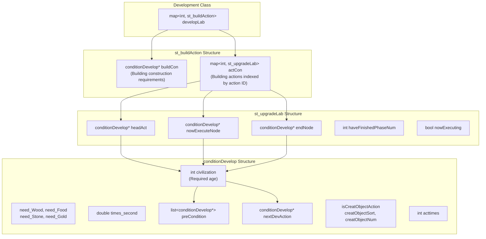
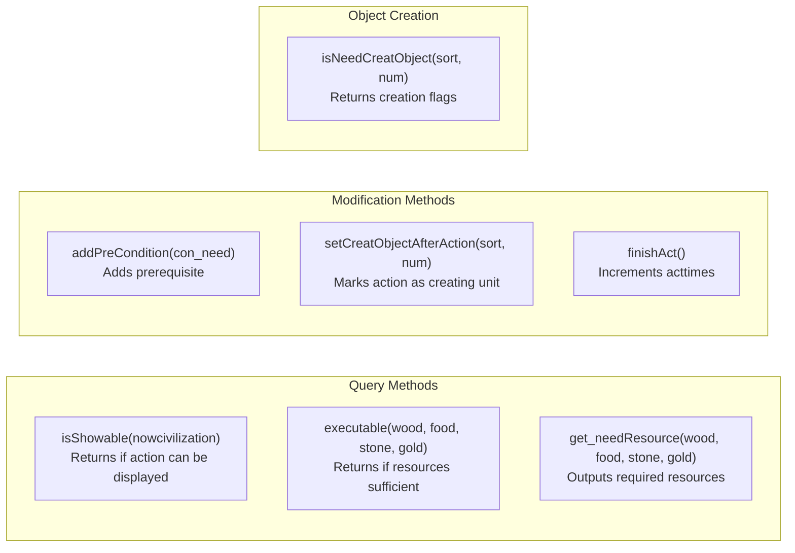
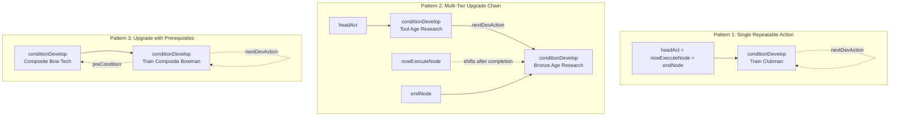
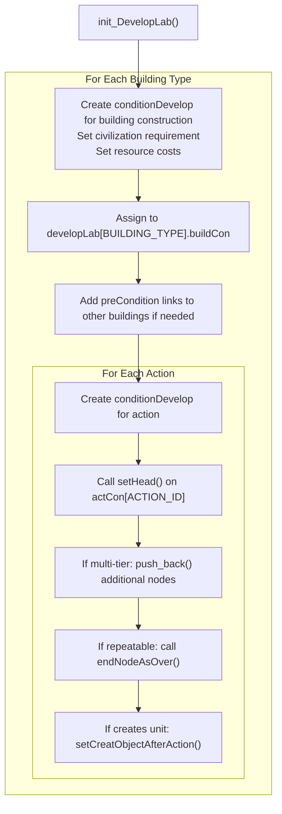
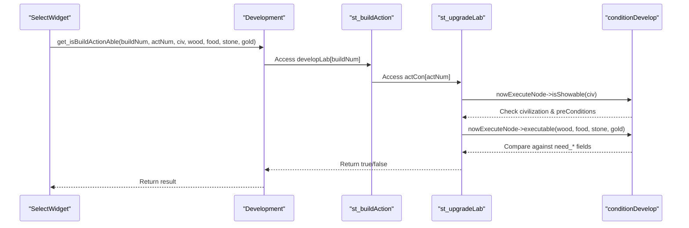
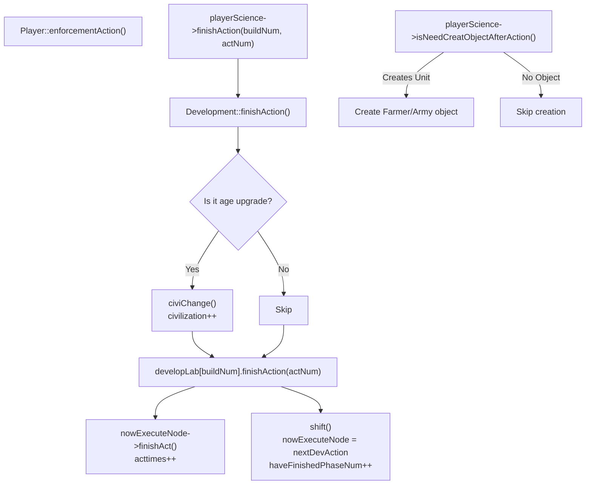

# 开发结构

<details>
<summary>相关源文件</summary>

以下文件被用作生成本 wiki 页面时的上下文：

- [Development.cpp](Development.cpp)
- [Development.h](Development.h)
- [GlobalVariate.h](GlobalVariate.h)
- [Player.cpp](Player.cpp)

</details>


本页记录了在 new-aoe 中定义科技树系统的数据结构。这些结构编码了建筑、单位和升级项目的前置条件、资源消耗、时间以及解锁链。有关管理这些结构的 `Development` 类，请参见 [Technology Tree](#3.2)。有关运行时游戏状态结构，请参见 [Game State Structures](#8.1)。

## 概览

科技树通过三个相互关联的结构来实现：

- **`conditionDevelop`** - 表示一个科技、升级或训练动作的单个节点
- **`st_upgradeLab`** - 用于管理升级链（例如，工具时代 → 青铜时代）的链表管理器
- **`st_buildAction`** - 包含某个建筑的建造需求及其所有可用动作的容器

这些结构在 [Development.cpp:391-693]() 的 `Development::init_DevelopLab()` 中实例化，并存储在按建筑类型索引的 `developLab` 映射中。

## 结构层级

下图展示了这些结构之间的关系：



**来源：** [GlobalVariate.h:1106-1286](), [Development.h:131]()

## conditionDevelop 结构

`conditionDevelop` 结构表示科技树中的单个动作，例如“建造城镇中心”、“研究青铜时代”或“训练棒棒兵”。

### 字段说明

| 字段 | 类型 | 用途 |
|-------|------|---------|
| `civilization` | `int` | 所需的最低文明时代（CIVILIZATION_STONEAGE、CIVILIZATION_TOOLAGE 等） |
| `sort_building` | `int` | 此动作所属的建筑类型 |
| `times_second` | `double` | 完成此动作所需的秒数 |
| `acttimes` | `int` | 此动作已完成的次数 |
| `isCreatObjectAction` | `bool` | 完成此动作后是否会创建单位/建筑 |
| `creatObjectSort` | `int` | 要创建的对象类型（SORT_FARMER、SORT_ARMY 等） |
| `creatObjectNum` | `int` | 被创建对象的具体子类型（AT_CLUBMAN、FARMERTYPE_FARMER 等） |
| `preCondition` | `list<conditionDevelop*>` | 启动前必须先完成的其他动作 |
| `nextDevAction` | `conditionDevelop*` | 链中的下一个升级（用于多层级升级） |
| `need_Wood` | `int` | 木材消耗 |
| `need_Food` | `int` | 食物消耗 |
| `need_Stone` | `int` | 石料消耗 |
| `need_Gold` | `int` | 黄金消耗 |

**来源：** [GlobalVariate.h:1106-1189]()

### 关键方法



**来源：** [GlobalVariate.h:1142-1188]()

### 构造函数模式

主要构造函数在 `init_DevelopLab()` 中被广泛调用：

```cpp
conditionDevelop(int civilization, int sort_building, double needTimes, 
                 int need_Wood = 0, int need_Food = 0, 
                 int need_Stone = 0, int need_Gold = 0)
```

**代码示例：**
[Development.cpp:400-401]() - 创建一个农民训练动作：
```cpp
newNode = new conditionDevelop(CIVILIZATION_STONEAGE, BUILDING_CENTER, TIME_BUILDING_CENTER_CREATEFARMER,
                               0, BUILDING_CENTER_CREATEFARMER_FOOD);
```

**来源：** [GlobalVariate.h:1131-1140](), [Development.cpp:391-693]()

## st_upgradeLab 结构

`st_upgradeLab` 结构管理由 `conditionDevelop` 节点组成的链表，用于那些具有多个层级或可重复执行的动作。它会跟踪当前处于活动状态的链中节点。

### 字段说明

| 字段 | 类型 | 用途 |
|-------|------|---------|
| `headAct` | `conditionDevelop*` | 升级链中的第一个节点 |
| `nowExecuteNode` | `conditionDevelop*` | 当前活动/可用的节点 |
| `endNode` | `conditionDevelop*` | 链中的最后一个节点 |
| `haveFinishedPhaseNum` | `int` | 已完成的阶段数量（每完成一个节点该值递增） |
| `nowExecuting` | `bool` | 当前节点是否正在执行（进行中） |

**来源：** [GlobalVariate.h:1191-1244]()

### 链表模式

下图展示了三种常见的升级链模式：



**来源：** [Development.cpp:403-404](), [Development.cpp:408-413](), [Development.cpp:628-639]()

### 状态管理方法

| 方法 | 用途 |
|--------|---------|
| `setHead(conditionDevelop*)` | 用第一个节点初始化链 |
| `push_back(conditionDevelop*)` | 在链尾追加节点 |
| `endNodeAsOver()` | 将末尾节点标记为可重复（`nextDevAction` 指向其自身） |
| `shift()` | 完成当前节点并移动到下一个（调用 `finishAct()`，递增 `haveFinishedPhaseNum`） |
| `isShowAble(nowcivilization)` | 检查当前动作是否可在 UI 中显示 |
| `executable(nowciv, wood, food, stone, gold)` | 检查当前动作是否可以启动 |
| `beginExecute()` / `overExecute()` | 设置/清除 `nowExecuting` 标志 |

**来源：** [GlobalVariate.h:1208-1250]()

### 使用示例

[Development.cpp:482-486]() 展示了如何创建一个可重复的训练动作：
```cpp
newNode = new conditionDevelop(CIVILIZATION_STONEAGE, BUILDING_ARMYCAMP, TIME_BUILDING_ARMYCAMP_CREATE_CLUBMAN, 
                               0, BUILDING_ARMYCAMP_CREATE_CLUBMAN_FOOD);
newNode->setCreatObjectAfterAction(SORT_ARMY, AT_CLUBMAN);
developLab[BUILDING_ARMYCAMP].actCon[BUILDING_ARMYCAMP_CREATE_CLUBMAN].setHead(newNode);
developLab[BUILDING_ARMYCAMP].actCon[BUILDING_ARMYCAMP_CREATE_CLUBMAN].endNodeAsOver();
```

**来源：** [Development.cpp:482-486]()

## st_buildAction 结构

`st_buildAction` 结构汇总了单个建筑类型的全部科技信息。它包含该建筑的建造需求，以及该建筑可执行的所有动作映射。

### 字段说明

| 字段 | 类型 | 用途 |
|-------|------|---------|
| `buildCon` | `conditionDevelop*` | 建造该建筑所需的条件 |
| `actCon` | `map<int, st_upgradeLab>` | 从动作 ID 到该动作升级链的映射 |

**来源：** [GlobalVariate.h:1262-1278]()

### 方法

| 方法 | 用途 |
|--------|---------|
| `finishBuild()` | 调用 `buildCon->finishAct()` 将建筑标记为已建成 |
| `finishAction(int actNum)` | 完成动作 `actNum` 并切换到下一阶段 |

**来源：** [GlobalVariate.h:1280-1285]()

### 析构行为

析构函数 [GlobalVariate.h:1272-1278]() 会删除 `buildCon` 指针，但动作链的清理由 `st_upgradeLab` 的析构函数 [GlobalVariate.h:1197-1206]() 负责，它会遍历链表并逐个删除节点。

**来源：** [GlobalVariate.h:1197-1206](), [GlobalVariate.h:1272-1278]()

## 科技树初始化

`Development::init_DevelopLab()` 方法会在游戏开始时构建整棵科技树。每种建筑都遵循如下结构模式：



**来源：** [Development.cpp:391-693]()

### 示例：城镇中心初始化

[Development.cpp:396-415]() 展示了城镇中心的完整初始化过程：

```cpp
// Building construction requirement
developLab[BUILDING_CENTER].buildCon = new conditionDevelop(
    CIVILIZATION_IRONAGE, BUILDING_CENTER, TIME_BUILD_CENTER, BUILD_CENTER_WOOD);

// Action 1: Train Farmer (repeatable)
newNode = new conditionDevelop(CIVILIZATION_STONEAGE, BUILDING_CENTER, 
                               TIME_BUILDING_CENTER_CREATEFARMER,
                               0, BUILDING_CENTER_CREATEFARMER_FOOD);
newNode->setCreatObjectAfterAction(SORT_FARMER, FARMERTYPE_FARMER);
developLab[BUILDING_CENTER].actCon[BUILDING_CENTER_CREATEFARMER].setHead(newNode);
developLab[BUILDING_CENTER].actCon[BUILDING_CENTER_CREATEFARMER].endNodeAsOver();

// Action 2: Age Upgrades (multi-tier chain)
// Tier 1: Tool Age
newNode = new conditionDevelop(CIVILIZATION_STONEAGE, BUILDING_CENTER, 
                               TIME_BUILDING_CENTER_UPGRADE,
                               0, BUILDING_CENTER_UPGRADE_TOOLAGE_FOOD);
developLab[BUILDING_CENTER].actCon[BUILDING_CENTER_UPGRADE].setHead(newNode);

// Tier 2: Bronze Age
newNode = new conditionDevelop(CIVILIZATION_TOOLAGE, BUILDING_CENTER,
                               TIME_BUILDING_CENTER_UPGRADE,
                               0, BUILDING_CENTER_UPGRADE_BRONZEAGE_FOOD, 
                               0, BUILDING_CENTER_UPGRADE_BRONZEAGE_GOLD);
developLab[BUILDING_CENTER].actCon[BUILDING_CENTER_UPGRADE].push_back(newNode);
```

**来源：** [Development.cpp:396-415]()

## 查询与校验

`Development` 类提供了遍历这些结构的查询方法：

### 资源校验流程



**来源：** [Development.cpp:338-347](), [GlobalVariate.h:1164-1172](), [GlobalVariate.h:1232-1238]()

### 关键查询方法

来自 [Development.h:86-108]()：

| 方法 | 返回值 | 用途 |
|--------|---------|---------|
| `get_isBuildingShowAble(buildingNum, civ)` | `bool` | 建筑能否在 UI 中显示？ |
| `get_isBuildingAble(buildingNum, w, f, s, g)` | `bool` | 建筑能否被建造？ |
| `get_isBuildActionShowAble(buildingNum, actNum, civ)` | `bool` | 动作能否在 UI 中显示？ |
| `get_isBuildActionAble(buildingNum, actNum, civ, w, f, s, g, oper*)` | `bool` | 动作能否执行？ |
| `get_Resource_Consume(buildNum, &w, &f, &s, &g)` | `void` | 输出建筑的资源消耗 |
| `get_Resource_Consume(buildNum, actNum, &w, &f, &s, &g)` | `void` | 输出动作的资源消耗 |
| `get_buildTime(buildingNum)` | `double` | 获取建造时长 |
| `get_actTime(buildingNum, actNum)` | `double` | 获取动作时长 |
| `getActLevel(buildType, actType)` | `int` | 获取已完成的阶段数 |

**来源：** [Development.h:86-108]()

## 动作完成流程

当某个建筑完成一个动作时，以下序列会更新科技树状态：



**来源：** [Player.cpp:272-324](), [Development.cpp:325-336](), [GlobalVariate.h:1280-1285](), [GlobalVariate.h:1220-1228]()

## 前置条件系统

前置条件通过 `conditionDevelop` 中的 `preCondition` 列表来强制执行。只有当所有前置条件的 `acttimes > 0` 时，一个动作才是可显示的。

### 示例：市场的前置条件

[Development.cpp:515-516]() 展示了市场需要谷仓作为前置条件：
```cpp
developLab[BUILDING_MARKET].buildCon = new conditionDevelop(
    CIVILIZATION_TOOLAGE, BUILDING_MARKET, TIME_BUILD_MARKET, BUILD_MARKET_WOOD);
developLab[BUILDING_MARKET].buildCon->addPreCondition(
    developLab[BUILDING_GRANARY].buildCon);
```

### 示例：战车的前置条件

[Development.cpp:587-593]() 展示了战车需要车轮升级作为前置条件：
```cpp
newNode = new conditionDevelop(CIVILIZATION_BRONZEAGE, BUILDING_STABLE, 
                               TIME_BUILDING_STABLE_CREATE_CHARIOT,
                               BUILDING_STABLE_CREATE_CHARIOT_WOOD, 
                               BUILDING_STABLE_CREATE_CHARIOT_FOOD);
// Add wheel upgrade as prerequisite
newNode->addPreCondition(developLab[BUILDING_MARKET].actCon[BUILDING_MARKET_WHEEL_UPGRADE].headAct);
newNode->setCreatObjectAfterAction(SORT_ARMY, AT_CHARIOT);
```

`isShowable()` 检查 [GlobalVariate.h:1164-1172]() 会验证所有前置条件：
```cpp
for (list<conditionDevelop*>::iterator iter = preCondition.begin(); 
     iter != preCondition.end(); iter++)
    if (!(*iter)->acttimes) return false;
```

**来源：** [Development.cpp:515-516](), [Development.cpp:587-593](), [GlobalVariate.h:1164-1172]()

## 内存管理

### 分配

所有 `conditionDevelop` 节点都在 `init_DevelopLab()` [Development.cpp:391-693]() 中通过 `new` 分配。

### 释放

1. `st_buildAction` 的析构函数 [GlobalVariate.h:1272-1278]() 会删除 `buildCon`
2. `st_upgradeLab` 的析构函数 [GlobalVariate.h:1197-1206]() 会从 `headAct` 遍历到 `endNode`，逐个删除链表节点
3. 当 `Development::~Development()` 销毁 `developLab` 映射时，会调用 `~st_buildAction()`

**注意：** [Development.cpp:692]() 处的注释警告“存在内存泄漏”，说明清理过程可能并不完整。

**来源：** [GlobalVariate.h:1197-1206](), [GlobalVariate.h:1272-1278](), [Development.cpp:692]()

## 与 Development 类的集成

`Development` 类 [Development.h:1-139]() 存储了 `developLab` 映射 [Development.h:131]()：

```cpp
map<int, st_buildAction> developLab;
```

该映射按建筑类型常量（BUILDING_CENTER、BUILDING_ARMYCAMP 等）索引，为任意建筑的科技信息提供 O(1) 访问。

该类还为常见查询提供了便捷访问器：
- 文明/时代管理 [Development.h:44-52]()
- 人口/住房上限 [Development.h:54-69]()
- 资源消耗查询 [Development.h:94-100]()
- 属性修正（攻击、防御、采集速率） [Development.cpp:13-311]()

**来源：** [Development.h:1-139](), [Development.h:131](), [Development.cpp:1-693]()