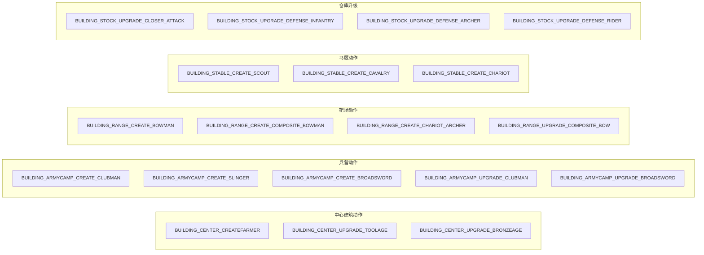
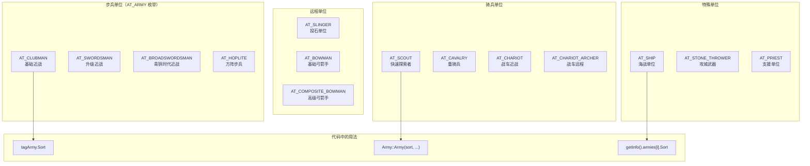
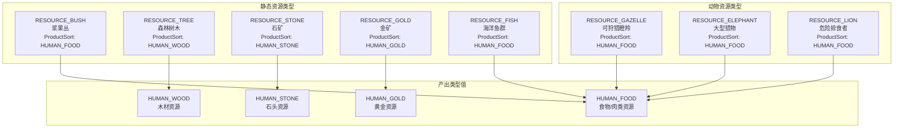
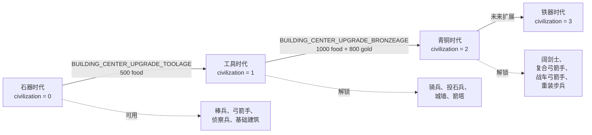
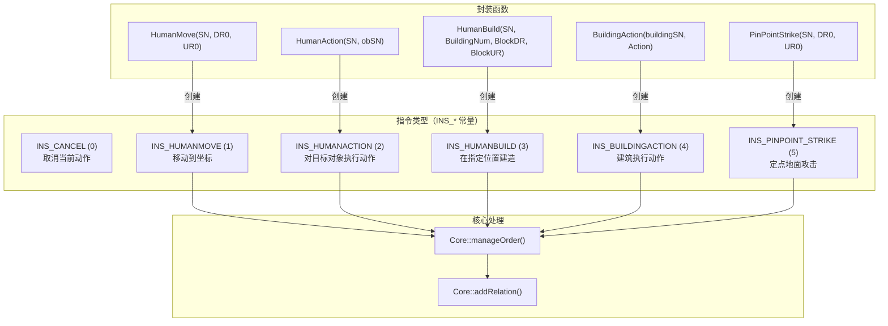
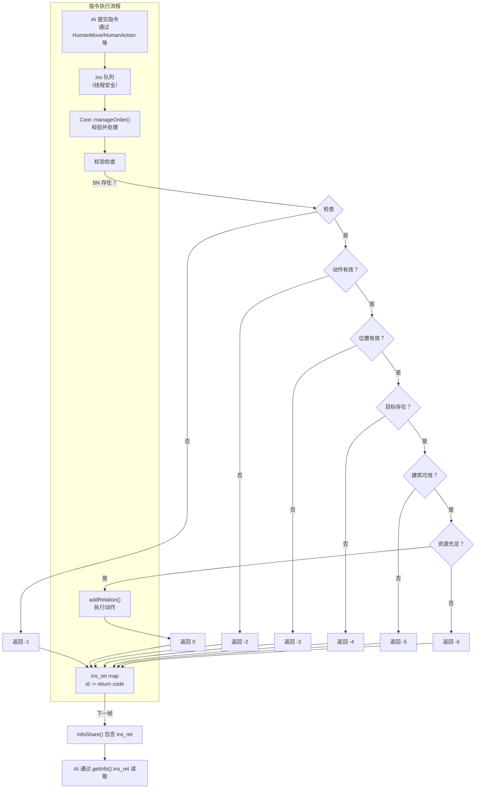
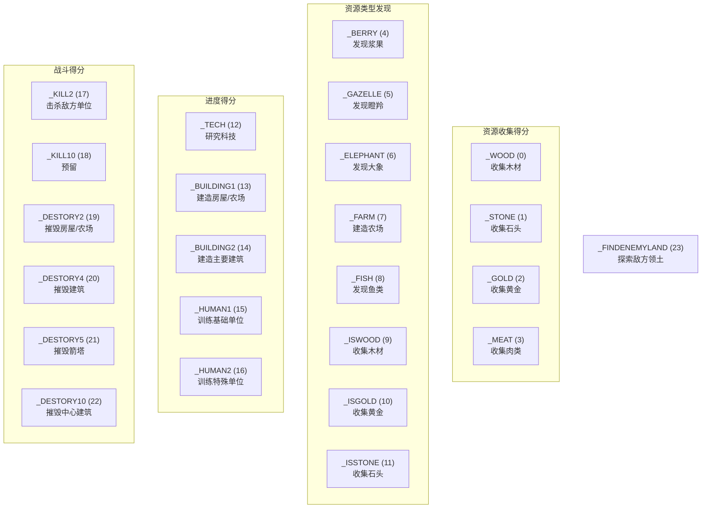
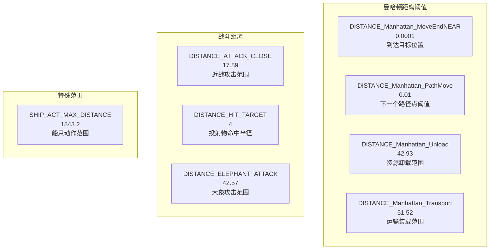
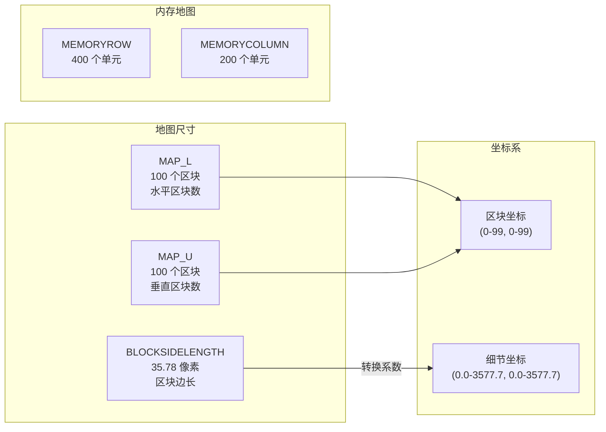

# 常量与枚举

<details>
<summary>相关源文件</summary>

以下文件被用作生成本 wiki 页面的上下文：

- [GlobalVariate.h](GlobalVariate.h)
- [README.md](README.md)
- [config.json](config.json)

</details>


## 目的与范围

本页提供了 `new-aoe` 代码库中所有常量和枚举的完整参考。这些编译期和运行期常量定义了实体类型、游戏状态、指令代码以及控制游戏行为的数值参数。 

有关使用这些常量的数据结构信息，请参见 [游戏状态结构](#8.1) 和 [开发结构](#8.2)。有关加载运行时数值的配置系统，请参见 [配置系统](#2.3)。

这些常量定义在两个位置：
- **config.h** - 编译期枚举定义和宏常量
- **config.json** + **GlobalVariate.h** - 启动时加载的运行时数值参数

---

## 建筑类型常量

建筑类型在 `config.h` 中定义为枚举常量，并在整个代码库中用于标识建筑种类。每种建筑类型都有关联属性，这些属性定义在 `config.json` 中。

### 建筑类型枚举

```mermaid
graph TD
    subgraph "BUILDING_* 常量 (config.h)"
        HOME["BUILDING_HOME<br/>人口住房"]
        CENTER["BUILDING_CENTER<br/>主基地建筑"]
        STOCK["BUILDING_STOCK<br/>步兵升级"]
        GRANARY["BUILDING_GRANARY<br/>仓储与研究"]
        ARMYCAMP["BUILDING_ARMYCAMP<br/>步兵训练"]
        RANGE["BUILDING_RANGE<br/>弓箭手训练"]
        STABLE["BUILDING_STABLE<br/>骑兵训练"]
        MARKET["BUILDING_MARKET<br/>经济升级"]
        DOCK["BUILDING_DOCK<br/>海军单位"]
        SIEGE["BUILDING_SIEGE<br/>攻城武器"]
        COLLAGE["BUILDING_COLLAGE<br/>特殊单位"]
        FARM["BUILDING_FARM<br/>食物生产"]
        ARROWTOWER["BUILDING_ARROWTOWER<br/>防御建筑"]
        WALL["BUILDING_WALL<br/>防御屏障"]
    end
    
    subgraph "使用上下文"
        HUMANBUILD["HumanBuild(SN, BuildingNum, BlockDR, BlockUR)"]
        TAGBUILDING["tagBuilding.Type"]
        PLAYER["Player.build list"]
    end
    
    HOME --> HUMANBUILD
    CENTER --> HUMANBUILD
    STOCK --> TAGBUILDING
    GRANARY --> PLAYER
```



**建筑类型参考表**

| 常量 | 典型用途 | 配置参数 | 提供人口 |
|----------|-------------|-------------------|---------------------|
| `BUILDING_HOME` | 住房 | `BLOOD_BUILD_HOUSE`, `BUILD_HOUSE_WOOD`, `TIME_BUILD_HOME` | `HOUSE_HUMAN_NUM` (4) |
| `BUILDING_CENTER` | 主基地 | `BLOOD_BUILD_CENTER`, `BUILD_CENTER_WOOD`, `BUILDING_CENTER_CREATEFARMER_FOOD` | 0 |
| `BUILDING_STOCK` | 步兵升级 | `BLOOD_BUILD_STOCK`, `BUILD_STOCK_WOOD`, 各种 `BUILDING_STOCK_UPGRADE_*` | 0 |
| `BUILDING_GRANARY` | 仓储与城墙研究 | `BLOOD_BUILD_GRANARY`, `BUILD_GRANARY_WOOD`, `BUILDING_GRANARY_RESEARCH_WALL_FOOD` | 0 |
| `BUILDING_ARMYCAMP` | 训练棒兵、投石兵、阔剑士 | `BUILD_ARMYCAMP_WOOD`, `BUILDING_ARMYCAMP_CREATE_CLUBMAN_FOOD` | 0 |
| `BUILDING_RANGE` | 训练弓箭手、复合弓箭手、战车弓箭手 | `BUILD_RANGE_WOOD`, `BUILDING_RANGE_CREATE_BOWMAN_FOOD` | 0 |
| `BUILDING_STABLE` | 训练侦察兵、骑兵、战车 | `BUILD_STABLE_WOOD`, `BUILDING_STABLE_CREATE_SCOUT_FOOD` | 0 |
| `BUILDING_MARKET` | 经济科技 | `BUILD_MARKET_WOOD`, `BUILDING_MARKET_WOOD_UPGRADE_FOOD` | 0 |
| `BUILDING_DOCK` | 海军单位 | `BUILD_DOCK_WOOD`, `BUILDING_DOCK_CREATE_SHIP_WOOD` | 0 |
| `BUILDING_SIEGE` | 投石车 | `BUILD_SIEGE_WOOD`, `BUILDING_SIEGE_CREATE_STONE_THROWER_WOOD` | 0 |
| `BUILDING_COLLAGE` | 重装步兵 | `BUILD_COLLAGE_WOOD`, `BUILDING_COLLAGE_CREATE_HOPLITE_FOOD` | 0 |
| `BUILDING_FARM` | 可再生食物来源 | `BUILD_FARM_WOOD`, `CNT_BUILD_FARM`（250 食物容量） | 0 |
| `BUILDING_ARROWTOWER` | 防御塔 | `BUILD_ARROWTOWER_STONE`, `DIS_ARROWTOWER`（7 射程） | 0 |
| `BUILDING_WALL` | 防御墙 | `BUILD_WALL_STONE`, `BLOOD_BUILD_WALL` | 0 |

来源: [README.md:116-121](), [config.json:93-257](), [GlobalVariate.h:30-227]()

---

## 建筑动作常量

建筑动作表示特定建筑可用的可训练单位、升级和研究选项。这些常量与 `BuildingAction(buildingSN, Action)` 函数一起使用。



**按建筑划分的单位创建动作**

| 建筑 | 动作常量 | 创建单位 | 食物消耗 | 附加消耗 |
|----------|----------------|---------|-----------|----------------|
| 中心建筑 | `BUILDING_CENTER_CREATEFARMER` | 农民 | 50 | - |
| 兵营 | `BUILDING_ARMYCAMP_CREATE_CLUBMAN` | 棒兵 | 50 | - |
| 兵营 | `BUILDING_ARMYCAMP_CREATE_SLINGER` | 投石兵 | 40 | 10 石头 |
| 兵营 | `BUILDING_ARMYCAMP_CREATE_BROADSWORD` | 阔剑士 | 35 | 15 黄金 |
| 靶场 | `BUILDING_RANGE_CREATE_BOWMAN` | 弓箭手 | 40 | 20 木材 |
| 靶场 | `BUILDING_RANGE_CREATE_COMPOSITE_BOWMAN` | 复合弓箭手 | 40 | 20 黄金 |
| 靶场 | `BUILDING_RANGE_CREATE_CHARIOT_ARCHER` | 战车弓箭手 | 40 | 70 木材 |
| 马厩 | `BUILDING_STABLE_CREATE_SCOUT` | 侦察兵 | 60 | - |
| 马厩 | `BUILDING_STABLE_CREATE_CAVALRY` | 骑兵 | 70 | 80 黄金 |
| 马厩 | `BUILDING_STABLE_CREATE_CHARIOT` | 战车 | 40 | 60 木材 |
| 码头 | `BUILDING_DOCK_CREATE_SHIP` | 战船 | - | 135 木材 |
| 攻城工坊 | `BUILDING_SIEGE_CREATE_STONE_THROWER` | 投石车 | - | 180 木材 + 80 黄金 |
| 学院 | `BUILDING_COLLAGE_CREATE_HOPLITE` | 重装步兵 | 60 | 40 黄金 |

**研究/升级动作**

| 建筑 | 动作常量 | 效果 | 需求 |
|----------|----------------|--------|--------------|
| 中心建筑 | `BUILDING_CENTER_UPGRADE_TOOLAGE` | 升级到工具时代 | 500 食物 |
| 中心建筑 | `BUILDING_CENTER_UPGRADE_BRONZEAGE` | 升级到青铜时代 | 1000 食物 + 800 黄金 |
| 仓库 | `BUILDING_STOCK_UPGRADE_CLOSER_ATTACK` | +2 近战攻击 | 100 食物 |
| 仓库 | `BUILDING_STOCK_UPGRADE_DEFENSE_INFANTRY` | +2 步兵防御 | 75 食物 |
| 市场 | `BUILDING_MARKET_WOOD_UPGRADE` | +2 木材携带量，+0.2 采集速率 | 120 食物 + 75 木材 |
| 市场 | `BUILDING_MARKET_STONE_UPGRADE` | +3 石头携带量，+0.2 采集速率 | 100 食物 + 50 石头 |
| 谷仓 | `BUILDING_GRANARY_RESEARCH_WALL` | 解锁城墙建造 | 50 食物 |
| 谷仓 | `BUILDING_GRANARY_ARROWTOWER` | 解锁箭塔 | 50 食物 |

来源: [README.md:120-121](), [config.json:97-469](), [GlobalVariate.h:34-210]()

---

## 单位类型常量

### 军队类型枚举（AT_ARMY）

`AT_ARMY` 枚举定义了所有军事单位类型。这些值存储在 `tagArmy.Sort` 中，并用于确定单位行为、属性和渲染方式。



**军队单位属性表**

| 单位类型常量 | 速度 | 视野 | 攻击范围 | 血量 | 攻击 | 防御（近战/远程） | 攻击间隔 |
|-------------------|-------|--------|--------------|-------|--------|-------------------|-----------------|
| `AT_CLUBMAN` | 2.44 | 4 | 0（近战） | 40 | 3 | 0/0 | 1.5 |
| `AT_SLINGER` | 2.44 | 5 | 4 | 25 | 2 | 0/2 | 1.5 |
| `AT_BOWMAN` | 2.44 | 7 | 5 | 35 | 3 | 0/0 | 1.4 |
| `AT_SCOUT` | 4.07 | 8 | 0（近战） | 80 | 5 | 0/0 | 1.5 |
| `AT_SWORDSMAN` | 2.44 | 4 | 0（近战） | 150 | 9 | 1/0 | 1.5 |
| `AT_CAVALRY` | 4.07 | 4 | 0（近战） | 150 | 8 | 0/0 | 1.5 |
| `AT_SHIP` | 4.07 | 4 | 10 | 300 | 20 | 0/0 | 1.4 |
| `AT_STONE_THROWER` | 1.12 | 10 | 10 | 300 | 20 | 0/0 | 4.2 |
| `AT_HOPLITE` | 2.44 | 4 | 0（近战） | 100 | 8 | 2/1 | 1.5 |
| `AT_CHARIOT` | 3.5 | 5 | 0（近战） | 120 | 10 | 1/0 | 1.2 |
| `AT_CHARIOT_ARCHER` | 3.0 | 7 | 6 | 100 | 6 | 0/0 | 1.4 |
| `AT_BROADSWORDSMAN` | 2.44 | 4 | 0（近战） | 70 | 9 | 1/0 | 1.5 |
| `AT_COMPOSITE_BOWMAN` | 2.44 | 9 | 7 | 45 | 5 | 0/0 | 1.4 |

### 农民类型常量

农民由单一类型（`SORT_FARMER`）表示，但可以处于由 `HUMAN_STATE_*` 常量定义的不同状态。

**农民状态常量**

| 常量 | 含义 | 在 tagFarmer.NowState 中可见 |
|----------|---------|-------------------------------|
| `HUMAN_STATE_IDLE` | 站立空闲 | 是 |
| `HUMAN_STATE_WALKING` | 移动到目标位置 | 是 |
| `HUMAN_STATE_WORKING` | 采集或建造中 | 是 |
| `HUMAN_STATE_ATTACKING` | 战斗模式 | 是 |

来源: [config.json:266-470](), [GlobalVariate.h:308-499]()

---

## 资源类型常量

资源类型用于标识地图上可采集的材料。它们出现在 `tagResource.Type` 和 `tagResource.ProductSort` 中。



**资源类型参考**

| 资源常量 | 初始数量（CNT_*） | 血量/容量 | ProductSort | 采集说明 |
|-------------------|-----------------------|----------------|-------------|-----------------|
| `RESOURCE_BUSH` | `CNT_BUSH` (150) | - | `HUMAN_FOOD` | 浆果丛 |
| `RESOURCE_TREE` | `CNT_TREE` (75) | `BLOOD_TREE` (25) | `HUMAN_WOOD` | 必须砍伐 |
| `RESOURCE_STONE` | `CNT_STONE` (250) | - | `HUMAN_STONE` | 石矿 |
| `RESOURCE_GOLD` | `CNT_GOLDORE` (200) | - | `HUMAN_GOLD` | 金矿石 |
| `RESOURCE_FISH` | `CNT_FISH` (200) | - | `HUMAN_FOOD` | 仅限海洋 |
| `RESOURCE_GAZELLE` | `CNT_GAZELLE` (150) | `BLOOD_GAZELLE` (8) | `HUMAN_FOOD` | 必须狩猎 |
| `RESOURCE_ELEPHANT` | `CNT_ELEPHANT` (300) | `BLOOD_ELEPHANT` (45) | `HUMAN_FOOD` | 具有攻击性 |
| `RESOURCE_LION` | `CNT_LION` (100) | `BLOOD_LION` (20) | `HUMAN_FOOD` | 具有攻击性 |

来源: [config.json:44-77](), [GlobalVariate.h:266-298]()

---

## 文明时代常量

文明阶段控制哪些科技和单位可用。时代存储在 `Development.civilization` 和 `tagInfo.civilizationStage` 中。



**时代推进表**

| 时代值 | 时代名称 | 解锁方式 | 关键解锁内容 |
|-----------|----------|---------------|-------------|
| 0 | 石器时代 | 起始时代 | 棒兵、弓箭手、侦察兵、基础建筑 |
| 1 | 工具时代 | 中心建筑升级（500 食物） | 骑兵、投石兵、城墙、箭塔、市场升级 |
| 2 | 青铜时代 | 中心建筑升级（1000 食物 + 800 黄金） | 阔剑士、复合弓箭手、战车弓箭手、重装步兵、高级升级 |
| 3 | 铁器时代 | （未实现） | 为未来扩展预留 |

来源: [config.json:99-102](), [GlobalVariate.h:1108]()

---

## 指令类型常量

指令类型定义了从 AI 线程发送到 Core 引擎的 AI 命令。这些是指令处理系统使用的内部常量。



**指令类型详情**

| 类型常量 | 值 | 封装函数 | 参数 | 用途 |
|---------------|-------|----------------------|------------|---------|
| `INS_CANCEL` | 0 | （直接） | `type=0, SN` | 终止对象当前动作 |
| `INS_HUMANMOVE` | 1 | `HumanMove(SN, DR0, UR0)` | `type=1, SN, DR, UR` | 命令单位行走到坐标 |
| `INS_HUMANACTION` | 2 | `HumanAction(SN, obSN)` | `type=2, SN, obSN` | 设置工作/攻击目标对象 |
| `INS_HUMANBUILD` | 3 | `HumanBuild(SN, BuildingNum, BlockDR, BlockUR)` | `type=3, SN, BlockDR, BlockUR, option=BuildingNum` | 建造新建筑 |
| `INS_BUILDINGACTION` | 4 | `BuildingAction(buildingSN, Action)` | `type=4, SN, option=Action` | 建筑训练/研究 |
| `INS_PINPOINT_STRIKE` | 5 | `PinPointStrike(SN, DR0, UR0)` | `type=5, SN, DR, UR` | 攻城武器地面攻击 |

来源: [GlobalVariate.h:765-791](), [README.md:121-127]()

---

## 指令返回码

所有 AI 指令都会通过 `tagInfo.ins_ret` 映射返回状态码。键是指令 ID，值是以下返回码之一。

**返回码参考**

| 代码 | 常量名称 | 含义 | 常见原因 |
|------|---------------|---------|---------------|
| 0 | Success | 指令执行成功 | 参数有效，资源可用 |
| -1 | SN Not Found | 指定单位/建筑 SN 不存在 | 单位已死亡、SN 错误，或不属于玩家 |
| -2 | Action Not Found | 建筑动作不存在 | 该建筑类型的动作编号无效 |
| -3 | Out of Bounds | 位置超出地图范围 | BlockDR/BlockUR 或 DR/UR 超出地图限制 |
| -4 | Target Not Found | 目标对象（obSN）不存在 | 目标对象已被销毁 |
| -5 | Building Invalid | BuildingNum 不存在或不可用 | 科技未研究、时代错误 |
| -6 | Insufficient Resources | 木材/食物/石头/黄金不足 | 玩家资源低于需求 |



**返回码使用示例**

```cpp
// In AI code (UsrAI::processData)
int moveId = HumanMove(farmerSN, targetDR, targetUR);

// Next frame, check result
tagInfo info = getInfo();
if (info.ins_ret.count(moveId)) {
    int result = info.ins_ret[moveId];
    if (result == 0) {
        // Success
    } else if (result == -1) {
        // Farmer doesn't exist anymore
    } else if (result == -3) {
        // Target position out of bounds
    }
}
```

来源: [GlobalVariate.h:1291-1299](), [README.md:308-312]()

---

## ScoreType 枚举

`ScoreType` 枚举用于跟踪各种玩家成就以进行计分。每种类型对应一类不同的成就。



**得分点数值**

| ScoreType | 奖励分数 | 触发条件 |
|-----------|----------------|-------------------|
| `_WOOD`, `_STONE`, `_GOLD`, `_MEAT` | 每收集 100 点 +1 | 每 100 单位资源 |
| `_BERRY`, `_GAZELLE`, `_FISH` 等 | +5 | 首次采集新资源类型 |
| `_ISGOLD` | +10（奖励） | 首次采集黄金 |
| `_TECH` | +2 | 每项已研究科技 |
| `_BUILDING1` | +1 | 建造房屋或农场 |
| `_BUILDING2` | +2 | 建造其他建筑 |
| `_HUMAN1` | +1 | 训练基础单位 |
| `_HUMAN2` | +2 | 训练特殊单位 |
| `_KILL2` | +2 | 击杀敌方单位 |
| `_DESTORY2` | +2 | 摧毁房屋/农场 |
| `_DESTORY4` | +4 | 摧毁建筑 |
| `_DESTORY5` | +5 | 摧毁箭塔 |
| `_DESTORY10` | +10 | 摧毁中心建筑 |
| `_FINDENEMYLAND` | +10 | 首次探索敌方领土 |

来源: [GlobalVariate.h:555-670]()

---

## 距离与碰撞常量

这些常量定义了游戏中的空间关系、碰撞检测和移动阈值。

### 距离常量



**距离常量参考**

| 常量 | 值 | 单位 | 用途 |
|----------|-------|------|-------|
| `DISTANCE_Manhattan_MoveEndNEAR` | 0.0001 | 细节单位 | 单位认为移动已完成 |
| `DISTANCE_Manhattan_PathMove` | 0.01 | 细节单位 | 前进到下一个路径节点的阈值 |
| `DISTANCE_Manhattan_Unload` | 42.93 | 细节单位 | 在建筑处存放资源的最大距离 |
| `DISTANCE_Manhattan_Transport` | 51.52 | 细节单位 | 运输操作的最大距离 |
| `DISTANCE_ATTACK_CLOSE` | 17.89 | 细节单位 | 近战交战范围 |
| `DISTANCE_HIT_TARGET` | 4 | 细节单位 | 投射物命中检测半径 |
| `DISTANCE_ELEPHANT_ATTACK` | 42.57 | 细节单位 | 大象单位攻击范围 |
| `SHIP_ACT_MAX_DISTANCE` | 1843.2 | 细节单位 | 船只最大作战范围 |

### 碰撞盒常量

碰撞盒（crashbox）定义了对象所占据的物理空间，用于寻路和放置合法性校验。

**Crashbox 大小参考**

| 常量 | 值 | 用途 |
|----------|-------|----------|
| `CRASHBOX_MICRO` | 1.0 | 非常小的对象（资源） |
| `CRASHBOX_SINGLEBLOCK` | 16.36 | 1x1 格建筑（房屋） |
| `CRASHBOX_SMALLBLOCK` | 34.21 | 小占地建筑 |
| `CRASHBOX_SMALL` | 32.72 | 小型单位 |
| `CRASHBOX_MIDDLE` | 50.57 | 中型建筑 |
| `CRASHBOX_BIG` | 68.42 | 大型建筑（中心建筑） |
| `CRASHBOX_SINGLEOB` | 5.96 | 小对象 |
| `CRASHBOX_SMALLOB` | 8.925 | 中对象 |
| `CRASHBOX_BIGOB` | 17.7 | 大对象 |

来源: [config.json:84-92](), [config.json:258-265](), [GlobalVariate.h:21-29](), [GlobalVariate.h:300-307]()

---

## 投射物速度常量

投射物速度决定了不同类型的飞行物在地图上的移动速度。

**投射物类型速度**

| 常量 | 值 | 细节单位/帧 | 使用者 |
|----------|-------|-------------------|---------|
| `Missile_Speed_Spear` | 8.94 | 长矛投射物 | 投石兵单位 |
| `Missile_Speed_Arrow` | 20.12 | 箭矢投射物 | 弓箭手、复合弓箭手 |
| `Missile_Speed_Cobblestone` | 20.12 | 石块投射物 | 投石兵单位 |
| `Missile_Speed_Boulders` | 8.94 | 巨石投射物 | 投石车 |
| `Missile_Boulders_Range` | 2 | 溅射伤害半径 | 投石车范围效果 |

来源: [config.json:398-402](), [GlobalVariate.h:482-486]()

---

## 单位动画计时器常量

这些常量定义了不同单位类型（NOWRES_TIMER_*）的动画帧计时。

**动画计时器参考**

| 常量 | 值 | 帧数 | 单位类型 |
|----------|-------|--------|-----------|
| `NOWRES_TIMER_FARMER` | 1 | 1 | 农民 |
| `NOWRES_TIMER_CLUBMAN` | 1 | 1 | 棒兵 |
| `NOWRES_TIMER_SWORSMAN` | 1 | 1 | 剑士变体 |
| `NOWRES_TIMER_SLINGER` | 1 | 1 | 投石兵 |
| `NOWRES_TIMER_BOWMAN` | 2 | 2 | 弓箭手 |
| `NOWRES_TIMER_IMPROVEDBOWMAN1` | 2 | 2 | 改良弓箭手 |
| `NOWRES_TIMER_SCOUT` | 2 | 2 | 侦察兵 |
| `NOWRES_TIMER_CAVALRY` | 2 | 2 | 骑兵 |
| `NOWRES_TIMER_CHARIOT` | 2 | 2 | 战车 |
| `NOWRES_TIMER_SHIP` | 2 | 2 | 船只 |
| `NOWRES_TIMER_STONE_THROWER` | 7 | 7 | 投石车 |
| `NOWRES_TIMER_PRIEST` | 7 | 7 | 祭司 |
| `NOWRES_TIMER_LION` | 1 | 1 | 狮子 |
| `NOWRES_TIMER_ELEPHANT` | 1 | 1 | 大象 |

来源: [config.json:403-424](), [GlobalVariate.h:487-499]()

---

## 地图与网格常量

地图尺寸和区块大小控制游戏世界布局。



**地图配置常量**

| 常量 | 值 | 描述 |
|----------|-------|-------------|
| `MAP_L` | 100 | 水平区块数量 |
| `MAP_U` | 100 | 垂直区块数量 |
| `BLOCKSIDELENGTH` | 35.78 | 每个区块的像素宽度/高度 |
| `MEMORYROW` | 400 | 视野/战争迷雾记忆行数 |
| `MEMORYCOLUMN` | 200 | 视野/战争迷雾记忆列数 |
| `GAME_WIDTH` | 1920 | 主窗口宽度 |
| `GAME_HEIGHT` | 1000 | 主窗口高度 |
| `GAMEWIDGET_WIDTH` | 1440 | 游戏画布宽度 |
| `GAMEWIDGET_HEIGHT` | 751 | 游戏画布高度 |

来源: [config.json:11-28](), [GlobalVariate.h:228-256]()

---

## 地形类型常量

地形类型定义了地图区块的特征。这些值存储在 `tagTerrain.type` 中，并影响寻路和建筑放置。

**地形类型值**

| 类型值 | 名称 | 特征 |
|------------|------|-----------------|
| 0 | 海洋/水域 | 不能建造，只有船只可通行 |
| 1 | 草地 | 普通地形，可建造，可行走 |
| 2 | 海岸 | 陆地与水域之间的过渡带 |
| 3+ | 预留 | 未来地形类型（沙漠、森林等） |

**高度值**

高度存储在 `tagTerrain.height` 中，并影响视觉渲染，也可能影响移动成本。

| 高度范围 | 地形特征 |
|--------------|-----------------|
| -1 | 海洋深度 |
| 0 | 海平面 / 低地 |
| 1-2 | 正常海拔 |
| 3+ | 山丘 / 高地 |

来源: [GlobalVariate.h:828-831](), Map.cpp 中的地图生成逻辑

---

## 汇总表

### 完整枚举交叉参考

| 类别 | 主要位置 | 运行时配置 | 关键结构 |
|----------|------------------|----------------|----------------|
| 建筑类型 | config.h | config.json `BUILD_*` | `tagBuilding.Type` |
| 建筑动作 | config.h | config.json `BUILDING_*_CREATE/UPGRADE_*` | 用于 `BuildingAction()` |
| 军队类型 | config.h | config.json `BLOOD_*`, `ATK_*` 等 | `tagArmy.Sort` |
| 资源类型 | config.h | config.json `CNT_*`, `RESOURCE_*` | `tagResource.Type` |
| 指令类型 | config.h | - | `instruction.type` |
| 返回码 | - | - | `tagInfo.ins_ret` 值 |
| 得分类型 | GlobalVariate.h | - | `Score.update()` 参数 |
| 文明时代 | Development system | config.json 时代升级花费 | `tagInfo.civilizationStage` |

### 配置文件映射

| 运行时参数类别 | 配置前缀 | 示例 |
|---------------------------|---------------|---------|
| 建筑血量 | `BLOOD_BUILD_*` | `BLOOD_BUILD_CENTER` = 600 |
| 建筑木材花费 | `BUILD_*_WOOD` | `BUILD_HOUSE_WOOD` = 30 |
| 建筑时间 | `TIME_BUILD_*` | `TIME_BUILD_HOME` = 20 |
| 单位创建花费 | `BUILDING_*_CREATE_*_FOOD/WOOD/GOLD/STONE` | `BUILDING_CENTER_CREATEFARMER_FOOD` = 50 |
| 单位创建时间 | `TIME_BUILDING_*_CREATE_*` | `TIME_BUILDING_CENTER_CREATEFARMER` = 20 |
| 升级花费 | `BUILDING_*_UPGRADE_*_FOOD/GOLD` | `BUILDING_STOCK_UPGRADE_CLOSER_ATTACK_FOOD` = 100 |
| 升级效果 | `BUILDING_*_UPGRADE_*_ADDITION_*` | `BUILDING_STOCK_UPGRADE_CLOSER_ATTACK_ADDITION_ATTACK` = 2 |
| 单位属性 | `BLOOD_*`, `ATK_*`, `DEF*_*`, `SPEED_*`, `VISION_*`, `DIS_*`, `INTERVAL_*` | `BLOOD_CLUBMAN1` = 40, `ATK_CLUBMAN1` = 3 |
| 资源初始数量 | `CNT_*` | `CNT_TREE` = 75, `CNT_GAZELLE` = 150 |
| 农民能力 | `FARMER_CARRYLIMIT_*`, `FARMER_GATHERSPEED_*` | `FARMER_CARRYLIMIT_WOOD` = 10 |
| 距离阈值 | `DISTANCE_*` | `DISTANCE_ATTACK_CLOSE` = 17.89 |
| 碰撞盒 | `CRASHBOX_*` | `CRASHBOX_MIDDLE` = 50.57 |

来源: [config.json:1-471](), [GlobalVariate.h:1-525](), [README.md:113-162]()