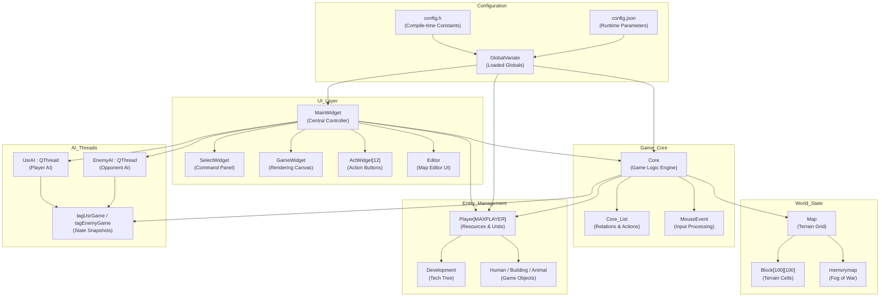
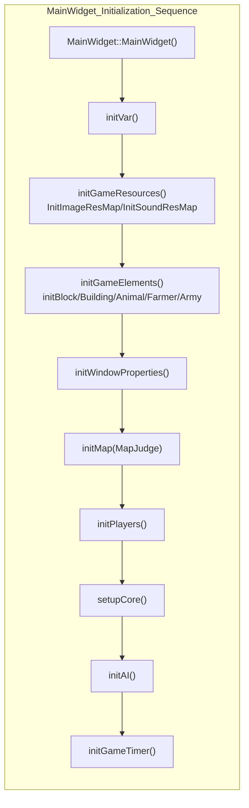
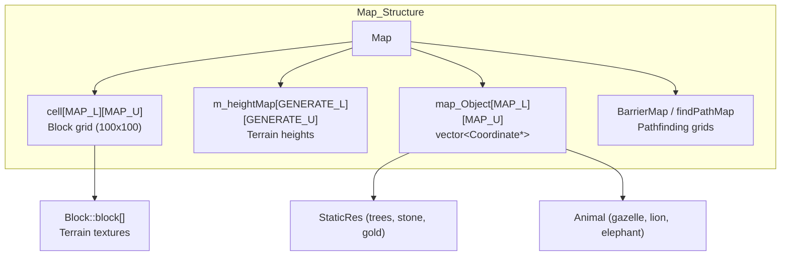
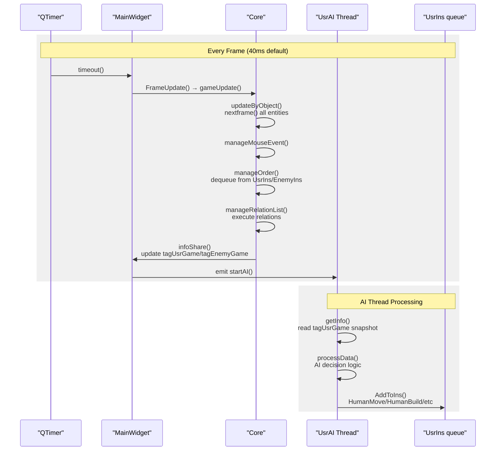
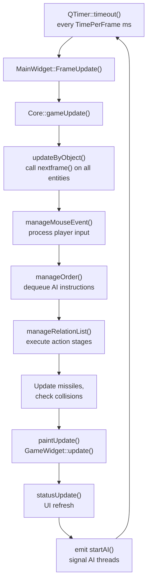
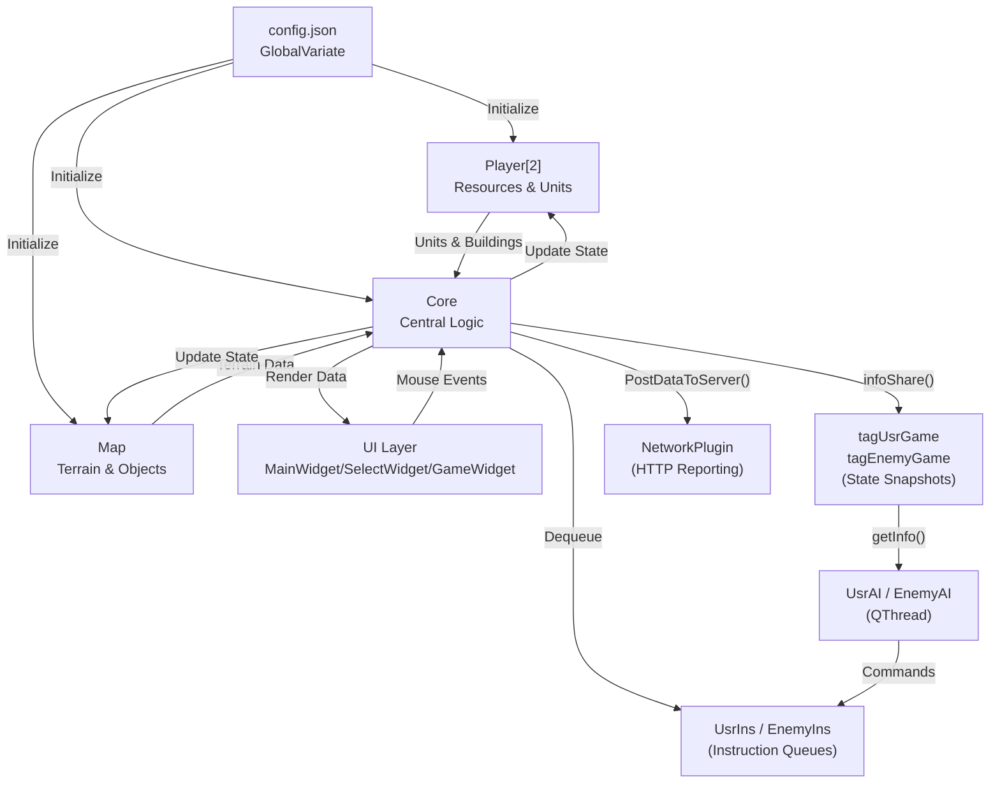

# Overview

Relevant source files

The following files were used as context for generating this wiki page:

- [MainWidget.cpp](MainWidget.cpp)
- [README.md](README.md)
- [config.json](config.json)

This document provides a high-level introduction to the **new-aoe** codebase, an Age of Empires-like real-time strategy (RTS) game implemented in Qt 5.9.2 and C++14. It covers the project's purpose, architectural design, and major subsystems.

For detailed architectural discussion, see [System Architecture](#1.1). For build instructions and dependencies, see [Getting Started](#1.2). For specific gameplay systems, refer to pages under [Game Mechanics](#3), and for AI implementation details, see [AI System](#5).

**Sources:** [README.md:1-46](), [MainWidget.cpp:1-100]()

---

## Project Purpose

The **new-aoe** project is a 2D real-time strategy game designed for educational and research purposes at Nanjing University of Science and Technology. The codebase implements:

- **Resource-based economy**: Players gather wood, food, stone, and gold to construct buildings and train units
- **Technology progression**: Advancement through civilization ages (Stone → Tool → Bronze → Iron) unlocking new capabilities
- **Combat system**: Multiple unit types with range/melee attacks, projectile physics, and defense mechanics
- **AI opponents**: Threaded AI implementations supporting both player automation and enemy strategies
- **Map editor**: Integrated terrain editing, unit placement, and scenario creation tools
- **Evaluation interface**: HTTP-based data reporting for automated testing and grading

The system is architected to support both human gameplay and automated AI development, making it suitable for AI programming assignments and competitive scenarios.

**Sources:** [README.md:10-23](), [config.json:1-20]()

---

## Technology Stack

| Component | Implementation |
|-----------|----------------|
| **Framework** | Qt 5.9.2 (Widgets, Multimedia modules) |
| **Language** | C++14 |
| **Graphics** | QPainter-based 2D rendering with isometric coordinate system |
| **Threading** | QThread for AI, sound playback, and network operations |
| **Configuration** | Dual system: compile-time (`config.h`) + runtime (`config.json`) |
| **Build System** | qmake with MinGW 5.3.0 32-bit toolchain |
| **Audio** | Qt Multimedia (QSoundEffect) |
| **Networking** | QNetworkAccessManager for HTTP-based evaluation reporting |

**Sources:** [README.md:36-46](), [newAOE.pro](), [config.h](), [config.json:1-15]()

---

## High-Level Architecture

The system employs a **layered architecture** with clear separation of concerns:

**Architecture Layers:**

1. **UI Layer**: Qt Widgets-based interface components handling user interaction and display
2. **Game Core**: Central logic engine managing game state, relations, and update cycles
3. **World State**: Map data structures, terrain grid, and spatial information
4. **Entity Management**: Player resources, units, buildings, and technology progression
5. **AI Threads**: Asynchronous AI processing with thread-safe state access
6. **Configuration**: Dual-tier configuration system for compile-time and runtime parameters

**Sources:** [MainWidget.h](), [Core.h](), [Map.h](), [Player.h](), [AI.h](), [GlobalVariate.h]()

---

## Core Subsystems

### MainWidget: Central Orchestrator

The `MainWidget` class serves as the application's integration hub, managing all major subsystems and their lifecycle:

The initialization sequence [MainWidget.cpp:94-152]() ensures proper dependency order: resources → game elements → map → players → core → AI → timer.

**Key Responsibilities:**
- Lifecycle management of `Core`, `Map`, `Player[]`, `UsrAI`, `EnemyAI`
- UI component coordination (`SelectWidget`, `GameWidget`, `ActWidget[]`, `Editor`)
- Frame-based update dispatch via `QTimer` (`FrameUpdate()` slot)
- Map editor integration with terrain modification and unit placement
- Unit reference cleanup and enemy status management

For detailed discussion, see [MainWidget and Game Loop](#2.1).

**Sources:** [MainWidget.cpp:94-276](), [MainWidget.cpp:1278-1474]()

---

### Core: Game Logic Engine

The `Core` class implements the main game loop and manages all runtime game logic:

| Responsibility | Implementation |
|----------------|----------------|
| **Frame Updates** | `gameUpdate()` called every frame by timer |
| **Object Updates** | `updateByObject()` iterates all entities, calling `nextframe()` |
| **Input Processing** | `manageMouseEvent()` handles player mouse interactions |
| **AI Commands** | `manageOrder()` dequeues AI instructions from thread-safe queues |
| **Relation Execution** | `manageRelationList()` processes ongoing actions (move, build, attack) |
| **State Sharing** | `infoShare()` publishes snapshots to AI threads |

The `Core_List` component maintains the relation system, tracking "who is doing what to whom":
- `relate_AllObject`: Maps each object to its current action and target
- `relation_Event_static`: Defines action stage chains (e.g., move → path planning → walking → arrival)
- `addRelation()`, `suspendRelation()`, `eraseRelation()`: Relation lifecycle management

For complete details, see [Game Core Engine](#2.2).

**Sources:** [Core.h](), [Core.cpp](), [Core_List.h](), [Core_List.cpp]()

---

### Map and World Representation

The game world uses a **block-based grid** with an isometric coordinate system:

**Coordinate Systems:**
- **Block Coordinates**: Integer grid positions (0 to MAP_L-1, 0 to MAP_U-1)
- **Detail Coordinates (DR/UR)**: Pixel-precise positions within the world
- **Conversion**: `BLOCKSIDELENGTH = 35.777` pixels per block [config.json:25]()

**Key Map Components:**
- `Block[MAP_L][MAP_U]`: Terrain tiles with type, height, pattern, visibility
- `map_Object[][]`: Spatial index for objects at each block position
- `staticres`: List of non-movable resources (stone, gold, trees, fish)
- `animal`: List of wildlife entities
- Pathfinding maps generated via `loadBarrierMap()` and `loadfindPathMap()`

For map details and pathfinding, see [Map Structure](#6.1) and [Terrain and Objects](#6.2).

**Sources:** [Map.h](), [Map.cpp](), [Block.h](), [config.json:25-28]()

---

### Player and Resource Management

Each `Player` instance manages a faction's state:

| Component | Description |
|-----------|-------------|
| `build` | `list<Building*>` of owned buildings |
| `human` | `list<Human*>` of owned units (farmers + armies) |
| `missile` | `list<Missile*>` of projectiles in flight |
| `Wood/Meat/Stone/Gold` | Four resource pools |
| `dev` | Pointer to `Development` (technology tree) |

**Resource Flow:**
1. Farmers gather from `StaticRes` or `Animal` via `HumanAction()`
2. Resources deposited at `Building_Resource` (granary, storage)
3. `Player::changeResource()` validates and updates pools
4. Buildings/units check `Development::conditionDevelop()` before construction/training
5. Tech research modifies gather rates and carry limits via `get_rate_*()` methods

For economy details, see [Resource and Economy System](#3.1).

**Sources:** [Player.h](), [Player.cpp](), [Development.h](), [Development.cpp]()

---

### AI and Command System

AI operates in separate `QThread` instances with a producer-consumer architecture:

**Command Interface:**

AI uses five encapsulated functions [AI.h:90-120]():
- `HumanMove(SN, DR0, UR0)`: Move unit to coordinates
- `HumanBuild(SN, BuildingNum, BlockDR, BlockUR)`: Construct building
- `HumanAction(SN, obSN)`: Gather/attack/deposit action
- `BuildingAction(buildingSN, Action)`: Research tech or train units
- `PinPointStrike(SN, DR0, UR0)`: Siege weapon area attack

These serialize into `instruction` structs queued in thread-safe `ins` structures, processed by `Core::manageOrder()` each frame.

For AI architecture and instruction details, see [AI Architecture](#5.1) and [Instruction and Command System](#5.2).

**Sources:** [AI.h](), [AI.cpp](), [UsrAI.h](), [EnemyAI.h](), [Core.cpp]()

---

## Game Loop and Update Cycle

The game operates on a **fixed-timestep loop** driven by `QTimer`:

**Frame Timing:**
- Default: `TimePerFrame = 40` ms (25 FPS) [config.json:4]()
- Configurable via `FRAMES_PER_SECOND` parameter
- Timer type: `Qt::PreciseTimer` for accuracy

**Update Order:**
1. All entities update state (`nextframe()`)
2. Player mouse events processed
3. AI commands dequeued and validated
4. Action relations advance by one stage
5. Physics (missiles, collisions) resolved
6. Rendering triggered
7. AI threads signaled with fresh state snapshots

This strict ordering prevents race conditions and ensures deterministic behavior.

For detailed game loop discussion, see [MainWidget and Game Loop](#2.1).

**Sources:** [MainWidget.cpp:1372-1380](), [Core.cpp](), [config.json:4-5]()

---

## Configuration System

The codebase uses a **dual-tier configuration** approach:

### Compile-Time Configuration (config.h)

Defines enumerations and type constants:
- Building types: `BUILDING_CENTER`, `BUILDING_GRANARY`, `BUILDING_ARMYCAMP`, etc.
- Unit types: `AT_CLUBMAN`, `AT_BOWMAN`, `AT_SCOUT`, etc.
- Resource types: `RESOURCE_WOOD`, `RESOURCE_STONE`, `RESOURCE_GOLD`, etc.
- Action types: `BUILDING_CENTER_CREATEFARMER`, `BUILDING_ARMYCAMP_CREATE_CLUBMAN`, etc.
- Map constants: `MAPTYPE_FLAT`, `MAPTYPE_OCEAN`, `MAPHEIGHT_FLAT`, etc.

**Sources:** [config.h:1-300]()

### Runtime Configuration (config.json)

Stores 400+ balance parameters loaded at startup:

| Category | Example Parameters |
|----------|-------------------|
| **Game Settings** | `GAME_WIDTH`, `GAME_HEIGHT`, `MAP_L`, `MAP_U`, `TimePerFrame` |
| **Initial Resources** | `INITIAL_WOOD: 200`, `INITIAL_MEAT: 200`, `INITIAL_GOLD: 150` |
| **Unit Stats** | `BLOOD_FARMER: 25`, `SPEED_CLUBMAN1: 2.439`, `ATK_BOWMAN: 3` |
| **Building Costs** | `BUILD_CENTER_WOOD: 200`, `TIME_BUILD_ARMYCAMP: 30` |
| **Gather Rates** | `FARMER_GATHERSPEED_WOOD: 0.02`, `FARMER_CARRYLIMIT_WOOD: 10` |
| **Tech Costs** | `BUILDING_STOCK_UPGRADE_DEFENSE_INFANTRY_FOOD: 75` |
| **Evaluation** | `GameServerAddr`, `IsExamining`, `DataPostIntervalFrame` |

Parameters are loaded by `GlobalVariate::ReadConfig()` [GlobalVariate.cpp]() marked `Q_COREAPP_STARTUP_FUNCTION`, ensuring initialization before the event loop starts.

For configuration details, see [Configuration System](#2.3).

**Sources:** [config.json:1-471](), [GlobalVariate.h](), [GlobalVariate.cpp]()

---

## Data Flow Summary

The following diagram shows how game state flows through the system:

**Sources:** [MainWidget.cpp](), [Core.cpp](), [GlobalVariate.cpp](), [AI.cpp]()

---

## Quick Reference: Key Classes and Files

| System | Primary Classes | Key Files |
|--------|----------------|-----------|
| **Application Entry** | `main()`, `QApplication` | [main.cpp]() |
| **Central Control** | `MainWidget` | [MainWidget.h](), [MainWidget.cpp]() |
| **Game Logic** | `Core`, `Core_List` | [Core.h](), [Core.cpp](), [Core_List.h]() |
| **World State** | `Map`, `Block` | [Map.h](), [Map.cpp](), [Block.h]() |
| **Players** | `Player`, `Development` | [Player.h](), [Player.cpp](), [Development.h]() |
| **Units** | `Human`, `Farmer`, `Army` | [Human.h](), [Farmer.h](), [Army.h]() |
| **Buildings** | `Building`, `Building_Resource` | [Building.h](), [Building.cpp]() |
| **AI** | `AI`, `UsrAI`, `EnemyAI` | [AI.h](), [UsrAI.h](), [EnemyAI.h]() |
| **UI Components** | `SelectWidget`, `GameWidget`, `ActWidget` | [SelectWidget.h](), [GameWidget.h](), [ActWidget.h]() |
| **Configuration** | `GlobalVariate` | [config.h](), [config.json](), [GlobalVariate.h]() |
| **Utilities** | `EventFilter`, `Logger`, `NetworkPlugin` | [EventFilter.h](), [Logger.h](), [networkplugin.h]() |

**Sources:** All referenced header and implementation files

---

## Next Steps

- For architectural deep-dive, proceed to [System Architecture](#1.1)
- For build instructions and environment setup, see [Getting Started](#1.2)
- For gameplay systems (resources, tech tree, combat), explore [Game Mechanics](#3)
- For AI development, consult [AI System](#5) and the external `AI接口使用指南.md`
- For map data structures, see [Map and World](#6)