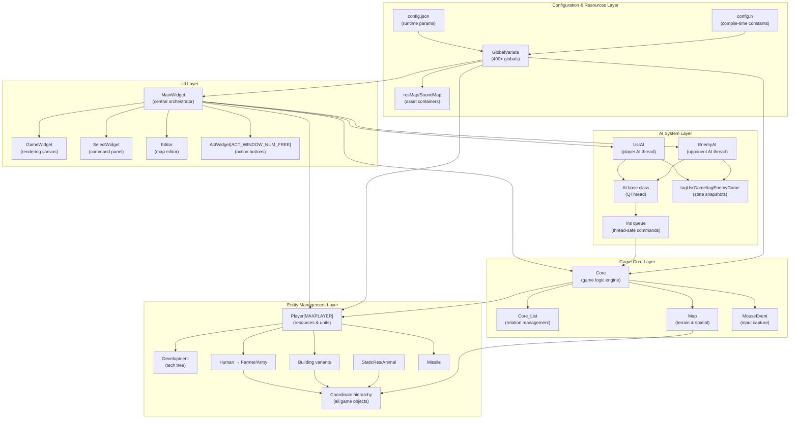
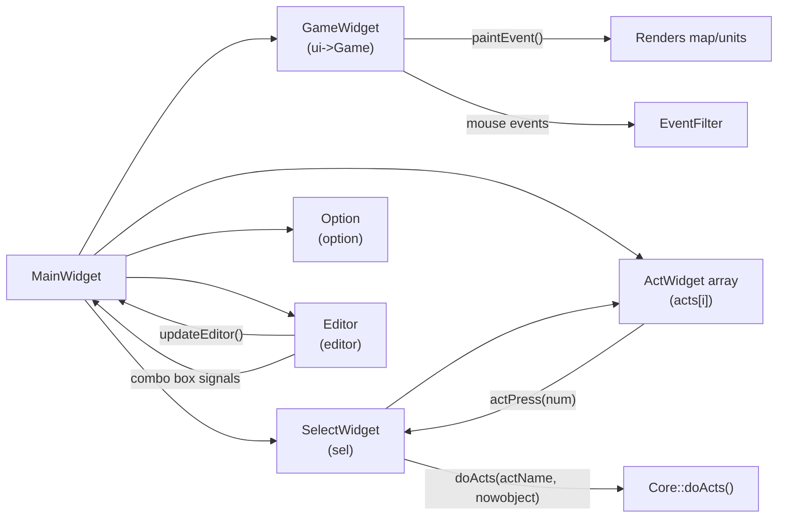
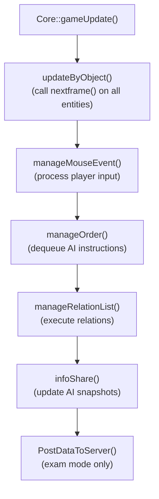
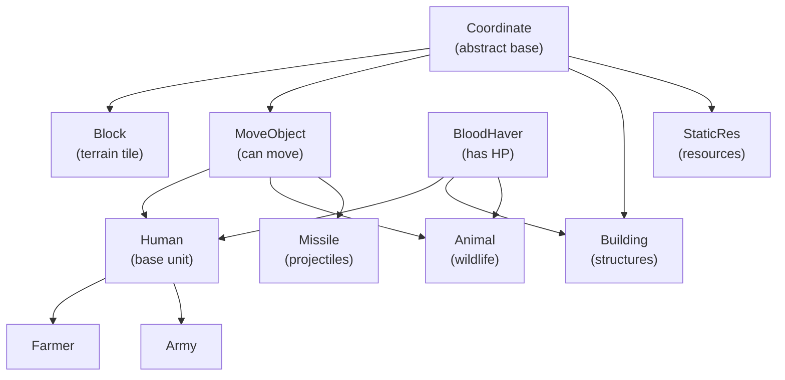
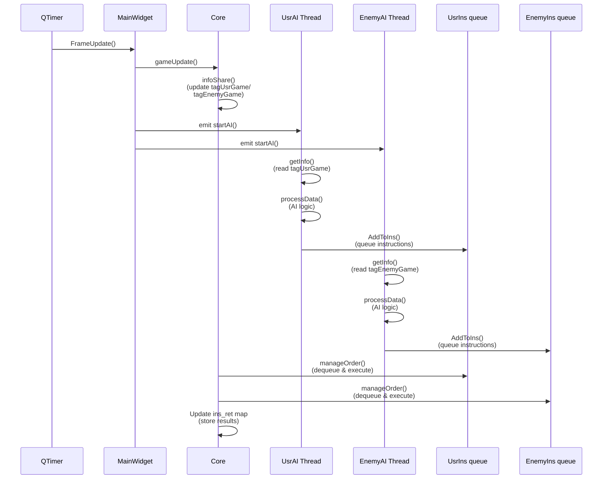

# System Architecture

<details>
<summary>Relevant source files</summary>

The following files were used as context for generating this wiki page:

- [GlobalVariate.h](GlobalVariate.h)
- [MainWidget.cpp](MainWidget.cpp)
- [MainWidget.h](MainWidget.h)
- [README.md](README.md)

</details>


## Purpose and Scope

This document describes the layered architecture of the new-aoe real-time strategy game, explaining how the major subsystems are organized and how they interact. It covers the five primary architectural layers: UI Layer, Game Core, Entity Management, AI System, and Configuration/Resources. For detailed information about specific subsystems:
- For the main game loop and MainWidget's role as orchestrator, see [MainWidget and Game Loop](#2.1)
- For the Core engine's internal logic, see [Game Core Engine](#2.2)
- For configuration loading mechanisms, see [Configuration System](#2.3)
- For AI thread communication and instruction processing, see [AI Architecture](#5.1)

**Sources:** [MainWidget.cpp:1-276](), [MainWidget.h:1-282](), [README.md:229-268]()

## Architectural Overview

The system follows a strict layered architecture where `MainWidget` serves as the central integration hub, coordinating all subsystems through well-defined interfaces.



**Sources:** [MainWidget.h:26-268](), [Core.h:1-100](), [Player.h:1-50](), [AI.h:1-80](), [GlobalVariate.h:1-100]()

## UI Layer

The UI Layer handles all user interaction and rendering, with `MainWidget` acting as the root controller.

### MainWidget Central Orchestration

`MainWidget` is the primary integration point (importance score: 10.45) that initializes and coordinates all subsystems. During construction at [MainWidget.cpp:94-276](), it executes a strict initialization sequence:

| Initialization Phase | Method | Components Created |
|---------------------|--------|-------------------|
| Variables | `initVar()` | Basic state variables |
| Editor | `initEditor()` | `currentSelected`, editor UI state |
| Game Resources | `initGameResources()` | Loads images/sounds via `GlobalVariate` |
| Game Elements | `initGameElements()` | Creates coordinate hierarchy |
| Window Properties | `initWindowProperties()` | Window size, title from `config.json` |
| Options | `initOptions()` | Settings dialog |
| Info Pane | `initInfoPane()` | `SelectWidget` instantiation |
| Timer | `initGameTimer()` | `QTimer` for `FrameUpdate()` slot |
| Players | `initPlayers()` | `Player[MAXPLAYER]` array allocation |
| Map | `initMap(MapJudge)` | `Map` construction and terrain loading |
| Core | `setupCore()` | `Core` engine instantiation |
| AI | `initAI()` | `UsrAI` and `EnemyAI` thread creation |

The timer connection at [MainWidget.cpp:117]() drives the game loop:
```cpp
connect(timer, &QTimer::timeout, this, &MainWidget::FrameUpdate);
```

**Sources:** [MainWidget.cpp:94-276](), [MainWidget.h:30-60]()

### UI Component Relationships



`SelectWidget` displays selected unit information and provides action buttons via `ActWidget[ACT_WINDOW_NUM_FREE]` array at [MainWidget.h:40](). User clicks trigger `doActs()` calls to `Core`.

**Sources:** [MainWidget.h:164-173](), [SelectWidget.h:1-50](), [ActWidget.h:1-30]()

## Game Core Layer

The Game Core Layer implements the game logic engine and manages all gameplay state.

### Core Engine Responsibilities

The `Core` class at [Core.h:1-100]() serves as the single source of truth for game state, executing the following operations each frame in `gameUpdate()`:



The `Core_List` manages object relationships through `relate_AllObject` map at [Core_List.h:1-50](), which tracks what action each object is currently performing:
- Key: `Coordinate*` (the acting object)
- Value: `Relate` structure containing target object SN, action phase, and relation type

**Sources:** [Core.cpp:1-500](), [Core_List.cpp:1-400](), [Core.h:1-100]()

### Map and Spatial Systems

The `Map` class at [Map.h:1-80]() maintains:
- `Block cell[MAP_L][MAP_U]`: 2D grid of terrain tiles
- `vector<StaticRes*> staticres`: Resource deposits (trees, stone, gold)
- `vector<Animal*> animal`: Wildlife
- `vector<vector<Coordinate*>> map_Object[MAP_L][MAP_U]`: Objects per block for collision detection

Coordinate systems:
| System | Unit | Purpose | Conversion |
|--------|------|---------|------------|
| Block coordinates | Integer blocks | Terrain grid indexing | `blockDR`, `blockUR` |
| Detail coordinates | Floating-point pixels | Precise unit positioning | `DR`, `UR` |
| Conversion | - | - | `DR / BLOCKSIDELENGTH = blockDR` |

**Sources:** [Map.h:1-80](), [Map.cpp:1-300](), [Block.h:1-50](), [Coordinate.h:1-100]()

## Entity Management Layer

### Player Resource Management

Each `Player` instance at [Player.h:1-50]() manages:
- **Resource pools**: `Wood`, `Meat`, `Stone`, `Gold` integers
- **Unit collections**: `list<Building*> build`, `list<Human*> human`, `list<Missile*> missile`
- **Population**: Tracks current vs maximum human count
- **Technology**: `Development* development` for tech tree state

Resource changes occur through `changeResource(int sort, int change)` at [Player.cpp:50-100](), which validates against negative values and updates the corresponding resource counter.

**Sources:** [Player.h:1-50](), [Player.cpp:1-200]()

### Coordinate Hierarchy

All game objects inherit from `Coordinate` at [Coordinate.h:1-100](), forming this inheritance tree:



Key virtual functions defined in `Coordinate`:
- `getSort()`: Returns `SORT_BUILDING`, `SORT_FARMER`, `SORT_ARMY`, etc.
- `nextframe()`: Per-frame update logic
- `getVision()`: Sight range for fog-of-war
- `setAction(int action)`: Change current action state
- `get_isActionEnd()`: Query if current action completed

**Sources:** [Coordinate.h:1-100](), [MoveObject.h:1-80](), [BloodHaver.h:1-60](), [Human.h:1-100]()

### Development System Integration

The `Development` class at [Development.h:1-150]() implements technology modifiers through `conditionDevelop` linked lists. Each player's units query their associated `Development` instance for stat bonuses:

| Query Method | Purpose | Example Usage |
|-------------|---------|---------------|
| `get_rate_speed()` | Speed multiplier | `baseSpeed * dev->get_rate_speed()` |
| `get_addition_blood()` | HP bonus | `baseHP + dev->get_addition_blood()` |
| `get_addition_atk()` | Attack bonus | `baseATK + dev->get_addition_atk()` |
| `get_rate_gatherSpeed()` | Gather rate multiplier | Used by `Farmer` |

**Sources:** [Development.h:1-150](), [Development.cpp:1-300](), [Human.cpp:50-150]()

## AI System Layer

### Threaded AI Architecture

The AI system uses producer-consumer pattern with strict thread separation:



**Sources:** [AI.h:1-80](), [UsrAI.h:1-50](), [EnemyAI.h:1-50](), [Core.cpp:300-400]()

### Instruction Flow

AI threads communicate with `Core` through thread-safe `ins` structures defined at [GlobalVariate.h:793-797]():

```cpp
struct ins {
    int g_id = 0;
    std::queue<instruction> instructions;
    QMutex lock;
};
```

The `instruction` structure at [GlobalVariate.h:765-791]() supports five command types:
- **Type 0**: Cancel current action
- **Type 1**: Move to coordinates (HumanMove)
- **Type 2**: Act on object (HumanAction)
- **Type 3**: Build structure (HumanBuild)
- **Type 4**: Building action (BuildingAction)
- **Type 5**: Pinpoint strike (PinPointStrike)

Result codes returned via `ins_ret` map at [GlobalVariate.h:857]():
| Code | Meaning |
|------|---------|
| 0 | Success |
| -1 | SN not found |
| -2 | Action not found |
| -3 | Out of bounds |
| -4 | Target SN not found |
| -5 | Building type invalid |
| -6 | Insufficient resources |

**Sources:** [GlobalVariate.h:765-797](), [AI.cpp:1-300](), [Core_List.cpp:200-400]()

## Configuration and Resources Layer

### Dual Configuration System

The system employs a two-tier configuration approach:

**Compile-Time (`config.h`)**:
- Enumerations: `BUILDING_*`, `AT_ARMY`, `RESOURCE_*`, etc.
- Action constants: `ACT_BUILD_HOUSE`, `ACT_CREATEFARMER`, etc.
- Map dimensions: `MAP_L`, `MAP_U` (overridable by JSON)
- Type definitions and helper macros

**Runtime (`config.json`)**:
- Game parameters loaded via `ReadConfig()` at [GlobalVariate.cpp:1-100]()
- Initial resources: `INITIAL_WOOD`, `INITIAL_MEAT`, etc.
- Unit stats: `BLOOD_FARMER`, `SPEED_CLUBMAN1`, etc.
- Building costs: `BUILD_CENTER_WOOD`, `TIME_BUILD_GRANARY`, etc.
- Gather rates: `FARMER_GATHERSPEED_WOOD`, carry limits, construction speed

The `ReadConfig()` function marked with `Q_COREAPP_STARTUP_FUNCTION` at [GlobalVariate.cpp:1]() executes before Qt's event loop, populating 400+ global variables declared in [GlobalVariate.h:14-527]().

**Sources:** [config.h:1-200](), [config.json:1-100](), [GlobalVariate.h:14-527](), [GlobalVariate.cpp:1-200]()

### Resource Loading

Asset initialization occurs in two phases:

1. **Image Resources** (`InitImageResMap()` at [GlobalVariate.cpp:200-300]()):
   - Loads all QPixmaps into `resMap` (map<string, list<QPixmap>>)
   - Creates `pixMemoryMap` collision grids from alpha channels
   - Generates flipped, grayed, and blackened variants

2. **Sound Resources** (`InitSoundResMap()` at [GlobalVariate.cpp:400-450]()):
   - Populates `SoundMap` (map<string, QSoundEffect*>)
   - Used by `soundQueue` for asynchronous playback via `SoudPlayThread`

**Sources:** [GlobalVariate.cpp:200-450](), [soudplaythread.h:1-50](), [soudplaythread.cpp:1-100]()

## Data Flow Integration

The following diagram shows how data flows through the system during a typical game frame:

```mermaid
graph TB
    subgraph Input["Input Capture"]
        EF["EventFilter<br/>(global event filter)"]
        Mouse["Mouse events"]
        Keyboard["Keyboard events"]
    end
    
    subgraph GameLoop["Game Loop (60 FPS)"]
        FU["MainWidget::FrameUpdate()"]
        GU["Core::gameUpdate()"]
        Paint["MainWidget::paintUpdate()"]
        Status["MainWidget::statusUpdate()"]
    end
    
    subgraph CoreProcessing["Core Processing"]
        UpdateObj["updateByObject()<br/>(Coordinate::nextframe())"]
        ManageMouse["manageMouseEvent()"]
        ManageOrder["manageOrder()<br/>(process AI commands)"]
        ManageRel["manageRelationList()<br/>(execute relations)"]
    end
    
    subgraph StateSync["State Synchronization"]
        InfoShare["infoShare()<br/>(update tagInfo)"]
        TagUsr["tagUsrGame"]
        TagEnemy["tagEnemyGame"]
    end
    
    subgraph AIProcessing["AI Processing"]
        UsrProc["UsrAI::processData()"]
        EnemyProc["EnemyAI::processData()"]
        UsrIns["UsrIns queue"]
        EnemyIns["EnemyIns queue"]
    end
    
    Mouse --> EF
    Keyboard --> EF
    EF --> FU
    
    FU --> GU
    GU --> UpdateObj
    UpdateObj --> ManageMouse
    ManageMouse --> ManageOrder
    ManageOrder --> ManageRel
    ManageRel --> InfoShare
    
    InfoShare --> TagUsr
    InfoShare --> TagEnemy
    
    TagUsr --> UsrProc
    TagEnemy --> EnemyProc
    
    UsrProc --> UsrIns
    EnemyProc --> EnemyIns
    
    UsrIns --> ManageOrder
    EnemyIns --> ManageOrder
    
    GU --> Paint
    GU --> Status
```



**Sources:** [MainWidget.cpp:500-600](), [Core.cpp:100-300](), [EventFilter.cpp:1-200](), [AI.cpp:100-200]()

### Frame Update Sequence

Each frame at [MainWidget.cpp:500-550]() executes:

1. **Game Data Update** (`gameDataUpdate()`): Calls `core->gameUpdate()`
2. **Paint Update** (`paintUpdate()`): Triggers `ui->Game->update()` for rendering
3. **Status Update** (`statusUpdate()`): Updates resource displays and minimap
4. **AI Signal Emission**: `emit startAI()` to wake AI threads

The `Core::gameUpdate()` method at [Core.cpp:100-200]() processes in strict order:
- Object updates (movement, attacks, resource gathering)
- Player input from `MouseEvent` buffer
- AI instructions from `UsrIns` and `EnemyIns` queues
- Relation execution (multi-frame actions like building construction)
- State snapshot generation for AI consumption

**Sources:** [MainWidget.cpp:500-600](), [Core.cpp:100-300]()