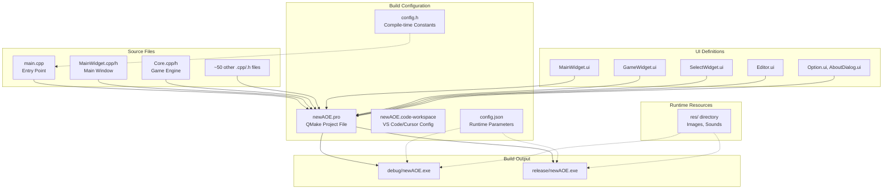
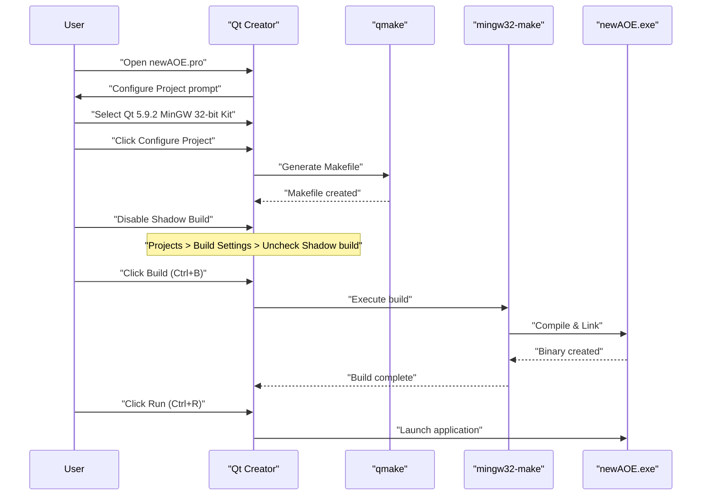
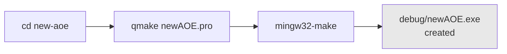
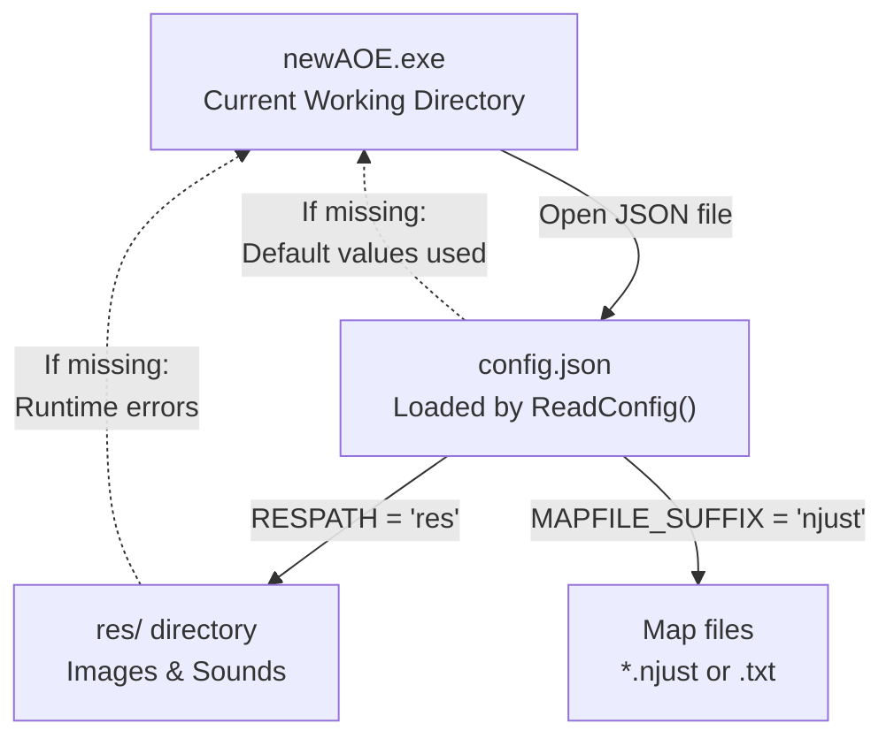
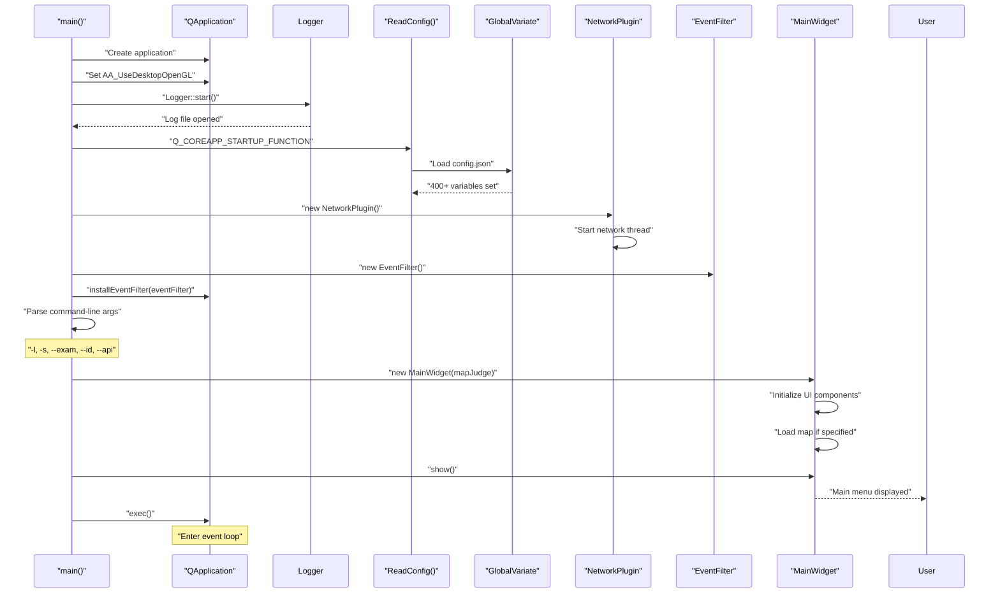
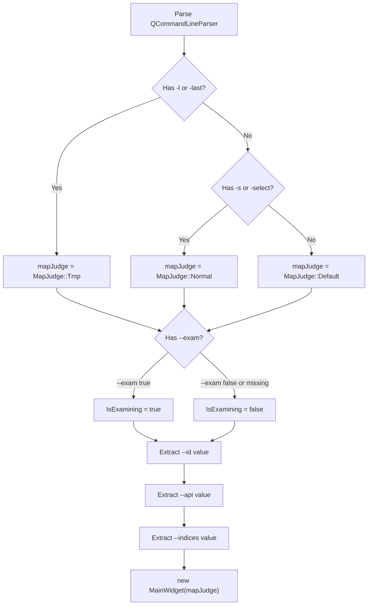

# Getting Started

<details>
<summary>Relevant source files</summary>

The following files were used as context for generating this wiki page:

- [README.md](README.md)
- [config.json](config.json)

</details>


This page provides step-by-step instructions for building and running the new-aoe game. It covers dependency installation, compilation procedures, and initial configuration. For information about the overall system architecture, see [System Architecture](#1.1). For details about specific subsystems like the game core or AI, see the relevant sections in [Core Systems](#2) and beyond.

---

## Prerequisites

The new-aoe project requires the following dependencies:

| Dependency | Version/Details | Purpose |
|------------|----------------|---------|
| **Qt Framework** | 5.9.2 (recommended) | Core UI framework, multimedia support |
| **Compiler** | MinGW 5.3.0 32-bit | C++ compilation toolchain |
| **C++ Standard** | C++14 | Language features used throughout codebase |
| **Qt Modules** | core, gui, widgets, multimedia | Required Qt components |
| **Build System** | qmake | Project file processing and Makefile generation |

**Platform Support**: Primarily developed and tested on Windows with MinGW. The project uses Qt's cross-platform APIs but has not been extensively tested on Linux/macOS.

**Typical Qt Installation Path**: `C:/ProgramData/Qt5.9.2/5.9.2/mingw53_32`

Sources: [README.md:36-46](), [newAOE.pro:1-15]()

---

## Project Structure for Building

Understanding the key files involved in the build process:



**Key Build Files**

The `newAOE.pro` file is the central build specification:

- **Line 1**: `QT += core gui` - Declares required Qt modules
- **Line 5**: `greaterThan(QT_MAJOR_VERSION, 4): QT += widgets` - Ensures widgets module for Qt 5+
- **Line 7**: `QT += multimedia` - Adds multimedia support for sound
- **Line 9**: `CONFIG += c++14` - Sets C++14 standard
- **Lines 13-38**: Lists all `.cpp` source files
- **Lines 40-66**: Lists all `.h` header files
- **Lines 68-73**: Lists all `.ui` form files

Sources: [newAOE.pro:1-73](), [README.md:95-114]()

---

## Build Method 1: Qt Creator

Qt Creator is the official IDE for Qt development and provides the most integrated experience.

### Setup Steps



### Detailed Procedure

1. **Clone Repository**
   ```bash
   git clone https://github.com/hackermmzz/new-aoe
   cd new-aoe
   ```

2. **Open Project in Qt Creator**
   - Launch Qt Creator
   - File → Open File or Project
   - Navigate to `newAOE.pro`
   - Click "Open"

3. **Configure Kit**
   - Select Qt 5.9.2 with MinGW 5.3.0 32-bit
   - Click "Configure Project"

4. **Disable Shadow Build** (Critical Step)
   - Left sidebar: Click "Projects" tab
   - Under "Build Settings"
   - Find "Build directory" field
   - **Uncheck "Shadow build"**
   
   **Why this matters**: Shadow build places the executable in a separate directory, which breaks relative paths to `config.json` and `res/` directory. The game expects these files to be in the same directory as the executable.

5. **Build Project**
   - Build → Build Project "newAOE" (Ctrl+B)
   - Monitor the "Compile Output" pane for errors

6. **Run**
   - Build → Run (Ctrl+R)
   - The game window should appear

**Expected Output Location**: `debug/newAOE.exe` or `release/newAOE.exe` depending on build configuration.

Sources: [README.md:59-69](), [README.md:95-106]()

---

## Build Method 2: Cursor / VS Code

This method uses Visual Studio Code (or Cursor) with Qt extensions, suitable for developers preferring a modern text editor.

### Workspace Configuration

The project includes a pre-configured workspace file `newAOE.code-workspace` that specifies:

- Qt kit paths
- Build tasks for qmake and make
- Debug configurations
- Recommended extensions

### Setup Steps

1. **Open Workspace**
   ```
   File → Open Workspace from File
   Select: newAOE.code-workspace
   ```

2. **Install Recommended Extensions**
   - C/C++ (Microsoft)
   - CMake Tools
   - Qt tools extensions (if available)

   The workspace file should prompt for these automatically.

3. **Configure Qt Environment**
   
   Edit `newAOE.code-workspace` if your Qt installation path differs:
   
   ```json
   "settings": {
     "cmake.configureSettings": {
       "CMAKE_PREFIX_PATH": "C:/ProgramData/Qt5.9.2/5.9.2/mingw53_32"
     }
   }
   ```

4. **Build Tasks**
   
   The workspace defines two build tasks:
   
   - **qmake & make** (Debug build)
   - **qmake & make release** (Release build)
   
   Execute via:
   ```
   Ctrl+Shift+P → Tasks: Run Task → Select build task
   ```

5. **Debug Configuration**
   
   F5 launches the configured debugger:
   
   - Configuration name: "Qt Debug"
   - Attaches GDB to the built executable
   - Sets breakpoints in `.cpp` files

### Build Task Internals

The Debug build task executes:
```bash
qmake newAOE.pro
mingw32-make
```

The Release build task executes:
```bash
qmake newAOE.pro CONFIG+=release
mingw32-make
```

Sources: [README.md:71-79](), [README.md:113](), [CURSOR_QT_开发指南.md:1-33]()

---

## Build Method 3: Command Line

For automated builds, CI/CD pipelines, or users who prefer terminal-based workflows.

### Environment Setup

The project may include a `qt-env.bat` script to configure environment variables. Alternatively, manually add Qt's bin directory to PATH:

```bash
set PATH=C:\ProgramData\Qt5.9.2\5.9.2\mingw53_32\bin;%PATH%
```

Verify setup:
```bash
qmake -version
# Should output: QMake version 3.1
```

### Build Commands



**Debug Build**:
```bash
cd path/to/new-aoe
qmake newAOE.pro
mingw32-make
```

**Release Build** (optimized):
```bash
qmake newAOE.pro CONFIG+=release
mingw32-make
```

**Clean Build**:
```bash
mingw32-make clean
qmake newAOE.pro
mingw32-make
```

### Build Output

- **Debug**: `debug/newAOE.exe` (~50-100 MB with debug symbols)
- **Release**: `release/newAOE.exe` (smaller, optimized)

Sources: [README.md:81-92]()

---

## First Run Configuration

### Required Files and Directory Structure

Before running the executable, ensure the following structure exists:

```
new-aoe/
├── debug/                    (or release/)
│   └── newAOE.exe           ← Your executable
├── config.json              ← Must be in same directory as exe
├── res/                     ← Resource directory
│   ├── [image files]
│   └── [sound files]
└── [optional map files]
```

### Critical: File Placement

The game locates resources using **relative paths** from the executable's directory. The following initializations occur in `main.cpp` and `GlobalVariate.cpp`:



**Key Configuration Values** loaded from `config.json`:

| Key | Default | Purpose |
|-----|---------|---------|
| `RESPATH` | `"res"` | Directory containing image/sound resources |
| `MAPFILE_SUFFIX` | `"njust"` | Extension for map files |
| `GAME_WIDTH` | `1920` | Main window width in pixels |
| `GAME_HEIGHT` | `1000` | Main window height in pixels |
| `TimePerFrame` | `40` | Milliseconds per game frame (25 FPS) |
| `NOWPLAYER` | `2` | Number of players (you + AI) |

### Initial Run from Project Root

**Recommended**: Run from the project root directory, not the build directory:

```bash
# From project root
cd new-aoe
./debug/newAOE.exe
```

This ensures relative paths resolve correctly.

**Alternative**: Copy `config.json` and `res/` into the `debug/` or `release/` directory:

```bash
cp config.json debug/
cp -r res debug/
cd debug
./newAOE.exe
```

Sources: [config.json:1-471](), [README.md:105-106](), [GlobalVariate.cpp:1-50]()

---

## Verifying the Installation

### Expected Startup Sequence

When launched successfully, the application executes the following initialization (from `main.cpp`):



### What You Should See

1. **Main Menu Window**
   - Title: "Age of Empires" (from `config.json` → `GAME_TITLE`)
   - Window size: 1920×1000 (from `GAME_WIDTH` × `GAME_HEIGHT`)
   - Buttons: "开始游戏" (Start Game), "选项" (Options), "关于" (About), "编辑器" (Editor)

2. **Console/Log Output**
   - Logger messages indicating initialization
   - Config loading confirmation
   - No error messages about missing files

3. **Resource Loading**
   - If `res/` is missing, you'll see errors about missing images
   - Check `debug.log` or console for `QPixmap::load()` failures

### Common Issues and Solutions

| Symptom | Likely Cause | Solution |
|---------|--------------|----------|
| "config.json not found" | Executable run from wrong directory | Copy config.json to exe directory, or run from project root |
| Missing images/black screen | `res/` directory not found | Ensure `res/` exists relative to exe |
| Window doesn't appear | Qt DLLs not in PATH | Run from Qt Creator, or add Qt bin to PATH |
| "Cannot create file" errors | Insufficient permissions | Run from non-system directory |
| Crash on startup | Wrong Qt version | Rebuild with Qt 5.9.2 |

### Verification Checklist

- [ ] Main menu appears without errors
- [ ] Window has correct title and size
- [ ] No console errors about missing config
- [ ] No console errors about missing resources
- [ ] Can click "开始游戏" to enter game view
- [ ] Can open "选项" and "关于" dialogs

Sources: [main.cpp:1-120](), [MainWidget.cpp:1-200](), [Logger.cpp:1-100]()

---

## Command-Line Arguments

The game supports several command-line parameters for advanced usage:

| Argument | Format | Purpose |
|----------|--------|---------|
| `-l` or `-last` | Flag | Load last-used map from `tmpMap.txt` |
| `-s` or `-select` | Flag | Load specific map from `gameMap.txt` |
| `--exam` | `--exam true/false` | Enable/disable exam mode |
| `--indices` | `--indices N` | Database index for evaluation system |
| `--id` | `--id STUDENT_ID` | Student ID for evaluation |
| `--api` | `--api KEY` | API key for evaluation server |

**Examples**:

```bash
# Load last map
./newAOE.exe -l

# Load specific map
./newAOE.exe -s

# Exam mode with student ID
./newAOE.exe --exam true --id 12345 --api secretkey
```

### Parameter Processing

Arguments are parsed in `main.cpp` around lines 80-120:



Sources: [main.cpp:80-120](), [README.md:290-298]()

---

## Next Steps

After successfully building and running the game:

1. **Understand the Architecture**: Read [System Architecture](#1.1) to understand how the major components interact.

2. **Explore Core Systems**: 
   - [MainWidget and Game Loop](#2.1) - How the game updates each frame
   - [Game Core Engine](#2.2) - The `Core` class and relation management
   - [Configuration System](#2.3) - How config.json controls game parameters

3. **Learn Game Mechanics**:
   - [Resource and Economy System](#3.1) - How resources are gathered and spent
   - [Technology Tree](#3.2) - Civilization ages and upgrades
   - [Units and Buildings](#3.3) - Entity types and lifecycles

4. **Try the Editor**: 
   - From main menu, click "编辑器" (Editor)
   - See [Map Editor](#4.2) for detailed usage

5. **Write AI Code**:
   - Review external documentation: `AI接口使用指南.md`
   - See [AI Architecture](#5.1) for system design
   - See [Instruction and Command System](#5.2) for available commands

6. **Modify Configuration**:
   - Edit `config.json` to change game balance
   - All 400+ parameters are documented in [Configuration System](#2.3)

7. **Debug and Develop**:
   - Use [Debug and Logging System](#7.4) for troubleshooting
   - Check console output and `debug.log` file

Sources: [README.md:278-326]()