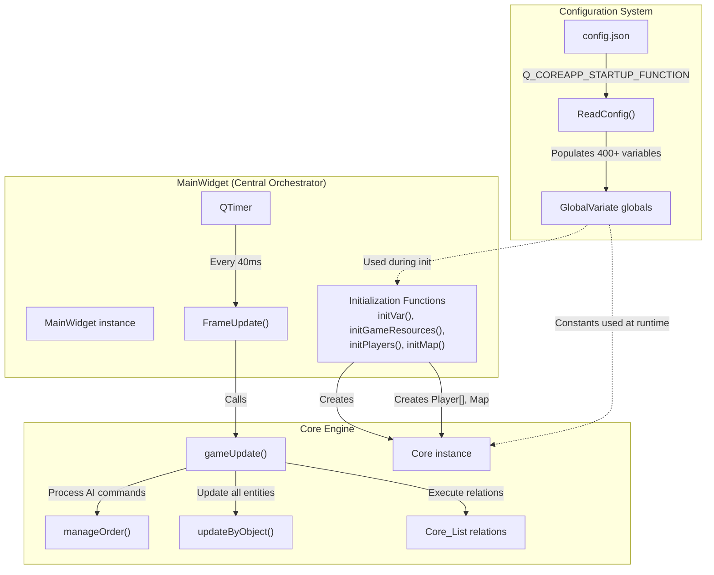
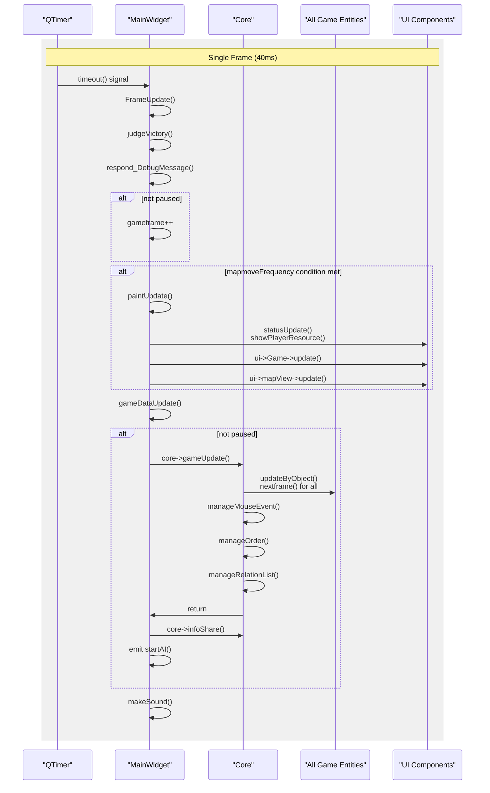
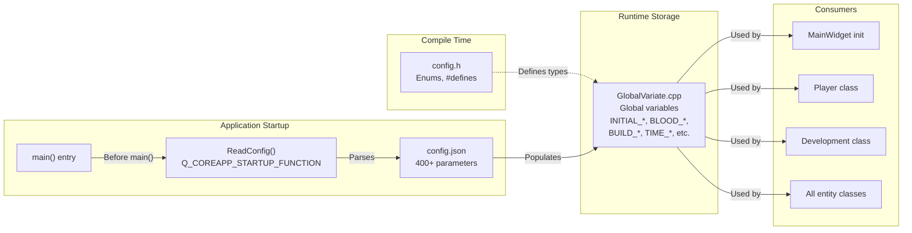
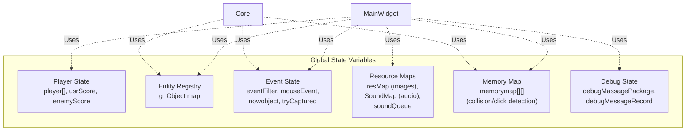
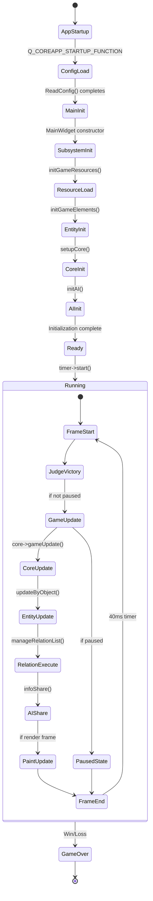

# Core Systems

<details>
<summary>Relevant source files</summary>

The following files were used as context for generating this wiki page:

- [GlobalVariate.cpp](GlobalVariate.cpp)
- [MainWidget.cpp](MainWidget.cpp)

</details>


This document describes the fundamental systems that drive the game engine: **MainWidget and the Game Loop**, the **Core Engine**, and the **Configuration System**. These three components form the backbone of the entire application, managing initialization, frame-based updates, game state processing, and data-driven parameter loading.

For information about specific gameplay mechanics (resources, units, combat), see [Game Mechanics](#3). For UI components and rendering, see [User Interface](#4). For AI processing and command execution, see [AI System](#5).

---

## Overview

The core systems consist of three tightly integrated subsystems:

| System | Primary Class/File | Importance | Responsibility |
|--------|-------------------|------------|----------------|
| **MainWidget & Game Loop** | `MainWidget` | 10.45 | Central orchestrator, initialization sequence, frame-based update cycle |
| **Core Engine** | `Core` | High | Game logic execution, relation management, entity lifecycle, mouse event processing |
| **Configuration System** | `GlobalVariate`, `config.json` | 9.03 (config), 4.90 (loader) | Runtime parameter loading, global constant definitions |

These systems work together to establish the game's runtime environment and drive all gameplay logic through a fixed-timestep loop.

---

## System Interaction Flow

The following diagram shows how the three core systems interact during a typical game frame:



**Sources:** [MainWidget.cpp:94-152](), [MainWidget.cpp:2379-2408](), [GlobalVariate.cpp:1224-1746]()

---

## MainWidget: The Central Orchestrator

`MainWidget` serves as the integration hub for all subsystems. It inherits from `QWidget` and acts as the main window controller.

### Initialization Sequence

The constructor follows a strictly ordered initialization sequence:

```mermaid
graph TD
    CTOR["MainWidget constructor"]
    
    CTOR --> INITVAR["initVar()<br/>Initialize name arrays"]
    INITVAR --> INITEDITOR["initEditor()<br/>Setup editor state"]
    INITEDITOR --> INITRES["initGameResources()<br/>InitImageResMap(), InitSoundResMap()"]
    INITRES --> INITELEMENTS["initGameElements()<br/>initBlock(), initBuilding(),<br/>initAnimal(), initFarmer()"]
    INITELEMENTS --> INITWINDOW["initWindowProperties()<br/>Set size, title, icon"]
    INITWINDOW --> INITOPTIONS["initOptions()<br/>Option dialog, speed buttons"]
    INITOPTIONS --> INITINFOPANE["initInfoPane()<br/>SelectWidget, ActWidget array"]
    INITINFOPANE --> INITTIMER["initGameTimer()<br/>QTimer setup"]
    INITTIMER --> INITPLAYERS["initPlayers()<br/>Create Player[MAXPLAYER]"]
    INITPLAYERS --> INITMAP["initMap(MapJudge)<br/>Create Map, load resources"]
    INITMAP --> SETUPCORE["setupCore()<br/>Create Core instance"]
    SETUPCORE --> INITAI["initAI()<br/>Create UsrAI, EnemyAI threads"]
    INITAI --> SETUPMOUSE["setupMouseTracking()"]
    SETUPMOUSE --> SETUPTIPL["setupTipLabel()"]
    SETUPTIPL --> INITVIEWMAP["initViewMap()"]
    INITVIEWMAP --> INITBGM["initBGM()"]
    INITBGM --> DONE["Initialization Complete"]
```



**Sources:** [MainWidget.cpp:94-152](), [MainWidget.cpp:1279-1473]()

### Key Initialization Functions

| Function | Lines | Purpose |
|----------|-------|---------|
| `initVar()` | [MainWidget.cpp:2181-2306]() | Populates static name arrays (`Animal::Animalname`, `Army::ArmyName`, `Building::Buildingname`, etc.) |
| `initGameResources()` | [MainWidget.cpp:1279-1283]() | Calls `InitImageResMap()` and `InitSoundResMap()` to load all assets into `resMap` and `SoundMap` |
| `initPlayers()` | [MainWidget.cpp:1382-1397]() | Creates `Player*[MAXPLAYER]` array, sets initial resources and civilization |
| `initMap()` | [MainWidget.cpp:1399-1419]() | Creates `Map` instance, initializes terrain, loads map file |
| `setupCore()` | [MainWidget.cpp:1433-1438]() | Creates `Core` instance with pointers to `map`, `player`, `memorymap`, and `mouseEvent` |
| `initAI()` | [MainWidget.cpp:1421-1431]() | Creates `UsrAI` and `EnemyAI` thread instances, connects signals |

**Sources:** [MainWidget.cpp:1279-1473]()

---

## The Game Loop

The game loop is driven by a `QTimer` that fires every `TimePerFrame` milliseconds (default 40ms = 25 FPS).

### Frame Update Cycle



**Sources:** [MainWidget.cpp:2379-2408](), [MainWidget.cpp:2074-2091](), [MainWidget.cpp:2093-2103]()

### Frame Update Implementation

The `FrameUpdate()` slot is connected to the timer and executes in strict order:

[MainWidget.cpp:2379-2408]()
```cpp
void MainWidget::FrameUpdate()
{
    judgeVictory();              // Check win/loss conditions
    respond_DebugMessage();      // Output debug text
    
    if (!pause) gameframe++;
    g_frame = gameframe;
    sel->resetSecond();
    
    ui->lcdNumber->display(gameframe);
    
    // Conditional rendering based on speed setting
    if (mapmoveFrequency == 1 || mapmoveFrequency == 2) {
        paintUpdate();
    }
    else if (mapmoveFrequency == 4) {
        if (gameframe % 2 == 0 || pause) paintUpdate();
    }
    else if (mapmoveFrequency == 8) {
        if (gameframe % 3 == 0 || pause) paintUpdate();
    }
    
    gameDataUpdate();            // Core game logic update
}
```

The `gameDataUpdate()` function drives the core engine:

[MainWidget.cpp:2074-2091]()
```cpp
void MainWidget::gameDataUpdate()
{
    if (!pause)
    {
        core->gameUpdate();      // Process all game logic
        
        if(!EditorMode){
            core->infoShare();   // Share state with AI threads
            emit startAI();      // Signal AI to process
        }
    }
    else
    {
        core->resetNowObject_Click(pause);
    }
    makeSound();
}
```

**Sources:** [MainWidget.cpp:2379-2408](), [MainWidget.cpp:2074-2091]()

---

## Core Engine Responsibilities

While `MainWidget` orchestrates the frame cycle, the `Core` class executes the actual game logic. The separation of concerns is:

| Responsibility | Handler | Key Methods |
|----------------|---------|-------------|
| **Timer management** | `MainWidget` | `initGameTimer()`, `FrameUpdate()` |
| **Rendering coordination** | `MainWidget` | `paintUpdate()`, `statusUpdate()` |
| **Game logic execution** | `Core` | `gameUpdate()`, `updateByObject()` |
| **Entity updates** | `Core` | Each entity's `nextframe()` |
| **Relation processing** | `Core` | `manageRelationList()`, `addRelation()` |
| **Input handling** | `Core` | `manageMouseEvent()` |
| **AI command processing** | `Core` | `manageOrder()` |

For detailed information about the `Core` class and its methods, see [Game Core Engine](#2.2).

**Sources:** Inferred from architecture diagrams and [MainWidget.cpp:1433-1438]()

---

## Configuration System Architecture

The configuration system uses a two-tier approach: compile-time constants in `config.h` and runtime parameters in `config.json`.

### Configuration Loading Flow



**Sources:** [GlobalVariate.cpp:1224-1746](), [GlobalVariate.cpp:12-567]()

### Global Variable Categories

The configuration system defines over 400 global variables organized by category:

| Category | Example Variables | Lines |
|----------|-------------------|-------|
| **Window/Display** | `GAME_WIDTH`, `GAME_HEIGHT`, `GAMEWIDGET_WIDTH`, `BLOCKSIDELENGTH` | [GlobalVariate.cpp:22-37]() |
| **Map/World** | `MAP_L`, `MAP_U`, `MEMORYROW`, `MEMORYCOLUMN` | [GlobalVariate.cpp:33-40]() |
| **Entity Speed** | `HUMAN_SPEED`, `ANIMAL_SPEED`, `WOOD_BOAT_SPEED` | [GlobalVariate.cpp:41-43]() |
| **Unit Stats** | `BLOOD_FARMER`, `VISION_FARMER`, `ATK_CLUBMAN1`, `SPEED_SCOUT` | [GlobalVariate.cpp:67-542]() |
| **Building Stats** | `BLOOD_BUILD_CENTER`, `VISION_CENTER`, `BUILD_CENTER_WOOD` | [GlobalVariate.cpp:109-347]() |
| **Resource Costs** | `BUILDING_CENTER_CREATEFARMER_FOOD`, `TIME_BUILD_HOUSE` | [GlobalVariate.cpp:114-333]() |
| **Gathering Rates** | `FARMER_GATHERSPEED_WOOD`, `FARMER_CARRYLIMIT_FOOD` | [GlobalVariate.cpp:69-89]() |
| **Combat Constants** | `DISTANCE_ATTACK_CLOSE`, `DISTANCE_HIT_TARGET` | [GlobalVariate.cpp:348-356]() |
| **Timing** | `NOWRES_TIMER_FARMER`, `INTERVAL_CLUBMAN1` | [GlobalVariate.cpp:551-563]() |

**Sources:** [GlobalVariate.cpp:12-567]()

### Configuration Loading Implementation

The `ReadConfig()` function is marked with `Q_COREAPP_STARTUP_FUNCTION`, ensuring it runs before `main()`:

[GlobalVariate.cpp:1224-1246]()
```cpp
Q_COREAPP_STARTUP_FUNCTION(ReadConfig)
void ReadConfig()
{
    // 1. Open config file
    QFile file("config.json");
    if (!file.open(QIODevice::ReadOnly | QIODevice::Text)) {
       return;
    }
    
    // 2. Read and parse JSON
    QByteArray jsonData = file.readAll();
    file.close();
    
    QJsonParseError parseError;
    QJsonDocument json_config = QJsonDocument::fromJson(jsonData, &parseError);
    if (parseError.error != QJsonParseError::NoError) {
        return;
    }
    
    if (!json_config.isObject()) {
       return;
    }
    QJsonObject config=json_config.object();
    
    // ... parsing follows
}
```

The function uses convenient macros to parse JSON values:

[GlobalVariate.cpp:1247-1252]()
```cpp
#define json(x) config[#x]
#define jsonInt(x) x=json(x).toInt()
#define jsonDouble(x) x=json(x).toDouble()
#define jsonQString(x) x=json(x).toString()
#define jsonString(x) x=json(x).toString().toStdString()
#define jsonBool(x) x=json(x).toBool()
```

Then loads each variable:

[GlobalVariate.cpp:1254-1270]()
```cpp
jsonBool(IsExamining);
jsonInt(TimePerFrame);
jsonQString(GameServerAddr);
jsonInt(DataPostIntervalFrame);
jsonBool(EditorMode);
jsonBool(GlobalVision);
jsonBool(only_debug_Player0);
jsonBool(filterRepetitionMessage);
jsonInt(GAME_WIDTH);
jsonInt(GAME_HEIGHT);
jsonString(GAME_VERSION);
jsonQString(GAME_TITLE);
jsonString(MAPFILE_SUFFIX);
jsonInt(GAME_LOSE_SEC);
jsonInt(MAXPLAYER);
// ... continues for 400+ variables
```

**Sources:** [GlobalVariate.cpp:1224-1746]()

### Critical Configuration Parameters

Some configuration parameters are particularly important for game behavior:

| Parameter | Default | Purpose |
|-----------|---------|---------|
| `TimePerFrame` | 40 | Milliseconds per frame (25 FPS) |
| `IsExamining` | varies | Disables certain features for automated testing |
| `EditorMode` | varies | Enables map editor functionality |
| `GlobalVision` | varies | Disables fog of war |
| `MAP_L`, `MAP_U` | varies | Map dimensions in blocks |
| `BLOCKSIDELENGTH` | 50.0 | Size of each terrain block in pixels |
| `MAXPLAYER` | 2 | Maximum number of players |

**Sources:** [GlobalVariate.cpp:12-40]()

---

## Global State Management

In addition to configuration, `GlobalVariate.cpp` defines critical global state variables:



Key global variables:

[GlobalVariate.cpp:569-589]()
```cpp
// Entity tracking
map<std::string, std::list<QPixmap>> resMap;
map<string, QSoundEffect*> SoundMap;
std::queue<string> soundQueue;
std::map<int, Coordinate*> g_Object;

// Player state
Score usrScore=Score(0);
Score enemyScore=Score(1);

// Event handling
EventFilter *eventFilter;
Coordinate *nowobject=NULL;
bool tryCaptured=0;
Coordinate* LeftMouseObjCapture=0;
Coordinate* RightMouseObjCaptrue=0;

// Memory map for collision detection
int** memorymap;

// Debug system
std::queue<st_DebugMassage>debugMassagePackage;
std::map<QString , int>debugMessageRecord;
```

**Sources:** [GlobalVariate.cpp:569-589]()

---

## System Lifecycle Summary

The complete system lifecycle from startup to frame execution:



**Sources:** [MainWidget.cpp:94-152](), [MainWidget.cpp:2379-2408](), [GlobalVariate.cpp:1224-1746]()

---

## Key Global Functions

Several utility functions are defined in `GlobalVariate.cpp` and used throughout the codebase:

| Function | Signature | Purpose | Lines |
|----------|-----------|---------|-------|
| `InitImageResMap` | `int InitImageResMap(QString path)` | Load all PNG/GIF images into `resMap` | [GlobalVariate.cpp:590-697]() |
| `InitSoundResMap` | `int InitSoundResMap(QString path)` | Load all WAV files into `SoundMap` | [GlobalVariate.cpp:698-774]() |
| `loadResource` | `void loadResource(string name, list<ImageResource>* targetlist)` | Copy pixmaps from `resMap` to entity resource lists | [GlobalVariate.cpp:947-968]() |
| `countdistance` | `double countdistance(double L, double U, double L0, double U0)` | Euclidean distance calculation | [GlobalVariate.cpp:1015-1018]() |
| `isNear_Manhattan` | `bool isNear_Manhattan(...)` | Check if two points are within Manhattan distance | [GlobalVariate.cpp:1019-1022]() |
| `calculateManhattanDistance` | `int calculateManhattanDistance(int x1, int y1, int x2, int y2)` | Manhattan distance calculation | [GlobalVariate.cpp:1068-1072]() |
| `call_debugText` | `void call_debugText(QString color, QString content, int playerID)` | Queue debug messages with filtering | [GlobalVariate.cpp:1094-1104]() |

**Sources:** [GlobalVariate.cpp:590-1104]()

---

## Integration with Child Systems

The core systems provide the foundation for all other subsystems:

| Subsystem | How Core Systems Support It |
|-----------|----------------------------|
| **Game Mechanics** | `Core` executes resource gathering, technology research, unit/building creation through relation system |
| **User Interface** | `MainWidget` manages `SelectWidget`, `ActWidget`, `GameWidget`, and provides `statusUpdate()` for UI refresh |
| **AI System** | `Core::infoShare()` creates snapshots, `Core::manageOrder()` processes AI commands from instruction queue |
| **Map and World** | `Map` instance created by `MainWidget::initMap()`, used by `Core` for terrain queries and object placement |
| **Editor** | `MainWidget::updateEditor()` processes editor mouse events, terrain/object creation functions |

For detailed information about each subsystem, see their respective pages: [Game Mechanics](#3), [User Interface](#4), [AI System](#5), [Map and World](#6).

**Sources:** Inferred from architecture and [MainWidget.cpp:94-152]()

---

## Summary

The core systems establish the game's runtime environment through:

1. **Configuration Loading**: `ReadConfig()` loads 400+ parameters from `config.json` before `main()` executes
2. **Initialization Sequence**: `MainWidget` constructor orchestrates 14+ initialization steps in strict order
3. **Game Loop**: `QTimer` drives `FrameUpdate()` every 40ms, which calls `Core::gameUpdate()` for game logic
4. **Global State**: Shared variables in `GlobalVariate.cpp` provide entity registry, resource maps, event state, and debug facilities

This architecture enables:
- **Data-driven design**: All game balance parameters can be tuned via JSON without recompilation
- **Separation of concerns**: Rendering, logic, and input are cleanly separated
- **Fixed timestep**: Predictable, deterministic game simulation
- **Modular initialization**: Each subsystem initializes independently with clear dependencies

For implementation details of the game loop and Core engine logic, see [MainWidget and Game Loop](#2.1) and [Game Core Engine](#2.2). For configuration parameter reference, see [Configuration System](#2.3).

**Sources:** [MainWidget.cpp:94-2582](), [GlobalVariate.cpp:1-1747]()