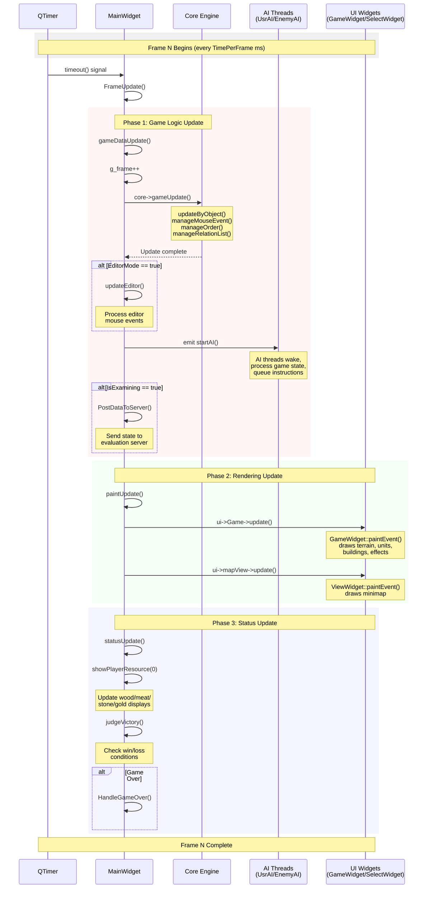
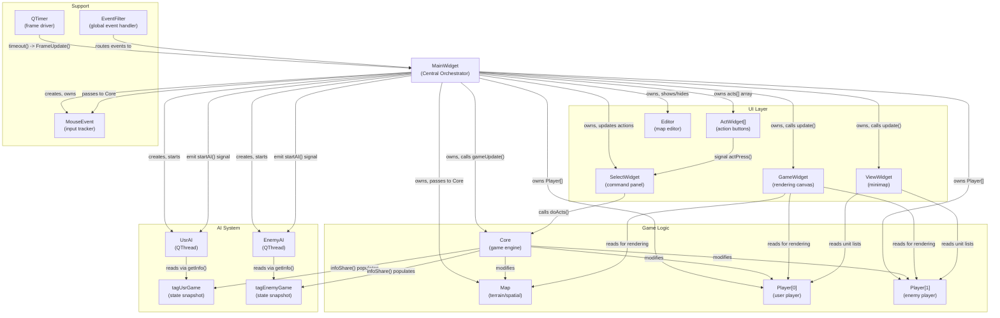
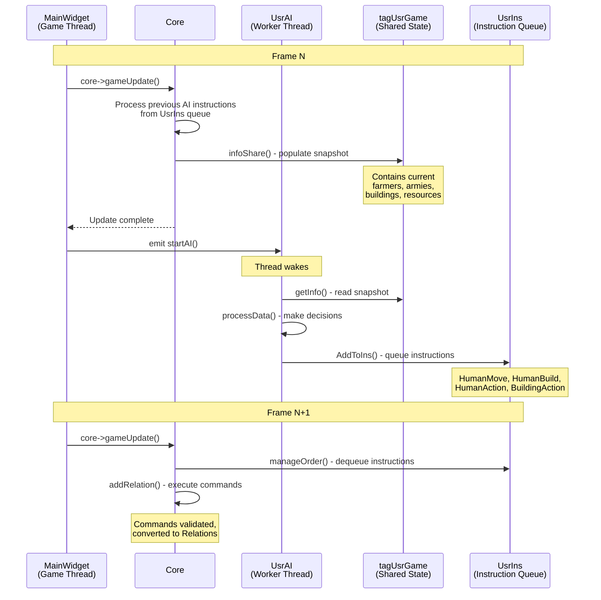

# MainWidget and Game Loop

<details>
<summary>Relevant source files</summary>

The following files were used as context for generating this wiki page:

- [MainWidget.cpp](MainWidget.cpp)
- [MainWidget.h](MainWidget.h)
- [README.md](README.md)

</details>


## Purpose and Scope

This page documents the `MainWidget` class, which serves as the central orchestrator for the entire game, and the frame-based game loop that drives all game systems. `MainWidget` manages initialization, coordinates subsystems, and executes the periodic update cycle that advances game state, processes AI decisions, updates rendering, and checks victory conditions.

For details on the Core engine's internal update logic, see [2.2](#2.2). For configuration loading that occurs before MainWidget initialization, see [2.3](#2.3). For UI component details, see [4.1](#4.1) and [4.2](#4.2).

---

## MainWidget as Central Orchestrator

`MainWidget` is the primary controller class (importance rating: 10.45) that owns and coordinates all major subsystems. It inherits from `QWidget` and serves as both the main application window and the integration point for game logic, rendering, player management, and AI processing.

### Core Responsibilities

| Responsibility | Implementation |
|----------------|----------------|
| **Subsystem Lifecycle** | Creates and destroys Core, Map, Player[], AI threads, UI widgets |
| **Game Loop Management** | Owns QTimer that drives frame updates via `FrameUpdate()` |
| **Initialization Orchestration** | Executes 17-step initialization sequence in constructor |
| **Resource Coordination** | Manages player resources, unit references, global state pointers |
| **Event Distribution** | Routes mouse/keyboard events to appropriate subsystems |
| **Editor Integration** | Hosts map editor, handles terrain/object placement |

### Key Member Variables

```cpp
class MainWidget : public QWidget {
    Core *core;                    // Game logic engine
    Map *map;                      // Terrain and spatial data
    Player** player;               // Array of Player objects (size MAXPLAYER)
    UsrAI* UsrAi;                  // Player AI thread
    EnemyAI *EnemyAi;              // Enemy AI thread
    SelectWidget *sel;             // Command panel UI
    ActWidget *acts[ACT_WINDOW_NUM_FREE];  // Action button array
    QTimer *timer;                 // Frame update timer
    MouseEvent *mouseEvent;        // Mouse state tracker
    int **memorymap;               // Vision/fog-of-war grid
    Editor* editor;                // Map editor window
    // ... additional UI and state members
};
```

Sources: [MainWidget.h:26-268](), [MainWidget.cpp:94-276]()

---

## Initialization Sequence

`MainWidget` executes a carefully ordered 17-step initialization sequence in its constructor. Each step initializes a specific subsystem, with dependencies resolved through ordering.

### Initialization Flowchart

```mermaid
flowchart TD
    Start["MainWidget Constructor Entry"] --> InitVar["1. initVar()<br/>Initialize basic variables"]
    InitVar --> InitEditor["2. initEditor()<br/>Setup editor state"]
    InitEditor --> InitGameRes["3. initGameResources()<br/>Load images/sounds via<br/>InitImageResMap/InitSoundResMap"]
    InitGameRes --> InitGameElem["4. initGameElements()<br/>Call initBlock/initBuilding/<br/>initAnimal/initStaticResource/<br/>initFarmer/initArmy/initMissile"]
    InitGameElem --> InitWinProp["5. initWindowProperties()<br/>Set window size/title/icon"]
    InitWinProp --> InitOpts["6. initOptions()<br/>Create Option dialog,<br/>button groups"]
    InitOpts --> InitInfo["7. initInfoPane()<br/>Create SelectWidget,<br/>ActWidget array"]
    InitInfo --> InitTimer["8. initGameTimer()<br/>Create QTimer,<br/>connect to FrameUpdate()"]
    InitTimer --> InitPlayers["9. initPlayers()<br/>Allocate Player[] array"]
    InitPlayers --> InitMap["10. initMap(MapJudge)<br/>Create Map, load terrain"]
    InitMap --> SetupCore["11. setupCore()<br/>Create Core instance"]
    SetupCore --> InitAI["12. initAI()<br/>Create UsrAI/EnemyAI,<br/>start threads"]
    InitAI --> SetupMouse["13. setupMouseTracking()<br/>Enable mouse tracking"]
    SetupMouse --> SetupTip["14. setupTipLabel()<br/>Configure status text"]
    SetupTip --> InitView["15. initViewMap()<br/>Setup minimap widget"]
    InitView --> InitBGM["16. initBGM()<br/>Load background music"]
    InitBGM --> InitSound["17. soundPlayThread<br/>Create and start<br/>sound thread"]
    InitSound --> Complete["Initialization Complete<br/>g_mainWidget = this<br/>Show editor if EditorMode"]
```



### Detailed Initialization Steps

| Step | Function | Purpose | Key Actions |
|------|----------|---------|-------------|
| 1 | `initVar()` | Initialize basic variables | Set default values for game state flags |
| 2 | `initEditor()` | Setup editor state | Initialize `currentSelected`, create area objects |
| 3 | `initGameResources()` | Load assets | Call `InitImageResMap(RESPATH)`, `InitSoundResMap(RESPATH)` |
| 4 | `initGameElements()` | Allocate entity resources | Initialize static image arrays for all entity types |
| 5 | `initWindowProperties()` | Configure window | Set size to `GAME_WIDTH x GAME_HEIGHT`, set title/icon |
| 6 | `initOptions()` | Create UI dialogs | Create `Option`, `AboutDialog`, speed button group |
| 7 | `initInfoPane()` | Initialize command UI | Create `SelectWidget`, initialize `acts[]` array with 12 buttons |
| 8 | `initGameTimer()` | Setup game loop | Create `QTimer`, connect to `FrameUpdate()` slot, start with `TimePerFrame` interval |
| 9 | `initPlayers()` | Create player objects | Allocate `Player*[MAXPLAYER]`, set initial resources/tech |
| 10 | `initMap(MapJudge)` | Initialize world | Create `Map`, load terrain, apply resources based on `MapJudge` parameter |
| 11 | `setupCore()` | Instantiate game engine | Create `Core(map, player, memorymap, mouseEvent)` |
| 12 | `initAI()` | Start AI threads | Create `UsrAI`/`EnemyAI`, connect signals, call `start()` |
| 13 | `setupMouseTracking()` | Enable mouse events | Set `MouseTracking(true)` on `GameWidget`, install event filter |
| 14 | `setupTipLabel()` | Configure status text | Set palette color for tip label |
| 15 | `initViewMap()` | Setup minimap | Configure minimap widget with player/enemy unit/building lists |
| 16 | `initBGM()` | Load background music | Get `SoundMap["BGM"]`, set infinite loop |
| 17 | Sound Thread | Start audio playback | Create `SoudPlayThread`, call `start()` |

**Critical Ordering Dependencies:**
- **Resources before Elements**: `initGameResources()` must occur before `initGameElements()` because entity initialization loads images from `resMap`
- **Map before Core**: `initMap()` must precede `setupCore()` because Core constructor requires Map pointer
- **Players before Core**: `initPlayers()` must precede `setupCore()` because Core constructor requires Player array
- **Core before AI**: `setupCore()` must precede `initAI()` because AI threads access Core through MainWidget

Sources: [MainWidget.cpp:94-152](), [MainWidget.cpp:1279-1474]()

---

## Frame-Based Game Loop

The game operates on a fixed-timestep loop driven by Qt's `QTimer`. Each frame executes three update phases in strict order: game logic, rendering, and status checks.

### Timer Configuration

The timer is configured as a precise timer with interval specified by the global `TimePerFrame` constant (typically 40ms for 25 FPS):

```cpp
void MainWidget::initGameTimer() {
    qDebug() << "初始化计时器...";
    timer = new QTimer(this);
    timer->setTimerType(Qt::PreciseTimer);  // High-precision timing
    timer->start(TimePerFrame);             // From config.json
    
    // Connect to update slots
    connect(timer, &QTimer::timeout, sel, &SelectWidget::frameUpdate);
    connect(timer, SIGNAL(timeout()), this, SLOT(FrameUpdate()));
}
```

Sources: [MainWidget.cpp:1372-1380]()

### FrameUpdate() Method

The top-level `FrameUpdate()` method orchestrates the three-phase update cycle:

```cpp
void MainWidget::FrameUpdate() {
    // Pause check
    if (pause) return;
    
    // Phase 1: Game Logic Update
    gameDataUpdate();
    
    // Phase 2: Rendering Update
    paintUpdate();
    
    // Phase 3: Status and UI Update
    statusUpdate();
}
```

Sources: [MainWidget.cpp:2176-2214]()

### Three-Phase Update Cycle



### Phase 1: Game Logic Update (`gameDataUpdate`)

This phase advances the simulation state:

| Operation | Description | Code Location |
|-----------|-------------|---------------|
| **Frame Counter** | Increment global `g_frame` counter | [MainWidget.cpp:2216-2217]() |
| **Core Update** | Call `core->gameUpdate()` - executes all game logic for this frame | [MainWidget.cpp:2218]() |
| **Editor Processing** | If `EditorMode`, call `updateEditor()` to handle terrain/object editing | [MainWidget.cpp:2220-2221]() |
| **AI Trigger** | Emit `startAI()` signal to wake AI threads | [MainWidget.cpp:2223]() |
| **Server Reporting** | If `IsExamining`, call `PostDataToServer()` every `DataPostIntervalFrame` frames | [MainWidget.cpp:2225-2228]() |

**Key Detail**: `core->gameUpdate()` is the heart of game simulation. It calls:
- `updateByObject()` - advance all entities' state machines
- `manageMouseEvent()` - process player mouse inputs
- `manageOrder()` - execute AI instructions from queue
- `manageRelationList()` - update ongoing actions (moving, attacking, building)

For detailed breakdown of `core->gameUpdate()`, see [2.2](#2.2).

Sources: [MainWidget.cpp:2216-2228]()

### Phase 2: Rendering Update (`paintUpdate`)

This phase triggers UI redraws without blocking game logic:

```cpp
void MainWidget::paintUpdate() {
    ui->Game->update();      // GameWidget: main game view
    ui->mapView->update();   // ViewWidget: minimap
}
```

**Rendering is Asynchronous**: Calling `update()` schedules a paint event; actual drawing occurs later in Qt's event loop. This prevents frame drops if rendering is slow.

Sources: [MainWidget.cpp:2231-2234]()

### Phase 3: Status Update (`statusUpdate`)

This phase updates UI displays and checks terminal conditions:

```cpp
void MainWidget::statusUpdate() {
    // Update resource displays
    showPlayerResource(NOWPLAYERREPRESENT);
    
    // Update various UI labels (population, time, etc.)
    sel->setName(nowobject, statusLbl);
    sel->settime(time(NULL));
    sel->setPop(player[NOWPLAYERREPRESENT]->getMaxHumanNum(), 
                 player[NOWPLAYERREPRESENT]->human.size());
    
    // Check victory conditions
    judgeVictory();
}
```

**Victory Check**: `judgeVictory()` calls `isWin()` and `isLoss()` to determine if game should end. If terminal state reached, calls `HandleGameOver()` which:
1. Stops AI threads via `stopAI()` signal
2. Saves score via `ScoreSave()`
3. Posts final result to server if in exam mode
4. Displays victory/defeat message

Sources: [MainWidget.cpp:2237-2255](), [MainWidget.cpp:2283-2342]()

---

## Subsystem Coordination

`MainWidget` acts as the integration hub, managing dependencies and data flow between subsystems that would otherwise be decoupled.

### System Interaction Diagram



### Core Engine Integration

**Ownership and Lifecycle:**
```cpp
void MainWidget::setupCore() {
    qDebug() << "加载内核...";
    core = new Core(map, player, memorymap, mouseEvent);
    sel->setCore(core);
    core->sel = sel;  // Bidirectional link for UI callbacks
}
```

**Frame Update Flow:**
```
MainWidget::FrameUpdate()
  → gameDataUpdate()
    → core->gameUpdate()
      [Core performs all simulation logic - see page 2.2]
      → returns to MainWidget
  → paintUpdate() [rendering]
  → statusUpdate() [UI updates]
```

**Key Integration Points:**
- `MainWidget` owns the `Core` instance
- `Core` receives `Map*`, `Player**`, `memorymap`, `MouseEvent*` in constructor
- `SelectWidget` receives `Core*` to execute player commands via `doActs()`
- `Core` has back-reference to `SelectWidget` for UI callbacks

Sources: [MainWidget.cpp:1433-1438](), [MainWidget.cpp:2218]()

### Player and Map Management

`MainWidget` owns both the `Player` array and the `Map` instance, passing them to `Core`:

```cpp
// Player array allocation
void MainWidget::initPlayers() {
    player = new Player*[MAXPLAYER];
    for (int i = 0; i < MAXPLAYER; i++) {
        player[i] = new Player(i);
    }
    player[1]->set_AllTechnology();  // Enemy starts with all techs
    player[0]->setCiv(DefaultCivilization);
}

// Map creation
void MainWidget::initMap(int MapJudge) {
    map = new Map;
    map->setPlayer(player);
    map->init(MapJudge);           // Load terrain/resources
    map->init_Map_Height();        // Generate height map
    map->loadResource();           // Place objects from file
}
```

**Resource Display Updates:**
Every frame in `statusUpdate()`, MainWidget reads from `Player` and updates UI:
```cpp
void MainWidget::showPlayerResource(int playerRepresent) {
    ui->wood->setText(QString::number(player[playerRepresent]->wood));
    ui->meat->setText(QString::number(player[playerRepresent]->meat));
    ui->stone->setText(QString::number(player[playerRepresent]->stone));
    ui->gold->setText(QString::number(player[playerRepresent]->gold));
}
```

Sources: [MainWidget.cpp:1382-1397](), [MainWidget.cpp:1399-1419](), [MainWidget.cpp:2257-2281]()

### UI Components

`MainWidget` coordinates multiple UI widgets, each with specific responsibilities:

| Component | Type | Purpose | Update Mechanism |
|-----------|------|---------|------------------|
| `ui->Game` | `GameWidget` | Main rendering canvas | `update()` called in `paintUpdate()` |
| `sel` | `SelectWidget` | Command panel, shows selected unit info/actions | Connected to timer, receives `Core*` |
| `acts[]` | `ActWidget[12]` | Action button grid | Updated by `SelectWidget` based on selected object |
| `ui->mapView` | `ViewWidget` | Minimap display | `update()` called in `paintUpdate()`, reads unit lists |
| `editor` | `Editor` | Map editor window | Shown/hidden based on `EditorMode` flag |
| `option` | `Option` | Settings dialog | Modal dialog, opened via button click |

**Action Button Setup:**
```cpp
void MainWidget::initInfoPane() {
    sel = new SelectWidget(this);
    sel->move(20, 810);
    sel->show();

    ActWidget* acts_[ACT_WINDOW_NUM_FREE] = { 
        ui->interact1, ui->interact2, /* ... */ ui->interact12 
    };
    for (int i = 0; i < ACT_WINDOW_NUM_FREE; i++) {
        acts[i] = acts_[i];
        acts[i]->setStatus(0);
        acts[i]->setNum(i);
        acts[i]->setFixedSize(70, 70);
        acts[i]->hide();
        connect(acts[i], SIGNAL(actPress(int)), sel, SLOT(widgetAct(int)));
    }
}
```

**Command Flow:**
```
User clicks ActWidget[i]
  → emits actPress(i) signal
  → SelectWidget::widgetAct(i) slot
  → sel->doActs(actName, nowobject)
  → core->addRelation(...) [queues action]
```

Sources: [MainWidget.cpp:1338-1370]()

### AI Thread Synchronization

AI threads run asynchronously but synchronize with the main game loop through signal-based triggering:

**Thread Creation and Connection:**
```cpp
void MainWidget::initAI() {
    UsrAi = new UsrAI();
    EnemyAi = new EnemyAI();
    
    // Connect trigger signal
    connect(this, &MainWidget::startAI, UsrAi, &AI::startProcessing);
    connect(this, &MainWidget::startAI, EnemyAi, &AI::startProcessing);
    
    // Connect AI-specific signals
    connect(UsrAi, &AI::cheatAttack, EnemyAi, &EnemyAI::onWaveAttack);
    connect(UsrAi, &UsrAI::cheatRes, this, &MainWidget::cheat_Player0Resource);
    
    // Start threads
    UsrAi->start();
    EnemyAi->start();
}
```

**Synchronization Pattern:**


**Thread Safety Mechanisms:**
- **State Snapshots**: AI threads read from `tagUsrGame`/`tagEnemyGame` which are populated once per frame by `Core::infoShare()`
- **Instruction Queues**: AI threads write to `UsrIns`/`EnemyIns` protected by `QMutex`
- **One-Way Data Flow**: AI never directly modifies game state; all changes go through instruction queue
- **Signal-Based Wakeup**: `emit startAI()` wakes threads via Qt signal mechanism (thread-safe)

Sources: [MainWidget.cpp:1421-1431](), [Diagram 2 and Diagram 5 from high-level architecture]()

---

## Global State and Access Patterns

`MainWidget` uses several global variables and patterns to enable cross-module access:

### Global Instance Pointer

```cpp
// Declared in MainWidget.cpp
MainWidget* g_mainWidget = nullptr;

// Set in constructor
MainWidget::MainWidget(int MapJudge, QWidget* parent) {
    // ... initialization ...
    g_mainWidget = this;
}

// Cleared in destructor
MainWidget::~MainWidget() {
    g_mainWidget = nullptr;
    // ... cleanup ...
}
```

**Usage Pattern**: Other systems (e.g., unit cleanup callbacks) can access MainWidget without passing pointers:
```cpp
void g_globalCleanupUnit(Coordinate* unit) {
    if (g_mainWidget) {
        g_mainWidget->cleanupUnitReferences(unit);
    }
}
```

Sources: [MainWidget.cpp:18-29](), [MainWidget.cpp:94-149](), [MainWidget.cpp:1478-1499]()

### Global Object Registry

```cpp
// Declared in MainWidget.cpp
std::map<int, Coordinate*> g_Object;

// Also global frame counter
int g_frame = 0;  // Incremented every frame in gameDataUpdate()
```

**Purpose**: `g_Object` maps serial numbers (SN) to object pointers, enabling fast lookups by SN (used extensively by AI instruction processing).

Sources: [MainWidget.cpp:11-32]()

### Area Object Globals

```cpp
// Declared in MainWidget.cpp
RectArea* g_rectArea = nullptr;
CircleArea* g_circleArea = nullptr;
LineArea* g_lineArea = nullptr;

// Set in MainWidget::initEditor()
void MainWidget::initEditor() {
    rectArea = new RectArea(ui->Game);
    circleArea = new CircleArea(ui->Game);
    lineArea = new LineArea(ui->Game);
    
    g_rectArea = (RectArea*)rectArea;
    g_circleArea = (CircleArea*)circleArea;
    g_lineArea = (LineArea*)lineArea;
}
```

**Usage**: AI and map editor access these globals to query/modify patrol areas and selection regions.

Sources: [MainWidget.cpp:13-16](), [MainWidget.cpp:2122-2130]()

### Access Pattern Summary

| Global Variable | Type | Purpose | Set By | Accessed By |
|-----------------|------|---------|--------|-------------|
| `g_mainWidget` | `MainWidget*` | Access to MainWidget singleton | Constructor | Unit cleanup, global utilities |
| `g_Object` | `map<int, Coordinate*>` | SN → object pointer registry | Core during object creation | AI, Core lookup operations |
| `g_frame` | `int` | Current frame number | `gameDataUpdate()` | Timing calculations, periodic logic |
| `g_rectArea` | `RectArea*` | Rectangle selection tool | `initEditor()` | Map editor, AI area queries |
| `g_circleArea` | `CircleArea*` | Circle selection tool | `initEditor()` | Map editor, AI area queries |
| `g_lineArea` | `LineArea*` | Line selection tool | `initEditor()` | Map editor, AI area queries |

Sources: [MainWidget.cpp:11-32](), [MainWidget.h:270-276]()

---

## Editor Integration

When `EditorMode` is enabled, MainWidget hosts the map editor as a separate window and processes editor-specific updates:

### Editor Update Flow

```cpp
void MainWidget::gameDataUpdate() {
    g_frame++;
    core->gameUpdate();
    
    // Editor processing in game loop
    if (EditorMode) {
        updateEditor();  // Process editor mouse events
    }
    
    emit startAI();
    // ... rest of update ...
}
```

**`updateEditor()` Responsibilities:**
- Process terrain modification (raise/lower, ocean/grassland)
- Handle object placement (buildings, units, resources)
- Manage area selection (patrol zones, limit areas)
- Handle enemy status assignment (attack/defend)

The editor uses the `currentSelected` state machine (enum `EditorElement`) to determine what happens on mouse clicks:

```cpp
enum EditorElement {
    DELETEOBJECT, FLAT, OCEAN, HIGHTERLAND, LOWERLAND,
    PLAYERDOWNTOWN, PLAYERTRANSPORTSHIP, /* ... */
    PATROL_RECT_AREA, PATROL_CIRCLE_AREA, PATROL_LINE_AREA,
    ENEMY_STATUS_ATTACK, ENEMY_STATUS_DEFEND,
    NORMAL_MOUSE,
};
```

For complete editor details, see [4.2](#4.2).

Sources: [MainWidget.cpp:2220-2221](), [MainWidget.cpp:528-740](), [MainWidget.h:80-129]()