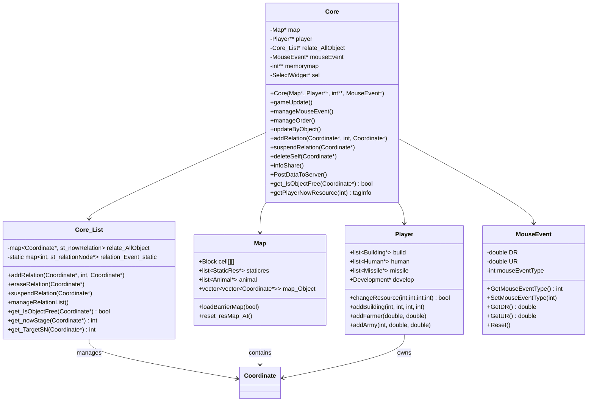
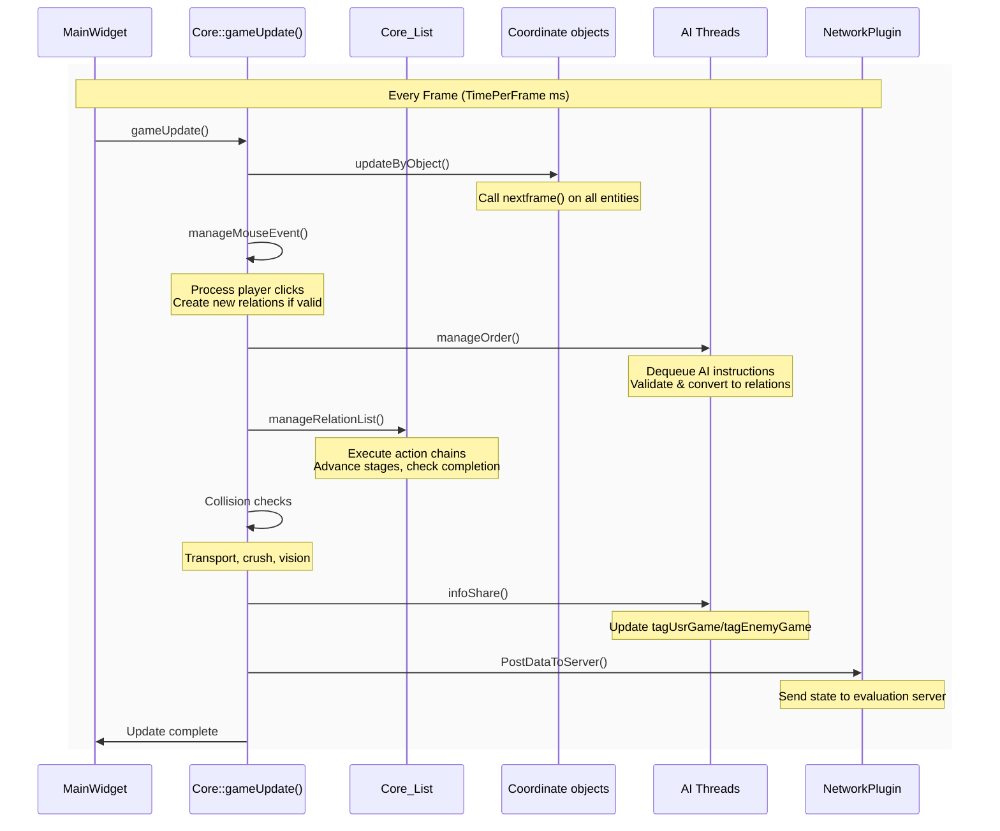
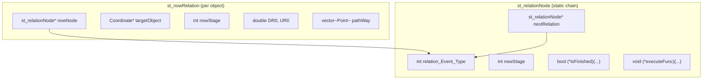
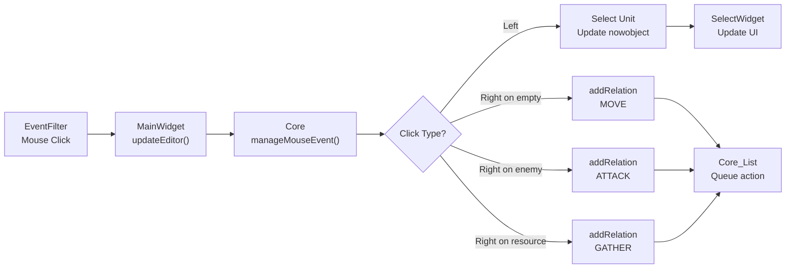
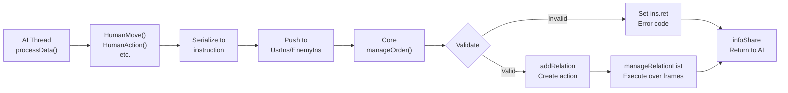

# Game Core Engine

Relevant source files

The following files were used as context for generating this wiki page:

- [GlobalVariate.h](GlobalVariate.h)
- [MainWidget.cpp](MainWidget.cpp)
- [README.md](README.md)

The Game Core Engine is the central logic system that drives gameplay in new-aoe. It manages the per-frame update cycle, processes player input and AI commands, maintains entity relationships and actions, handles object lifecycle, and coordinates all gameplay mechanics. This page documents the `Core` class, its associated `Core_List` relation manager, and the `gameUpdate()` execution pipeline.

For information about how the Core is initialized and invoked from the main game loop, see [MainWidget and Game Loop](#2.1). For configuration parameters that control Core behavior, see [Configuration System](#2.3).

---

## Overview and Responsibilities

The `Core` class serves as the single source of truth for game state and logic. It is instantiated once by `MainWidget` and owns references to the `Map`, `Player` array, memory map, and `MouseEvent` handler.

**Core Responsibilities:**

| Responsibility | Description |
|----------------|-------------|
| **Frame Update** | Executes `gameUpdate()` each frame to advance game state |
| **Object Updates** | Calls `nextframe()` on all entities via `updateByObject()` |
| **Input Processing** | Handles mouse clicks via `manageMouseEvent()` |
| **AI Command Processing** | Dequeues and validates AI instructions via `manageOrder()` |
| **Relation Management** | Maintains action chains (move, attack, build, etc.) via `Core_List` |
| **Collision Detection** | Checks unit-unit and unit-terrain collisions |
| **State Synchronization** | Provides `infoShare()` to update AI thread snapshots |
| **Network Reporting** | Sends game state to evaluation server via `PostDataToServer()` |

The Core does not directly render graphics or play sounds—it purely manages game logic and state transitions.

Sources: Diagrams 1-2, [MainWidget.cpp:1433-1438]()

---

## Core Class Architecture

**Key Pointers:**
- `map`: Terrain grid, static resources, animals, and `map_Object` spatial index
- `player[]`: Array of `MAXPLAYER` players (typically 2), each owning buildings and units
- `relate_AllObject`: Instance of `Core_List` managing all active action chains
- `mouseEvent`: Shared instance for capturing clicks from `EventFilter`
- `memorymap`: Vision/fog-of-war grid (`MEMORYROW × MEMORYCOLUMN`)
- `sel`: Reference to `SelectWidget` for UI updates

Sources: [MainWidget.cpp:1433-1438](), [GlobalVariate.h:514-527](), Diagram 1

---

## The gameUpdate() Execution Pipeline

Each frame (every `TimePerFrame` milliseconds, default ~16-33ms), `MainWidget::FrameUpdate()` invokes `Core::gameUpdate()`, which executes the following stages in strict order:

### Stage Breakdown

#### 1. updateByObject()
Iterates all objects across `player[i]->build`, `player[i]->human`, `player[i]->missile`, `map->staticres`, `map->animal` and calls `nextframe()` on each. This allows:
- Units to advance animation frames
- Farmers to increment work progress
- Buildings under construction to update completion percentage
- Missiles to move along trajectories

#### 2. manageMouseEvent()
If `mouseEvent->HaveEvent()` returns true, processes the click:
- Left click: Selects unit/building (updates `nowobject`, sends to `SelectWidget`)
- Right click with selection: Calls `addRelation()` to create Move, Attack, or Gather relations
- Validates terrain, ownership, and prerequisites before creating relations

Sources: Diagram 2, [MainWidget.cpp:1433-1438](), [GlobalVariate.h:974-997]()

#### 3. manageOrder()
Dequeues instructions from `UsrIns.instructions` and `EnemyIns.instructions` queues:
- Type 0 (INS_CANCEL): Calls `suspendRelation(self)`
- Type 1 (INS_HUMANMOVE): Creates movement relation via `addRelation()`
- Type 2 (INS_HUMANACTION): Creates gather/attack relation
- Type 3 (INS_HUMANBUILD): Validates resources, creates build relation
- Type 4 (INS_BUILDINGACTION): Triggers research/training
- Type 5 (INS_PINPOINT_STRIKE): Sets artillery target coordinates

Each instruction is validated (SN exists, resources sufficient, action allowed) and a return code is written to `ins.ret`:
- `0`: Success
- `-1`: SN not found
- `-2`: Action not found
- `-3`: Out of bounds
- `-4`: Target object not found
- `-5`: Invalid building
- `-6`: Insufficient resources

Return codes are stored in `tagGame.Info->ins_ret` and returned to AI via `getInfo().ins_ret`.

Sources: [GlobalVariate.h:765-791](), Diagram 5

#### 4. manageRelationList()
The `Core_List` processes all active relations in `relate_AllObject`:
- Advances each relation to its next stage (e.g., "moving to target" → "arrived, start gathering")
- Calls stage-specific functions from `relation_Event_static` chains
- Removes completed relations, keeps ongoing ones
- Handles pathfinding for movement relations
- Executes attack damage calculations
- Processes building construction progress

This is where most gameplay actions actually happen—`addRelation()` only queues the action, `manageRelationList()` executes it over multiple frames.

Sources: Diagram 2

#### 5. Collision & Transport
- **Collision**: Checks `memorymap` and `Map::isBarrier()` to prevent units from walking through each other or terrain
- **Crush Detection**: Heavy units (elephants, chariots) can trample light units
- **Transport**: Handles ships loading/unloading land units
- **Vision**: Updates fog-of-war based on unit vision ranges

#### 6. infoShare()
Populates `tagUsrGame` and `tagEnemyGame` structures by:
- Iterating all buildings, farmers, armies, resources
- Converting to `tagBuilding`, `tagFarmer`, `tagArmy`, `tagResource` structs
- Applying fog-of-war (enemy data has DR0/UR0 hidden via `toEnemy()`)
- Copying terrain data and resource counts
- Including `ins_ret` map for AI feedback

AI threads read this data via `getInfo()` in their next cycle.

Sources: [GlobalVariate.h:847-910](), Diagram 5

#### 7. PostDataToServer()
If `IsExamining` is enabled and `g_frame % DataPostIntervalFrame == 0`, serializes game state to JSON and posts to `GameServerAddr` via `NetworkPlugin`. Used for online evaluation/grading.

Sources: [GlobalVariate.h:501-508](), Diagram 6

---

## Relation Management System

The `Core_List` class implements a finite state machine for multi-frame actions. Each relation represents "Object A is doing Action X to Object B" and progresses through predefined stages.

### Relation Structure

**Key Data Structures:**

| Structure | Purpose |
|-----------|---------|
| `st_nowRelation` | Per-object instance tracking current action, target, path, stage |
| `st_relationNode` | Static stage definition with condition check and execute function |
| `relation_Event_static` | Map of relation type → linked list of stages |
| `relate_AllObject` | Map of `Coordinate*` → current `st_nowRelation` |

### Common Relation Chains

**Movement Relation:**
1. Stage 0: Calculate path to (DR0, UR0)
2. Stage 1: Follow path, move toward next waypoint
3. Stage 2: Arrival—clear relation or trigger next action

**Gather Resource Relation:**
1. Stage 0: Path to resource
2. Stage 1: Walk to resource
3. Stage 2: Perform gathering animation, increment resource count
4. Stage 3: Path back to storage building
5. Stage 4: Walk to storage
6. Stage 5: Deposit resources, update player totals

**Attack Relation:**
1. Stage 0: Path to target
2. Stage 1: Walk toward target
3. Stage 2: In range—play attack animation, create `Missile`
4. Stage 3: Wait for attack cooldown (based on `INTERVAL_*` config)
5. Loop back to stage 2 if target still alive and in range

**Building Construction Relation:**
1. Stage 0: Deduct resources from player
2. Stage 1: Create incomplete `Building` object (Percent = 0)
3. Stage 2: Farmer walks to building
4. Stage 3: Increment Percent each frame based on `FARMER_CONSTRUCTSPEED`
5. Stage 4: Percent == 100 → mark building complete, clear relation

Sources: Diagrams 2-3, description based on relation management pattern

---

## Object Lifecycle

### Creation

Objects are created by `Player` methods:

| Method | Creates |
|--------|---------|
| `addBuilding(type, blockDR, blockUR, percent)` | Building (construction or instant) |
| `addFarmer(DR, UR)` | Farmer at coordinates |
| `addArmy(armyType, DR, UR)` | Military unit |
| `addMissile(...)` | Projectile (arrow, stone, spear) |
| `Map::addAnimal(type, DR, UR)` | Animal or tree |
| `Map::addStaticRes(type, blockDR, blockUR)` | Mine, gold, stone |

Created objects are:
1. Allocated via `new`
2. Added to appropriate list (`player->build`, `player->human`, etc.)
3. Inserted into `map->map_Object[blockDR][blockUR]` spatial grid
4. Assigned unique `SN` (serial number) for AI referencing
5. Registered in `g_Object` global map if needed

### Updates

Each frame, `Core::updateByObject()` calls `obj->nextframe()`:
- **Coordinate**: Base update (position, animation frame)
- **MoveObject**: Movement along path, collision checks
- **BloodHaver**: Regeneration, death checks
- **Building**: Construction progress, production queues
- **Farmer**: Work state transitions
- **Army**: Combat cooldowns, missile launch
- **Missile**: Trajectory movement, hit detection

### Deletion

Entities are removed when:
- Health reaches 0 (`BloodHaver::get_isDestroy()`)
- Manually destroyed by player/AI
- Resource depleted (`StaticRes::Cnt <= 0`)
- Missile hits target
- Building construction cancelled

**Deletion Process:**
1. `Core::deleteSelf(Coordinate* obj)` called
2. Removed from owner's list (`player->deleteHuman()`, etc.)
3. Removed from `map->map_Object` spatial grid
4. `suspendRelation(obj)` clears any active actions
5. Object memory freed via `delete`
6. Any units targeting this object have their relation updated

**Critical:** Units must be removed from area relations (RectArea, CircleArea, LineArea) and selection lists before deletion to avoid dangling pointers. `MainWidget::cleanupUnitReferences()` handles this.

Sources: [MainWidget.cpp:742-847](), [GlobalVariate.h:512-527]()

---

## Interaction Processing

### Player Input Flow

### AI Command Flow

**Validation Steps in manageOrder():**
1. Check `g_Object[SN]` exists
2. Verify action type matches object type (e.g., only Buildings can do BuildingAction)
3. Check resources sufficient for builds/training
4. Validate coordinates within map bounds
5. For actions on objects, verify `g_Object[obSN]` exists and is valid target

Sources: [GlobalVariate.h:765-791](), Diagrams 2 and 5

---

## Integration with Other Systems

### Map Integration

The Core queries the Map for:
- **Terrain passability**: `map->isBarrier(blockDR, blockUR)`
- **Pathfinding**: `map->findBlock_Free(startDR, startUR, endDR, endUR)`
- **Resource locations**: `map->staticres` list
- **Spatial lookups**: `map->map_Object[blockDR][blockUR]` contains all objects at that tile

The Core updates the Map after:
- Buildings placed/destroyed: `map->loadBarrierMap(true)`
- Resources depleted: `map->reset_resMap_AI()`

### Player Integration

Each `Player` owns entity lists and resources. The Core:
- Reads `player[i]->build`, `player[i]->human`, `player[i]->missile` for iteration
- Calls `player[i]->changeResource(wood, food, stone, gold)` when spending/gaining
- Invokes `player[i]->addBuilding()`, `player[i]->addArmy()` when creating units
- Queries `player[i]->develop->conditionDevelop()` for tech prerequisites

### SelectWidget Integration

The `Core` holds a `SelectWidget* sel` reference. When the player selects an object:
1. `Core::manageMouseEvent()` sets `nowobject = clickedObject`
2. Calls `sel->getBuild(blockDR, blockUR, buildingType)` or similar
3. `SelectWidget` reads `nowobject` properties to display UI
4. Player clicks action button → `SelectWidget::doActs(actName, nowobject)` → Core processes

### AI Thread Integration

AI threads run asynchronously but synchronize via:
1. **Read**: AI calls `getInfo()` which locks `tagGame` and returns snapshot
2. **Write**: AI calls `HumanMove()` etc. which push to `ins.instructions` queue (thread-safe via `QMutex`)
3. **Feedback**: Next frame, `Core::manageOrder()` processes queue, writes `ins.ret`
4. **Next Read**: AI sees `ins_ret` map in next `getInfo()` call

This prevents race conditions—AI never directly mutates Core state.

Sources: Diagram 5, [GlobalVariate.h:914-972]()

---

## Performance Considerations

### Per-Frame Costs

| Operation | Complexity | Notes |
|-----------|------------|-------|
| `updateByObject()` | O(n) where n = total entities | Calls `nextframe()` on every object |
| `manageRelationList()` | O(r) where r = active relations | Typically r << n (most units idle) |
| `manageMouseEvent()` | O(1) | Single click per frame max |
| `manageOrder()` | O(q) where q = queued AI instructions | Usually small (1-10 per frame) |
| Collision checks | O(k²) where k = units in same tile | Uses spatial grid to reduce checks |

### Optimization Strategies

- **Spatial Partitioning**: `map->map_Object[][]` grid prevents O(n²) collision checks—only units in same/adjacent tiles checked
- **Lazy Pathfinding**: Paths calculated once, reused until target changes
- **Relation Pooling**: `relation_Event_static` chains are static—only per-instance state allocated
- **Fog-of-War Caching**: Vision updates only when units move

### Frame Budget

With `TimePerFrame = 33ms` (30 FPS) and typical game with 100 units, 20 buildings, 10 active relations:
- `updateByObject()`: ~5-10ms
- `manageRelationList()`: ~2-5ms
- AI processing: ~1-3ms
- Rendering (GameWidget): ~10-15ms
- Remaining: ~5-10ms buffer

The Core is designed to complete within 10-15ms even with hundreds of entities.

Sources: Diagram 2, performance characteristics inferred from architecture

---

## Error Handling and Validation

### Common Error Scenarios

| Error Code | Scenario | Core Response |
|------------|----------|---------------|
| `-1` (SN not found) | AI references deleted unit | Ignore instruction, set `ins.ret[-1]` |
| `-2` (Action invalid) | Building can't perform requested action | Ignore, return error code |
| `-3` (Out of bounds) | Build/move target outside map | Reject before creating relation |
| `-4` (Target not found) | Gather/attack target deleted mid-action | Suspend relation, unit becomes idle |
| `-6` (Insufficient resources) | Not enough wood/food for building | Reject, don't deduct resources |

### Defensive Checks

The Core validates at multiple points:
- **On instruction**: `manageOrder()` checks SN, resources, bounds
- **On relation creation**: `addRelation()` verifies target exists, path possible
- **On relation execution**: Each stage's `isFinished()` checks target still alive
- **On deletion**: `deleteSelf()` clears relations, removes from spatial grid

Invalid pointers are prevented by:
1. All entity access via `g_Object[SN]` map lookup (returns nullptr if deleted)
2. Relations store target SN, not raw pointer—re-lookup each frame
3. `suspendRelation()` called before `delete` to clear all references

Sources: [GlobalVariate.h:1292-1299](), error code documentation

---

## Summary

The Game Core Engine is the deterministic logic kernel of new-aoe. It executes a fixed update pipeline each frame, processes inputs from players and AI, manages a relation-based action system, and coordinates entity lifecycle. All gameplay—movement, combat, resource gathering, building—flows through `Core::gameUpdate()` and its subsystems.

**Key Takeaways:**
- `Core::gameUpdate()` is the single entry point for per-frame logic
- `Core_List` implements multi-stage action chains using static relation graphs
- Player input and AI commands both convert to relations via `addRelation()`
- Objects are owned by `Player` or `Map`, referenced by Core, never directly modified by AI
- State synchronization via `infoShare()` ensures AI sees consistent snapshots
- Return codes in `ins_ret` provide feedback to AI scripts

For details on how this integrates with the main loop, see [MainWidget and Game Loop](#2.1). For unit behavior specifics, see [Units and Buildings](#3.3).

Sources: All diagrams and files cited throughout this document