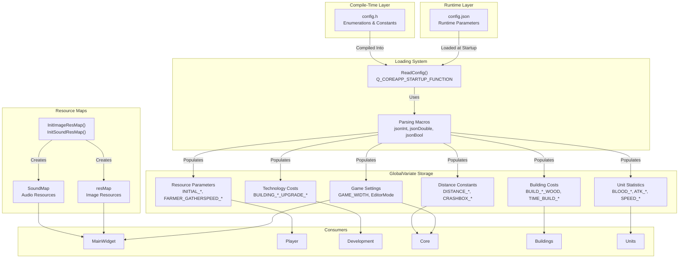
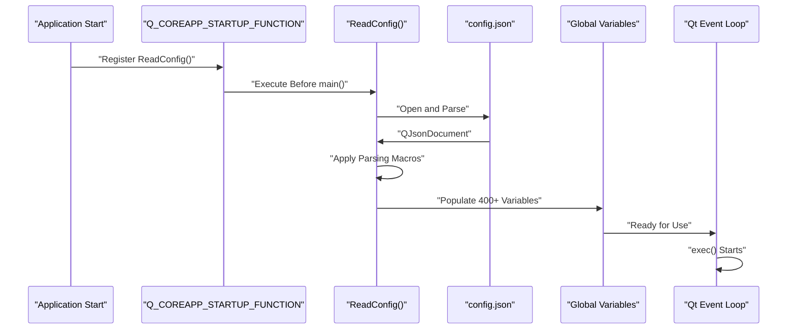
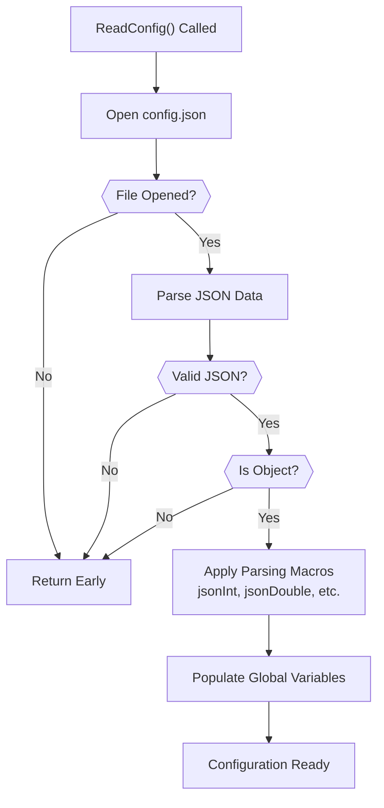
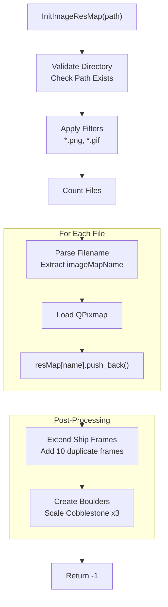
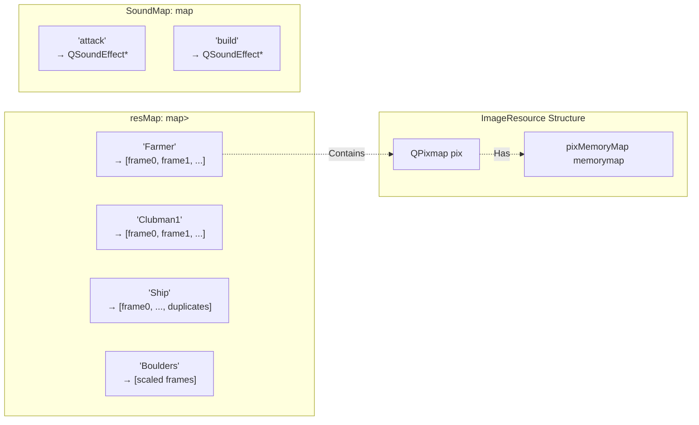
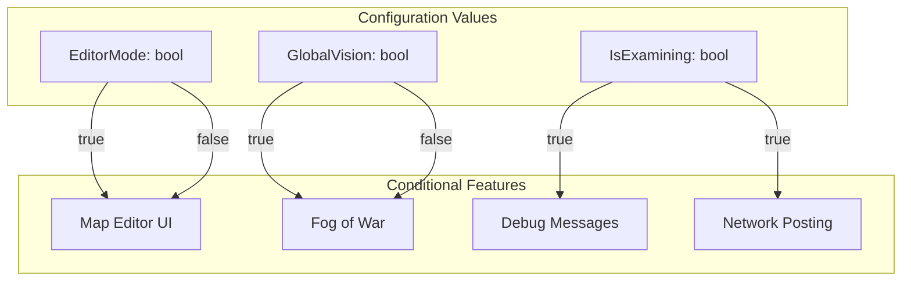

# Configuration System

<details>
<summary>Relevant source files</summary>

The following files were used as context for generating this wiki page:

- [GlobalVariate.cpp](GlobalVariate.cpp)
- [GlobalVariate.h](GlobalVariate.h)
- [config.json](config.json)

</details>


The Configuration System manages game parameters through a dual-tier architecture combining compile-time constants and runtime JSON configuration. This system provides centralized control over 400+ game parameters including unit statistics, building costs, resource values, visual settings, and gameplay mechanics. The system initializes before Qt's event loop begins, ensuring all parameters are available during application startup.

For information about how configuration values are consumed by specific game systems, see the Player resource system [3.1](#3.1), Technology Tree [3.2](#3.2), and Units and Buildings [3.3](#3.3).

---

## Configuration Architecture

The system implements a two-tier configuration approach that separates type definitions from runtime values:



**Sources:** [config.json:1-471](), [GlobalVariate.cpp:1-1747](), [GlobalVariate.h:1-1326]()

---

## Runtime Configuration File (config.json)

The `config.json` file contains 470+ parameters organized into logical categories. The file uses a flat JSON structure for simplicity:

### Configuration Categories

| Category | Parameter Count | Example Parameters | Purpose |
|----------|----------------|-------------------|---------|
| **Game Settings** | ~20 | `GAME_WIDTH`, `EditorMode`, `GlobalVision`, `IsExamining` | Window dimensions, modes, debug flags |
| **Map & Rendering** | ~15 | `MAP_L`, `MAP_U`, `BLOCKSIDELENGTH`, `MEMORYROW` | Map dimensions, coordinate systems |
| **Initial Resources** | 4 | `INITIAL_WOOD`, `INITIAL_MEAT`, `INITIAL_GOLD`, `INITIAL_STONE` | Starting resource quantities |
| **Unit Base Stats** | ~180 | `BLOOD_FARMER`, `SPEED_CLUBMAN1`, `ATK_BOWMAN` | Health, speed, attack, defense for all units |
| **Building Properties** | ~60 | `BLOOD_BUILD_CENTER`, `BUILD_HOUSE_WOOD`, `TIME_BUILD_FARM` | Health, costs, construction times |
| **Technology Costs** | ~120 | `BUILDING_STOCK_UPGRADE_CLOSER_ATTACK_FOOD`, `TIME_BUILDING_CENTER_UPGRADE` | Research costs and durations |
| **Gather/Production** | ~30 | `FARMER_GATHERSPEED_WOOD`, `FARMER_CARRYLIMIT_FOOD`, `CNT_TREE` | Resource gathering rates, carry limits |
| **Distance Constants** | ~20 | `DISTANCE_Manhattan_MoveEndNEAR`, `CRASHBOX_MIDDLE` | Collision boxes, attack ranges |
| **Animation Timers** | ~15 | `NOWRES_TIMER_FARMER`, `NOWRES_TIMER_BOWMAN` | Frame counts for sprite switching |
| **Missile Physics** | ~5 | `Missile_Speed_Arrow`, `Missile_Boulders_Range` | Projectile speeds, splash damage |

**Sources:** [config.json:1-471]()

### Key Configuration Parameters

```json
{
    "EditorMode": false,
    "GlobalVision": false,
    "IsExamining": false,
    "GAME_WIDTH": 1920,
    "GAME_HEIGHT": 1000,
    "MAP_L": 100,
    "MAP_U": 100,
    "BLOCKSIDELENGTH": 35.77708763999664,
    "INITIAL_WOOD": 200,
    "INITIAL_MEAT": 200,
    "INITIAL_GOLD": 150,
    "INITIAL_STONE": 0,
    "FARMER_GATHERSPEED_WOOD": 0.02,
    "BLOOD_FARMER": 25,
    "BUILD_CENTER_WOOD": 200,
    "TIME_BUILD_CENTER": 60,
    "BUILDING_CENTER_CREATEFARMER_FOOD": 50
}
```

**Sources:** [config.json:1-100]()

---

## Configuration Loading System

### Startup Function Registration

The `ReadConfig()` function is registered to execute before Qt's main event loop using the `Q_COREAPP_STARTUP_FUNCTION` macro:



**Sources:** [GlobalVariate.cpp:1224-1746]()

### Macro-Based Parsing

The loading system uses preprocessor macros for concise JSON parsing:

```cpp
// Macro definitions
#define json(x) config[#x]
#define jsonInt(x) x=json(x).toInt()
#define jsonDouble(x) x=json(x).toDouble()
#define jsonQString(x) x=json(x).toString()
#define jsonString(x) x=json(x).toString().toStdString()
#define jsonBool(x) x=json(x).toBool()

// Usage examples
jsonBool(IsExamining);
jsonInt(GAME_WIDTH);
jsonDouble(BLOCKSIDELENGTH);
jsonQString(GameServerAddr);
```

This approach allows loading hundreds of parameters with minimal boilerplate code.

**Sources:** [GlobalVariate.cpp:1247-1252]()

### ReadConfig() Implementation Flow



**Sources:** [GlobalVariate.cpp:1224-1746]()

The function performs minimal error handling - if the file cannot be opened or parsed, it silently returns, allowing the application to use default-initialized values.

---

## Global Variable System

### Variable Declarations

All configuration variables are declared as `extern` in `GlobalVariate.h` and defined in `GlobalVariate.cpp`:

```cpp
// GlobalVariate.h - Declarations
extern int GAME_WIDTH;
extern int GAME_HEIGHT;
extern bool EditorMode;
extern double BLOCKSIDELENGTH;
extern int INITIAL_WOOD;

// GlobalVariate.cpp - Definitions
int GAME_WIDTH;
int GAME_HEIGHT;
bool EditorMode;
double BLOCKSIDELENGTH;
int INITIAL_WOOD;
```

**Sources:** [GlobalVariate.h:243-256](), [GlobalVariate.cpp:22-97]()

### Variable Categories by Type

| Type | Count | Purpose | Examples |
|------|-------|---------|----------|
| `int` | ~350 | Discrete values, costs, timers | `BLOOD_FARMER`, `BUILD_HOUSE_WOOD` |
| `double` | ~40 | Continuous values, speeds, distances | `SPEED_CAVALRY`, `BLOCKSIDELENGTH` |
| `bool` | ~15 | Flags, mode switches | `EditorMode`, `GlobalVision`, `MAP_EXPLORE` |
| `QString` | ~5 | Paths, URLs, display strings | `RESPATH`, `GameServerAddr`, `GAME_TITLE` |
| `string` | ~3 | Version info, file suffixes | `GAME_VERSION`, `MAPFILE_SUFFIX` |

**Sources:** [GlobalVariate.h:14-509]()

---

## Resource Map Initialization

### Image Resource Loading

The `InitImageResMap()` function populates the `resMap` with game sprites:



**Sources:** [GlobalVariate.cpp:590-697]()

### Collision Map Generation

Each loaded image generates a `pixMemoryMap` for collision detection:

```cpp
void initMemory(ImageResource *res)
{
    QImage piximage = res->pix.toImage();
    res->memorymap = pixMemoryMap(res->pix.width(), res->pix.height());
    
    // Set collision bits for non-transparent pixels
    for(int i=0; i<res->pix.width(); i++) {
        for(int j=0; j<res->pix.height(); j++) {
            if((piximage.pixel(i,j)) & (0xff000000) != 0) {
                res->memorymap.setMemoryMap(i,j);
                // Also set adjacent pixels for smoother collision
                // ... (adjacent pixel setting logic)
            }
        }
    }
}
```

**Sources:** [GlobalVariate.cpp:970-1013]()

### Sound Resource Loading

The `InitSoundResMap()` function creates `QSoundEffect` objects:

```cpp
int InitSoundResMap(QString path)
{
    // Validate directory and filter for *.wav files
    // For each sound file:
    QString SoundMapName = fileName.left(fileName.lastIndexOf("."));
    QSoundEffect* qSoundEffect = new QSoundEffect();
    qSoundEffect->setSource(QUrl("qrc" + filePath));
    qSoundEffect->setVolume(50);
    SoundMap.insert(std::pair(tmpMapName, qSoundEffect));
}
```

**Sources:** [GlobalVariate.cpp:698-774]()

### Resource Map Structure



**Sources:** [GlobalVariate.cpp:576-578](), [GlobalVariate.h:1086-1103]()

---

## Configuration Parameter Categories

### Unit Statistics Pattern

All unit types follow a consistent naming pattern:

```cpp
// Pattern: <PROPERTY>_<UNITNAME><TIER>
int BLOOD_CLUBMAN1;      // Health
double SPEED_CLUBMAN1;   // Movement speed
int VISION_CLUBMAN1;     // Vision range (blocks)
int DIS_CLUBMAN1;        // Attack distance (0 = melee)
double INTERVAL_CLUBMAN1; // Attack interval (seconds)
int ATK_CLUBMAN1;        // Attack damage
int DEFCLOSE_CLUBMAN1;   // Melee defense
int DEFSHOOT_CLUBMAN1;   // Ranged defense
```

**Sources:** [GlobalVariate.cpp:358-375](), [config.json:266-282]()

### Building Cost Pattern

Buildings use a three-parameter structure:

```cpp
// Pattern: <TYPE>_BUILD_<BUILDINGNAME>
int BLOOD_BUILD_CENTER;    // Building health
int BUILD_CENTER_WOOD;     // Wood cost to construct
int TIME_BUILD_CENTER;     // Construction time (frames)
```

**Sources:** [GlobalVariate.cpp:109-126](), [config.json:93-106]()

### Technology Cost Pattern

Technology upgrades follow a multi-resource pattern:

```cpp
// Pattern: BUILDING_<BUILDING>_<ACTION>_<RESOURCE/PROPERTY>
int BUILDING_STOCK_UPGRADE_CLOSER_ATTACK_FOOD;              // Food cost
int BUILDING_STOCK_UPGRADE_CLOSER_ATTACK_ADDITION_ATTACK;   // Stat bonus
int TIME_BUILDING_STOCK_UPGRADE_CLOSER_ATTACK;              // Research time
```

**Sources:** [GlobalVariate.cpp:133-172](), [config.json:111-143]()

---

## Distance and Collision Constants

The system defines various distance thresholds for game mechanics:

### Distance Constants Table

| Constant | Value (typical) | Purpose |
|----------|----------------|---------|
| `DISTANCE_Manhattan_MoveEndNEAR` | 0.0001 | Threshold to consider movement complete |
| `DISTANCE_Manhattan_PathMove` | 0.01 | Pathfinding waypoint proximity |
| `DISTANCE_Manhattan_Unload` | 42.93 | Ship unload interaction range |
| `DISTANCE_Manhattan_Transport` | 51.52 | Ship boarding interaction range |
| `DISTANCE_ATTACK_CLOSE` | 17.89 | Melee attack range |
| `DISTANCE_HIT_TARGET` | 4.0 | Projectile hit detection tolerance |
| `SHIP_ACT_MAX_DISTANCE` | 1843.2 | Maximum ship interaction distance |

**Sources:** [config.json:258-265](), [GlobalVariate.cpp:349-356]()

### Collision Box Constants

```cpp
// Object collision box sizes (detail coordinate units)
double CRASHBOX_MICRO;        // 1.0 - Minimal objects
double CRASHBOX_SINGLEBLOCK;  // 16.36 - Single block objects
double CRASHBOX_SMALLBLOCK;   // 34.21 - Small buildings
double CRASHBOX_SMALL;        // 32.72 - Small units
double CRASHBOX_MIDDLE;       // 50.57 - Medium buildings
double CRASHBOX_BIG;          // 68.42 - Large buildings
double CRASHBOX_SINGLEOB;     // 5.96 - Small obstacles
double CRASHBOX_SMALLOB;      // 8.925 - Medium obstacles
double CRASHBOX_BIGOB;        // 17.7 - Large obstacles
```

**Sources:** [GlobalVariate.cpp:99-107](), [config.json:84-92]()

---

## Predefined Resource Layouts

The system includes hardcoded 2D arrays for procedural map generation:

### Forest Patterns

```cpp
int Forest[3][15][15];  // 3 different forest layouts, 15x15 grid
```

Each pattern is a binary mask (0 = empty, 1 = tree) used to generate natural-looking forest clusters during map initialization.

**Sources:** [GlobalVariate.cpp:829-878]()

### Resource Cluster Patterns

```cpp
int Food[5][5][5];   // 5 different food cluster patterns, 5x5 grid
int Stone[5][5][5];  // 5 different stone deposit patterns, 5x5 grid
```

These sparse patterns create varied resource distribution without full procedural generation.

**Sources:** [GlobalVariate.cpp:880-944]()

---

## Usage Patterns

### Direct Global Access

All subsystems access configuration variables directly:

```cpp
// In Player class
void Player::init() {
    this->Wood = INITIAL_WOOD;
    this->Meat = INITIAL_MEAT;
    this->Gold = INITIAL_GOLD;
    this->Stone = INITIAL_STONE;
}

// In Farmer class
Farmer::Farmer() {
    this->speed = HUMAN_SPEED;
    this->vision = VISION_FARMER;
    this->blood = BLOOD_FARMER;
}

// In Building construction
if (player->Wood >= BUILD_HOUSE_WOOD) {
    player->Wood -= BUILD_HOUSE_WOOD;
    // Create building with TIME_BUILD_HOME duration
}
```

This creates tight coupling but enables rapid iteration through JSON editing without recompilation.

**Sources:** [GlobalVariate.h:1-1326]()

### Configuration-Driven Behavior



**Sources:** [GlobalVariate.cpp:14-21](), [config.json:1-10]()

---

## Utility Functions

### Distance Calculations

```cpp
// Manhattan distance (block coordinates)
int calculateManhattanDistance(int x1, int y1, int x2, int y2) {
    return abs(x1 - x2) + abs(y1 - y2);
}

// Euclidean distance (detail coordinates)
double countdistance(double L, double U, double L0, double U0) {
    return sqrt((L-L0)*(L-L0) + (U-U0)*(U-U0));
}

// Manhattan distance check with threshold
bool isNear_Manhattan(double dr, double ur, double dr1, double ur1, double distance) {
    return fabs(dr - dr1) <= distance && fabs(ur - ur1) <= distance;
}
```

**Sources:** [GlobalVariate.cpp:1015-1022](), [GlobalVariate.cpp:1068-1077]()

### Coordinate Transformations

```cpp
// Convert block coordinate to detail coordinate center
double trans_BlockPointToDetailCenter(int p) {
    return (p + 0.5) * BLOCKSIDELENGTH;
}
```

**Sources:** [GlobalVariate.cpp:1089-1092]()

---

## Debug and Utility Configuration

### Debug Message System

```cpp
void call_debugText(QString color, QString content, int playerID)
{
    if (!IsExamining && 
        (!only_debug_Player0 || playerID == NOWPLAYERREPRESENT || 
         playerID == REPRESENT_BOARDCAST_MESSAGE))
    {
        if (!filterRepetitionMessage || 
            debugMessageRecord[content] == 0 || 
            color == "black" || color == "green")
        {
            debugMassagePackage.push(st_DebugMassage(color, content));
            debugMessageRecord[content] = g_frame;
        }
    }
}
```

Controlled by:
- `IsExamining`: Disables debug output in exam mode
- `only_debug_Player0`: Filters messages to current player
- `filterRepetitionMessage`: Prevents duplicate messages

**Sources:** [GlobalVariate.cpp:1094-1104](), [GlobalVariate.h:551-553]()

### Network Configuration

```cpp
extern bool IsExamining;               // Enable exam/competition mode
extern QString GameServerAddr;         // API endpoint for data posting
extern int DataPostIntervalFrame;      // Frames between uploads (100)
```

These control the network plugin that posts game state to a remote server for automated evaluation.

**Sources:** [GlobalVariate.h:501-507](), [config.json:3-6]()

---

## Configuration Validation

The system performs minimal validation during loading. Invalid or missing parameters result in:

1. **File I/O errors**: Silent return, variables use default initialization (often 0)
2. **JSON parse errors**: Silent return with no configuration loaded
3. **Type mismatches**: Qt's JSON methods return default values (0, false, empty string)

This design prioritizes simplicity over robustness, assuming the configuration file is manually edited and tested during development.

**Sources:** [GlobalVariate.cpp:1228-1244]()