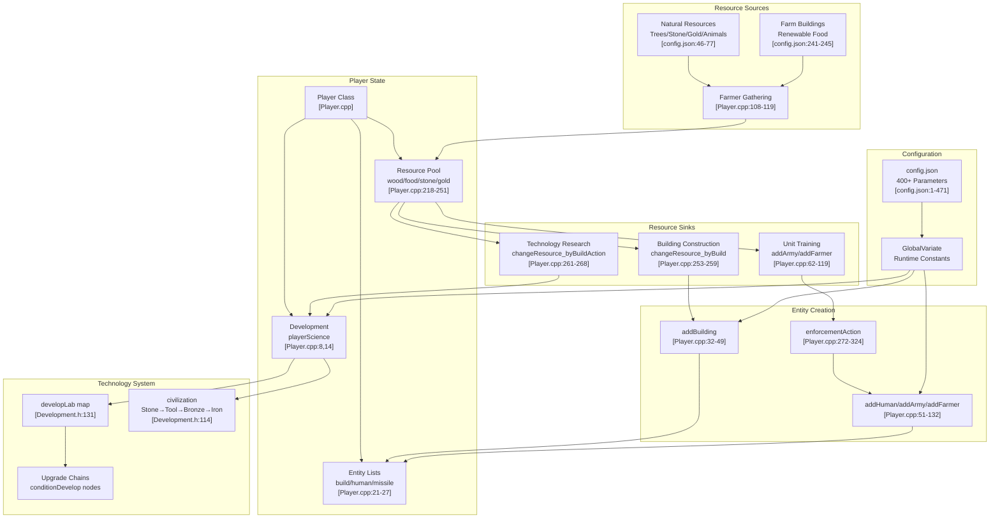
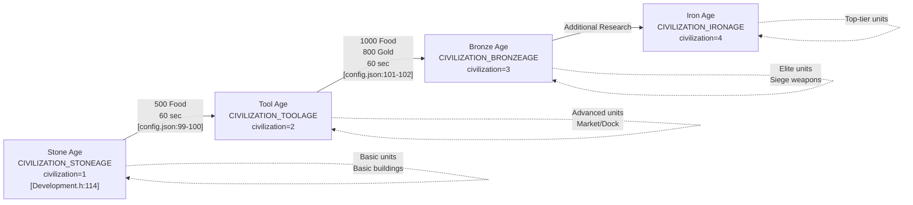
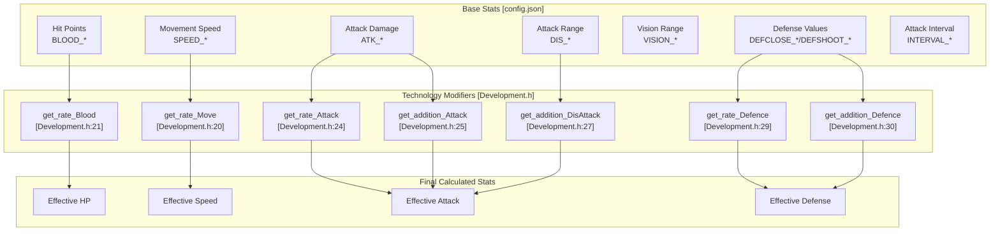
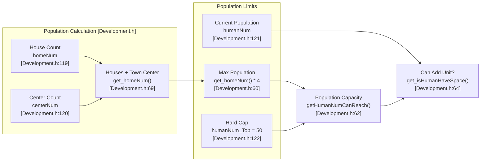
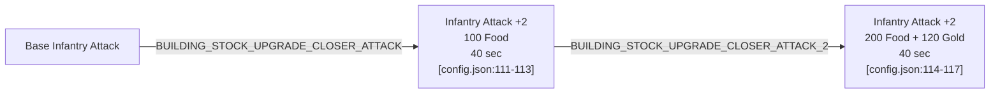
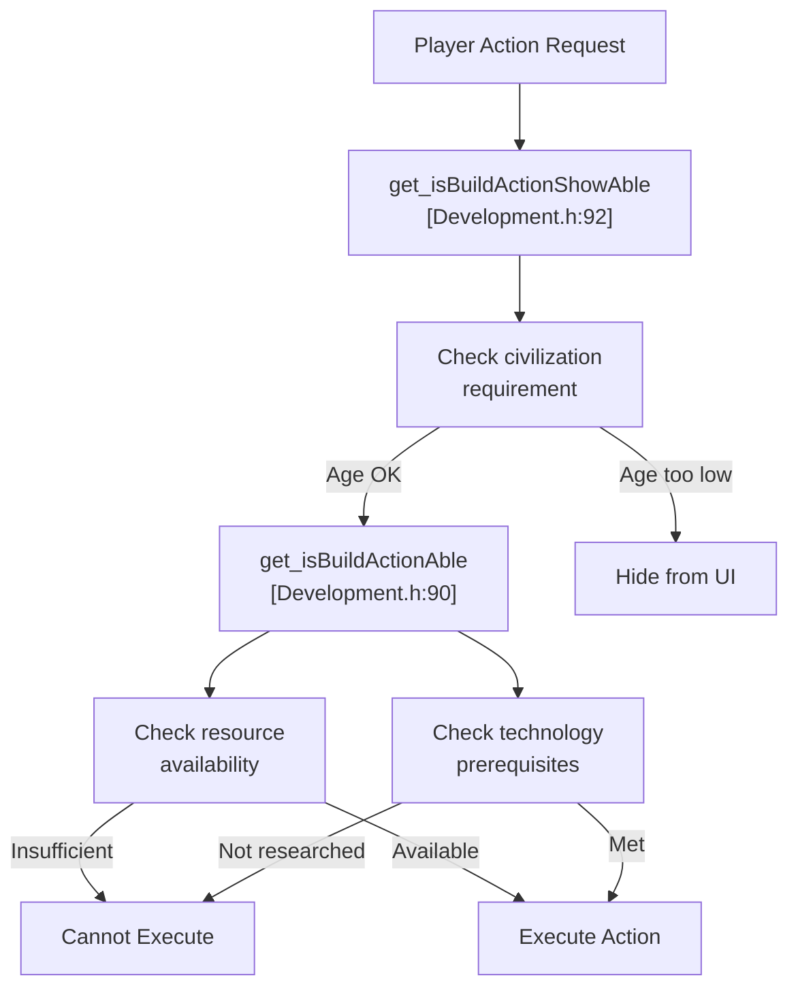
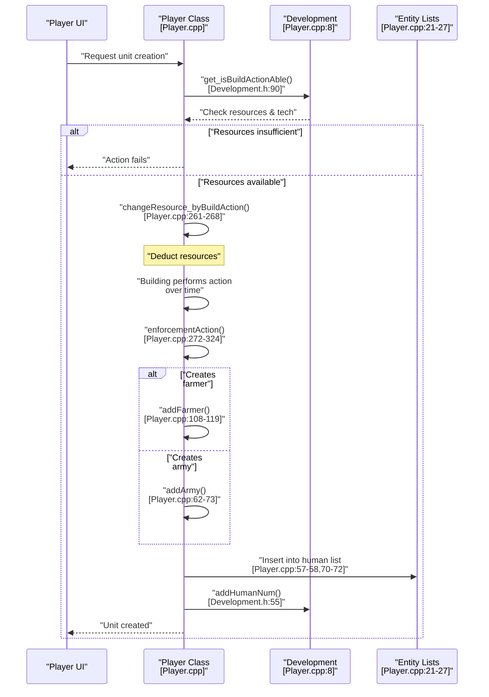

# Game Mechanics

<details>
<summary>Relevant source files</summary>

The following files were used as context for generating this wiki page:

- [Development.h](Development.h)
- [Player.cpp](Player.cpp)
- [config.json](config.json)

</details>


This document provides an overview of the gameplay systems that define the RTS experience in new-aoe. It covers the interconnected mechanics of resource management, technology progression, unit/building properties, and combat resolution. For implementation details of specific subsystems, see:
- Resource gathering and economy flow: [Resource and Economy System](#3.1)
- Technology tree structure and upgrades: [Technology Tree](#3.2)
- Entity lifecycle and stats: [Units and Buildings](#3.3)
- Attack/defense calculations: [Combat System](#3.4)

For the rendering and display of game entities, see [Rendering and Display](#4.3). For AI decision-making based on these mechanics, see [AI Architecture](#5.1).

## Gameplay Overview

The game implements classic RTS mechanics where players gather resources, advance through technological ages, construct buildings, train units, and engage in combat. All mechanics are data-driven through [config.json:1-471](), enabling balance adjustments without recompilation.

The core gameplay loop operates through the `Player` class [Player.cpp:1-358](), which manages:
- Resource pools (wood, food, stone, gold)
- Entity collections (buildings, humans, missiles)
- Technology state via `Development` class [Development.h:1-139]()
- Population limits and housing requirements

## Core Mechanics Architecture



**Sources:** [Player.cpp:1-358](), [Development.h:1-139](), [config.json:1-471]()

## Resource Types

The game uses four primary resource types that fuel all player actions:

| Resource | Primary Sources | Gathering Method | Storage | Key Uses |
|----------|----------------|------------------|---------|----------|
| **Wood** | Trees [config.json:56-57]() | Farmers chop/carry [config.json:60,68]() | Storage Buildings | Building construction, some units |
| **Food** | Gazelles, Bushes, Farms, Fish [config.json:46,74,77,242]() | Farmers hunt/gather/farm [config.json:62,69]() | Granary Buildings | Unit training, age advancement |
| **Stone** | Stone deposits [config.json:75]() | Farmers mine/carry [config.json:63,71]() | Storage Buildings | Defensive structures, advanced buildings |
| **Gold** | Gold ore deposits [config.json:76]() | Farmers mine/carry [config.json:62,70]() | Storage Buildings | Advanced units, technologies |

Resource management is handled through `Player::changeResource()` [Player.cpp:218-251](), which validates and updates the player's resource pool based on gather/spend operations.

### Initial Resources

Players start with:
```
Wood:  200  [config.json:80]
Food:  200  [config.json:81]
Gold:  150  [config.json:82]
Stone: 0    [config.json:83]
```

### Farmer Carry Capacity

Farmers have limited carry capacity that can be upgraded:

| Resource | Base Capacity | Upgraded Capacity | Upgrade Location |
|----------|---------------|-------------------|------------------|
| Wood | 10 [config.json:60]() | 12 [config.json:64]() | Market |
| Food | 10 [config.json:61]() | 13 [config.json:65]() | Market |
| Gold | 10 [config.json:62]() | 15 [config.json:66]() | Market |
| Stone | 10 [config.json:63]() | 13 [config.json:67]() | Market |

### Gather Speed

Base gathering rates (resources per frame):
```
Wood:  0.02  [config.json:68]
Food:  0.02  [config.json:69]
Gold:  0.02  [config.json:70]
Stone: 0.02  [config.json:71]
```

These rates are modified by technology upgrades through `Development::get_rate_ResorceGather()` [Development.h:36]().

**Sources:** [Player.cpp:218-251](), [config.json:60-83](), [Development.h:34-37]()

## Civilization Ages

The technology progression system divides gameplay into distinct ages, each unlocking new buildings, units, and upgrades. Age advancement is managed by the `Development` class:



Age advancement occurs through the Town Center building action and is tracked by `Development::civilization` [Development.h:114](). The `civiChange()` method [Development.h:135]() handles age transitions.

**Sources:** [Development.h:50-52,114,135](), [config.json:99-102]()

## Entity Statistics System

All game entities (units, buildings) have statistics defined in [config.json]() and accessed through the `Development` class. The stat calculation system applies base values plus technology bonuses:

### Stat Categories



**Sources:** [Development.h:19-31](), [config.json:56-470]()

## Unit Type Examples

Sample unit statistics from [config.json]():

### Infantry Units

| Unit | HP | Speed | Attack | Range | Close Def | Shoot Def | Cost |
|------|----|----|--------|-------|-----------|-----------|------|
| Clubman (Tier 1) | 40 [config.json:273]() | 2.44 [config.json:266]() | 3 [config.json:270]() | Melee | 0 [config.json:271]() | 0 [config.json:272]() | 50 Food [config.json:159]() |
| Clubman (Tier 2) | 50 [config.json:274]() | 2.44 [config.json:275]() | 5 [config.json:279]() | Melee | 0 [config.json:280]() | 0 [config.json:281]() | 100 Food (upgrade) [config.json:161]() |
| Short Swordsman (Tier 1) | 150 [config.json:282]() | 2.44 [config.json:283]() | 9 [config.json:287]() | Melee | 1 [config.json:288]() | 0 [config.json:289]() | 35 Food + 15 Gold [config.json:464-465]() |

### Ranged Units

| Unit | HP | Speed | Attack | Range | Defense | Cost | Train Time |
|------|----|----|--------|-------|---------|------|------------|
| Slinger | 25 [config.json:314]() | 2.44 [config.json:315]() | 2 [config.json:319]() | 4 [config.json:317]() | 0/2 [config.json:320-321]() | 40 Food + 10 Stone [config.json:163-164]() | 24 sec [config.json:165]() |
| Bowman | 35 [config.json:322]() | 2.44 [config.json:323]() | 3 [config.json:327]() | 5 [config.json:325]() | 0/0 [config.json:328-329]() | 40 Food + 20 Wood [config.json:170-171]() | 30 sec [config.json:172]() |
| Improved Bowman (Tier 1) | 120 [config.json:330]() | 2.44 [config.json:331]() | 8 [config.json:335]() | 6 [config.json:333]() | 0/0 [config.json:336-337]() | - | - |

### Cavalry Units

| Unit | HP | Speed | Attack | Defense | Cost | Special |
|------|----|----|--------|---------|------|---------|
| Scout | 80 [config.json:346]() | 4.07 [config.json:347]() | 5 [config.json:351]() | 0/0 [config.json:352-353]() | 60 Food [config.json:177]() | High vision: 8 [config.json:348]() |
| Cavalry | 150 [config.json:366]() | 4.07 [config.json:367]() | 8 [config.json:371]() | 0/0 [config.json:372-373]() | 70 Food + 80 Gold [config.json:179-180]() | Fast assault unit |
| Chariot | 120 [config.json:354]() | 3.5 [config.json:355]() | 10 [config.json:357]() | 1/0 [config.json:360-361]() | 40 Food + 60 Wood [config.json:363-364]() | Moderate speed |

**Sources:** [config.json:266-470]()

## Building Mechanics

Buildings serve multiple roles: resource storage, unit production, technology research, and defense. Key building parameters:

### Construction Costs and Times

| Building | HP | Wood Cost | Build Time | Special Properties |
|----------|----|----|------------|-------------------|
| Town Center | 600 [config.json:93]() | 200 [config.json:95]() | 60 sec [config.json:96]() | Creates farmers, age advancement [config.json:97-102]() |
| House | 75 [config.json:103]() | 30 [config.json:105]() | 20 sec [config.json:106]() | +4 population [config.json:43]() |
| Storage Building | 350 [config.json:107]() | 120 [config.json:109]() | 30 sec [config.json:110]() | Resource storage, infantry upgrades [config.json:111-142]() |
| Granary | 350 [config.json:147]() | 120 [config.json:149]() | 30 sec [config.json:150]() | Archer research, wall research [config.json:151-154]() |
| Army Camp | 350 [config.json:155]() | 125 [config.json:157]() | 30 sec [config.json:158]() | Creates clubmen [config.json:159-162]() |
| Archery Range | 350 [config.json:166]() | 150 [config.json:168]() | 40 sec [config.json:169]() | Creates bowmen [config.json:170-172]() |
| Stable | 350 [config.json:173]() | 150 [config.json:175]() | 40 sec [config.json:176]() | Creates cavalry [config.json:177-181]() |
| Market | 350 [config.json:182]() | 150 [config.json:184]() | 40 sec [config.json:185]() | Economic upgrades [config.json:196-240]() |
| Dock | 350 [config.json:186]() | 100 [config.json:188]() | 40 sec [config.json:189]() | Creates ships [config.json:190-195]() |
| Farm | 50 [config.json:241]() | 75 [config.json:244]() | 30 sec [config.json:245]() | Produces 250 food [config.json:242]() |
| Arrow Tower | 125 [config.json:246]() | 150 Stone [config.json:252]() | 80 sec [config.json:253]() | ATK: 3, Range: 7 [config.json:247,250]() |
| Wall | 200 [config.json:254]() | 5 Stone [config.json:256]() | 10 sec [config.json:257]() | Defensive structure |

### Building Action System

Buildings can perform actions (train units, research technologies) through the `Player::enforcementAction()` system [Player.cpp:272-324](). When an action completes:

1. Resources are consumed via `changeResource_byBuildAction()` [Player.cpp:261-268]()
2. Technology state updates via `Development::finishAction()` [Development.h:79-80]()
3. If the action creates units, `enforcementAction()` spawns them at valid adjacent blocks [Player.cpp:295-323]()

**Sources:** [Player.cpp:272-324](), [config.json:93-257](), [Development.h:79-103]()

## Population Management

Population is managed through housing requirements:



Each house provides 4 population slots [config.json:43](). The Town Center counts as one house [Development.h:69](). Population is tracked with:
- `addHumanNum()` / `subHumanNum()` [Development.h:55-56]()
- `addHome()` / `subHome()` [Development.h:70-71]() when houses are built/destroyed

**Sources:** [Development.h:54-72,119-122](), [config.json:43]()

## Technology Upgrade Chains

Technologies are organized as linked upgrade paths in the `developLab` map [Development.h:131](). Each building can perform multiple research actions:

### Example: Infantry Attack Upgrades (Storage Building)



### Example: Resource Gathering Upgrades (Market)

| Technology | Effect | Cost | Time | Bonus |
|-----------|--------|------|------|-------|
| Wood Cutting | Wood +2 carry, +0.2 gather rate, +1 arrow range [config.json:199-201]() | 120 Food + 75 Wood [config.json:196-197]() | 40 sec [config.json:198]() | Affects all farmers |
| Stone Mining | Stone +3 carry, +0.2 gather rate, slinger +1 ATK/range [config.json:216-219]() | 100 Food + 50 Stone [config.json:213-214]() | 60 sec [config.json:215]() | Multi-effect upgrade |
| Gold Mining | Gold +3 carry, +0.2 gather rate [config.json:223-224]() | 120 Food + 100 Wood [config.json:220-221]() | 60 sec [config.json:222]() | Economy boost |
| Farm Upgrade | Farm food +75 [config.json:228]() | 200 Food + 50 Wood [config.json:225-226]() | 60 sec [config.json:227]() | Increases farm yield |

Upgrade bonuses are applied through `Development::get_addition_*()` and `get_rate_*()` methods [Development.h:19-37](), which query the current state of the `developLab` map.

**Sources:** [Development.h:19-37,131](), [config.json:111-240]()

## Combat Parameters

Combat involves attack, defense, and missile mechanics. Key parameters:

### Attack Types and Defense

Units have separate defense values against close combat and ranged attacks:
- **DEFCLOSE**: Defense against melee attacks [config.json:271,280,288,etc.]()
- **DEFSHOOT**: Defense against ranged attacks [config.json:272,281,289,etc.]()

### Missile System

Ranged units create `Missile` objects [Player.cpp:134-153]() with speed parameters:

| Missile Type | Speed | Range | Special |
|-------------|-------|-------|---------|
| Spear | 8.94 [config.json:398]() | - | Lion/Elephant attacks |
| Arrow | 20.12 [config.json:399]() | - | Archer/Bowman projectiles |
| Cobblestone | 20.12 [config.json:400]() | - | Slinger projectiles |
| Boulder | 8.94 [config.json:401]() | 2 AoE [config.json:402]() | Siege weapons, area damage |

Missiles are created via `Player::addMissile()` [Player.cpp:134-153]() and tracked in the `missile` list [Player.cpp:27]().

### Attack Distances

```
Close Combat:     17.89  [config.json:262]
Hit Target:       4.0    [config.json:263]
Elephant Attack:  42.57  [config.json:264]
```

Attack resolution uses these distances to determine when units can engage targets.

**Sources:** [Player.cpp:134-153](), [config.json:262-402]()

## Frame-Based Timing

Many game mechanics use frame-based timing with 25 FPS [config.json:33]():

### Unit Creation Times (in seconds)

| Action | Frames at 25 FPS |
|--------|------------------|
| Create Farmer | 20 sec → 500 frames [config.json:98]() |
| Create Clubman | 26 sec → 650 frames [config.json:160]() |
| Create Bowman | 30 sec → 750 frames [config.json:172]() |
| Create Scout | 30 sec → 750 frames [config.json:178]() |
| Build Town Center | 60 sec → 1500 frames [config.json:96]() |
| Build Arrow Tower | 80 sec → 2000 frames [config.json:253]() |

### Action Intervals

Units have attack intervals that determine how frequently they can attack:

```
Clubman:       1.5 sec  [config.json:269]
Bowman:        1.4 sec  [config.json:326]
Cavalry:       1.5 sec  [config.json:370]
Stone Thrower: 4.2 sec  [config.json:387]
```

These intervals are tracked in frame counts during combat execution.

**Sources:** [config.json:33,96-470]()

## Validation and Constraints

The `Development` class provides validation methods before allowing actions:



The two-phase check (showable → executable) allows the UI to display grayed-out options for unavailable technologies while hiding options that are completely inaccessible in the current age.

**Sources:** [Development.h:85-92]()

## Entity Creation Flow

The complete flow for creating game entities:



**Sources:** [Player.cpp:62-119,261-324](), [Development.h:55,90]()