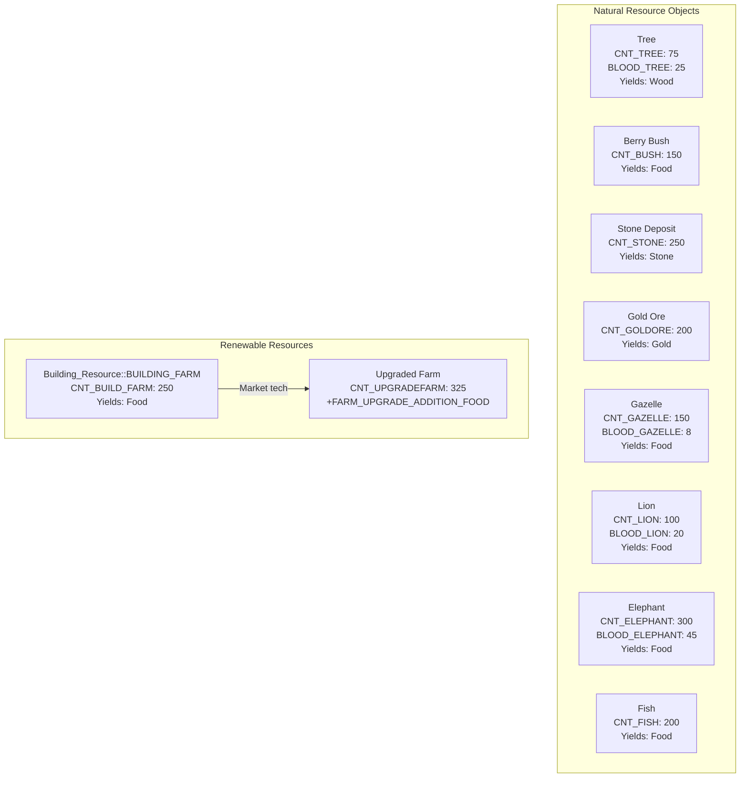
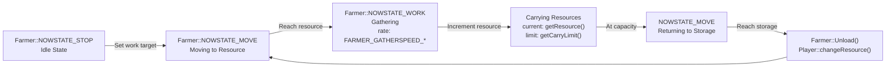
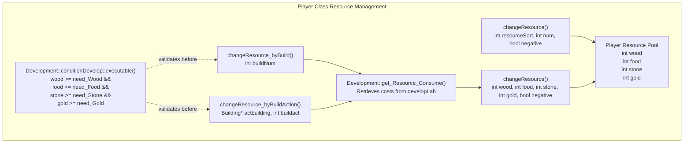
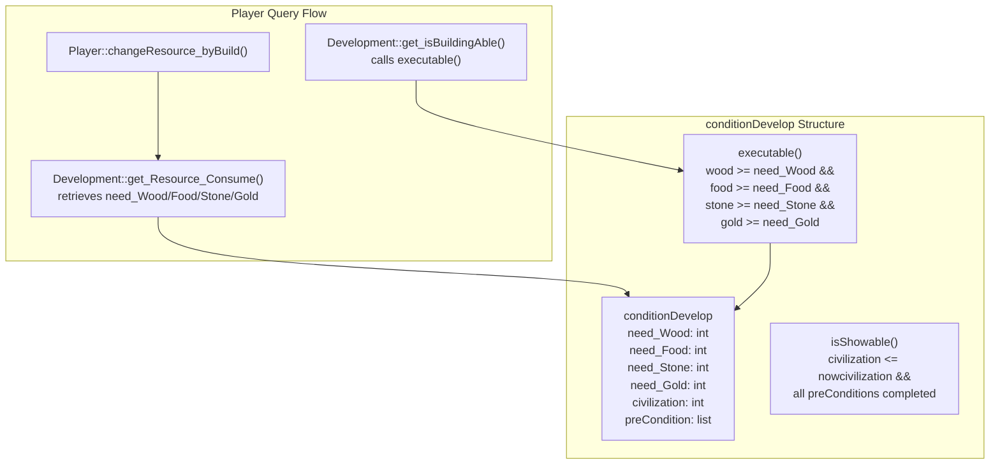
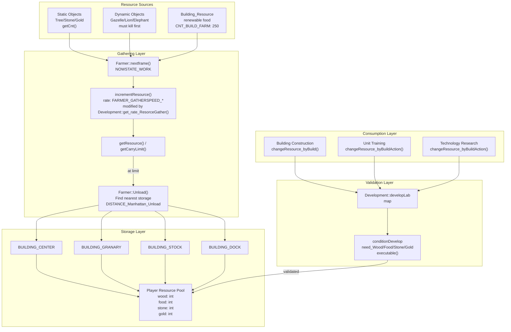

# Resource and Economy System

<details>
<summary>Relevant source files</summary>

The following files were used as context for generating this wiki page:

- [Development.h](Development.h)
- [GlobalVariate.h](GlobalVariate.h)
- [Player.cpp](Player.cpp)
- [config.json](config.json)

</details>


This document describes the resource and economy system, which manages the four primary resource types (wood, meat/food, stone, gold), their gathering, storage, and consumption throughout the game. The system implements a classic RTS economic loop where players collect resources from the map and expend them to construct buildings, train units, and research technologies.

For information about the technology tree and upgrade prerequisites, see [Technology Tree](#3.2). For building and unit mechanics, see [Units and Buildings](#3.3).

---

## Overview

The resource economy is centralized in the `Player` class, which maintains resource pools and validates all expenditures through the `Development` system. Resources flow from natural sources through gathering units (primarily `Farmer` instances) into storage structures, and are consumed by construction, training, and research activities.

**Core Components:**
- **Player Class**: Maintains resource pools (wood, food, stone, gold)
- **Farmer Units**: Gather resources from sources and deposit to storage
- **Building_Resource**: Renewable food sources (farms)
- **Development Class**: Validates resource availability before expenditures
- **config.json**: Defines all costs, gather rates, and initial quantities

Sources: [Player.cpp:1-358](), [Development.h:1-139](), [config.json:1-472](), [GlobalVariate.h:1-1326]()

---

## Resource Types

The game uses four primary resource types, each with distinct sources and uses:

| Resource | Code Constant | Initial Amount | Primary Sources | Primary Uses |
|----------|---------------|----------------|-----------------|--------------|
| **Wood** | `HUMAN_WOOD` | `INITIAL_WOOD` (200) | Trees, cutting | Building construction, unit training |
| **Food/Meat** | `HUMAN_GRANARYFOOD`, `HUMAN_STOCKFOOD`, `HUMAN_DOCKFOOD` | `INITIAL_MEAT` (200) | Animals, berries, farms, fish | Unit training, technology research |
| **Stone** | `HUMAN_STONE` | `INITIAL_STONE` (0) | Stone deposits | Defensive structures, specific upgrades |
| **Gold** | `HUMAN_GOLD` | `INITIAL_GOLD` (150) | Gold ore deposits | Advanced units, age advancement |

**Special Resource Sub-Types:**
- Food has three collection categories based on storage building: granary food (berries), stock food (animals), and dock food (fish)
- All food types are pooled into a single `food` counter in the `Player` class

Sources: [config.json:80-83](), [GlobalVariate.h:17-20](), [Player.cpp:218-241]()

---

## Resource Sources

### Natural Resources

Natural resources are placed on the map as static or dynamic objects with finite quantities:



**Resource Quantities:**
- `CNT_*` constants define the total resource yield per source
- Trees provide 75 wood units each
- Animals must be killed before gathering (have `BLOOD_*` health)
- Farms are constructed and provide renewable food (250 base, 325+ with upgrades)

Sources: [config.json:46-77](), [config.json:211-245]()

---

## Resource Gathering System

### Farmer Gathering Mechanics

The `Farmer` class implements resource gathering through a state machine:



**Gathering Parameters:**

| Parameter | Base Value | Upgraded Value | Config Constant |
|-----------|------------|----------------|-----------------|
| Wood gather speed | 0.02/frame | +0.2 (Cutting tech) | `FARMER_GATHERSPEED_WOOD` |
| Food gather speed | 0.02/frame | - | `FARMER_GATHERSPEED_FOOD` |
| Gold gather speed | 0.02/frame | +0.2 | `FARMER_GATHERSPEED_GOLD` |
| Stone gather speed | 0.02/frame | +0.2 | `FARMER_GATHERSPEED_STONE` |
| Wood carry limit | 10 | 12 | `FARMER_CARRYLIMIT_WOOD`, `FARMER_CARRYLIMIT_UPGRADEWOOD` |
| Food carry limit | 10 | 13 | `FARMER_CARRYLIMIT_FOOD`, `FARMER_CARRYLIMIT_UPGRADEFOOD` |
| Gold carry limit | 10 | 15 | `FARMER_CARRYLIMIT_GOLD`, `FARMER_CARRYLIMIT_UPGRADEGOLD` |
| Stone carry limit | 10 | 13 | `FARMER_CARRYLIMIT_STONE`, `FARMER_CARRYLIMIT_UPGRADESTONE` |
| Construction speed | 0.02/frame | - | `FARMER_CONSTRUCTSPEED` |

**Gather Rate Calculation:**
The `Development` class provides bonus multipliers through `get_rate_ResorceGather()`, which farmers query to determine effective gathering speed.

Sources: [config.json:58-72](), [Development.h:35-36](), [GlobalVariate.h:281-293]()

---

## Resource Storage and Management

### Player Resource Pool

The `Player` class maintains the central resource pool with validation:



**Key Methods:**

- **`changeResource(int resourceSort, int num, bool negative)`** [Player.cpp:218-241]()
  - Modifies a single resource type
  - `negative=true` deducts resources, `false` adds them
  - Uses switch statement on `resourceSort` (HUMAN_WOOD, HUMAN_GOLD, etc.)

- **`changeResource(int wood, int food, int stone, int gold, bool negative)`** [Player.cpp:243-251]()
  - Modifies all four resources simultaneously
  - Used for deposits and multi-resource costs

- **`changeResource_byBuild(int buildNum)`** [Player.cpp:253-259]()
  - Deducts resources for constructing a building
  - Queries `Development::get_Resource_Consume()` for costs
  - Always deducts (negative=true)

- **`changeResource_byBuildAction(Building* actbuilding, int buildact)`** [Player.cpp:261-268]()
  - Deducts resources for building actions (unit training, research)
  - Stores costs in building's `Resource_TS` for refund on cancellation
  - Calls `Building::set_Resource_TS()` to track expenditure

Sources: [Player.cpp:218-268](), [Development.h:94-97]()

### Storage Buildings

Storage buildings are required for farmers to deposit resources:

| Building | Type Constant | Purpose |
|----------|---------------|---------|
| Town Center | `BUILDING_CENTER` | Primary storage for all resources |
| Granary | `BUILDING_GRANARY` | Food storage |
| Storage Pit | `BUILDING_STOCK` | General resource storage |
| Dock | `BUILDING_DOCK` | Fish storage |

Farmers automatically find the nearest storage building within `DISTANCE_Manhattan_Unload` (42.93 units) when their inventory is full.

Sources: [config.json:258-261](), [Player.cpp:108-132]()

---

## Resource Consumption

### Building Construction Costs

Buildings are created through `Player::addBuilding()` [Player.cpp:32-49]() with costs validated by `Development`:

```mermaid
graph LR
    REQUEST["UI: Build Request<br/>buildingNum"]
    VALIDATE["Development::get_isBuildingAble()<br/>checks resources"]
    DEDUCT["Player::changeResource_byBuild()<br/>deducts cost"]
    CREATE["Player::addBuilding()<br/>creates Building instance"]
    CONSTRUCT["Building construction<br/>percent increases over time"]
    FINISH["Player::finishBuild()<br/>Development::finishAction()"]
    
    REQUEST --> VALIDATE
    VALIDATE -->|"sufficient"| DEDUCT
    DEDUCT --> CREATE
    CREATE --> CONSTRUCT
    CONSTRUCT -->|"percent >= 100"| FINISH
```



**Example Building Costs (from config.json):**

| Building | Wood | Food | Stone | Gold | Build Time |
|----------|------|------|-------|------|------------|
| Town Center | 200 | - | - | - | 60s |
| House | 30 | - | - | - | 20s |
| Storage Pit | 120 | - | - | - | 30s |
| Barracks | 125 | - | - | - | 30s |
| Farm | 75 | - | - | - | 30s |
| Arrow Tower | - | - | 150 | - | 80s |
| Market | 150 | - | - | - | 40s |

Sources: [config.json:95-257](), [Player.cpp:253-259]()

### Unit Training Costs

Units are trained through building actions with costs defined in `conditionDevelop` structures:

**Example Unit Costs:**

| Unit | Building | Food | Wood | Stone | Gold | Train Time |
|------|----------|------|------|-------|------|------------|
| Farmer | Town Center | 50 | - | - | - | 20s |
| Clubman | Barracks | 50 | - | - | - | 26s |
| Bowman | Archery Range | 40 | 20 | - | - | 30s |
| Slinger | Barracks | 40 | - | 10 | - | 24s |
| Scout | Stable | 60 | - | - | - | 30s |
| Cavalry | Stable | 70 | - | - | 80 | 30s |
| Stone Thrower | Siege Workshop | - | 180 | - | 80 | 30s |
| War Ship | Dock | - | 135 | - | - | 30s |

Sources: [config.json:97-212](), [Player.cpp:261-268]()

### Technology Research Costs

Technologies are researched through building actions with escalating costs:

**Example Technology Costs:**

| Technology | Building | Food | Wood | Stone | Gold | Research Time |
|------------|----------|------|------|-------|------|---------------|
| Tool Age | Town Center | 500 | - | - | - | 60s |
| Bronze Age | Town Center | 1000 | - | - | 800 | 60s |
| Infantry Attack +2 | Storage Pit | 100 | - | - | - | 40s |
| Infantry Defense +2 | Storage Pit | 75 | - | - | - | 40s |
| Archer Defense +2 | Storage Pit | 100 | - | - | - | 40s |
| Wood Cutting | Market | 120 | 75 | - | - | 40s |
| Stone Mining | Market | 100 | - | 50 | - | 60s |
| Gold Mining | Market | 120 | 100 | - | - | 60s |
| Domestication | Market | 200 | 50 | - | - | 60s |
| Wheel | Market | 150 | 100 | - | - | 40s |
| Craftsmanship | Market | 170 | 150 | - | - | 40s |
| Plow | Market | 250 | 75 | - | - | 40s |

**Resource Refunds:**
When a building action (unit training or research) is manually cancelled, resources are refunded via `Player::back_Resource_TS()` [Player.cpp:326-333](), which retrieves the stored cost from `Building::get_Resouce_TS()`.

Sources: [config.json:99-240](), [Player.cpp:326-333]()

---

## Resource Validation and Tech Tree Integration

The `Development` class enforces resource constraints through the `conditionDevelop` system:



**Validation Process:**

1. **Display Validation**: `Development::get_isBuildActionShowAble()` [Development.h:92]() checks if action should appear in UI
   - Verifies civilization age requirement
   - Checks all prerequisite technologies completed
   
2. **Execution Validation**: `Development::get_isBuildActionAble()` [Development.h:90]() checks if action can execute
   - Calls `isShowAble()` first
   - Then calls `conditionDevelop::executable()` [GlobalVariate.h:1160]() to verify resources
   
3. **Resource Deduction**: `Player::changeResource_byBuildAction()` [Player.cpp:261-268]()
   - Retrieves costs via `Development::get_Resource_Consume()`
   - Stores costs in building for potential refund
   - Deducts from player pool

Sources: [GlobalVariate.h:1106-1189](), [Development.h:87-103](), [Player.cpp:253-268]()

---

## Resource Flow Architecture

### Complete Economic Cycle



**Key Flow Points:**

1. **Gathering**: Farmers gather at `FARMER_GATHERSPEED_*` per frame, modified by tech bonuses
2. **Carrying**: Resources accumulate in farmer's inventory up to `FARMER_CARRYLIMIT_*`
3. **Depositing**: When at capacity, farmer moves to nearest storage and calls `Unload()`
4. **Pooling**: `Player::changeResource()` adds resources to central pool
5. **Validation**: All expenditures validate through `Development::conditionDevelop::executable()`
6. **Consumption**: Resources deducted via `changeResource_byBuild()` or `changeResource_byBuildAction()`

Sources: [Player.cpp:218-268](), [config.json:58-240](), [Development.h:87-103]()

---

## Configuration Parameters

All resource-related parameters are data-driven through `config.json` and loaded into global variables via `ReadConfig()`:

### Initial Resources

Defined in [config.json:80-83]():
```json
"INITIAL_WOOD": 200,
"INITIAL_MEAT": 200,
"INITIAL_GOLD": 150,
"INITIAL_STONE": 0
```

Declared in [GlobalVariate.h:17-20]():
```cpp
extern int INITIAL_WOOD;
extern int INITIAL_MEAT;
extern int INITIAL_GOLD;
extern int INITIAL_STONE;
```

### Gather Rates and Limits

Base gathering configured in [config.json:60-72]():
```json
"FARMER_CARRYLIMIT_WOOD": 10,
"FARMER_CARRYLIMIT_FOOD": 10,
"FARMER_CARRYLIMIT_GOLD": 10,
"FARMER_CARRYLIMIT_STONE": 10,
"FARMER_GATHERSPEED_WOOD": 0.02,
"FARMER_GATHERSPEED_FOOD": 0.02,
"FARMER_GATHERSPEED_GOLD": 0.02,
"FARMER_GATHERSPEED_STONE": 0.02,
"FARMER_CONSTRUCTSPEED": 0.02
```

Upgraded values in [config.json:64-67]():
```json
"FARMER_CARRYLIMIT_UPGRADEWOOD": 12,
"FARMER_CARRYLIMIT_UPGRADEFOOD": 13,
"FARMER_CARRYLIMIT_UPGRADEGOLD": 15,
"FARMER_CARRYLIMIT_UPGRADESTONE": 13
```

### Resource Source Quantities

Natural resource counts in [config.json:46-77]():
```json
"CNT_TREE": 75,
"CNT_BUSH": 150,
"CNT_STONE": 250,
"CNT_GOLDORE": 200,
"CNT_GAZELLE": 150,
"CNT_LION": 100,
"CNT_ELEPHANT": 300,
"CNT_FISH": 200,
"CNT_BUILD_FARM": 250,
"CNT_UPGRADEFARM": 325
```

### Cost Constants Pattern

Building costs follow naming pattern `BUILD_<BUILDINGNAME>_<RESOURCE>`:
- `BUILD_CENTER_WOOD`: 200
- `BUILD_HOUSE_WOOD`: 30
- `BUILD_ARROWTOWER_STONE`: 150

Unit training follows `BUILDING_<BUILDING>_CREATE_<UNIT>_<RESOURCE>`:
- `BUILDING_CENTER_CREATEFARMER_FOOD`: 50
- `BUILDING_ARMYCAMP_CREATE_CLUBMAN_FOOD`: 50
- `BUILDING_STABLE_CREATE_CAVALRY_GOLD`: 80

Research follows `BUILDING_<BUILDING>_UPGRADE_<TECH>_<RESOURCE>`:
- `BUILDING_CENTER_UPGRADE_TOOLAGE_FOOD`: 500
- `BUILDING_STOCK_UPGRADE_CLOSER_ATTACK_FOOD`: 100

Time constants follow `TIME_BUILD_<NAME>` or `TIME_BUILDING_<BUILDING>_<ACTION>`:
- `TIME_BUILD_CENTER`: 60 (seconds)
- `TIME_BUILDING_CENTER_CREATEFARMER`: 20 (seconds)

Sources: [config.json:1-472](), [GlobalVariate.h:17-228]()

---

## Summary

The resource economy system implements a tightly coupled architecture where:

1. **Player** maintains the authoritative resource pool
2. **Farmer** units gather from sources and deposit to storage
3. **Development** validates all expenditures against tech tree prerequisites
4. **conditionDevelop** structures define costs and prerequisites
5. **config.json** provides complete data-driven configuration

All resource modifications flow through `Player::changeResource()` methods, ensuring centralized tracking. The `Development` class acts as a gatekeeper, preventing illegal expenditures based on civilization age, prerequisite completion, and resource availability. This design enables the AI system to query current resources via `tagInfo` structures while maintaining game state integrity.

Sources: [Player.cpp:1-358](), [Development.h:1-139](), [GlobalVariate.h:1-1326](), [config.json:1-472]()