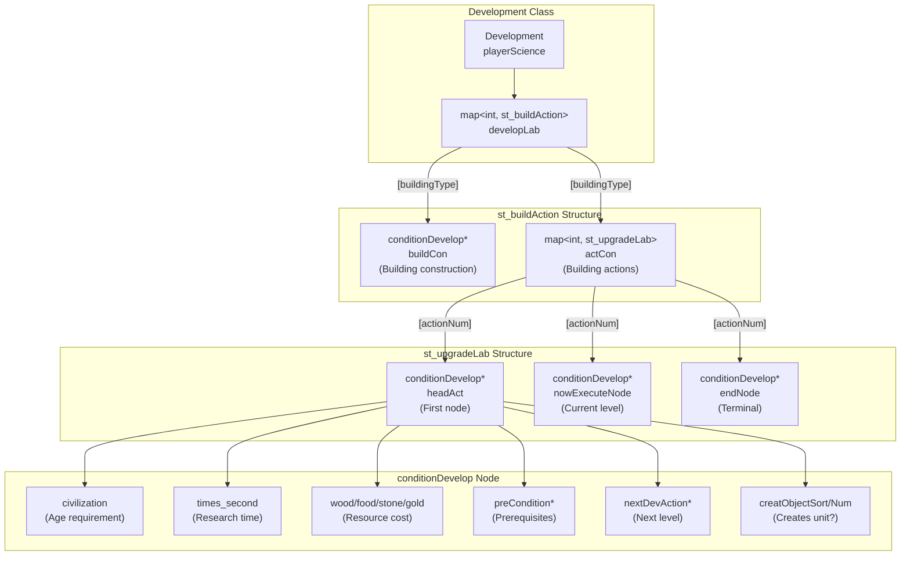
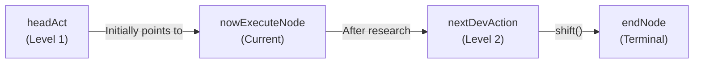
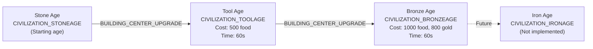
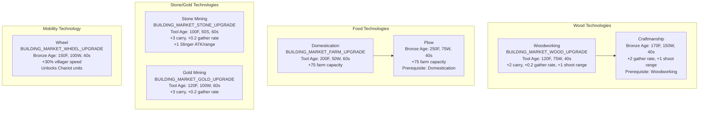
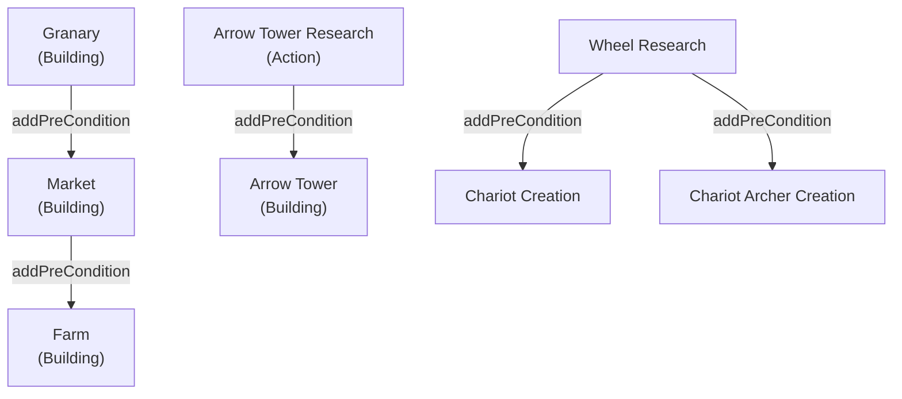
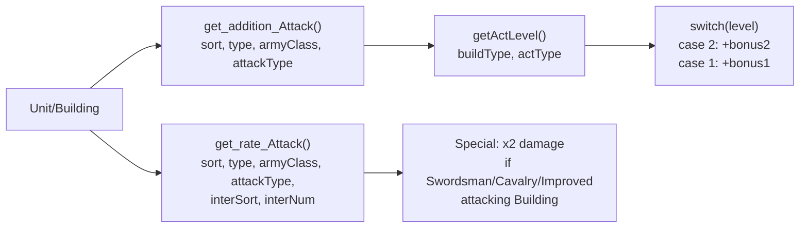
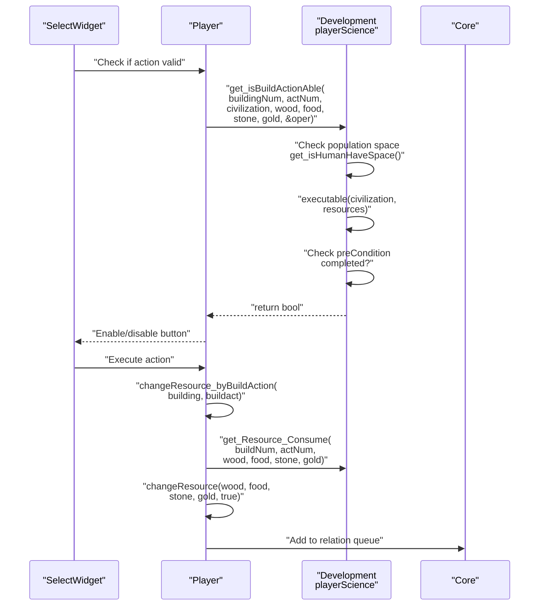
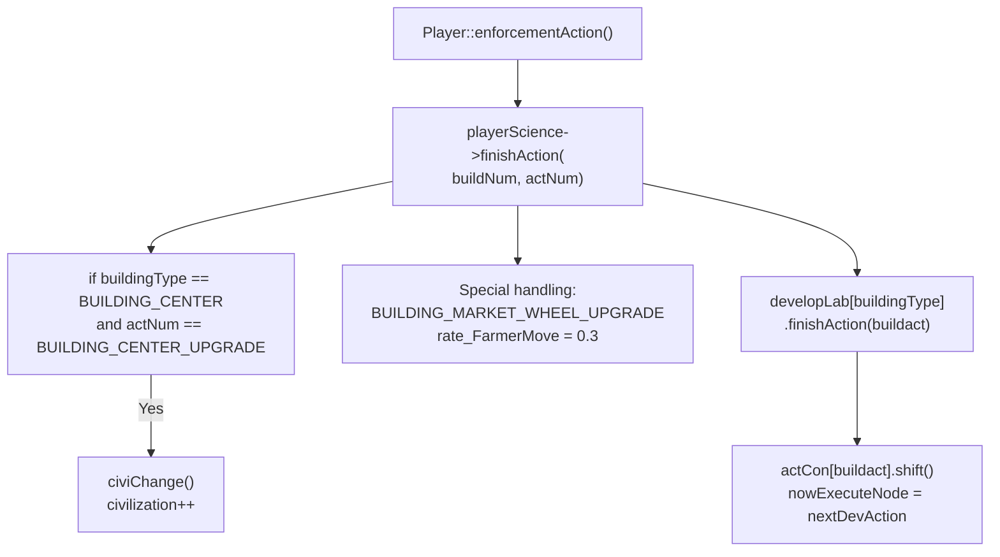
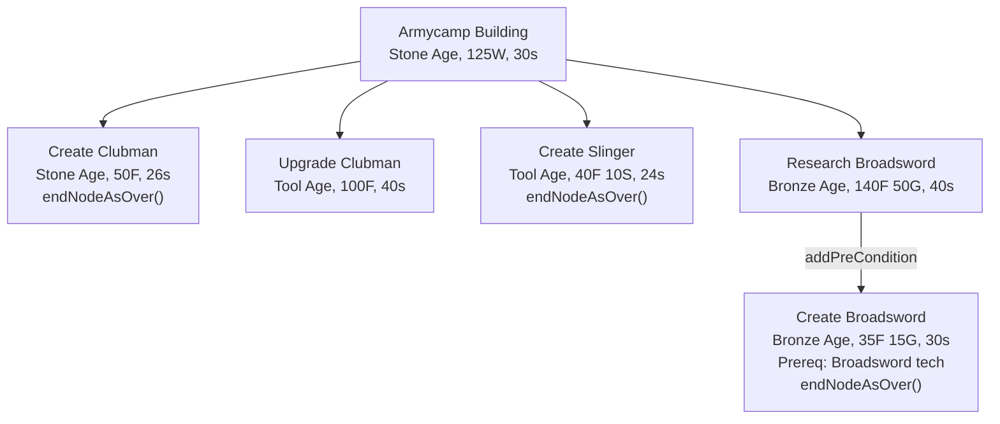

# Technology Tree

<details>
<summary>Relevant source files</summary>

The following files were used as context for generating this wiki page:

- [Development.cpp](Development.cpp)
- [Development.h](Development.h)
- [Player.cpp](Player.cpp)
- [config.json](config.json)

</details>


The technology tree system manages research progression, civilization age advancement, and stat bonuses. The `Development` class maintains a linked-list structure of technology nodes (`conditionDevelop`) that enforce prerequisites, resource costs, and civilization age requirements. This system integrates with the resource economy (see [3.1](#3.1)) and affects unit/building statistics (see [3.3](#3.3)).

---

## Core Data Structures

The technology tree is implemented using three nested data structures that form a hierarchical relationship:



**Sources:** [Development.h:1-139](), [Development.cpp:1-694]()

### conditionDevelop Node

Each technology is represented by a `conditionDevelop` node containing:

| Field | Type | Purpose |
|-------|------|---------|
| `civilization` | int | Minimum age required (CIVILIZATION_STONEAGE/TOOLAGE/BRONZEAGE/IRONAGE) |
| `times_second` | double | Research duration in seconds |
| `wood`, `food`, `stone`, `gold` | int | Resource costs |
| `preCondition` | conditionDevelop* | Required prerequisite technology |
| `nextDevAction` | conditionDevelop* | Next upgrade level in chain |
| `creatObjectSort`, `creatObjectNum` | int | Unit type to create (if applicable) |

**Sources:** [Development.cpp:393-693]()

### st_upgradeLab Chain

Manages multi-level upgrades (e.g., level 1 and level 2 armor):



The `nowExecuteNode` pointer advances via `shift()` when research completes, enabling the next level. The `getPhaseTimes()` method returns the current upgrade level.

**Sources:** [Development.cpp:326-336](), [Development.h:106-107]()

---

## Civilization Age Progression

### Age Advancement Mechanism

Players advance through four ages via the Town Center upgrade action:



Age advancement is handled in [Development.cpp:327-328](), which increments the `civilization` variable via `civiChange()` at [Development.cpp:360-365](). The sound "Age_Level_Up" plays for the player.

**Sources:** [Development.cpp:407-413](), [config.json:99-102]()

### Age-Gated Technologies

Each `conditionDevelop` node specifies its minimum age. The `isShowable(civilization)` method checks visibility:

| Age | Unlocked Buildings | Unlocked Units | Unlocked Upgrades |
|-----|-------------------|----------------|-------------------|
| **Stone Age** | Center, House, Stock, Granary, Armycamp, Dock | Farmer, Clubman, Sailing | None |
| **Tool Age** | Market, Range, Stable, Farm, Arrow Tower | Bowman, Scout, Slinger, Wood Boat, Ship | Infantry/Archer/Cavalry Armor Lv1, Close Attack Lv1, Resource Gathering Upgrades |
| **Bronze Age** | Siege Workshop, Academy | Cavalry, Chariot, Chariot Archer, Composite Bowman, Hoplite, Stone Thrower, Broad Swordsman | Armor Lv2, Close Attack Lv2, Bronze Shield, Composite Bow, Wheel, Craft, Plow |

**Sources:** [Development.cpp:393-693]()

---

## Technology Categories

### Economic Technologies

Economic upgrades are researched at the Market building:



The gather rate bonuses are applied in [Development.cpp:247-287]() via `get_rate_ResorceGather()`. Carry capacity bonuses are applied in [Development.cpp:208-245]() via `get_addition_ResourceSort()`.

**Sources:** [Development.cpp:514-573](), [config.json:196-240]()

### Military Technologies

Military upgrades are split across multiple buildings:

#### Stock Building (Armor & Attack)

```mermaid
graph TD
    subgraph "Infantry Armor"
        INF1["Leather Armor Infantry<br/>BUILDING_STOCK_UPGRADE_DEFENSE_INFANTRY<br/>Tool Age: 75F, +2 armor"]
        INF2["Scale Armor Infantry<br/>Bronze Age: 100F, 50G, +2 armor"]
        INF1 --> INF2
    end
    
    subgraph "Archer Armor"
        ARCH1["Leather Armor Archer<br/>Tool Age: 100F, +2 armor"]
        ARCH2["Scale Armor Archer<br/>Bronze Age: 125F, 50G, +2 armor"]
        ARCH1 --> ARCH2
    end
    
    subgraph "Cavalry Armor"
        CAV1["Leather Armor Cavalry<br/>Tool Age: 125F, +2 armor"]
        CAV2["Scale Armor Cavalry<br/>Bronze Age: 150F, 50G, +2 armor"]
        CAV1 --> CAV2
    end
    
    subgraph "Close Combat Attack"
        ATK1["Toolworking<br/>Tool Age: 100F, +2 ATK"]
        ATK2["Metalworking<br/>Bronze Age: 200F, 120G, +2 ATK"]
        ATK1 --> ATK2
    end
    
    subgraph "Missile Defense"
        SHIELD["Bronze Shield<br/>Bronze Age: 150F, 80G<br/>+1 infantry missile defense"]
    end
```



Defense bonuses are calculated in [Development.cpp:142-204]() via `get_addition_Defence()`, checking `getActLevel()` to sum bonuses from all completed upgrade levels.

**Sources:** [Development.cpp:422-461](), [config.json:111-128]()

#### Range Building (Archer Technologies)

The Range building provides the Composite Bow technology, which unlocks the Composite Bowman unit:

```
Composite Bow (Bronze Age, 180F 100W, 40s)
  └─> Enables Composite Bowman creation (40F 20G per unit)
```

**Sources:** [Development.cpp:627-640](), [config.json:449-454]()

---

## Prerequisites and Dependencies

### Prerequisite Chains

Technologies can require other technologies via `addPreCondition()`:



The `executable()` method at validation time checks:
1. Current civilization age >= required age
2. Sufficient resources (wood/food/stone/gold)
3. All `preCondition` nodes are completed

**Sources:** [Development.cpp:515-517](), [Development.cpp:546-551](), [Development.cpp:587-593]()

### Building Prerequisites

Building construction also enforces prerequisites:

| Building | Prerequisite Building | Prerequisite Technology |
|----------|----------------------|-------------------------|
| Market | Granary | None |
| Farm | Market | None |
| Range | Armycamp | None |
| Stable | Armycamp | None |
| Arrow Tower | None | Arrow Tower Research (at Granary) |

**Sources:** [Development.cpp:515-517](), [Development.cpp:646-650]()

---

## Stat Modifier System

The `Development` class provides query methods that calculate cumulative bonuses from completed technologies:

### Attack Modifiers



Attack bonuses are implemented in [Development.cpp:55-92]():
- Close combat units get +2/+4 ATK from Toolworking/Metalworking
- Slingers get +1 ATK from Stone Mining
- Arrow Towers get +4 ATK from Arrow Tower upgrade
- Buildings take 2x damage from Swordsmen, Cavalry, and Improved Bowmen

**Sources:** [Development.cpp:40-92]()

### Defense Modifiers

Defense calculation at [Development.cpp:142-204]() applies cumulative bonuses:

```cpp
// Example: Level 2 Infantry Armor
level = getActLevel(BUILDING_STOCK, BUILDING_STOCK_UPGRADE_DEFENSE_INFANTRY);
switch (level) {
    case 2:
        addition += BUILDING_STOCK_UPGRADE_DEFENSE_INFANTRY_2_ADDITION_DEFENSE_INFANTRY; // +2
    case 1:
        addition += BUILDING_STOCK_UPGRADE_DEFENSE_INFANTRY_ADDITION_DEFENSE_INFANTRY; // +2
    // Total: +4 defense
}
```

Note the intentional fall-through in the switch statement to sum all upgrade levels.

**Sources:** [Development.cpp:142-204]()

### Gather Rate Modifiers

Resource gathering multipliers are applied in [Development.cpp:247-287]():

| Technology | Wood | Food | Stone | Gold |
|-----------|------|------|-------|------|
| Base | 1.0x | 1.0x | 1.0x | 1.0x |
| Woodworking | 1.2x | - | - | - |
| Craftmanship | 3.0x | - | - | - |
| Domestication | - | - | - | - |
| Plow | - | - | - | - |
| Stone Mining | - | - | 1.2x | - |
| Gold Mining | - | - | - | 1.2x |

Farm capacity increases (+75 per level) are handled separately in [Development.cpp:290-311]() via `get_addition_MaxCnt()`.

**Sources:** [Development.cpp:247-287](), [config.json:196-240]()

---

## Integration with Player System

### Resource Validation Flow



The validation at [Development.cpp:338-347]() checks:
1. If action creates a unit, verify population space via `get_isHumanHaveSpace()`
2. Call `developLab[buildingNum].actCon[actNum].executable()` to verify age and resources
3. Return error code in `oper` pointer if population is full (sets to 1)

**Sources:** [Development.cpp:338-347](), [Player.cpp:253-268]()

### Technology Completion

When a building action finishes, the system updates the technology tree:



The Wheel upgrade is special-cased at [Development.cpp:329-333]() to set `rate_FarmerMove = 0.3`, which is queried by `get_rate_Move()` at [Development.cpp:13-19]().

**Sources:** [Development.cpp:325-336](), [Player.cpp:272-324]()

### Population Management

The Development class tracks population limits:

```cpp
// Population capacity formula
int getMaxHumanNum() { return get_homeNum() * HOUSE_HUMAN_NUM; }
int get_homeNum() { return (int)(centerNum > 0) + homeNum; }

// Effective limit (capped at 50)
int getHumanNumCanReach() { 
    return getMaxHumanNum() < humanNum_Top ? 
           getMaxHumanNum() : humanNum_Top; 
}
```

Houses provide 4 population (HOUSE_HUMAN_NUM). The Town Center acts as 1 house. Houses are tracked via `addHome()`/`subHome()` calls from [Player.cpp:336-345]().

**Sources:** [Development.h:54-72](), [Player.cpp:189-197](), [config.json:43]()

---

## Technology Tree Initialization

The complete technology tree is built in `init_DevelopLab()` at [Development.cpp:391-693](). Each building and action is configured:

### Initialization Pattern

```cpp
// Building construction node
developLab[BUILDING_TYPE].buildCon = 
    new conditionDevelop(age, buildingNum, time, wood, food, stone, gold);

// Action/upgrade node
newNode = new conditionDevelop(age, buildingNum, time, wood, food, stone, gold);
newNode->addPreCondition(prerequisiteNode);
newNode->setCreatObjectAfterAction(SORT_ARMY, AT_UNIT_TYPE);
developLab[BUILDING_TYPE].actCon[ACTION_NUM].setHead(newNode);

// Multi-level upgrade
newNode2 = new conditionDevelop(higherAge, buildingNum, time, ...);
developLab[BUILDING_TYPE].actCon[ACTION_NUM].push_back(newNode2);
```

### Example: Armycamp Technology Chain



The Broadsword creation at [Development.cpp:503-509]() demonstrates prerequisite linking: the action node calls `addPreCondition()` to point to the Broadsword research node, preventing unit creation until the technology completes.

**Sources:** [Development.cpp:479-511]()

---

## Complete Technology Reference

### Stone Age Technologies

| Building | Action | Creates | Cost | Time | Notes |
|----------|--------|---------|------|------|-------|
| Center | Create Farmer | Farmer | 50F | 20s | Repeatable |
| Armycamp | Create Clubman | Clubman | 50F | 26s | Repeatable |
| Dock | Create Sailing | Sailing Boat | 60W | 30s | Repeatable |

### Tool Age Technologies

| Building | Action | Creates | Cost | Time | Prerequisite |
|----------|--------|---------|------|------|--------------|
| Center | Advance to Tool Age | - | 500F | 60s | 2 Stone Age buildings |
| Granary | Research Arrow Tower | - | 50F | 10s | None |
| Stock | Infantry Armor Lv1 | - | 75F | 40s | None |
| Stock | Archer Armor Lv1 | - | 100F | 40s | None |
| Stock | Cavalry Armor Lv1 | - | 125F | 30s | None |
| Stock | Close Attack Lv1 | - | 100F | 40s | None |
| Market | Woodworking | - | 75W, 120F | 40s | Granary built |
| Market | Stone Mining | - | 50S, 100F | 60s | Granary built |
| Market | Gold Mining | - | 100W, 120F | 60s | Granary built |
| Market | Domestication | - | 50W, 200F | 60s | Granary built |
| Range | Create Bowman | Bowman | 20W, 40F | 30s | Armycamp built |
| Stable | Create Scout | Scout | 60F | 30s | Armycamp built |
| Armycamp | Upgrade Clubman | - | 100F | 40s | None |
| Armycamp | Create Slinger | Slinger | 10S, 40F | 24s | None |
| Dock | Create Wood Boat | Fishing Boat | 150W | 30s | None |
| Dock | Create Ship | Warship | 135W | 30s | None |

### Bronze Age Technologies

| Building | Action | Creates | Cost | Time | Prerequisite |
|----------|--------|---------|------|------|--------------|
| Center | Advance to Bronze Age | - | 1000F, 800G | 60s | Tool Age |
| Stock | Infantry Armor Lv2 | - | 100F, 50G | 40s | Lv1 |
| Stock | Archer Armor Lv2 | - | 125F, 50G | 40s | Lv1 |
| Stock | Cavalry Armor Lv2 | - | 150F, 50G | 30s | Lv1 |
| Stock | Close Attack Lv2 | - | 200F, 120G | 40s | Lv1 |
| Stock | Bronze Shield | - | 150F, 80G | 40s | None |
| Granary | Upgrade Arrow Tower | - | 120F, 50S | 40s | None |
| Market | Wheel | - | 150F, 100W | 40s | None |
| Market | Craftmanship | - | 170F, 150W | 40s | Woodworking |
| Market | Plow | - | 250F, 75W | 40s | Domestication |
| Range | Research Composite Bow | - | 180F, 100W | 40s | None |
| Range | Create Composite Bowman | Composite Bowman | 40F, 20G | 30s | Composite Bow |
| Range | Create Chariot Archer | Chariot Archer | 40F, 70W | 30s | Wheel |
| Stable | Create Chariot | Chariot | 40F, 60W | 30s | Wheel |
| Stable | Create Cavalry | Cavalry | 70F, 80G | 30s | None |
| Armycamp | Research Broadsword | - | 140F, 50G | 40s | None |
| Armycamp | Create Broadsword | Broad Swordsman | 35F, 15G | 30s | Broadsword Research |
| Siege | Create Stone Thrower | Stone Thrower | 180W, 80G | 30s | None |
| Academy | Create Hoplite | Hoplite | 60F, 40G | 30s | None |

**Sources:** [Development.cpp:391-693](), [config.json:1-471]()