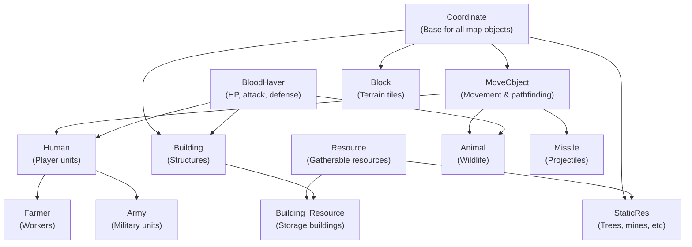
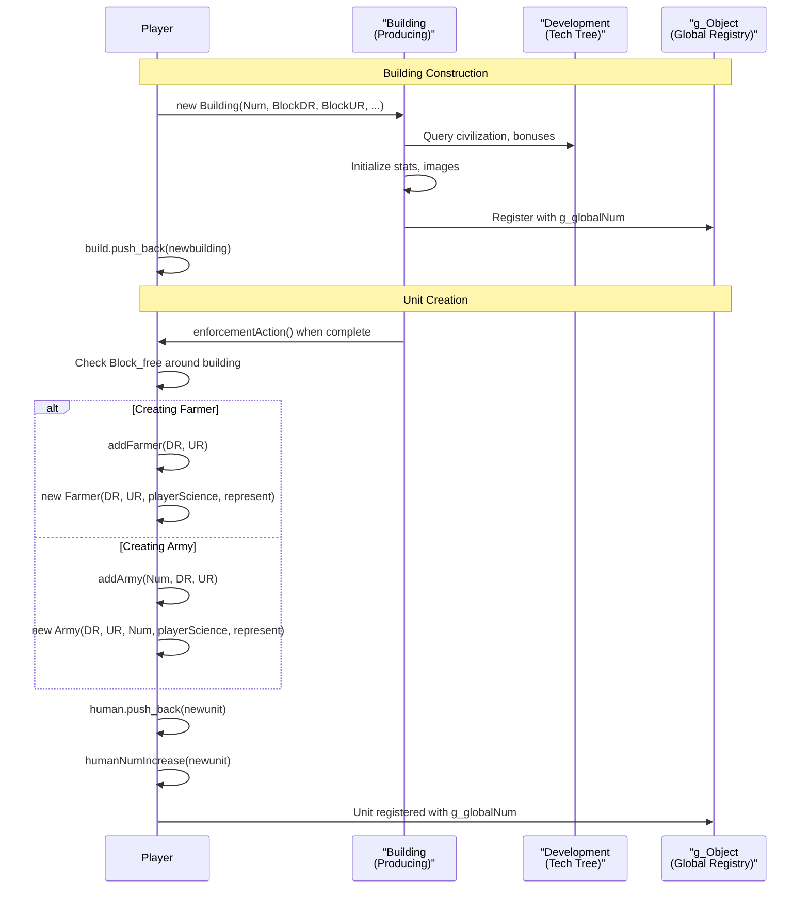
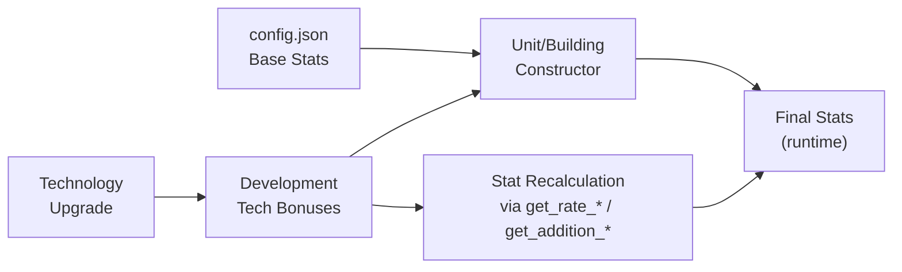

# Units and Buildings

<details>
<summary>Relevant source files</summary>

The following files were used as context for generating this wiki page:

- [Development.h](Development.h)
- [GlobalVariate.h](GlobalVariate.h)
- [Player.cpp](Player.cpp)
- [README.md](README.md)
- [config.json](config.json)

</details>


This page documents the entity system that implements units and buildings in the game. It covers the class hierarchy, unit types (farmers, armies, ships), building types, creation/deletion lifecycle, and the stat calculation system that combines base values with technology bonuses.

For information about how the technology tree affects unit stats, see [Technology Tree](#3.2). For details on combat mechanics and damage calculation, see [Combat System](#3.4). For the Player class that manages collections of units and buildings, see [Resource and Economy System](#3.1).

---

## Entity Class Hierarchy

All game objects that can be placed on the map inherit from a common class hierarchy. The system uses multiple inheritance to compose different capabilities.

**Class Inheritance Diagram**



**Sources:** [Coordinate.h](), [MoveObject.h](), [Bloodhaver.h](), [Human.h](), [Farmer.h](), [Army.h](), [Building.h](), [Building_Resource.h](), [StaticRes.h](), [Animal.h](), [Missile.h](), [Block.h](), [Resource.h]()

---

## Base Classes

### Coordinate

The root base class for all objects on the map. Defines common interface for rendering, vision, actions, and lifecycle.

**Key Methods:**
- `virtual int getSort()` - Returns object category (SORT_FARMER, SORT_ARMY, SORT_BUILDING, etc.)
- `virtual void nextframe()` - Called each frame to update object state
- `virtual int getVision()` - Returns vision range in blocks
- `virtual bool get_isActionEnd()` - Whether current action is complete
- `virtual string getSound_Click()` - Sound to play when clicked

**Sources:** [Coordinate.h](), [Coordinate.cpp]()

### MoveObject

Adds movement capabilities including speed, pathfinding, and collision detection.

**Key Fields:**
- `double speed` - Movement speed (pixels/frame)
- `double angle` - Current facing direction
- `stack<Point> path` - Path stack for navigation
- `int nextBlock_DR, nextBlock_UR` - Next block destination
- `double DR0, UR0` - Final destination coordinates

**Key Methods:**
- `void setNextBlock(int dr, int ur)` - Set next waypoint
- `void MoveToNextBlock()` - Move toward next block
- `bool isCollision(Coordinate* other)` - Collision detection

**Sources:** [MoveObject.h](), [MoveObject.cpp]()

### BloodHaver

Manages health, attack, and defense stats for entities that can fight or be destroyed.

**Key Fields:**
- `int maxBlood` - Maximum hit points
- `int blood` - Current hit points
- `int atk` - Base attack value
- `int defClose` - Melee defense
- `int defShoot` - Ranged defense
- `int attackType` - ATTACK_CLOSE or ATTACK_SHOOT

**Key Methods:**
- `int getATK()` - Get attack with bonuses
- `int getDEF(int attackType)` - Get defense vs attack type
- `void init_Blood(int maxBlood)` - Initialize health
- `bool isAlive()` - Whether entity has HP > 0

**Sources:** [Bloodhaver.h](), [Bloodhaver.cpp]()

---

## Unit Types

### Farmer

Worker units that gather resources, construct buildings, and transport materials.

**Class Definition:** [Farmer.h:1-50](), [Farmer.cpp:1-200]()

**States:**
| State | Enum Value | Description |
|-------|------------|-------------|
| Idle | HUMAN_STATE_IDLE | Standing still |
| Walking | HUMAN_STATE_WALKING | Moving to destination |
| Working | HUMAN_STATE_WORKING | Gathering or constructing |
| Attacking | HUMAN_STATE_ATTACKING | Combat (farmers can fight) |

**Resource Carrying:**
- `int resourceSort` - Type of resource carried (HUMAN_WOOD, HUMAN_GRANARYFOOD, etc.)
- `int resource` - Amount currently carried
- Base carry limits defined in config.json:
  - `FARMER_CARRYLIMIT_WOOD`: 10
  - `FARMER_CARRYLIMIT_FOOD`: 10
  - `FARMER_CARRYLIMIT_STONE`: 10
  - `FARMER_CARRYLIMIT_GOLD`: 10

**Gathering Speed:** Base values from config.json (e.g., `FARMER_GATHERSPEED_WOOD`: 0.02)

**Sources:** [Farmer.h](), [Farmer.cpp](), [config.json:58-73]()

### Army Units

Military units with combat capabilities. The `Army` class [Army.h](), [Army.cpp]() implements all military unit types.

**Army Unit Types Table**

| Unit Type | Enum Constant | Attack Type | Speed | Base ATK | Base HP | Vision | Range |
|-----------|---------------|-------------|-------|----------|---------|--------|-------|
| Clubman Lv1 | AT_CLUBMAN | Melee | 2.44 | 3 | 40 | 4 | 0 |
| Clubman Lv2 | AT_CLUBMAN2 | Melee | 2.44 | 5 | 50 | 4 | 0 |
| Slinger | AT_SLINGER | Ranged | 2.44 | 2 | 25 | 5 | 4 |
| Bowman | AT_BOWMAN | Ranged | 2.44 | 3 | 35 | 7 | 5 |
| Scout | AT_SCOUT | Melee | 4.07 | 5 | 80 | 8 | 0 |
| Cavalry | AT_CAVALRY | Melee | 4.07 | 8 | 150 | 4 | 0 |
| Short Swordsman | AT_SWORDSMAN | Melee | 2.44 | 9-13 | 150-160 | 4 | 0 |
| Chariot | AT_CHARIOT | Melee | 3.5 | 10 | 120 | 5 | 0 |
| Ship | AT_SHIP | Ranged | 4.07 | 20 | 300 | 4 | 10 |
| Stone Thrower | AT_STONE_THROWER | Ranged | 1.12 | 20 | 300 | 10 | 10 |
| Hoplite | AT_HOPLITE | Melee | 2.44 | 8 | 100 | 4 | 0 |
| Chariot Archer | AT_CHARIOT_ARCHER | Ranged | 3.0 | 6 | 100 | 7 | 6 |
| Broadswordsman | AT_BROADSWORDSMAN | Melee | 2.44 | 9 | 70 | 4 | 0 |
| Composite Bowman | AT_COMPOSITE_BOWMAN | Ranged | 2.44 | 5 | 45 | 9 | 7 |

**Attack Types:**
- `ATTACK_CLOSE` (0): Melee combat
- `ATTACK_SHOOT` (1): Ranged projectile attack

**Sources:** [config.json:266-470](), [Army.h](), [Army.cpp](), [config.h]() (AT_ARMY enum)

### Ship Units (Water-based Farmers)

Ships are implemented as special Farmer types with different movement restrictions.

**Ship Types:**
| Ship Type | Enum | Purpose | Speed |
|-----------|------|---------|-------|
| Fishing Boat | FARMERTYPE_SAILING | Gather fish | Base farmer speed |
| Trade Ship | FARMERTYPE_SHIP | Transport/combat | Base farmer speed |
| Wood Boat | FARMERTYPE_WOOD_BOAT | Resource transport | 4.07 (WOOD_BOAT_SPEED) |

Ships are created via `Player::addShip(int Num, double DR, double UR)` [Player.cpp:121-132]() and can only operate on ocean tiles.

**Sources:** [Player.cpp:121-132](), [Farmer.h](), [config.json:30]()

---

## Building Types

Buildings are static structures that train units, research technologies, and store resources.

**Building Type Enumeration:** [config.h]() defines building constants (BUILDING_HOME, BUILDING_CENTER, etc.)

**Building Types Table**

| Building | Enum Constant | HP | Vision | Wood Cost | Food Cost | Stone Cost | Gold Cost | Build Time |
|----------|---------------|-----|--------|-----------|-----------|------------|-----------|------------|
| Town Center | BUILDING_CENTER | 600 | 4 | 200 | 0 | 0 | 0 | 60s |
| House | BUILDING_HOME | 75 | 4 | 30 | 0 | 0 | 0 | 20s |
| Storage Pit | BUILDING_STOCK | 350 | 4 | 120 | 0 | 0 | 0 | 30s |
| Granary | BUILDING_GRANARY | 350 | 4 | 120 | 0 | 0 | 0 | 30s |
| Barracks | BUILDING_ARMYCAMP | 350 | 4 | 125 | 0 | 0 | 0 | 30s |
| Archery Range | BUILDING_RANGE | 350 | 4 | 150 | 0 | 0 | 0 | 40s |
| Stable | BUILDING_STABLE | 350 | 4 | 150 | 0 | 0 | 0 | 40s |
| Market | BUILDING_MARKET | 350 | 4 | 150 | 0 | 0 | 0 | 40s |
| Dock | BUILDING_DOCK | 350 | 4 | 100 | 0 | 0 | 0 | 40s |
| Siege Workshop | BUILDING_SIEGE | 350 | 4 | 180 | 0 | 0 | 0 | 40s |
| Temple | BUILDING_COLLAGE | 350 | 4 | 180 | 0 | 0 | 0 | 40s |
| Farm | BUILDING_FARM | 50 | 4 | 75 | 0 | 0 | 0 | 30s |
| Watch Tower | BUILDING_ARROWTOWER | 125 | 10 | 0 | 0 | 150 | 0 | 80s |
| Wall | BUILDING_WALL | 200 | 0 | 0 | 0 | 5 | 0 | 10s |

**Special Building: Building_Resource**

Storage buildings inherit from both `Building` and `Resource` [Building_Resource.h](). They can store resources and have a `Cnt` field representing remaining capacity.

Examples: Granary, Storage Pit, Farm (farms are renewable food sources)

**Sources:** [config.json:93-257](), [Building.h](), [Building.cpp](), [Building_Resource.h](), [Building_Resource.cpp]()

---

## Creation and Deletion Lifecycle

**Unit and Building Creation Flow**



**Creation Methods in Player Class**

**Buildings:**
- `Building* addBuilding(int Num, int BlockDR, int BlockUR, double percent)` [Player.cpp:32-49]()
  - Creates new `Building` or `Building_Resource` instance
  - If `percent >= 100`, marks as complete and updates house count

**Units:**
- `int addFarmer(double DR, double UR)` [Player.cpp:108-119]()
- `Army* addArmy(int Num, double DR, double UR)` [Player.cpp:62-73]()
- `Army* addArmyAROUND(...)` [Player.cpp:75-85]() - For patrol areas
- `Army* addArmyATTACK(...)` [Player.cpp:97-107]() - For attack orders
- `Army* addArmyDEFENSE(...)` [Player.cpp:86-96]() - For defense stance
- `int addShip(int Num, double DR, double UR)` [Player.cpp:121-132]()

**Missiles:**
- `Missile* addMissile(Coordinate* attacker, Coordinate* attackee, int beginHeight)` [Player.cpp:134-153]()

**Deletion Methods**

**Iterator-based deletion:**
- `list<Human*>::iterator deleteHuman(list<Human*>::iterator iterDele)` [Player.cpp:172-184]()
  - Calls `g_mainWidget->cleanupUnitReferences()` before deletion
  - Returns iterator to next element after erasure
  
- `list<Building*>::iterator deleteBuilding(list<Building*>::iterator iterDele)` [Player.cpp:186-201]()
  - Updates home count if deleting BUILDING_HOME
  - Updates center count if deleting BUILDING_CENTER
  - Updates civilization building count for other types

- `list<Missile*>::iterator deleteMissile(list<Missile*>::iterator iterDele)` [Player.cpp:203-207]()

**Reference cleanup:**
- `void removeHuman(Human* target)` [Player.cpp:156-164]() - Removes from list without deleting
- `void insertHuman(Human* target)` [Player.cpp:166-169]() - Re-inserts unit
- `void deleteMissile_Attacker(Coordinate* attacker)` [Player.cpp:210-214]() - Cleans missile references

**Sources:** [Player.cpp:32-214](), [Player.h]()

---

## Stat Calculation System

Unit and building stats are calculated by combining base values from config.json with bonuses from the technology tree.

**Stat Calculation Flow**



**Base Stat Sources (config.json)**

Stats are loaded from config.json at startup via `ReadConfig()` in GlobalVariate.cpp:

```
BLOOD_FARMER = 25
ATK_CLUBMAN1 = 3
DEFCLOSE_CLUBMAN1 = 0
DEFSHOOT_CLUBMAN1 = 0
SPEED_BOWMAN = 2.439346884545225
VISION_SCOUT = 8
DIS_SHIP = 10  (attack range)
```

**Sources:** [config.json:58-470](), [GlobalVariate.h:30-500](), [GlobalVariate.cpp]()

**Technology Bonus System**

The `Development` class [Development.h:1-139]() provides methods to calculate bonuses:

**Movement Speed:**
- `double get_rate_Move(int sort, int type)` - Returns speed multiplier
- Applied to base speed from config.json

**Health/Blood:**
- `double get_rate_Blood(int sort, int type)` - HP multiplier
- `int get_addition_Blood(int sort, int type)` - Flat HP bonus
- Formula: `finalHP = baseHP * rate_Blood + addition_Blood`

**Attack:**
- `double get_rate_Attack(int sort, int type, int armyClass, int attackType, ...)` - Attack multiplier
- `int get_addition_Attack(int sort, int type, int armyClass, int attackType)` - Flat attack bonus
- `int get_addition_DisAttack(...)` - Range bonus for ranged units

**Defense:**
- `double get_rate_Defence(int sort, int type, int armyClass, int attackType_got)` - Defense multiplier
- `int get_addition_Defence(int sort, int type, int armyClass, int attackType_got)` - Flat defense bonus
- Separate for melee (ATTACK_CLOSE) and ranged (ATTACK_SHOOT)

**Resource Gathering:**
- `int get_addition_ResourceSort(int resourceSort)` - Carry capacity bonus
- `double get_rate_ResorceGather(int resourceSort)` - Gathering speed multiplier
- `int get_addition_MaxCnt(int sort, int type)` - Max resource bonus (e.g., farm food)

**Example Stat Calculation (Bowman):**

```cpp
// Base stats from config.json
int baseHP = BLOOD_BOWMAN;        // 35
int baseATK = ATK_BOWMAN;         // 3
double baseSpeed = SPEED_BOWMAN;  // 2.44

// With tech upgrades applied via Development
finalHP = baseHP * dev->get_rate_Blood(SORT_ARMY, AT_BOWMAN) 
          + dev->get_addition_Blood(SORT_ARMY, AT_BOWMAN);

finalATK = baseATK * dev->get_rate_Attack(SORT_ARMY, AT_BOWMAN, CLASS_ARCHER, ATTACK_SHOOT)
           + dev->get_addition_Attack(SORT_ARMY, AT_BOWMAN, CLASS_ARCHER, ATTACK_SHOOT);

finalSpeed = baseSpeed * dev->get_rate_Move(SORT_ARMY, AT_BOWMAN);
```

**Upgrade Effects:**

Technology upgrades modify these bonuses. For example:
- `BUILDING_STOCK_UPGRADE_CLOSER_ATTACK` adds +2 attack to melee units [config.json:113]()
- `BUILDING_STOCK_UPGRADE_DEFENSE_INFANTRY` adds +2 defense to infantry [config.json:120]()
- `BUILDING_MARKET_WOOD_UPGRADE` adds +2 carry capacity and +0.2 gather rate for wood [config.json:199-200]()

**Sources:** [Development.h:19-38](), [Development.cpp](), [config.json:48-470]()

---

## Key Data Structures

**tagBuilding** - Building state snapshot for AI

```cpp
struct tagBuilding : tagObj {
    int Type;           // Building type enum
    int Blood;          // Current HP
    int MaxBlood;       // Maximum HP
    int Percent;        // Construction completion %
    int Project;        // Current production/research
    int ProjectPercent; // Production progress %
    int Cnt;            // Resource count (farms only)
};
```

**tagHuman** - Base human unit state

```cpp
struct tagHuman : tagObj {
    double DR, UR;      // Detail coordinates
    double DR0, UR0;    // Destination coordinates
    int NowState;       // HUMAN_STATE_IDLE/WALKING/WORKING/ATTACKING
    int WorkObjectSN;   // Target object serial number
    int Blood;          // Current HP
    int attack;         // Attack value
    int rangedDefense;  // Ranged defense
    int meleeDefense;   // Melee defense
};
```

**tagFarmer** - Farmer-specific state

```cpp
struct tagFarmer : public tagHuman {
    int ResourceSort;   // Type of resource carried
    int Resource;       // Amount carried
    int FarmerSort;     // Farmer type (farmer/ship type)
};
```

**tagArmy** - Army-specific state

```cpp
struct tagArmy : public tagHuman {
    int Sort;           // Army type (AT_CLUBMAN, AT_BOWMAN, etc)
    int status;         // AI status flags
    int starttime;      // Patrol/attack start time
    int finishtime;     // Patrol/attack end time
    double startpointDR, startpointUR;  // Patrol start
    double destinaDR, destinaUR;        // Patrol destination
    bool ifAttack;      // Whether in attack mode
    int timelock;       // Timing lock for actions
};
```

**Sources:** [GlobalVariate.h:672-759]()

---

## Configuration Parameter Reference

**Key Config.json Parameters for Units:**

| Parameter Pattern | Example | Description |
|-------------------|---------|-------------|
| `BLOOD_<UNIT>` | `BLOOD_FARMER`, `BLOOD_CLUBMAN1` | Base hit points |
| `SPEED_<UNIT>` | `SPEED_SCOUT`, `SPEED_BOWMAN` | Movement speed |
| `VISION_<UNIT>` | `VISION_CAVALRY`, `VISION_ARROWTOWER` | Vision range in blocks |
| `ATK_<UNIT>` | `ATK_BOWMAN`, `ATK_SHIP` | Base attack value |
| `DIS_<UNIT>` | `DIS_BOWMAN`, `DIS_SHIP` | Attack range (0 = melee) |
| `INTERVAL_<UNIT>` | `INTERVAL_CLUBMAN1` | Attack interval in seconds |
| `DEFCLOSE_<UNIT>` | `DEFCLOSE_SCOUT` | Melee defense |
| `DEFSHOOT_<UNIT>` | `DEFSHOOT_SLINGER` | Ranged defense |
| `NOWRES_TIMER_<UNIT>` | `NOWRES_TIMER_BOWMAN` | Animation frame count |

**Key Config.json Parameters for Buildings:**

| Parameter Pattern | Example | Description |
|-------------------|---------|-------------|
| `BLOOD_BUILD_<BUILDING>` | `BLOOD_BUILD_CENTER` | Building hit points |
| `BUILD_<BUILDING>_WOOD` | `BUILD_HOUSE_WOOD` | Wood cost to construct |
| `TIME_BUILD_<BUILDING>` | `TIME_BUILD_HOME` | Construction time (seconds) |
| `VISION_<BUILDING>` | `VISION_GRANARY` | Vision range |
| `BUILDING_<X>_CREATE_<Y>_FOOD` | `BUILDING_CENTER_CREATEFARMER_FOOD` | Food cost to train unit |
| `TIME_BUILDING_<X>_CREATE_<Y>` | `TIME_BUILDING_ARMYCAMP_CREATE_CLUBMAN` | Training time |

**Sources:** [config.json:40-470](), [GlobalVariate.h:30-500]()