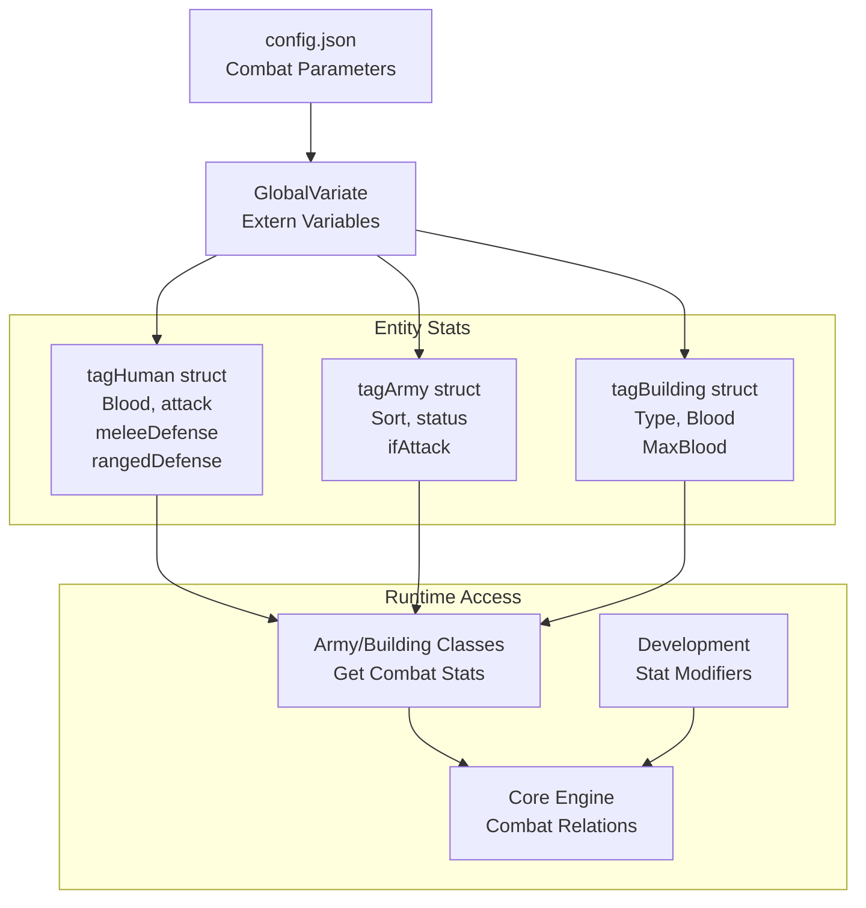
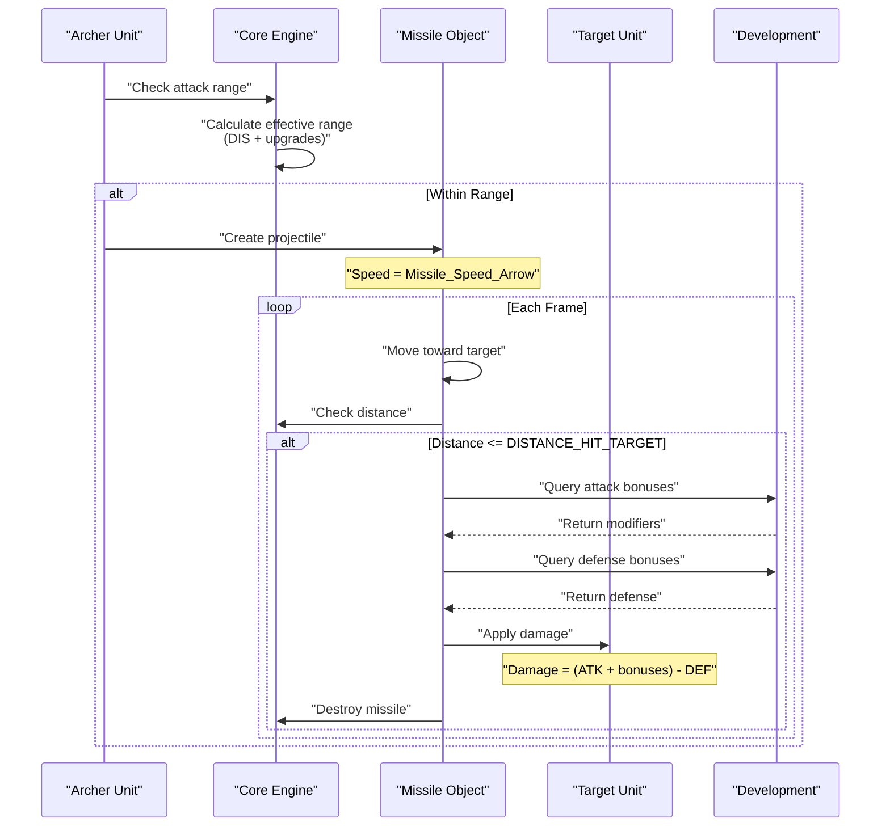
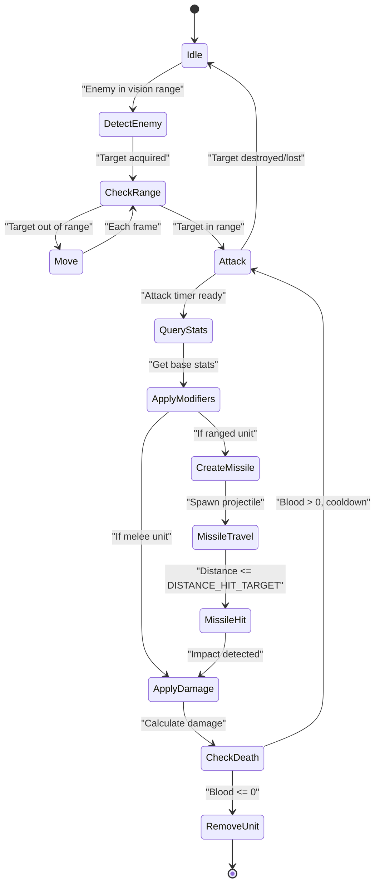

# Combat System

<details>
<summary>Relevant source files</summary>

The following files were used as context for generating this wiki page:

- [Development.cpp](Development.cpp)
- [GlobalVariate.h](GlobalVariate.h)
- [config.json](config.json)

</details>


## Purpose and Scope

The Combat System defines how military units and defensive structures engage in battle, calculating damage, applying defensive modifiers, and resolving attacks through melee and ranged mechanics. This system encompasses unit combat statistics, attack/defense types, missile projectiles, range calculations, and technology-based stat modifications.

For information about unit creation and properties, see [Units and Buildings](#3.3). For the technology upgrades that modify combat stats, see [Technology Tree](#3.2). For the underlying relation execution that processes combat actions, see [Game Core Engine](#2.2).

---

## Combat Statistics

### Base Unit Stats

All combat-capable entities inherit from the `BloodHaver` class and possess fundamental combat statistics defined in [config.json:1-471]():

| Stat Category | Parameters | Description |
|--------------|------------|-------------|
| Health | `BLOOD_*` | Maximum hit points for units and buildings |
| Attack Power | `ATK_*` | Base damage dealt per attack |
| Attack Range | `DIS_*` | Maximum engagement distance (0 for melee) |
| Attack Speed | `INTERVAL_*` | Seconds between consecutive attacks |
| Defense (Melee) | `DEFCLOSE_*` | Damage reduction against close-range attacks |
| Defense (Ranged) | `DEFSHOOT_*` | Damage reduction against projectile attacks |
| Vision Range | `VISION_*` | Detection radius for enemy units |
| Movement Speed | `SPEED_*` | Units per frame movement rate |

**Example Unit Configuration:**

```
BLOOD_BOWMAN: 35           # Hit points
ATK_BOWMAN: 3              # Base attack damage  
DIS_BOWMAN: 5              # Attack range (blocks)
INTERVAL_BOWMAN: 1.4       # Attack cooldown (seconds)
DEFCLOSE_BOWMAN: 0         # Melee defense
DEFSHOOT_BOWMAN: 0         # Ranged defense
VISION_BOWMAN: 7           # Vision radius
SPEED_BOWMAN: 2.439        # Movement speed
```

These statistics are loaded into global variables via `ReadConfig()` at startup [GlobalVariate.h:1-1326]() and accessed throughout the game engine.

**Diagram: Combat Stat Flow**



Sources: [config.json:1-471](), [GlobalVariate.h:705-759]()

---

## Attack Types and Mechanics

### Attack Type Classification

The combat system distinguishes between multiple attack types, each with different mechanics:

| Attack Type | Constant | Characteristics | Affected By |
|------------|----------|-----------------|-------------|
| Melee/Close | `ATTACKTYPE_CLOSE` | Direct physical contact | Close defense (`DEFCLOSE`) |
| Ranged/Shoot | `ATTACKTYPE_SHOOT` | Missile projectiles | Ranged defense (`DEFSHOOT`) |
| Animal | `ATTACKTYPE_ANIMAL` | Wildlife attacks | Infantry armor upgrades |

**Attack Range Mechanics:**

Units with `DIS_* = 0` are melee combatants and must close to within `DISTANCE_ATTACK_CLOSE` (17.89 units) to engage [config.json:262](). Ranged units fire projectiles when targets are within their `DIS_*` range plus any upgrades from [Development.cpp:97-129]().

**Range Calculation Example:**

```
Bowman Base Range: DIS_BOWMAN = 5 blocks
+ Wood Upgrade: +1 block (BUILDING_MARKET_WOOD_UPGRADE_ADDITION_DISSHOOT)
+ Craft Tech: +1 block (BUILDING_MARKET_CRAFT_UPGRADE_ADDITION_DISSHOOT)
= Effective Range: 7 blocks
```

### Attack Multipliers

Certain unit-target combinations receive damage multipliers implemented in [Development.cpp:41-52]():

```cpp
double Development::get_rate_Attack(int sort, int type, int armyClass, 
                                     int attackType, int interSort, int interNum)
{
    double rate = 1;
    
    if (interSort != -1 && interNum != -1)
    {
        // Swordsmen, cavalry, and improved units deal 2x damage to buildings
        if (interSort == SORT_BUILDING && sort == SORT_ARMY && 
            (type == AT_SWORDSMAN || type == AT_CAVALRY || type == AT_IMPROVED))
            rate = 2;
    }
    
    return rate;
}
```

**Attack Bonuses from Upgrades:**

Flat attack bonuses are calculated in [Development.cpp:55-92]():

- **Close Combat Upgrade (Stock):** +2 attack per tier (2 tiers available)
- **Slinger Stone Upgrade (Market):** +1 attack for slingers
- **Arrow Tower Upgrade (Granary):** +4 attack for defensive towers

Sources: [config.json:262-470](), [Development.cpp:41-92](), [GlobalVariate.h:304-499]()

---

## Defense Mechanics

### Defense Calculation

Damage reduction applies based on the attack type received and the defender's armor values. The system calculates:

```
Actual Damage = (Base Attack + Flat Bonuses) × Attack Multipliers - Defense Value
```

Defense values are computed from base stats plus technology additions.

### Armor Types and Upgrades

The `Development` class provides three categories of defense bonuses [Development.cpp:141-204]():

**Infantry Armor (Stock Building):**
- Tier 1: +2 melee/animal defense
- Tier 2: Additional +2 (total +4)
- Bronze Shield: +1 ranged defense

**Archer Armor (Stock Building):**
- Tier 1: +2 melee/animal defense  
- Tier 2: Additional +2 (total +4)

**Cavalry Armor (Stock Building):**
- Tier 1: +2 melee/animal defense
- Tier 2: Additional +2 (total +4)

**Defense Query Function:**

```cpp
int Development::get_addition_Defence(int sort, int type, int armyClass, 
                                       int attackType_got)
{
    double addition = 0;
    int level = 0;
    
    if (sort == SORT_ARMY)
    {
        if (attackType_got == ATTACKTYPE_ANIMAL || attackType_got == ATTACKTYPE_CLOSE)
        {
            // Infantry armor upgrade
            if (armyClass == ARMY_INFANTRY)
            {
                level = getActLevel(BUILDING_STOCK, BUILDING_STOCK_UPGRADE_DEFENSE_INFANTRY);
                switch (level) {
                case 2:
                    addition += BUILDING_STOCK_UPGRADE_DEFENSE_INFANTRY_2_ADDITION_DEFENSE_INFANTRY;
                case 1:
                    addition += BUILDING_STOCK_UPGRADE_DEFENSE_INFANTRY_ADDITION_DEFENSE_INFANTRY;
                default:
                    break;
                }
            }
            // ... similar for ARMY_ARCHER and ARMY_RIDER
        }
        else if (attackType_got == ATTACKTYPE_SHOOT)
        {
            // Bronze Shield for infantry
            if (armyClass == ARMY_INFANTRY)
            {
                if (getActLevel(BUILDING_STOCK, BUILDING_STOCK_UPGRADE_MISSILE_DEFENSE_INFANTRY) >= 1)
                {
                    addition += BUILDING_STOCK_UPGRADE_MISSILE_DEFENSE_INFANTRY_ADDITION_DEFENSE_INFANTRY;
                }
            }
        }
    }
    return addition;
}
```

Sources: [Development.cpp:132-204](), [config.json:48-143](), [GlobalVariate.h:55-79]()

---

## Missile System

### Projectile Types and Speeds

Ranged units fire visible projectiles with distinct speeds defined in [config.json:398-402]():

| Missile Type | Speed (units/frame) | Used By |
|--------------|-------------------|---------|
| Spear | 8.944 | Defensive units |
| Arrow | 20.125 | Bowmen, Archers |
| Cobblestone | 20.125 | Slingers |
| Boulders | 8.944 | Stone Throwers |

**Boulder Area Effect:**

The stone thrower's boulders have a special `Missile_Boulders_Range: 2` parameter [config.json:402]() indicating an area-of-effect radius. The `Boulder_Trail_Effect_Duration: 30` [config.json:470]() controls visual effect lifetime.

### Missile Mechanics

When a ranged unit attacks:

1. **Fire Condition:** Target must be within attack range (`DIS_*` + range upgrades)
2. **Projectile Creation:** A missile object spawns at the attacker's position
3. **Flight:** Missile moves toward target at configured speed per frame
4. **Hit Detection:** When `DISTANCE_HIT_TARGET` (4 units) is reached [config.json:263](), damage applies
5. **Visual Effects:** Trail effects persist based on missile type

**Diagram: Ranged Combat Flow**



Sources: [config.json:398-470](), [GlobalVariate.h:482-486]()

---

## Technology Modifiers

### Combat-Affecting Technologies

The `Development` class [Development.cpp:1-694]() manages technology upgrades that modify combat effectiveness. Technologies are researched in specific buildings and provide cumulative bonuses.

**Attack Enhancement Technologies:**

| Technology | Building | Bonus | Affected Units |
|-----------|----------|-------|----------------|
| Close Combat (Tier 1) | Stock | +2 ATK | All melee units |
| Close Combat (Tier 2) | Stock | +4 ATK total | All melee units |
| Stone Processing | Market | +1 ATK | Slingers |
| Arrow Tower Upgrade | Granary | +4 ATK | Arrow towers |
| Wood Processing | Market | +1 Range | Ranged units |
| Craftsmanship | Market | +1 Range (stacks) | Ranged units |

**Defense Enhancement Technologies:**

| Technology | Building | Bonus | Affected Units |
|-----------|----------|-------|----------------|
| Infantry Armor (Tier 1) | Stock | +2 DEF | Infantry vs melee |
| Infantry Armor (Tier 2) | Stock | +4 DEF total | Infantry vs melee |
| Bronze Shield | Stock | +1 DEF | Infantry vs ranged |
| Archer Armor (Tier 1/2) | Stock | +2/+4 DEF | Archers vs melee |
| Cavalry Armor (Tier 1/2) | Stock | +2/+4 DEF | Cavalry vs melee |

### Technology Query System

The combat system queries the `Development` object for active bonuses during stat calculations:

**Attack Bonus Query:**
```cpp
int Development::get_addition_Attack(int sort, int type, int armyClass, int attackType)
{
    int level = 0;
    int addition = 0;
    
    if (attackType == ATTACKTYPE_CLOSE && sort != SORT_FARMER)
    {
        level = getActLevel(BUILDING_STOCK, BUILDING_STOCK_UPGRADE_USETOOL);
        switch (level) {
        case 2:
            addition += BUILDING_STOCK_UPGRADE_CLOSER_ATTACK_2_ADDITION_ATTACK;
        case 1:
            addition += BUILDING_STOCK_UPGRADE_CLOSER_ATTACK_ADDITION_ATTACK;
        default:
            break;
        }
    }
    // ... additional checks for other upgrades
    return addition;
}
```

**Range Bonus Query:**
```cpp
int Development::get_addition_DisAttack(int sort, int type, int armyClass, int attackType)
{
    int addition = 0;
    int level = 0;
    
    if (attackType == ATTACKTYPE_SHOOT)
    {
        // Wood processing tech (Tool Age)
        if (getActLevel(BUILDING_MARKET, BUILDING_MARKET_WOOD_UPGRADE) >= 1)
        {
            addition += BUILDING_MARKET_WOOD_UPGRADE_ADDITION_DISSHOOT;
        }
        // Craftsmanship tech (Bronze Age, stacks with wood processing)
        if (getActLevel(BUILDING_MARKET, BUILDING_MARKET_WOOD_UPGRADE) >= 2)
        {
            addition += BUILDING_MARKET_CRAFT_UPGRADE_ADDITION_DISSHOOT;
        }
    }
    
    return addition;
}
```

Sources: [Development.cpp:13-312](), [config.json:48-235]()

---

## Combat Resolution

### Engagement Distance Thresholds

The system uses several Manhattan distance constants for combat state transitions [config.json:258-265]():

- `DISTANCE_ATTACK_CLOSE`: 17.89 - Maximum melee engagement range
- `DISTANCE_HIT_TARGET`: 4 - Projectile impact detection threshold
- `DISTANCE_ELEPHANT_ATTACK`: 42.57 - Special animal attack range
- `ANIMAL_ATTACKRANGE_LION`: 10 - Lion attack range
- `ANIMAL_ATTACKRANGE_ELEPHANT`: 10 - Elephant attack range

### Attack Timing System

Each unit has a resource timer (`NOWRES_TIMER_*`) controlling animation frame rates [config.json:403-415]():

```
NOWRES_TIMER_FARMER: 1        # Fast animation
NOWRES_TIMER_CLUBMAN: 1       # Fast melee
NOWRES_TIMER_BOWMAN: 2        # Moderate ranged
NOWRES_TIMER_STONE_THROWER: 7 # Slow siege
```

The attack interval (`INTERVAL_*`) determines cooldown between attacks:

```
INTERVAL_CLUBMAN1: 1.5 seconds
INTERVAL_BOWMAN: 1.4 seconds
INTERVAL_STONE_THROWER: 4.2 seconds
```

### Combat State Machine

**Diagram: Combat Execution Flow**



### Damage Calculation Formula

The final damage applied to a target combines all stat modifications:

```
Base Attack = Unit's ATK_* value
Attack Bonuses = Development.get_addition_Attack(...)
Attack Multiplier = Development.get_rate_Attack(...)
Defense Value = Development.get_addition_Defence(...)

Final Damage = ((Base Attack + Attack Bonuses) × Attack Multiplier) - Defense Value
Final Damage = max(Final Damage, 1)  // Minimum 1 damage per hit

Target.Blood -= Final Damage
```

**Example Combat Calculation:**

```
Improved Bowman attacks Enemy Infantry:

Base Attack: ATK_IMPROVEDBOWMAN1 = 8
+ Wood Processing: +1 range (doesn't affect damage)
+ Close Combat upgrade: 0 (ranged attack)
= Modified Attack: 8

Target Defense:
Base: DEFSHOOT = 0
+ Infantry Armor Tier 2: 0 (doesn't affect ranged)
= Modified Defense: 0

Final Damage: (8 × 1) - 0 = 8 damage
Enemy Infantry Blood: 40 - 8 = 32 remaining
```

Sources: [Development.cpp:13-204](), [config.json:258-470](), [GlobalVariate.h:705-759]()

---

## Special Combat Mechanics

### Building Attacks

Arrow towers (`BUILDING_ARROWTOWER`) possess attack capabilities [config.json:246-253]():

```
BLOOD_BUILD_ARROWTOWER: 125
DIS_ARROWTOWER: 7             # Attack range
ATK_BUILD_ARROWTOWER: 3       # Base damage
DEFSHOOT_BUILD_ARROWTOWER: 2  # Ranged defense
DIS_BUILD_ARROWTOWER: 5       # Detection range
```

Buildings use the same combat resolution as units but remain stationary and have special upgrade paths [Development.cpp:82-90]().

### Animal Combat

Wildlife units (lions, elephants) have unique combat parameters:

```
Lion:
  BLOOD_LION: 20
  VISION_LION: 3
  ANIMAL_ATTACKRANGE_LION: 10

Elephant:  
  BLOOD_ELEPHANT: 45
  SPEED_ELEPHANT: 2.033
  ANIMAL_ATTACKRANGE_ELEPHANT: 10
  DISTANCE_ELEPHANT_ATTACK: 42.574
```

Animals use `ATTACKTYPE_ANIMAL`, which is defended against by infantry armor upgrades [Development.cpp:148-164]().

Sources: [config.json:44-56](), [config.json:246-257](), [Development.cpp:82-90](), [Development.cpp:148-164]()