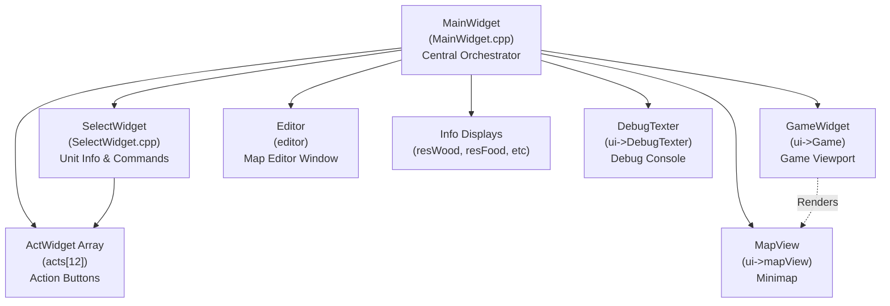
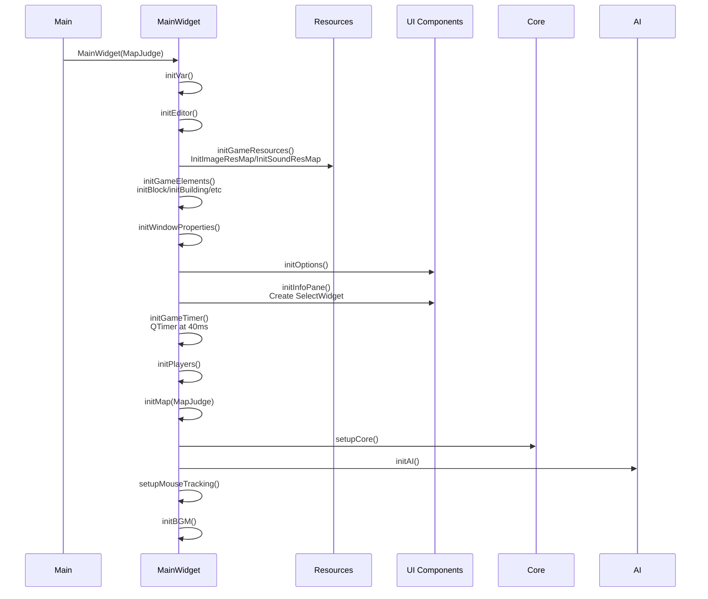
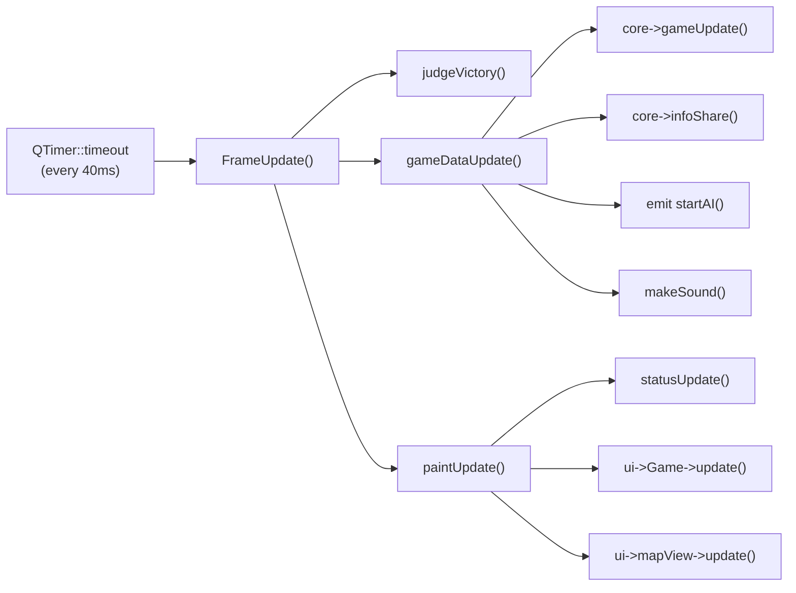
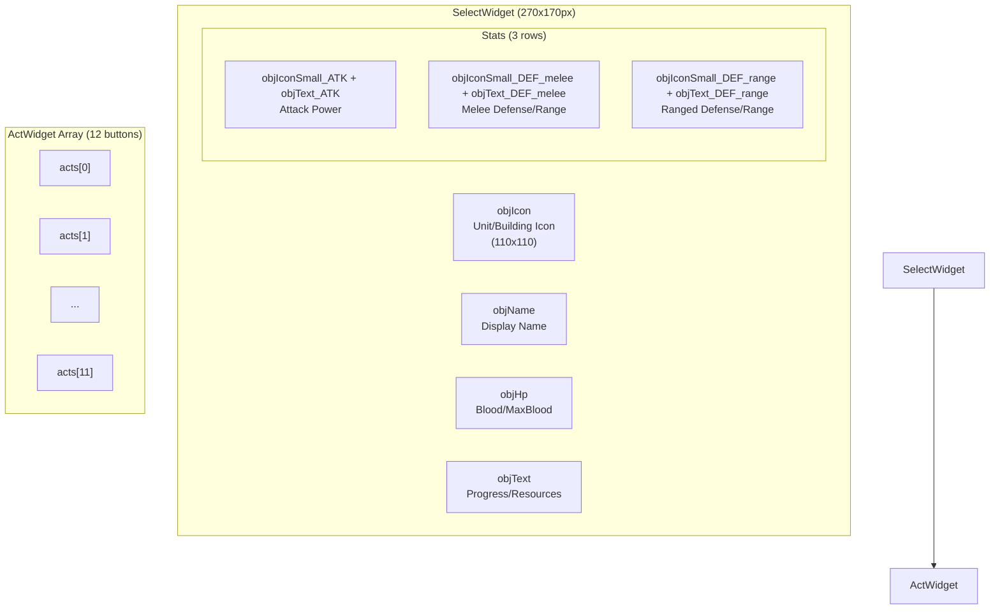
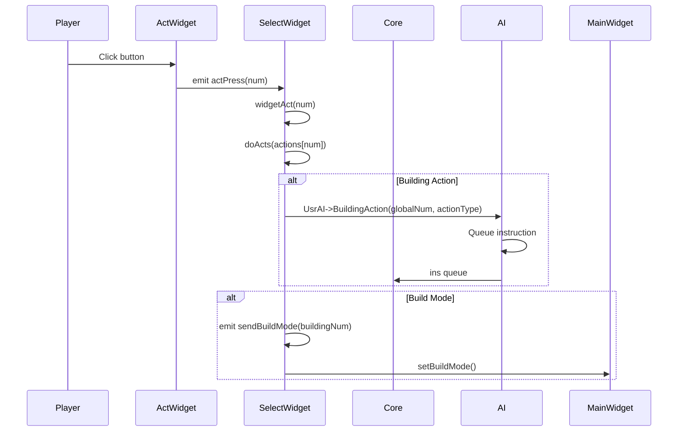
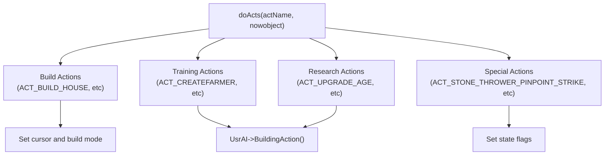
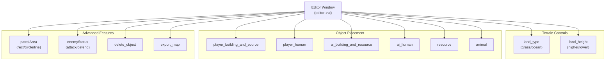
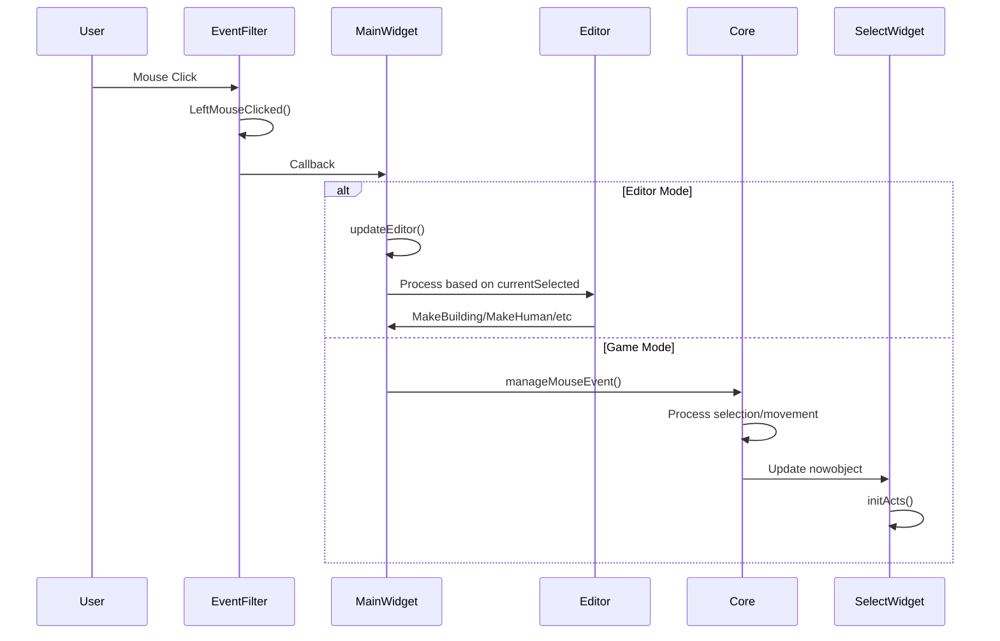

# User Interface

<details>
<summary>Relevant source files</summary>

The following files were used as context for generating this wiki page:

- [MainWidget.cpp](MainWidget.cpp)
- [SelectWidget.cpp](SelectWidget.cpp)

</details>


The User Interface system provides the Qt-based graphical layer for player interaction with the game. It manages rendering, input handling, information display, command execution, and map editing functionality. The system implements a widget-based architecture with `MainWidget` serving as the central orchestrator for all UI subsystems.

For AI command processing and instruction flow, see [AI System](#5). For rendering details and resource loading, see [Rendering and Display](#4.3).

---

## UI Component Architecture

The UI layer consists of several interconnected Qt widgets that handle different aspects of player interaction:

**UI Component Hierarchy**



**Sources:** MainWidget.cpp:94-276, SelectWidget.cpp:1-19

---

## MainWidget: Central Controller

`MainWidget` is the primary Qt widget (importance 10.45) that initializes and coordinates all UI subsystems. It inherits from `QWidget` and manages the game loop, event routing, and widget lifecycle.

**Initialization Sequence**



**Sources:** MainWidget.cpp:94-152, MainWidget.cpp:1279-1474

### UI Initialization Methods

| Method | Purpose | Key Operations |
|--------|---------|----------------|
| `initGameResources()` | Load assets | Calls `InitImageResMap()`, `InitSoundResMap()` |
| `initGameElements()` | Initialize sprites | Calls `initBlock()`, `initBuilding()`, `initAnimal()`, etc |
| `initWindowProperties()` | Setup window | Sets size to `GAME_WIDTH x GAME_HEIGHT`, title, icon |
| `initOptions()` | Create dialogs | Instantiates `Option`, `AboutDialog`, speed button group |
| `initInfoPane()` | Setup command panel | Creates `SelectWidget`, initializes `ActWidget` array |
| `initGameTimer()` | Start game loop | Creates `QTimer` with `TimePerFrame` interval |
| `initPlayers()` | Initialize players | Creates `Player[MAXPLAYER]` array |
| `initMap()` | Load map | Creates `Map`, calls `map->init()`, loads resources |
| `setupCore()` | Initialize engine | Creates `Core` instance, connects to `SelectWidget` |
| `initAI()` | Start AI threads | Creates `UsrAI`, `EnemyAI`, connects signals |

**Sources:** MainWidget.cpp:1279-1474

### Game Loop and Update Cycle

The game loop runs at a fixed timestep controlled by `QTimer`:



**Sources:** MainWidget.cpp:1372-1380, MainWidget.cpp:2380-2409

**Frame Update Flow:**

[MainWidget.cpp:2380-2409]()

```cpp
void MainWidget::FrameUpdate()
{
    judgeVictory();
    respond_DebugMessage();
    
    if (!pause) gameframe++;
    g_frame = gameframe;
    sel->resetSecond();
    
    // Paint at different frequencies based on speed setting
    if (mapmoveFrequency == 1 || mapmoveFrequency == 2) {
        paintUpdate();
    }
    else if (mapmoveFrequency == 4) {
        if (gameframe % 2 == 0 || pause) paintUpdate();
    }
    else if (mapmoveFrequency == 8) {
        if (gameframe % 3 == 0 || pause) paintUpdate();
    }
    
    gameDataUpdate();
}
```

The `mapmoveFrequency` variable (1, 2, 4, or 8) controls game speed, affecting both timer interval and paint frequency.

**Sources:** MainWidget.cpp:2380-2433

---

## SelectWidget: Command Panel

`SelectWidget` (importance 5.39) is the bottom-left panel that displays selected unit information and provides command buttons. It inherits from `QWidget` and is responsible for:

- Displaying unit/building stats (HP, attack, defense, resources)
- Managing the action button array (`ActWidget[12]`)
- Processing player commands via `doActs()`
- Converting AI commands to actions via `aiAct()`

**SelectWidget Layout**



**Sources:** SelectWidget.cpp:1-19, MainWidget.cpp:1338-1370

### Object Display System

`SelectWidget::refreshActs()` runs every frame to update the displayed information based on `nowobject`:

**Object Type Handling:**

| Object Type | Display Elements | Special Behavior |
|-------------|------------------|------------------|
| `SORT_BUILDING` | Name, Icon, HP, Progress | Shows action buttons when finished |
| `SORT_FARMER` | Name, Icon, HP, Carried resources | Shows build button |
| `SORT_ARMY` | Name, Icon, HP, ATK, DEF (melee/range) | Shows pinpoint strike for stone throwers |
| `SORT_STATICRES` | Name, Icon, Resource count | No action buttons |
| `SORT_ANIMAL` | Name, Icon, HP, Resource count | No action buttons |

**Sources:** SelectWidget.cpp:263-905

**Example: Building Display**

[SelectWidget.cpp:571-701]()

For buildings, the widget displays:
- Building name via `Building::getDisplayName(buildType)`
- Icon from `resMap["Button_" + Building::getBuiltname(civ, isEnemy, buildType)]`
- HP as `current/max`
- Progress percentage if under construction
- Action buttons from `Building::getActNames(i)` if finished
- Special display for houses (population) and farms (food count)

**Example: Army Display**

[SelectWidget.cpp:803-852]()

For army units, the widget displays:
- Unit name via `Army::getChineseName()`
- Icon from `resMap["Button_" + Army::getArmyName(num, level)]`
- Attack power with bonus: `base + addition`
- Melee defense: `base + addition`
- For ranged units:射程 (range) instead of ranged defense
- For melee units: ranged defense value

**Sources:** SelectWidget.cpp:571-852

---

## Action Button System

The action system uses an array of 12 `ActWidget` instances (`acts[0..11]`) managed by `SelectWidget`. Each button represents a possible action (build, train, research, etc).

**Action Flow Diagram**



**Sources:** SelectWidget.cpp:907-913, MainWidget.cpp:1338-1370

### Action Array Management

Three parallel arrays manage button state:

```cpp
int actions[ACT_WINDOW_NUM_FREE];      // Action IDs (ACT_CREATEFARMER, etc)
int actionStatus[ACT_WINDOW_NUM_FREE];  // Status (ENABLED/DISABLED)
ActWidget* acts[ACT_WINDOW_NUM_FREE];   // Widget pointers
```

**Sources:** MainWidget.cpp:33, SelectWidget.cpp:154-175

**Action Initialization:**

`SelectWidget::initActs()` populates the action array based on the selected object:

[SelectWidget.cpp:154-261]()

For buildings:
- If acting: `actions[0] = ACT_STOP`
- Otherwise: Copy from `Building::getActNames(i)` if `get_isBuildActionShowAble()` returns true

For farmers:
- `actions[0] = ACT_BUILD` (or `ACT_SHIP_LAY` for transport ships)

For army units:
- Stone throwers: `ACT_STONE_THROWER_PINPOINT_STRIKE` or `ACT_STONE_THROWER_CANCEL_PINPOINT_STRIKE`

**Action Refresh:**

`SelectWidget::refreshActs()` runs every frame to update button enabled/disabled state:

[SelectWidget.cpp:263-545]()

For each action, checks:
- Building actions: `player->get_isBuildActionAble(buildType, actionType)`
- Build commands: `player->get_isBuildingShowAble()` and `get_isBuildingAble()`
- Updates `ActWidget::setStatus(actionStatus[i])`

**Action Drawing:**

`SelectWidget::drawActs()` sets button icons based on the `actions` array:

[SelectWidget.cpp:1232-1326]()

Maps action IDs to resource keys via `actionResourceMap`:
- `ACT_CREATEFARMER` → `"Button_Villager"`
- `ACT_UPGRADE_AGE` → `"ButtonTech_Center1"`
- Building actions use era-specific icons: `"Button_" + Building::getBuiltname(civ, 0, buildingNum)`

**Sources:** SelectWidget.cpp:154-261, SelectWidget.cpp:263-545, SelectWidget.cpp:1232-1326

### Action Execution: doActs()

`SelectWidget::doActs(int actName, Coordinate* nowobject)` processes action commands:

**Action Categories:**



**Sources:** SelectWidget.cpp:933-1192

**Build Mode Actions:**

[SelectWidget.cpp:963-1007]()

For building placement (e.g., `ACT_BUILD_HOUSE`):
1. Gets appropriate building icon based on player's civilization age
2. Sets cursor to building icon via `QApplication::setOverrideCursor()`
3. Emits `sendBuildMode(buildingNum)` to `GameWidget`
4. Player clicks map to place building (handled in `Core::manageMouseEvent()`)

**Building Actions:**

[SelectWidget.cpp:1012-1120]()

For training/research (e.g., `ACT_CREATEFARMER`, `ACT_UPGRADE_AGE`):
1. Calls `UsrAI->BuildingAction(nowobject->getglobalNum(), actionType)`
2. AI wraps action into `instruction` struct and queues it
3. Core processes instruction in `manageOrder()` (see [Instruction and Command System](#5.2))

**Special Actions:**

- `ACT_STOP`: Calls `core->suspendRelation(nowobject)` to cancel current action
- `ACT_STONE_THROWER_PINPOINT_STRIKE`: Sets waiting flag, user clicks target on map
- `ACT_BUILD_CANCEL`: Restores cursor, exits build mode

**Sources:** SelectWidget.cpp:933-1192

### Action Resource Mapping

The `actionResourceMap` maps action IDs to button icon resource keys:

[SelectWidget.cpp:21-77]()

```cpp
actionResourceMap[ACT_CREATEFARMER] = "Button_Villager";
actionResourceMap[ACT_UPGRADE_AGE] = "ButtonTech_Center1";
actionResourceMap[ACT_ARMYCAMP_CREATE_CLUBMAN] = "Button_Clubman";
// ... etc
```

This map is initialized in `SelectWidget::initActionResourceMap()` and used by `drawActs()` to load correct icons.

**Sources:** SelectWidget.cpp:21-77, SelectWidget.cpp:1277-1280

---

## Editor System

The editor is integrated into `MainWidget` and provides map creation tools. It consists of:

- `Editor` widget (separate window) with combo boxes for selecting edit modes
- `updateEditor()` method that processes mouse input based on `currentSelected` state
- Area management tools (`RectArea`, `CircleArea`, `LineArea`) for defining patrol zones
- Export/import functionality for `.njust` map files

**Editor UI Components**



**Sources:** MainWidget.cpp:141-152, MainWidget.cpp:155-275

### Editor State Machine

The editor uses `currentSelected` enum to track edit mode:

[MainWidget.cpp:163-274]()

**Edit Modes:**

| Mode | Trigger | Mouse Behavior |
|------|---------|----------------|
| `NORMAL_MOUSE` | Default | No editing |
| `FLAT` | land_type="草地" | Paint grassland |
| `OCEAN` | land_type="海洋" | Paint ocean |
| `HIGHTERLAND` | land_height="提升高度" | Raise terrain |
| `LOWERLAND` | land_height="降低高度" | Lower terrain |
| `PLAYERDOWNTOWN` | player_building_and_source="玩家市中心" | Place player town center |
| `TREE` | resource="树木" | Place tree |
| `GAZELLE` | animal="瞪羚" | Place gazelle |
| `DELETEOBJECT` | delete_object clicked | Delete objects in area |
| `PATROL_RECT_AREA` | patrolArea="矩形区域" | Define rectangular patrol zone |
| `ENEMY_STATUS_ATTACK` | enemyStatus="攻击" | Set enemy AI to attack mode |

**Sources:** MainWidget.cpp:163-274

### Edit Processing

`MainWidget::updateEditor()` processes mouse events based on `currentSelected`:

[MainWidget.cpp:528-740]()

**Drag Operations** (left mouse held):
- `HIGHTERLAND`/`LOWERLAND`: Calls `HigherLand()`/`LowerLand()` continuously
- `OCEAN`/`FLAT`: Calls `MakeOcean()`/`MakeGrassland()` continuously
- `DELETEOBJECT`: Calls `clearArea()` continuously

**Click Operations** (left mouse clicked):
- Object placement modes: Call `MakeTree()`, `MakeBuilding()`, `MakeHuman()`, etc.
- `PATROL_RECT_AREA`/`PATROL_CIRCLE_AREA`/`PATROL_LINE_AREA`: Handled by area drawing system
- `ENEMY_STATUS_ATTACK`/`ENEMY_STATUS_DEFEND`: Calls `handleEnemyStatusSelection()`

**Unit Selection:**
- Ctrl+Click: Multi-select enemy units
- Click without Ctrl: Clear selection and select single unit
- Selected units tracked in `selectedUnits` vector

**Sources:** MainWidget.cpp:528-740

### Terrain Modification

**Terrain Operations:**

[MainWidget.cpp:881-1107]()

- `HigherLand(blockL, blockU, height)`: Raises 3x3 area, validates height differences ≤1
- `LowerLand(blockL, blockU, height)`: Lowers 3x3 area, validates height differences ≤1
- `MakeOcean(blockL, blockU)`: Sets 3x3 area to ocean (`MAPHEIGHT_OCEAN`), updates shore area
- `MakeGrassland(blockL, blockU)`: Converts ocean to grass (`MAPTYPE_FLAT`)

All terrain operations:
1. Modify `map->m_heightMap` and `map->cell[i][j]`
2. Call `map->GenerateType()` to recalculate terrain types
3. Call `map->CalOffset()` to update tile offsets
4. Call `map->InitFaultHandle()` to fix edge cases
5. For ocean changes, call `map->updateShoreArea()` to redraw beaches

**Sources:** MainWidget.cpp:881-1107

### Object Creation

**Object Creation Methods:**

| Method | Parameters | Creates |
|--------|-----------|---------|
| `MakeTree(DR, UR)` | Detail coords | Calls `map->addAnimal(0, DR, UR)` |
| `MakeStaticRes(blockL, blockU, type)` | Block coords, type | Calls `map->addStaticRes(type, blockL, blockU)` |
| `MakeAnimal(DR, UR, type)` | Detail coords, type | Calls `map->addAnimal(finalType, DR, UR)` |
| `MakeBuilding(blockL, blockU, type)` | Block coords, type | Calls `player[owner]->addBuilding(num, blockL, blockU, 100)` |
| `MakeHuman(DR, UR, type)` | Detail coords, type | Calls `player[owner]->addFarmer()` or `addArmy()` |

**Sources:** MainWidget.cpp:1109-1274

**Object Deletion:**

`clearArea(blockL, blockU, radius)` removes all objects within Manhattan distance:

[MainWidget.cpp:742-847]()

1. Iterates through `map->staticres`, `map->animal`, `player[i]->build`, `player[i]->human`
2. Checks `abs(x - blockL) <= radius && abs(y - blockU) <= radius`
3. Removes from `map->map_Object` first to avoid dangling pointers
4. Calls `cleanupUnitReferences()` for units to clear selection and area relationships
5. Deletes objects and erases from lists
6. Calls `map->loadBarrierMap(true)` and `map->reset_resMap_AI()` to update pathfinding

**Sources:** MainWidget.cpp:742-847

### Map Export/Import

**Export Format:**

`ExportCurrentState(fileName)` saves map to JSON:

[MainWidget.cpp:279-525]()

Exports:
- **Terrain cells**: Block coordinates, type, pattern, height, offsets, resources
- **Buildings**: Coordinates, type, owner ("WLH"=player, "LZ"=enemy)
- **Humans**: Coordinates, type, sort (Farmer/Army), owner, farmer type
- **Areas**: Patrol areas (Beatarea) and limit areas (AreaLimit) for each unit
- **Enemy status**: Attack/defend stance for enemy units
- **Static resources**: Trees, gold, stone coordinates
- **Animals**: Gazelle, lion, elephant coordinates

**Area Export:**

[MainWidget.cpp:289-363]()

The export system supports multiple areas per unit:
- `GetAllAreas(obj)` returns vector of all associated areas (rect/circle/line)
- Each area includes type (`RectArea`, `CircleArea`, `LineArea`) and data
- Areas are classified as `Beatarea` (patrol, type=1) or `AreaLimit` (type=0)
- Export handles both single area (backward compatible) and multiple areas (new format)

**Example JSON structure:**
```json
{
  "Human_0": {
    "DR": 1500,
    "UR": 2000,
    "Num": 50,
    "Sort": "Army",
    "Own": "LZ",
    "Beatarea": {
      "Type": "RectArea",
      "DR": 1000,
      "UR": 1500,
      "W": 500,
      "H": 500,
      "AreaName": "Beatarea"
    },
    "statu": "attack"
  }
}
```

**Sources:** MainWidget.cpp:279-525

---

## Event Handling Flow

The UI uses Qt's event system with a global `EventFilter` to capture and route input:

**Event Processing Pipeline**



**Sources:** MainWidget.cpp:2308-2345, SelectWidget.cpp:907-918

### Mouse Event Routing

Global event filter registration:

[MainWidget.cpp:2308-2345]()

```cpp
void MainWidget::initEditor()
{
    auto& e = ::eventFilter;
    e->RegistReciver([&](){
        if(e->LeftMouseClicked()){
            int x = e->MouseX(), y = e->MouseY();
            mouseEvent->SetMemoeyMapX(x/4);
            mouseEvent->SetMemoryMapY(y/4);
            mouseEvent->SetMouseEventType(LEFT_PRESS);
            mouseEvent->SetDR(ui->Game->TranGlobalPosToDR(x,y));
            mouseEvent->SetUR(ui->Game->TranGlobalPosToUR(x,y));
        }
        else if(e->RightMouseClicked()){
            // Similar handling for right click
        }
        
        if(EditorMode){
            updateEditor();
        }
    });
}
```

The callback:
1. Captures mouse coordinates via `eventFilter->MouseX()/MouseY()`
2. Converts to detail coordinates via `ui->Game->TranGlobalPosToDR()/TranGlobalPosToUR()`
3. Sets `mouseEvent` fields (accessed by `Core`)
4. Calls `updateEditor()` if in editor mode

**Sources:** MainWidget.cpp:2308-2345

### ActWidget Event Handling

`MainWidget::eventFilter()` handles hover/click for action buttons:

[MainWidget.cpp:2017-2043]()

For each `ActWidget`:
- `HoverEnter`: Sets tooltip text to action name, highlights button
- `MouseButtonPress`: Sets button to pressed state
- `MouseButtonRelease`: Emits `actPress(num)` signal to `SelectWidget`
- `HoverLeave`: Clears tooltip

**Sources:** MainWidget.cpp:2017-2043

---

## Resource Display System

**Status Display Update:**

`MainWidget::statusUpdate()` refreshes UI elements every frame:

[MainWidget.cpp:2055-2072]()

Updates:
- `ui->resWood/resFood/resStone/resGold`: Player resource counts from `core->getPlayerNowResource()`
- `ui->score0/score1`: Player scores with colored HTML formatting
- `ui->mapView->screenL/screenU`: Camera position for minimap
- `ui->statusLbl`: Game time from `sel->getShowTime()`
- `ui->version`: Game version string

**Sources:** MainWidget.cpp:2055-2072

**Paint Update:**

`MainWidget::paintUpdate()` triggers rendering:

[MainWidget.cpp:2093-2103]()

Calls:
- `statusUpdate()`: Update text displays
- `ui->Game->update()`: Trigger `GameWidget` repaint
- `ui->mapView->update()`: Trigger minimap repaint
- `emit mapmove()`: Signal camera movement

**Sources:** MainWidget.cpp:2093-2103

### Debug Console

The debug console (`ui->DebugTexter`) provides colored message output:

[MainWidget.cpp:2458-2494]()

**Message Colors:**
- Blue: Game events (start, victory, loss)
- Red: Errors
- Green: Info messages
- Black: General messages

Messages are inserted as HTML with color tags and auto-scrolled to bottom.

**Export Functions:**
- `exportDebugTextTxt()`: Saves to `output/debug_info_YYYY-MM-DD_HH-MM-SS.txt`
- `exportDebugTextTreeBlock()`: Saves `TreeBlock.txt` with tree occlusion map
- `clearDebugTextFile()`: Deletes all files in `output/` directory

**Sources:** MainWidget.cpp:2458-2582

---

## Summary

The UI system provides a comprehensive Qt-based interface with the following key components:

| Component | File | Responsibilities |
|-----------|------|------------------|
| `MainWidget` | MainWidget.cpp | Orchestration, initialization, game loop, editor |
| `SelectWidget` | SelectWidget.cpp | Unit display, command panel, action processing |
| `ActWidget[12]` | MainWidget.cpp:33 | Action buttons with hover/click handling |
| `GameWidget` | (ui->Game) | Viewport rendering (see [Rendering and Display](#4.3)) |
| `Editor` | MainWidget.cpp:141-152 | Map editing window and controls |
| `EventFilter` | MainWidget.cpp:2308-2345 | Global input capture and routing |

The system follows a clear separation:
- **Input**: EventFilter → MainWidget/Core → SelectWidget
- **Display**: Core updates → SelectWidget refresh → ActWidget drawing
- **Commands**: User action → doActs() → AI instruction → Core execution

For details on how commands are executed by the game engine, see [Game Core Engine](#2.2). For AI command generation, see [AI Architecture](#5.1).

**Sources:** MainWidget.cpp:1-2582, SelectWidget.cpp:1-1333