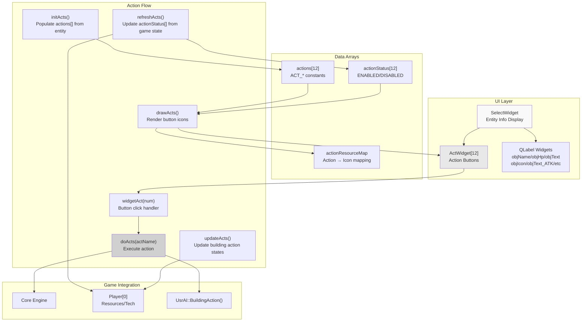
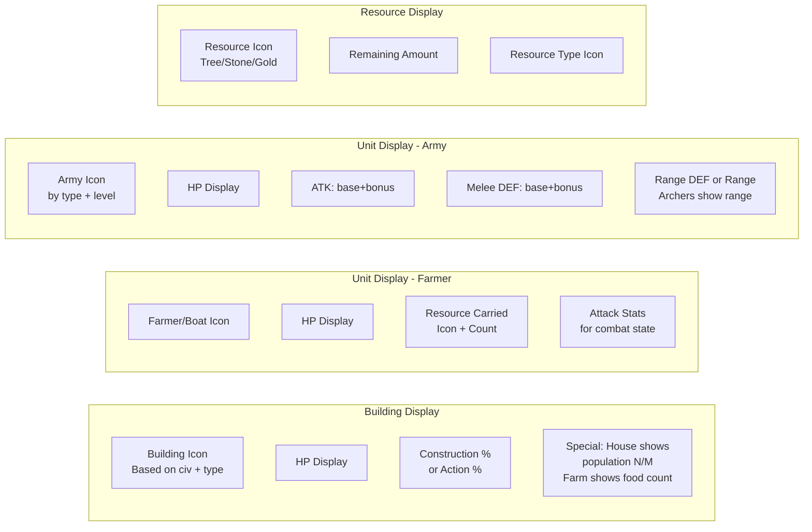
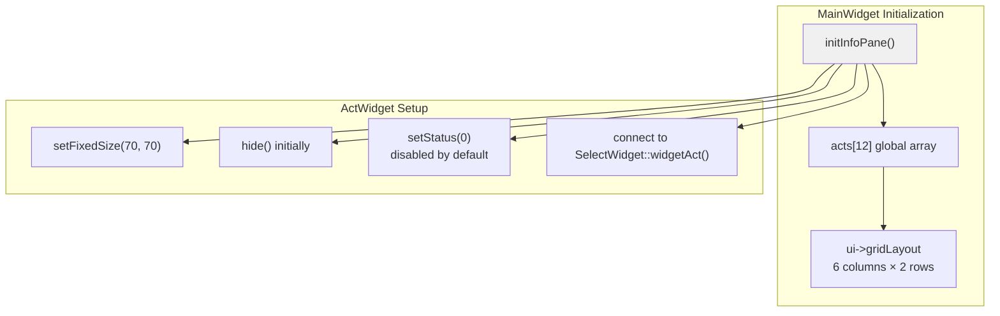
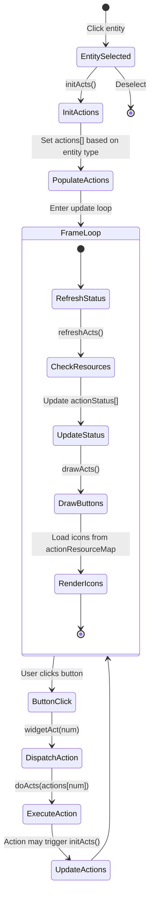
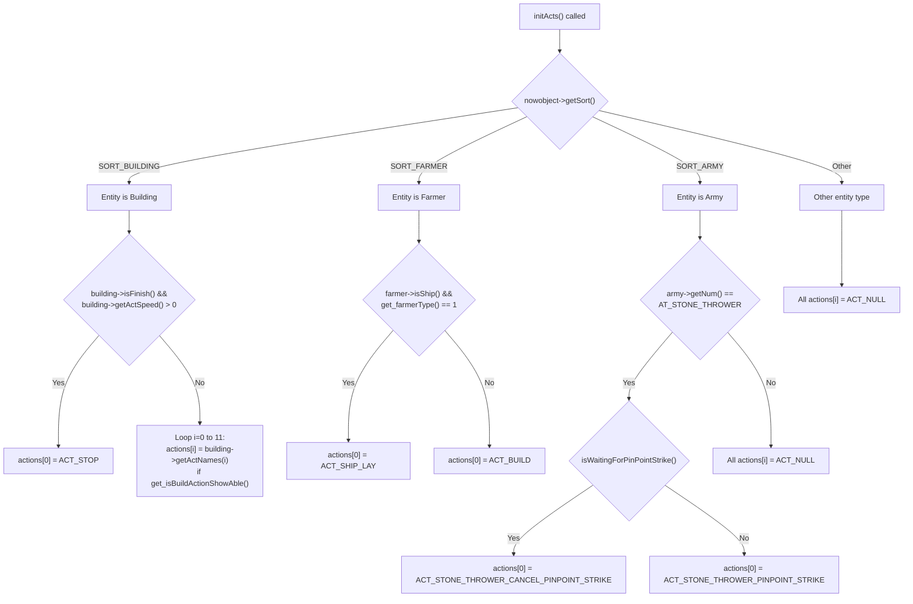
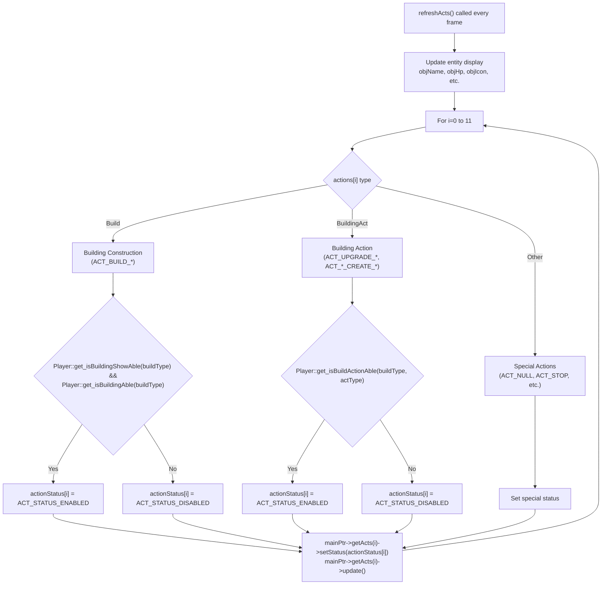
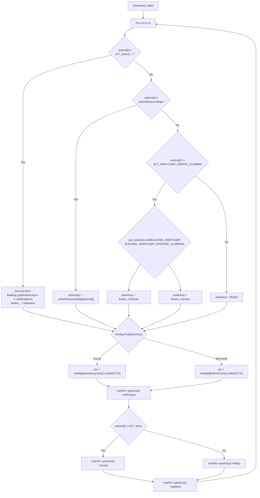
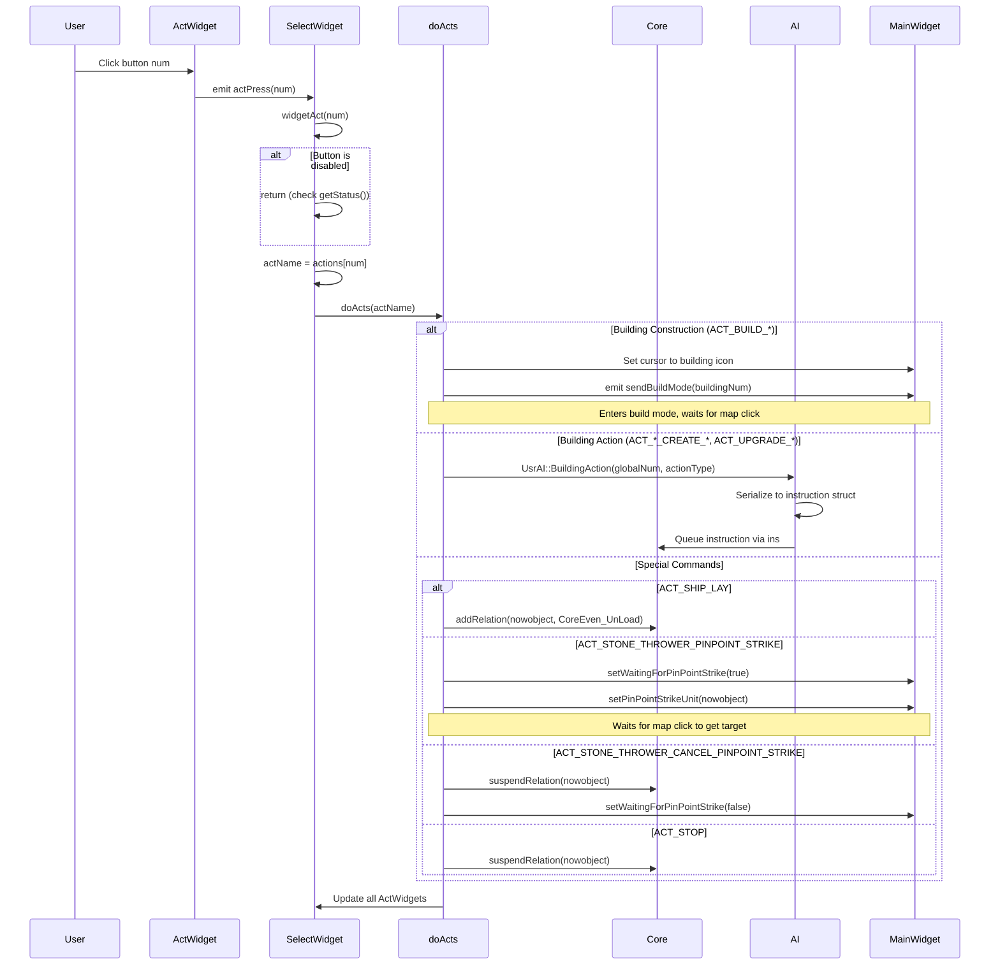
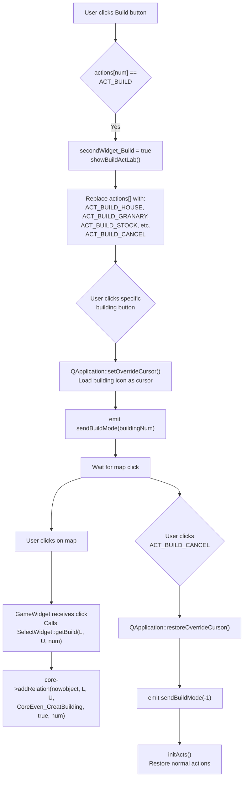
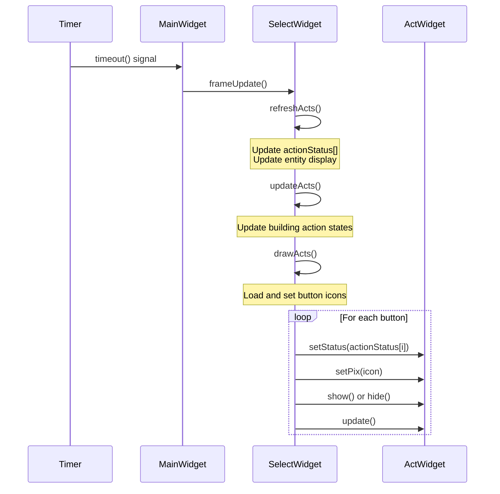

# SelectWidget and Command Panel

<details>
<summary>Relevant source files</summary>

The following files were used as context for generating this wiki page:

- [MainWidget.cpp](MainWidget.cpp)
- [MainWidget.h](MainWidget.h)
- [SelectWidget.cpp](SelectWidget.cpp)

</details>


The SelectWidget and Command Panel system provides the player interface for viewing selected entity information and issuing commands. This system displays unit/building statistics, manages the 12 action buttons that appear when entities are selected, and dispatches player commands to the game Core.

For AI command processing, see [Instruction and Command System](#5.2). For the rendering canvas, see [Rendering and Display](#4.3).

---

## System Overview

SelectWidget is a Qt widget located in the lower-left corner of the game interface that displays information about the currently selected game entity (building, unit, or resource). Below it are 12 action buttons (`ActWidget` instances) that change based on what is selected, allowing the player to train units, research technologies, construct buildings, or issue special commands.



**Sources:** [SelectWidget.cpp:1-1333](), [SelectWidget.h:1-82](), [MainWidget.cpp:1338-1370]()

---

## SelectWidget Display Components

The `SelectWidget` class displays detailed information about the currently selected entity using multiple QLabel widgets arranged in a grid layout.

### Display Elements

| UI Element | Variable | Purpose | Position |
|------------|----------|---------|----------|
| Object Icon | `ui->objIcon` | 110x110 entity icon | Main display |
| Object Name | `ui->objName` | Entity name (Chinese) | Above icon |
| HP Display | `ui->objHp` | "Current/Max" HP | Below name |
| Progress Text | `ui->objText` | Progress % or resource count | Center |
| Small Icon | `ui->objIconSmall` | Resource type or status icon | Next to progress |
| Attack Display | `ui->objText_ATK` + `ui->objIconSmall_ATK` | Attack value | Stats row 1 |
| Melee Defense | `ui->objText_DEF_melee` + `ui->objIconSmall_DEF_melee` | Melee defense value | Stats row 2 |
| Range Defense/Range | `ui->objText_DEF_range` + `ui->objIconSmall_DEF_range` | Ranged defense or range | Stats row 3 |

### Entity-Specific Display Logic



**Display Update:** The `refreshActs()` function updates all display elements every frame based on `nowobject` type.

**Sources:** [SelectWidget.cpp:106-145](), [SelectWidget.cpp:546-905]()

---

## Command Panel Architecture

The command panel consists of 12 `ActWidget` instances initialized in `MainWidget::initInfoPane()` and managed by `SelectWidget`. These buttons are arranged in a 6×2 grid at the bottom-right of the screen.

### ActWidget Array Initialization



Each `ActWidget` has:
- **num**: Button index (0-11)
- **status**: `ACT_STATUS_ENABLED` or `ACT_STATUS_DISABLED` (affects visual rendering)
- **pix**: QPixmap icon loaded from `resMap`
- **actPress(int)** signal: Emitted when clicked

**Sources:** [MainWidget.cpp:1338-1370](), [SelectWidget.cpp:1-19]()

---

## Action System Data Structures

The action system uses three parallel arrays to manage the 12 command buttons:

### Core Data Arrays

```cpp
// In SelectWidget class
int actions[ACT_WINDOW_NUM_FREE];        // Which action each button represents
int actionStatus[ACT_WINDOW_NUM_FREE];   // Whether button is enabled
QMap<int, QString> actionResourceMap;    // Maps action ID to icon resource name
```

### Action Flow State Machine



**Sources:** [SelectWidget.cpp:154-261](), [SelectWidget.cpp:263-544](), [SelectWidget.cpp:1213-1230](), [SelectWidget.cpp:1232-1326]()

---

## Action Initialization (initActs)

The `initActs()` function populates the `actions[]` array based on the selected entity type. This determines which commands appear on the command panel.

### Entity-Specific Action Sets

| Entity Type | Action Sources | Special Logic |
|-------------|----------------|---------------|
| `SORT_BUILDING` | `Building::getActNames(i)` | Shows STOP if building is acting; otherwise shows building-specific actions |
| `SORT_FARMER` | Hardcoded: `ACT_BUILD` (position 0), `ACT_SHIP_LAY` for transport ships | Farmers can construct buildings |
| `SORT_ARMY` | For `AT_STONE_THROWER`: `ACT_STONE_THROWER_PINPOINT_STRIKE` or `ACT_STONE_THROWER_CANCEL_PINPOINT_STRIKE` | Other army units have no actions |
| Others | All `ACT_NULL` | Resources and animals have no actions |

### Building Action Visibility

Buildings use a two-tier visibility system:
1. **Technology Visibility**: `Player::get_isBuildActionShowAble()` checks if tech is researched
2. **Resource Availability**: Checked in `refreshActs()` for graying out buttons



**Sources:** [SelectWidget.cpp:154-261]()

---

## Action Status Refresh (refreshActs)

The `refreshActs()` function runs every frame to update button enabled/disabled states and the information display. This is separate from `initActs()` to avoid recalculating action arrays unnecessarily.

### Status Update Logic



### Resource Checks

The `Player::get_isBuildActionAble()` and `Player::get_isBuildingAble()` methods check:
- Wood, food, stone, gold availability
- Technology prerequisites (from Development system)
- Population capacity
- Building prerequisites (e.g., must have Market before researching market upgrades)

**Sources:** [SelectWidget.cpp:263-544](), [MainWidget.cpp:1213-1230]()

---

## Action Icon Rendering (drawActs)

The `drawActs()` function loads and displays the appropriate icon for each action button from the resource map.

### Icon Selection Logic



**Action Resource Map Sample:**
```cpp
actionResourceMap[ACT_CREATEFARMER] = "Button_Villager";
actionResourceMap[ACT_UPGRADE_AGE] = "ButtonTech_Center1";
actionResourceMap[ACT_BUILD] = "Button_Build";
actionResourceMap[ACT_STONE_THROWER_PINPOINT_STRIKE] = "Button_PinPointStrike";
```

**Sources:** [SelectWidget.cpp:21-77](), [SelectWidget.cpp:1232-1326]()

---

## Action Execution (doActs)

The `doActs()` function is the central dispatcher that executes player commands. It is called when a button is clicked (`widgetAct()`) or when AI issues a command (`aiAct()`).

### Execution Flow



**Sources:** [SelectWidget.cpp:907-913](), [SelectWidget.cpp:915-918](), [SelectWidget.cpp:933-1192]()

---

## Building Mode System

When the player clicks `ACT_BUILD` or any building construction action, the system enters "build mode" where the cursor changes to the building icon and waits for a map click.

### Build Mode Flow



### Building Availability (showBuildActLab)

The `showBuildActLab()` function populates the action panel with building options:

| Button Position | Building Type | Visibility Check |
|----------------|---------------|------------------|
| 0 | `BUILDING_HOME` | Always visible after researched |
| 1 | `BUILDING_GRANARY` | Requires Stone Age |
| 2 | `BUILDING_STOCK` | Requires Tool Age |
| 3 | `BUILDING_MARKET` | Requires market tech |
| 4 | `BUILDING_ARROWTOWER` | Requires tower tech |
| 5 | `BUILDING_ARMYCAMP` | Requires Tool Age |
| 6 | `BUILDING_RANGE` | Requires Tool Age |
| 7 | `BUILDING_STABLE` | Requires Tool Age |
| 8 | `BUILDING_FARM` | Requires farm tech |
| 10 | `BUILDING_COLLAGE` | Requires Bronze Age |
| 9 | `BUILDING_SIEGE` | Requires Bronze Age |
| 11 | `ACT_BUILD_CANCEL` | Always enabled |

**Sources:** [SelectWidget.cpp:963-1007](), [SelectWidget.cpp:1194-1211](), [SelectWidget.cpp:1329-1332]()

---

## Integration with Game Systems

### Connection to Core Engine

The SelectWidget interacts with the `Core` engine through:
- **Direct Relation Creation**: `core->addRelation()` for immediate actions
- **Relation Suspension**: `core->suspendRelation()` for stopping actions

### Connection to AI System

Player actions are processed through the AI system for validation and queuing:
- **Building Actions**: `UsrAI::BuildingAction(globalNum, actionType)` 
- **Unit Actions**: Future implementation
- This ensures player actions follow the same validation as AI commands

### Connection to Player Resources

The `Player` class provides multiple query functions used by SelectWidget:
- `get_isBuildingShowAble(buildType)`: Tech prerequisite check
- `get_isBuildingAble(buildType)`: Resource + tech check
- `get_isBuildActionAble(buildType, actionType)`: Action availability
- `get_isBuildActionShowAble(buildNum, actNum)`: Action visibility
- `get_buildActLevel(buildNum, actNum)`: Upgrade level (for icons)
- `getWood()`, `getFood()`, `getStone()`, `getGold()`: Resource quantities

### Frame Update Cycle



**Sources:** [MainWidget.cpp:1378-1380](), [SelectWidget.cpp:147-152]()

---

## Key Constants and Enumerations

### Action Type Constants

Action types are defined in `config.h` and referenced throughout the system:

| Constant Prefix | Purpose | Example |
|----------------|---------|---------|
| `ACT_BUILD_*` | Building construction | `ACT_BUILD_HOUSE`, `ACT_BUILD_GRANARY` |
| `ACT_CREATEFARMER` | Unit creation from Center | Creates farmer unit |
| `ACT_UPGRADE_*` | Technology research | `ACT_UPGRADE_AGE`, `ACT_UPGRADE_WOOD` |
| `ACT_*_CREATE_*` | Unit training | `ACT_ARMYCAMP_CREATE_CLUBMAN` |
| `ACT_*_UPGRADE_*` | Unit upgrades | `ACT_ARMYCAMP_UPGRADE_CLUBMAN` |
| `ACT_STOP` | Stop current action | Cancels building/research |
| `ACT_BUILD` | Enter build mode | Shows building menu |
| `ACT_BUILD_CANCEL` | Exit build mode | Restores normal actions |
| `ACT_NULL` | No action assigned | Button is hidden |

### Action Status Values

```cpp
#define ACT_STATUS_ENABLED 1   // Button is clickable
#define ACT_STATUS_DISABLED 0  // Button is grayed out
```

**Sources:** [config.h]() (referenced), [SelectWidget.cpp:34-91]()

---

## Special Features

### Stone Thrower Pinpoint Strike

The stone thrower unit has a unique two-step action system:

1. **Activation**: Click `ACT_STONE_THROWER_PINPOINT_STRIKE`
   - Sets `MainWidget::waitingForPinPointStrike = true`
   - Button changes to `ACT_STONE_THROWER_CANCEL_PINPOINT_STRIKE`
   - Waits for map click

2. **Target Selection**: Click on map
   - Processed in `Core::manageMouseEvent()`
   - Creates `CoreEven_PinPointStrike` relation with target coordinates

3. **Cancellation**: Click `ACT_STONE_THROWER_CANCEL_PINPOINT_STRIKE`
   - Calls `core->suspendRelation(unit)`
   - Resets waiting state

**Sources:** [SelectWidget.cpp:1122-1167](), [MainWidget.h:52-60]()

### Dynamic Icon Selection by Civilization

Building construction buttons display different icons based on the player's current civilization age:

```cpp
// Example from drawActs()
int civ = mainPtr->player[0]->getCiv();  // 1=Stone, 2=Tool, 3=Bronze
string base = Building::getBuiltname(civ, 0, buildingNum);
string key = "Button_" + base;
```

This ensures that a Tool Age house shows the wooden building icon, while a Bronze Age house shows the brick building icon.

**Sources:** [SelectWidget.cpp:1243-1276]()

### Clubman Upgrade Level Icons

The clubman training button shows different icons based on the upgrade level:
- Level 0: `Button_Clubman` (basic clubman)
- Level 1: `Button_Axeman` (upgraded to axeman)

This is queried via `Player::get_buildActLevel(BUILDING_ARMYCAMP, BUILDING_ARMYCAMP_UPGRADE_CLUBMAN)`.

**Sources:** [SelectWidget.cpp:1281-1296]()