# Map Editor

<details>
<summary>Relevant source files</summary>

The following files were used as context for generating this wiki page:

- [Editor.ui](Editor.ui)
- [MainWidget.cpp](MainWidget.cpp)
- [MainWidget.h](MainWidget.h)
- [map.njust](map.njust)

</details>


The Map Editor is an integrated level design tool that enables real-time modification of game maps. It provides terrain editing, object placement, AI behavior configuration, and map serialization capabilities. The editor operates within the same event loop as the game, allowing instant preview of changes.

For information about loading maps and map data structures, see [Map Structure](#6.1). For details on area definitions used in AI behavior, see [Area Management System](#7.1).

## Overview and Architecture

The Map Editor is embedded into `MainWidget` rather than being a separate application. It shares the game's rendering pipeline and coordinate systems, enabling immediate visual feedback during editing.

### Core Components

```mermaid
graph TB
    subgraph "Editor UI (Editor.ui)"
        EditorWindow["Editor Window<br/>(QWidget)"]
        ExportBtn["export_map<br/>(QPushButton)"]
        DeleteBtn["delete_object<br/>(QPushButton)"]
        MouseBtn["mouse_button<br/>(QPushButton)"]
        LandType["land_type<br/>(QComboBox)"]
        LandHeight["land_height<br/>(QComboBox)"]
        PlayerBuild["player_building_and_source<br/>(QComboBox)"]
        PlayerHuman["player_human<br/>(QComboBox)"]
        AIBuild["ai_building_and_resource<br/>(QComboBox)"]
        AIHuman["ai_human<br/>(QComboBox)"]
        Resource["resource<br/>(QComboBox)"]
        Animal["animal<br/>(QComboBox)"]
        PatrolArea["patrolArea<br/>(QComboBox)"]
        EnemyStatus["enemyStatus<br/>(QComboBox)"]
    end
    
    subgraph "MainWidget Controller"
        CurrentSelected["currentSelected<br/>(EditorElement enum)"]
        UpdateEditor["updateEditor()<br/>Mouse Event Handler"]
        ExportState["ExportCurrentState()<br/>JSON Serialization"]
    end
    
    subgraph "Edit Operations"
        TerrainOps["Terrain Functions<br/>HigherLand/LowerLand<br/>MakeOcean/MakeGrassland"]
        ObjectOps["Object Creation<br/>MakeBuilding/MakeHuman<br/>MakeTree/MakeAnimal<br/>MakeStaticRes"]
        ClearOps["clearArea()<br/>Object Deletion"]
    end
    
    subgraph "Area Management"
        RectArea["RectArea<br/>rectArea"]
        CircleArea["CircleArea<br/>circleArea"]
        LineArea["LineArea<br/>lineArea"]
        SelectedUnits["selectedUnits<br/>vector<Coordinate*>"]
    end
    
    subgraph "AI Behavior"
        EnemyStatusMap["enemyStatusMap<br/>map<Coordinate*, string>"]
    end
    
    EditorWindow --> ExportBtn
    EditorWindow --> DeleteBtn
    EditorWindow --> MouseBtn
    EditorWindow --> LandType
    EditorWindow --> LandHeight
    EditorWindow --> PlayerBuild
    EditorWindow --> PlayerHuman
    EditorWindow --> AIBuild
    EditorWindow --> AIHuman
    EditorWindow --> Resource
    EditorWindow --> Animal
    EditorWindow --> PatrolArea
    EditorWindow --> EnemyStatus
    
    LandType --> CurrentSelected
    LandHeight --> CurrentSelected
    PlayerBuild --> CurrentSelected
    PlayerHuman --> CurrentSelected
    AIBuild --> CurrentSelected
    AIHuman --> CurrentSelected
    Resource --> CurrentSelected
    Animal --> CurrentSelected
    PatrolArea --> CurrentSelected
    EnemyStatus --> CurrentSelected
    
    CurrentSelected --> UpdateEditor
    UpdateEditor --> TerrainOps
    UpdateEditor --> ObjectOps
    UpdateEditor --> ClearOps
    
    ExportBtn --> ExportState
    DeleteBtn --> CurrentSelected
    MouseBtn --> CurrentSelected
    
    PatrolArea --> RectArea
    PatrolArea --> CircleArea
    PatrolArea --> LineArea
    PatrolArea --> SelectedUnits
    
    EnemyStatus --> EnemyStatusMap
```

**Sources:** [MainWidget.h:62-129](), [MainWidget.cpp:142-275](), [Editor.ui:1-449]()

### Initialization Sequence

The editor is initialized in `MainWidget`'s constructor after the game core systems are set up:

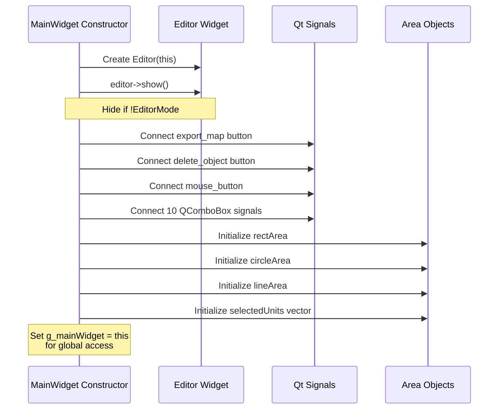

**Sources:** [MainWidget.cpp:142-275](), [MainWidget.h:62-67]()

## Edit Mode System

The editor uses a state machine approach where `currentSelected` (type `EditorElement`) determines the current editing mode. Each combo box or button selection updates this state.

### EditorElement Enumeration

| Category | Enum Values | Description |
|----------|-------------|-------------|
| **Tool Modes** | `NORMAL_MOUSE`, `DELETEOBJECT` | Basic mouse and deletion |
| **Terrain Type** | `FLAT`, `OCEAN` | Terrain material |
| **Terrain Height** | `HIGHTERLAND`, `LOWERLAND` | Height modification |
| **Player Buildings** | `PLAYERDOWNTOWN`, `PLAYERHOME`, `PLAYERREPOSITORY`, `PLAYERARROWTOWER`, `PLAYERDOCK`, `PLAYERBARRACKS`, `PLAYERFISHERY` | Player structures |
| **Player Units** | `PLAYERFARMER`, `PLAYERCLUBMAN`, `PLAYERAXEMAN`, `PLAYERSCOUT`, `PLAYERBOWMAN`, `PLAYERFISHINGBOAT`, `PLAYERTRANSPORTSHIP`, `PLAYERWARSHIP` | Player units |
| **Enemy Buildings** | `AIARROWTOWER`, `AIWARSHIP` | Enemy structures |
| **Enemy Units** | `AICLUBMAN`, `AIAXEMAN`, `AISCOUT`, `AIBOWMAN`, `AIPRIEST`, `AIHOPLITE`, `AICOMPARCHER`, `AIBROADSWORDSMAN`, `AICHARIOT`, `AICHARIOTARCHER`, `AISTONETHROWER` | Enemy units |
| **Resources** | `TREE`, `STONM`, `GOLDORE` | Static resources |
| **Animals** | `GAZELLE`, `LION`, `ELEPHANT` | Wildlife |
| **Area Tools** | `RECT_AREA`, `CIRCLE_AREA`, `LINE_AREA`, `PATROL_RECT_AREA`, `PATROL_CIRCLE_AREA`, `PATROL_LINE_AREA` | Area definition |
| **AI Behavior** | `ENEMY_STATUS_ATTACK`, `ENEMY_STATUS_DEFEND` | Enemy stance |

**Sources:** [MainWidget.h:80-129]()

### Mode Selection Flow

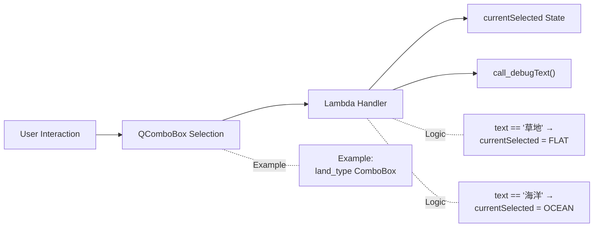

Each combo box uses Qt's `currentIndexChanged` signal with a lambda handler that maps the selected text to an `EditorElement` enum value. For example:

**Sources:** [MainWidget.cpp:164-175]() for terrain type, [MainWidget.cpp:177-189]() for player buildings

## Mouse Event Processing

The `updateEditor()` function is called from the main event loop to process mouse interactions in editor mode. It distinguishes between drag operations (hold) and click operations (single click).

### updateEditor() Control Flow

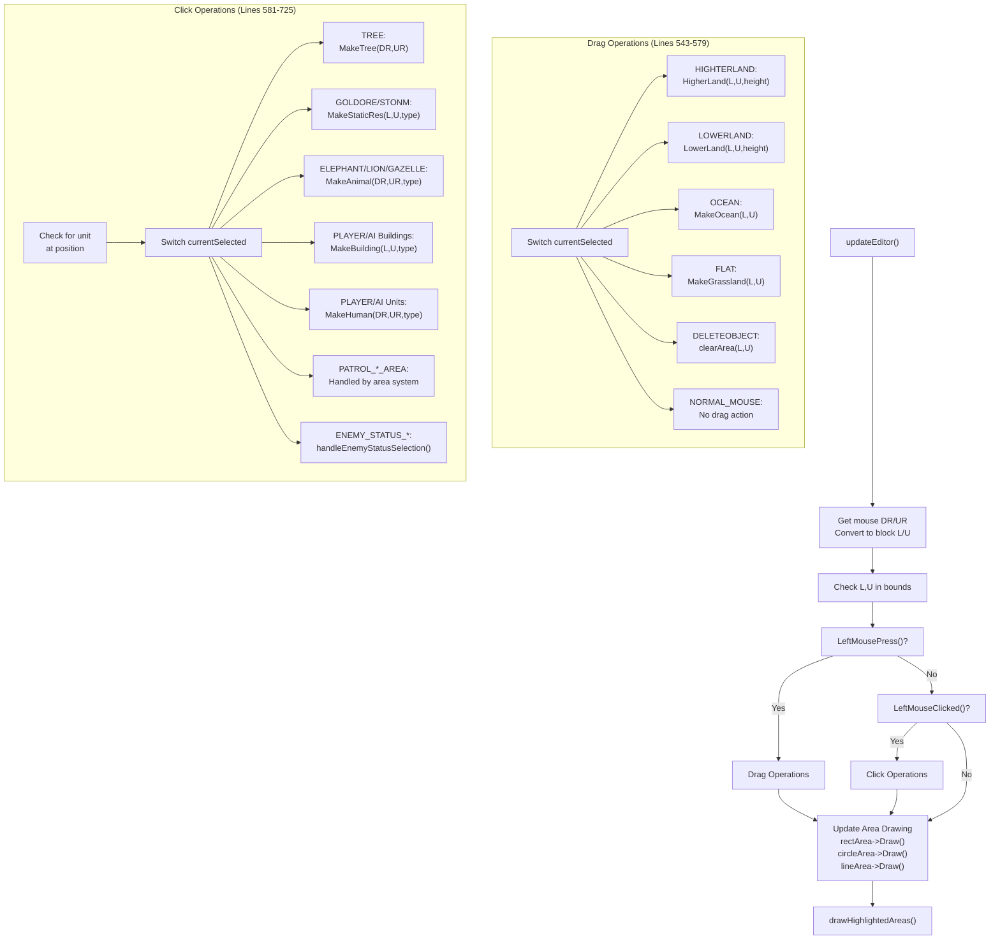

**Sources:** [MainWidget.cpp:528-740]()

### Unit Selection with Ctrl

The editor supports selecting enemy units with Ctrl key for area assignment:

**Sources:** [MainWidget.cpp:584-603]()

## Terrain Modification

Terrain editing operates on 3×3 block regions centered at the mouse position. The system enforces constraints to prevent invalid terrain configurations.

### Height Modification

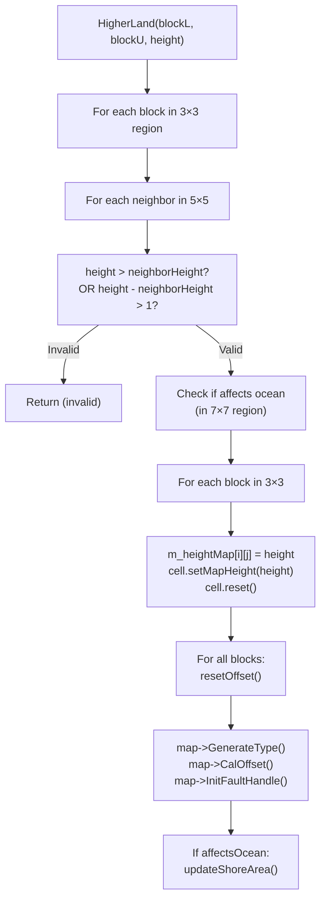

The height modification functions enforce that adjacent blocks cannot differ by more than 1 height level. This prevents visual artifacts and ensures smooth terrain transitions.

**Sources:** [MainWidget.cpp:881-1003]() for HigherLand/LowerLand

### Terrain Type Modification

| Function | Lines | Operation | Side Effects |
|----------|-------|-----------|--------------|
| `MakeOcean()` | 1005-1034 | Sets height to `MAPHEIGHT_OCEAN`, type to `MAPTYPE_OCEAN`, clears offsets | Calls `updateShoreArea()` to redraw beaches |
| `MakeGrassland()` | 1068-1107 | Converts ocean to flat land, sets `MAPTYPE_FLAT` and `MAPPATTERN_GRASS` | Calls `updateShoreArea()`, updates only local offsets |
| `DeleteOcean()` | 1037-1066 | Converts ocean to flat, resets type via `ResetMapType()` | Similar to MakeGrassland |

All terrain modification functions update the underlying `m_heightMap` array and call map regeneration functions to update visual representation.

**Sources:** [MainWidget.cpp:1005-1107]()

## Object Placement

Object creation functions validate placement locations and add entities to appropriate containers.

### Object Creation Functions

```mermaid
graph TB
    subgraph "MakeTree(DR, UR)"
        T1["Convert to block coords"]
        T2["Check if tree exists<br/>at location"]
        T3["map->addAnimal(0, DR, UR)"]
        T1 --> T2
        T2 -->|None found| T3
    end
    
    subgraph "MakeStaticRes(L, U, type)"
        S1["Check for duplicate<br/>at blockL, blockU"]
        S2["Switch on type"]
        S3["GOLDORE: addStaticRes(2)<br/>STONM: addStaticRes(1)<br/>PLAYERFISHERY: addStaticRes(3)"]
        S1 -->|None found| S2
        S2 --> S3
    end
    
    subgraph "MakeBuilding(L, U, type)"
        B1["Check both players'<br/>building lists"]
        B2["Switch on type"]
        B3["player[0/1]->addBuilding<br/>(buildingType, L, U, 100)"]
        B1 -->|None found| B2
        B2 --> B3
    end
    
    subgraph "MakeHuman(DR, UR, type)"
        H1["Convert to block coords"]
        H2["Check map terrain type"]
        H3["Validate ship on water<br/>OR land unit on land"]
        H4["Switch on type"]
        H5["player[0/1]->addFarmer<br/>OR addArmy(armyType)"]
        H1 --> H2
        H2 --> H3
        H3 -->|Valid| H4
        H3 -->|Invalid| H6["call_debugText error"]
        H4 --> H5
    end
```

**Sources:** [MainWidget.cpp:1109-1152]() for tree/static resources, [MainWidget.cpp:1154-1181]() for buildings, [MainWidget.cpp:1183-1260]() for units

### Terrain Validation for Units

`MakeHuman()` enforces terrain compatibility:

- Ships (`AIWARSHIP`, `PLAYERFISHINGBOAT`, `PLAYERTRANSPORTSHIP`) require `MAPTYPE_OCEAN`
- Land units require non-ocean terrain
- Placement is rejected with error message if terrain is incompatible

**Sources:** [MainWidget.cpp:1196-1214]()

## Object Deletion

The `clearArea()` function removes all objects within a radius of the target block coordinate.

### Deletion Process

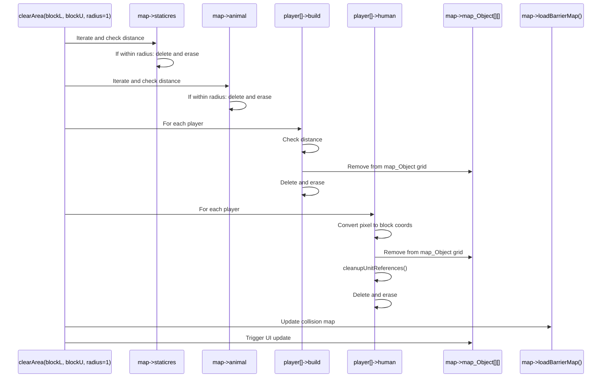

The function carefully removes objects from both their container lists and the `map_Object` spatial grid to prevent dangling pointers. For units, it also calls `cleanupUnitReferences()` to remove them from selection lists and area relationships.

**Sources:** [MainWidget.cpp:742-847]()

## Area Definition System

The editor allows defining patrol areas and movement constraints for units. This is accomplished through three area types: `RectArea`, `CircleArea`, and `LineArea`.

### Area Assignment Workflow

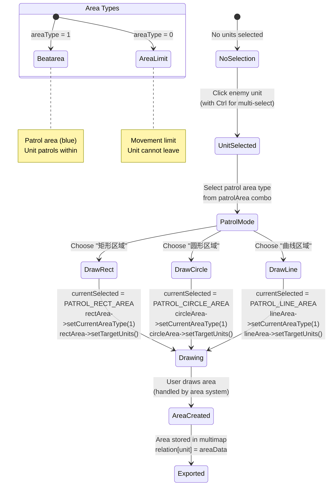

**Sources:** [MainWidget.cpp:236-267]() for patrol area setup

### Area Data Structures

Each area type stores its geometric data in a specific structure:

| Area Type | Data Structure | Key Fields |
|-----------|----------------|------------|
| `RectArea` | `RectAreaData` | `dr`, `ur` (center), `w`, `h` (dimensions), `areaType` |
| `CircleArea` | `CircleAreaData` | `dr`, `ur` (center), `rad` (radius), `areaType` |
| `LineArea` | `LineAreaData` | `data` (vector of points), `areaType` |

The `areaType` field distinguishes between patrol areas (1) and movement limit areas (0). This information is used both during gameplay and when exporting the map.

**Sources:** [MainWidget.cpp:289-363]() in ExportCurrentState

## Enemy Status Configuration

Enemy units can be assigned behavioral states through the `enemyStatus` combo box. This affects their AI decision-making during gameplay.

### Enemy Status Map

The `enemyStatusMap` (type `map<Coordinate*, string>`) stores the association between enemy units and their status strings:

- `"attack"`: Aggressive behavior, actively seeks targets
- `"defend"`: Defensive behavior, holds position

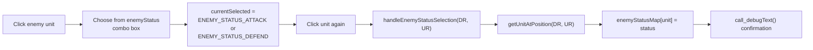

**Sources:** [MainWidget.cpp:258-267]() for combo box handler, [MainWidget.h:73]() for enemyStatusMap declaration

## Map Export and Import

The editor serializes the entire game state to JSON format using the `ExportCurrentState()` function. This creates a `.njust` file that can be loaded at game startup.

### Export Data Structure

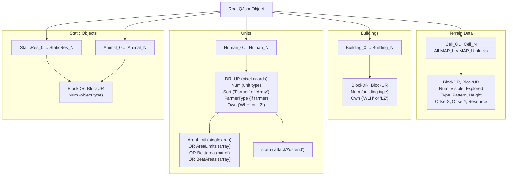

**Sources:** [MainWidget.cpp:279-525]()

### Area Export Format

Areas are serialized with their type information:

```json
{
  "Type": "RectArea" | "CircleArea" | "LineArea",
  "AreaName": "Beatarea" | "AreaLimit",
  // Type-specific fields:
  // RectArea: "DR", "UR", "W", "H"
  // CircleArea: "DR", "UR", "R"
  // LineArea: "Point" (array of [x,y] pairs)
}
```

For units with multiple areas, the export uses array fields (`BeatAreas`, `AreaLimits`) while maintaining backward compatibility by using singular fields for single areas.

**Sources:** [MainWidget.cpp:317-363]() for JsonAreaLimit function, [MainWidget.cpp:444-490]() for multi-area export

### Export Button Handler

The export functionality is connected via Qt signal:

**Sources:** [MainWidget.cpp:155-158]()

## UI Controls Reference

### Control Layout

| Control | Type | Purpose | Lines in Editor.ui |
|---------|------|---------|-------------------|
| `export_map` | QPushButton | Triggers map export to `map.njust` | 16-28 |
| `delete_object` | QPushButton | Activates deletion mode | 322-334 |
| `mouse_button` | QPushButton | Returns to normal mouse mode | 399-411 |
| `land_type` | QComboBox | Select grass/ocean terrain | 335-359 |
| `land_height` | QComboBox | Raise/lower terrain height | 29-53 |
| `player_building_and_source` | QComboBox | Place player structures | 54-118 |
| `player_human` | QComboBox | Place player units | 149-188 |
| `ai_building_and_resource` | QComboBox | Place enemy structures | 119-148 |
| `ai_human` | QComboBox | Place enemy units | 189-258 |
| `resource` | QComboBox | Place trees, stone, gold | 259-291 |
| `animal` | QComboBox | Place gazelles, lions, elephants | 292-321 |
| `patrolArea` | QComboBox | Define patrol areas (disabled until unit selected) | 360-398 |
| `enemyStatus` | QComboBox | Set AI behavior (disabled until unit selected) | 412-445 |

**Sources:** [Editor.ui:1-449]()

### Enable/Disable Logic

The `patrolArea` and `enemyStatus` combo boxes are initially disabled and enabled only when enemy units are selected. This prevents setting areas or statuses without a target unit.

**Sources:** [Editor.ui:361-363]() for patrolArea enabled property, [Editor.ui:413-415]() for enemyStatus enabled property

## Integration with Game Systems

### Coordinate System Usage

The editor works with two coordinate systems:

- **Block coordinates** (`blockL`, `blockU`): Used for terrain modification and building placement
- **Detail coordinates** (`DR`, `UR`): Used for unit and resource placement

Conversion occurs in `updateEditor()`:

**Sources:** [MainWidget.cpp:538-540]()

### Interaction with Core Systems

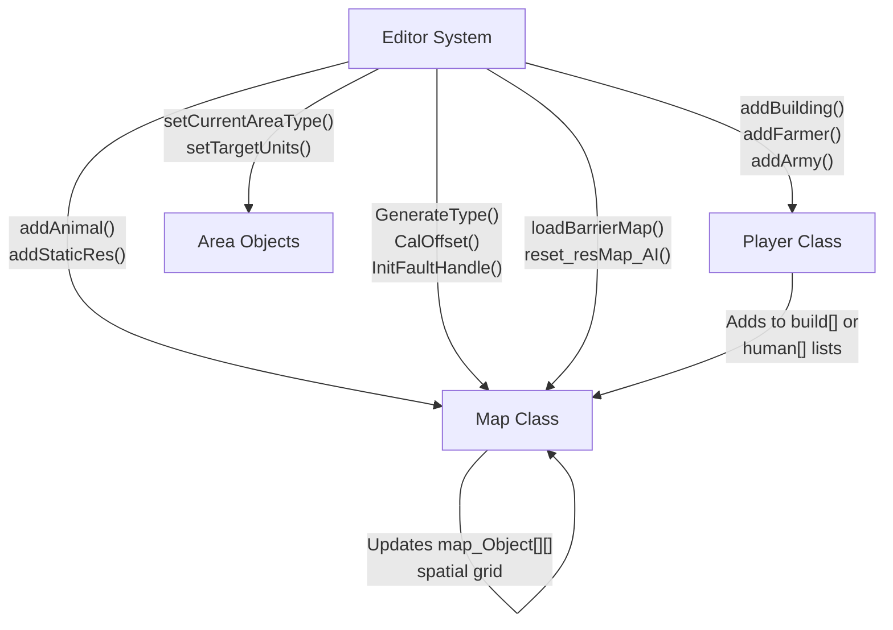

When objects are created through the editor, they are added to the same data structures used during normal gameplay. This ensures that edited maps behave identically to programmatically generated content.

**Sources:** [MainWidget.cpp:1109-1260]() for object creation flow

### Map Regeneration

After terrain modifications, the map must regenerate its visual representation:

1. `GenerateType()`: Recalculates terrain types based on height
2. `CalOffset()`: Recomputes isometric rendering offsets
3. `InitFaultHandle()`: Updates terrain transitions
4. `updateShoreArea()`: Redraws beaches (when ocean is involved)

**Sources:** [MainWidget.cpp:934-1002]() for regeneration calls

## Debug and Feedback

The editor provides visual feedback through the debug text system:

- Green text: Tool selection confirmations
- Red text: Error messages (e.g., invalid placement)
- Blue/Yellow text: Status confirmations
- Cyan/Magenta text: Area processing details

All editor operations log their actions using `call_debugText()` with appropriate color coding.

**Sources:** [MainWidget.cpp:160-267]() for debug output calls throughout UI handlers