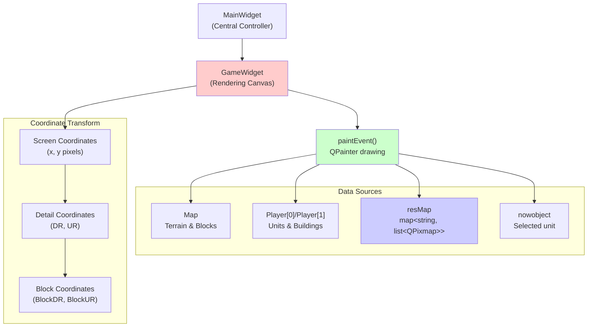
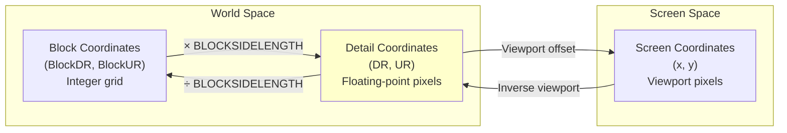
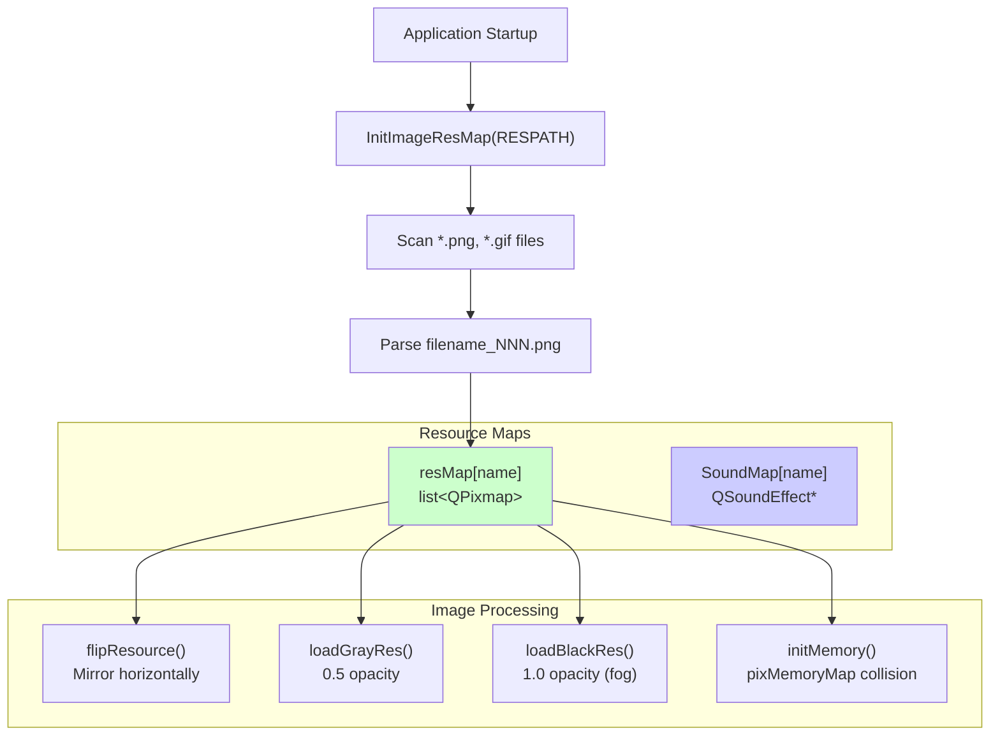
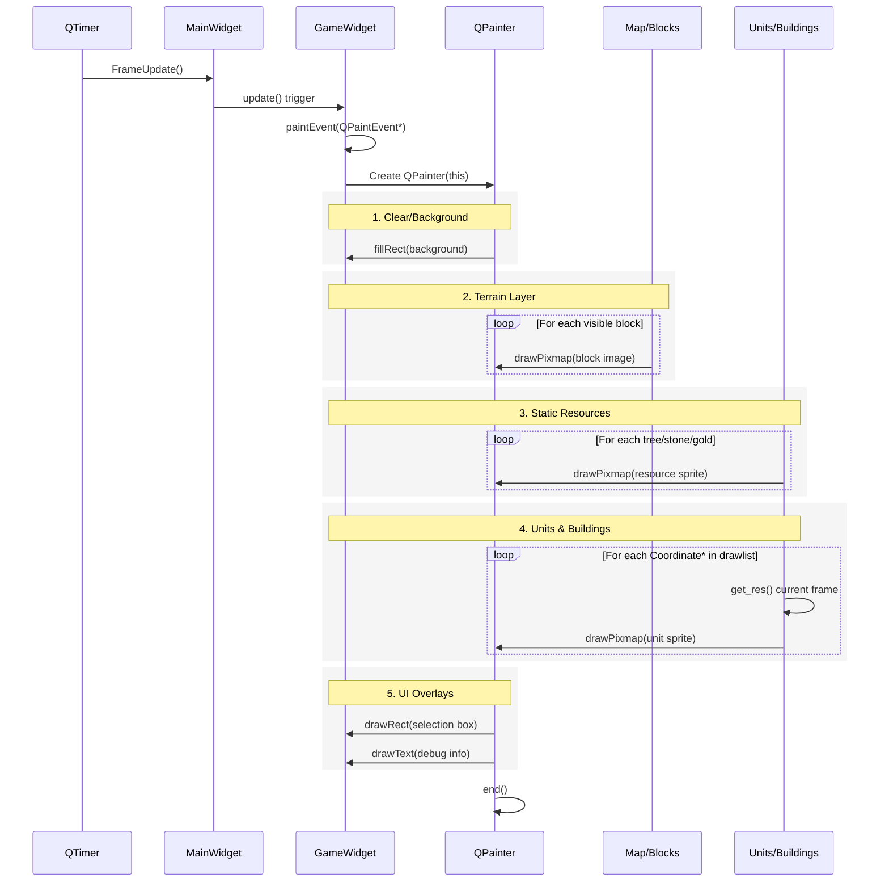
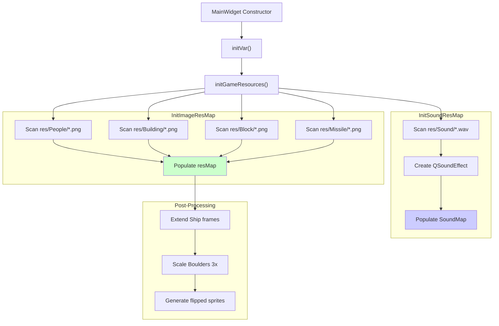

# Rendering and Display

<details>
<summary>Relevant source files</summary>

The following files were used as context for generating this wiki page:

- [GlobalVariate.cpp](GlobalVariate.cpp)
- [GlobalVariate.h](GlobalVariate.h)
- [MainWidget.cpp](MainWidget.cpp)
- [README.md](README.md)

</details>


This page documents the visual rendering system that draws the game world, units, buildings, and terrain to the screen. It covers the `GameWidget` rendering canvas, coordinate transformation systems, resource loading mechanisms, and the frame-by-frame rendering pipeline.

**Scope**: This page focuses on how visual content is displayed. For user input processing, see [Event Handling](#4.4). For the map data structures being rendered, see [Map Structure](#6.1). For UI panels and controls, see [SelectWidget and Command Panel](#4.1).

---

## GameWidget Architecture

The `GameWidget` class serves as the primary rendering canvas where all game visuals are drawn. It inherits from `QWidget` and overrides `paintEvent()` to perform custom rendering each frame.



**Diagram: GameWidget Rendering Architecture**

The `GameWidget` is instantiated in `MainWidget` and occupies the central area of the game window. It accesses global data structures like `g_Object` (all game objects by SN), `resMap` (image resources), and player unit/building lists to determine what to draw.

**Sources**: [MainWidget.cpp:94-276](), [GlobalVariate.h:514-525](), [README.md:168-169]()

---

## Coordinate Systems

The game uses three coordinate systems that transform between each other:

| System | Unit | Range | Purpose |
|--------|------|-------|---------|
| **Block Coordinates** | Blocks | `[0, MAP_L) × [0, MAP_U)` | Terrain grid indexing, building placement |
| **Detail Coordinates** | Pixels (DR/UR) | `[0, MAP_L × BLOCKSIDELENGTH) × [0, MAP_U × BLOCKSIDELENGTH)` | Precise unit positioning, movement targets |
| **Screen Coordinates** | Pixels (x/y) | `[0, GAMEWIDGET_WIDTH) × [0, GAMEWIDGET_HEIGHT)` | Mouse input, viewport rendering |



**Diagram: Coordinate System Transformations**

### Block Coordinates

Block coordinates represent the discrete tile grid. Each block has side length `BLOCKSIDELENGTH` (typically 64 pixels). The map contains `MAP_L × MAP_U` blocks (e.g., 120 × 120).

**Key Functions**:
- Conversion to detail center: `trans_BlockPointToDetailCenter(blockPos)` returns `(blockPos + 0.5) × BLOCKSIDELENGTH` [GlobalVariate.cpp:1089-1092]()

### Detail Coordinates

Detail coordinates (DR, UR) provide precise positioning within the world. Units move along fractional pixel positions, and coordinates are stored as `double`.

**Coordinate Naming**:
- `DR`: "Down-Right" diagonal coordinate
- `UR`: "Up-Right" diagonal coordinate

This diagonal coordinate system aligns with the isometric rendering perspective.

### Screen Coordinates

Screen coordinates represent pixel positions within the `GameWidget` viewport. The viewport can pan and zoom, requiring transformation functions to convert between screen and world space.

**Transformation Methods** (in `GameWidget`):
- `TranGlobalPosToDR(int x, int y) -> double`: Screen to detail DR
- `TranGlobalPosToUR(int x, int y) -> double`: Screen to detail UR

**Sources**: [GlobalVariate.cpp:1089-1092](), [MainWidget.cpp:538-540](), [config.h]()

---

## Resource Management

Visual assets are loaded at startup and stored in global maps. The system supports multi-frame animations and generates derived resources (flipped images, fog-of-war overlays).

### Resource Loading Pipeline



**Diagram: Resource Loading and Processing Pipeline**

### Image Resource Map Structure

The `resMap` global variable stores all sprite sheets and animations:

```cpp
map<std::string, std::list<QPixmap>> resMap;
```

**Naming Convention**: Files like `Farmer_Down_001.png`, `Farmer_Down_002.png` are grouped into `resMap["Farmer_Down"]` with sequential frames.

**Key Loading Functions**:
- `InitImageResMap(QString path)`: Scans directory, parses filenames, populates `resMap` [GlobalVariate.cpp:590-697]()
- `InitSoundResMap(QString path)`: Loads WAV files into `SoundMap` [GlobalVariate.cpp:698-774]()

### Collision Memory Maps

Each `QPixmap` in `resMap` has an associated `pixMemoryMap` that marks opaque pixels for collision detection:

```cpp
struct ImageResource {
    QPixmap pix;
    pixMemoryMap memorymap;
};
```

The `pixMemoryMap` is a 1D vector representing a 2D bitmap where `1` indicates a solid pixel and `0` indicates transparent.

**Generation**: `initMemory(ImageResource* res)` analyzes the `QImage` alpha channel and sets memory map bits, expanding 1 pixel in all directions for padding [GlobalVariate.cpp:970-1013]()

**Sources**: [GlobalVariate.cpp:590-697](), [GlobalVariate.cpp:698-774](), [GlobalVariate.cpp:970-1013](), [GlobalVariate.h:1002-1084]()

---

## Rendering Pipeline

Each frame, the `GameWidget::paintEvent()` method executes the following rendering pipeline:

### Frame Rendering Sequence



**Diagram: Frame Rendering Sequence**

### Layer Ordering

Rendering proceeds in strict order to ensure correct depth:

1. **Background/Clear**: Fill with background color
2. **Terrain Blocks**: Draw all `Block` tiles from `map->cell[L][U]`
3. **Static Resources**: Draw `StaticRes` (trees, stone piles, gold ore)
4. **Dynamic Objects**: Draw units and buildings from `drawlist`
   - Buildings render at block positions
   - Units render at detail (DR, UR) positions
   - Sprites selected from animation frame based on `nowres` counter
5. **UI Overlays**: Selection rectangles, health bars, fog-of-war, debug text

### Animation Frame Selection

Each `Coordinate` subclass maintains a `nowres` counter that cycles through its sprite list:

**Example from Farmer**:
- `res_Stand_Down`, `res_Stand_Up`, etc. contain standing animations
- `res_Walk_Down`, `res_Walk_Up`, etc. contain walking animations
- `nowres` increments each frame and wraps: `nowres = (nowres + 1) % frameCount`
- Current sprite: `res_current->at(nowres % res_current->size())`

**Frame Rate Control**: The `NOWRES_TIMER_*` constants in `config.json` control how many game frames pass before advancing one animation frame (e.g., `NOWRES_TIMER_FARMER = 3` means animate every 3 frames).

**Sources**: [GlobalVariate.cpp:551-563](), [README.md:168-169]()

---

## Camera and Viewport Management

The game viewport can pan and scroll to follow the player's view across the large map.

### Viewport State

| Variable | Type | Purpose |
|----------|------|---------|
| `MidX`, `MidY` | `int` | Current center of viewport in screen pixels |
| `MAP_LSide[2]`, `MAP_USide[2]` | `int[2]` | Visible bounds in block coordinates |
| `mapmoveFrequency` | `int` | Speed of viewport panning |

**Global Variables**: Declared in [GlobalVariate.h:516-519]()

### Viewport Movement

Users move the viewport by:
- **Mouse at screen edges**: Detected in event filter, triggers continuous scrolling
- **Keyboard arrow keys**: Discrete viewport shifts
- **Minimap clicks**: Jump to clicked region

**Movement Implementation**:
```
MidX += deltaX * mapmoveFrequency
MidY += deltaY * mapmoveFrequency
```

The `mapmoveFrequency` is initialized to `INITIAL_FREQUENCY` from `config.json` and can be adjusted at runtime.

### Visible Region Calculation

Before rendering, the system calculates which blocks are visible:

```
MAP_LSide[0] = max(0, (MidX - GAMEWIDGET_WIDTH/2) / BLOCKSIDELENGTH)
MAP_LSide[1] = min(MAP_L, (MidX + GAMEWIDGET_WIDTH/2) / BLOCKSIDELENGTH + 1)
MAP_USide[0] = max(0, (MidY - GAMEWIDGET_HEIGHT/2) / BLOCKSIDELENGTH)
MAP_USide[1] = min(MAP_U, (MidY + GAMEWIDGET_HEIGHT/2) / BLOCKSIDELENGTH + 1)
```

Only blocks and objects within these bounds are rendered, optimizing performance.

**Sources**: [GlobalVariate.h:516-519](), [config.json]()

---

## Visual Effects

The rendering system applies various visual effects for gameplay feedback and atmosphere.

### Fog of War

Unexplored and out-of-sight areas are darkened using pre-generated black overlay sprites.

**Implementation**:
- Each unit type has `blackres` variants generated by `loadBlackRes()` [GlobalVariate.cpp:1055-1066]()
- `applyTransparencyEffect(pixmap, 1.0)` creates fully opaque black version [GlobalVariate.cpp:776-810]()
- When rendering units/buildings outside player vision, use black sprite instead of color sprite

**Vision System**:
- Each `Block` has `Visible` (currently in sight) and `Explored` (previously seen) flags
- `map->cell[L][U].Visible` updated each frame based on unit vision ranges
- Fog rendering: Unexplored = black, Explored but not Visible = gray, Visible = full color

### Selection Highlights

Selected units and buildings are highlighted:

**Methods**:
- Overlays: Draw colored rectangles or circles around selected objects
- Sprite Swapping: Some objects have `grayres` variants for inactive/unselected state [GlobalVariate.cpp:1042-1053]()

**Selection State**: Stored in global `nowobject` pointer and `selectedUnits` list in `MainWidget` [MainWidget.cpp:145]()

### Building Construction Animation

Buildings under construction display progressively:

**Stages**:
1. **Foundation**: Partial sprite showing base
2. **Progress**: Intermediate construction states
3. **Complete**: Full building sprite

The `Building::Percent` field (0-100) determines which construction sprite to use. Building images are organized as `Building_ConstructionN` and `Building_Complete` in `resMap`.

### Special Effects

**Boulder Trail** (投石车巨石轨迹):
- Stone thrower missiles leave temporary trail effects
- `Boulder_Trail_Effect_Duration` config value controls lifetime [GlobalVariate.h:427]()
- Trail sprites fade over time using decreasing opacity

**Fire/Damage Effects**:
- Buildings below certain health thresholds display fire overlays
- `BUILDING_BLOOD_FIRE_SMALL`, `BUILDING_BLOOD_FIRE_MIDDLE`, `BUILDING_BLOOD_FIRE_BIG` define thresholds [GlobalVariate.h:261]()

**Sources**: [GlobalVariate.cpp:776-810](), [GlobalVariate.cpp:1042-1066](), [GlobalVariate.h:427](), [GlobalVariate.h:261](), [MainWidget.cpp:145]()

---

## Resource Initialization

The resource loading occurs during application startup, orchestrated by `MainWidget` initialization.

### Initialization Sequence



**Diagram: Resource Initialization Flow**

### Special Resource Processing

**Ship Animation Extension**: Ships have fewer animation frames, so the first frame is duplicated 10 times to maintain consistent animation timing [GlobalVariate.cpp:658-669]()

**Boulder Scaling**: Stone thrower boulders are created by scaling regular cobblestone sprites 3x using `QPixmap::scaled()` with smooth transformation [GlobalVariate.cpp:672-683]()

**Directional Sprites**: Many units need both left-facing and right-facing sprites. The `flipResource()` function mirrors sprite lists horizontally using `QImage::mirrored(true, false)` [GlobalVariate.cpp:1025-1040]()

### RESPATH Configuration

The root directory for all resources is specified in `config.json`:

```json
"RESPATH": "res/"
```

**Expected Structure**:
```
res/
├── People/
│   ├── Farmer_Down_001.png
│   ├── Farmer_Down_002.png
│   └── ...
├── Building/
│   ├── Center1_001.png
│   └── ...
├── Block/
│   ├── Grass_001.png
│   └── ...
├── Missile/
│   ├── Arrow_001.png
│   └── ...
└── Sound/
    ├── click.wav
    └── ...
```

**Sources**: [GlobalVariate.cpp:590-697](), [GlobalVariate.cpp:658-683](), [GlobalVariate.cpp:1025-1040](), [MainWidget.cpp:106-107](), [config.json]()

---

## Performance Considerations

### Culling and Optimization

**Viewport Culling**: Only objects within `MAP_LSide` and `MAP_USide` bounds are rendered [GlobalVariate.h:518-519]()

**Memory Maps for Collision**: Instead of per-pixel alpha testing during collision, pre-computed `pixMemoryMap` provides O(1) lookup [GlobalVariate.h:1002-1084]()

**Animation Frame Caching**: Animation frames are stored as `QPixmap` (GPU-backed) rather than `QImage`, avoiding repeated CPU-GPU transfers

### Resource Memory Management

**Shared Pointers**: All sprites in `resMap` are shared across instances. A `Farmer` object holds pointers to `resMap["Farmer_Down"]` rather than duplicating the image data.

**Resource Lifecycle**:
- Loaded once at startup in `initGameResources()`
- Persists in `resMap` for entire application lifetime
- Destroyed on application exit (automatic cleanup of global map)

**Sources**: [GlobalVariate.h:518-519](), [GlobalVariate.h:1002-1084](), [GlobalVariate.cpp:590-697]()